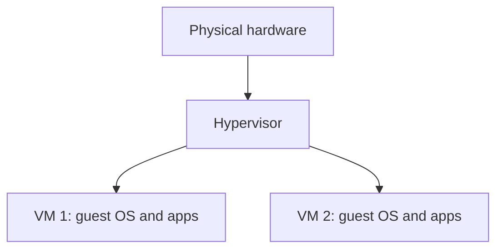
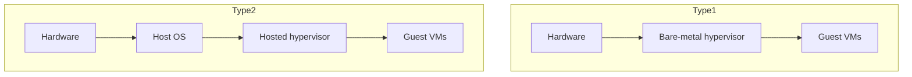
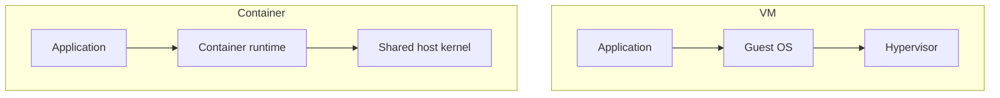
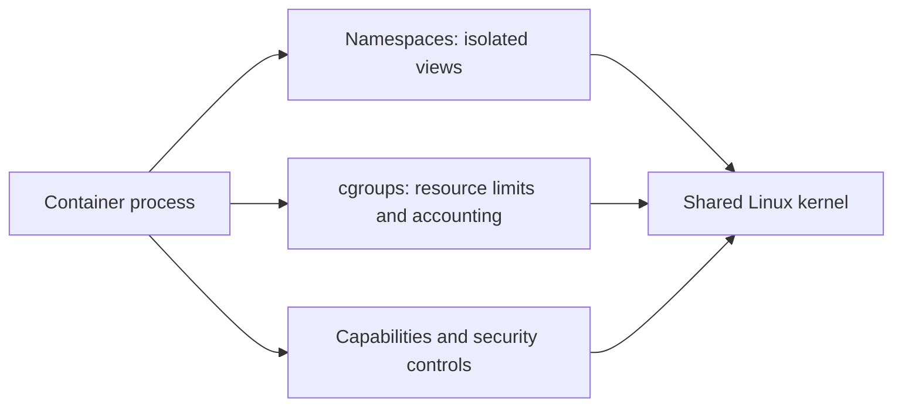
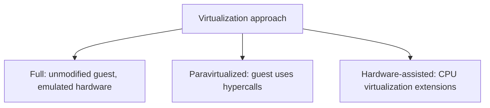

## 🖥️ 42. What is virtualization, and what problem does it solve?



এই chapter-এর context-এ **virtualization** হলো physical computer-এর CPU, memory, storage ও network resources abstract করে একাধিক isolated **virtual machine (VM)** তৈরি করার technique। Virtualization আরও broader concept—যেমন storage বা network virtualization—তবে এখানে মূল focus machine virtualization।

প্রতিটি VM নিজেকে আলাদা computer মনে করে এবং নিজের guest operating system চালাতে পারে।

Virtualization solve করে:

* এক physical server-এ multiple OS/workload চালানো
* resource utilization বাড়ানো
* workload isolation
* testing/development environment তৈরি
* legacy application support
* cloud infrastructure provisioning
* snapshot, migration, recovery সহজ করা

সহজভাবে:

```text
Physical Server
   └── Hypervisor
       ├── VM 1: Linux
       ├── VM 2: Windows
       └── VM 3: BSD
```

---

### What is a hypervisor, and what is its role?

**Hypervisor** হলো virtualization layer, যা physical hardware এবং virtual machines-এর মধ্যে বসে hardware resources virtualize ও manage করে।

Hypervisor-এর কাজ:

* VM create/run করা
* virtual CPU, memory, disk, network device provide করা
* VM isolation maintain করা
* CPU scheduling করা
* memory mapping manage করা
* virtual I/O handle করা
* resource limits/control enforce করা

প্রতিটি VM-এর ভেতরে একটি **guest OS** চলে। Hypervisor ensure করে যাতে এক VM অন্য VM-এর memory বা device state corrupt করতে না পারে।

---

## 🧱 43. What is the difference between a Type 1 and a Type 2 hypervisor?



Hypervisor দুই ধরনের:

* **Type 1 Hypervisor (Bare-metal)**
* **Type 2 Hypervisor (Hosted)**

---

### Type 1 Hypervisor

Type 1 hypervisor hardware-এর privileged virtualization layer-এ চলে; এটি ordinary host application হিসেবে execute করে না। তবে real deployment-এ management/root partition বা privileged domain থাকতে পারে—যেমন Hyper-V root partition, Xen dom0, অথবা KVM stack-এ Linux kernel ও user-space management components।

```text
Hardware
   └── Type 1 Hypervisor
       ├── VM 1
       ├── VM 2
       └── VM 3
```

**সুবিধা**

* high performance
* strong isolation
* enterprise/data center use-এর জন্য suitable
* resource control ভালো

**Examples**

* VMware ESXi
* Microsoft Hyper-V
* Xen
* KVM-based hypervisor stack, practical deployment-এ Linux kernel hypervisor role নেয়

> **Note:** Hyper-V Windows ecosystem-এর সাথে integrated হলেও architecture অনুযায়ী সাধারণত Type 1 hypervisor হিসেবে classify করা হয়।

---

### Type 2 Hypervisor

Type 2 hypervisor একটি existing host OS-এর উপর application হিসেবে চলে।

```text
Hardware
   └── Host OS
       └── Type 2 Hypervisor App
           ├── VM 1
           └── VM 2
```

**সুবিধা**

* setup সহজ
* development/testing/learning-এর জন্য convenient
* desktop user-এর জন্য practical

**অসুবিধা**

* extra host OS layer থাকায় overhead বেশি হতে পারে
* enterprise bare-metal use-এর জন্য Type 1 বেশি common

**Examples**

* Oracle VirtualBox
* VMware Workstation
* VMware Fusion
* Parallels Desktop

---

### Comparison

| বিষয় | Type 1 Hypervisor | Type 2 Hypervisor |
| ----- | ----------------- | ----------------- |
| কোথায় চলে | সরাসরি hardware-এর উপর | host OS-এর উপর application হিসেবে |
| Performance | সাধারণত বেশি | তুলনামূলক কম |
| Use case | data center, cloud, production | desktop, testing, learning |
| Isolation boundary | সাধারণত smaller privileged layer; management components-ও relevant | host OS security ও hypervisor app—দুইটির ওপর depend করে |
| Examples | ESXi, Hyper-V, Xen | VirtualBox, VMware Workstation |

---

## 📦 44. What is the difference between a virtual machine and a container?



**Virtual Machine (VM)** hardware-level virtualization ব্যবহার করে। প্রতিটি VM-এর নিজস্ব guest OS kernel থাকে।

**Container** OS-level virtualization ব্যবহার করে। Containers সাধারণত host OS kernel share করে, কিন্তু isolated user-space environment পায়।

---

### VM architecture

```text
Hardware
   └── Hypervisor
       ├── VM 1: Guest OS + App
       └── VM 2: Guest OS + App
```

VM-এর প্রতিটি guest OS নিজের kernel, drivers, system services এবং application stack নিয়ে চলে।

---

### Container architecture

```text
Hardware
   └── Host OS Kernel
       └── Container Runtime
           ├── Container 1: App + dependencies
           └── Container 2: App + dependencies
```

Container-এর নিজস্ব full kernel থাকে না। সে host kernel share করে, কিন্তু namespaces/cgroups/security mechanism দিয়ে isolation পায়।

---

### VM vs Container

| বিষয় | Virtual Machine | Container |
| ----- | --------------- | --------- |
| Virtualization level | hardware-level | OS-level |
| Kernel | প্রতি VM-এ আলাদা guest kernel | host kernel shared |
| Startup time | slow, seconds/minutes হতে পারে | fast, milliseconds/seconds |
| Resource usage | বেশি | কম |
| Isolation | stronger boundary | lighter boundary |
| OS flexibility | compatible virtual hardware-এ different guest kernel চালানো যায় | host kernel ABI share করতে হয়; অন্য kernel সাধারণত VM layer ছাড়া চলে না |
| Image size | large | smaller |
| Use case | strong isolation, multi-OS, legacy apps | microservices, packaging, deployment |

---

### Why are containers generally more lightweight and faster to start than VMs?

Containers lightweight কারণ:

* full guest OS boot করতে হয় না
* separate kernel load করতে হয় না
* virtual hardware initialize করতে হয় না
* host kernel share করে
* container image সাধারণত app + dependencies রাখে

তাই container startup সাধারণত process start করার কাছাকাছি lightweight হয়।

তবে:

> Container VM-এর replacement সবসময় নয়। VM stronger isolation এবং different OS kernel support দেয়; container faster packaging/deployment দেয়।

---

## 🔒 45. How do containers achieve isolation using Linux namespaces and cgroups?



Linux container মূলত kernel features ব্যবহার করে:

* **namespaces** — process কী দেখতে পাবে তা isolate করে
* **cgroups** — process কত resource ব্যবহার করতে পারবে তা control করে
* capabilities/seccomp/LSM — privilege ও syscall/security boundary সীমিত করে

---

### What types of namespaces exist, and what does each isolate?

**PID namespace**

Process ID space isolate করে। Container-এর ভিতরে process নিজেকে PID 1 মনে করতে পারে, যদিও host-এ তার আলাদা PID থাকে।

---

**Network namespace**

Network interfaces, IP address, routing table, firewall rules isolate করে।

Container নিজের virtual network interface পেতে পারে।

---

**Mount namespace**

Filesystem mount points isolate করে। Container নিজের root filesystem view পায়।

---

**UTS namespace**

Hostname এবং domain name isolate করে।

---

**IPC namespace**

System V IPC, POSIX message queues ইত্যাদি isolate করে।

---

**User namespace**

User/group ID mapping isolate করে। Container-এর ভিতরে root user host-এর real root না-ও হতে পারে।

---

**Cgroup namespace**

Process নিজের cgroup hierarchy কীভাবে দেখবে তা isolate করে।

---

**Time namespace**

Linux time namespace `CLOCK_MONOTONIC` ও `CLOCK_BOOTTIME` family-এর offsets virtualize করতে পারে। এটি wall-clock `CLOCK_REALTIME` virtualize করে না।

---

### Namespace Summary

| Namespace | কী isolate করে |
| --------- | -------------- |
| PID | process IDs |
| Network | interfaces, IP, routes, ports |
| Mount | filesystem mount view |
| UTS | hostname/domain |
| IPC | IPC resources |
| User | UID/GID mapping |
| Cgroup | cgroup hierarchy view |
| Time | clock offsets |

---

### How do cgroups enforce resource limits?

**cgroups (control groups)** process group-এর resource usage limit, account, এবং prioritize করতে ব্যবহৃত হয়।

cgroups দিয়ে control করা যায়:

* CPU time/share/quota
* memory limit
* block I/O weight/limit
* process count
* device access—cgroup v1 devices controller বা cgroup v2-এ cgroup-BPF policy দিয়ে
* CPU set/NUMA placement

Example:

```text
Container A: max 512 MB memory
Container B: max 2 CPU cores worth quota
Container C: limited block I/O bandwidth
```

যদি container memory limit ছাড়িয়ে যায়, kernel OOM handling trigger করতে পারে। CPU quota থাকলে scheduler container process-গুলোকে নির্দিষ্ট limit-এর বেশি CPU time দেবে না।

---

### Containers are isolated, not fully separate machines

Container isolation powerful হলেও VM-এর মতো full hardware boundary নয়।

Security hardening-এর জন্য often ব্যবহার হয়:

* user namespaces
* Linux capabilities drop করা
* seccomp syscall filtering
* AppArmor/SELinux
* read-only filesystem
* minimal images
* rootless containers

---

## ⚙️ 46. What is the difference between full virtualization, paravirtualization, and hardware-assisted virtualization?



Virtualization implementation-এর কয়েকটি approach আছে।

> এগুলো সবসময় mutually exclusive category নয়। Modern VM প্রায়ই hardware-assisted CPU/memory virtualization-এর সঙ্গে paravirtualized I/O driver (যেমন virtio) ব্যবহার করে; “full virtualization” guest compatibility model-কে বোঝাতে পারে।

---

### Full Virtualization

Full virtualization-এ guest OS মনে করে সে real hardware-এর উপর চলছে। Guest OS modify করতে হয় না।

Hypervisor virtual hardware provide করে এবং privileged operations trap/emulate করে।

**সুবিধা**

* unmodified guest OS চালানো যায়
* compatibility ভালো

**অসুবিধা**

* pure software emulation হলে overhead বেশি হতে পারে

---

### Paravirtualization

Paravirtualization-এ guest OS বা নির্দিষ্ট guest driver জানে যে সে virtualized environment-এ চলছে এবং hypervisor-এর optimized interface বা **hypercalls** ব্যবহার করে।

**সুবিধা**

* overhead কম হতে পারে
* I/O performance ভালো হতে পারে

**অসুবিধা**

* full guest modification (historical PV mode) অথবা paravirtual-aware drivers/support দরকার হতে পারে

Examples:

* Xen paravirtualization historically important
* Virtio drivers in KVM environments paravirtualized I/O-এর common example

---

### Hardware-assisted Virtualization

Modern CPU virtualization extensions provide করে:

* Intel VT-x
* AMD-V

এগুলো hypervisor-কে guest OS-এর privileged operations efficientভাবে handle করতে সাহায্য করে।

CPU আলাদা execution mode/support দেয় যাতে guest OS অনেক privileged instruction safeভাবে execute করতে পারে, আর sensitive event হলে control hypervisor-এর কাছে যায়।

---

### How does hardware-assisted virtualization improve performance?

Software-only virtualization-এ hypervisor-কে অনেক privileged instruction trap, translate, বা emulate করতে হতো। এতে overhead বেশি ছিল।

Hardware-assisted virtualization performance ও correctness simplify/improve করে:

* guest privileged code efficiently run করতে দেয়
* trap/exit handling standardized করে
* memory virtualization support দেয়, যেমন nested page tables
* CPU mode transitions safer/cleaner করে
* hypervisor complexity কমায়

তবে VM exit, nested translation, virtual I/O এবং scheduling overhead পুরোপুরি দূর হয় না; workload অনুযায়ী cost থাকে।

Memory virtualization-এর ক্ষেত্রে:

* Intel EPT (Extended Page Tables)
* AMD NPT/RVI (Nested Page Tables)

Guest virtual address → guest physical address → host physical address translation hardware support দিয়ে দ্রুত করা যায়।

---

### Comparison

| Approach | Guest OS modified? | Main idea | Performance |
| -------- | ------------------ | --------- | ----------- |
| Full virtualization | না | virtual hardware/emulation | hardware assist ছাড়া overhead বেশি হতে পারে |
| Paravirtualization | হ্যাঁ বা special drivers | guest hypervisor-aware | ভালো, especially I/O |
| Hardware-assisted | না | CPU virtualization extensions | modern default, efficient |

---

### VM vs Container vs Process: quick mental model

```text
Process      = same OS, normal isolation
Container    = same kernel, isolated user space + resource limits
VM           = virtual hardware + separate guest OS kernel
```

সংক্ষেপে:

* **VM** strong isolation এবং OS flexibility দেয়।
* **Container** fast startup, packaging, deployment এবং density দেয়।
* **Hypervisor** VM manage করে।
* **Namespaces + cgroups** container isolation/resource control দেয়।

---
