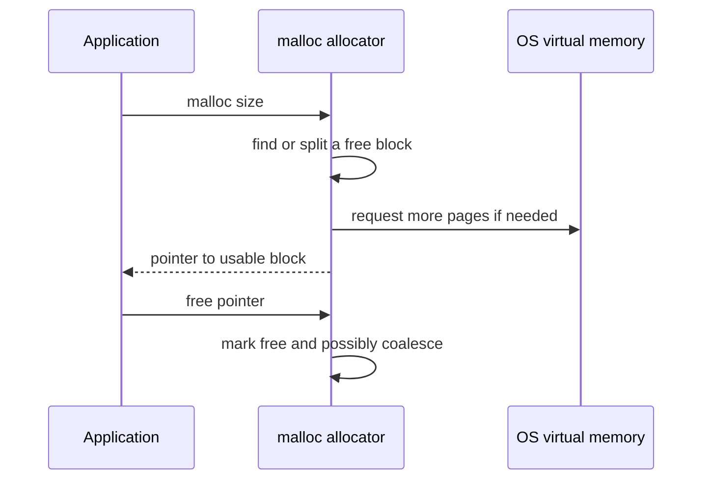
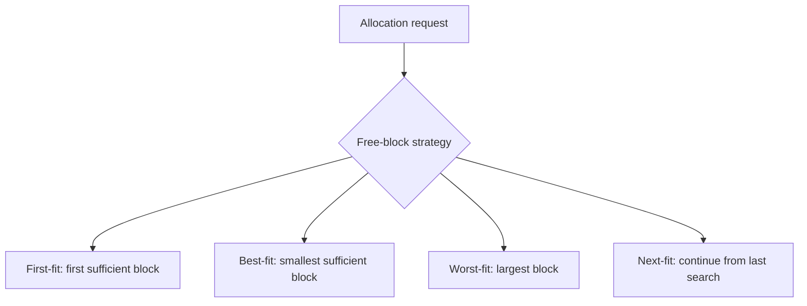
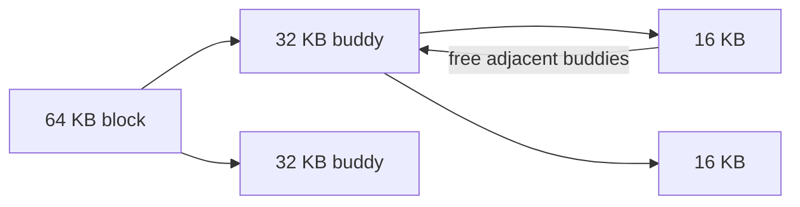
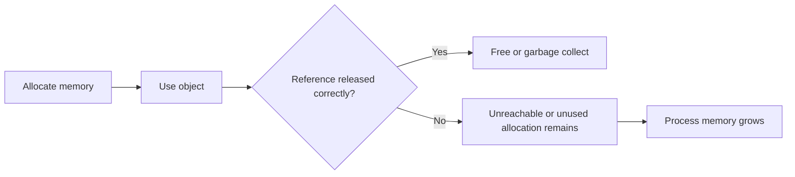
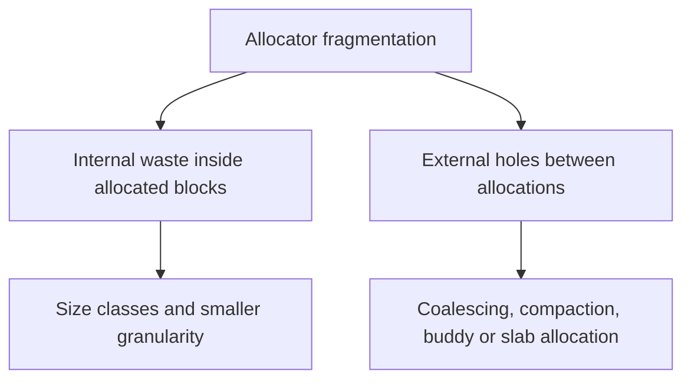

## 47. How does dynamic memory allocation work (e.g., malloc/free)?



**Dynamic memory allocation** হলো runtime-এ program-এর প্রয়োজন অনুযায়ী memory allocate এবং release করার process।

Static storage program lifetime অনুযায়ী এবং stack storage সাধারণত lexical scope/function-call lifetime অনুযায়ী manage হয়। কিন্তু অনেক data structure-এর size বা lifetime runtime behavior-এর ওপর নির্ভর করে:

* dynamic array
* linked list
* tree/graph
* request buffer
* object cache

এগুলোর জন্য program runtime-এ heap থেকে memory নেয়।


### malloc/free কীভাবে কাজ করে?

C-style manual memory management-এ (`C++`-এ সাধারণত `new/delete`, containers বা smart pointer prefer করা হয়):

```c
int *arr = malloc(10 * sizeof(int));

if (arr == NULL) {
    // allocation failed
}

free(arr);
```

**`malloc(size)`**

* heap থেকে অন্তত `size` bytes memory block খুঁজে দেয়
* success হলে pointer return করে
* fail হলে `NULL` return করতে পারে
* returned memory uninitialized থাকে

**`free(ptr)`**

* আগে allocate করা block allocator-এর কাছে ফেরত দেয়
* এরপর সেই block future allocation-এর জন্য reuse হতে পারে
* `free()` করার পর pointer use করলে **use-after-free** bug হয়
* `free(NULL)` safe no-op, কিন্তু একই live allocation দুইবার free করা undefined behavior
* allocator block reuse-এর জন্য রেখে দিতে পারে; `free()` মানেই সঙ্গে সঙ্গে RSS কমা বা memory OS-এ ফেরত যাওয়া নয়


### User allocator vs OS kernel

Important distinction:

* `malloc()` সাধারণত language runtime / C library allocator-এর function
* OS kernel প্রতিটি ছোট `malloc()` call directly handle করে না
* allocator বড় chunk memory OS থেকে নেয়, তারপর application-এর ছোট ছোট allocation নিজে manage করে

OS থেকে virtual memory region নেওয়ার common mechanism:

* Unix/Linux: `mmap`; main arena grow করতে `brk`/legacy `sbrk`-ও allocator implementation অনুযায়ী ব্যবহৃত হতে পারে
* Windows: `VirtualAlloc` এবং higher-level heap APIs

OS mapping demand-paged হতে পারে। তাই `malloc()` success সাধারণত allocator-visible virtual block দেয়; সব backing physical page তখনই RAM-এ resident হয়েছে—এমন নয়। Overcommit/commit policy অনুযায়ী later page fault-এ memory pressure বা OOM-ও ঘটতে পারে।

Flow:

```text
Application calls malloc()
        │
        ▼
User-space allocator checks free lists / arenas
        │
        ├── suitable block আছে → pointer return
        │
        └── নেই → OS থেকে বড় memory region request
                    │
                    ▼
              split/manage/return block
```


### What is the difference between memory allocated on the stack vs the heap?

**Stack memory**

ABI ও compiler decision অনুযায়ী function-call frame, saved return state এবং অনেক local variable/parameter-এর জন্য stack ব্যবহৃত হয়। Optimizer কিছু local register-এ রাখতে বা escape analysis-এর মাধ্যমে অন্য storage-এ নিতে পারে।

Example:

```c
void f() {
    int x = 10;   // stack allocation
}
```

Stack memory automatically allocate/free হয় function call enter/return-এর সাথে।

**Heap memory**

Heap runtime allocation-এর জন্য ব্যবহৃত হয়। Programmer বা runtime explicitly object lifetime manage করে।

Example:

```c
int *p = malloc(sizeof(int));  // heap allocation
free(p);
```


### Stack vs Heap

| বিষয় | Stack | Heap |
| ---- | ----- | ---- |
| Lifetime | সাধারণত block/call lifetime; automatic | programmer/runtime/GC controlled |
| Allocation speed | খুব দ্রুত | তুলনামূলক slow |
| Management | automatic | manual বা GC/runtime |
| Size | সীমিত | তুলনামূলক বড় |
| Fragmentation | সাধারণত কম | হতে পারে |
| Common bugs | stack overflow, dangling pointer to local | memory leak, use-after-free, double free |

> **Rule of thumb:** short-lived local data stack-এ ভালো; variable-size বা function lifetime-এর বাইরে দরকারি data heap-এ রাখতে হয়।


## 48. What are the common memory allocation strategies?



Dynamic memory allocator free memory blocks থেকে request-এর জন্য suitable block বেছে নেয়। Common strategies:

* **First-fit**
* **Best-fit**
* **Worst-fit**
* **Next-fit**

ধরা যাক free blocks:

```text
10 KB, 4 KB, 20 KB, 8 KB
```

Request: `6 KB`

Different strategy different block choose করবে।


### First-fit

Free list scan করে প্রথম যে block request satisfy করতে পারে, সেটি allocate করে।

Example:

```text
Free blocks: 10, 4, 20, 8
Request: 6
First-fit chooses 10 KB
```

**সুবিধা**

* fast
* scan কম লাগে
* practical allocators-এ variation হিসেবে common

**অসুবিধা**

* free list-এর শুরুতে ছোট fragments জমতে পারে


### Best-fit

যে free block request-এর জন্য সবচেয়ে ছোট কিন্তু sufficient, সেটি allocate করে।

Example:

```text
Free blocks: 10, 4, 20, 8
Request: 6
Best-fit chooses 8 KB
```

**সুবিধা**

* immediate leftover কম
* memory waste কম মনে হতে পারে

**অসুবিধা**

* পুরো list scan করতে হতে পারে
* খুব ছোট unusable fragments তৈরি করতে পারে


### Worst-fit

সবচেয়ে বড় free block allocate করে, যাতে leftover block এখনও বড় থাকে।

Example:

```text
Free blocks: 10, 4, 20, 8
Request: 6
Worst-fit chooses 20 KB
```

**সুবিধা**

* বড় leftover block রেখে দেয়

**অসুবিধা**

* বড় blocks দ্রুত ভেঙে যায়
* fragmentation কমাবে এমন guarantee নেই
* search overhead বেশি হতে পারে


### Next-fit

First-fit-এর মতো, কিন্তু প্রতিবার list-এর শুরু থেকে না খুঁজে last search position থেকে খোঁজা শুরু করে।

**সুবিধা**

* repeated scan কমতে পারে

**অসুবিধা**

* fragmentation behavior workload-dependent


### How do first-fit, best-fit, and worst-fit compare?

| Strategy | Speed | Fragmentation behavior | Main issue |
| -------- | ----- | ---------------------- | ---------- |
| First-fit | দ্রুত | moderate | list-এর শুরুতে fragments |
| Best-fit | slow হতে পারে | tiny fragments তৈরি করতে পারে | search cost |
| Worst-fit | slow হতে পারে | large blocks ভেঙে যায় | generally less practical |
| Next-fit | দ্রুত/moderate | workload-dependent | locality কমতে পারে |

বাস্তব allocators সাধারণ textbook first/best/worst-fit সরাসরি ব্যবহার করে না; তারা bins, size classes, arenas, caches, coalescing, splitting ইত্যাদি combine করে।


## 49. What is the buddy system, and how does it manage memory allocation?



**Buddy system** হলো memory allocation technique যেখানে memory power-of-two size block-এ manage করা হয়:

```text
1 KB, 2 KB, 4 KB, 8 KB, 16 KB, ...
```

যখন কোনো allocation request আসে, allocator request size-এর জন্য smallest suitable power-of-two block খুঁজে।

Example:

Request: `6 KB`

Smallest power-of-two block: `8 KB`

তাই 8 KB block allocate হবে।


### Buddy system কীভাবে কাজ করে?

ধরা যাক allocator-এর কাছে 64 KB block আছে।

Request: 8 KB

```text
64 KB
├─ 32 KB (free)
└─ 32 KB
   ├─ 16 KB (free)
   └─ 16 KB
      ├─ 8 KB (allocated)
      └─ 8 KB (free buddy)
```

Allocator বড় block বারবার split করে যতক্ষণ না required size-এর block পাওয়া যায়।


### Free করার সময়

যখন block free করা হয়, allocator দেখে তার **buddy block**-ও free আছে কি না।

যদি buddy free থাকে, দুই block merge করে বড় block বানানো হয়।

```text
8 KB + 8 KB → 16 KB
16 KB + 16 KB → 32 KB
32 KB + 32 KB → 64 KB
```


### How does the buddy system simplify merging of freed blocks?

Buddy system-এ প্রতিটি block-এর buddy deterministicভাবে বের করা যায়, কারণ block size power-of-two এবং aligned থাকে।

Arena-relative address ব্যবহার করলে conceptual formula:

```text
buddy_address = block_address XOR block_size
```

Conceptually:

* same size
* adjacent
* একই larger parent block থেকে split হয়েছিল

এ কারণে allocator সহজে check করতে পারে:

```text
Is my buddy free?
    yes → merge
    no  → keep current block free
```

**সুবিধা**

* splitting/merging simple
* coalescing efficient
* external fragmentation কমাতে সাহায্য করে
* kernel physical memory allocation-এ useful

**অসুবিধা**

* internal fragmentation হতে পারে
* 6 KB request করলে 8 KB allocate হয়, 2 KB waste
* arbitrary size allocation-এর জন্য exact fit নয়


## 50. What is a memory leak, and how can OS-level or language-level tools help detect them?



**Memory leak** হলো এমন bug যেখানে program heap memory allocate করে কিন্তু আর দরকার না থাকলেও release করে না, এবং সেই memory-এর reference হারিয়ে যায় বা unused থেকেও allocated থাকে।

Manual memory management example:

```c
void leak() {
    int *p = malloc(100 * sizeof(int));
    return; // free(p) করা হয়নি
}
```

Function return করার পর `p` local variable হারিয়ে গেল, কিন্তু heap block allocated রয়ে গেল। Program আর সেই memory free করতে পারবে না।


### Memory leak কেন সমস্যা?

* long-running process-এর memory usage বাড়তে থাকে
* system RAM pressure বাড়ে
* swapping/page fault বাড়তে পারে
* performance কমে
* process OOM kill বা crash করতে পারে

Server, daemon, browser, database-এর মতো long-running software-এ memory leak খুব serious।


### OS-level tools

OS-level tools memory usage observe করতে সাহায্য করে:

* Linux: `top`, `htop`, `ps`, `pmap`, `/proc/<pid>/smaps`
* Windows: Task Manager, Resource Monitor, Performance Monitor

এগুলো দেখাতে পারে:

* RSS বাড়ছে কি না
* virtual memory usage বাড়ছে কি না
* process দীর্ঘ সময়ে memory release করছে কি না

তবে RSS/virtual-size বৃদ্ধি একাই leak-এর proof নয়—allocator cache, file mapping, page cache accounting বা legitimate working-set growth-ও কারণ হতে পারে। OS-level tools সাধারণত exact leak source line বলে না; trend-এর পর heap profiler/sanitizer দিয়ে confirm করতে হয়।


### Language/runtime-level tools

Leak source ধরতে specialized tools দরকার হয়:

* Valgrind / Memcheck
* AddressSanitizer / LeakSanitizer
* heap profiler
* Java heap dump / VisualVM / JProfiler
* .NET memory profiler
* browser devtools memory profiler

এগুলো দেখাতে পারে:

* কোন allocation free হয়নি
* কোন object graph memory ধরে রেখেছে
* allocation stack trace
* use-after-free/double-free bugs


### How does garbage collection differ from manual memory management in addressing leaks?

**Manual memory management**

Programmer explicitly allocate/free করে।

```c
malloc()
free()
```

Problems:

* memory leak
* double free
* use-after-free
* dangling pointer


**Garbage collection (GC)**

Runtime automatically unreachable objects reclaim করে।

Example languages:

* Java
* C#
* Go
* JavaScript

GC reachable object graph trace করে। যেসব object আর reachable নয়, সেগুলো collect করা যায়।

**GC কী solve করে**

* forgotten free কমায়
* safe managed reference-এর ক্ষেত্রে manual use-after-free/double-free class-এর bug এড়ায়

Native interop, unsafe pointer বা off-heap resource থাকলে GC language-এও lifetime bug সম্ভব। GC memory ছাড়া file descriptor/socket-এর মতো resource timely close করার guarantee-ও দেয় না।

**GC কী solve করে না**

GC থাকা মানেই leak impossible নয়। যদি program অপ্রয়োজনীয় object-এর reference ধরে রাখে, GC সেটিকে live object মনে করবে।

Example:

* global list-এ old request object জমছে
* cache eviction নেই
* event listener remove করা হয়নি
* timer/closure object ধরে রেখেছে

এগুলোকে অনেক সময় **logical memory leak** বলা হয়।


## 51. What is fragmentation in the context of dynamic memory allocators, and how is it mitigated?



Dynamic memory allocator-এ fragmentation মানে heap memory এমনভাবে ভেঙে যাওয়া যে memory থাকলেও তা efficientভাবে ব্যবহার করা যাচ্ছে না।

দুই ধরনের fragmentation important:

* **Internal fragmentation**
* **External fragmentation**


### Internal fragmentation

Allocator request-এর চেয়ে বড় block দেয়, আর block-এর ভিতরে unused space থেকে যায়।

Example:

```text
Request: 33 bytes
Allocator size class: 64 bytes
Waste: 31 bytes
```

কারণ:

* alignment requirement
* size class rounding
* power-of-two allocation


### External fragmentation

Free memory অনেক ছোট ছোট block হিসেবে ছড়িয়ে থাকে। Total free memory যথেষ্ট হলেও বড় allocation satisfy করার মতো contiguous free block নেই।

Example:

```text
Free: 4 KB + 4 KB + 4 KB + 4 KB
Request: 12 KB contiguous block
Fail হতে পারে, কারণ একটানা 12 KB নেই
```


### Fragmentation mitigation techniques

**Splitting**

বড় free block থেকে ছোট request satisfy করে leftover অংশ free block হিসেবে রাখা।

**Coalescing**

Adjacent free blocks merge করে বড় free block বানানো।

**Size classes / bins**

Common sizes-এর জন্য আলাদা free lists রাখা।

**Buddy system**

Power-of-two blocks ব্যবহার করে split/merge সহজ করা।

**Compaction**

Moving GC বা managed runtime object move করে contiguous free space তৈরি করতে পারে। Native C heap-এ arbitrary pointer থাকার কারণে compaction কঠিন।

**Object pooling**

Frequently allocated object reuse করা, যাতে allocation/free churn কমে।


### How does slab allocation help reduce fragmentation for frequently allocated object types?

**Slab allocation** হলো kernel-এ commonly used object-caching allocation technique, যেখানে frequently used fixed-size object-এর জন্য cache/slab রাখা হয়। Similar size-class/object-cache idea user-space allocator-এও থাকতে পারে।

Kernel-এ অনেক object বারবার allocate/free হয়:

* process descriptor
* inode
* file object
* socket structure
* network buffer metadata

প্রতিবার generic allocator থেকে arbitrary size memory না নিয়ে slab allocator object-specific cache ব্যবহার করে।


### Slab allocation idea

```text
Cache for inode objects
   ├── Slab 1: [inode][inode][inode][inode]
   ├── Slab 2: [inode][inode][free ][free ]
   └── Slab 3: [free ][free ][free ][free ]
```

প্রতিটি cache নির্দিষ্ট object type/size-এর জন্য optimized।

**সুবিধা**

* allocation/free দ্রুত
* object-specific layout-এর কারণে generic allocator fragmentation/metadata overhead কমতে পারে
* object reuse হয়
* constructor/init cost কমতে পারে
* cache locality ভালো হতে পারে
* generic heap fragmentation কমে

**Trade-off**

* unused objects slab cache-এ আটকে থাকতে পারে
* memory reclaim policy দরকার
* many caches থাকলে management overhead বাড়ে


### Final comparison

| Technique | কী solve করে | Cost/Trade-off |
| --------- | ------------ | -------------- |
| Coalescing | external fragmentation | metadata/merge overhead |
| Splitting | oversized allocation waste কমায় | small fragments তৈরি হতে পারে |
| Size classes | fast allocation | internal fragmentation |
| Buddy system | easy split/merge | power-of-two waste |
| Slab allocation | frequent fixed object allocation | cache memory retention |
| GC compaction | fragmented heap compact করে | pause/moving object complexity |
