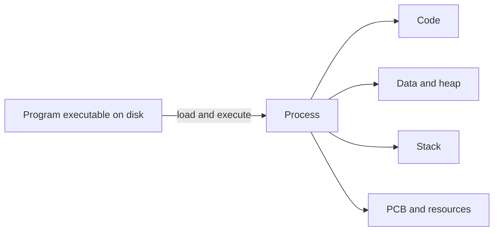
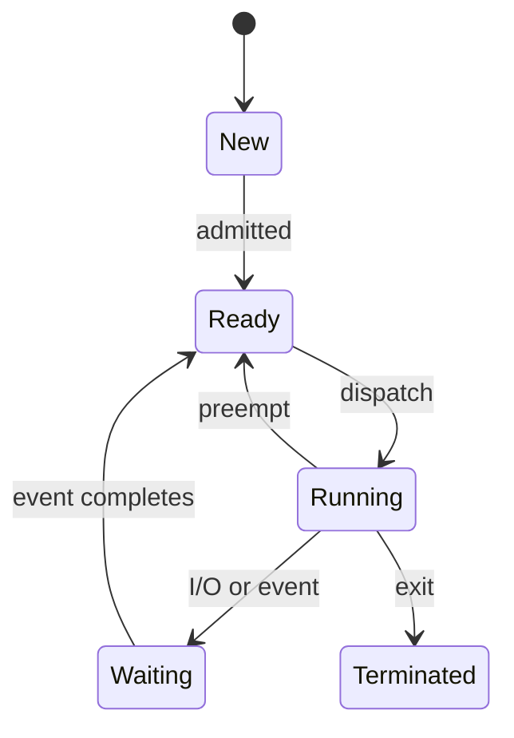
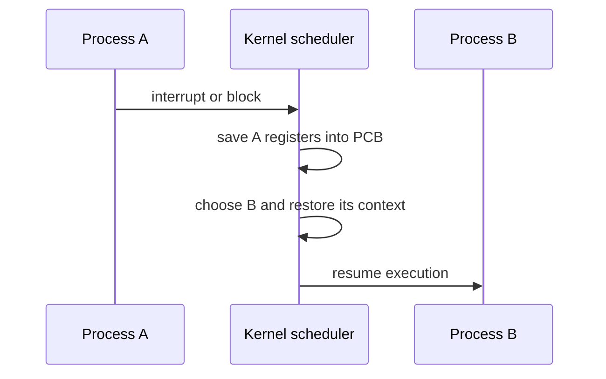
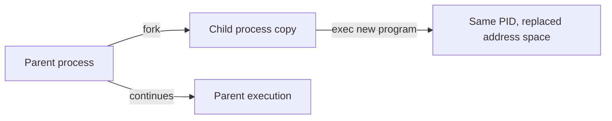
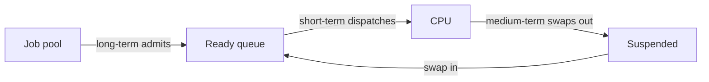

## 📦 5. What is a process, and how does it differ from a program?



একটি **program** হলো disk বা secondary storage-এ সংরক্ষিত **static set of instructions**—যেমন একটি executable file (`.exe`, ELF binary, script file ইত্যাদি)।
এটি নিজে চলমান নয়; এটি শুধু code এবং related data-এর একটি stored form।

> উদাহরণ: `chrome.exe` বা `/usr/bin/python3` disk-এ পড়ে আছে — এটি একটি **program**।


একটি **process** হলো **program in execution**—আরও নির্ভুলভাবে বললে, এটি কোনো program-এর একটি OS-managed execution instance, যার নিজস্ব execution state, virtual address space এবং associated resources থাকে। Process-টি বর্তমানে CPU-তে চলতে পারে, আবার Ready বা Waiting অবস্থাতেও থাকতে পারে।

সহজভাবে:

* **Program** = passive code on disk
* **Process** = active running instance of that code

একই program থেকে একাধিক process তৈরি হতে পারে।
যেমন, আপনি Chrome-এর একাধিক window বা renderer চালালে OS-এ একাধিক Chrome-related process থাকতে পারে।


**একটি process-এর সাথে কী কী জড়িত থাকে?**

একটি process শুধু executable code না; এর সাথে execution context ও resources-ও থাকে। সাধারণত একটি process-এর সাথে associated থাকে:

* **Text / Code segment** — executable instructions
* **Data segment** — global and static variables
* **Heap** — dynamically allocated memory
* **Stack** — function calls, local variables, return addresses
* **CPU execution context** — program counter, CPU registers, flags
* **OS resources** — open files, sockets, signals, scheduling info, security credentials ইত্যাদি

---

| বৈশিষ্ট্য      | Program                                           | Process                                                |
| -------------- | ------------------------------------------------- | ------------------------------------------------------ |
| প্রকৃতি        | Passive / static                                  | Active / dynamic                                       |
| কোথায় থাকে     | Disk / secondary storage                          | Virtual address space + kernel metadata; প্রয়োজনীয় page RAM-এ থাকে |
| কাজ            | শুধু instructions stored থাকে                     | instructions execute হয়                                |
| Resource usage | execution resource ব্যবহার করে না; storage-এ থাকে | CPU time, RAM, file handles, I/O resources ব্যবহার করে |
| Lifetime       | file হিসেবে থাকতে পারে যতক্ষণ delete না হয়        | execution চলাকালীন থাকে; terminate হলে শেষ             |
| Multiplicity   | একই program থেকে বহু instance চালানো যেতে পারে    | একই program থেকে একাধিক process তৈরি হতে পারে          |

---
ধরো **VS Code** install করা আছে।
Disk-এ থাকা VS Code-এর executable file হলো **program**।
আপনি যখন VS Code open করলেন, OS সেটিকে memory-তে load করল, resources দিল, CPU time দিল—এখন এটি একটি **process**।

---

### What information is stored in a Process Control Block (PCB)?

**Process Control Block (PCB)** হলো operating system kernel-এর একটি **per-process data structure** যেখানে একটি process-কে manage করার জন্য প্রয়োজনীয় তথ্য রাখা হয়।
প্রতিটি process-এর জন্য OS একটি PCB (বা equivalent process descriptor) maintain করে। PCB context switching, scheduling, memory management, এবং resource tracking-এর জন্য অত্যন্ত গুরুত্বপূর্ণ।

PCB-কে process-এর **“identity card”** বা **“kernel-side record”** বলা যায়।


#### PCB-তে সাধারণত কী কী থাকে?

**i) Process Identification Information**

* PID (Process ID)
* Parent PID (PPID)
* User / Group ID
* process credentials / ownership information


**ii) Process State**
Process বর্তমানে কোন অবস্থায় আছে:

* New
* Ready
* Running
* Waiting / Blocked
* Terminated


**iii) CPU Context / Register State**

* Program Counter (next instruction pointer)
* CPU registers
* Stack pointer
* Processor status / flags

এগুলো context switch-এর সময় save/restore করা হয়।


**iv) Scheduling Information**

* process priority
* scheduling class / policy
* time slice / CPU usage info
* ready-queue related links/pointers


**v) Memory Management Information**

* page table / virtual memory mapping info
* address space information
* code / data / stack / heap boundaries
* protection / memory limit related info


**vi) I/O and Resource Information**

* open file descriptors / handles
* allocated devices
* pending I/O status
* sockets / pipes / IPC-related handles


**vii) Accounting / Statistics**

* CPU time consumed
* creation/start time
* resource usage statistics
* quotas / limits / accounting info

---

### How does the OS keep track of multiple processes?

Operating system kernel সাধারণত সব process-এর জন্য **PCB/process descriptor** maintain করে।
এই PCB-গুলোকে kernel internally **process table** বা equivalent scheduling/resource-management structures-এ track করে।

OS process-গুলোকে তাদের state অনুযায়ী বিভিন্ন queue-তেও রাখে, যেমন:

* **Ready queue** → CPU পাওয়ার জন্য প্রস্তুত process
* **Wait / blocked queue** → I/O বা কোনো event-এর জন্য অপেক্ষমাণ process
* কিছু textbook-এ **job queue**-এর কথাও বলা হয়, যা system-এ admitted process/job set বোঝাতে ব্যবহৃত হয়


**Context Switch-এ PCB-এর ভূমিকা:**

যখন OS CPU-কে এক process থেকে অন্য process-এ দেয়, তখন **context switch** হয়।

**তখন OS কী করে?**

1. বর্তমানে চলমান process-এর **CPU context** (যেমন registers, program counter, stack pointer, state) save করে তার PCB/process structure-এ রাখে
2. next process-এর PCB থেকে saved context restore করে
3. CPU execution নতুন process-এ resume করে

এইভাবেই OS বহু process manage করে।


**Single-core vs Multi-core note**

* একটি **logical CPU**-তে একসময়ে একটি software thread/task execute হয়; OS rapid switching করে concurrency তৈরি করে
* একাধিক logical CPU/core থাকলে একাধিক thread/task সত্যিই parallel-এ চলতে পারে


```text
┌────────────────────────────┐
│ PCB / Process Descriptor   │
├────────────────────────────┤
│ PID / PPID / UID           │
│ Process State              │
│ Program Counter / Registers│
│ Scheduling Info            │
│ Memory Mapping Info        │
│ Open Files / I/O Status    │
│ Accounting / Usage Info    │
└────────────────────────────┘
```
---

## 🔄 6. What are the different states in the process lifecycle?



একটি process তার lifetime-এ সাধারণত কয়েকটি **state**-এর মধ্য দিয়ে যায়।
এই state-গুলো OS-কে বোঝাতে সাহায্য করে:

* process এখন **CPU-তে চলছে কিনা**
* CPU পাওয়ার জন্য **অপেক্ষা করছে কিনা**
* নাকি **I/O / event-এর জন্য blocked** আছে

Classic OS model-এ সাধারণত **৫টি মূল process state** ব্যবহার করা হয়:

* **New**
* **Ready**
* **Running**
* **Waiting / Blocked**
* **Terminated**

কিছু OS/textbook model-এ এর সাথে **Suspended Ready** বা **Suspended Blocked** state-ও দেখানো হয়, বিশেষ করে swapping বা memory pressure বোঝানোর সময়। তবে interview fundamentals-এর জন্য নিচের ৫-state model সবচেয়ে common।

> **Modern OS note:** এই model-টি process lifecycle বোঝানোর জন্য ব্যবহৃত হয়। বাস্তবে Linux, Windows-এর মতো modern OS scheduling state সাধারণত individual thread/task-এর জন্যও maintain করে।


**i) New**

Process সদ্য তৈরি হয়েছে। OS তার জন্য প্রয়োজনীয় kernel data structure (যেমন PCB/process descriptor) তৈরি করছে এবং execution-এর জন্য setup করছে।
এখনো এটি CPU scheduling-এর জন্য ready queue-তে যায়নি।


**ii) Ready**

Process **CPU পাওয়ার জন্য প্রস্তুত**, কিন্তু এখনো CPU পায়নি।
অর্থাৎ, এটি আর কোনো I/O বা event-এর জন্য অপেক্ষা করছে না—শুধু scheduler-এর কাছ থেকে CPU time পাওয়ার অপেক্ষায় আছে।

> **Ready state-এর মূল কথা:**
> Process এখনই চলতে পারবে, যদি CPU তাকে দেওয়া হয়।


**iii) Running**

Process-এর অন্তত একটি thread বর্তমানে CPU-তে instructions execute করছে। একটি logical CPU একসময়ে একটি software thread/task execute করতে পারে; multiple logical CPU/core থাকলে একই বা ভিন্ন process-এর একাধিক thread parallel-এ চলতে পারে।


**iv) Waiting / Blocked**

Process এখন CPU দিয়ে কিছু করতে পারবে না, কারণ এটি কোনো **event / I/O completion / synchronization condition**-এর জন্য অপেক্ষা করছে।

যেমন:

* disk I/O complete হওয়া
* network response আসা
* sleep timer শেষ হওয়া
* lock / semaphore available হওয়া
* child process শেষ হওয়া

এই সময়ে OS CPU অন্য ready process-কে দিতে পারে।


**v) Terminated**

Process execution শেষ করেছে বা OS সেটিকে terminate করেছে।
এরপর OS process-এর ব্যবহৃত resource release করে। Unix-like system-এ parent process exit status collect না করা পর্যন্ত process-এর ছোট bookkeeping entry **zombie process** হিসেবে সাময়িকভাবে থাকতে পারে, তারপর পুরোপুরি remove হয়।


```text
                  admit
      New -----------------> Ready
                               |
                               | dispatch
                               v
                            Running
                            /   |   \
                           /    |    \
                          /     |     \
                         v      v      v
                    Waiting   Ready  Terminated
                    (I/O /   (preempted,  (exit /
                     event)   time slice) killed)

Waiting -- event/I/O complete --> Ready
```

---

### What transitions exist between new, ready, running, waiting, and terminated states?

| Transition                         | From → To            | কারণ                                                                               |
| ---------------------------------- | -------------------- | ---------------------------------------------------------------------------------- |
| **Admit / Create**                 | New → Ready          | OS process-টিকে scheduling-এর জন্য প্রস্তুত করে ready queue-তে রাখে                |
| **Dispatch**                       | Ready → Running      | Scheduler process-টিকে CPU দেয়                                                    |
| **Preemption / Time Slice Expiry** | Running → Ready      | CPU অন্য process-কে দেওয়ার জন্য current process-কে ready queue-তে ফেরত পাঠানো হয় |
| **I/O or Event Wait**              | Running → Waiting    | Process I/O, lock, timer, child completion, বা অন্য event-এর জন্য অপেক্ষা করে      |
| **I/O / Event Complete**           | Waiting → Ready      | যে event-এর জন্য process blocked ছিল, তা complete হয়েছে                           |
| **Normal Exit / Crash**            | Running → Terminated | Running process execution শেষ করেছে বা unrecoverable error ঘটেছে                   |
| **External Termination**           | New/Ready/Running/Waiting → Terminated* | OS বা অন্য authorized process termination initiate করেছে                 |

\* বাস্তব OS-এ cleanup ও signal delivery-এর কারণে intermediate internal state থাকতে পারে; table-টি conceptual lifecycle দেখায়।

---

### What causes a process to move from "running" to "waiting"?

এটি process lifecycle-এর সবচেয়ে গুরুত্বপূর্ণ transition-গুলোর একটি।
একটি running process নিচের কারণগুলোতে **blocked / waiting** state-এ যেতে পারে:


**i) I/O Request**

Process disk, file system, printer, বা অন্য I/O device-এর সাথে কাজ করতে চায়।
I/O operation CPU execution-এর তুলনায় ধীর, তাই process wait করে।

**উদাহরণ:**

* file read / write
* database থেকে data fetch
* disk access


**ii) Network Request / Response Wait**

Process network-এর মাধ্যমে data পাঠিয়েছে বা response-এর জন্য অপেক্ষা করছে।

**উদাহরণ:**

* HTTP request পাঠিয়ে response-এর জন্য অপেক্ষা
* socket receive operation


**iii) Sleep / Timer Wait**

Process নিজেই কিছু সময়ের জন্য execution pause করতে পারে।

**উদাহরণ:**

* `sleep(5)`
* timer wait


**iv) Synchronization Wait**

Process কোনো shared resource access করতে চায়, কিন্তু lock/mutex/semaphore এখনো available না।

**উদাহরণ:**

* mutex lock-এর জন্য অপেক্ষা
* semaphore signal-এর জন্য blocked থাকা


**v) Child Process / Event Wait**

Parent process child process শেষ হওয়ার জন্য বা অন্য কোনো event-এর জন্য অপেক্ষা করতে পারে।

**উদাহরণ:**

* `wait()` / `waitpid()`
* signal/event completion wait


**vi) User / Console Input Wait**

কিছু interactive program terminal বা user input-এর জন্য blocked থাকতে পারে।

---

| বিষয়                           | Ready     | Waiting / Blocked                                 |
| ------------------------------- | --------- | ------------------------------------------------- |
| CPU পেলে কি এখনই চলতে পারবে?    | **হ্যাঁ** | **না**                                            |
| কীসের জন্য অপেক্ষা করছে?        | শুধু CPU  | I/O, event, timer, lock, child completion ইত্যাদি |
| Scheduler কি একে CPU দিতে পারে? | হ্যাঁ     | না, event complete না হওয়া পর্যন্ত না            |

---


## 🔁 7. What is context switching, and what overhead does it introduce?



যখন operating system CPU-র execution **একটি running task** (process বা thread) থেকে **অন্য একটি task**-এ স্থানান্তর করে, তখন সেই প্রক্রিয়াকে **context switch** বলে।

এখানে **context** বলতে বোঝায় সেই task-এর execution state — যেমন:

* program counter / instruction pointer
* CPU registers
* stack pointer
* processor flags / status
* scheduling state
* প্রয়োজনে address-space / memory-management context

সহজভাবে, context switch হলো:

> **বর্তমান task কোথায় থেমেছিল তা save করা, এবং অন্য task কোথায় থেমেছিল তা restore করে তাকে CPU-তে চালানো।**

---

### Context switch vs mode switch

এটি খুব গুরুত্বপূর্ণ:

**Mode switch**

CPU privilege level বদলায়:

* **user mode → kernel mode**
* **kernel mode → user mode**

এখানে একই process/thread চলতে পারে।

**Context switch**

CPU execution এক task থেকে অন্য task-এ চলে যায়।


* `getpid()` system call → kernel-এ গিয়ে same process-এ ফিরে এলো → **mode switch, but no context switch**
* blocking `read()` → process wait-এ গেল, scheduler অন্য process চালাল → **context switch**

---

**Context switch কখন হতে পারে?**

Context switch সাধারণত তখন হয় যখন scheduler সিদ্ধান্ত নেয় বর্তমান running task-এর বদলে অন্য task চালানো হবে। সাধারণ কারণগুলো হলো:

| কারণ                                    | ব্যাখ্যা                                                                   |
| --------------------------------------- | -------------------------------------------------------------------------- |
| **Time slice / quantum expiry**         | running task-এর allotted CPU time শেষ হয়েছে                                |
| **Blocking I/O / blocking system call** | task I/O, sleep, lock, child wait ইত্যাদির জন্য blocked হয়েছে              |
| **Higher-priority runnable task**       | বেশি priority-র task ready হয়েছে এবং preemption policy অনুযায়ী CPU পাবে    |
| **Yield / voluntary relinquish**        | current task নিজেই CPU ছেড়ে দিয়েছে                                         |
| **Interrupt-driven rescheduling**       | timer interrupt বা অন্য kernel event-এর পর scheduler অন্য task বেছে নিয়েছে |

---

**Interrupt হলেই কি context switch হয়?**

**না।**

Interrupt এলে CPU প্রথমে interrupt handler-এ যায়।
কিন্তু interrupt handle করার পর OS চাইলে **same task**-এ ফিরে যেতে পারে।
শুধু তখনই context switch হবে যখন kernel/scheduler সিদ্ধান্ত নেবে যে অন্য task চালানো উচিত।

---

**System call হলেই কি context switch হয়?**

**না।**

System call সাধারণত **mode switch** ঘটায়, কারণ CPU user mode থেকে kernel mode-এ যায়।
কিন্তু system call শেষে একই process-এ ফিরে আসা সম্ভব।

Context switch হবে তখনই যদি system call-এর কারণে process **block** হয়, sleep করে, wait করে, বা scheduler অন্য task চালানোর সিদ্ধান্ত নেয়।

---

### What information must be saved and restored during a context switch?

**Save করা হয় (বর্তমান running task-এর জন্য)**

সাধারণত kernel বর্তমান task-এর execution context save করে তার PCB / task structure-এ:

* **Program Counter / Instruction Pointer**
* **CPU Registers**
* **Stack Pointer**
* **Processor Flags / Status Register**
* **Scheduling state**
* প্রয়োজনে architecture-specific execution state

**Restore করা হয় (পরবর্তী task-এর জন্য)**

নতুন task-এর saved execution context load করা হয়:

* program counter
* registers
* stack pointer
* flags / status
* task state

যদি next task ভিন্ন address space-এর process হয়, তাহলে OS/MMU-কে সেই process-এর memory mapping context-এ switch করতে হয়।

---

#### ধাপে ধাপে Context Switch

```text
Process/Thread A running
        │
        ▼
1) Timer / block / scheduler event occurs
        │
        ▼
2) Kernel gains control
        │
        ▼
3) A-এর CPU context save করা হয়
        │
        ▼
4) Scheduler next runnable task B নির্বাচন করে
        │
        ▼
5) B-এর saved context restore করা হয়
        │
        ▼
6) CPU B-কে execute করতে শুরু করে
```

---
**PCB / Task Structure-এর ভূমিকা**

প্রতিটি process (বা thread/task)-এর জন্য OS একটি kernel-side structure maintain করে, যেখানে scheduling এবং execution state রাখা হয়।
Context switch-এর সময় এই structure-এই current task-এর state save করা হয় এবং next task-এর state restore করা হয়।

---

### Context switch overhead কেন হয়?

Context switch useful application work নয়; এটি **management overhead**।
এই সময়ে CPU actual application logic না চালিয়ে switching-এর কাজ করে।


**i) Direct overhead**

এগুলো context switch-এর immediate cost:

* current task-এর registers save করা
* next task-এর registers restore করা
* kernel scheduler run করা
* task state update করা
* প্রয়োজনে address-space switch setup করা


**ii) Indirect overhead**

এগুলো প্রায়ই আরও বড় performance impact তৈরি করে:

**Cache locality loss**

নতুন task-এর working set আগের task-এর থেকে আলাদা হতে পারে। ফলে CPU cache-এ আগের data কম useful হয়ে যায়, এবং cache miss বাড়ে।

**TLB effects**

যদি ভিন্ন address space-এ switch হয়, memory translation cache (TLB)-এর কিছু entry invalid হতে পারে বা less useful হয়ে যেতে পারে। modern CPU-র ASID/PCID mechanism এই cost কিছুটা কমাতে পারে।

**Branch predictor / pipeline / CPU state effects**

নতুন execution stream-এ CPU-র prediction/locality সুবিধা কমে যেতে পারে, ফলে performance penalty হয়।

---

### Process switch vs thread switch

সব context switch একই cost-এর হয় না।

**Process switch**

যদি scheduler এক process থেকে অন্য unrelated process-এ যায়:

* address space বদলাতে হতে পারে
* TLB/cache locality loss বেশি হতে পারে

**Thread switch within same process**

যদি একই process-এর দুই thread-এর মধ্যে switch হয়:

* address space সাধারণত একই থাকে
* কিছু memory-management overhead কম হতে পারে

তবে এটাও context switch — কারণ execution context বদলাচ্ছে।

---

### How does the frequency of context switches affect system performance?

**বেশি context switch হলে**

* responsiveness ভালো হতে পারে
* fairness বাড়তে পারে
* কিন্তু overhead বাড়ে
* throughput কমতে পারে

**কম context switch হলে**

* overhead কম
* throughput বাড়তে পারে
* কিন্তু interactive response খারাপ হতে পারে
* একটি task বেশি সময় CPU ধরে রাখতে পারে

---

## 👶 8. What is the difference between fork() and exec()?



`fork()` হলো একটি Unix/Linux **system call** যা calling process-এর ভিত্তিতে একটি নতুন **child process** তৈরি করে।

Child process parent-এর **অনেক state inherit করে** এবং শুরুতে parent-এর execution state-এর খুব কাছাকাছি অবস্থায় থাকে। `fork()` call শেষ হওয়ার পর parent এবং child—দুই process-ই `fork()`-এর পরের instruction থেকে চলতে থাকে।

> **Note:** `fork()` POSIX/Unix-like OS-এর concept। Windows-এ process creation সাধারণত `CreateProcess()` API দিয়ে হয়, যেখানে fork-exec model-এর মতো exact split নেই।

```c
pid_t pid = fork();

if (pid == 0) {
    // child process
} else if (pid > 0) {
    // parent process
} else {
    // error
}
```

**`fork()` return value**

* **Parent process-এ** → child-এর PID
* **Child process-এ** → `0`
* **Error হলে** → `-1`

---

**`fork()`-এর পরে কী inherit হয়?**

Child process সাধারণত parent থেকে inherit করে:

* program code / address space-এর logical copy
* open file descriptors
* current working directory
* environment
* user/group credentials-এর relevant অংশ
* signal disposition-এর অনেক সেটিং

তবে child-এর **নিজস্ব PID** থাকে, এবং তার execution identity parent থেকে আলাদা।

---

**`fork()`-এর পরে memory কীভাবে কাজ করে?**

ধারণাগতভাবে child process parent-এর address space-এর একটি copy পায়।
কিন্তু modern OS সাধারণত **Copy-on-Write (COW)** ব্যবহার করে।

এর মানে:

* parent এবং child শুরুতে একই physical memory pages share করতে পারে
* কোনো process write করতে গেলে তখনই OS সেই page-এর private copy তৈরি করে

এতে `fork()` অনেক দ্রুত হয়, কারণ শুরুতেই পুরো memory copy করতে হয় না।

---

**`fork()`-এর পরে file descriptor কী হয়?**

Child parent-এর file descriptor table-এর copy পায়, কিন্তু এই descriptors সাধারণত একই **open file description**-কে refer করে।
তাই:

* একই file offset share হতে পারে
* একজন read/write করলে offset অন্যজনের দিকেও প্রভাব ফেলতে পারে
* pipe/socket inheritance-এর মাধ্যমে parent-child communication করা যায়

---


`exec()` family of functions বর্তমান process-এর **পুরোনো program image replace** করে সেখানে একটি **নতুন program** load করে। POSIX-এ এই family শেষ পর্যন্ত `execve()`-এর মতো underlying system call invoke করে।

এটি **নতুন process তৈরি করে না**। বরং **same process**, same PID, but **new program image**।

```c
execl("/bin/ls", "ls", "-l", NULL);
perror("execl failed");   // exec fail করলে তবেই এখানে আসবে
```

**`exec()` successful হলে:**

* পুরোনো code, data, heap, stack replace হয়
* নতুন executable load হয়
* PID একই থাকে
* কিছু process attributes বজায় থাকে
* open file descriptors সাধারণত খোলা থাকে, **যদি close-on-exec flag set না থাকে**
* multithreaded process-এ successful `exec()`-এর পর calling thread-টিই নতুন program image চালায়; অন্য thread-গুলো আর থাকে না

---

**`fork()` vs `exec()`**

| বিষয়                  | `fork()`                             | `exec()`                                     |
| --------------------- | ------------------------------------ | -------------------------------------------- |
| কাজ                   | নতুন child process তৈরি করে          | বর্তমান process-এর program image replace করে |
| নতুন process তৈরি হয়? | হ্যাঁ                                | না                                           |
| PID                   | child নতুন PID পায়                   | PID একই থাকে                                 |
| Memory image          | parent-এর logical copy দিয়ে শুরু     | পুরোপুরি নতুন program image load হয়          |
| Return behavior       | parent ও child—দুই জায়গায় return করে | successful হলে return করে না                 |

---

### Why are fork() and exec() often used together?

Unix shell নতুন program চালাতে সাধারণত এই pattern ব্যবহার করে:

i. **Parent** `fork()` করে child তৈরি করে

ii. **Child** প্রয়োজনীয় setup করে

   * stdin/stdout redirect
   * pipe attach
   * environment adjust

iii. **Child** `exec()` call করে নতুন program চালায়

iv. **Parent** চাইলে `wait()` দিয়ে child-এর জন্য অপেক্ষা করে

এটিই classic **fork-exec model**।

---


## 📋 9. What is process scheduling, and what are the roles of the long-term, short-term, and medium-term schedulers?



Process scheduling হলো OS-এর সেই mechanism যার মাধ্যমে OS সিদ্ধান্ত নেয় **ready অবস্থায় থাকা runnable task/thread-গুলোর মধ্যে কে CPU পাবে, কখন পাবে, এবং কতক্ষণ পাবে**। Textbook-এ একে process scheduling বলা হলেও mainstream modern OS সাধারণত individual thread/task schedule করে। এই chapter-এ scheduler-এর role বোঝানো হচ্ছে; individual CPU scheduling algorithm chapter 4-এ বিস্তারিত আছে।

একটি **logical CPU** এক সময়ে একটি runnable thread/task execute করতে পারে। তাই multiple runnable task থাকলে scheduler CPU time ভাগ করে দেয়; mainstream modern OS-এ scheduling unit সাধারণত thread/task, পুরো process নয়।


**Scheduler-এর classic তিন ভাগ**

Textbook operating systems-এ scheduler-কে সাধারণত তিন ভাগে বোঝানো হয়:

i. **Long-term scheduler**

ii. **Short-term scheduler (CPU scheduler)**

iii. **Medium-term scheduler**

---

**i) Long-term Scheduler (Job Scheduler)**

এর কাজ হলো system-এ নতুন job/process admit করা — অর্থাৎ job pool থেকে কোন process memory-তে এনে runnable set-এর অংশ করা হবে তা ঠিক করা।

**Role**

* system load control
* multiprogramming degree control
* CPU-bound vs I/O-bound workload balance

**Note**

Modern Linux/Windows/macOS-এ textbook-style separate long-term scheduler স্পষ্টভাবে নাও থাকতে পারে; admission/load control অন্য mechanism-এ handle হতে পারে।

---

**ii) Short-term Scheduler (CPU Scheduler)**

এটি ready queue থেকে **পরবর্তী runnable task** নির্বাচন করে CPU দেয়।
এটাই সবচেয়ে frequent scheduler।

**এর লক্ষ্য**

* CPU utilization
* throughput
* fairness
* response time
* turnaround time

**Common algorithms**

* FCFS
* SJF / SRTF
* Round Robin
* Priority scheduling
* Multilevel queue / feedback queue

---

**Dispatcher কী?**

**Scheduler** সিদ্ধান্ত নেয় **কাকে** CPU দেওয়া হবে।
**Dispatcher** সেই সিদ্ধান্ত বাস্তবে কার্যকর করে:

* context switch করে
* CPU mode/state prepare করে
* selected task-কে resume/run করায়

সংক্ষেপে:

> **Scheduler chooses; dispatcher hands over the CPU.**

---

**iii) Medium-term Scheduler**

Classic model-এ medium-term scheduler memory pressure কমানোর জন্য কিছু process-কে temporarily memory থেকে সরিয়ে **suspended** অবস্থায় রাখতে পারে, পরে আবার ফিরিয়ে আনতে পারে।

এটি **swapping** ধারণার সাথে সম্পর্কিত।


**Swapping কী?**

Swapping ঐতিহাসিকভাবে বোঝাতো কোনো process-কে RAM থেকে disk swap space-এ সরিয়ে রাখা, পরে দরকার হলে ফিরিয়ে আনা।

তবে modern OS-এ সাধারণত পুরো process swap করার বদলে **virtual memory paging** ব্যবহৃত হয়, যেখানে:

* individual pages evict করা হয়
* swap-backed page storage ব্যবহার হয়
* demand paging হয়

তাই classic swapping model এখন মূলত conceptual explanation হিসেবে বেশি ব্যবহৃত হয়।

---

**তিন scheduler-এর refined comparison**

| বিষয়             | Long-term Scheduler                   | Short-term Scheduler                     | Medium-term Scheduler                           |
| ---------------- | ------------------------------------- | ---------------------------------------- | ----------------------------------------------- |
| মূল কাজ          | System-এ job/process admit করা        | Ready task থেকে CPU allocation           | Memory pressure কমাতে suspended/swapping policy |
| Frequency        | কম                                    | খুব বেশি                                 | মাঝে মাঝে / memory-pressure dependent           |
| Focus            | Multiprogramming degree, workload mix | CPU efficiency, responsiveness, fairness | Memory management / resident set control        |
| Modern relevance | Separate component হিসেবে কম visible  | সব OS-এ central                          | Classic form কম, VM subsystem বেশি গুরুত্বপূর্ণ |

---
