## 🎯 14. What are the key goals/criteria of a CPU scheduling algorithm?

একটি ভালো CPU scheduler ডিজাইন করতে গেলে নিচের criteria গুলো maximize বা minimize করার চেষ্টা করা হয়।

### Main Scheduling Criteria

**Maximize করতে হয়**

**CPU Utilization** — CPU-কে যত বেশি সম্ভব কার্যকর (busy) রাখা এবং idle time কমিয়ে আনা। CPU utilization যত বেশি হবে, system-এর resource তত ভালোভাবে ব্যবহার হবে।

**Throughput** — প্রতি unit time-এ কতটি process সম্পন্ন হয়েছে। Throughput যত বেশি হবে, system তত বেশি কাজ সম্পন্ন করতে পারবে। এটি বিশেষ করে **batch system**-এ অত্যন্ত গুরুত্বপূর্ণ।

**Minimize করতে হয়**

**Turnaround Time, Waiting Time, এবং Response Time** — এই তিনটি যত কম হবে, system-এর performance এবং user experience তত ভালো হবে।

**Balance করতে হয়**

**Fairness** — কোনো process যেন অনির্দিষ্টকাল CPU থেকে বঞ্চিত না হয়।

**Predictability** — real-time বা latency-sensitive workload-এ scheduler-এর behavior predictable হওয়া গুরুত্বপূর্ণ।

---

### What is the difference between turnaround time, waiting time, and response time?

একটি process-এর scheduling performance বোঝার জন্য তিনটি metric সবচেয়ে common।

#### Turnaround Time

Process submit (arrival) করার মুহূর্ত থেকে শুরু করে সেটি সম্পূর্ণ শেষ হওয়া পর্যন্ত মোট সময়।

> **Turnaround Time = Completion Time − Arrival Time**

---

#### Waiting Time

Process টি Ready Queue-তে থেকে CPU পাওয়ার জন্য যত সময় অপেক্ষা করেছে, সেই সময়গুলোর সমষ্টি। CPU execution-এর সময় waiting time-এর মধ্যে গণনা করা হয় না।

> **Waiting Time = Ready Queue-তে কাটানো মোট সময়**

শুধু CPU burst থাকা এবং আলাদা I/O wait না থাকার simplified case-এ:

> **Waiting Time = Turnaround Time − Total CPU Burst Time**

I/O থাকলে turnaround time-এর মধ্যে I/O wait-ও থাকে, তাই তখন শুধু এই subtraction formula ব্যবহার করা যাবে না।

---

#### Response Time

Process arrive করার পর প্রথমবার CPU পাওয়া পর্যন্ত সময়। অর্থাৎ process প্রথমবার execution শুরু করতে যত সময় লাগে। Interactive system-এ এটি সবচেয়ে গুরুত্বপূর্ণ, কারণ user কত দ্রুত প্রথম response পাচ্ছে সেটি এটি নির্দেশ করে।

> **Response Time = First Start Time − Arrival Time**

---

ধরো একটি process **t = 0**-তে arrive করল, **t = 5**-এ প্রথমবার CPU পেল, **t = 30**-এ execution শেষ হলো এবং এর **Burst Time = 20**।

তাহলে,

* **Response Time = 5 − 0 = 5**
* **Turnaround Time = 30 − 0 = 30**
* **Waiting Time = 30 − 20 = 10**

---

### How do throughput and fairness factor into scheduler design?

**SJF/SRTF** known বা accurately estimated burst time-এর ক্ষেত্রে average waiting/turnaround time কমাতে পারে। তবে এটিকে সরাসরি “throughput maximization” বলা ঠিক নয়; throughput workload mix, I/O wait, context-switch cost, admission policy এবং hardware resource-এর ওপরও নির্ভর করে। SJF/SRTF-এর একটি বড় সমস্যা হলো **starvation**—নতুন short job আসতে থাকলে দীর্ঘ burst time-এর process দীর্ঘক্ষণ CPU না-ও পেতে পারে।

**Fairness** নিশ্চিত করার জন্য **Round Robin (RR)** বা **Aging** ব্যবহার করা হয়। Round Robin-এ প্রতিটি process একটি নির্দিষ্ট **time quantum** পায়, ফলে কোনো process দীর্ঘ সময় CPU থেকে বঞ্চিত হয় না। অন্যদিকে Aging-এ যে process দীর্ঘক্ষণ অপেক্ষা করছে, তার priority ধীরে ধীরে বাড়িয়ে দেওয়া হয়, যাতে starvation না ঘটে।

সবশেষে, scheduler design-এর মূল trade-off হলো **throughput**, **fairness**, এবং **responsiveness**-এর মধ্যে ভারসাম্য বজায় রাখা। একটি metric optimize করলে অন্যটির cost বাড়তে পারে। Linux-এর fair scheduling class historically **CFS (Completely Fair Scheduler)** ব্যবহার করেছে; Linux 6.6 থেকে kernel ধীরে ধীরে **EEVDF (Earliest Eligible Virtual Deadline First)**-ভিত্তিক task selection-এ transition করেছে। উভয়ের লক্ষ্য runnable task-গুলোর মধ্যে fair CPU-time distribution ও responsiveness বজায় রাখা।

## ⏸️ 15. What is the difference between preemptive and non-preemptive scheduling?

**Non-preemptive scheduling** — একটি process একবার CPU পেলে, সে নিজে থেকে CPU ছেড়ে না দেওয়া পর্যন্ত (যেমন execution শেষ করা বা I/O wait-এ যাওয়া) Operating System জোর করে CPU কেড়ে নিতে পারে না। অর্থাৎ CPU একবার কোনো process-কে দিলে সেটি স্বেচ্ছায় relinquish না করা পর্যন্ত অন্য কোনো process CPU পায় না।

ধরো **P2** `t = 2`-তে arrive করেছে, কিন্তু non-preemptive scheduling-এ **P1** CPU ছাড়ার আগে তাকে অপেক্ষা করতে হতে পারে, যদিও **P2**-এর burst time কম।

---

**Preemptive scheduling** — Operating System প্রয়োজন হলে একটি running process-কে interrupt করে CPU অন্য process-কে দিতে পারে। সাধারণত **timer interrupt**, **উচ্চতর priority-র process arrive করা**, অথবা **time quantum শেষ হয়ে যাওয়া**-র কারণে preemption ঘটে।

Preemptive scheduling-এ **P1** চলতে চলতে ছোট বা বেশি priority-র process ready হলে OS **P1**-কে pause করে অন্য process চালাতে পারে। ফলে interactive বা urgent কাজ দ্রুত response পেতে পারে।

---

### What are the trade-offs in terms of responsiveness and overhead?

**Responsiveness**

Preemptive scheduling-এ responsiveness অনেক বেশি। কোনো high-priority বা short job এলে সেটি দ্রুত CPU পেতে পারে। এজন্য আধুনিক interactive operating system (যেমন Linux, Windows এবং macOS) preemptive scheduling ব্যবহার করে।

অন্যদিকে, Non-preemptive scheduling-এ একটি বড় CPU-bound process দীর্ঘ সময় CPU দখল করে রাখতে পারে। ফলে ছোট বা I/O-bound process-গুলো অপ্রয়োজনীয়ভাবে অপেক্ষা করতে পারে। FCFS-এর মতো algorithm-এ এই সমস্যাকে **Convoy Effect** বলা হয়।

---

**Context Switch Overhead**

Preemptive scheduling-এর প্রধান অসুবিধা হলো **ঘন ঘন context switch** হওয়া।

প্রতিটি context switch-এর সময় Operating System-কে বর্তমান process-এর state (যেমন **CPU registers, Program Counter (PC), Stack Pointer (SP)** এবং অন্যান্য execution context) সংরক্ষণ করতে হয় এবং পরবর্তী process-এর state পুনরায় restore করতে হয়। এই কাজ অতিরিক্ত CPU time ও system resource ব্যবহার করে, ফলে scheduling overhead বেড়ে যায়।

অন্যদিকে, Non-preemptive scheduling-এ context switch তুলনামূলক কম হওয়ায় overhead-ও কম হয়।

---

**Race Condition এবং Shared Data**

Preemptive scheduling execution-এর সম্ভাব্য interleaving বাড়ায়। Shared data বা kernel data structure synchronization ছাড়া update করলে preemption-এর কারণে **race condition** বা **data inconsistency** প্রকাশ পেতে পারে। তবে race condition শুধু preemptive scheduling-এর কারণে হয় না—multi-core parallel execution, interrupts এবং asynchronous events-ও একই সমস্যা তৈরি করতে পারে।

এই সমস্যা এড়ানোর জন্য Operating System-কে **critical section** সুরক্ষিত রাখতে **lock**, **mutex**, **spinlock**, অথবা নির্দিষ্ট low-level context-এ local interrupt/preemption control-এর মতো mechanism ব্যবহার করতে হয়। শুধু interrupt disable করা multi-core system-এ অন্য core-এর concurrent access বন্ধ করে না।

---

**Real-time System-এ**

Hard real-time system-এ নির্দিষ্ট **deadline** মেনে চলা অত্যন্ত গুরুত্বপূর্ণ। তাই সেখানে preemptive priority scheduling বা EDF-এর মতো deadline-aware scheduling policy দরকার হতে পারে, যাতে জরুরি task সময়মতো CPU পায়।

অন্যদিকে, batch processing system-এ responsiveness-এর তুলনায় throughput বেশি গুরুত্বপূর্ণ। তাই কিছু ক্ষেত্রে non-preemptive scheduling উপযুক্ত হতে পারে, কারণ এতে scheduling overhead কম থাকে।

---

## 📊 16. Can you explain the common CPU scheduling algorithms?

**FCFS, SJF/SRTF, Priority, এবং Round Robin**

প্রতিটি algorithm আলাদাভাবে বুঝতে চারটির Gantt chart পাশাপাশি দেখা সবচেয়ে কার্যকর। ধরো তিনটি process: **P1 (Burst = 6), P2 (Burst = 2), P3 (Burst = 4)** — সবাই **t = 0**-তে arrive করেছে।

**FCFS (First-Come, First-Served)**

Queue-তে যে process আগে আসে, সে-ই আগে CPU পায়। এটি সবচেয়ে সহজ scheduling algorithm এবং implementation-ও সহজ।

তবে যদি একটি বড় job আগে এসে CPU দখল করে, তাহলে ছোট process-গুলোকে দীর্ঘ সময় অপেক্ষা করতে হয়। এই সমস্যাকে **Convoy Effect** বলা হয়। ফলে average waiting time এবং average turnaround time অনেক বেড়ে যেতে পারে।

---

**SJF (Shortest Job First)**

যে process-এর **CPU Burst Time** সবচেয়ে কম, সেটি আগে execution পায়।

সব job একই সময়ে available এবং burst time আগে থেকে জানা থাকলে non-preemptive **SJF average waiting time minimize করে**; corresponding completion order average turnaround time-ও minimize করে। ভিন্ন arrival time ও preemption allowed হলে **SRTF** এই objective-এর relevant optimal form।

তবে বাস্তবে একটি বড় সমস্যা হলো ভবিষ্যতের CPU burst time আগে থেকে সঠিকভাবে জানা যায় না। এছাড়া দীর্ঘ burst time-এর process দীর্ঘক্ষণ অপেক্ষা করতে পারে, ফলে **starvation** হতে পারে।

**SRTF (Shortest Remaining Time First)** হলো SJF-এর preemptive version। নতুন process এলে যদি তার remaining time current running process-এর remaining time-এর চেয়ে কম হয়, তাহলে scheduler current process-কে preempt করতে পারে।

---

**Priority Scheduling**

এখানে প্রতিটি process-এর একটি **priority** থাকে। সর্বোচ্চ priority-সম্পন্ন process আগে CPU পায়।

Priority **static** বা **dynamic**—দুই ধরনেরই হতে পারে।

> **Note:** কোনো system-এ ছোট priority number বেশি priority বোঝায়, আবার কোনো system-এ বড় number বেশি priority বোঝাতে পারে। তাই convention পরিষ্কার করা জরুরি।

**SJF-কে Priority Scheduling-এর একটি বিশেষ রূপ হিসেবে ধরা যায়**, যেখানে **ছোট burst time-কে উচ্চ priority হিসেবে বিবেচনা করা হয়।**

যদি low-priority process দীর্ঘ সময় CPU না পায়, তাহলে **starvation** দেখা দিতে পারে। এই সমস্যা সমাধানের জন্য সাধারণত **Aging** ব্যবহার করা হয়।

---

**Round Robin (RR)**

প্রতিটি process একটি নির্দিষ্ট **Time Quantum** (যেমন 2 ms) পায়। Quantum শেষ হলে process-টিকে Ready Queue-এর শেষে পাঠিয়ে দেওয়া হয় এবং পরবর্তী process CPU পায়।

Round Robin সবচেয়ে **fair** scheduling algorithm-গুলোর একটি এবং interactive system-এর জন্য অত্যন্ত উপযোগী।

তবে Time Quantum-এর আকার গুরুত্বপূর্ণ।

* **Quantum খুব ছোট হলে** responsiveness বাড়ে, কিন্তু context switching overhead বেড়ে যায়।
* **Quantum খুব বড় হলে** Round Robin ধীরে ধীরে FCFS-এর মতো আচরণ করতে শুরু করে।

সাধারণ rule of thumb: quantum এমন হওয়া উচিত যাতে interactive response ভালো থাকে, কিন্তু context switch overhead অস্বাভাবিকভাবে বেশি না হয়।

---

### What are Multilevel Queue and Multilevel Feedback Queue scheduling, and how do they adapt to process behavior?

এবার দেখা যাক **Multilevel Queue** এবং **Multilevel Feedback Queue** scheduling-এর পার্থক্য।

**Multilevel Queue (MLQ)**

Processes-দের স্থায়ীভাবে (permanently) বিভিন্ন category-তে ভাগ করা হয়, যেমন—

* System Processes
* Interactive Processes
* Batch Processes

প্রতিটি queue নিজস্ব scheduling algorithm ব্যবহার করতে পারে (যেমন একটি queue Round Robin, অন্যটি FCFS)।

Inter-queue scheduling fixed-priority হলে উচ্চ priority-র queue খালি না হওয়া পর্যন্ত নিচের queue CPU পায় না। অন্য design-এ queue-গুলোর মধ্যেও time slice ভাগ করা যেতে পারে। Strict priority ব্যবহার করলে lower queue starvation-এর ঝুঁকিতে থাকে।

এর প্রধান অসুবিধা হলো, একটি process একবার যে queue-তে রাখা হয়, পরে সেটি আর অন্য queue-তে যেতে পারে না।

---

**Multilevel Feedback Queue (MLFQ)**

MLFQ আরও উন্নত ও adaptive scheduling algorithm।

এখানে একটি process তার runtime behavior অনুযায়ী এক queue থেকে অন্য queue-তে যেতে পারে।

সাধারণত নতুন process সর্বোচ্চ priority-র queue-তে শুরু করে।

* যদি process পুরো time quantum ব্যবহার করে (CPU-bound behavior), তাহলে সেটিকে নিচের priority queue-তে নামিয়ে দেওয়া হয়।
* যদি process দ্রুত I/O request করে বা quantum শেষ হওয়ার আগেই CPU ছেড়ে দেয় (Interactive/I/O-bound behavior), তাহলে সেটি উচ্চ priority queue-তে থেকেই যায় বা প্রয়োজনে উপরে promote হতে পারে।

Long-running lower-queue task যেন starve না করে, অনেক MLFQ design periodic **priority boost/aging** ব্যবহার করে। Exact promotion/demotion rule implementation-specific।

এভাবে scheduler process-এর behavior অনুযায়ী নিজেকে adapt করে এবং interactive process-কে দ্রুত response দিতে পারে।

---

### How does "aging" help prevent starvation in priority-based scheduling?

ধরো **P1**-এর priority সবচেয়ে বেশি (সংখ্যায় ১), তাই সে বারবার CPU পাচ্ছে। অন্যদিকে **P3**-এর priority সবচেয়ে কম (সংখ্যায় ৯), তাই সে দীর্ঘ সময় CPU পাচ্ছে না। এই অবস্থাকেই **Starvation** বলা হয়।

**Aging** হলো এই সমস্যার সমাধান।

এখানে একটি process যত বেশি সময় Ready Queue-তে অপেক্ষা করে, তার priority ধীরে ধীরে বাড়িয়ে দেওয়া হয়। উদাহরণস্বরূপ, প্রতি **৩ time unit** অপেক্ষার পর তার priority এক ধাপ বৃদ্ধি করা হতে পারে।

কিছুক্ষণ পরে দেখা যাবে, আগে low-priority হওয়া process-টিও যথেষ্ট priority অর্জন করে CPU পাবে। ফলে কোনো process-কেই অনির্দিষ্টকাল অপেক্ষা করতে হয় না এবং starvation দূর হয়।

MLFQ scheduler-এও Aging-এর ধারণা ব্যবহার করা হয়, যাতে দীর্ঘ সময় নিচের queue-তে থাকা process-গুলো প্রয়োজনে উপরের queue-তে promote হতে পারে।

> **নোট:** Linux-এর fair scheduler MLFQ নয়। Linux historically CFS ব্যবহার করেছে এবং Linux 6.6 থেকে EEVDF-based selection-এ transition করেছে; এগুলোর fairness mechanism MLFQ-এর queue promotion/aging থেকে আলাদা।
