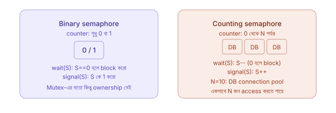
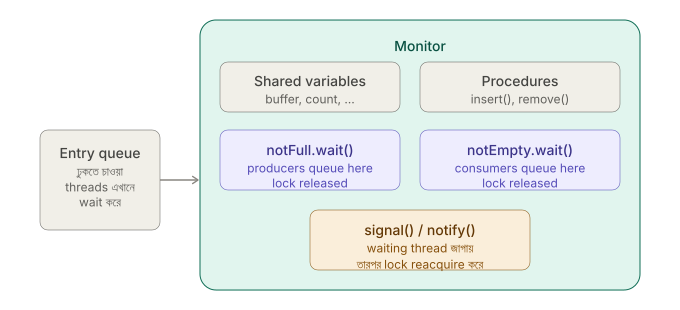

## ⚠️ 17. What is a race condition, and how does it occur?

**Race Condition** হলো এমন একটি সমস্যা (bug) যেখানে দুই বা ততোধিক **thread** বা **process** একই **shared resource** (যেমন একটি variable, memory location বা shared data structure) একই সময়ে access বা modify করার চেষ্টা করে, এবং তাদের **execution order**-এর উপর নির্ভর করে ভিন্ন ভিন্ন (এবং অনেক ক্ষেত্রে ভুল) ফলাফল আসে।

এটি ঘটে কারণ thread-গুলো নিজেদের মধ্যে **synchronization** ছাড়া independently execute করে। Operating System scheduler যেকোনো সময় একটি running thread-কে pause (preempt) করে অন্য thread-কে CPU দিতে পারে। ফলে কোন thread কখন execute করবে, সেটি আগে থেকে নির্দিষ্ট থাকে না।

---

### Can you give a simple example involving two threads incrementing a shared counter?

ধরো একটি **shared counter** আছে যার প্রাথমিক মান **0**। দুটি thread এটিকে একবার করে **increment** করবে। তাহলে expected result হওয়া উচিত **2**।

কিন্তু `counter++` (বা `counter += 1`) সাধারণত একটি **atomic operation** নয়। এটি মূলত তিনটি ধাপে সম্পন্ন হয়—

1. Memory থেকে বর্তমান মান **READ** করা।
2. মানটি **INCREMENT** করা।
3. নতুন মানটি আবার Memory-তে **WRITE** করা।

এই তিনটি ধাপের মাঝখানে যদি Operating System অন্য thread-কে CPU দিয়ে দেয়, তাহলে দুইটি thread একই পুরোনো মান পড়ে ফেলতে পারে এবং শেষে একটি update হারিয়ে যেতে পারে (**Lost Update Problem**)। এটিই Race Condition-এর মূল কারণ।

---

**কীভাবে Race Condition ঘটে?**



ধরো শুরুতে,

> **Counter = 0**

| সময় | Thread-1      | Thread-2      | Counter |
| ---- | ------------- | ------------- | ------- |
| t1   | Read → 0      |               | 0       |
| t2   |               | Read → 0      | 0       |
| t3   | Increment → 1 |               | 0       |
| t4   |               | Increment → 1 | 0       |
| t5   | Write → 1     |               | 1       |
| t6   |               | Write → 1     | 1       |

Expected Result = **2**

Actual Result = **1**

কারণ দুইটি thread-ই একই পুরোনো মান (**0**) পড়েছিল এবং শেষ পর্যন্ত একজনের update অন্যজন overwrite করে দিয়েছে।


```python
import threading

counter = 0
lock = threading.Lock()

def increment():
    global counter
    for _ in range(100000):
        with lock:          # Critical Section
            counter += 1

t1 = threading.Thread(target=increment)
t2 = threading.Thread(target=increment)

t1.start()
t2.start()

t1.join()
t2.join()

print(counter)   # সবসময় 200000
```

> **নোট:** CPython-এ **Global Interpreter Lock (GIL)** থাকার কারণে ছোট উদাহরণে Race Condition সবসময় দেখা নাও যেতে পারে। তবে shared data নিয়ে synchronization ছাড়া কাজ করা নিরাপদ নয়। তাই Race Condition বোঝানোর জন্য এই উদাহরণটি একটি ধারণাগত (conceptual) উদাহরণ হিসেবে দেখা উচিত।

---

**এর সমাধান কী?**

Race Condition এড়ানোর জন্য **Synchronization Mechanism** ব্যবহার করা হয়।

**Lock / Mutex**

একটি thread যখন **Critical Section**-এ প্রবেশ করে, তখন অন্য thread-গুলোকে অপেক্ষা করতে হয়। ফলে একই সময়ে একাধিক thread shared data modify করতে পারে না।

---

**Atomic Operation**

কিছু language, library বা hardware এমন operation প্রদান করে যেগুলো **Atomic**।

Atomic operation-এর বৈশিষ্ট্য হলো—

* Operation-টি একটিমাত্র indivisible step হিসেবে সম্পন্ন হয়।
* Operation চলাকালীন অন্য thread সেটিকে মাঝপথে পরিবর্তন করতে পারে না।
* তাই ঐ নির্দিষ্ট shared update-এর ক্ষেত্রে interleaving-এর কারণে lost update হয় না।

তবে atomic operation সব synchronization problem solve করে না। একাধিক step, complex invariant, বা একাধিক shared resource একসাথে protect করতে হলে lock/mutex/monitor-এর মতো mechanism দরকার হতে পারে।

---

| বিষয়                | ব্যাখ্যা                                                                                           |
| -------------------- | -------------------------------------------------------------------------------------------------- |
| **Race Condition**   | একাধিক thread/process একই shared data নিয়ে একসাথে কাজ করলে execution order-এর কারণে ভুল ফলাফল আসা |
| **Shared Resource**  | Variable, Memory, File বা Shared Data Structure যা একাধিক thread ব্যবহার করে                       |
| **Critical Section** | এমন code block যেখানে shared resource access বা modify করা হয়                                     |
| **Mutex / Lock**     | একই সময়ে শুধুমাত্র একটি thread-কে Critical Section-এ প্রবেশ করতে দেয়                             |
| **Atomic Operation** | এমন operation যা একটিমাত্র indivisible step হিসেবে সম্পন্ন হয়                                     |
| **Deadlock**         | দুই বা ততোধিক thread একে অপরের lock-এর জন্য অনির্দিষ্টকাল অপেক্ষা করলে যে অবস্থা তৈরি হয়          |

---

## 🚪 18. What is a critical section, and what are the requirements for a correct solution to the critical-section problem?

**Critical Section** হলো কোনো program-এর এমন একটি **code block** যেখানে **shared resource** (যেমন: variable, memory, file, database বা shared data structure) access বা modify করা হয়।

এই অংশে একই সময়ে **শুধুমাত্র একটি** process বা thread প্রবেশ করতে পারে। যদি একাধিক process বা thread একসাথে Critical Section-এ প্রবেশ করে, তাহলে **Race Condition** হতে পারে এবং data inconsistency দেখা দিতে পারে।

**একটি Process-এর সাধারণ Structure:**
প্রতিটি process সাধারণত নিচের চারটি অংশ নিয়ে গঠিত—



1. **Entry Section** – Critical Section-এ প্রবেশের অনুমতি নেওয়া হয়।
2. **Critical Section** – Shared Resource access বা modify করা হয়।
3. **Exit Section** – কাজ শেষ করে অন্য process-কে প্রবেশের সুযোগ দেওয়া হয়।
4. **Remainder Section** – Program-এর বাকি অংশ, যেখানে shared resource ব্যবহার করা হয় না।


### What do mutual exclusion, progress, and bounded waiting mean in this context?

**Critical-Section Problem-এর তিনটি Requirement**

একটি সঠিক Critical-Section solution-এর জন্য নিচের তিনটি শর্ত অবশ্যই পূরণ করতে হবে।

**1. Mutual Exclusion**: একই সময়ে **শুধুমাত্র একটি** process বা thread Critical Section-এ থাকতে পারবে। যদি একটি process Critical Section-এ থাকে, তাহলে অন্য সব process-কে অপেক্ষা করতে হবে।
এটি নিশ্চিত না করলে **Race Condition** হবে।


**2. Progress**: যদি কোনো process Critical Section-এ না থাকে এবং একাধিক process প্রবেশ করতে চায়, তাহলে তাদের মধ্য থেকে **সীমিত সময়ের মধ্যে** কোনো একটি process-কে নির্বাচন করে Critical Section-এ প্রবেশ করতে দিতে হবে।

অর্থাৎ, অপ্রয়োজনীয়ভাবে সবাইকে অপেক্ষা করিয়ে রাখা যাবে না।
এই শর্ত পূরণ না হলে **indefinite postponement** বা **Deadlock-এর মতো blocking পরিস্থিতি** তৈরি হতে পারে।


**3. Bounded Waiting**: কোনো process Critical Section-এ প্রবেশের অনুরোধ করার পরে, সে কতবার অন্য process-কে আগে যেতে দেবে তার একটি **সীমা (bound)** থাকতে হবে।

অর্থাৎ, কোনো process-কে অনির্দিষ্টকাল অপেক্ষা করানো যাবে না।
এই শর্ত পূরণ না হলে **Starvation** হতে পারে।

**তিনটি Requirement একসাথে দেখলে**

| Requirement          | প্রশ্ন যা সমাধান করে                                | ব্যর্থ হলে                                          |
| -------------------- | --------------------------------------------------- | --------------------------------------------------- |
| **Mutual Exclusion** | একসাথে দুজন Critical Section-এ ঢুকতে পারবে?         | Race Condition                                      |
| **Progress**         | Critical Section খালি থাকলে কেউ না কেউ ঢুকতে পারবে? | Indefinite Postponement বা Deadlock-এর মতো Blocking |
| **Bounded Waiting**  | কোনো Process কি অনির্দিষ্টকাল অপেক্ষা করবে?         | Starvation                                          |


Critical-Section Problem-এর একটি **সঠিক (Correct) Solution**-কে অবশ্যই **Mutual Exclusion**, **Progress**, এবং **Bounded Waiting**—এই তিনটি শর্ত পূরণ করতে হবে।

**Mutex, Semaphore, Peterson's Algorithm, Monitor** ইত্যাদি synchronization mechanism এই লক্ষ্য অর্জনের জন্য ব্যবহৃত হয়। তবে কোনো mechanism বাস্তবে starvation-free হবে কি না বা bounded waiting নিশ্চিত করবে কি না, তা তার **implementation এবং scheduling policy**-এর উপর নির্ভর করে।

---


## 🔑 19. What is the difference between a mutex and a semaphore?
Mutex, semaphore এবং spinlock—সবই synchronization-এর জন্য ব্যবহৃত হয়। তবে এদের কাজের ধরন, ownership এবং ব্যবহারের ক্ষেত্র একে অপরের থেকে ভিন্ন।


**Mutex (Mutual Exclusion)**: Mutex হলো এমন একটি **lock** যা একই সময়ে শুধুমাত্র **একটি thread**-কে Critical Section-এ প্রবেশ করতে দেয়।

Mutex-এর সবচেয়ে গুরুত্বপূর্ণ বৈশিষ্ট্য হলো **Ownership**।

অর্থাৎ, **যে thread lock করবে, শুধুমাত্র সেই thread-ই unlock করতে পারবে।**

Mutex সবসময় **Binary** অবস্থায় থাকে—

* **Locked**
* **Unlocked**

তাই এটি মূলত **Mutual Exclusion** নিশ্চিত করার জন্য ব্যবহৃত হয়।

---

**Semaphore**: Semaphore হলো একটি **integer counter**, যা একসাথে একাধিক thread বা process-এর access নিয়ন্ত্রণ করতে ব্যবহৃত হয়।

Mutex-এর মতো এখানে **Ownership-এর ধারণা নেই।**

অর্থাৎ, যে thread `wait()` করেছে, সেই thread-ই `signal()` করবে—এমন কোনো বাধ্যবাধকতা নেই।

Semaphore সাধারণত দুটি operation ব্যবহার করে—

* **wait() (P operation)** → Counter কমায়
* **signal() (V operation)** → Counter বাড়ায়



---

### What is the difference between a binary semaphore and a counting semaphore?

**Binary Semaphore**: Binary Semaphore-এর counter-এর মান শুধুমাত্র **0** অথবা **1** হতে পারে। এটি দেখতে অনেকটা Mutex-এর মতো হলেও একটি গুরুত্বপূর্ণ পার্থক্য রয়েছে।
এখানে Ownership নেই। তাই যে thread `wait()` করেছে, অন্য কোনো thread-ও `signal()` করতে পারে।
এই কারণে এটি **Producer–Consumer**, **Event Notification** বা **Thread Signaling**-এর মতো ক্ষেত্রে বেশি ব্যবহৃত হয়।

**Counting Semaphore**: Counting Semaphore-এর counter **0 থেকে N** পর্যন্ত হতে পারে। এটি তখন ব্যবহার করা হয় যখন একই ধরনের **একাধিক resource** একসাথে ব্যবহার করার সুযোগ দিতে হয়।



উদাহরণ—

* ১০টি Database Connection
* ৫টি Printer
* ২০টি Network Socket

যদি Semaphore-এর মান **10** হয়, তাহলে সর্বোচ্চ **10টি thread** একসাথে resource ব্যবহার করতে পারবে।

---

### What is the difference between a mutex and a spinlock, and when would you use each?

**Spinlock**: Spinlock-ও Mutual Exclusion নিশ্চিত করার জন্য ব্যবহৃত হয়।
তবে Mutex-এর মতো waiting thread-কে **sleep** করানো হয় না।
বরং thread বারবার lock available হয়েছে কিনা পরীক্ষা করতে থাকে। একে **Busy Waiting** বা **Spinning** বলা হয়।
এতে waiting অবস্থায় CPU continuously ব্যবহার হয়।

Spinlock সাধারণত **খুব অল্প সময়ের জন্য lock ধরে রাখার ক্ষেত্রে**, বিশেষ করে **kernel**, **interrupt handler**, বা **low-level system programming**-এ ব্যবহৃত হয়, যেখানে sleep করা সম্ভব নয় বা context switch-এর overhead এড়াতে হয়।

---
**সবকিছু একসাথে তুলনা**

| বৈশিষ্ট্য                   | Mutex                              | Binary Semaphore                      | Counting Semaphore       | Spinlock                                             |
| --------------------------- | ---------------------------------- | ------------------------------------- | ------------------------ | ---------------------------------------------------- |
| Ownership                   | আছে (Lock করা thread-ই Unlock করে) | নেই                                   | নেই                      | সাধারণত Lock করা thread-ই Unlock করে                 |
| Counter Range               | 0 / 1                              | 0 / 1                                 | 0 থেকে N                 | 0 / 1                                                |
| Waiting Method              | Sleep (Block)                      | Sleep (Block)                         | Sleep (Block)            | Busy Waiting (Spin)                                  |
| Waiting-এর সময় CPU ব্যবহার | খুব কম                             | খুব কম                                | খুব কম                   | বেশি (Continuous CPU Use)                            |
| Scheduler-এর সাহায্য        | লাগে                               | লাগে                                  | লাগে                     | Waiting-এর সময় লাগে না                              |
| মূল ব্যবহার                 | Mutual Exclusion                   | Thread Signaling / Event Notification | Resource Pool Management | Kernel, Interrupt Handler, Low-level Synchronization |

---

**সংক্ষেপে**

* **Mutex** হলো **Ownership**-সহ একটি lock, যা একই সময়ে শুধুমাত্র একটি thread-কে Critical Section-এ প্রবেশ করতে দেয়।
* **Binary Semaphore** দেখতে Mutex-এর মতো হলেও এতে Ownership নেই এবং এটি মূলত **Signaling**-এর জন্য ব্যবহৃত হয়।
* **Counting Semaphore** একাধিক একই ধরনের resource (Resource Pool) নিয়ন্ত্রণ করতে ব্যবহৃত হয়।
* **Spinlock** waiting-এর সময় sleep না করে **Busy Waiting** করে। তাই এটি খুব স্বল্প সময়ের lock এবং kernel-level programming-এর জন্য উপযুক্ত, যেখানে context switch-এর overhead এড়ানো গুরুত্বপূর্ণ।


## 📺 20. What are monitors, and how do they simplify synchronization compared to raw semaphores?

**Monitor** হলো একটি **high-level synchronization construct**, যা shared data, সেই data access করার procedures (methods), এবং synchronization mechanism-কে একটি **একক unit**-এর মধ্যে সংগঠিত করে।

Monitor-এর সবচেয়ে বড় বৈশিষ্ট্য হলো **automatic mutual exclusion**।

অর্থাৎ, কোনো thread monitor-এর একটি procedure-এ প্রবেশ করলে monitor নিজেই lock নিয়ে নেয় এবং procedure শেষ হলে lock স্বয়ংক্রিয়ভাবে ছেড়ে দেয়। ফলে programmer-কে আলাদাভাবে `lock()` বা `unlock()` লিখতে হয় না।



---

**Monitor কেন Semaphore-এর চেয়ে সহজ?**

Raw **Semaphore** ব্যবহার করলে programmer-কে প্রতিটি `wait()` এবং `signal()` নিজে সঠিকভাবে ব্যবহার করতে হয়।

যদি একটি `wait()` বা `signal()` ভুল জায়গায় লেখা হয়, তাহলে **Race Condition**, **Deadlock** বা **Synchronization Error** হওয়ার সম্ভাবনা থাকে।

Monitor এই কাজগুলো অনেক সহজ করে দেয়।

Programmer শুধুমাত্র shared data নিয়ে কাজ করেন, আর mutual exclusion-এর দায়িত্ব language বা runtime নিজেই পরিচালনা করে।

---

**Condition Variable কীভাবে কাজ করে?**

শুধু Mutual Exclusion থাকলেই সব synchronization problem সমাধান হয় না।

উদাহরণস্বরূপ—

* Buffer খালি থাকলে Consumer কী করবে?
* Buffer পূর্ণ থাকলে Producer কী করবে?

এই ধরনের **condition-based waiting** পরিচালনা করার জন্য Monitor-এর ভিতরে **Condition Variable** ব্যবহার করা হয়।

Condition Variable মূলত একটি **waiting queue**, যেখানে অপেক্ষমাণ thread-গুলো রাখা হয়।

এটি সাধারণত দুটি operation support করে—

* **wait()**
* **signal()** (বা **notify()**)



---

**wait()**

যখন কোনো thread `wait()` করে,

* Monitor-এর lock স্বয়ংক্রিয়ভাবে ছেড়ে দেয়।
* Thread waiting state-এ চলে যায়।

এটি অত্যন্ত গুরুত্বপূর্ণ।

কারণ lock ছাড়া না হলে অন্য thread Monitor-এ প্রবেশ করে condition পরিবর্তন করতে পারত না।

---

**signal() / notify()**

যখন অন্য কোনো thread `signal()` করে,

* Waiting thread-টিকে জাগিয়ে দেওয়া হয়।
* তবে সেটি সঙ্গে সঙ্গে execution শুরু করে না।
* প্রথমে তাকে Monitor-এর lock পুনরায় acquire করতে হয়।
* Lock পাওয়ার পর সে execution চালিয়ে যায়।

---

**Bounded Buffer উদাহরণ**

ধরো একটি **Bounded Buffer** আছে।

* Buffer পূর্ণ হলে Producer `notFull.wait()` করে অপেক্ষা করবে।
* Consumer একটি item remove করলে `notFull.signal()` করে Producer-কে জাগাবে।

অন্যদিকে,

* Buffer খালি থাকলে Consumer `notEmpty.wait()` করবে।
* Producer নতুন item যোগ করার পরে `notEmpty.signal()` দিয়ে Consumer-কে জাগাবে।

এভাবে Producer এবং Consumer নিরাপদভাবে একই buffer ব্যবহার করতে পারে।

---

**Semaphore বনাম Monitor**

| বিষয়                 | Raw Semaphore                                              | Monitor                                                                                                                     |
| --------------------- | ---------------------------------------------------------- | --------------------------------------------------------------------------------------------------------------------------- |
| Mutual Exclusion      | Programmer নিজে `wait()` / `signal()` দিয়ে নিয়ন্ত্রণ করে | Automatically নিশ্চিত হয়                                                                                                   |
| Lock Management       | Manual                                                     | Automatic                                                                                                                   |
| Synchronization Error | হওয়ার সম্ভাবনা বেশি                                       | তুলনামূলক কম                                                                                                                |
| Condition Waiting     | Programmer নিজে manage করে                                 | Condition Variable দিয়ে করা হয়                                                                                            |
| Encapsulation         | Shared data ও synchronization আলাদা                        | Shared data + procedures + synchronization একসাথে থাকে                                                                      |
| Language Support      | Low-level primitive                                        | Java (`synchronized`), C# (`lock`), C++ (`std::mutex` + `std::condition_variable`) দিয়ে monitor-style pattern implement করা যায় |

---

**কেন `while` ব্যবহার করা হয়?**

Condition Variable ব্যবহার করার সময় `wait()` সাধারণত **`while` loop**-এর ভিতরে লেখা হয়।

```java
// ভুল
if (buffer.isEmpty())
    notEmpty.wait();

// সঠিক
while (buffer.isEmpty())
    notEmpty.wait();
```

এর কারণ—

* **Spurious Wakeup** হতে পারে।
* অন্য কোনো thread আগে condition পরিবর্তন করে ফেলতে পারে।

তাই thread জেগে ওঠার পরে condition আবার পরীক্ষা করা প্রয়োজন।

---

**সংক্ষেপে**

Monitor হলো **Semaphore-এর তুলনায় আরও উচ্চস্তরের (high-level), structured এবং নিরাপদ synchronization mechanism**।

এখানে **Mutual Exclusion** স্বয়ংক্রিয়ভাবে পরিচালিত হয় এবং **Condition Variable** ব্যবহার করে thread-গুলোর মধ্যে নিরাপদ synchronization নিশ্চিত করা হয়। ফলে programmer-কে lock management-এর পরিবর্তে মূল program logic-এর উপর বেশি মনোযোগ দিতে হয় এবং synchronization-সংক্রান্ত ভুল হওয়ার সম্ভাবনা উল্লেখযোগ্যভাবে কমে যায়।
