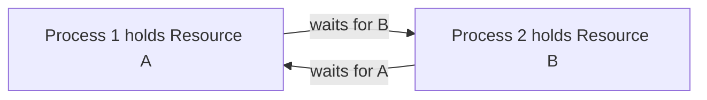
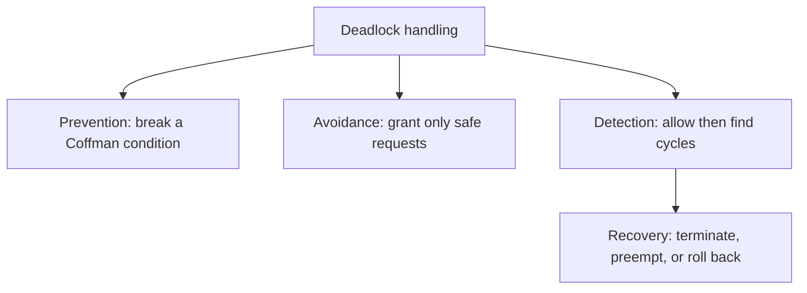
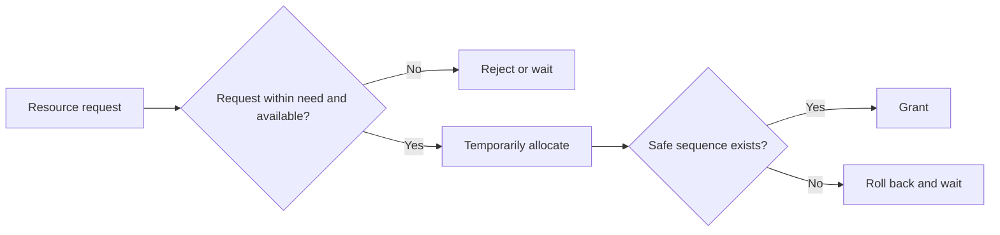
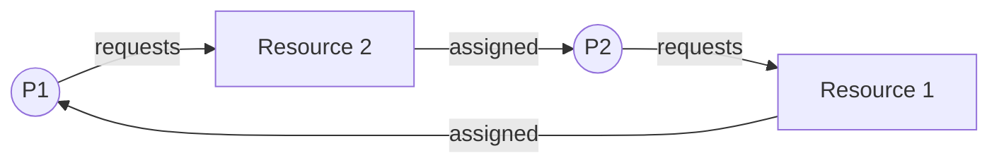
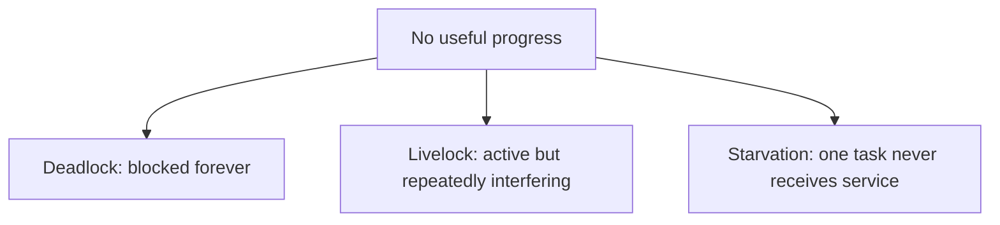
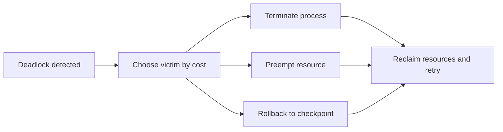

## 🔗 21. What is a deadlock, and what are the four necessary conditions for it to occur (Coffman conditions)?



**Deadlock** হলো এমন একটি অবস্থা যেখানে এক বা একাধিক process/thread এমন event বা resource-এর জন্য অপেক্ষা করে যা deadlocked set-এর অন্য সদস্যের action ছাড়া ঘটবে না; ফলে set-এর কেউই আর progress করতে পারে না। সাধারণত একাধিক participant থাকে, তবে non-recursive lock দ্বিতীয়বার acquire করার মতো ক্ষেত্রে একটি thread নিজেকেও deadlock করতে পারে।

সহজ উদাহরণ:

* Process P1 lock A ধরে আছে, lock B চাইছে
* Process P2 lock B ধরে আছে, lock A চাইছে
* P1 অপেক্ষা করছে P2-এর জন্য, P2 অপেক্ষা করছে P1-এর জন্য

এখন কেউ lock ছাড়ছে না, তাই দুজনই আটকে গেছে। এটিই deadlock।

```text
P1 holds A, waits for B
P2 holds B, waits for A

P1 ──waits for──> B ──held by──> P2
P2 ──waits for──> A ──held by──> P1
```

---

### Coffman Conditions

Deadlock ঘটতে হলে নিচের চারটি condition একসাথে থাকতে হয়। এগুলোকে **Coffman conditions** বলা হয়।

**1. Mutual Exclusion**

কমপক্ষে একটি resource এমন হতে হবে যা এক সময়ে শুধুমাত্র একজন process/thread ব্যবহার করতে পারে।

Example:

* mutex lock
* printer
* file write lock
* database row lock

যদি resource fully shareable হয়, তাহলে সেই resource নিয়ে deadlock হওয়ার সম্ভাবনা থাকে না।

---

**2. Hold and Wait**

একটি process/thread কমপক্ষে একটি resource ধরে রেখে অন্য resource-এর জন্য অপেক্ষা করছে।

Example:

* P1 lock A ধরে আছে
* তারপর lock B নেওয়ার চেষ্টা করছে
* lock B না পেয়ে wait করছে

---

**3. No Preemption**

OS বা system জোর করে process/thread-এর কাছ থেকে resource কেড়ে নিতে পারে না। Resource voluntary release করতে হয়।

Example:

* একটি thread mutex lock করেছে
* OS সাধারণত সেই mutex জোর করে unlock করে না
* thread নিজে unlock না করা পর্যন্ত অন্যরা wait করবে

---

**4. Circular Wait**

Process/thread-গুলোর মধ্যে একটি circular dependency তৈরি হয়।

Example:

```text
P1 waits for P2
P2 waits for P3
P3 waits for P1
```

অর্থাৎ সবাই chain আকারে একে অপরের জন্য wait করছে, এবং chain শেষ হয়ে আবার শুরুতে ফিরে আসছে।

---

### Why must all four conditions hold simultaneously for a deadlock to exist?

Deadlock-এর জন্য চারটি condition একসাথে দরকার, কারণ একটি condition ভেঙে দিলেই circular blocking structure তৈরি হতে পারে না।

| Condition না থাকলে | কী হয় |
| ------------------ | ----- |
| Mutual Exclusion নেই | resource shareable হলে কেউ exclusive access-এর জন্য আটকে থাকে না |
| Hold and Wait নেই | process resource ধরে রেখে নতুন resource চাইছে না |
| No Preemption নেই | system resource কেড়ে নিয়ে deadlock ভাঙতে পারে |
| Circular Wait নেই | wait dependency cycle তৈরি হয় না |

তাই deadlock prevention-এর basic idea হলো এই চারটির যেকোনো একটি condition intentionally ভেঙে দেওয়া।

---

## 🛡️ 22. What is the difference between deadlock prevention, avoidance, detection, and recovery?



Deadlock handle করার চারটি major strategy আছে:

* **Prevention**
* **Avoidance**
* **Detection**
* **Recovery**

---

### Deadlock Prevention

**Prevention** deadlock হওয়ার আগেই Coffman conditions-এর যেকোনো একটি ভেঙে দেয়।

Common techniques:

* **Mutual exclusion কমানো**: যত resource shareable করা যায়
* **Hold and wait ভাঙা**: process-কে সব resource একসাথে request করতে বলা
* **Preemption allow করা**: possible হলে resource কেড়ে নেওয়া
* **Circular wait ভাঙা**: resource ordering impose করা

Example:

সব lock একটি fixed order-এ acquire করতে হবে:

```text
Always acquire: Lock A → Lock B → Lock C
Never acquire:  Lock C → Lock A
```

সব participant strict global order মেনে চললে circular wait ভেঙে যায়, ফলে lock-order deadlock ঘটতে পারে না।

**Pros**

* যে Coffman condition-টি eliminate করা হয়, সেই resource model-এ deadlock প্রতিরোধের guarantee দেয়
* conceptually simple

**Cons**

* resource utilization কমে যেতে পারে
* concurrency কমতে পারে
* সব resource একসাথে request করা practical নাও হতে পারে

---

### Deadlock Avoidance

**Avoidance** system runtime-এ প্রতিটি resource request evaluate করে। যদি request grant করলে system unsafe state-এ চলে যায়, তাহলে request delay করা হয়।

এখানে system deadlock prevent করে, কিন্তু static rule দিয়ে না; বরং current allocation state দেখে decision নেয়।

Classic example:

* **Banker’s Algorithm**

**Pros**

* Prevention-এর তুলনায় resource utilization ভালো হতে পারে
* system safe state বজায় রাখে

**Cons**

* process-এর maximum resource demand আগে থেকে জানতে হয়
* runtime overhead বেশি
* general-purpose OS-এ practical কম

---

### Deadlock Detection

**Detection** deadlock আটকানোর চেষ্টা করে না। System resource allocate হতে দেয়, তারপর periodically বা প্রয়োজনমতো check করে deadlock হয়েছে কি না।

যদি deadlock detect হয়, তখন recovery শুরু হয়।

**Pros**

* resource utilization ভালো হতে পারে
* prevention/avoidance-এর মতো strict restriction নেই

**Cons**

* deadlock ঘটার পর system affected হয়
* detection algorithm চালানোর overhead আছে
* recovery কঠিন হতে পারে

---

### Deadlock Recovery

Deadlock detect হলে system-কে deadlock থেকে বের করার process হলো **recovery**।

Common recovery techniques:

* process terminate করা
* resource preempt করা
* rollback/checkpoint restore করা

---

### Which approach tends to have the highest runtime overhead, and why?

কোন strategy-এর runtime overhead সবচেয়ে বেশি হবে তার universal answer নেই; request rate, detection frequency এবং resource count-এর ওপর এটি নির্ভর করে। তবে **deadlock avoidance** সাধারণত high continuous overhead তৈরি করতে পারে, কারণ প্রতিটি relevant resource request grant করার আগে system-কে safety check চালাতে হয়।

Banker’s Algorithm-এর মতো avoidance technique-এ system-কে maintain করতে হয়:

* current available resources
* each process-এর maximum demand
* current allocation
* remaining need
* safe sequence আছে কি না

Detection-এরও overhead আছে এবং খুব ঘন ঘন full detection চালালে সেটিই বেশি costly হতে পারে। Detection periodic বা on-demand হলে avoidance-এর per-request cost তুলনামূলক বেশি দেখা যায়।

| Strategy | কখন কাজ করে | মূল idea | Trade-off |
| -------- | ------------ | -------- | --------- |
| Prevention | deadlock হওয়ার আগে | Coffman condition ভাঙে | conservative, utilization কমতে পারে |
| Avoidance | request-time | unsafe state avoid করে | বেশি information ও overhead দরকার |
| Detection | deadlock হওয়ার পরে | cycle/deadlock খুঁজে বের করে | deadlock ঘটতে দেয় |
| Recovery | detection-এর পরে | system unblock করে | data loss/rollback/termination risk |

---

## 🏦 23. How does the Banker's algorithm work for deadlock avoidance?



**Banker’s Algorithm** হলো deadlock avoidance algorithm। এটি এমনভাবে resource allocate করে যাতে system সবসময় **safe state**-এ থাকে।

এর নাম banker analogy থেকে এসেছে:

> একটি bank সব customer-কে loan দেয়, কিন্তু এমনভাবে দেয় যাতে ভবিষ্যতে সব customer-এর maximum demand পূরণ করেও bank bankrupt না হয়।

Operating system context-এ:

* process হলো customer
* resource হলো bank-এর money
* allocation হলো currently দেওয়া resource
* maximum demand হলো process maximum কত resource চাইতে পারে

---

### Algorithm-এর main data structures

ধরা যাক system-এ `n`টি process এবং `m`টি resource type আছে।

**Available**

প্রতিটি resource type-এর কত instance currently free আছে।

**Max**

প্রতিটি process maximum কত resource demand করতে পারে।

**Allocation**

প্রতিটি process বর্তমানে কত resource ধরে আছে।

**Need**

প্রতিটি process-এর আর কত resource দরকার হতে পারে।

```text
Need = Max - Allocation
```

---

### Safety check idea

System check করে এমন কোনো order আছে কি না যেখানে সব process একে একে finish করতে পারবে।

ধাপগুলো:

1. `Work = Available`
2. এমন process খুঁজো যার `Need <= Work`
3. সেই process hypothetically finish করলে তার allocated resource release হবে
4. `Work = Work + Allocation[process]`
5. সব process finish করা গেলে system safe
6. যদি কোনো point-এ আর কোনো process proceed করতে না পারে, system unsafe

---

### Resource request handling

যখন process `Pi` resource request করে:

1. Check: `Request[i] <= Need[i]`
2. Check: `Request[i] <= Available`
3. Temporarily resource allocate করে দেখা হয়
4. Safety algorithm চালানো হয়
5. Safe হলে request grant
6. Unsafe হলে provisional allocation rollback করে process-কে wait করানো হয়

---

### What do "safe state" and "unsafe state" mean in this context?

**Safe State**

System safe state-এ আছে যদি এমন একটি **safe sequence** থাকে, যেখানে process-গুলোকে কোনো order-এ চালালে সবাই eventually finish করতে পারবে।

Example:

```text
Safe sequence: P2 → P1 → P3
```

মানে P2 আগে finish করতে পারবে, P2 resource release করলে P1 finish করতে পারবে, তারপর P3 finish করতে পারবে।

Safe state মানে deadlock নেই এবং system এমনভাবে আছে যে careful allocation করলে deadlock এড়ানো সম্ভব।

---

**Unsafe State**

Unsafe state মানে system এমন অবস্থায় আছে যেখানে guaranteed safe sequence নেই।

গুরুত্বপূর্ণ:

> Unsafe state মানেই deadlock হয়েছে এমন নয়।

Unsafe state মানে ভবিষ্যতের request pattern-এর উপর নির্ভর করে deadlock হতে পারে। তাই Banker’s Algorithm unsafe state-এ যেতে দেয় না।

---

### What information does the algorithm require about each process in advance?

Banker’s Algorithm চালাতে system-কে আগে থেকেই জানতে হয়:

* প্রতিটি process maximum কত resource চাইতে পারে
* বর্তমানে process কত resource ধরে আছে
* system-এ মোট resource কত
* currently available resource কত

এই কারণেই Banker’s Algorithm বাস্তব general-purpose OS-এ কম ব্যবহৃত হয়। কারণ process আগে থেকেই তার exact maximum resource demand জানে বা declare করে, এমন assumption সবসময় practical নয়।

---

## 🗺️ 24. How is a resource allocation graph used to detect deadlocks?



**Resource Allocation Graph (RAG)** হলো একটি directed graph, যেখানে process এবং resource-এর relationship দেখানো হয়।

Graph-এ দুই ধরনের node থাকে:

* **Process node**: `P1`, `P2`, `P3`
* **Resource node**: `R1`, `R2`, `R3`

দুই ধরনের edge থাকে:

**Request Edge**

```text
P1 → R1
```

মানে P1 resource R1 চাইছে।

**Assignment Edge**

```text
R1 → P1
```

মানে R1 currently P1-কে allocated।

---

### Deadlock detection with graph

যদি graph-এ cycle থাকে, তাহলে deadlock-এর possibility তৈরি হয়।

Example:

```text
P1 → R2 → P2 → R1 → P1
```

মানে:

* P1 R2 চাইছে
* R2 P2-এর কাছে আছে
* P2 R1 চাইছে
* R1 P1-এর কাছে আছে

এটি circular wait।

---

### How does a cycle in the graph relate to a deadlock when each resource has a single instance vs multiple instances?

**Single instance per resource type**

যদি প্রতিটি resource type-এর শুধুমাত্র একটি instance থাকে, তাহলে RAG-এ cycle থাকলে সেটি **deadlock-এর necessary এবং sufficient condition**।

অর্থাৎ:

> Single-instance resource graph-এ cycle আছে মানে deadlock আছে।

---

**Multiple instances per resource type**

যদি resource type-এর একাধিক instance থাকে, তাহলে cycle থাকলেই deadlock guaranteed নয়।

কারণ একই resource type-এর অন্য free instance কোনো waiting process-কে দেওয়া যেতে পারে, এবং cycle ভেঙে যেতে পারে।

তাই multiple-instance case-এ cycle হলো:

> Deadlock-এর সম্ভাবনার signal, কিন্তু definite proof নয়।

এক্ষেত্রে detection-এর জন্য allocation matrix, request matrix, available vector ব্যবহার করে algorithm চালাতে হয়।

| Resource case | Cycle থাকলে কী বোঝায় |
| ------------- | -------------------- |
| Single instance | Deadlock নিশ্চিত |
| Multiple instances | Deadlock হতে পারে, কিন্তু নিশ্চিত নয় |

---

## 🐌 25. What is the difference between deadlock, livelock, and starvation?



Deadlock, livelock এবং starvation দেখতে কাছাকাছি মনে হলেও এগুলো আলাদা problem।

---

### Deadlock

Processes/threads blocked হয়ে যায় এবং কেউ progress করতে পারে না।

Example:

```text
P1 holds A, waits for B
P2 holds B, waits for A
```

এখানে দুজনই wait করছে, কিন্তু কেউ resource release করছে না।

---

### Livelock

Livelock-এ process/thread blocked না; তারা active থাকে, repeatedly action নেয়, কিন্তু useful progress হয় না।

Example:

দুইজন মানুষ সরু hallway-তে মুখোমুখি হলো। দুজনই ভদ্রতার কারণে একসাথে বামে সরল, তারপর একসাথে ডানে সরল, আবার বামে সরল। তারা নড়ছে, কিন্তু কেউই সামনে এগোতে পারছে না।

OS/concurrency example:

* Thread T1 lock নিতে না পেরে immediately release/retry করছে
* Thread T2-ও একই কাজ করছে
* দুজনই বারবার retry করছে
* কিন্তু timing-এর কারণে কেউ successful progress করছে না

---

### Starvation

Starvation বা indefinite postponement হলো এমন অবস্থা যেখানে একটি process/thread potentially অনির্দিষ্টকাল resource বা CPU পায় না, যদিও system-এর অন্য participant progress করতে থাকে।

Example:

* Priority scheduling-এ high-priority task বারবার আসছে
* low-priority process ready queue-তে থেকেও CPU পাচ্ছে না

এখানে system overall progress করছে, কিন্তু নির্দিষ্ট process progress করতে পারছে না।

---

### Can a system be in livelock without being in deadlock? Give an example.

হ্যাঁ। Livelock-এ process/thread active থাকে, তাই deadlock-এর মতো blocked নয়।

Example:

দুইটি thread একই strategy follow করছে:

```text
T1: try lock A
T2: try lock B
T1: if B unavailable, release A and retry
T2: if A unavailable, release B and retry
```

যদি timing repeatedly একই থাকে, তারা বারবার lock নেয়, release করে, retry করে। কেউ permanently blocked নয়, কিন্তু useful work complete হচ্ছে না। তাই এটি livelock, deadlock নয়।

| Problem | State | System progress | Affected process progress |
| ------- | ----- | --------------- | ------------------------- |
| Deadlock | blocked | থেমে যেতে পারে | না |
| Livelock | active/retrying | activity আছে | useful progress নেই |
| Starvation | ready/waiting | অন্যরা progress করছে | নির্দিষ্ট process progress পাচ্ছে না |

---

## 🔓 26. What recovery strategies exist once a deadlock is detected?



Deadlock detect হওয়ার পরে system-কে recovery করতে হয়। Recovery সাধারণত painful, কারণ কোনো না কোনো process/resource state disturb করতে হয়।

Common strategies:

* process termination
* resource preemption
* rollback/checkpoint restore

---

### 1. Process Termination

Deadlock ভাঙার জন্য এক বা একাধিক process terminate করা হয়।

দুইভাবে করা যায়:

**Abort all deadlocked processes**

সব deadlocked process kill করলে deadlock দ্রুত ভাঙে।

Problem:

* অনেক কাজ নষ্ট হতে পারে
* data consistency issue হতে পারে
* user-facing task fail করতে পারে

**Abort one process at a time**

একটি process terminate করে আবার deadlock check করা হয়। Deadlock না ভাঙলে আরেকটি terminate করা হয়।

Problem:

* repeated detection overhead
* কোন process kill করা হবে সেটি নির্বাচন করা কঠিন

Process victim selection-এ বিবেচনা করা যেতে পারে:

* process priority
* কত resource ধরে আছে
* কতক্ষণ ধরে চলছে
* কাজ কতটা complete হয়েছে
* restart করা সহজ কি না
* user/system critical কি না

---

### 2. Resource Preemption

System কোনো process-এর কাছ থেকে safely preemptable resource ফিরিয়ে নিয়ে অন্য process-কে দেয় বা allocation পুনর্বিন্যাস করে।

এটি সব resource-এর ক্ষেত্রে possible নয়।

উদাহরণ হিসেবে CPU time preempt করা বা reclaimable memory page সরানো সম্ভব। তবে এগুলো তখনই deadlock recovery-তে সাহায্য করবে যখন সংশ্লিষ্ট deadlocked resource allocation ভাঙে; শুধু CPU preempt করলেই mutex deadlock ভাঙে না। Mutex ownership, printer job বা partially completed I/O মাঝপথে safely preempt করা সাধারণত কঠিন।

Preemption করতে গেলে তিনটি issue আসে:

**Victim selection**

কোন process/resource preempt করলে cost কম হবে?

**Rollback**

Resource কেড়ে নেওয়ার পর process-কে previous safe state-এ ফিরিয়ে নিতে হতে পারে।

**Starvation**

একই process বারবার victim হলে starvation হতে পারে। তাই victim selection policy-তে fairness দরকার।

---

### 3. Rollback / Checkpoint Recovery

যদি system periodically checkpoint রাখে, তাহলে deadlocked process-কে আগের safe checkpoint-এ ফিরিয়ে নেওয়া যায়।

এটি database transaction, distributed system বা long-running computation-এ useful হতে পারে।

Problem:

* checkpoint maintain করার overhead আছে
* সব process rollback-safe নয়
* external side effect থাকলে rollback কঠিন

---

### What are the trade-offs of process termination vs resource preemption as recovery strategies?

| Strategy | সুবিধা | অসুবিধা |
| -------- | ------ | -------- |
| Process termination | simple, deadlock দ্রুত ভাঙতে পারে | work loss, data inconsistency, user impact |
| Resource preemption | process kill না করেও recovery সম্ভব | সব resource preemptable নয়, rollback/starvation issue |
| Rollback | controlled recovery possible | checkpoint overhead, external side effect problem |

সংক্ষেপে:

* **Termination** সহজ কিন্তু destructive।
* **Preemption** flexible কিন্তু complex।
* **Rollback** clean হতে পারে, কিন্তু আগে থেকে checkpoint support দরকার।

---
