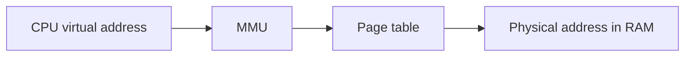
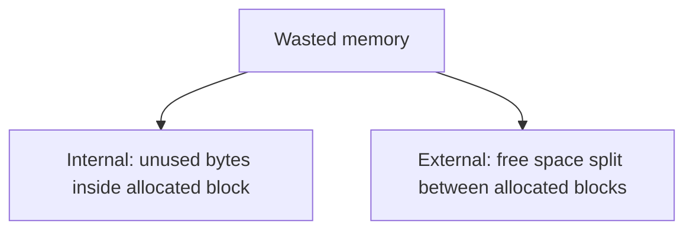
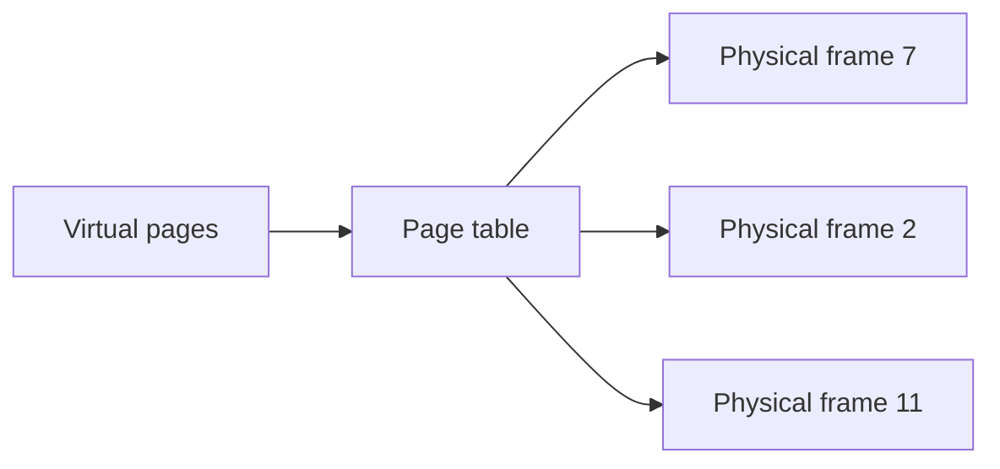
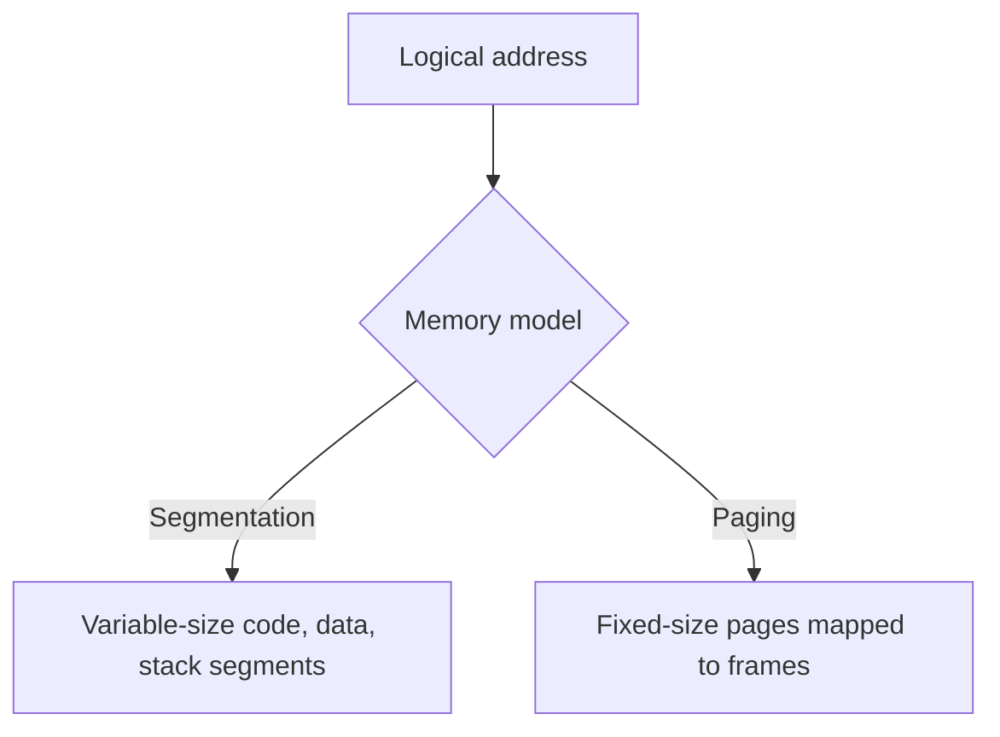
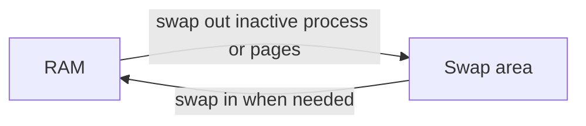
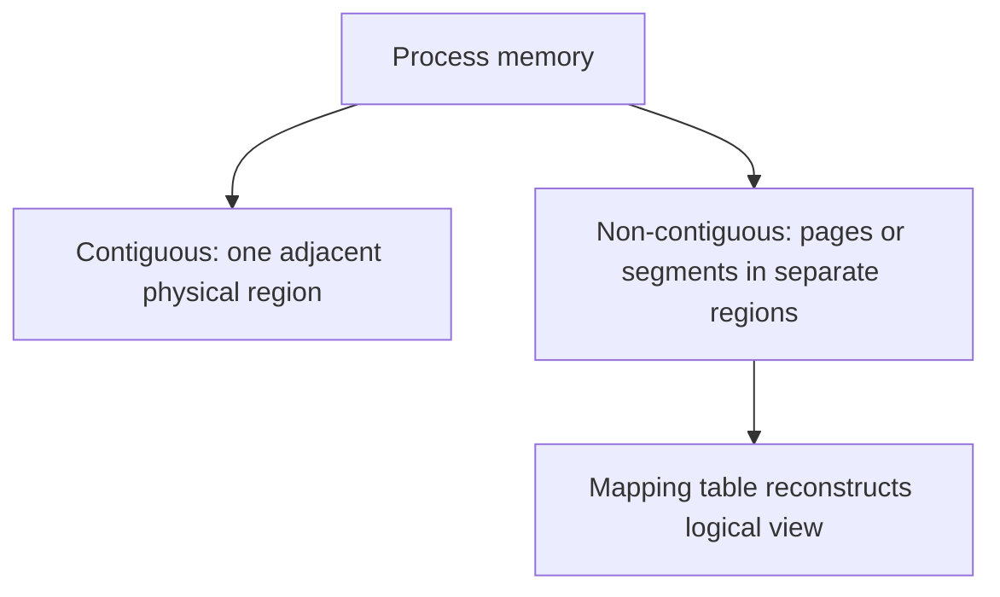

## 27. What is the difference between a logical (virtual) address and a physical address?

**Logical Address (Virtual Address)**

Normal translated execution-এ CPU instruction যে address ব্যবহার করে সেটি **logical/virtual address**। এটি process-এর perspective-এর address; প্রতিটি process একটি independent virtual address range দেখে। Range conceptually address `0` থেকে শুরু হতে পারে, তবে security ও null-pointer detection-এর জন্য modern OS সাধারণত low/null page mapped রাখে না।

এটিকে **virtual address**-ও বলা হয়, কারণ এটি process-এর **virtual address space**-এর একটি address। এটি সরাসরি RAM-এর address নয়; **Memory Management Unit (MMU)** এই virtual address-কে physical address-এ translate করে।

**Physical Address**

Physical address হলো processor/system-এর physical address space-এর address। এটি RAM location নির্দেশ করতে পারে, আবার architecture অনুযায়ী memory-mapped device register বা reserved region-ও নির্দেশ করতে পারে। এই chapter-এর সাধারণ paging example-গুলোতে physical address বলতে RAM frame-এর address বোঝানো হচ্ছে।

CPU যখন একটি logical (virtual) address generate করে, তখন **MMU** সেটিকে একটি physical address-এ translate করে। এরপর memory hardware সেই physical address ব্যবহার করে RAM access করে data read বা write করে।

**মূল পার্থক্য**

| বিষয়         | Logical (Virtual) Address                         | Physical Address                                                                                                                                  |
| ------------- | ------------------------------------------------- | ------------------------------------------------------------------------------------------------------------------------------------------------- |
| Generate/Use  | CPU generate করে                                  | MMU translate করে, RAM এটি ব্যবহার করে                                                                                                            |
| Visibility    | User process-এর কাছে visible                      | User process-এর কাছে hidden                                                                                                                       |
| Address Space | Process-এর virtual address space                  | Actual physical RAM-এর address space                                                                                                              |
| Uniqueness    | বিভিন্ন process-এর একই logical address থাকতে পারে | একটি physical address RAM-এর নির্দিষ্ট location নির্দেশ করে; shared memory-এর ক্ষেত্রে একাধিক logical address একই physical address-এ map হতে পারে |

Logical এবং Physical address-এর এই separation-এর কারণেই **process isolation**, **memory protection**, এবং **virtual memory** সম্ভব হয়। ফলে প্রতিটি process মনে করে তার নিজস্ব memory রয়েছে, যদিও বাস্তবে একাধিক process একই physical RAM নিরাপদভাবে share করে।

### What hardware component translates logical addresses to physical addresses?

Logical address থেকে physical address-এ translation করার কাজটি করে **Memory Management Unit (MMU)**। এটি একটি dedicated hardware component, যা modern processor-এ সাধারণত CPU-এর ভেতরেই integrated থাকে।

**MMU কীভাবে কাজ করে?**

1. CPU একটি **logical (virtual) address** generate করে।
2. সেই address **MMU**-এর কাছে পাঠানো হয়।
3. Simple memory management scheme-এ MMU **base (relocation) register** ব্যবহার করতে পারে। আধুনিক operating system-এ সাধারণত **page table** (এবং performance বাড়ানোর জন্য **TLB – Translation Lookaside Buffer**) ব্যবহার করা হয়।
4. Paging system-এ logical address দুটি অংশে বিভক্ত থাকে:

   * **Page Number**
   * **Offset**
5. MMU প্রথমে **TLB**-তে translation খুঁজে দেখে। যদি TLB-তে না পাওয়া যায় (TLB miss), তাহলে page table থেকে সংশ্লিষ্ট **frame number** বের করে।
6. এরপর **frame number** এবং **offset** একত্র করে final **physical address** তৈরি করা হয়।
7. এই translated physical address ব্যবহার করেই RAM-এ actual read/write operation সম্পন্ন হয়।

MMU-এর কারণে ordinary user process তার actual physical memory location সরাসরি ব্যবহার করে না। Operating System প্রয়োজন হলে page-কে অন্য physical frame-এ relocate করতে পারে; page table বা relocation information update করলেই হয়, process code পরিবর্তনের দরকার হয় না।

> **মনে রাখুন:** Virtual-memory enabled normal load/store-এ CPU virtual address ব্যবহার করে, MMU সেটিকে physical address-এ translate করে। Boot/physical mode, DMA এবং কিছু privileged/device operation এই simplified path-এর ব্যতিক্রম হতে পারে।

## 28. What is the difference between internal and external fragmentation?

**Internal Fragmentation**

যখন memory fixed-size block বা partition-এ ভাগ করা হয় (যেমন **paging**-এ fixed page size), তখন কোনো process-এর প্রয়োজনীয় memory যদি সেই fixed block-এর চেয়ে কম হয়, তাহলে allocated block-এর ভেতরেই কিছু অংশ অব্যবহৃত (unused) থেকে যায়। এই unused space-কে **internal fragmentation** বলা হয়।

**উদাহরণ:**

যদি page size 4 KB হয়, কিন্তু কোনো process-এর শেষ page-এ মাত্র 1 KB data থাকে, তাহলে বাকি 3 KB সেই page-এর ভেতরেই unused থেকে যায়। এই unused space অন্য কোনো process ব্যবহার করতে পারে না।

**External Fragmentation**

যখন memory variable-size partition ব্যবহার করে allocate করা হয় (যেমন **dynamic partitioning** বা **segmentation**), তখন process allocate এবং deallocate হতে হতে memory-তে অনেকগুলো ছোট ছোট free hole তৈরি হয়।

এই free space-গুলোর মোট পরিমাণ নতুন process-এর জন্য যথেষ্ট হলেও, যেহেতু এগুলো **contiguous (একটানা)** নয়, তাই বড় একটি process allocate করা যায় না। এই সমস্যাকেই **external fragmentation** বলা হয়।

**মূল পার্থক্য**

| বিষয়             | Internal Fragmentation   | External Fragmentation                         |
| ----------------- | ------------------------ | ---------------------------------------------- |
| কোথায় হয়        | Allocated block-এর ভেতরে | Allocated block-গুলোর মাঝখানে free hole হিসেবে |
| কারণ              | Fixed-size allocation    | Variable-size allocation                       |
| সাধারণত দেখা যায় | Paging                   | Segmentation বা Dynamic Partitioning           |
| সমাধান            | ছোট page size ব্যবহার    | Compaction অথবা Paging ব্যবহার                 |

### How does compaction help address external fragmentation, and what is its cost?

**Compaction** হলো এমন একটি technique যেখানে memory-তে থাকা allocated process-গুলোকে একদিকে সরিয়ে (relocate করে) সব free space-কে একত্র করে একটি বড় **contiguous free block** তৈরি করা হয়।

**Compaction কীভাবে কাজ করে?**

* Memory-তে থাকা allocated process-গুলোকে একদিকে সরিয়ে আনা হয়।
* ছড়িয়ে থাকা ছোট ছোট free hole-গুলো একত্র হয়ে একটি বড় contiguous free block তৈরি করে।
* ফলে বড় size-এর process-ও সহজে allocate করা যায়।

**Compaction-এর Cost**

Compaction একটি **ব্যয়বহুল (costly)** operation, কারণ—

1. **উচ্চ CPU Overhead:** Process-গুলোকে memory-র এক স্থান থেকে অন্য স্থানে copy বা relocate করতে হয়, যা অনেক CPU time এবং memory bandwidth ব্যবহার করে।

2. **Performance Impact:** Compaction চলাকালীন system-এর performance কমে যেতে পারে। অনেক ক্ষেত্রে সংশ্লিষ্ট process-গুলোকে সাময়িকভাবে pause করতে হয় যাতে relocation নিরাপদভাবে সম্পন্ন হয়।

3. **Relocation Information Update:** Process relocate করার পর OS-কে relocation information (যেমন base register, segment information বা page mapping) update করতে হয়, যাতে process নতুন physical location সঠিকভাবে access করতে পারে। Compaction practical হতে হলে runtime relocation support দরকার।

4. **Implementation Complexity:** কোন process কীভাবে relocate করা হবে এবং কীভাবে memory safely reorganize করা হবে, সেটিও অতিরিক্ত algorithmic overhead তৈরি করে।

এই কারণেই আধুনিক operating system-গুলো সাধারণত **paging** ব্যবহার করে। Paging-এ memory contiguous হওয়ার প্রয়োজন নেই, তাই **external fragmentation** থাকে না। তবে page-এর শেষ অংশে কিছু unused space থেকে যেতে পারে, ফলে **internal fragmentation** হতে পারে।

> **মনে রাখুন:**
>
> * **Internal Fragmentation = Allocated block-এর ভেতরে wasted space।**
> * **External Fragmentation = Free memory block-গুলোর মাঝে ছড়িয়ে থাকা gaps, যেগুলো contiguous না হওয়ায় বড় allocation সম্ভব হয় না।**

## 29. What is paging, and how does it solve the fragmentation problem?

**Paging কী এবং এটা কীভাবে Fragmentation Problem সমাধান করে?**

**Paging** হলো একটি **memory management technique** যেখানে **physical memory**-কে ছোট ছোট **fixed-size block**-এ ভাগ করা হয়, যেগুলোকে **frame** বলা হয়। একইভাবে **logical (virtual) memory**-কেও একই আকারের **fixed-size page**-এ ভাগ করা হয়। একটি process-এর প্রতিটি page-কে physical memory-এর যেকোনো available frame-এ map করা যায়; page-গুলোকে contiguous (একটানা) frame-এ থাকতে হয় না।

**মূল ধারণা**

* Process-এর logical address space-কে সমান আকারের **page**-এ ভাগ করা হয় (যেমন 4 KB প্রতি page)।
* Physical memory-কে একই আকারের **frame**-এ ভাগ করা হয়।
* Operating System প্রতিটি process-এর জন্য একটি **page table** maintain করে, যা page এবং frame-এর mapping সংরক্ষণ করে।
* Process-এর page-গুলো physical memory-তে **non-contiguous** ভাবে বিভিন্ন frame-এ থাকতে পারে।

**Paging কীভাবে Fragmentation সমাধান করে?**

Paging-এর আগে variable-size allocation (যেমন **dynamic partitioning** বা **segmentation**) ব্যবহৃত হলে process-কে contiguous memory allocate করতে হতো। এর ফলে **external fragmentation** তৈরি হতো, অর্থাৎ memory-তে অনেক ছোট ছোট free hole থেকে যেত যেগুলো একত্রে ব্যবহার করা যেত না।

Paging এই সমস্যাটি দূর করে কারণ—

1. **Contiguous Memory-এর প্রয়োজন নেই:** প্রতিটি page যেকোনো free frame-এ রাখা যায়। তাই free frame-গুলো পাশাপাশি থাকা বাধ্যতামূলক নয়।

2. **External Fragmentation থাকে না:** যেকোনো free frame যেকোনো page-এর জন্য ব্যবহার করা যায়। ফলে scattered free space-এর সমস্যা থাকে না।

3. **শুধু Internal Fragmentation হতে পারে:** যদি কোনো process-এর শেষ page পুরোপুরি পূর্ণ না হয়, তাহলে সেই page-এর ভেতরে কিছু unused space থেকে যায়। Page size যত ছোট হবে, internal fragmentation তত কম হবে।

অতএব, base-page allocation-এর ক্ষেত্রে paging process-level **external fragmentation দূর করে**, তবে **internal fragmentation** ও page-table overhead থাকে। Kernel-এর higher-order contiguous allocation, huge page বা DMA buffer-এর ক্ষেত্রে physical fragmentation এখনও relevant হতে পারে।

### What is a page table, and what kind of information does each page table entry contain?

**Page Table** হলো একটি data structure যা প্রতিটি process-এর জন্য আলাদাভাবে Operating System maintain করে। এর কাজ হলো **logical page number**-কে **physical frame number**-এর সঙ্গে map করা।

CPU যখন একটি logical address generate করে, তখন **MMU (Memory Management Unit)** page table ব্যবহার করে সেই address-এর corresponding physical frame খুঁজে বের করে।

**প্রতিটি Page Table Entry (PTE)-তে সাধারণত থাকে**

#### 1. Frame Number

সবচেয়ে গুরুত্বপূর্ণ field। এটি নির্দেশ করে page-টি physical memory-এর কোন frame-এ সংরক্ষিত আছে।

#### 2. Present (Valid/Invalid) Bit

এই bit নির্দেশ করে page-টি বর্তমানে physical memory-তে আছে কিনা।

* **Valid/Present = 1** → Page RAM-এ আছে।
* **Invalid/Present = 0** → Page RAM-এ নেই (সম্ভবত secondary storage-এ আছে)।

যদি page memory-তে না থাকে এবং process সেটি access করতে চায়, তাহলে **page fault** ঘটে।

> **Note:** Invalid/Not-present bit সবসময় একই অর্থে ব্যবহৃত হয় না। কোনো entry invalid হতে পারে কারণ page disk/swap-এ আছে, আবার invalid হতে পারে কারণ addressটি process-এর valid address space-এর অংশই নয়। OS page fault handler এই দুই case আলাদা করে।

#### 3. Protection Bits

Page-টির access permission নির্ধারণ করে।

যেমন—

* Read Only
* Read/Write
* Execute
* Read/Execute

এগুলো memory protection নিশ্চিত করে।

#### 4. Reference (Accessed) Bit

Page-টি সম্প্রতি access হয়েছে কিনা তা নির্দেশ করে। এটি **page replacement algorithm** (যেমন Clock, LRU approximation)-এ ব্যবহৃত হয়।

#### 5. Dirty (Modified) Bit

Page-টির data পরিবর্তিত হয়েছে কিনা তা নির্দেশ করে।

Dirty page-এর contents preserve করতে হলে eviction-এর আগে backing file বা swap-এ write-back করতে হয়; clean file-backed page সাধারণত disk write ছাড়াই discard করা যায়। Process exit বা discardable mapping-এর মতো ক্ষেত্রে dirty page-ও সবসময় write-back করা বাধ্যতামূলক নয়।

#### 6. Cache Control Bits (Architecture-dependent)

কিছু architecture-এ page cache করা যাবে কিনা, cache policy কী হবে ইত্যাদি নিয়ন্ত্রণ করার জন্য অতিরিক্ত cache control bit থাকে। এগুলো বিশেষ করে **memory-mapped I/O**-এর ক্ষেত্রে গুরুত্বপূর্ণ।

### What is a multi-level page table, and why is it used for large address spaces?

**সমস্যা**

Single-level page table-এর size সম্পূর্ণ virtual address space-এর উপর নির্ভর করে।

উদাহরণস্বরূপ—

* 32-bit virtual address
* 4 KB page size

তাহলে,

* মোট page = 2³² / 2¹² = 2²⁰ ≈ 1,048,576 page

যদি প্রতিটি Page Table Entry (PTE) 4 byte হয়, তাহলে একটি process-এর page table-এর size হবে—

**2²⁰ × 4 byte ≈ 4 MB**

যদিও process হয়তো তার address space-এর অল্প অংশই ব্যবহার করছে, তবুও পুরো page table-এর জন্য memory বরাদ্দ রাখতে হয়। ফলে অনেক memory অপচয় হয়।

**সমাধান — Multi-level Page Table**

Multi-level (Hierarchical) page table-এ page table-কে ছোট ছোট অংশে ভাগ করা হয়। প্রতিটি অংশের জন্য আলাদা page table থাকে এবং একটি upper-level page table (যেমন page directory) এগুলোর অবস্থান নির্দেশ করে।

ফলে যেসব অংশ ব্যবহারই করা হয় না, সেগুলোর জন্য page table তৈরি করার প্রয়োজন হয় না।

**কীভাবে কাজ করে (Two-level Page Table)**

Logical address তিনটি অংশে বিভক্ত থাকে—

* **Outer Page Number (p1)**
* **Inner Page Number (p2)**
* **Offset**

Translation ধাপগুলো হলো—

1. p1 ব্যবহার করে **Outer Page Table (Page Directory)** index করা হয়।
2. এটি সংশ্লিষ্ট **Inner Page Table**-এর address দেয়।
3. এরপর p2 ব্যবহার করে Inner Page Table থেকে **Frame Number** পাওয়া যায়।
4. সবশেষে Frame Number-এর সঙ্গে Offset যুক্ত করে Physical Address তৈরি করা হয়।

### কেন Large Address Space-এর জন্য এটি উপকারী?

#### 1. Memory Saving

যেসব virtual address range কখনো ব্যবহারই হয় না, তাদের জন্য page table allocate করতে হয় না। শুধুমাত্র ব্যবহৃত অংশের page table-ই তৈরি করা হয়।

#### 2. Sparse Address Space Efficiently Handle করে

বেশিরভাগ process তাদের পুরো virtual address space ব্যবহার করে না। Code, Heap, Stack-এর মাঝে অনেক unused gap থাকে। Multi-level page table এই unused অংশগুলোর জন্য memory অপচয় হতে দেয় না।

#### 3. Better Scalability

Address space যত বড় হয় (বিশেষ করে 64-bit architecture-এ), single-level page table তত impractical হয়ে যায়।

তাই আধুনিক processor-গুলো multiple level ব্যবহার করে।

উদাহরণ—

* 32-bit system → সাধারণত 2-level page table
* x86-64 architecture → সাধারণত 4-level page table (এবং অনেক আধুনিক implementation-এ 5-level paging-ও সমর্থিত)

#### Trade-off

Multi-level page table memory অনেক সাশ্রয় করে, তবে address translation-এর সময় প্রতিটি level-এর page table traverse করতে হয়। ফলে **TLB miss** হলে translation তুলনামূলক ধীর হতে পারে।

এই overhead কমানোর জন্য processor-এ **TLB (Translation Lookaside Buffer)** ব্যবহার করা হয়।

TLB হলো একটি ছোট এবং খুব দ্রুত hardware cache, যেখানে সাম্প্রতিক virtual-to-physical address translation সংরক্ষণ করা হয়।

* **TLB Hit** → সরাসরি physical address পাওয়া যায়।
* **TLB Miss** → MMU page table walk করে translation বের করে, এরপর সেটি TLB-তে সংরক্ষণ করে।

ফলে অধিকাংশ memory access-এর ক্ষেত্রে পুরো multi-level page table traverse করতে হয় না এবং address translation অনেক দ্রুত সম্পন্ন হয়।

## 30. What is segmentation, and how does it differ from paging?

**Segmentation** হলো একটি **memory management technique** যেখানে একটি process-এর logical address space-কে **variable-size**, logically meaningful অংশে ভাগ করা হয়, যেগুলোকে **segment** বলা হয়।

প্রতিটি segment একটি নির্দিষ্ট logical unit represent করে, যেমন—

* Code Segment
* Data Segment
* Stack Segment
* Heap Segment

প্রতিটি segment-এর নিজস্ব **segment number**, **base address**, এবং **length (limit)** থাকে।

Segmentation programmer-এর memory view-এর সঙ্গে সামঞ্জস্যপূর্ণ। অর্থাৎ, programmer যেভাবে program-কে বিভিন্ন logical অংশে (code, data, stack ইত্যাদি) চিন্তা করে, segmentation সেইভাবেই memory organize করে।

**Address Translation কীভাবে হয়?**

Segmentation-এ একটি logical address দুইটি অংশ নিয়ে গঠিত—

* **Segment Number (s)**
* **Offset (d)**

Operating System একটি **Segment Table** maintain করে। প্রতিটি Segment Table Entry (STE)-তে সাধারণত থাকে—

* **Base Address:** Physical memory-তে segment কোথা থেকে শুরু হয়েছে।
* **Limit (Length):** Segment-এর মোট আকার।

Address translation-এর ধাপগুলো—

1. CPU segment number ব্যবহার করে Segment Table Entry খুঁজে বের করে।
2. Offset limit-এর মধ্যে আছে কিনা তা যাচাই করা হয়।
3. Offset বৈধ হলে Base Address-এর সঙ্গে Offset যোগ করে Physical Address তৈরি করা হয়।
4. Offset যদি limit-এর বাইরে যায়, তাহলে protection fault ঘটে। Unix/Linux user program-এ এমন invalid memory access অনেক সময় `SIGSEGV` বা segmentation fault হিসেবে দেখা যায়।

**Segmentation vs Paging — মূল পার্থক্য**

| বিষয়                 | Paging                                                    | Segmentation                                             |
| --------------------- | --------------------------------------------------------- | -------------------------------------------------------- |
| Division-এর ভিত্তি    | Fixed-size page                                           | Variable-size logical segment                            |
| Programmer Visibility | Programmer-এর কাছে সাধারণত invisible                      | Programmer-এর কাছে visible                               |
| Fragmentation         | Internal fragmentation হতে পারে                           | External fragmentation হতে পারে                          |
| Address Structure     | Page Number + Offset                                      | Segment Number + Offset                                  |
| Mapping Table         | Page Table (Frame Number)                                 | Segment Table (Base + Limit)                             |
| Physical Allocation   | Contiguous হওয়ার প্রয়োজন নেই                            | প্রতিটি segment-এর জন্য contiguous physical memory দরকার |
| Logical Meaning       | Page-এর কোনো logical অর্থ নেই                             | প্রতিটি segment একটি meaningful logical unit             |
| Protection & Sharing  | Page level-এ করা যায়, তবে logical unit অনুযায়ী করা কঠিন | Logical unit অনুযায়ী protection ও sharing করা সহজ       |

### What is segmentation with paging, and why might a system use both?

**Segmentation with Paging** হলো একটি **hybrid memory management technique**, যেখানে segmentation-এর logical সুবিধা এবং paging-এর efficient memory allocation—দুটিই একসঙ্গে ব্যবহার করা হয়।

এখানে প্রথমে process-কে বিভিন্ন logical segment-এ ভাগ করা হয়, তারপর প্রতিটি segment-কে আবার fixed-size page-এ ভাগ করা হয়।
ফলে segmentation-এর logical organization বজায় থাকে, আবার paging-এর মাধ্যমে external fragmentation-ও দূর হয়।

**কীভাবে কাজ করে?**

1. প্রথমে process-কে বিভিন্ন **segment**-এ ভাগ করা হয় (যেমন code, data, stack)।
2. প্রতিটি segment আবার সমান আকারের **page**-এ ভাগ করা হয়।
3. প্রতিটি segment-এর জন্য একটি **Page Table** থাকে।
4. একটি **Segment Table** প্রতিটি segment-এর জন্য সংশ্লিষ্ট Page Table-এর address বা pointer সংরক্ষণ করে।

**Address Translation Process**: Logical address তিনটি অংশ নিয়ে গঠিত—
* **Segment Number (s)**
* **Page Number (p)**
* **Offset (d)**

Translation ধাপগুলো—

1. Segment Number ব্যবহার করে Segment Table থেকে সংশ্লিষ্ট Page Table-এর address পাওয়া যায়।
2. Page Number ব্যবহার করে Page Table থেকে Frame Number বের করা হয়।
3. Frame Number-এর সঙ্গে Offset যোগ করে Final Physical Address তৈরি করা হয়।

### কেন একটি System Segmentation এবং Paging দুটোই ব্যবহার করবে?

**1. Logical Organization + Efficient Memory Allocation:** Segmentation program-কে meaningful logical অংশে ভাগ করে।
Paging প্রতিটি segment-এর page-গুলোকে physical memory-এর যেকোনো frame-এ রাখতে পারে।

ফলে—
* Logical organization বজায় থাকে।
* Contiguous allocation-এর প্রয়োজন হয় না।
* External fragmentation দূর হয়।

**2. Better Protection এবং Sharing:** Segmentation-এর মাধ্যমে পুরো logical unit (যেমন code segment বা shared library) সহজে read-only, executable বা shared করা যায়।

অন্যদিকে Paging memory allocation efficient রাখে।
উদাহরণস্বরূপ, একাধিক process একই **code segment** share করতে পারে, কিন্তু প্রত্যেকের **data** এবং **stack segment** আলাদা থাকতে পারে।

**3. Dynamic Growth সহজ হয়:** Stack এবং Heap-এর মতো segment সময়ের সঙ্গে বড় হতে পারে।
Segmentation with Paging-এ growth হলে নতুন page allocate করলেই হয়; পুরো segment-কে নতুন contiguous memory-তে সরিয়ে নেওয়ার প্রয়োজন হয় না।

**4. Large Memory Efficiently Handle করা যায়:** বড় address space-এ প্রতিটি segment-এর জন্য paging ব্যবহারের ফলে memory utilization আরও efficient হয় এবং allocation সহজ হয়।

**বাস্তব উদাহরণ**
Intel-এর **32-bit x86 architecture**-এ segmentation এবং paging উভয়ই সমর্থিত ছিল।

সেখানে—

* Segmentation logical address space তৈরি করত।
* Segmentation logical address-কে linear address-এ translate করত।
* Paging সেই linear address-কে physical memory-তে map করত।

আধুনিক **64-bit operating system**-এ (যেমন Linux ও Windows on x86-64) segmentation-এর ব্যবহার খুব সীমিত; অধিকাংশ memory management paging-এর মাধ্যমেই করা হয়। x86-64-এ সাধারণ code/data segmentation প্রায় flat model হিসেবে থাকে, তবে কিছু special register/segment mechanism এখনও TLS বা kernel-related কাজের জন্য ব্যবহৃত হতে পারে।

**সংক্ষেপে**

**Segmentation with Paging** হলো **"best of both worlds"**।

* **Segmentation** প্রদান করে logical organization, সহজ protection এবং sharing।
* **Paging** প্রদান করে efficient memory allocation এবং external fragmentation থেকে মুক্তি।

এই hybrid design ঐতিহাসিক ও কিছু architecture-এ গুরুত্বপূর্ণ। তবে mainstream x86-64 OS সাধারণত flat segmentation-এর সঙ্গে paging-কে মূল isolation/allocation mechanism হিসেবে ব্যবহার করে; textbook segmentation-with-paging model সব modern platform-এর dominant implementation নয়।

## 31. What is swapping, and how does it relate to memory management?

**Swapping** হলো একটি **memory management technique** যেখানে কোনো process-এর memory-কে সাময়িকভাবে **main memory (RAM)** থেকে **secondary storage**-এ (সাধারণত **swap space** বা **backing store**) স্থানান্তর করা হয় এবং পরে প্রয়োজন হলে আবার RAM-এ ফিরিয়ে আনা হয়।

**Classical Operating System**-এ swapping বলতে সাধারণত **একটি সম্পূর্ণ process-এর memory image** (code, data, stack ইত্যাদি) RAM থেকে disk-এ এবং পরে disk থেকে RAM-এ স্থানান্তর করাকে বোঝানো হতো।

তবে **আধুনিক Operating System** (যেমন Linux ও Windows)-এ পুরো process swap করার পরিবর্তে সাধারণত **page-level swapping (paging)** ব্যবহার করা হয়, যেখানে শুধুমাত্র প্রয়োজনীয় page-গুলো swap করা হয়।

**কেন Swapping দরকার হয়?**

RAM-এর পরিমাণ সীমিত, কিন্তু একই সময়ে অনেক process চালানোর প্রয়োজন হতে পারে।

যখন RAM-এ পর্যাপ্ত free memory থাকে না, তখন Operating System কিছু কম ব্যবহৃত (inactive) memory disk-এর swap space-এ স্থানান্তর করতে পারে। এতে RAM-এ নতুন process বা নতুন page-এর জন্য জায়গা তৈরি হয়।

Classical swapping-এর ধারণা অনুযায়ী—

1. কোনো process সাময়িকভাবে inactive বা blocked হলে Operating System সেটিকে **swap out** করতে পারে।
2. এতে RAM-এ জায়গা খালি হয়।
3. পরে process-টির execution চালানোর প্রয়োজন হলে সেটিকে আবার **swap in** করা হয়।

**Memory Management-এর সাথে Swapping-এর সম্পর্ক**

Swapping memory management-এর একটি গুরুত্বপূর্ণ ধারণা, কারণ এটি—

**1. Multiprogramming বাড়াতে সাহায্য করে:** RAM সীমিত হলেও Operating System আরও বেশি process manage করতে পারে।
Inactive memory disk-এ রেখে RAM বর্তমানে প্রয়োজনীয় process-এর জন্য ব্যবহার করা যায়।

**2. Memory Utilization উন্নত করে:** RAM-এর মূল্যবান space কম ব্যবহৃত memory ধরে না রেখে নতুন process বা page-এর জন্য ব্যবহার করা যায়।

**3. Virtual Memory বাস্তবায়নে সহায়তা করে:** Swapping-এর ধারণা থেকেই পরবর্তীতে **Virtual Memory** এবং **Demand Paging**-এর বিকাশ হয়েছে।

বর্তমানে পুরো process swap করার পরিবর্তে সাধারণত **individual page** swap করা হয়।

**Swapping-এর Cost**

Swapping-এর প্রধান অসুবিধা হলো—

* Disk access RAM-এর তুলনায় অনেক ধীর।
* Memory disk-এ লেখা বা disk থেকে RAM-এ আনা অনেক বেশি সময়সাপেক্ষ।
* অতিরিক্ত swapping হলে system performance উল্লেখযোগ্যভাবে কমে যেতে পারে।

যদি system বারবার page swap করতে থাকে এবং CPU-এর বেশিরভাগ সময় page আনা-নেওয়াতেই ব্যয় হয়, তাহলে সেই অবস্থাকে **Thrashing** বলা হয়।

### How does swapping differ from paging in terms of granularity?

দুটি technique-এর সবচেয়ে গুরুত্বপূর্ণ পার্থক্য হলো **granularity**, অর্থাৎ একবারে কতটুকু memory স্থানান্তর করা হয়।

#### Swapping-এর Granularity (Coarse-grained)

Classical swapping-এ granularity হলো **সম্পূর্ণ process**।

অর্থাৎ—

* পুরো process-এর memory image একসঙ্গে move করা হয়।
* Process হয় সম্পূর্ণ RAM-এ থাকবে, অথবা সম্পূর্ণ disk-এ থাকবে।

এ কারণে classical swapping-কে **coarse-grained** technique বলা হয়।

#### Paging (Demand Paging)-এর Granularity (Fine-grained)

Demand Paging-এ process-কে ছোট ছোট **fixed-size page**-এ ভাগ করা হয়।

Operating System শুধুমাত্র প্রয়োজনীয় page-গুলো RAM-এ নিয়ে আসে।

অর্থাৎ—

* Process-এর কিছু page RAM-এ থাকতে পারে।
* বাকি page disk-এর swap space-এ থাকতে পারে।
* কোনো page RAM-এ না থাকলে এবং সেটি access করা হলে **page fault** ঘটে।
* তখন Operating System শুধুমাত্র সেই page-টিকেই RAM-এ নিয়ে আসে।

এ কারণে Paging-কে **fine-grained** technique বলা হয়।

| বিষয়                  | Classical Swapping                        | Demand Paging              |
| ---------------------- | ----------------------------------------- | -------------------------- |
| Granularity            | সম্পূর্ণ Process                          | Individual Page            |
| Movement-এর Unit       | পুরো Process                              | শুধুমাত্র প্রয়োজনীয় Page |
| RAM-এ Partial Presence | সম্ভব নয়                                 | সম্ভব                      |
| I/O behavior           | বড় transfer; latency বেশি হতে পারে        | ছোট unit; বেশি flexible    |
| Metadata Overhead      | তুলনামূলক কম                              | page table/tracking overhead থাকে |
| সাধারণ Trigger         | Memory pressure বা scheduler-এর সিদ্ধান্ত | Page Fault                 |
| আধুনিক OS-এ ব্যবহার    | খুবই সীমিত                                | ব্যাপকভাবে ব্যবহৃত         |

> **মনে রাখুন:**
>
> * Classical OS → **Process-level Swapping**
> * Modern OS → **Page-level Swapping / Demand Paging**

## 32. What is the difference between contiguous and non-contiguous memory allocation?

**Contiguous memory allocation** হলো এমন একটি memory allocation technique যেখানে একটি process-এর জন্য **একটানা (continuous)** physical memory block বরাদ্দ করা হয়।

অর্থাৎ, process-এর সমস্ত code, data এবং stack একটি **single contiguous memory region**-এ সংরক্ষিত থাকে।

উদাহরণস্বরূপ, যদি একটি process-এর 100 KB memory প্রয়োজন হয়, তাহলে Operating System-কে RAM-এ পরপর 100 KB free space খুঁজে বের করতে হবে।

**বৈশিষ্ট্য**

* প্রতিটি process একটি contiguous memory block দখল করে।
* Address translation তুলনামূলক সহজ (Base Register + Limit Register ব্যবহার করেই করা যায়)।
* Memory allocation ও deallocation-এর ফলে **external fragmentation** হতে পারে।
* বড় contiguous free block না থাকলে পর্যাপ্ত মোট free memory থাকা সত্ত্বেও allocation ব্যর্থ হতে পারে।

### Non-contiguous Memory Allocation কী?

**Non-contiguous memory allocation** হলো এমন একটি memory allocation technique যেখানে একটি process-এর memory বিভিন্ন স্থানে (non-contiguousভাবে) ছড়িয়ে থাকা physical memory block-এ সংরক্ষণ করা যায়।

অর্থাৎ, process-এর সব অংশকে পাশাপাশি থাকতে হয় না।

এটি বাস্তবায়নের জন্য সাধারণত **Paging**, **Segmentation**, অথবা **Segmentation with Paging** ব্যবহার করা হয়।

Paging-এর ক্ষেত্রে process-এর page-গুলো বিভিন্ন frame-এ থাকতে পারে। আবার Segmentation-এর ক্ষেত্রে প্রতিটি segment আলাদা physical location-এ থাকতে পারে।

**Contiguous vs Non-contiguous Memory Allocation**

| বিষয়                   | Contiguous Allocation              | Non-contiguous Allocation                                                     |
| ----------------------- | ---------------------------------- | ----------------------------------------------------------------------------- |
| Memory Layout           | একটানা memory block                | বিভিন্ন স্থানে ছড়িয়ে থাকা block                                             |
| Physical Contiguity     | প্রয়োজন                           | প্রয়োজন নেই                                                                  |
| Address Translation     | তুলনামূলক সহজ                      | MMU এবং mapping table (Page Table/Segment Table) প্রয়োজন                     |
| Fragmentation           | সাধারণত External Fragmentation হয় | Paging-এ External Fragmentation থাকে না (তবে Internal Fragmentation হতে পারে) |
| Memory Utilization      | তুলনামূলক কম efficient             | বেশি efficient                                                                |
| Flexibility             | কম                                 | বেশি                                                                          |
| আধুনিক Operating System | User-process allocation-এ uncommon; kernel/DMA/huge page-এ এখনও দরকার | User virtual memory-র standard approach |

### What are the advantages of non-contiguous allocation schemes like paging?

Paging হলো সবচেয়ে জনপ্রিয় **non-contiguous memory allocation** technique।

এর প্রধান সুবিধাগুলো হলো—

**1. External Fragmentation দূর করে:** Paging-এ process-এর page-গুলো physical memory-এর যেকোনো free frame-এ রাখা যায়।
তাই বড় contiguous free block-এর প্রয়োজন হয় না এবং **external fragmentation** থাকে না।

**2. Memory Utilization উন্নত হয়:** যেহেতু যেকোনো free frame ব্যবহার করা যায়, তাই RAM-এর unused space অনেক কম থাকে এবং memory আরও efficiently ব্যবহার করা যায়।

**3. Virtual Memory Support করে:** Paging-এর মাধ্যমে Operating System **Virtual Memory** বাস্তবায়ন করতে পারে।
একটি process-এর সব page একসঙ্গে RAM-এ রাখার প্রয়োজন হয় না; শুধুমাত্র প্রয়োজনীয় page-গুলো RAM-এ থাকে।

**4. Demand Paging সম্ভব হয়:** Process শুরু হওয়ার সময় পুরো process load করার দরকার হয় না।
যখন কোনো page প্রথমবার access করা হয়, তখনই সেটি RAM-এ আনা হয় (**Demand Paging**)।
ফলে startup time কমে এবং memory সাশ্রয় হয়।

**5. Process Isolation এবং Memory Protection:** প্রতিটি process-এর নিজস্ব page table থাকে।
Operating System প্রতিটি page-এর জন্য read, write এবং execute permission নির্ধারণ করতে পারে।
এর ফলে একটি process অন্য process-এর memory অননুমোদিতভাবে access করতে পারে না।

**6. Efficient Memory Sharing:** একই physical page একাধিক process-এর page table-এ map করা যায়।
উদাহরণস্বরূপ—
* Shared Libraries
* Shared Memory
এগুলোর মাধ্যমে memory usage কমানো যায়।

**7. Dynamic Memory Management সহজ হয়:** Process বড় হলে নতুন page allocate করলেই হয়।
Contiguous memory খুঁজে পুরো process relocate করার প্রয়োজন হয় না।

**8. Large Address Space সহজে Handle করা যায়:** Paging এবং Multi-level Page Table ব্যবহার করে Operating System বড় virtual address space efficiently manage করতে পারে।
