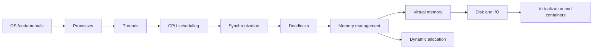

# 🖥️ Operating Systems Interview Guide

এই section OS fundamentals থেকে process/thread execution, synchronization, memory, storage এবং virtualization পর্যন্ত ধারাবাহিক learning path দেয়।

## Chapters

1. [OS Fundamentals](./1-os-fundamentals/index.md)
2. [Processes and Process Management](./2-processes/index.md)
3. [Threads and Multithreading](./3-threads/index.md)
4. [CPU Scheduling](./4-cpu-scheduling/index.md)
5. [Process Synchronization](./5-synchronization/index.md)
6. [Deadlocks](./6-deadlocks/index.md)
7. [Memory Management](./7-memory-management/index.md)
8. [Virtual Memory](./8-virtual-memory/index.md)
9. [Disk Scheduling and Storage](./9-disk-storage/index.md)
10. [Virtualization and Containers](./10-virtualization-containers/index.md)
11. [Dynamic Memory Allocation](./11-dynamic-memory-allocation/index.md)

## Suggested study order

প্রথমে process, thread ও scheduling পড়ুন। এরপর synchronization/deadlock এবং paging/virtual memory বুঝুন। সবশেষে storage, virtualization ও allocator internals পড়লে পুরো OS execution path সংযুক্তভাবে বোঝা যাবে।
