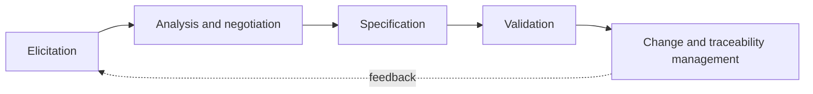
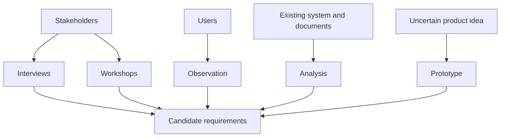
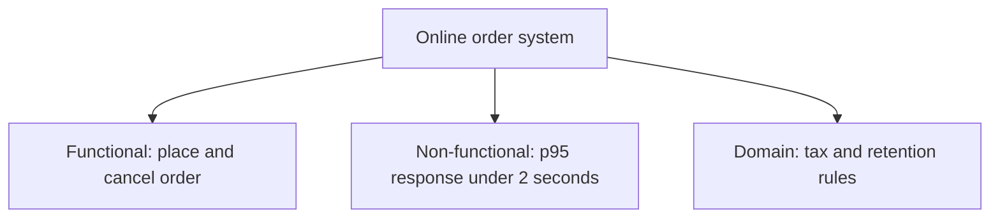
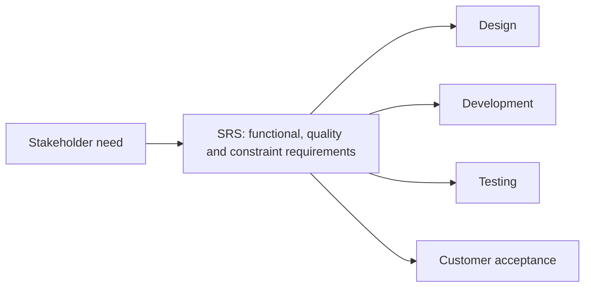
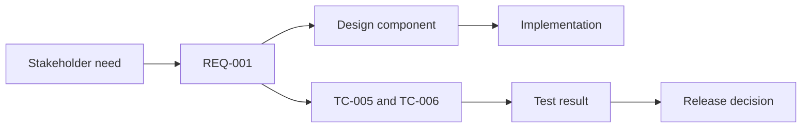
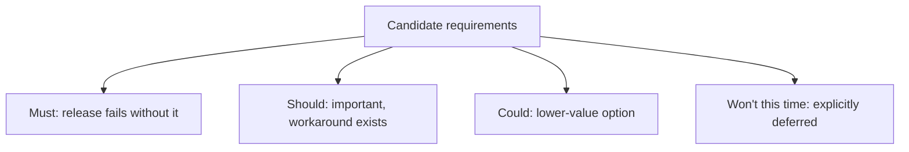
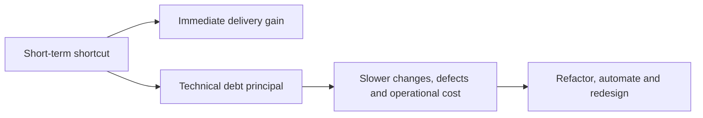

## 15. What is requirements engineering, and what are its main activities?

**Requirements Engineering (RE)** হলো একটি systematic process, যার মাধ্যমে একটি software system এর **requirements** identify, analyze, document, validate, এবং manage করা হয়। এটি SDLC এর একদম শুরুর দিকের এবং সবচেয়ে গুরুত্বপূর্ণ activity, কারণ ভুল বা অসম্পূর্ণ requirement পুরো project কে ব্যর্থ করে দিতে পারে।

**Main Activities:**

1. **Requirements Elicitation** — stakeholder দের কাছ থেকে requirement সংগ্রহ করা
2. **Requirements Analysis** — সংগৃহীত requirement গুলো বিশ্লেষণ করে conflict, ambiguity, বা gap খুঁজে বের করা
3. **Requirements Specification** — analyzed requirement গুলোকে formal document আকারে লেখা (যেমন SRS)
4. **Requirements Validation** — নিশ্চিত করা যে document করা requirement গুলো actual stakeholder need এর সাথে মিলছে
5. **Requirements Management** — পুরো project জীবনচক্র জুড়ে requirement এর change track এবং control করা

---

### What is the difference between requirements elicitation, analysis, specification, validation, and management?

| Activity | কী করা হয় | মূল Focus |
|---|---|---|
| **Elicitation** | Stakeholder, user, client দের কাছ থেকে **raw information** সংগ্রহ করা (interview, survey, ইত্যাদির মাধ্যমে) | তথ্য **সংগ্রহ** করা |
| **Analysis** | সংগৃহীত requirement গুলো পরীক্ষা করে **conflict, redundancy, ambiguity, feasibility** যাচাই করা এবং prioritize করা | তথ্য **বিশ্লেষণ ও পরিশোধন** করা |
| **Specification** | Analyzed requirement গুলোকে একটি **formal, structured document** (যেমন SRS) এ লিপিবদ্ধ করা, যাতে সবাই একই ভাষায় বুঝতে পারে | তথ্য **document** করা |
| **Validation** | Client/stakeholder দের সাথে document করা requirement গুলো review করা, যাতে নিশ্চিত হওয়া যায় এটাই তারা আসলে চেয়েছিলেন | সঠিকতা **যাচাই** করা |
| **Management** | Project চলাকালীন requirement এ যে change আসে, তা track, control, এবং version manage করা (Requirements Traceability সহ) | Change **নিয়ন্ত্রণ ও track** করা |

**সহজ ভাষায়:** Elicitation দিয়ে raw তথ্য পাওয়া যায় → Analysis দিয়ে সেটাকে পরিশোধন করা হয় → Specification দিয়ে formal document তৈরি হয় → Validation দিয়ে সেটা সঠিক কিনা যাচাই করা হয় → Management দিয়ে পুরো process টাকে ongoing ভাবে maintain করা হয়।

---

## 16. What are common techniques for requirements elicitation?

- **Interviews** — client/stakeholder দের সাথে সরাসরি (এক-এক করে বা group এ) কথা বলে requirement জানা
- **Questionnaires/Surveys** — বড় সংখ্যক user এর কাছ থেকে structured প্রশ্নের মাধ্যমে তথ্য সংগ্রহ
- **Brainstorming Sessions** — team এবং stakeholder একসাথে বসে খোলামেলাভাবে idea শেয়ার করা
- **Workshops (JAD - Joint Application Development)** — client এবং developer একসাথে বসে দ্রুত requirement finalize করা
- **Observation** — user রা বর্তমানে কীভাবে কাজ করেন তা সরাসরি পর্যবেক্ষণ করা
- **Document Analysis** — existing system এর manual, report, বা policy document পর্যালোচনা করা
- **Prototyping** — একটি sample/mockup তৈরি করে user দের feedback নেওয়া
- **Use Cases** — user এবং system এর মধ্যে interaction step-by-step বর্ণনা করা

---

### How do interviews, questionnaires, brainstorming sessions, and use cases each contribute to gathering requirements?

**Interviews:**
এটি সবচেয়ে **in-depth এবং personalized** technique। সরাসরি কথোপকথনের মাধ্যমে **follow-up প্রশ্ন** করা যায়, যা deep insight এবং hidden requirement (যা stakeholder নিজেও প্রথমে বলতে ভুলে যান) বের করে আনতে সাহায্য করে। তবে এটি **সময়সাপেক্ষ** এবং কম সংখ্যক মানুষের সাথেই সম্ভব।

**Questionnaires:**
এটি **বড় সংখ্যক user** এর কাছ থেকে দ্রুত এবং কম খরচে তথ্য সংগ্রহ করতে সাহায্য করে, বিশেষত যখন user রা geographically ছড়িয়ে থাকেন। এতে **quantitative data** পাওয়া যায় (যেমন কতজন user একটি নির্দিষ্ট feature চান), কিন্তু depth কম থাকে, কারণ follow-up প্রশ্ন করার সুযোগ থাকে না।

**Brainstorming Sessions:**
এটি **creative এবং exploratory** requirement বের করে আনতে সাহায্য করে, যেখানে বিভিন্ন stakeholder এবং team member একসাথে idea শেয়ার করেন কোনো judgment বা restriction ছাড়াই। এটি বিশেষভাবে useful যখন project টা নতুন বা innovative, এবং সব সম্ভাবনা explore করা দরকার।

**Use Cases:**
এটি user এবং system এর মধ্যে **interaction কে concrete, step-by-step scenario** আকারে বর্ণনা করে (Actor, Precondition, Main Flow, Alternative Flow, Postcondition সহ)। এটি **functional requirement কে স্পষ্ট এবং testable** করে তোলে, এবং developer দের বুঝতে সাহায্য করে system টা বাস্তবে কীভাবে ব্যবহার হবে।

---

### Is there a meaningful difference between "requirements gathering" and "requirements elicitation"?

হ্যাঁ, technically একটা সূক্ষ্ম কিন্তু গুরুত্বপূর্ণ পার্থক্য আছে, যদিও অনেকে দুটো term কে interchangeably ব্যবহার করেন:

- **Requirements Gathering** শব্দটি বোঝায় যেন requirement গুলো **already ready অবস্থায় stakeholder দের মাথায় বসে আছে**, এবং শুধু সেগুলো "collect" করলেই হবে — একটি **passive** process
- **Requirements Elicitation** শব্দটি বেশি accurate, কারণ বাস্তবে stakeholder রা প্রায়ই নিজেরাও ঠিকভাবে জানেন না তারা কী চান। Elicitation একটি **active, collaborative process**, যেখানে skilled techniques (interview, workshop, prototyping) ব্যবহার করে **hidden, implicit, এবং unstated requirement** গুলোকেও বের করে আনতে হয়

তাই modern software engineering practice এ **"elicitation"** শব্দটাকেই বেশি সঠিক এবং professional মনে করা হয়, কারণ এটি প্রক্রিয়াটির **active এবং investigative** প্রকৃতি কে ভালোভাবে প্রতিফলিত করে।

---

## 17. What is the difference between functional requirements, non-functional requirements, and domain requirements?

| Type | সংজ্ঞা |
|---|---|
| **Functional Requirements** | System টি **কী কী কাজ করবে** তার বর্ণনা — specific features, functions, বা behaviors |
| **Non-Functional Requirements (NFR)** | System **কীভাবে কাজ করবে** তার বর্ণনা — quality attributes যেমন performance, security, usability, reliability |
| **Domain Requirements** | নির্দিষ্ট **business domain বা industry** থেকে আসা requirement, যা সেই domain এর characteristics, regulation, বা standard থেকে উদ্ভূত |

### Can you give examples of each in the context of a real system (e.g., an online banking application)?

**Functional Requirements:**
- User তার username এবং password দিয়ে **login** করতে পারবেন
- User এক account থেকে অন্য account এ **fund transfer** করতে পারবেন
- User তার **transaction history** দেখতে পারবেন
- User **bill payment** করতে পারবেন
- System **OTP (One-Time Password)** পাঠাবে transaction verify করার জন্য

**Non-Functional Requirements:**
- System কে **99.9% uptime/availability** বজায় রাখতে হবে (Reliability)
- Login page **২ সেকেন্ডের মধ্যে** load হতে হবে (Performance)
- User data **AES-256 encryption** দিয়ে সুরক্ষিত থাকতে হবে (Security)
- System একই সময়ে **১০,০০০ concurrent user** handle করতে পারবে (Scalability)
- Interface টি **সহজে ব্যবহারযোগ্য** এবং visually impaired user দের জন্য accessible হতে হবে (Usability)

**Domain Requirements:**
- System টি **central bank এর regulation** (যেমন Bangladesh Bank এর নিয়মাবলী) মেনে চলতে হবে
- **KYC (Know Your Customer)** verification বাধ্যতামূলক হতে হবে
- **Anti-Money Laundering (AML)** নিয়ম অনুসরণ করতে হবে transaction monitoring এ
- একটি নির্দিষ্ট amount এর বেশি transaction হলে **regulatory reporting** করতে হবে
- **Audit trail** বজায় রাখতে হবে সব financial transaction এর জন্য, যা banking industry এর standard practice

---

## 18. What is a requirements specification document (SRS), and why is it important?

**SRS** হলো একটি formal document, যা একটি software system এর সব **functional এবং non-functional requirement** কে বিস্তারিতভাবে, structured আকারে বর্ণনা করে। এটি client, developer, tester, এবং project manager — সবার জন্য একটি **single source of truth** হিসেবে কাজ করে।

**কেন গুরুত্বপূর্ণ:**
- Client এবং development team এর মধ্যে **common understanding** তৈরি করে
- Development, testing, এবং project planning এর জন্য একটি **reliable baseline** প্রদান করে
- Legal এবং contractual দিক থেকে গুরুত্বপূর্ণ — client এবং vendor এর মধ্যে কী delivered হবে তার প্রমাণ হিসেবে কাজ করে
- **Cost এবং timeline estimation** সহজ করে
- ভবিষ্যতে system maintenance বা enhancement এর জন্য reference document হিসেবে কাজ করে

---

### According to requirements standards, what characteristics should a good SRS have?

IEEE 830 ঐতিহাসিকভাবে বহুল উদ্ধৃত হলেও এটি superseded; modern reference হিসেবে ISO/IEC/IEEE 29148 ব্যবহৃত হয়। নিচের quality characteristics এখনও practical review checklist হিসেবে উপযোগী:

- **Correct** — SRS এ লেখা প্রতিটি requirement actual system need এর সাথে সঠিকভাবে মিলতে হবে
- **Unambiguous** — প্রতিটি requirement এর **একটিমাত্র interpretation** থাকতে হবে, কোনো দ্বিধা বা confusion থাকা যাবে না
- **Complete** — সব প্রয়োজনীয় functional এবং non-functional requirement অন্তর্ভুক্ত থাকতে হবে, কোনো gap থাকা যাবে না
- **Consistent** — কোনো requirement যেন অন্য কোনো requirement এর সাথে **contradict** না করে
- **Verifiable (Testable)** — প্রতিটি requirement এমনভাবে লেখা উচিত, যাতে সেটা **test করে verify করা যায়** যে সেটা পূরণ হয়েছে কিনা (vague বা subjective ভাষা এড়িয়ে চলতে হবে)
- **Traceable** — প্রতিটি requirement কে তার **origin (কোন stakeholder need থেকে এসেছে)** এবং forward direction এ (design, code, test case পর্যন্ত) track করা যেতে হবে
- **Ranked for Importance/Stability** — কোন requirement বেশি critical বা কোনটা পরিবর্তন হওয়ার সম্ভাবনা কম/বেশি, তা priority অনুযায়ী চিহ্নিত থাকা উচিত
- **Modifiable** — SRS এমনভাবে structured হওয়া উচিত, যাতে প্রয়োজনে সহজে update করা যায় সামগ্রিক consistency নষ্ট না করে

---

### What is the difference between gathering, analyzing, and documenting requirements?

| ধাপ | কী হয় | Output |
|---|---|---|
| **Gathering (Elicitation)** | Stakeholder দের কাছ থেকে raw requirement সংগ্রহ করা হয় বিভিন্ন technique (interview, survey ইত্যাদি) ব্যবহার করে | Unstructured, raw তথ্য/notes |
| **Analyzing** | সংগৃহীত তথ্য থেকে **conflict, redundancy, ambiguity** খুঁজে বের করে সমাধান করা হয়, requirement গুলোকে **prioritize এবং categorize** (functional/non-functional) করা হয় | পরিশোধিত, organized, conflict-free requirement list |
| **Documenting (Specification)** | Analyzed requirement গুলোকে একটি **formal SRS document** এ লেখা হয়, নির্দিষ্ট format এবং standard (যেমন IEEE 830) অনুসরণ করে, যাতে unambiguous, complete, এবং traceable হয় | চূড়ান্ত SRS document |

**সংক্ষেপে:** Gathering হলো raw material সংগ্রহ করা, Analyzing হলো সেই material কে পরিশোধন এবং organize করা, আর Documenting হলো সেই পরিশোধিত তথ্যকে একটি formal, standard, এবং ব্যবহারযোগ্য document আকারে রূপান্তর করা — যা পুরো project জুড়ে reference হিসেবে ব্যবহৃত হবে।

---

## 19. What is a Requirements Traceability Matrix (RTM), and what purpose does it serve?

**Requirements Traceability Matrix (RTM)** হলো একটি document (সাধারণত table আকারে), যা প্রতিটি requirement কে তার **origin** থেকে শুরু করে **design, development, এবং testing** পর্যন্ত পুরো journey জুড়ে **link/map** করে রাখে। এটি নিশ্চিত করে যে প্রতিটি requirement সঠিকভাবে implement এবং test হয়েছে, এবং কোনো requirement miss হয়ে যায়নি বা কোনো অপ্রয়োজনীয় feature (যা কোনো requirement থেকে আসেনি) তৈরি হয়নি।

**একটি typical RTM এ থাকে:**

| Requirement ID | Requirement Description | Design Document Reference | Code/Module | Test Case ID | Status |
|---|---|---|---|---|---|
| REQ-001 | User login functionality | HLD Section 3.2 | AuthModule.java | TC-005, TC-006 | Passed |

**RTM এর মূল Purpose:**
- প্রতিটি requirement যে **actually addressed** হয়েছে তা নিশ্চিত করা
- **Test coverage** verify করা — কোনো requirement test না করেই বাদ পড়েনি
- **Bidirectional traceability** বজায় রাখা — requirement থেকে code পর্যন্ত (forward) এবং code থেকে requirement পর্যন্ত (backward) track করা যায়
- Project এর **completeness এবং quality** নিশ্চিত করা

---

### How does traceability help during testing, impact analysis, and change management?

**Testing এ সাহায্য:**
- RTM দেখে tester রা নিশ্চিত হতে পারেন যে **প্রতিটি requirement এর জন্য অন্তত একটি test case** আছে কিনা — কোনো gap থাকলে সহজে ধরা পড়ে
- Testing এর সময় **coverage report** তৈরি করা সহজ হয় — কতগুলো requirement test করা হয়েছে, কতগুলো বাকি
- কোনো test fail করলে সেটা সরাসরি কোন requirement এর সাথে related তা দ্রুত identify করা যায়

**Impact Analysis এ সাহায্য:**
- কোনো requirement change হলে, RTM এর মাধ্যমে দ্রুত দেখা যায় সেটা **কোন কোন design document, code module, এবং test case কে প্রভাবিত করবে**
- এতে developer এবং QA team রা আগে থেকেই বুঝতে পারেন কতটুকু **rework** লাগবে, এবং কোনো hidden dependency miss হয়ে যাওয়ার সম্ভাবনা কমে

**Change Management এ সাহায্য:**
- নতুন requirement বা change request আসলে, RTM ব্যবহার করে দেখা যায় এটি existing system এর সাথে **conflict** করছে কিনা
- Change এর **cost এবং effort** আরও নির্ভুলভাবে estimate করা যায়, কারণ affected component গুলো আগে থেকেই জানা থাকে
- **Audit এবং compliance** এর ক্ষেত্রেও RTM গুরুত্বপূর্ণ প্রমাণ হিসেবে কাজ করে (বিশেষত regulated industry যেমন banking, healthcare তে)

---

## 20. How are requirements prioritized, and what techniques are commonly used (e.g., MoSCoW)?

Requirement prioritization প্রয়োজন হয় কারণ সাধারণত **সময়, বাজেট, এবং resource সীমিত থাকে**, তাই সবচেয়ে গুরুত্বপূর্ণ এবং high-value requirement গুলো আগে করা দরকার।

**Common Techniques:**

**১. MoSCoW Method**
এটি সবচেয়ে জনপ্রিয় technique গুলোর একটি, যেখানে requirement গুলোকে চারটি category তে ভাগ করা হয়:
- **M — Must Have:** এই requirement ছাড়া system কাজই করবে না, absolutely mandatory
- **S — Should Have:** গুরুত্বপূর্ণ, কিন্তু এখনই না হলেও চলবে (temporary workaround সম্ভব)
- **C — Could Have:** থাকলে ভালো, কিন্তু না থাকলেও তেমন সমস্যা নেই (nice-to-have)
- **W — Won't Have (this time):** এই release/iteration এ করা হবে না, ভবিষ্যতে বিবেচনা করা হতে পারে

**২. Kano Model**
Customer satisfaction এর ভিত্তিতে requirement কে ভাগ করে — **Basic needs** (না থাকলে অসন্তুষ্টি), **Performance needs** (যত বেশি তত ভালো), এবং **Excitement/Delighter needs** (না থাকলে সমস্যা নেই, কিন্তু থাকলে extra খুশি)

**৩. Weighted Scoring/Value vs. Effort Matrix**
প্রতিটি requirement কে **business value** এবং **implementation effort/cost** এর ভিত্তিতে score দিয়ে, high-value/low-effort item গুলোকে prioritize করা হয়

**৪. 100-Dollar Method (Cumulative Voting)**
Stakeholder দের কাল্পনিক ১০০ ডলার দেওয়া হয়, যা তারা বিভিন্ন requirement এর মধ্যে বিতরণ করেন — যেটাতে বেশি "ডলার" পড়ে, সেটা বেশি priority পায়

**৫. Priority Poker/Planning Poker**
Agile team এ ব্যবহৃত হয়, যেখানে team member রা individually প্রতিটি requirement এর priority/effort নিয়ে vote দেন, তারপর আলোচনা করে consensus এ আসেন

---

### What is "requirements creep" (scope creep at the requirements level), and how is it controlled?

**Requirements Creep (বা Scope Creep)** বলতে বোঝায় project চলাকালীন **ধীরে ধীরে, অনিয়ন্ত্রিতভাবে নতুন নতুন requirement যোগ হতে থাকা**, যা মূল plan, timeline, এবং budget এ ছিল না। এটি সাধারণত ছোট ছোট "just one more feature" ধরনের request থেকে শুরু হয়, যা আলাদাভাবে ছোট মনে হলেও সম্মিলিতভাবে project কে বিশাল আকারে delay এবং over-budget করে দিতে পারে।

**Requirements Creep কীভাবে Control করা হয়:**

- **Clear, well-documented Scope Statement** শুরুতেই তৈরি করা, যেখানে স্পষ্টভাবে লেখা থাকে কী **in-scope** এবং কী **out-of-scope**
- **Formal Change Control Process** চালু রাখা — যেকোনো নতুন requirement বা change কে একটি **Change Request (CR)** হিসেবে জমা দিতে হবে, এবং সেটা **impact analysis** এর মধ্য দিয়ে যেতে হবে (cost, timeline, resource এর উপর প্রভাব যাচাই করে)
- **Change Control Board (CCB)** বা প্রাসঙ্গিক authority থেকে approval নেওয়া বাধ্যতামূলক করা, প্রতিটি change বাস্তবায়নের আগে
- Product Backlog **regularly prioritize এবং groom** করা (Agile এর ক্ষেত্রে), যাতে নতুন requirement আসলে সেটা existing priority এর সাথে তুলনা করে জায়গা পায় বা বাদ পড়ে
- Client এবং stakeholder দের সাথে **regular communication** রাখা, যাতে নতুন idea গুলো সঠিক channel দিয়ে আসে, informal ভাবে নয়
- **MVP (Minimum Viable Product)** approach অনুসরণ করা — প্রথমে শুধু core, essential feature দিয়ে শুরু করা, বাকি সব "nice-to-have" জিনিস future release এ পাঠানো
- Requirement change এর **cost এবং schedule impact** ক্লায়েন্টকে স্পষ্টভাবে জানানো, যাতে তারা বুঝতে পারেন প্রতিটি change এর একটা price আছে

---

## 21. What is technical debt, and how does it typically accumulate over the SDLC?

**Technical Debt** হলো একটি metaphor, যা বোঝায় যখন developer রা **দ্রুত, সহজ (কিন্তু সবসময় সেরা নয় এমন)** সমাধান বেছে নেন কোনো কাজ তাড়াতাড়ি শেষ করার জন্য, তার বদলে যদি তারা সময় নিয়ে সঠিক, দীর্ঘমেয়াদী, well-architected সমাধান বেছে নিতেন। ঠিক যেমন আর্থিক ঋণের ক্ষেত্রে **সুদ (interest)** জমতে থাকে, তেমনি Technical Debt ও সময়ের সাথে সাথে **maintenance cost, bug, এবং complexity** আকারে "সুদ" জমাতে থাকে, যদি সেটা পরিশোধ (refactor) না করা হয়।

**SDLC জুড়ে Technical Debt কীভাবে জমা হয়:**

**Requirement/Design Phase এ:**
- তাড়াহুড়ায় বা অসম্পূর্ণ requirement analysis এর কারণে ভুল architecture decision নেওয়া হয়
- Scalability বা future need বিবেচনা না করে design করা হয়

**Development Phase এ:**
- **Deadline pressure** এর কারণে developer রা shortcut নেন — যেমন proper error handling না করা, code duplicate করা, বা "TODO: fix later" রেখে দেওয়া
- **Insufficient code review** এর কারণে poor-quality code merge হয়ে যায়
- Outdated বা deprecated library/framework ব্যবহার চালিয়ে যাওয়া, upgrade না করে

**Testing Phase এ:**
- সময় বা budget এর অভাবে **automated test coverage কম রাখা**, যার ফলে ভবিষ্যতে change করলে bug ধরা কঠিন হয়ে যায়

**Deployment/Maintenance Phase এ:**
- **Documentation আপডেট না করা**, যার ফলে নতুন developer দের বুঝতে সমস্যা হয়
- Quick hotfix/patch জমা হতে থাকা, যা মূল architecture এর সাথে সামঞ্জস্যপূর্ণ নয়
- **Legacy code** এর উপর নতুন feature চাপাতে থাকা, refactor না করে

Technical Debt কখনো কখনো **ইচ্ছাকৃতভাবে (deliberate)** নেওয়া হয় — যেমন market এ দ্রুত product আনার জন্য — কিন্তু কখনো কখনো এটি **অনিচ্ছাকৃতভাবে (accidental)** জমা হয়, poor practice বা lack of awareness এর কারণে।

---

### How do you balance paying down technical debt against delivering new features?

- **Technical Debt কে visible এবং trackable করা** — একে Product Backlog এ একটি regular item হিসেবে রাখা (যেমন "Refactor payment module"), শুধু developer দের মাথায় রাখা কোনো informal বিষয় হিসেবে না রেখে
- **নির্দিষ্ট শতাংশ সময়/capacity বরাদ্দ রাখা** — অনেক team প্রতিটি sprint এর **১০-২০% সময় technical debt payoff** এর জন্য আলাদা রাখে, নিয়মিতভাবে
- **Debt কে Prioritize করা business impact অনুযায়ী** — সব debt সমান গুরুত্বপূর্ণ নয়; যেসব debt **high-risk এলাকায়** আছে (যেমন security-critical বা frequently-modified code) সেগুলোকে আগে ঠিক করা উচিত
- **"Boy Scout Rule" অনুসরণ করা** — যখনই কোনো code touch করা হয়, তখন সেটাকে একটু হলেও পরিষ্কার/improve করে রেখে যাওয়া, বড় dedicated refactoring project এর অপেক্ষা না করে
- **Regular Code Review এবং Static Analysis Tools** ব্যবহার করে debt আগে থেকেই কমানো, যাতে নতুন debt কম জমে
- **Stakeholder দের সাথে transparent communication রাখা** — Technical Debt এর business impact (যেমন ধীরগতির development, বেশি bug, higher maintenance cost) বুঝিয়ে বলা, যাতে non-technical stakeholder রাও এর গুরুত্ব বোঝেন এবং সময় বরাদ্দ করতে রাজি হন
- **Dedicated "Refactoring Sprint"** মাঝে মাঝে রাখা, যদি debt অনেক বেশি জমে যায় এবং এটি নতুন feature development কে significantly ধীর করে দিচ্ছে
- **Cost of Delay বিশ্লেষণ করা** — যদি debt না পরিশোধ করলে ভবিষ্যতে feature development আরও ধীর এবং costly হয়ে যাবে, তাহলে সেই "future cost" কে বর্তমান decision এ বিবেচনায় আনা

**সংক্ষেপে:** Technical Debt সম্পূর্ণভাবে এড়ানো সম্ভব নয়, এবং সবসময় সেটা খারাপও নয় — অনেক সময় business need এ ইচ্ছাকৃত debt নেওয়াটাই যুক্তিসঙ্গত সিদ্ধান্ত। মূল কথা হলো এটিকে **conscious ভাবে manage করা**, যাতে এটি অনিয়ন্ত্রিতভাবে জমে গিয়ে দীর্ঘমেয়াদে পুরো product এর development velocity এবং quality কে নষ্ট করে না দেয়।
