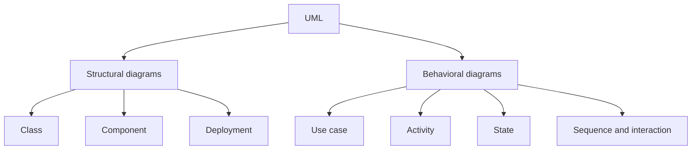
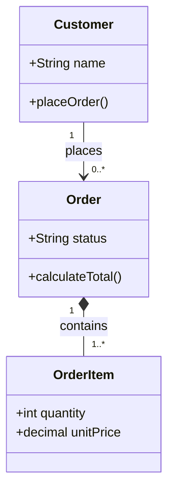
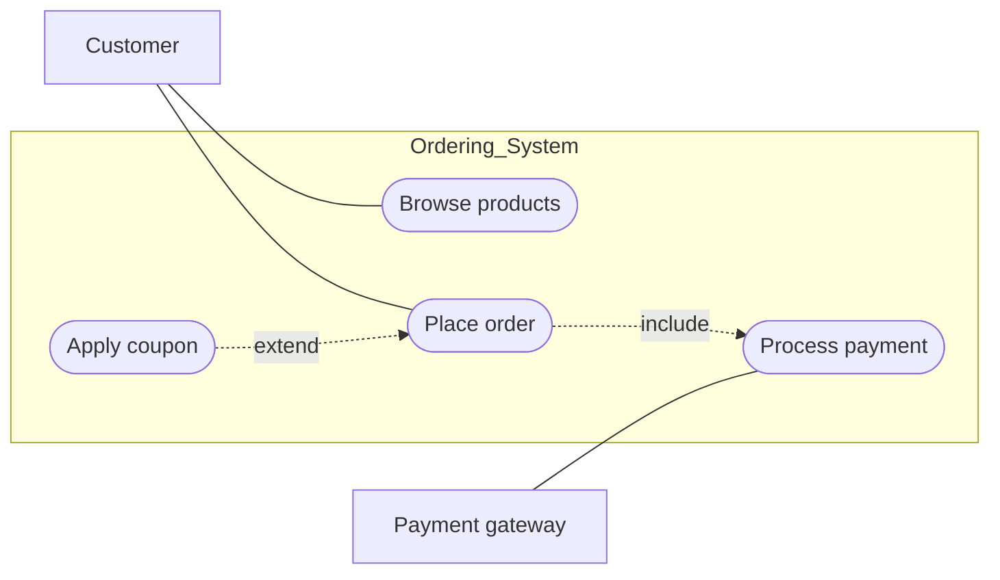
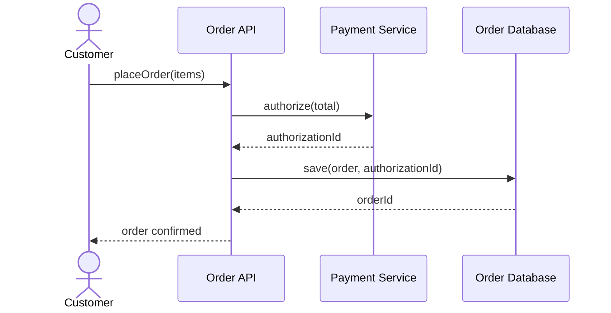
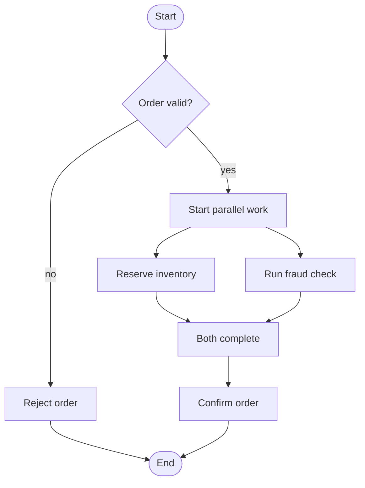
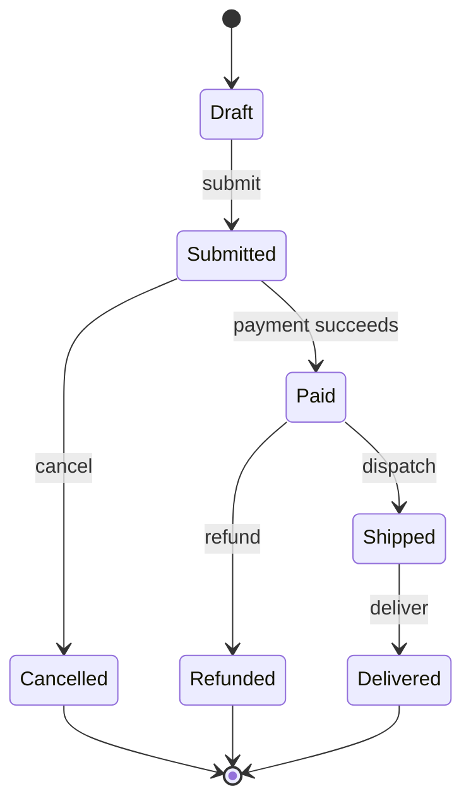
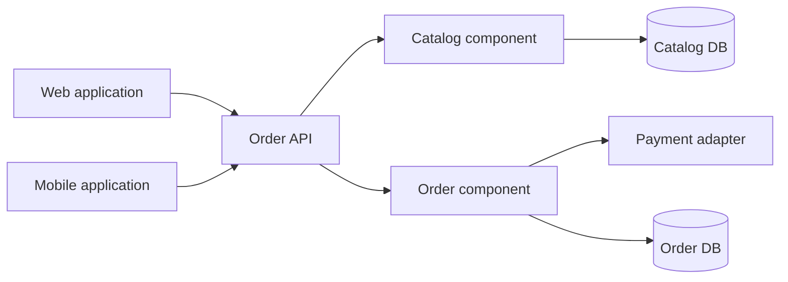
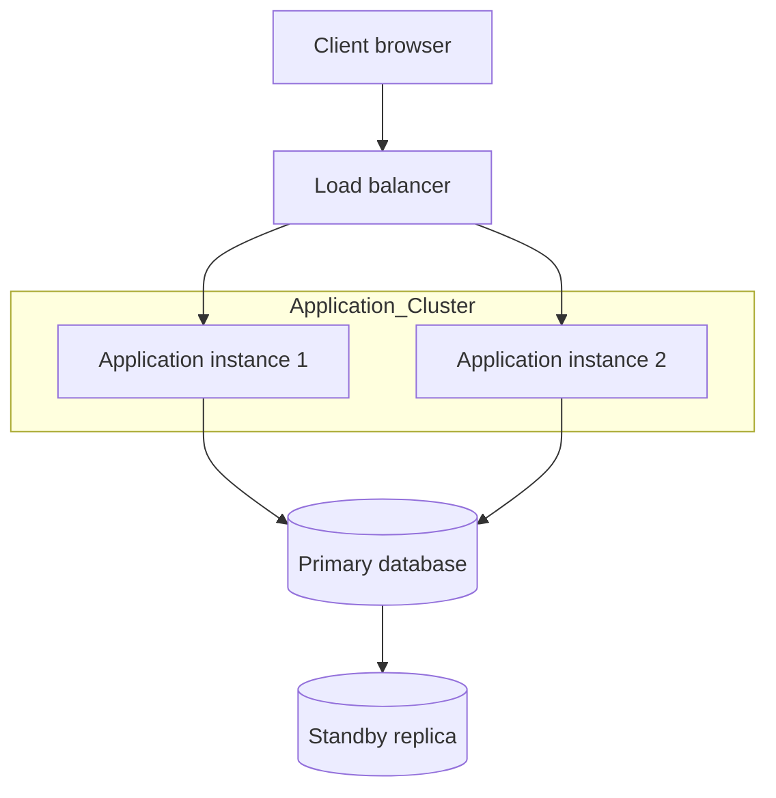
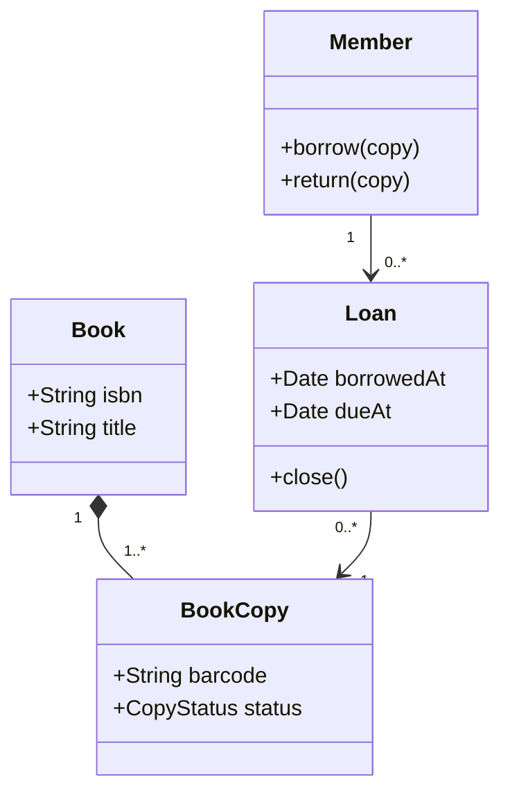

## 37. What is UML, and how are its diagrams broadly categorized?



**UML (Unified Modeling Language)** হলো একটি standardized, graphical **modeling language**, যা software system কে design এবং document করার জন্য ব্যবহার করা হয়। এটি কোনো programming language নয়, বরং একটি **visual notation system**, যা developer, architect, এবং stakeholder দের মধ্যে system এর structure এবং behavior সম্পর্কে **common understanding** তৈরি করতে সাহায্য করে। UML তৈরি করেছিলেন Grady Booch, Ivar Jacobson, এবং James Rumbaugh, এবং এটি বর্তমানে **OMG (Object Management Group)** দ্বারা maintained।

---

### What is the difference between structural (static) diagrams and behavioral (dynamic) diagrams?

UML diagram গুলোকে মূলত দুটি বড় category তে ভাগ করা হয়:

**Structural (Static) Diagrams:**
এই diagram গুলো system এর **static structure** দেখায় — অর্থাৎ system টি কী কী element (class, object, component) নিয়ে গঠিত এবং তাদের মধ্যে **সম্পর্ক (relationship)** কী, সময়ের সাথে system এর behavior পরিবর্তন না দেখিয়ে।

সাধারণ Structural Diagrams:
- **Class Diagram**
- **Object Diagram**
- **Component Diagram**
- **Deployment Diagram**
- **Package Diagram**

**Behavioral (Dynamic) Diagrams:**
এই diagram গুলো system এর **behavior** দেখায় — অর্থাৎ সময়ের সাথে system এর বিভিন্ন অংশ কীভাবে **interact** করে, কীভাবে **process** সম্পন্ন হয়, এবং object গুলোর **state** কীভাবে পরিবর্তিত হয়।

সাধারণ Behavioral Diagrams:
- **Use Case Diagram**
- **Sequence Diagram**
- **Activity Diagram**
- **State Diagram**
- **Communication/Collaboration Diagram**

**মূল পার্থক্য:** Structural diagram উত্তর দেয় **"system টা কী দিয়ে তৈরি?"**, আর Behavioral diagram উত্তর দেয় **"system টা কীভাবে কাজ করে?"**।

---

### What are the most common diagrams used to model OOP systems?

- **Class Diagram** — system এর class structure এবং relationship দেখাতে (সবচেয়ে বেশি ব্যবহৃত)
- **Use Case Diagram** — system এর functional requirement এবং user interaction দেখাতে
- **Sequence Diagram** — object গুলোর মধ্যে interaction এবং method call এর order দেখাতে
- **Activity Diagram** — business process বা workflow এর logic দেখাতে
- **State Diagram** — একটি object এর জীবনচক্রে বিভিন্ন state এবং transition দেখাতে

---

## 38. What is a class diagram, and what does it represent?



**Class Diagram** হলো একটি **structural UML diagram**, যা একটি system এর **classes**, তাদের **attributes (properties)**, **methods (operations)**, এবং class গুলোর মধ্যে বিভিন্ন **relationship** (inheritance, association, aggregation, composition) দেখায়। এটি OOP system design করার সময় সবচেয়ে বেশি ব্যবহৃত diagram।

একটি class কে সাধারণত একটি **rectangle** দিয়ে represent করা হয়, যা তিনটি অংশে ভাগ থাকে:
1. **Class Name** (উপরে)
2. **Attributes** (মাঝে)
3. **Methods** (নিচে)

---

### How are relationships such as inheritance, association, aggregation, and composition shown in a class diagram, and what do the different arrow types/notations (e.g., open triangle, filled diamond, open diamond) represent?

**১. Inheritance (Generalization)**
একটি child class একটি parent class থেকে properties এবং behavior **inherit** করে ("is-a" relationship)।
- **Notation:** একটি solid line, যার শেষে একটি **open (hollow) triangle** থাকে, যা parent class এর দিকে নির্দেশ করে
- **উদাহরণ:** `Dog` → `Animal` (Dog is an Animal)

**২. Association**
দুটি class এর মধ্যে একটি সাধারণ, structural সম্পর্ক, যেখানে একটি object অন্য object সম্পর্কে জানে এবং তার সাথে কাজ করে ("uses-a" বা general relationship)।
- **Notation:** একটি সাধারণ **solid line**, কখনো কখনো arrow head সহ (direction বোঝাতে) এবং **multiplicity** (যেমন 1, 0..*, 1..*) উল্লেখ থাকতে পারে দুই প্রান্তে
- **উদাহরণ:** `Teacher` — `Student` (একজন Teacher একাধিক Student কে পড়ান)

**৩. Aggregation**
একটি **"has-a"** সম্পর্ক, যেখানে একটি object অন্য object কে ধারণ করে, কিন্তু উভয়ের **জীবনচক্র (lifecycle) স্বাধীন** — অর্থাৎ "whole" object destroy হলেও "part" object আলাদাভাবে বেঁচে থাকতে পারে। এটি একটি **weak "has-a"** সম্পর্ক।
- **Notation:** একটি solid line, যার শুরুতে (whole এর পাশে) একটি **open (hollow) diamond** থাকে
- **উদাহরণ:** `Department` ◇— `Professor` (একটি Department এ Professor থাকে, কিন্তু Department বন্ধ হয়ে গেলেও Professor অন্য জায়গায় কাজ করতে পারেন)

**৪. Composition**
একটি **strong "has-a"** সম্পর্ক, যেখানে "part" object সম্পূর্ণভাবে "whole" object এর উপর নির্ভরশীল — "whole" destroy হলে "part" ও destroy হয়ে যায় (lifecycle একসাথে বাঁধা)।
- **Notation:** একটি solid line, যার শুরুতে (whole এর পাশে) একটি **filled (solid) diamond** থাকে
- **উদাহরণ:** `House` ◆— `Room` (একটি House ভেঙে ফেললে তার Room গুলোও আর থাকে না)

**সংক্ষিপ্ত Notation Summary:**

| Relationship | Notation | সম্পর্কের ধরন |
|---|---|---|
| **Inheritance** | Solid line + open triangle | "is-a" |
| **Association** | Solid line (± arrow) | সাধারণ সম্পর্ক |
| **Aggregation** | Solid line + open diamond | Weak "has-a" (independent lifecycle) |
| **Composition** | Solid line + filled diamond | Strong "has-a" (dependent lifecycle) |

---

### What is the difference between a class diagram and an object diagram?

| বিষয় | **Class Diagram** | **Object Diagram** |
|---|---|---|
| **কী দেখায়** | Class এর **blueprint/template** — general structure | একটি নির্দিষ্ট সময়ে system এর **actual instances (objects)** এবং তাদের বর্তমান data |
| **Level** | Abstract, design-time | Concrete, একটি **snapshot** (নির্দিষ্ট মুহূর্তের অবস্থা) |
| **উদাহরণ** | `Student` class (name: String, age: int) | `student1: Student` (name = "Rahim", age = 22) — একটি actual object তার real value সহ |
| **ব্যবহার** | Overall system design বোঝাতে | নির্দিষ্ট scenario তে objects গুলো কীভাবে সম্পর্কিত তা বোঝাতে (উদাহরণস্বরূপ, জটিল relationship verify করতে) |

সহজ কথায়, Class Diagram হলো একটি **cookie cutter (ছাঁচ)**, আর Object Diagram হলো সেই ছাঁচ দিয়ে তৈরি **নির্দিষ্ট cookie গুলোর একটি snapshot**।

---

## 39. What is a use case diagram, and what are its main components (actors, use cases, relationships)?



Mermaid-এ dedicated UML use-case notation নেই, তাই উপরের diagramটি actor, system boundary এবং include/extend direction বোঝানোর practical approximation। Formal UML tool-এ actor stick figure ও `<<include>>`/`<<extend>>` stereotype ব্যবহার করতে হবে।

**Use Case Diagram** হলো একটি **behavioral UML diagram**, যা একটি system এর **functional requirements** কে high-level এ দেখায় — অর্থাৎ **কারা (actors)** system ব্যবহার করবে এবং তারা system এর সাথে **কী কী কাজ (use cases)** করতে পারবে। এটি মূলত requirement gathering এবং client communication এ ব্যবহৃত হয়, কারণ এটি বোঝা সহজ এবং technical detail ছাড়াই high-level functionality দেখায়।

**Main Components:**

**১. Actor**
System এর সাথে interact করা কোনো external entity — এটি একজন **user (human)** হতে পারে, বা অন্য একটি **external system**। Notation: একটি **স্টিক ফিগার (stick figure)** দিয়ে represent করা হয়।
- উদাহরণ: `Customer`, `Admin`, `Payment Gateway` (system actor)

**২. Use Case**
System এর একটি নির্দিষ্ট **functionality বা কাজ**, যা actor এর জন্য একটি নির্দিষ্ট value/goal অর্জন করে। Notation: একটি **oval/ellipse** দিয়ে represent করা হয়।
- উদাহরণ: "Login", "Place Order", "Generate Report"

**৩. System Boundary**
একটি **rectangle**, যা system এর scope নির্ধারণ করে — এর ভেতরে সব use case থাকে, এবং actor গুলো এর বাইরে থাকে

**৪. Relationships**
- **Association** — actor এবং use case এর মধ্যে সংযোগ (একটি সাধারণ line দিয়ে দেখানো হয়)
- **Include** এবং **Extend** (নিচে বিস্তারিত)
- **Generalization** — একটি actor বা use case অন্য একটির থেকে inherit করতে পারে (যেমন `Admin` actor `User` actor এর একটি specialized version হতে পারে)

---

### What is the difference between "include" and "extend" relationships in a use case diagram?

**Include Relationship:**
একটি use case **অন্য একটি use case এর functionality বাধ্যতামূলকভাবে ব্যবহার করে** — অর্থাৎ base use case টি সম্পন্ন করতে হলে included use case টি **অবশ্যই সম্পন্ন হতে হবে**। এটি common, reusable functionality কে আলাদা করে বের করে আনতে ব্যবহৃত হয়।
- **Notation:** dashed arrow, লেবেল `<<include>>`, base use case থেকে included use case এর দিকে নির্দেশ করে
- **উদাহরণ:** "Place Order" use case **সবসময়** "Verify Payment" use case কে include করে — অর্থাৎ order place করতে হলে payment verify করতেই হবে

**Extend Relationship:**
একটি use case **ঐচ্ছিকভাবে (conditionally)** অন্য একটি use case এর behavior দিয়ে extend হতে পারে — অর্থাৎ extending use case টি শুধুমাত্র **নির্দিষ্ট শর্ত পূরণ হলেই** ঘটে, এটি বাধ্যতামূলক নয়।
- **Notation:** dashed arrow, লেবেল `<<extend>>`, extending use case থেকে base use case এর দিকে নির্দেশ করে
- **উদাহরণ:** "Place Order" use case কে "Apply Discount Coupon" use case **extend** করতে পারে — কিন্তু শুধুমাত্র যদি customer এর কাছে একটি valid coupon থাকে, তাহলেই এটা ঘটবে; নাহলে order স্বাভাবিকভাবেই সম্পন্ন হবে

**সংক্ষেপে পার্থক্য:** Include মানে **"অবশ্যই ঘটবে"** (mandatory), Extend মানে **"শর্তসাপেক্ষে ঘটতে পারে"** (optional)।

---

## 40. What is a sequence diagram, and how does it show interaction between objects over time?



**Sequence Diagram** হলো একটি **behavioral UML diagram**, যা দেখায় বিভিন্ন **object/participant** সময়ের সাথে সাথে (chronologically) একে অপরের সাথে **কীভাবে message পাঠায় এবং কী order এ interact করে**, একটি নির্দিষ্ট scenario বা use case বাস্তবায়নের জন্য। এটি একটি **vertical time axis** ব্যবহার করে, যেখানে উপর থেকে নিচে সময় অগ্রসর হয়।

---

### What do lifelines, activation bars, and messages represent in a sequence diagram?

**Lifeline:**
প্রতিটি participant/object কে একটি **vertical dashed line** দিয়ে represent করা হয়, যা object এর top এ একটি box (object এর নাম সহ, সাধারণত `objectName: ClassName` format এ) দিয়ে শুরু হয়। Lifeline দেখায় সেই object পুরো interaction জুড়ে **কতক্ষণ existed/active** ছিল।

**Activation Bar (Execution Occurrence):**
Lifeline এর উপর একটি সরু **rectangle/bar**, যা দেখায় কখন একটি object **actively কোনো কাজ execute করছে** (অর্থাৎ একটি method call এর execution চলাকালীন সময়)। যত সময় ধরে method টি চলে, activation bar তত বড় হয়।

**Message:**
Object গুলোর মধ্যে একটি lifeline থেকে অন্য lifeline এ **horizontal arrow** দিয়ে message দেখানো হয়, যা একটি **method call** বা communication represent করে। বিভিন্ন ধরনের message আছে:
- **Synchronous Message** — solid line, filled arrowhead — caller response এর জন্য অপেক্ষা করে
- **Asynchronous Message** — solid line, open/line arrowhead — caller অপেক্ষা করে না
- **Return Message** — dashed line, open arrowhead — method call এর response দেখাতে
- **Self-Message** — একটি object নিজেকেই call করছে (একটি ছোট loop-back arrow দিয়ে দেখানো হয়)

---

### How would you use a sequence diagram to illustrate polymorphic method calls at runtime?

Polymorphism এ, একটি parent class/interface টাইপের reference দিয়ে call করা method, **runtime এ actual object এর type অনুযায়ী** ভিন্ন ভিন্ন implementation execute করে। Sequence Diagram এ এটি illustrate করার উপায়:

**পদ্ধতি:**

১. Lifeline এর box এ object টির টাইপ **interface/parent class** হিসেবে দেখানো যেতে পারে (যেমন `shape: Shape`), যা বোঝায় caller শুধু abstraction এর সাথে interact করছে, কিন্তু actual runtime এ এটি কোনো specific subclass (যেমন `Circle` বা `Square`) এর object হতে পারে

২. Message call টি সাধারণভাবে দেখানো হয় (যেমন `shape.draw()`), যা caller এর দৃষ্টিকোণ থেকে **একই দেখতে**, actual object এর type নির্বিশেষে

৩. Polymorphic behavior স্পষ্টভাবে দেখানোর জন্য, প্রায়ই **একাধিক alternative scenario (Alt Fragment)** ব্যবহার করা হয় — UML এর **`alt` (alternative) combined fragment** (একটি dashed rectangle, ভেতরে `alt` লেখা এবং কয়েকটি section আলাদা dashed line দিয়ে ভাগ করা) দিয়ে দেখানো যায় যে, runtime object যদি `Circle` হয় তাহলে একরকম internal execution হবে, আর যদি `Square` হয় তাহলে অন্যরকম — যদিও caller এর call করা message একই (`draw()`)

৪. প্রতিটি alternative branch এ, নিজ নিজ activation bar দেখিয়ে বোঝানো যায় যে actual method execution (internal logic) ভিন্ন — যেমন `Circle` এর `draw()` একটি radius-based calculation করছে, আর `Square` এর `draw()` একটি side-length-based calculation করছে

**সংক্ষেপে বলতে গেলে:** Sequence diagram এ polymorphism দেখানোর মূল কৌশল হলো — caller side এ শুধু **abstract/interface type** এর সাথে interaction দেখানো (যা polymorphism এর মূল ভাবনা — caller কে actual implementation জানতে হয় না), এবং প্রয়োজনে `alt` fragment ব্যবহার করে দেখানো যে ভিন্ন ভিন্ন runtime object type এ ভিন্ন ভিন্ন internal behavior ঘটে, যদিও external message call এবং method signature একই থাকে। এটি polymorphism এর মূল সুবিধা — **"same interface, different implementation"** — কে visually spot করতে সাহায্য করে।


## 41. What is an activity diagram, and how does it differ from a traditional flowchart?



এটি Mermaid flowchart দিয়ে UML activity flow-এর approximation। Formal UML-এ initial/final node, decision/merge diamond এবং parallel কাজের জন্য fork/join bar ব্যবহার করা হয়।

**Activity Diagram** হলো একটি **behavioral UML diagram**, যা একটি **business process বা workflow** এর ধাপে ধাপে logic দেখায় — কার্যক্রমের sequence, decision point, parallel activities, এবং control flow সহ। এটি অনেকটা flowchart এর মতো দেখতে হলেও এতে কিছু গুরুত্বপূর্ণ অতিরিক্ত সুবিধা আছে।

**Activity Diagram বনাম Traditional Flowchart:**

| বিষয় | **Traditional Flowchart** | **Activity Diagram** |
|---|---|---|
| **Concurrency** | Parallel/concurrent process দেখানোর কোনো standard উপায় নেই | **Fork এবং Join** notation দিয়ে parallel activities স্পষ্টভাবে দেখানো যায় |
| **Swimlanes** | সাধারণত থাকে না | **Swimlane** ব্যবহার করে দেখানো যায় কোন activity **কার (কোন role/department/object) দায়িত্বে** সম্পন্ন হচ্ছে |
| **Object Flow** | শুধু control flow দেখায় | Control flow এর পাশাপাশি **object flow** (কোন data/object এক activity থেকে আরেকটায় যাচ্ছে) ও দেখাতে পারে |
| **UML Integration** | কোনো standard OOP/UML এর সাথে যুক্ত নয় | UML এর অংশ, তাই class diagram, use case diagram এর সাথে সামঞ্জস্যপূর্ণভাবে ব্যবহার করা যায় |
| **Formal Semantics** | কম formal, বিভিন্ন প্রতিষ্ঠানে বিভিন্ন notation ব্যবহৃত হয় | Standardized notation (start node, end node, decision node, fork/join) |
| **ব্যবহার** | সাধারণ algorithm/logic দেখাতে | Business process, workflow, এবং use case এর internal logic মডেল করতে বেশি উপযুক্ত |

সংক্ষেপে, Activity Diagram কে flowchart এর একটি **more powerful, standardized, এবং OOP-friendly version** হিসেবে ভাবা যায়, যা বিশেষভাবে **concurrency এবং responsibility assignment** দেখাতে সক্ষম।

---

### What do swimlanes represent in an activity diagram?

**Swimlane** হলো activity diagram কে vertical বা horizontal ভাগে ভাগ করা **section/column**, যেখানে প্রতিটি lane একটি নির্দিষ্ট **responsible party** (যেমন একটি role, department, actor, বা system component) কে represent করে। যে activity গুলো একটি নির্দিষ্ট lane এর মধ্যে থাকে, সেগুলো সেই lane এর owner দ্বারা সম্পন্ন হয়।

**উদাহরণ:** একটি "Order Processing" activity diagram এ তিনটি swimlane থাকতে পারে — **Customer**, **Sales System**, এবং **Warehouse** — যেখানে "Place Order" activity `Customer` lane এ, "Process Payment" activity `Sales System` lane এ, এবং "Pack and Ship" activity `Warehouse` lane এ থাকবে।

Swimlane এর মূল সুবিধা হলো এটি একটি process এ **কার কী দায়িত্ব** তা visually স্পষ্ট করে তোলে, যা বিশেষভাবে useful যখন multiple actor/system একসাথে একটি workflow এ জড়িত থাকে।

---

## 42. What is a state machine (state chart) diagram, and what kinds of systems is it best suited for modeling?



**State Machine Diagram (State Chart Diagram)** হলো একটি behavioral UML diagram, যা একটি **single object এর জীবনচক্রে (lifecycle)** সম্ভাব্য সব **state (অবস্থা)** এবং সেই state গুলোর মধ্যে **transition** কীভাবে ঘটে (কোন event/condition এর কারণে) তা দেখায়।

**কোন ধরনের System এ Best Suited:**
- যেসব object এর behavior তার **বর্তমান অবস্থার (state) উপর নির্ভরশীল** — যেমন একটি `Order` object এর state (Placed → Confirmed → Shipped → Delivered → Cancelled)
- **Event-driven system**, যেখানে external event এর response এ object এর behavior পরিবর্তিত হয় (যেমন একটি traffic light system, vending machine)
- **Protocol বা workflow-heavy system**, যেমন একটি network connection এর state (Connecting → Connected → Disconnected)
- **Embedded system এবং real-time system**, যেখানে device এর বিভিন্ন operational mode (Idle, Active, Sleep, Error) মডেল করা প্রয়োজন
- UI component এর behavior মডেল করতে, যেমন একটি button এর state (Enabled, Disabled, Hovered, Pressed)

---

### What is the difference between a state and a transition in this diagram?

| বিষয় | **State** | **Transition** |
|---|---|---|
| **সংজ্ঞা** | একটি object এর নির্দিষ্ট সময়ে **অবস্থা বা condition**, যা কিছু সময়ের জন্য স্থায়ী থাকে | একটি state থেকে অন্য state এ **পরিবর্তন/movement**, যা কোনো event/trigger এর কারণে ঘটে |
| **Notation** | **Rounded rectangle**, ভেতরে state এর নাম লেখা থাকে | **Arrow** (একটি state থেকে অন্য state এর দিকে), সাথে event/guard condition label করা থাকে |
| **উদাহরণ** | "Order Placed", "Payment Pending", "Shipped" | "Payment Received" (Payment Pending → Confirmed এ transition ঘটায়) |
| **Duration** | কিছু সময়ের জন্য স্থায়ী থাকে | তাৎক্ষণিক (instantaneous) ঘটনা |
| **প্রকার** | Simple state, Composite state (নেস্টেড sub-state সহ), Initial/Final state | Internal transition, External transition, Self-transition (একই state এ ফিরে আসা) |

**উদাহরণ:** একটি `Order` এর জন্য — "Placed" এবং "Shipped" হলো **state**, আর "Order টি Warehouse এ Pack হয়ে গেলে" ঘটনাটি **Placed → Shipped** এর মধ্যে যে **transition** ঘটায়, সেটাই transition।

---

## 43. What is a component diagram, and what does it show about a system's architecture?



এটি readable component view; formal UML component diagram-এ component symbol এবং provided/required interface notation যোগ করা যায়।

**Component Diagram** হলো একটি **structural UML diagram**, যা একটি system এর **high-level software components** (যেমন modules, libraries, services, executables) এবং তাদের মধ্যে **dependency এবং interface** কীভাবে সংযুক্ত তা দেখায়। এটি মূলত **software architecture এর logical/organizational structure** কে represent করে — অর্থাৎ কোড কীভাবে বিভিন্ন replaceable, deployable অংশে সংগঠিত।

**একটি Component Diagram এ থাকে:**
- **Components** — একটি rectangle এর মধ্যে একটি ছোট component icon (দুটি ছোট rectangle) সহ represent করা হয়, যা একটি modular, replaceable software unit বোঝায় (যেমন "Authentication Service", "Payment Module")
- **Interfaces** — components গুলো একে অপরের সাথে কোন **provided/required interface** এর মাধ্যমে communicate করে (একটি "lollipop" — provided interface, এবং "socket" — required interface — notation দিয়ে দেখানো হয়)
- **Dependencies** — dashed arrow দিয়ে দেখানো হয় কোন component অন্য component এর উপর নির্ভরশীল

Component Diagram মূলত দেখায় **system টি কী কী replaceable, deployable software piece দিয়ে তৈরি এবং তারা কীভাবে একে অপরের সাথে যুক্ত** — এটি source code organization এবং high-level architecture বোঝার জন্য উপযোগী।

---

### How does a component diagram differ from a deployment diagram?

| বিষয় | **Component Diagram** | **Deployment Diagram** |
|---|---|---|
| **Focus** | **Software** components এবং তাদের logical organization/dependency | **Physical hardware** এবং software কীভাবে সেই hardware তে deploy হয় |
| **দেখায়** | Software architecture এর internal structure | Runtime infrastructure — server, network, physical/virtual machine |
| **Element** | Components, Interfaces | Nodes (hardware/server), Artifacts (deployed files), Communication paths |
| **প্রশ্নের উত্তর দেয়** | "Software টা কী কী logical piece দিয়ে তৈরি?" | "এই software গুলো কোথায় (কোন server/machine এ) চলবে?" |

---

## 44. What is a deployment diagram, and what does it represent in terms of physical architecture?



এটি deployment topology-এর Mermaid approximation। Formal UML-এ device/execution-environment node-এর ভেতরে deployed artifact এবং node communication path দেখানো হয়।

**Deployment Diagram** হলো একটি **structural UML diagram**, যা একটি system এর **physical/runtime infrastructure** দেখায় — অর্থাৎ software components গুলো **কোন কোন hardware node (server, device)** এ deploy এবং execute হচ্ছে, এবং সেই node গুলো একে অপরের সাথে **নেটওয়ার্কের মাধ্যমে** কীভাবে সংযুক্ত।

**একটি Deployment Diagram এ থাকে:**

- **Node** — একটি **3D box (cube)** দিয়ে represent করা হয়, যা একটি physical hardware (server, laptop, mobile device) বা virtual environment (VM, container) বোঝায়
- **Artifact** — একটি নির্দিষ্ট **deployable file** (যেমন .jar, .war, .exe, .dll), যা একটি node এর ভেতরে রাখা থাকে, এটি একটি rectangle এ `<<artifact>>` label সহ দেখানো হয়
- **Communication Path** — নোড গুলোর মধ্যে সংযোগ (network connection) দেখাতে একটি solid line ব্যবহার করা হয়, প্রায়ই protocol (যেমন HTTP, TCP/IP) label সহ

---


### How would you use a deployment diagram to show how software components map onto hardware nodes?


একটি typical web application এর জন্য একটি Deployment Diagram এভাবে তৈরি করা যেতে পারে:

১. **Client Node** — যেমন একটি `Web Browser` বা `Mobile Device` node, যেখানে frontend artifact (যেমন `index.html`, React app bundle) deploy থাকে

২. **Web/Application Server Node** — যেমন একটি `Application Server` node (AWS EC2 instance বা on-premise server), যেখানে backend application artifact (যেমন `backend.jar` বা `api-service.war`) deploy করা থাকে

৩. **Database Server Node** — একটি আলাদা `Database Server` node, যেখানে database engine (যেমন MySQL, PostgreSQL) চলছে এবং data storage আছে

৪. **Connections** — 
   - `Web Browser` থেকে `Application Server` এ একটি communication path, যেখানে label করা থাকে **"HTTPS"**
   - `Application Server` থেকে `Database Server` এ আরেকটি communication path, যেখানে label করা থাকে **"TCP/JDBC"**

৫. প্রয়োজনে **Load Balancer node**, **CDN node**, বা **Cache Server (Redis) node** ও যোগ করা যায়, যদি architecture তে সেগুলো থাকে

Deployment Diagram software artifact কোন execution node-এ থাকে এবং node-গুলোর communication path দেখায়। এটি deployment planning ও physical topology discussion-এ useful; detailed cost, capacity ও network analysis-এর জন্য অতিরিক্ত model/measurement লাগে।

---

## 45. How would you go about designing the class structure for a real-world system (e.g., a library management system or an online ordering system)?



একটি Library Management System এর উদাহরণ নিয়ে ব্যাখ্যা করা যাক, কীভাবে ধাপে ধাপে class structure design করা হয়।

### প্রথমে কোন Entities, Relationships, এবং Responsibilities চিহ্নিত করা হবে

**ধাপ ১: Domain থেকে মূল Nouns/Entities খুঁজে বের করা**
Requirement/user story গুলো পড়ে যেসব গুরুত্বপূর্ণ **noun (বস্তু/concept)** পাওয়া যায়, সেগুলোই সাধারণত potential class হয়ে ওঠে। Library System এর জন্য:
- `Book`, `Member`, `Librarian`, `Loan/BorrowRecord`, `Reservation`, `Catalog`, `Fine`, `Author`, `Publisher`

**ধাপ ২: প্রতিটি Entity এর Responsibility (Attributes এবং Behavior) চিহ্নিত করা**

- **`Book`** — attributes: `title`, `ISBN`, `author`, `publishYear`, `availableCopies`; behavior: `checkAvailability()`
- **`Member`** — attributes: `memberId`, `name`, `contactInfo`, `membershipType`; behavior: `borrowBook()`, `returnBook()`
- **`Loan`** — attributes: `loanDate`, `dueDate`, `returnDate`; behavior: `calculateFine()`, `isOverdue()`
- **`Librarian`** — attributes: `staffId`, `name`; behavior: `addBook()`, `removeBook()`, `manageMember()`

**ধাপ ৩: Relationships চিহ্নিত করা**

- `Member` **borrows** `Book` — এটি একটি **Association**, যা `Loan` class এর মাধ্যমে বাস্তবায়িত হয় (many-to-many relationship কে একটি association class দিয়ে সমাধান করা)
- `Library` **has** `Book` (Composition — বই গুলো Library এর অবিচ্ছেদ্য অংশ, যদিও বাস্তবে এটা Aggregation ও হতে পারে চিন্তাভাবনা অনুযায়ী)
- `Book` **has** `Author` (Association — একটি বই একাধিক author এর হতে পারে, একজন author একাধিক বই লিখতে পারেন — many-to-many)
- `Loan` **references** `Book` এবং `Member` (Association)

**ধাপ ৪: Responsibilities Class গুলোর মধ্যে বণ্টন করা**
প্রতিটি class কে **Single Responsibility Principle** অনুযায়ী একটি নির্দিষ্ট দায়িত্ব দেওয়া হয় — যেমন `Loan` class fine calculation করবে, `Member` class নয়, কারণ fine calculation logic loan এর সাথে বেশি সম্পর্কিত।

---

### What entities, relationships, and responsibilities would you identify first?

একটি class কে **Abstract** করার সিদ্ধান্ত নেওয়া হয় যখন:

**১. Common Behavior/Attributes আছে, কিন্তু Instantiate করার প্রয়োজন নেই**
যদি একাধিক related class এর মধ্যে common attribute/method থাকে, কিন্তু সেই "parent" concept টার নিজের কোনো standalone instance তৈরি করার প্রয়োজন না থাকে। যেমন: Library System এ যদি `Book` এবং `DVD` উভয়ই একটি common "borrowable item" হয়, তাহলে একটি **abstract `LibraryItem`** class তৈরি করা যায় (যার মধ্যে `title`, `checkAvailability()` common থাকবে), কিন্তু কখনো একটি "plain LibraryItem" object তৈরি করা হবে না — শুধু `Book` বা `DVD` instantiate হবে

**২. একটি "Category" বা "Type" Represent করছে, যার Multiple Variation আছে**
যেমন: `Member` কে abstract করে `RegularMember` এবং `PremiumMember` — দুটো concrete subclass তৈরি করা যেতে পারে, যদি তাদের behavior (যেমন borrowing limit, fine rate) ভিন্ন হয়

**৩. কিছু Method এর Implementation Subclass-Specific**
যদি parent class এ এমন কোনো method থাকে, যার **সাধারণ কোনো meaningful default implementation নেই**, এবং প্রতিটি subclass কে নিজের মতো করে সেটা implement করতে হবে (যেমন `calculateLateFee()` — Book এবং DVD এর জন্য fee হিসেবের নিয়ম আলাদা হতে পারে), তাহলে সেটাকে parent class এ **abstract method** হিসেবে declare করা যুক্তিসঙ্গত

একটি class **Concrete** থাকবে যখন:
- সেটার actual, standalone instance তৈরি করার বাস্তব প্রয়োজন আছে (যেমন `Book`, `Member`, `Loan` — এগুলো সরাসরি instantiate হবে)
- এতে কোনো undefined/incomplete behavior নেই — সব method এর সম্পূর্ণ, meaningful implementation আছে

**Library System এর একটি সম্ভাব্য Class Hierarchy:**

```text
LibraryItem (Abstract)
├── attributes: itemId, title, availableCopies
├── abstract method: calculateLateFee()
│
├── Book (Concrete)
│   └── extra attributes: ISBN, author
│   └── calculateLateFee() → নির্দিষ্ট rate অনুযায়ী
│
└── DVD (Concrete)
    └── extra attributes: duration, genre
    └── calculateLateFee() → ভিন্ন rate অনুযায়ী

Member (Abstract বা Concrete, প্রয়োজন অনুযায়ী)
├── RegularMember (Concrete)
└── PremiumMember (Concrete)
```

**সাধারণ heuristic:** generic standalone instance অর্থবহ না হলে abstract class বিবেচনা করা যায়। তবে abstraction শুধু real-world noun hierarchy দিয়ে নয়—shared invariant, substitutability এবং common behavior দেখে ঠিক করতে হবে; inheritance-এর বদলে composition উপযুক্ত কি না তাও যাচাই করুন।
