## 46. What are the different levels of testing, and how do they fit together?

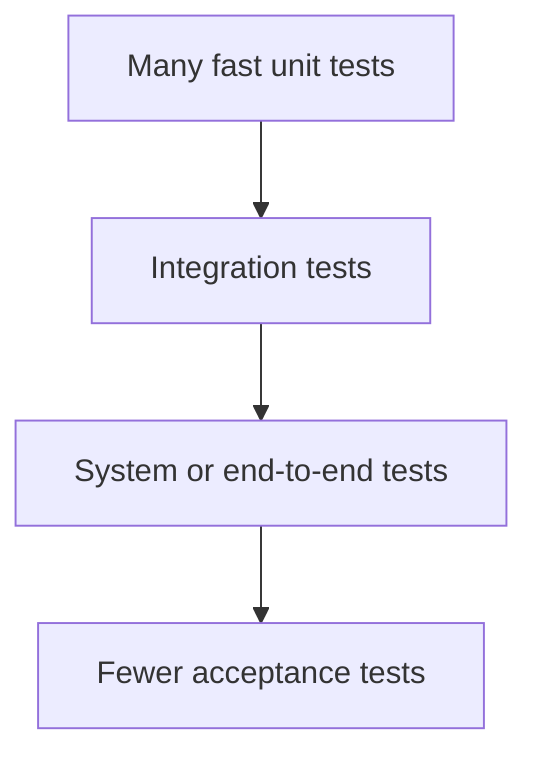

Testing কে সাধারণত চারটি স্তরে ভাগ করা হয়, যা একটি **pyramid/hierarchy** আকারে কাজ করে — ছোট, isolated অংশ থেকে শুরু করে পুরো system পর্যন্ত ধীরে ধীরে বিস্তৃত হয়:

**১. Unit Testing**
সবচেয়ে ছোট, isolated অংশ (একটি function, method, বা class) কে individually test করা হয়, বাকি system থেকে আলাদা করে।

**২. Integration Testing**
একাধিক unit/module একসাথে যুক্ত হয়ে ঠিকমতো কাজ করছে কিনা তা test করা হয় — module গুলোর মধ্যে **interface এবং data flow** এ কোনো সমস্যা আছে কিনা যাচাই করা হয়।

**৩. System Testing**
সম্পূর্ণ integrated system-কে নির্ধারিত test environment-এ functional এবং non-functional requirement-এর বিরুদ্ধে যাচাই করা হয়। এটি system boundary-কেন্দ্রিক; সব production dependencyসহ end-to-end test হওয়া বাধ্যতামূলক নয়।

**৪. Acceptance Testing**
Client/end-user এর দৃষ্টিকোণ থেকে system টি তাদের **business requirement এবং প্রয়োজন** পূরণ করছে কিনা তা যাচাই করা হয়, production এ release করার আগে চূড়ান্ত ধাপ হিসেবে।

---

### How do unit testing, integration testing, system testing, and acceptance testing differ in scope and who typically performs each?

| Level | Scope | কে Perform করেন |
|---|---|---|
| **Unit Testing** | একটি single function/method/class — সবচেয়ে ছোট আকারে, বাকি system থেকে isolated (mock/stub ব্যবহার করে) | **Developer** নিজেই, code লেখার সময় বা সাথে সাথে |
| **Integration Testing** | একাধিক module/component এর মধ্যে interaction এবং interface | **Developer** বা dedicated **QA/Test Engineer** |
| **System Testing** | সম্পূর্ণ integrated system-এর functional/non-functional behavior | স্বাধীন QA team common, তবে ownership team/process-ভেদে ভিন্ন |
| **Acceptance Testing** | Acceptance criteria ও business need পূরণ করছে কি না | Client/end-user/product owner বা authorized representative |

**একসাথে কীভাবে Fit করে:** Unit, integration, system এবং acceptance হলো test level/scope। Test pyramid একটি আলাদা portfolio heuristic—সাধারণত অনেক fast unit/component test, কিছু integration test এবং অল্প broad end-to-end test রাখে। Acceptance test যেকোনো level-এ automate হতে পারে; তাই চার level-কে rigid pyramid layer ভাবা ঠিক নয়।

---

### What is the difference between top-down and bottom-up integration testing, and what role do "stubs" and "drivers" play in each?

**Top-Down Integration Testing:**
System এর **সবচেয়ে উপরের (high-level) module থেকে শুরু করে নিচের দিকে** ধাপে ধাপে integrate এবং test করা হয়। যেসব lower-level module এখনো তৈরি হয়নি, তাদের জায়গায় **Stub** (একটি dummy, simplified placeholder module) ব্যবহার করা হয়।

**Bottom-Up Integration Testing:**
System এর **সবচেয়ে নিচের (low-level) module থেকে শুরু করে উপরের দিকে** ধাপে ধাপে integrate এবং test করা হয়। যেসব higher-level module এখনো তৈরি হয়নি, তাদের জায়গায় **Driver** (একটি dummy module, যা lower-level module কে call করে এবং test data সরবরাহ করে) ব্যবহার করা হয়।

**Stubs এবং Drivers এর Role:**

| | **Stub** | **Driver** |
|---|---|---|
| **ব্যবহৃত হয় কোথায়** | Top-Down Testing এ | Bottom-Up Testing এ |
| **Represent করে** | একটি **lower-level (called) module** এর dummy version | একটি **higher-level (calling) module** এর dummy version |
| **উদ্দেশ্য** | Higher-level module কে test করার সময়, এখনো তৈরি না হওয়া lower module এর জায়গায় একটি simplified response দেওয়া | Lower-level module কে test করার সময়, সেটাকে call করার জন্য এবং test input দেওয়ার জন্য একটি dummy caller তৈরি করা |

উদাহরণ: যদি `OrderService` (higher-level) এখনো `PaymentService` (lower-level) এর সাথে সম্পূর্ণভাবে integrate না হয়ে থাকে, কিন্তু `OrderService` টেস্ট করতে হয় — তাহলে একটি **Stub PaymentService** তৈরি করে (যা শুধু একটি fixed "success" response দেয়) `OrderService` কে test করা যায়। উল্টোদিকে, যদি `PaymentService` (lower-level) কে আলাদাভাবে test করতে হয়, কিন্তু `OrderService` এখনো প্রস্তুত না, তাহলে একটি **Driver** তৈরি করে সরাসরি `PaymentService` কে call করে test করা যায়।

---

## 47. What is the difference between white-box testing and black-box testing?

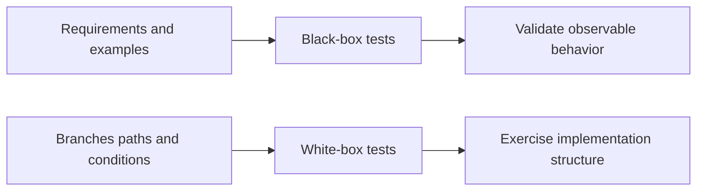

**White-box Testing (Structural/Glass-box Testing):**
এই testing এ tester এর কাছে system এর **internal code structure, logic, এবং implementation details** সম্পর্কে সম্পূর্ণ জ্ঞান থাকে, এবং সেই জ্ঞান ব্যবহার করে test case ডিজাইন করা হয় — যেমন প্রতিটি code path, branch, বা condition কভার হচ্ছে কিনা।
- সাধারণত **developer** রা করেন
- Focus থাকে **internal logic এবং code coverage** এর উপর
- Unit Testing এ ব্যাপকভাবে ব্যবহৃত হয়

**Black-box Testing (Functional Testing):**
এই testing এ tester এর কাছে system এর **internal code সম্পর্কে কোনো জ্ঞান থাকে না** — শুধু **input এবং expected output** এর ভিত্তিতে test করা হয়, system টিকে একটি "black box" হিসেবে বিবেচনা করে।
- সাধারণত **QA Tester** রা করেন, যাদের code জানার প্রয়োজন হয় না
- Focus থাকে **functionality এবং user requirement** পূরণ হচ্ছে কিনা তার উপর
- System Testing এবং Acceptance Testing এ বেশি ব্যবহৃত হয়

---

### What is gray-box testing, and how does it combine elements of both approaches?

**Gray-box Testing** এমন একটি testing approach, যেখানে tester এর কাছে system এর **আংশিক internal knowledge** থাকে (সম্পূর্ণ code না জানলেও, database structure, architecture, বা algorithm সম্পর্কে কিছুটা ধারণা থাকে), এবং সেই আংশিক জ্ঞান ব্যবহার করে **black-box style এ** (input/output ভিত্তিক) test করা হয়।

**কীভাবে দুটোকে Combine করে:**
- White-box এর মতো, tester internal architecture সম্পর্কে কিছু knowledge ব্যবহার করে **আরও targeted, smart test case** ডিজাইন করেন (যেমন কোন নির্দিষ্ট database query বা API endpoint এ সমস্যা হতে পারে তা আগে থেকে অনুমান করে)
- Black-box এর মতো, actual testing external interface (UI, API) থেকেই করা হয়, internal code পরিবর্তন বা directly execute না করে
- **উদাহরণ:** Integration testing, যেখানে tester জানেন দুটি module কীভাবে database এর মাধ্যমে যুক্ত, এবং সেই জ্ঞান ব্যবহার করে targeted test case বানান, কিন্তু actual test তারা external API call করেই সম্পন্ন করেন

---

## 48. What are common white-box testing techniques?

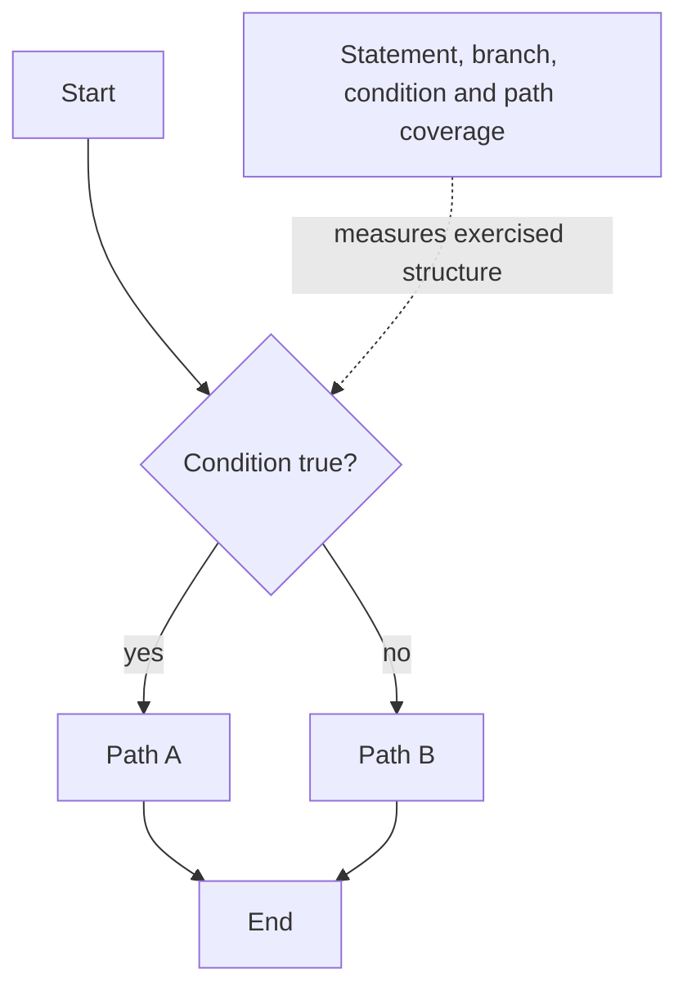

- **Statement Coverage**
- **Branch Coverage**
- **Path Coverage**
- **Condition Coverage**
- **Basis Path Testing**
- **Loop Testing**
- **Data Flow Testing**

---

### What is statement coverage, branch coverage, and path coverage, and how do they differ?

**Statement Coverage:**
পরিমাপ করে যে code এর **প্রতিটি executable statement/line কমপক্ষে একবার execute** হয়েছে কিনা। এটি সবচেয়ে basic/weak ধরনের coverage — একটি if-else এ শুধু একটি branch test করলেও সব statement cover হয়ে যেতে পারে যদি সব লাইনই কোনো না কোনো path এ পড়ে।

**Branch Coverage (Decision Coverage):**
পরিমাপ করে যে প্রতিটি **decision point (if, while, switch)** এর **প্রতিটি সম্ভাব্য outcome (true এবং false)** কমপক্ষে একবার execute হয়েছে কিনা। এটি Statement Coverage এর চেয়ে শক্তিশালী, কারণ এটি নিশ্চিত করে উভয় branch (যেমন `if` এবং `else` — উভয়ই) test হয়েছে।

**Path Coverage:**
পরিমাপ করে যে code এর মধ্য দিয়ে যাওয়া **প্রতিটি সম্ভাব্য execution path (unique combination of decisions)** কমপক্ষে একবার test করা হয়েছে কিনা। এটি সবচেয়ে **thorough এবং শক্তিশালী** coverage, কিন্তু বাস্তবে জটিল code এ path এর সংখ্যা exponentially বেড়ে যায় (বিশেষত loop থাকলে), যার ফলে সম্পূর্ণ path coverage অর্জন করা প্রায়ই **impractical**।

**উদাহরণ দিয়ে পার্থক্য:**
```java
if (a > 0) {
    x = 1;   // Statement 1
}
if (b > 0) {
    y = 1;   // Statement 2
}
```
- **Statement Coverage** অর্জনের জন্য শুধু একটি test case (a>0, b>0) যথেষ্ট, যা উভয় statement execute করবে
- **Branch Coverage** এর জন্য একাধিক test case দরকার, যাতে `a>0`/`a<=0` এবং `b>0`/`b<=0` — উভয় সম্ভাবনা cover হয়
- **Path Coverage** এর জন্য এই দুই condition এর **সব সম্ভাব্য combination** (4টি path: TT, TF, FT, FF) আলাদাভাবে test করতে হবে

---

### What is basis path testing, and how does it relate to cyclomatic complexity?

**Basis Path Testing** হলো একটি white-box technique, যা Tom McCabe প্রস্তাব করেছিলেন, যেখানে code এর **control flow graph** থেকে একটি **"basis set"** of independent path বের করা হয়, এবং প্রতিটি path এর জন্য অন্তত একটি test case ডিজাইন করা হয় — যাতে সব সম্ভাব্য জটিল path না করেও reasonable, systematic coverage অর্জন করা যায়।

**Cyclomatic Complexity** এর সাথে সম্পর্ক:
- **Cyclomatic Complexity (V(G))** হলো একটি metric, যা একটি program এর control flow এর **জটিলতা পরিমাপ করে** — এটি মূলত বলে দেয় একটি program এ **কতগুলো independent, linearly separate path** আছে
- Formula: `V(G) = E - N + 2P` (যেখানে E = edges, N = nodes, P = connected components), অথবা সহজভাবে: `V(G) = decision points এর সংখ্যা + 1`
- Basis Path Testing এ, **Cyclomatic Complexity এর মান নির্ধারণ করে দেয় ঠিক কতগুলো independent test case (basis path) দরকার** — যদি একটি function এর cyclomatic complexity ৪ হয়, তাহলে সেই function এর জন্য **কমপক্ষে ৪টি independent test case** ডিজাইন করতে হবে, যাতে সব basis path cover হয়
- উচ্চ cyclomatic complexity মানে বেশি জটিল code, যার জন্য বেশি test case দরকার, এবং সেটা maintain/debug করা কঠিন — তাই এই metric প্রায়ই code quality এবং **refactoring priority** নির্ধারণেও ব্যবহৃত হয় (সাধারণত ১০ এর বেশি complexity হলে সেই function কে সরল/ভেঙে ফেলার পরামর্শ দেওয়া হয়)

---

## 49. What are common black-box testing techniques?

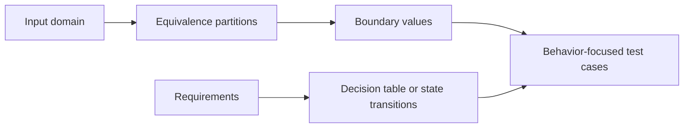

- **Equivalence Partitioning**
- **Boundary Value Analysis**
- **Decision Table Testing**
- **State Transition Testing**
- **Use Case Testing**
- **Error Guessing**

---

### How does equivalence partitioning reduce the number of test cases needed while maintaining coverage?

**Equivalence Partitioning** হলো একটি technique, যেখানে input data কে কয়েকটি **"equivalence class/partition"** এ ভাগ করা হয় — যেখানে একই partition এর সব value **একই ধরনের system behavior** produce করবে বলে ধরে নেওয়া হয়। তারপর প্রতিটি partition থেকে **শুধু একটি representative value** নিয়ে test করা হয়, পুরো partition এর প্রতিটি সম্ভাব্য value আলাদাভাবে test না করে।

**কীভাবে Coverage বজায় রেখে Test Case কমায়:**
- ধরা যাক একটি field এ ১-১০০ এর মধ্যে বয়স input নেওয়া হয়। যদি একে একে সব সম্ভাব্য value (১, ২, ৩ ... ১০০) test করা হয়, তাহলে ১০০টি test case লাগবে
- Equivalence Partitioning ব্যবহার করে, এই input কে তিনটি class এ ভাগ করা যায়: **Invalid (< 1)**, **Valid (1-100)**, **Invalid (> 100)**
- প্রতিটি class থেকে একটি করে representative value নিলেই যথেষ্ট (যেমন -5, 50, 150) — কারণ যুক্তিসঙ্গতভাবে ধরে নেওয়া হয় যে একই class এর মধ্যে সব value একইরকম আচরণ করবে (যেমন 50 valid হলে 60, 70 ও valid হবে, আলাদা করে সব test করার দরকার নেই)
- এতে মাত্র **৩টি test case** দিয়েই যুক্তিসঙ্গত coverage অর্জন করা যায়, ১০০টির বদলে — যা সময় এবং effort উল্লেখযোগ্যভাবে কমিয়ে দেয়

---

### What is boundary value analysis, and why are input boundaries a common source of defects?

**Boundary Value Analysis (BVA)** হলো একটি technique, যেখানে test case গুলো ডিজাইন করা হয় input range এর **সীমানা (boundary) এর ঠিক আশেপাশের value** গুলো নিয়ে — যেমন একটি valid range এর **just below minimum, exact minimum, exact maximum, এবং just above maximum** value গুলো।

**উদাহরণ:** যদি valid age range ১-১০০ হয়, তাহলে BVA test করবে: `0` (just below min), `1` (exact min), `100` (exact max), `101` (just above max)।

**কেন Boundaries একটি সাধারণ Defect Source:**
- Developer রা প্রায়ই **off-by-one error** করেন — যেমন `<=` এর বদলে `<` ব্যবহার করা, বা `>=` এর বদলে `>` ব্যবহার করা, যার ফলে boundary value ভুলভাবে handle হয়
- Loop এর শুরু/শেষ index, array এর boundary, এবং condition check — এইসব জায়গায় **ভুল comparison operator** ব্যবহার করার সম্ভাবনা সবচেয়ে বেশি থাকে
- Equivalence Partitioning এ "একটি class এর সব value একইরকম আচরণ করবে" ধরে নেওয়া হলেও, **বাস্তবে বাগ প্রায়ই ঠিক সেই সীমানাতেই ঘটে** যেখানে একটি class শেষ হয়ে আরেকটি class শুরু হয় — তাই BVA, Equivalence Partitioning এর একটি প্রয়োজনীয় complement হিসেবে কাজ করে

---

### What is decision table testing, and when is it particularly useful?

**Decision Table Testing** হলো একটি technique, যেখানে একটি টেবিল তৈরি করা হয়, যাতে বিভিন্ন **input condition এর combination** এবং তাদের জন্য প্রত্যাশিত **action/output** সুসংগঠিতভাবে তালিকাভুক্ত করা হয়। এটি বিশেষভাবে useful যখন system এর behavior **একাধিক condition এর জটিল সংমিশ্রণের (combination) উপর নির্ভরশীল**।

**Decision Table এর গঠন:**

| Condition | Rule 1 | Rule 2 | Rule 3 | Rule 4 |
|---|---|---|---|---|
| Is Premium Member? | Yes | Yes | No | No |
| Order > $100? | Yes | No | Yes | No |
| **Action: Free Shipping** | Yes | Yes | Yes | No |
| **Action: Extra Discount** | Yes | No | No | No |

**কখন বিশেষভাবে Useful:**
- যখন system এর logic এ **একাধিক Boolean condition একসাথে মিলে জটিল business rule** তৈরি করে (যেমন loan approval system, যেখানে income, credit score, এবং existing debt — সব একসাথে বিবেচনা করে decision নেওয়া হয়)
- এটি নিশ্চিত করে যে **সব সম্ভাব্য condition combination** systematically চিহ্নিত এবং test করা হয়েছে, কোনোটা miss হয়ে যায়নি
- Complex business rule কে **visually clear এবং structured** ভাবে represent করে, যা business analyst, developer, এবং tester — সবার জন্যই বোঝা সহজ করে তোলে
- এটি **ambiguity এবং contradictory rule** খুঁজে বের করতেও সাহায্য করে, কারণ টেবিল আকারে সব combination পাশাপাশি দেখা যায়

---

## 50. What is the difference between alpha testing and beta testing?

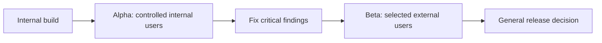

**Alpha Testing:**
এটি একটি software এর **initial testing phase**, যা **developer এর নিজস্ব organization/environment** এর মধ্যে পরিচালিত হয়, product সাধারণ market এ release হওয়ার আগে।

**Beta Testing:**
এটি Alpha Testing এর পরের ধাপ, যেখানে software টি **actual, real-world end-user দের একটি সীমিত group** এর কাছে পাঠানো হয়, তাদের নিজস্ব environment এ ব্যবহার করার জন্য, official release এর আগে।

---


### Who performs each, and what is the primary goal of each?

| বিষয় | **Alpha Testing** | **Beta Testing** |
|---|---|---|
| **কারা করেন** | **Internal team** — developer, QA engineer, এবং কখনো কখনো in-house selected employee | **External, actual end-user** — একটি সীমিত সংখ্যক real customer বা targeted user group |
| **কোথায় হয়** | Developer এর নিজস্ব, **controlled environment** (in-house lab) | User দের **নিজস্ব, real-world environment** — বিভিন্ন device, network condition, ব্যবহার পদ্ধতি |
| **প্রধান লক্ষ্য** | **Functional bug এবং major defect** ধরা, যেন product production-ready হয় testing এর পরবর্তী ধাপে যাওয়ার আগে | **Real-world usability, user experience, এবং edge case** যাচাই করা, যা internal team হয়তো চিন্তাই করেননি |
| **Testing Type** | মূলত White-box এবং Black-box টেকনিকের মিশ্রণ, structured | মূলত Black-box, unstructured — user রা যেভাবে স্বাভাবিকভাবে ব্যবহার করবেন সেভাবেই test করেন |
| **Feedback Mechanism** | সরাসরি developer/QA team এর সাথে direct communication | Bug report, survey, বা feedback form এর মাধ্যমে collect করা হয় |

**সংক্ষেপে:** Alpha Testing হলো "আমরা কি product টা সঠিকভাবে বানিয়েছি?" এর প্রথম internal verification, আর Beta Testing হলো "actual user রা কি এই product ব্যবহার করে সন্তুষ্ট এবং এটা তাদের বাস্তব প্রয়োজন মেটাচ্ছে?" তার বাস্তব-জগতের validation।

---

## 51. What is the difference between smoke testing and sanity testing?

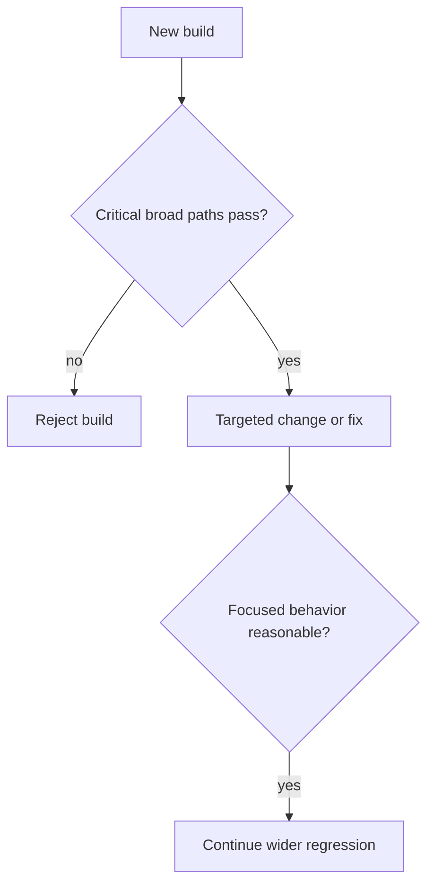

**Smoke Testing:**
একটি **shallow, wide-ranging test**, যা একটি নতুন build এর পর করা হয়, যাচাই করার জন্য যে system এর **মূল, critical functionality গুলো** কাজ করছে কিনা — অর্থাৎ build টা আদৌ আরও বিস্তারিত testing এর যোগ্য কিনা। এটাকে অনেক সময় **"Build Verification Testing"** ও বলা হয়। নাম টা এসেছে hardware testing থেকে — একটি device চালু করে দেখা হতো এটা থেকে "smoke" (ধোঁয়া) বের হয় কিনা।

**Sanity Testing:**
একটি **narrow, focused test**, যা সাধারণত একটি নির্দিষ্ট **bug fix বা নতুন ছোট feature** এর পর করা হয়, যাচাই করার জন্য যে সেই নির্দিষ্ট পরিবর্তনটি ঠিকভাবে কাজ করছে এবং তার আশেপাশের related functionality ভেঙে যায়নি।

| বিষয় | **Smoke Testing** | **Sanity Testing** |
|---|---|---|
| **Scope** | Wide কিন্তু shallow — পুরো system এর মূল feature গুলো | Narrow কিন্তু deep — একটি নির্দিষ্ট module/feature |
| **কখন করা হয়** | প্রতিটি নতুন build এর পর, সবার আগে | একটি নির্দিষ্ট bug fix বা minor change এর পর |
| **উদ্দেশ্য** | Build টা testing এর জন্য stable কিনা তা নির্ধারণ করা | নির্দিষ্ট change টা সঠিকভাবে কাজ করছে কিনা যাচাই করা |
| **সাধারণত করেন** | Developer বা QA (automated হতে পারে) | QA Tester |
| **Documentation/Scripted** | সাধারণত scripted (predefined test cases) | সাধারণত unscripted, ad-hoc |

---

### When and why would you run a smoke test as part of a CI/CD pipeline?

**কখন:** প্রতিটি নতুন **build/deployment** এর পর, deeper testing (integration, regression) শুরু করার **আগেই**, pipeline এর একদম শুরুর দিকে।

**কেন গুরুত্বপূর্ণ:**
- **Fail Fast Principle** — যদি build এর মূল functionality-ই ভেঙে থাকে, তাহলে সেটা সাথে সাথে ধরা পড়ে, এবং team সময় ও resource **আরও বিস্তারিত, সময়সাপেক্ষ test (যেমন full regression suite)** এ ব্যয় করা থেকে বেঁচে যায়
- CI/CD pipeline-এ smoke suite ছোট ও দ্রুত রাখা হয়। Critical smoke check fail করলে pipeline সাধারণত promotion block করে; exact policy এবং timeout system risk অনুযায়ী নির্ধারিত।
- এটি **broken build কে production এর দিকে এগিয়ে যাওয়া থেকে আটকায়**, যা পুরো deployment pipeline কে সুরক্ষিত রাখে
- Resource efficient — পুরো test suite চালানোর আগে একটি quick sanity check দিয়ে বড় সমস্যা আগেই বাদ দেওয়া যায়

---

## 52. What is the difference between functional testing and non-functional testing?

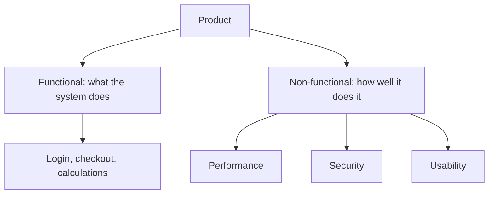

**Functional Testing:**
System **কী কাজ করে** (what the system does) তা যাচাই করে — অর্থাৎ specific feature/functionality requirement অনুযায়ী সঠিকভাবে কাজ করছে কিনা।

**Non-Functional Testing:**
System **কীভাবে কাজ করে** (how well the system performs) তা যাচাই করে — অর্থাৎ quality attribute যেমন performance, reliability, security, usability ইত্যাদি।

| বিষয় | **Functional Testing** | **Non-Functional Testing** |
|---|---|---|
| **Focus** | Feature এবং business requirement | Quality attributes এবং system behavior |
| **প্রশ্ন** | "System টা কি সঠিক output দিচ্ছে?" | "System টা কতটা fast, secure, বা user-friendly?" |
| **উদাহরণ** | Login functionality, checkout process | Load testing, security testing |

---

### Can you give examples of non-functional testing types (load testing, stress testing, usability testing, security testing, compatibility testing)?

**Load Testing:**
System একটি **প্রত্যাশিত (normal থেকে peak) পরিমাণ user/traffic** handle করতে পারে কিনা তা যাচাই করা হয় — যেমন ১০,০০০ concurrent user একসাথে site browse করলে system কেমন performance দেখায়।

**Stress Testing:**
System কে **তার normal capacity এর বাইরে, extreme load** এ পরীক্ষা করা হয়, যাতে দেখা যায় system কোন পয়েন্টে গিয়ে **fail করে**, এবং fail করার পর সেটা **gracefully recover** করে কিনা।

**Usability Testing:**
System টি end-user দের জন্য কতটা **সহজবোধ্য, intuitive, এবং user-friendly** তা যাচাই করা হয় — সাধারণত real user দের সাথে বসে তাদের interaction পর্যবেক্ষণ করে করা হয়।

**Security Testing:**
System এর **vulnerabilities, unauthorized access risk, data protection, এবং authentication/authorization** ঠিকভাবে কাজ করছে কিনা তা যাচাই করা হয় (যেমন SQL injection, XSS, ইত্যাদি চেক করা)।

**Compatibility Testing:**
System টি বিভিন্ন **browser, operating system, device, screen size, বা network condition** এ সঠিকভাবে কাজ করছে কিনা তা যাচাই করা হয় (যেমন Chrome, Firefox, Safari — সব browser এ website ঠিকভাবে কাজ করছে কিনা)।

---

## 53. What is Test-Driven Development (TDD)?

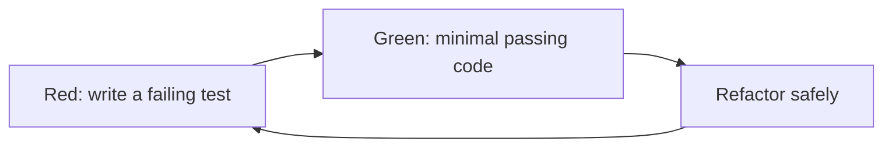

**Test-Driven Development (TDD)** হলো একটি software development approach, যেখানে **actual code লেখার আগে test case লেখা হয়**। অর্থাৎ, একজন developer প্রথমে একটি failing test লিখবেন (যা এখনো implement না হওয়া functionality কে represent করে), তারপর সেই test কে pass করানোর জন্য minimum প্রয়োজনীয় code লিখবেন, এবং তারপর code টি পরিষ্কার এবং optimize করবেন।

---

### Can you walk through the "red-green-refactor" cycle?

**🔴 Red (Write a Failing Test):**
প্রথমে একটি test case লেখা হয় একটি **নির্দিষ্ট, ছোট functionality** এর জন্য, যা এখনো implement করা হয়নি। যেহেতু functionality নেই, তাই এই test টি **fail** করবে (red অবস্থা) — এটাই স্বাভাবিক এবং প্রত্যাশিত।

**🟢 Green (Write Minimum Code to Pass):**
এরপর developer শুধুমাত্র সেই test টি **pass করানোর জন্য প্রয়োজনীয় ন্যূনতম code** লেখেন — সুন্দর, optimize, বা elegant code লেখার চিন্তা এই ধাপে করা হয় না, শুধু test টা pass (green অবস্থা) করানোই মূল লক্ষ্য।

**🔵 Refactor (Improve the Code):**
Test pass হয়ে যাওয়ার পর, code টিকে **পরিষ্কার, optimize, এবং maintainable** করা হয় (duplicate code সরানো, better naming, better structure) — কিন্তু এই পুরো সময় test টি pass থাকা নিশ্চিত করা হয়, যাতে কোনো functionality ভেঙে না যায়।

এই cycle টি প্রতিটি ছোট ছোট functionality এর জন্য বারবার repeat করা হয়, ধীরে ধীরে সম্পূর্ণ feature তৈরি হওয়া পর্যন্ত।

---

### What are the benefits and challenges of practicing TDD on a real project?

**Benefits:**
- **High Test Coverage নিশ্চিত হয়** — কারণ প্রতিটি feature এর জন্য test আগে থেকেই লেখা থাকে, পরে test লেখার কথা ভুলে যাওয়ার সম্ভাবনা কম
- **Better Code Design** — TDD developer দের code কে **testable এবং modular** করে লিখতে বাধ্য করে (যা প্রায়ই loose coupling, single responsibility অর্জনে সাহায্য করে)
- **Early Bug Detection** — bug গুলো development এর সময়েই ধরা পড়ে, পরে testing phase এ নয়
- **Regression Safety Net** — ভবিষ্যতে code change করলে, existing test suite দ্রুত জানিয়ে দেয় যদি কোনো কিছু ভেঙে যায়
- **Living Documentation** — test case গুলো একটি ধরনের executable documentation হিসেবে কাজ করে, code কীভাবে ব্যবহার করতে হয় তা দেখায়

**Challenges:**
- **প্রাথমিকভাবে ধীর মনে হয়** — নতুন team এর জন্য শুরুতে development speed কমে যেতে পারে, কারণ প্রতিটি feature এর জন্য test লিখতে অতিরিক্ত সময় লাগে
- **Learning Curve** — সঠিকভাবে TDD practice করা (ভালো test design, mock/stub ব্যবহার) শিখতে সময় লাগে
- **UI/UX-heavy বা exploratory কাজে কম কার্যকর** — যেখানে requirement এখনো পুরোপুরি স্পষ্ট নয় বা visual design নিয়ে experiment করা হচ্ছে, সেখানে আগে থেকে test লেখা কঠিন হয়ে যায়
- **Poorly Written Test এর ঝুঁকি** — যদি test case গুলো ভালোভাবে design না করা হয়, তাহলে সেগুলো brittle (ভঙ্গুর) হয়ে যেতে পারে, যা প্রতিটি ছোট code change এ unnecessarily fail করতে থাকে
- **Legacy Code এ প্রয়োগ করা কঠিন** — existing, non-testable legacy codebase এ TDD প্রয়োগ করতে হলে প্রথমে সেই code কে refactor করে testable বানাতে হয়, যা অতিরিক্ত কাজের চাপ তৈরি করে

---

## 54. What is the difference between TDD and BDD (Behavior-Driven Development)?

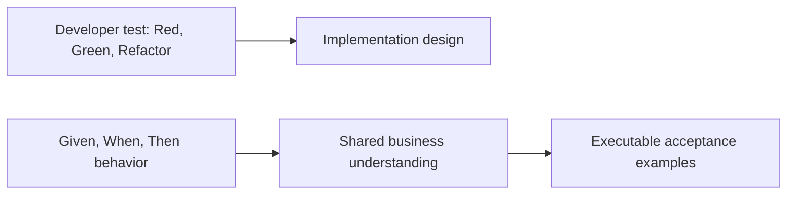

| বিষয় | **TDD** | **BDD** |
|---|---|---|
| **Focus** | **Code এর সঠিকতা** — নির্দিষ্ট function/method সঠিকভাবে কাজ করছে কিনা | **System এর behavior**, business/user এর দৃষ্টিকোণ থেকে |
| **Language** | Technical, code-oriented (developer-focused) | Natural, business-readable language (non-technical stakeholder ও বুঝতে পারেন) |
| **Test লেখেন কারা** | মূলত **Developer** | Developer, QA, এবং **Business Analyst/Product Owner** একসাথে (collaborative) |
| **Test Format** | Standard unit test syntax (`assertEquals`, ইত্যাদি) | **Given-When-Then** format ব্যবহার করে, প্রায়ই Gherkin syntax এ |
| **উদ্দেশ্য** | "আমরা কি code টা সঠিকভাবে বানাচ্ছি?" | "আমরা কি সঠিক feature/behavior বানাচ্ছি, যা business need পূরণ করে?" |

BDD TDD থেকে প্রভাবিত একটি collaborative specification approach। TDD developer-এর design feedback loop-এ focused; BDD concrete business behavior ও shared examples দিয়ে discovery, specification এবং automation যুক্ত করে। BDD ব্যবহার মানেই প্রতিটি scenario unit-level TDD test নয়।

**BDD এর একটি typical scenario (Given-When-Then format এ):**
```gherkin
Given a user is on the login page
When they enter valid credentials
Then they should be redirected to the dashboard
```

---

### How do tools like Cucumber or Gherkin syntax support BDD?

**Gherkin** হলো একটি **plain-text, structured language**, যা BDD scenario লেখার জন্য ব্যবহৃত হয়, **Given-When-Then** keyword দিয়ে গঠিত:
- **Given** — শুরুর অবস্থা/context (precondition)
- **When** — একটি নির্দিষ্ট action ঘটে
- **Then** — প্রত্যাশিত ফলাফল (expected outcome)

**Cucumber** হলো একটি testing tool/framework, যা এই Gherkin syntax এ লেখা scenario গুলোকে **actual, executable automated test** এ রূপান্তর করে। প্রতিটি Gherkin line কে (যেমন "Given a user is on the login page") একটি corresponding **"step definition"** কোডের সাথে যুক্ত করা হয়, যা actual browser/API interaction করে সেই step টি বাস্তবায়ন করে।

**কীভাবে BDD কে Support করে:**
- **Business এবং Technical Team এর মধ্যে যোগাযোগের সেতু তৈরি করে** — Product Owner, QA, এবং Developer সবাই একই plain-English scenario পড়ে বুঝতে পারেন, technical knowledge ছাড়াই
- Scenario executable specification হিসেবে documentation ও test কাছাকাছি রাখে। তবে stale scenario, incomplete step definition বা ভুল automation হলে mismatch এখনও হতে পারে; review ও maintenance প্রয়োজন।
- Requirement gathering এর সময়েই stakeholder দের সাথে বসে concrete example (scenario) নিয়ে আলোচনা করা যায়, যা **requirement এর ambiguity কমায়**
- Automated testing এর সব সুবিধা (regression safety, CI/CD integration) পাওয়া যায়, কিন্তু human-readable format এ থাকার কারণে non-technical review ও সম্ভব হয়

---

## 55. What is regression testing, and when should it be performed?

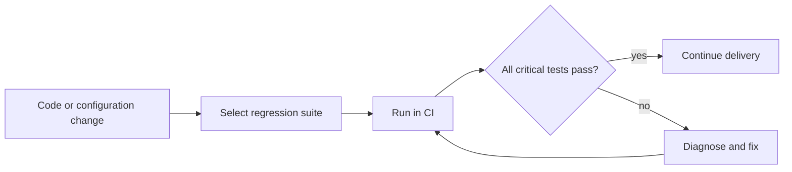

**Regression Testing** হলো এমন testing, যা নিশ্চিত করে যে **নতুন code change (নতুন feature, bug fix, বা refactoring) করার পর, পূর্বে ভালোভাবে কাজ করা existing functionality গুলো এখনও ঠিকভাবে কাজ করছে** — অর্থাৎ নতুন change কোনো পুরনো functionality কে "ভেঙে" (break) দেয়নি।

**কখন Perform করা উচিত:**
- প্রতিটি **নতুন feature যোগ করার পর**
- প্রতিটি **bug fix করার পর** (নিশ্চিত করতে যে fix টা নতুন কোনো bug তৈরি করেনি)
- **Code refactoring** এর পর
- **Third-party library/dependency আপডেট** করার পর
- **প্রতিটি নতুন release/deployment** এর আগে
- **Configuration বা environment change** এর পর

---

### How does automated regression testing fit into a CI/CD pipeline?

- প্রতিবার একজন developer কোনো **code push/commit** করেন, CI/CD pipeline automatically একটি build তৈরি করে এবং তার সাথে সাথে **automated regression test suite** চালায়
- Fast regression subset প্রতি change-এ চলতে পারে; বড় integration/end-to-end suite parallel, nightly বা pre-release stage-এ চলতে পারে। সব regression suite কয়েক মিনিটে শেষ হবে এমন নয়।
- যদি কোনো regression test **fail** করে, তাহলে pipeline সাথে সাথেই developer কে **notify** করে এবং deployment কে **block/halt** করে দেয় — যাতে broken code production এ না পৌঁছায়
- **Continuous এবং Automatic** হওয়ার কারণে, প্রতিটি ছোট change এর পরও regression test চলে, যা manual regression testing এর চেয়ে **অনেক দ্রুত, consistent, এবং কম error-prone**
- এটি developer দের **দ্রুত feedback** দেয় — কোনো change এ সমস্যা হলে সাথে সাথেই জানা যায়, যা fix করাও তখন সহজ (কারণ change টা এখনও "fresh" এবং ছোট আকারে আছে)
- সময়ের সাথে regression suite **বড় এবং বেশি comprehensive** হতে থাকে, প্রতিটি নতুন bug fix এর সাথে একটি নতুন regression test যোগ করে (যাতে সেই একই bug ভবিষ্যতে আবার না ফিরে আসে)
- **Test Parallelization এবং Test Suite Optimization** প্রায়ই ব্যবহার করা হয়, যাতে বড় regression suite ও দ্রুত সম্পন্ন হয় এবং CI/CD pipeline এর overall speed কমে না যায়

এভাবে Automated Regression Testing একটি CI/CD pipeline এর **quality gate** হিসেবে কাজ করে, যা নিশ্চিত করে যে দ্রুত, ঘন ঘন delivery করার পরও software এর **stability এবং reliability** বজায় থাকে।

---

## 56. What is the difference between verification and validation?

**Verification** check করে work product—requirement, design, code—নির্ধারিত specification অনুযায়ী তৈরি হচ্ছে কি না: *“Are we building the product right?”* Review, inspection, static analysis এবং unit/integration checks এতে সাহায্য করে।

**Validation** check করে delivered behavior ব্যবহারকারীর বাস্তব need পূরণ করছে কি না: *“Are we building the right product?”* Prototype evaluation, system test এবং acceptance test এতে সাহায্য করে।

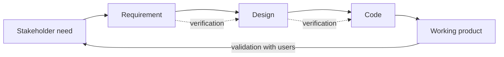

**Example:** Requirement-এ “OTP ৫ মিনিট valid” লেখা হলে code সত্যিই ৫ মিনিট enforce করছে কি না verification। কিন্তু বাস্তব banking user-এর জন্য ৫ মিনিট যথেষ্ট ও নিরাপদ কি না validation। দুটোই দরকার—ভুল requirement নিখুঁতভাবে implement করলেও useful product হবে না।

## 57. What is the difference between a test scenario, test case, and test plan?

| Artifact | Scope | Example |
|---|---|---|
| **Test scenario** | কী user flow/condition যাচাই হবে | “Customer card দিয়ে order pay করে” |
| **Test case** | Preconditions, exact steps/data এবং expected result | expired card দিলে payment declined এবং order unpaid থাকে |
| **Test plan** | পুরো test effort-এর scope, approach, environment, roles, schedule, risks ও exit criteria | checkout release test strategy |

```text
Test case: TC-PAY-004 — expired card
Precondition: cart has one in-stock item
Steps: checkout -> enter expired test card -> submit
Expected: decline message; no capture; order status remains PAYMENT_PENDING
```

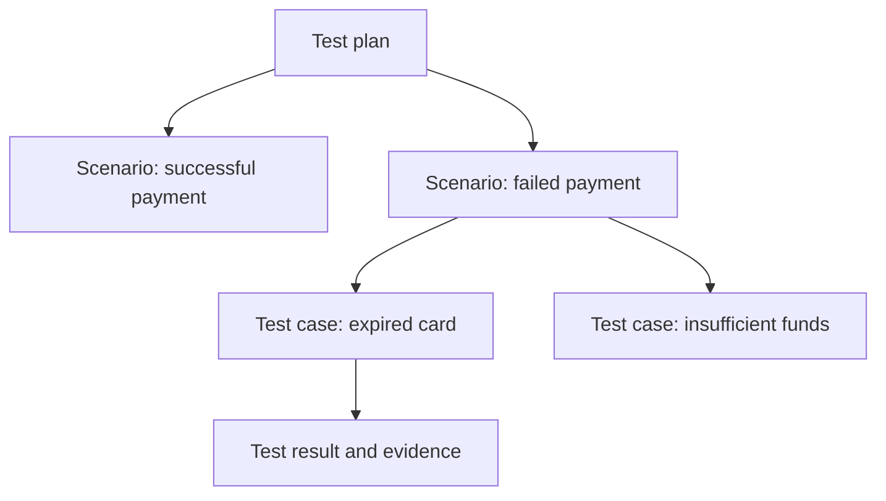

## 58. What is the defect lifecycle, and what information should a good bug report contain?

Defect workflow team/tool অনুযায়ী ভিন্ন হতে পারে, তবে একটি common flow হলো:

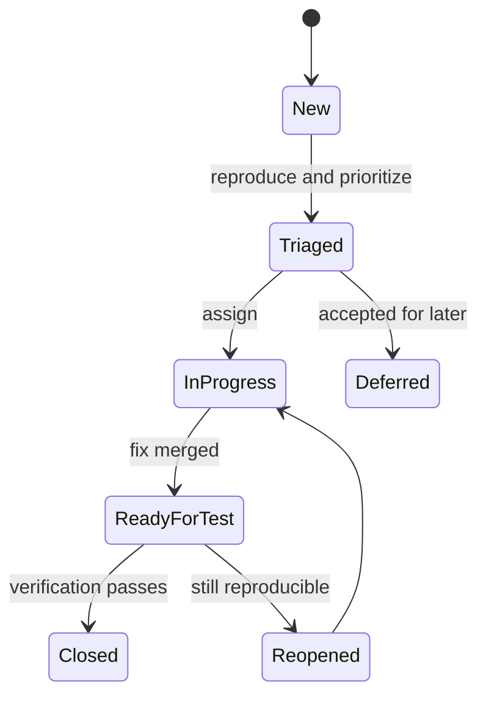

একটি actionable bug report-এ থাকা উচিত:

- concise title এবং affected version/environment
- reproducible steps ও minimal test data
- expected বনাম actual behavior
- severity/impact; priority triage team নির্ধারণ করতে পারে
- screenshot, log, trace/correlation ID—sensitive data redacted করে
- frequency এবং regression কিনা

**Example:** “Checkout fails” দুর্বল report। “v2.4 staging-এ expired Visa test card submit করলে HTTP 500; expected decline response; correlation ID `pay-42`; 3/3 attempts”—এটি reproduce ও diagnose করা যায়।
