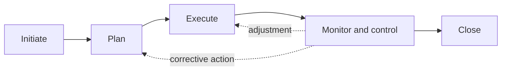
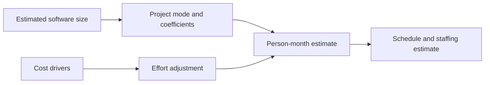
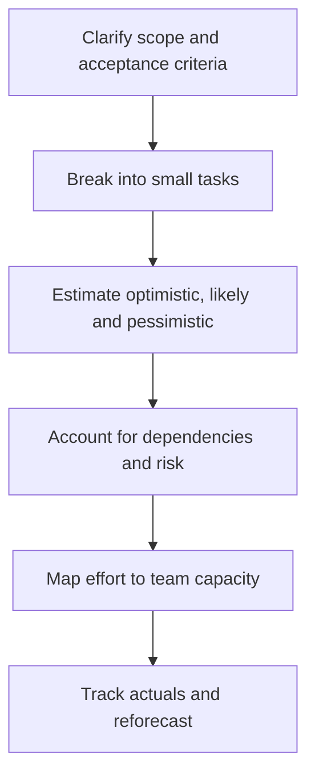
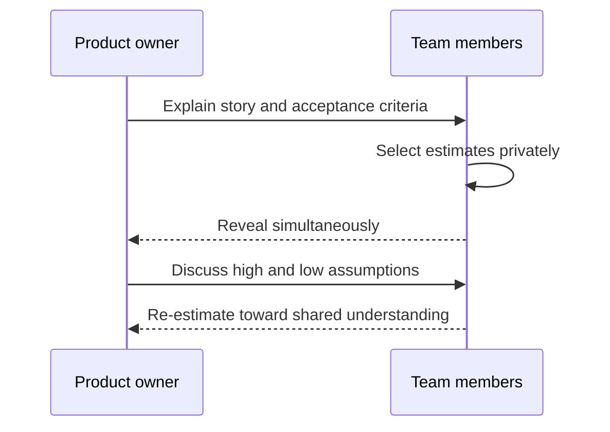
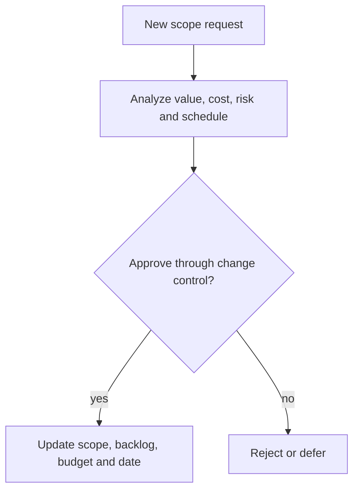
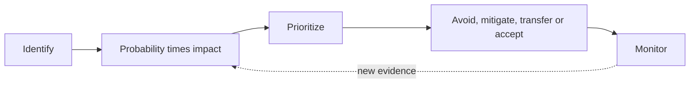
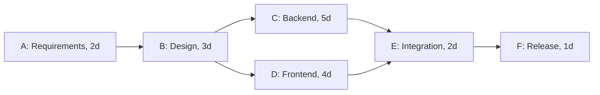
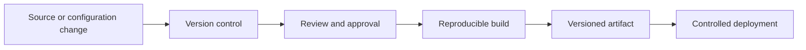
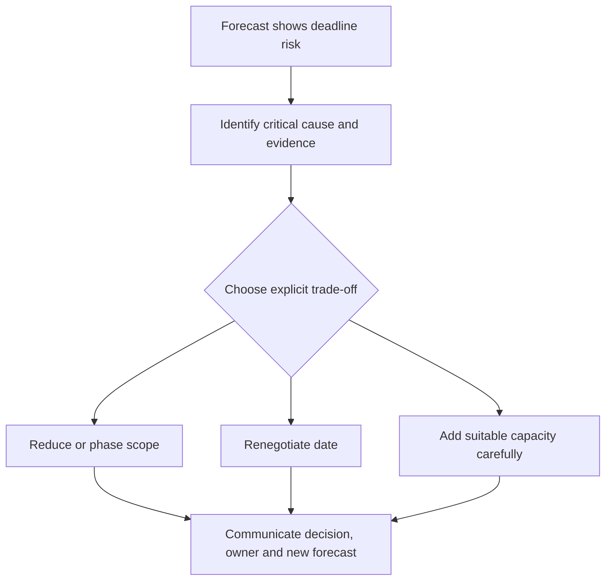

## Overview

Software project management হলো people, scope, schedule, risk, budget, and quality coordinate করে useful outcome deliver করা। Plan কোনো promise carved in stone না; it is current knowledge-এর উপর best forecast। Good planning uncertainty hide করে না, visible করে।

```text
Goal + constraints
       |
Scope -> estimate -> plan -> execute -> monitor -> adapt
  ^                                               |
  +--------------- feedback / change -------------+
```

Example: Eid-এর আগে scheduled delivery launch করতে হবে। Project management-এর কাজ শুধু task list বানানো না; payment dependency, holiday traffic, QA capacity, rollout plan, and fallback policy আগেই consider করা।

---

## 59. What are the main activities involved in software project management?



| Activity | Main question | Example output |
|---|---|---|
| Scope planning | কী deliver করব, কী করব না? | release scope |
| Estimation | কত effort/time/cost? | range forecast |
| Scheduling | কোন কাজ কখন, dependency কী? | milestone plan |
| Staffing | কার skill/capacity দরকার? | team allocation |
| Risk management | কী ভুল হতে পারে? | risk register |
| Quality management | done মানে কী? | test/release criteria |
| Monitoring | plan vs actual কেমন? | burndown, dashboard |
| Change control | new request কীভাবে decide হবে? | change decision log |

Project manager alone সব কাজ করেন এমন না। Product, engineering, design, QA, and leadership share responsibility। Healthy management gives team clarity and removes friction, not just status collection।

---

## 60. What is the COCOMO model, and how is it used for estimation?



**COCOMO (Constructive Cost Model)** software size এবং project factors ব্যবহার করে effort/cost estimate করার family of models। Classic basic form roughly:

```text
Effort = a * (KLOC)^b
```

Where KLOC হলো estimated thousand lines of code and constants project type অনুযায়ী vary করে। Intermediate/detailed versions team capability, tool support, reliability need, schedule, platform complexity-এর মতো cost drivers include করে।

### Practical caution

Modern product work-এ code reuse, cloud services, AI tooling, configuration, integration, and changing scope থাকায় line count early estimate weak signal হতে পারে। COCOMO historical planning model হিসেবে important, কিন্তু current team-এর empirical delivery data often more useful।

## 61. How do you estimate the time required for a software development task?



Estimate uncertaintyসহ future effort predict করে। Unknown থাকলে single exact number misleading হয়।

```text
Weak: "Payment retry will take exactly 3 days."

Better: "Likely 3-5 days. If gateway lacks idempotency support,
          risk case may add 2 days. We can validate that today."
```

### Decompose work first

Big item “add scheduled delivery” estimate করা hard। Smaller work breakdown uncertainty visible করে।

```text
Scheduled delivery
  |- clarify restaurant time-slot policy
  |- data model + API
  |- customer UI
  |- restaurant dashboard
  |- notification scheduling
  |- test normal/edge cases
  |- rollout metrics and support guide
```

Decomposition estimate improve করে, কিন্তু false precision তৈরি করা উচিত না। Unknown research item আলাদা spike হিসেবে estimate করা useful।

---

## Three-point estimation and PERT

একটি task-এর optimistic (O), most likely (M), pessimistic (P) estimate নেয়া যায়।

```text
Example: payment-provider integration
Optimistic (O): 2 days  - existing API works cleanly
Likely (M):     4 days  - expected testing and review
Pessimistic(P): 9 days  - SDK issue or provider support delay
```

PERT expected estimate:

```text
Expected = (O + 4M + P) / 6
         = (2 + 4*4 + 9) / 6
         = 4.5 days
```

Most likely outcome বেশি weight পায়, কিন্তু risk range হারায় না। Stakeholder-কে 4.5 days বলার পাশাপাশি uncertainty এবং assumptions explain করাই honest forecasting।

---

## 62. What is story point estimation, and how does planning poker help?



**Story point** time নয়; team-এর relative complexity, effort, and uncertainty measure।

```text
Reference story: Add simple address form = 3 points
Save address with validation/API = 5 points
Payment retry with provider behavior unknown = 13 points
```

Different team-এর 5 points compare করা ভুল। একই team-এর past throughput দিয়ে planning করা যায়।

### Planning poker

1. Product owner story explain করে
2. Team question করে acceptance criteria/assumption clear করে
3. Everyone privately chooses estimate
4. Estimates simultaneously reveal হয়
5. Highest and lowest explain their reasoning
6. Team agrees on estimate or splits the work

```text
Developer A: 3, "CRUD only মনে হচ্ছে"
QA:          8, "Offline retry and migration missing"
Discussion reveals hidden work -> estimate 5 or split story
```

The value is not the card number; it is assumption discovery and shared understanding।

---

## 63. What is scope creep, and how do you manage it?



**Scope creep** হলো evaluated trade-off ছাড়া scope ধীরে ধীরে বাড়া। Change itself normal; invisible change dangerous।

```text
Original release: schedule one-time delivery
New request: recurring schedule
Then: add calendar sync
Then: redesign rider assignment

Same deadline + more scope = quality/cost/schedule pressure
```

Change request flow:

```text
Request -> clarify value -> impact analysis -> decision -> update plan/backlog -> communicate
```

Impact analysis ask করে:

- user/business value কী?
- estimate, risk, and dependency কী change করবে?
- কোন existing item defer/remove হবে?
- test, security, documentation impact কী?

Agile backlog reprioritization is lightweight change control. It still needs transparent decision; “just squeeze it in” usually creates hidden cost।

---

## 64. What is risk management in software projects?



**Risk** হলো uncertain future event যা outcome impact করতে পারে। Issue হলো risk ইতিমধ্যে ঘটেছে।

```text
Risk: payment provider may not support refund idempotency
Issue: provider has confirmed it does not support it
```

### Risk management cycle

```text
Identify -> Analyze -> Prioritize -> Mitigate / contingency -> Monitor
```

| Risk | Probability | Impact | Mitigation | Contingency |
|---|---|---|---|---|
| provider outage | medium | high | retry/circuit breaker | disable online payment |
| key engineer unavailable | low | high | documentation, pairing | adjust scope/team |
| traffic spike | high | high | load test and cache | rate limit / queue |
| requirement ambiguity | high | medium | prototype/workshop | defer unclear item |

Risk score may be probability x impact, but discussion and ownership matters more than pretty color charts। Each important risk needs owner, review date, early warning signal, and action।

---

## 65. What are Gantt charts, PERT charts, and the critical path?



### Gantt chart

Gantt chart time axis-এ task duration, overlap, milestone দেখায়।

```text
Week:             1     2     3     4
Requirements:    [===]
API design:            [===]
Mobile UI:                  [====]
Testing:                         [====]
Release:                                [*]
```

It is intuitive for stakeholder communication, but large plan rapidly outdated হতে পারে। Update it based on actual progress।

### PERT/network view and critical path

```text
Requirements (2d) -> API design (3d) -> Build (5d) -> Test (3d) -> Release
                         |
                         +-> UI design (2d) -> UI build (4d) --+
```

**Critical path** হলো dependent tasks-এর longest path; delay হলে overall project release delay হয়। Non-critical task কিছু slack থাকতে পারে। Critical path identify করে management focus কোথায় দিতে হবে বোঝে।

---

## 66. What is Software Configuration Management (SCM)?



**SCM** হলো source code, configuration, documentation, build artifact, and release state controlledভাবে manage করা। Goal: any released version কী ছিল, কী change হলো, এবং rollback কীভাবে হবে তা জানা।

| SCM practice | Purpose |
|---|---|
| Version control | code/history/branch manage |
| Code review | change quality and knowledge sharing |
| Build automation | reproducible artifact create |
| Configuration control | environment setting tracked/manage |
| Change control | approved change trace করা |
| Release management | version, rollout, rollback coordinate |

```text
Commit -> CI build/test -> versioned artifact -> staging -> approved production rollout
                                                   |
                                             rollback candidate retained
```

“Works on my machine” SCM failure-এর classic symptom। Build, dependency, and configuration reproducible হওয়া দরকার। Secrets version control-এ রাখা যাবে না; secret reference and access policy manage করতে হবে।

---

## 67. How do you handle a deadline at risk?



Bad response হলো bad news hide করা। Risk দেখা দিলে early evidenceসহ communicate করো।

```text
Signal: payment integration expected 4 days, day 3-এ SDK blocker unresolved
Action: update forecast, explain impact, present options
```

Possible trade-offs:

| Lever | Action | Consequence |
|---|---|---|
| Scope | low-value feature defer | fewer features, date protected |
| Schedule | date move | business timing impact |
| Resources | add skilled help | onboarding/coordination cost |
| Quality | reduce non-critical polish only | debt/risk may rise |
| Approach | simpler implementation | future capability limited |

Quality and security arbitraryভাবে cut করা rarely smart; production incident often deadline saving-এর চেয়ে expensive। Better option হতে পারে phased rollout: first cash-on-delivery scheduling, later prepaid scheduling।

## Monitoring and communication

Useful status report answers:

- What outcome was completed since last update?
- What is next milestone and current confidence?
- What risk/decision needs attention now?
- What changed from previous plan and why?

Metric select context অনুযায়ী: milestone forecast, cycle time, escaped defects, budget burn, availability, adoption. Metric team punish করার weapon হলে people game the number; learning tool হলে decision improve করে।

## Interview-ready answers

### Story points and hours-এর difference কী?

Hours are duration estimate; story points are team-relative measure of complexity, effort, and uncertainty. A team uses its historical throughput to turn points into a forecast, not a universal hour conversion.

### Deadline risk হলে কী করবে?

First verify the signal and communicate early. Then explain impact, root cause, and options: reduce scope, move date, add appropriate help, simplify approach, or phase rollout. Stakeholder-এর সঙ্গে explicit trade-off decide করব rather than silently sacrificing quality.

### Risk management-এর steps কী?

Identify risks, analyze probability/impact, prioritize, define mitigation and contingency, assign owner, and monitor early warning signals. When a risk occurs, it becomes an issue and needs active resolution.
