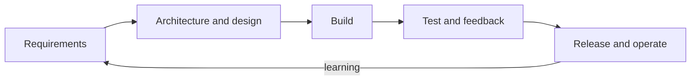

# Software Engineering Interview Guide

Software engineering শুধু code লেখা নয়; সঠিক problem নির্বাচন, requirements পরিষ্কার করা, maintainable design তৈরি, quality verify এবং safely deliver করার discipline। এই section process terminology-এর সঙ্গে বাস্তব decision-making ও trade-off যুক্ত করে।

## Learning path

1. [SDLC Models and Methodologies](./sdlc-models-methodologies/)
2. [Agile, Scrum, and Kanban](./agile-scrum-kanban/)
3. [Requirements Engineering](./requirements-engineering/)
4. [Architecture and Design Principles](./architecture-design-principles/)
5. [Modularity, Cohesion, and Coupling](./modularity-cohesion-coupling/)
6. [UML Diagrams](./uml-diagrams/)
7. [Software Testing Techniques](./software-testing-techniques/)
8. [Estimation, Planning, and Project Management](./estimation-planning-project-management/)

## How to build strong answers

একটি practice project বেছে নিয়ে প্রতিটি concept প্রয়োগ করুন: stakeholder ও constraints লিখুন, functional/non-functional requirements আলাদা করুন, architecture boundary আঁকুন, test strategy দিন এবং delivery risk estimate করুন। Interview answer-এ context ছাড়া “best practice” বলবেন না—কোন constraint-এর কারণে decisionটি উপযুক্ত, সেটিই গুরুত্বপূর্ণ।
