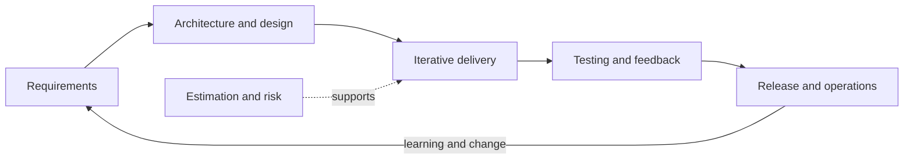

Software engineering শুধু code লেখা নয়; problem বোঝা থেকে শুরু করে architecture, implementation, verification, delivery এবং continuous improvement পর্যন্ত পুরো discipline। এই section-এর chapter-গুলো interview question-এর পাশাপাশি decision-making context ও practical example দেয়।

## Chapters

1. [SDLC Models and Methodologies](./sdlc-models-methodologies/)
2. [Agile, Scrum, and Kanban](./agile-scrum-kanban/)
3. [Requirements Engineering](./requirements-engineering/)
4. [Architecture and Design Principles](./architecture-design-principles/)
5. [Modularity, Cohesion, and Coupling](./modularity-cohesion-coupling/)
6. [UML Diagrams](./uml-diagrams/)
7. [Software Testing Techniques](./software-testing-techniques/)
8. [Estimation, Planning, and Project Management](./estimation-planning-project-management/)

## How to study

প্রথমে lifecycle ও requirements পড়ুন, এরপর architecture/modularity এবং UML দিয়ে design reasoning তৈরি করুন। Testing chapter quality strategy বোঝায়, আর শেষ chapter estimation, scope, risk ও delivery trade-off একসাথে যুক্ত করে।
