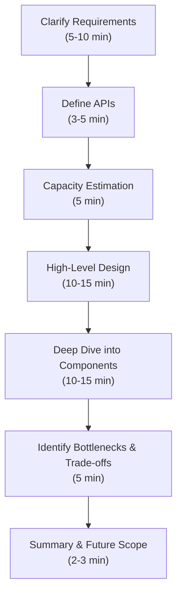
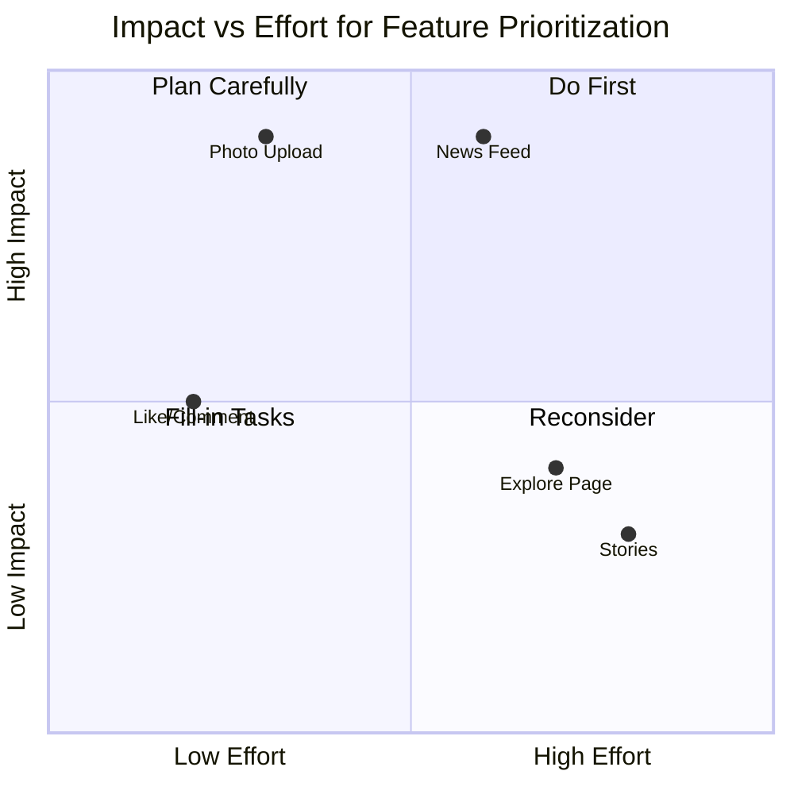
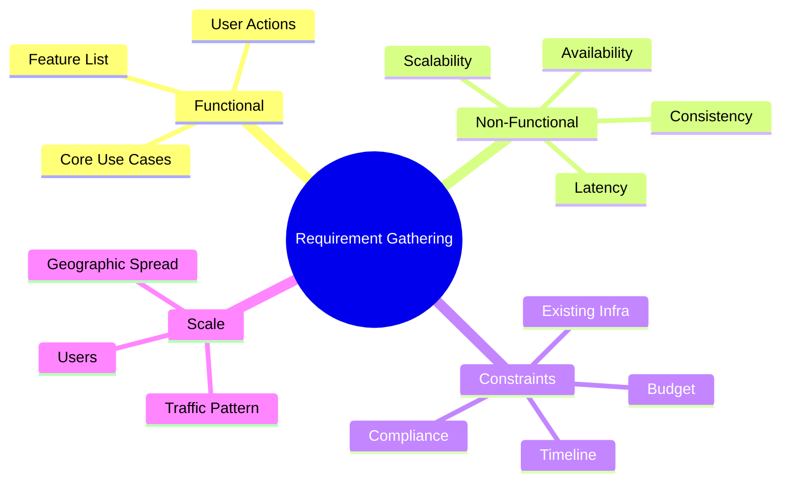
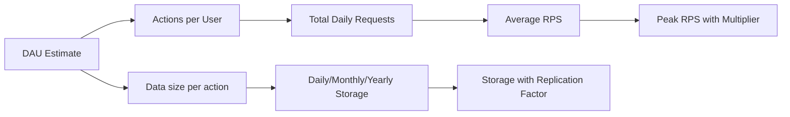
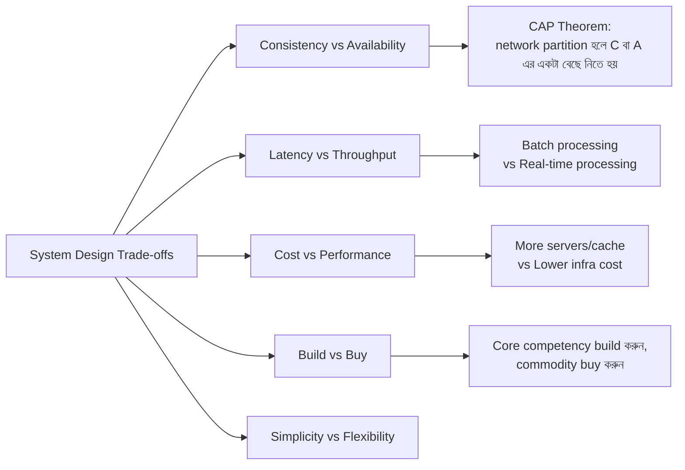
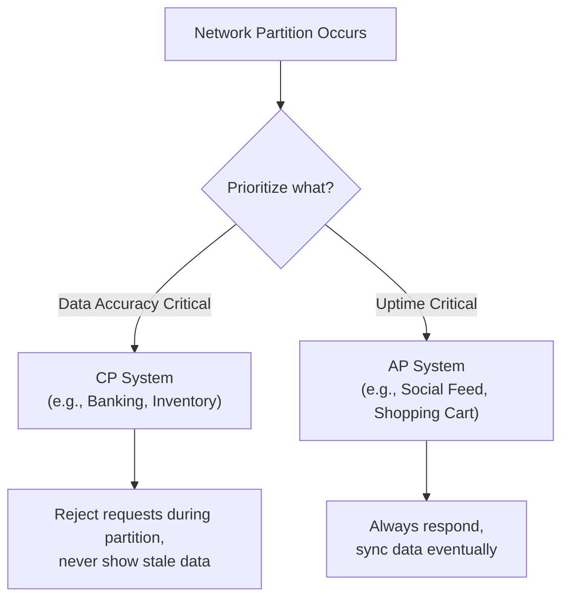
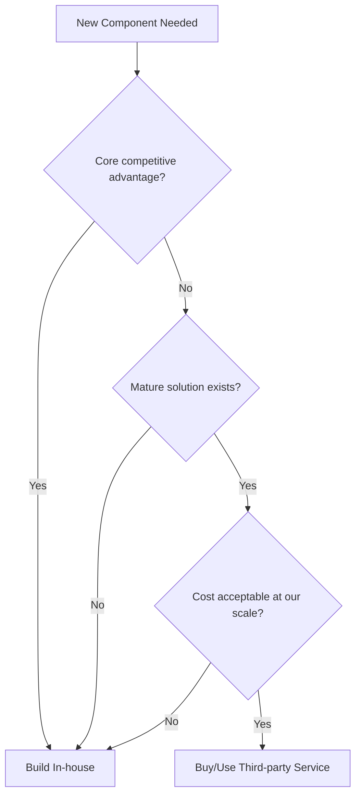
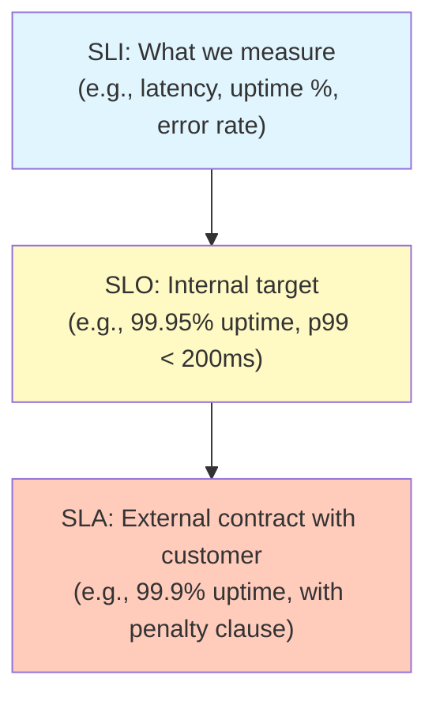

## 1. How do you approach a system design interview question?

System design interview মূলত একটা **open-ended, collaborative discussion** — এখানে একটাও "correct answer" নেই, বরং interviewer দেখতে চায় আপনার **thinking process**, **communication**, এবং **trade-off analysis** করার ক্ষমতা কেমন। তাই random ভাবে কোনো solution এ ঝাঁপিয়ে পড়া (jump straight into solution) সবচেয়ে common এবং বড় ভুল — এতে মনে হয় আপনি structured thinking করতে পারেন না।

একটা proven framework follow করলে interview এর ৪৫-৬০ মিনিট সময়টা organized থাকে এবং কোনো গুরুত্বপূর্ণ অংশ miss হয় না:

1. **Clarify requirements (5-10 min)** — প্রথমেই scope, users, এবং core features বুঝে নেওয়া। এই ধাপ skip করলে পুরো design ভুল direction এ চলে যেতে পারে।
2. **Define APIs / interfaces (3-5 min)** — System টা কীভাবে ব্যবহার হবে তার একটা high-level contract (function signature বা REST endpoint) তৈরি করা। এটা পুরো design এর জন্য একটা "anchor" হিসেবে কাজ করে।
3. **Capacity estimation (5 min)** — Traffic, storage, bandwidth এর rough calculation (back-of-the-envelope) করা, যাতে বোঝা যায় single server যথেষ্ট নাকি distributed system দরকার।
4. **High-level design (10-15 min)** — Component গুলো (load balancer, application server, database, cache, message queue ইত্যাদি) নিয়ে একটা diagram আঁকা এবং data flow বোঝানো।
5. **Deep dive (10-15 min)** — Interviewer এর interest অনুযায়ী গুরুত্বপূর্ণ কিছু component এ detail এ যাওয়া — যেমন database schema design, sharding strategy, caching layer, বা consistency model।
6. **Identify bottlenecks & trade-offs (5 min)** — Single point of failure, scalability issue খুঁজে বের করে সমাধান আলোচনা করা।
7. **Wrap up (2-3 min)** — Summary দেওয়া এবং future improvements নিয়ে সংক্ষেপে আলোচনা করা।



এই framework মনে রাখলে দুইটা বড় সুবিধা হয় — প্রথমত, আপনি time management ভালোভাবে করতে পারবেন (কোনো একটা অংশে আটকে গিয়ে বাকি অংশ miss করবেন না); দ্বিতীয়ত, interviewer এর কাছে আপনার approach টা predictable এবং professional মনে হবে, যা senior engineer বা architect হিসেবে আপনার signal কে strong করে।

একটা common মিসটেক হলো Step 4-5 এ চলে গিয়ে Step 1 (clarification) পুরোপুরি skip করা। মনে রাখবেন, একজন junior engineer সরাসরি code লেখা শুরু করে, কিন্তু একজন senior engineer/architect সবসময় **"why"** এবং **"what exactly"** জিজ্ঞেস করে শুরু করে।

### What are the steps you follow when given an open-ended design problem?

Open-ended problem (যেমন "Design Twitter", "Design a URL shortener", "Design Uber") পেলে সরাসরি design করতে বসে না গিয়ে নিচের steps গুলো systematically follow করা উচিত:

- **Step 1: Scope narrow করা।** পুরো system একসাথে design করা বাস্তবিকভাবে সম্ভব না ৪৫-৬০ মিনিটে। তাই কোন core features নিয়ে কাজ করবেন সেটা confirm করে নিন। যেমন "Design Twitter" বললে সেটা হতে পারে tweet posting + timeline generation, অথবা শুধু notification system, অথবা search functionality — এটা confirm না করলে ভুল জিনিস design করার ঝুঁকি থাকে।
- **Step 2: Core entities/objects চিহ্নিত করা।** User, Post, Follow relationship, Comment — এই ধরনের মূল domain entity গুলো আগে বের করুন এবং তাদের মধ্যে relationship (one-to-many, many-to-many) বুঝুন। এটা পরে database schema design এ কাজে লাগবে।
- **Step 3: API contract ঠিক করা।** যেমন:

```
POST /v1/tweet
Request: { userId, text, mediaUrl? }
Response: { tweetId, createdAt }

GET /v1/timeline?userId={id}&cursor={cursor}
Response: { tweets: [...], nextCursor }
```

- **Step 4: Simple/naive design দিয়ে শুরু করা।** প্রথমে একটা single server + single database ধরে design ভাবুন — এটা আপনার baseline। এখান থেকে bottleneck identify করা সহজ হয়।
- **Step 5: Incrementally scale করা।** Bottleneck অনুযায়ী caching layer, read replica, sharding, CDN, message queue একে একে যোগ করুন এবং প্রতিটা addition এর কারণ ব্যাখ্যা করুন।
- **Step 6: Edge cases এবং failure scenario নিয়ে ভাবা।** যেমন — সার্ভার down হয়ে গেলে কী হবে? Duplicate request এলে কী হবে? Network partition হলে কী হবে?

এই approach কে অনেকে বলে **"Start simple, then scale (SSTS)"** পদ্ধতি — এটা interviewer কে স্পষ্টভাবে দেখায় যে আপনি premature optimization এড়িয়ে চলেন এবং প্রতিটা architectural decision এর পেছনে যুক্তি দিতে পারেন।

### How do you handle ambiguity in requirements during a design interview?

Ambiguity handle করার জন্য সবচেয়ে গুরুত্বপূর্ণ নীতি হলো — **assumption নিজে নিজে না করে জিজ্ঞেস করা, কিন্তু প্রতিটা tiny detail নিয়ে প্রশ্ন না করা**। কারণ অতিরিক্ত প্রশ্ন করা সময় নষ্ট করে এবং interviewer কে বিরক্ত করতে পারে।

Practical strategy গুলো:

- **প্রশ্নগুলো prioritize করুন।** যে প্রশ্নগুলোর উত্তর পুরো design এর direction বদলে দিতে পারে (যেমন "এটা কি read-heavy নাকি write-heavy?", "Strong consistency দরকার নাকি eventual consistency চলবে?"), সেগুলো সবার আগে জিজ্ঞেস করুন। ছোটখাটো detail (যেমন exact button color, UI layout) নিয়ে সময় নষ্ট করবেন না।
- **Explicit assumption বলে দিন।** যদি interviewer specify না করে বা "তোমার যা মনে হয়" বলে, তাহলে জোরে বলুন — "আমি এখানে assume করছি যে system টা প্রায় ১০ million daily active user handle করবে এবং eventual consistency acceptable, এটা কি ঠিক আছে?" এতে interviewer সুযোগ পায় course-correct করার, আর আপনার thought process ও transparent থাকে।
- **MoSCoW method ব্যবহার করুন** — Must have, Should have, Could have, Won't have — এভাবে feature গুলোকে ভাগ করলে scope এর ambiguity অনেকটা কমে যায়।
- **Iterative clarification করুন।** শুধু শুরুতেই না, পুরো session জুড়ে যখনই নতুন কোনো uncertainty আসবে (যেমন deep dive এর সময় "consistency vs latency" নিয়ে confusion), তখনই জিজ্ঞেস করুন।
- **Silence কে ambiguity হিসেবে না নিয়ে default industry practice ধরুন।** যেমন, exact SLA না দিলে ধরে নিন 99.9% একটা reasonable default।

মূল কথা হলো, ambiguity কে **সমস্যা** হিসেবে না দেখে বরং interviewer এর সাথে **communication এবং collaboration দেখানোর সুযোগ** হিসেবে দেখা উচিত — এটাই real-world এ product manager বা stakeholder এর সাথে কাজ করার simulation।

### How do you prioritize features when you cannot build everything?

সময় সীমিত থাকায় সব feature নিয়ে গভীরভাবে design করা যায় না। Prioritization এর জন্য কিছু proven approach:

- **Core user journey ধরে prioritize করুন।** System এর মূল value proposition (core use case) কী, সেটা প্রথমে design করুন। যেমন Instagram এর ক্ষেত্রে "photo upload এবং news feed দেখা" হলো core, কিন্তু "explore page recommendation" বা "stories" secondary।
- **Impact vs Effort matrix ব্যবহার করুন।**



- **Interviewer এর signal follow করুন।** Interviewer যদি কোনো নির্দিষ্ট অংশে বেশি follow-up question করে বা আগ্রহ দেখায়, সেটাকেই বেশি priority ও deep dive দিন — এটাই তাদের interest এর সবচেয়ে বড় ইঙ্গিত।
- **MVP (Minimum Viable Product) mindset রাখুন।** প্রথমে একটা minimal design করুন যা core requirement পূরণ করে, তারপর সময় থাকলে extra feature (notification, analytics, search, recommendation) ধাপে ধাপে যোগ করুন।

Practical example — "Design Instagram" এ feature prioritization হতে পারে এরকম:

| Priority | Feature | Category (MoSCoW) |
|---|---|---|
| 1 | Photo upload & storage | Must |
| 2 | News feed generation | Must |
| 3 | Like / Comment | Should |
| 4 | Explore page / recommendation | Could |
| 5 | Stories (24hr expiry content) | Won't (if time limited) |

---

## 2. How do you gather and clarify requirements for a system?

Requirement gathering হলো system design এর সবচেয়ে গুরুত্বপূর্ণ প্রথম ধাপ, কারণ এখানে ভুল হলে পুরো design ভুল দিকে চলে যায় — এমনকি একটা technically সুন্দর design ও ভুল হতে পারে যদি সেটা ভুল problem সমাধান করে। এখানে মূলত দুই ধরনের requirement বের করা হয় — **functional** এবং **non-functional**। এর পাশাপাশি system এর **scale**, **users**, এবং **constraints** সম্পর্কেও clear ধারণা নিতে হয়।

Requirement gathering এর সময় সাধারণ কিছু গুরুত্বপূর্ণ প্রশ্ন:

- এই system এর **primary use case** এবং core problem statement কী?
- কারা এই system ব্যবহার করবে (user persona) — end user, internal team, নাকি third-party developer?
- Expected **scale** কেমন — কত user, কত request per second?
- কোন কোন feature **must-have** আর কোনগুলো **nice-to-have**?
- কোনো specific **technical constraint** আছে কি (existing infra, budget, tech stack lock-in, regulatory compliance যেমন GDPR)?
- Geographic distribution কেমন — single region নাকি global user base?



### What is the difference between functional and non-functional requirements?

**Functional requirements** বলতে বোঝায় system টা **কী কাজ করবে** — অর্থাৎ actual features এবং user-facing behavior। এগুলো সরাসরি testable এবং user story আকারে লেখা যায়। যেমন:
- User account create/login করতে পারবে
- User post/tweet করতে পারবে এবং সেটা edit/delete করতে পারবে
- User অন্য user কে follow/unfollow করতে পারবে
- User নিজের timeline এ friends/followers এর post দেখতে পারবে

**Non-functional requirements (NFR)** বলতে বোঝায় system টা **কেমনভাবে/কতটা ভালোভাবে** কাজ করবে — অর্থাৎ quality attributes বা "-ilities"। এগুলো measurable metric এর মাধ্যমে define করা হয়। যেমন:
- **Scalability** — Traffic ১০ গুণ বাড়লেও system handle করতে পারবে কিনা
- **Availability** — System কতটা সময় uptime এ থাকবে (যেমন 99.9%)
- **Latency** — একটা request এর response দিতে গড়ে/p99 তে কত সময় লাগবে
- **Consistency** — Data সব node এ সবসময় same থাকবে কিনা, নাকি eventual consistency চলবে
- **Durability** — একবার save হওয়া data হারিয়ে যাবে না, এমনকি hardware failure হলেও
- **Security** — Authentication, authorization, data encryption এর মান কেমন হতে হবে

| Aspect | Functional Requirement | Non-Functional Requirement |
|---|---|---|
| Focus | System কী করবে (What) | System কেমনভাবে perform করবে (How well) |
| Example | "User can upload photo" | "Upload should complete within 2s at p99" |
| Testing method | Feature-based/unit testing | Load testing, stress testing, chaos engineering |
| Design impact | API design, database schema | Architecture pattern, infra choice |
| Stakeholder visibility | সরাসরি visible (user দেখে) | সাধারণত indirect visible (performance এর মাধ্যমে অনুভূত হয়) |

Interview এ প্রায় সময়ই non-functional requirement গুলোই আসল design decision কে driving করে। যেমন — strong consistency দরকার হলে হয়তো আপনি traditional **RDBMS (SQL)** বেছে নেবেন, কিন্তু massive scale এ high availability দরকার হলে **NoSQL (Cassandra, DynamoDB)** এর দিকে যেতে পারেন। তাই functional requirement দিয়ে "what to build" ঠিক হয়, আর non-functional requirement দিয়ে "how to build" ঠিক হয়।

### How do you estimate scale and traffic requirements from scratch?

যদি interviewer exact number না দেয়, তাহলে scratch থেকে scale estimate করার জন্য নিচের একটা systematic process follow করা যায়:

1. **Total registered users** কত হতে পারে সেটা reasonable ভাবে ধরে নিন (যেমন ১০ million বা ১০০ million, business context অনুযায়ী)।
2. **Daily Active Users (DAU)** total user এর কত percentage সেটা ধরুন — সাধারণত social media তে ১০-২০%, enterprise tool এ হয়তো ৫০-৭০% (কাজের সময় সবাই ব্যবহার করে)।
3. প্রতি user গড়ে কতবার system ব্যবহার করে (session/actions per day) সেটা estimate করুন — এটা product এর ধরন অনুযায়ী ভিন্ন হয় (messaging app এ অনেক বেশি, tax filing app এ বছরে হয়তো একবার)।
4. এখান থেকে **average requests per second (RPS)** বের করুন।
5. Peak traffic এর জন্য একটা multiplier (২-৩x) যোগ করে **peak RPS** বের করুন।
6. প্রতিটা request এর average **payload/data size** ধরে **bandwidth** এবং **storage** বের করুন।

এই পুরো process টাকেই বলা হয় **back-of-the-envelope calculation**, যেটা section ৩ এ আরও বিস্তারিতভাবে আলোচনা করা হয়েছে সঠিক formula ও example সহ।

একটা গুরুত্বপূর্ণ বিষয় হলো — এই estimation এ perfect accuracy দরকার নেই, আপনি শুধু **order of magnitude** (হাজার নাকি লাখ নাকি কোটি) সঠিকভাবে বের করতে পারলেই যথেষ্ট, কারণ এটাই মূলত architecture decision (single server / sharded cluster / multi-region) নির্ধারণ করে।

### What questions do you ask to determine read-heavy vs write-heavy workloads?

Workload এর nature বোঝাটা critical, কারণ এটাই caching strategy, database choice, এবং replication strategy নির্ধারণ করে। কিছু গুরুত্বপূর্ণ প্রশ্ন:

- একজন user গড়ে কতবার **content তৈরি/modify করে** (write) vs কতবার **content দেখে** (read)? যেমন Twitter এ একজন user গড়ে দিনে ২-৩ বার tweet করে, কিন্তু ১০০+ বার timeline scroll/view করে — অর্থাৎ এটা স্পষ্টভাবে **read-heavy**।
- System এ কি **real-time update** দরকার, যেখানে write খুবই frequent এবং critical (যেমন stock trading platform, ride-sharing এর live location update)?
- Data **কতবার change হয়** এবং সেই পরিবর্তন কি সাথে সাথেই (immediately) সব user কে দেখাতে হবে, নাকি কিছুটা delay acceptable?
- Read এবং Write এর মধ্যে আনুমানিক **ratio** কত হতে পারে (যেমন 100:1 read:write একটা common pattern social media তে)?
- Historical data কি বেশি access হয় (analytics/reporting এর মতো, যা read-heavy কিন্তু batch-oriented) নাকি শুধু recent/hot data বেশি access হয়?

সাধারণ কিছু বাস্তব উদাহরণ:

| System | Nature | Reason |
|---|---|---|
| Twitter timeline | Read-heavy | প্রতিটা tweet অনেকবার দেখা হয় |
| YouTube video watching | Read-heavy | একটা video অনেক লাখবার view হতে পারে |
| Logging/monitoring system | Write-heavy | প্রতি মুহূর্তে অনেক log/metric ঢুকছে, কম পড়া হয় |
| IoT sensor data ingestion | Write-heavy | Continuous data ingestion, batch এ read/analyze হয় |
| Analytics event tracking (Google Analytics) | Write-heavy | Millions of events লেখা হয়, aggregate করে কম পড়া হয় |

এই distinction টা গুরুত্বপূর্ণ কারণ:
- **Read-heavy** system এ সাধারণত বেশি **read replicas**, **caching layer (Redis/Memcached)**, এবং **CDN** ব্যবহার করা হয়।
- **Write-heavy** system এ সাধারণত **write-optimized database** (যেমন LSM-tree based Cassandra), **message queue** (Kafka) দিয়ে write buffer করা, এবং **sharding** বেশি প্রয়োজন হয়।

---

## 3. How do you estimate scale — users, requests per second, storage?

Back-of-the-envelope calculation হলো system design interview এর একটা অপরিহার্য skill এবং real-world architecture decision নেওয়ার জন্যও দরকারি। এটা perfectly accurate number বের করার জন্য না, বরং **order of magnitude** বোঝার জন্য ব্যবহার করা হয় — যাতে সিদ্ধান্ত নেওয়া যায় system টাকে single server এ চালানো যাবে, নাকি distributed/sharded architecture লাগবে, নাকি caching layer must-have।



### How do you calculate requests per second from daily active users (DAU)?

সাধারণ formula:

```
RPS (average) = (DAU × actions per user per day) / (24 × 60 × 60)
```

উদাহরণ হিসেবে ধরা যাক একটা Twitter-এর মতো system:
- DAU = 10,000,000 (১ কোটি)
- প্রতি user গড়ে দিনে ১০ বার timeline refresh করে (read action হিসেবে)

```
Total requests/day = 10,000,000 × 10 = 100,000,000
Average RPS = 100,000,000 / 86,400 ≈ 1,157 RPS
```

তবে বাস্তব জীবনে traffic কখনোই uniform থাকে না — দিনের নির্দিষ্ট সময়ে (peak hour) traffic কয়েকগুণ বেড়ে যায়। তাই একটা **peak factor** (সাধারণত 2x থেকে 3x, কখনো কখনো viral event এ ১০x পর্যন্তও) ধরে নেওয়া হয়:

```
Peak RPS = Average RPS × Peak Factor
Peak RPS = 1,157 × 3 ≈ 3,471 RPS
```

Write RPS আলাদাভাবেও একইভাবে বের করা যায় — যদি প্রতি user গড়ে দিনে ২ বার tweet করে:

```javascript
// Simple JS helper to compute RPS for capacity planning
function estimateRPS(dau, actionsPerUserPerDay, peakFactor = 3) {
  const secondsInDay = 24 * 60 * 60; // 86,400
  const totalDailyRequests = dau * actionsPerUserPerDay;
  const avgRPS = totalDailyRequests / secondsInDay;
  const peakRPS = avgRPS * peakFactor;
  return { avgRPS: avgRPS.toFixed(1), peakRPS: peakRPS.toFixed(1) };
}

console.log(estimateRPS(10_000_000, 10));
// -> { avgRPS: "1157.4", peakRPS: "3472.2" }  (read RPS)

console.log(estimateRPS(10_000_000, 2));
// -> { avgRPS: "231.5", peakRPS: "694.4" }    (write RPS)
```

এই peak RPS number টা দিয়ে আপনি বুঝতে পারবেন কয়টা application server দরকার (প্রতিটা server যদি ~১০০০ RPS handle করতে পারে), এবং কী ধরনের **load balancing** ও **auto-scaling** strategy দরকার।

### How do you estimate storage needs for a system like Instagram?

Storage estimation এর জন্য সাধারণত এই steps follow করা হয়:

1. প্রতিদিন কত নতুন content (photo/video) upload হয় সেটা estimate করুন।
2. প্রতিটা content এর average size ধরুন (একাধিক resolution/thumbnail generate হলে সেটাও যোগ করুন)।
3. এখান থেকে daily, monthly, এবং yearly storage বের করুন।
4. **Replication factor** এবং backup বিবেচনা করে total actual storage বের করুন।
5. Metadata (caption, likes count, comments) এর জন্য আলাদাভাবে database storage হিসাব করুন — এটা সাধারণত media storage এর তুলনায় অনেক ছোট।

উদাহরণ:
- DAU = 500 million
- প্রতিদিন ২% active user একটা করে photo upload করে
- প্রতিটা photo এর average size = 2 MB (multiple resolution/thumbnail সহ ধরলে আরও বেশি হতে পারে, বাস্তবে ৩-৪টা resolution রাখা হয়)

```
Daily uploads = 500,000,000 × 0.02 = 10,000,000 photos/day
Daily storage = 10,000,000 × 2 MB = 20,000,000 MB = 20 TB/day
Monthly storage = 20 TB × 30 ≈ 600 TB/month
Yearly storage = 20 TB × 365 ≈ 7.3 PB/year
```

যদি **replication factor 3** ধরা হয় (durability এবং fault-tolerance এর জন্য, যেমন HDFS বা S3 এর internal replication), তাহলে actual physical storage প্রয়োজন হবে:

```
Total storage with replication = 7.3 PB × 3 ≈ 21.9 PB/year
```

৫ বছরের জন্য পরিকল্পনা করলে:

```
5-year storage estimate ≈ 21.9 PB × 5 ≈ 109.5 PB
```

এই ধরনের calculation interviewer কে দেখায় যে আপনি বাস্তবিক scale সম্পর্কে সচেতন, এবং এই number টাই আপনাকে সিদ্ধান্ত নিতে সাহায্য করে — যেমন এই scale এ আপনার **object storage (Amazon S3, Google Cloud Storage এর মতো blob storage)** দরকার, traditional file system বা single database এ media রাখা একদমই অসম্ভব। Metadata (caption, user info, like count) এর জন্য আলাদা relational/NoSQL database ব্যবহার হবে, কারণ সেটার size media এর তুলনায় খুবই ছোট (কয়েক KB প্রতি record)।

### What is back-of-the-envelope calculation and how do you practice it?

Back-of-the-envelope calculation হলো দ্রুত, approximate calculation যা কোনো detailed/exact data ছাড়াই একটা reasonable estimate দেয় mental math বা কাগজে করা যায় এমনভাবে। এর মূল উদ্দেশ্য হলো architecture সিদ্ধান্ত নেওয়া — যেমন "আমার কি database sharding দরকার?", "single server যথেষ্ট কিনা?", "CDN দরকার কিনা?"

কিছু common numbers যেগুলো মুখস্থ রাখা খুবই helpful ইন্টারভিউ এর সময়:

| Metric | Approximate Value |
|---|---|
| 1 day in seconds | ~86,400 (সহজে মনে রাখার জন্য ~100,000 ধরা যায়) |
| 1 month in seconds | ~2,592,000 |
| 1 year in seconds | ~31,536,000 |
| Read from memory (RAM) | ~100 ns |
| Read from SSD | ~100 μs (memory এর চেয়ে ~1000x ধীর) |
| Read from network (same datacenter) | ~500 μs |
| Read from disk (HDD, random seek) | ~10 ms |
| Round trip network call (cross-region) | ~150 ms |

Practice করার effective উপায় গুলো:
- প্রতি সপ্তাহে একটা করে familiar system (WhatsApp, YouTube, Uber, Netflix, Dropbox) নিয়ে নিজে নিজে estimation করার চেষ্টা করা — DAU, RPS, storage সব বের করা।
- Number গুলো round করে সহজ করে ফেলা (যেমন সঠিক 86,400 এর বদলে 100,000 ধরে নেওয়া) যাতে মাথায় mental math করা সহজ হয়, যেহেতু আমরা order-of-magnitude accuracy চাই, perfect precision না।
- Estimation এর শেষে সবসময় একটা **sanity check** করা — number টা বাস্তবসম্মত (realistic) মনে হচ্ছে কিনা, কোনো unit ভুল হয়ে গেছে কিনা (যেমন MB আর GB গুলিয়ে ফেলা একটা খুবই common ভুল)।
- Calculation টা জোরে জোরে বলে করা (out loud), যাতে interviewer পুরো process টা follow করতে পারে — শুধু final answer বললে interviewer বুঝবে না আপনি কীভাবে ভাবছেন।

---

## 4. What are the key trade-offs to consider in any system design?

System design এ প্রতিটা সিদ্ধান্তের সাথেই একটা না একটা trade-off জড়িত থাকে — বাস্তবে কোনো "perfect" solution নেই যা সব দিক থেকে সেরা, বরং context এবং requirement অনুযায়ী "right" solution থাকে। একজন ভালো system designer এর কাজ হলো এই trade-off গুলো স্পষ্টভাবে চিহ্নিত করা এবং যুক্তিসহ সিদ্ধান্ত নেওয়া। কিছু classic trade-off:

- **Consistency vs Availability** (CAP theorem থেকে আসা)
- **Latency vs Throughput**
- **Read optimization vs Write optimization**
- **Cost vs Performance**
- **Build vs Buy**
- **Simplicity vs Flexibility** (over-engineering এড়ানো)



### How do you decide between consistency and availability?

এটা মূলত **CAP theorem** এর উপর ভিত্তি করে নেওয়া decision — যেখানে distributed system এ **network partition (P)** ঘটলে আপনাকে **Consistency (C)** এবং **Availability (A)** এর মধ্যে যেকোনো একটা বেছে নিতে হয়। Partition tolerance বাস্তবে সবসময় থাকতেই হবে (কারণ network failure হবেই), তাই আসল decision টা হলো C বনাম A এর মধ্যে।

- **Choose Consistency (CP system)**: যদি আপনার system এ data accuracy সবচেয়ে গুরুত্বপূর্ণ হয় — যেমন **banking/financial system**, যেখানে ভুল বা stale account balance দেখানো একদমই মানা যাবে না। এক্ষেত্রে network partition হলে system কিছুক্ষণের জন্য request reject করে দেয় বা unavailable হয়ে যায়, কিন্তু কখনোই wrong data দেখায় না। উদাহরণ database: **MongoDB (with strong read concern), HBase, Zookeeper**।
- **Choose Availability (AP system)**: যদি system সবসময় response দেওয়াটাই বেশি গুরুত্বপূর্ণ হয়, এবং সামান্য stale data acceptable হয় — যেমন **social media feed**, **product review/like count**, **shopping cart**। এখানে **eventual consistency** model ব্যবহার করা হয়, যেখানে সব node কিছুক্ষণ পরে sync হয়ে যায়। উদাহরণ database: **Cassandra, DynamoDB, CouchDB**।



Practical guideline: User-facing, non-critical, high-read এর জন্য সাধারণত **AP** বেছে নেওয়া হয় কারণ user experience এ downtime এর প্রভাব বেশি খারাপ। কিন্তু financial transaction, inventory count (যেখানে overselling হতে পারে), বা authentication এর মতো critical জায়গায় **CP** বেছে নেওয়া হয়। অনেক বড় system এ actually **hybrid approach** ব্যবহার হয় — যেমন Amazon এ product catalog AP (availability priority) কিন্তু payment processing CP (consistency priority)।

### When do you trade latency for throughput?

**Latency** মানে একটা single request process করে response দিতে কত সময় লাগে (যেমন 50ms), আর **throughput** মানে একটা নির্দিষ্ট সময়ে system কতগুলো request/data process করতে পারে (যেমন 10,000 requests/second)। এই দুইটা মেট্রিক প্রায়ই একে অপরের বিরুদ্ধে trade-off করে।

- আপনি **latency trade করেন throughput এর জন্য** যখন আপনি **batching** ব্যবহার করেন — একসাথে অনেকগুলো request/record জমা করে একবারে process করেন। এতে প্রতিটা individual record এর effective latency বাড়ে (কারণ তাকে অপেক্ষা করতে হয় batch পূর্ণ হওয়া পর্যন্ত), কিন্তু overall system এর throughput অনেক বেড়ে যায় কারণ per-operation overhead (যেমন network round trip, disk I/O syscall) কমে যায়। উদাহরণ: Kafka তে message batch করে পাঠানো, database তে bulk insert করা, network packet এ Nagle's algorithm।

```javascript
// Example: batching writes — latency বাড়িয়ে throughput বাড়ানো
const buffer = [];
const BATCH_SIZE = 500;
const FLUSH_INTERVAL_MS = 200;

function enqueueWrite(record) {
  buffer.push(record);
  if (buffer.length >= BATCH_SIZE) {
    flush(); // batch পূর্ণ হলে সাথে সাথে flush
  }
}

// প্রতি ২০০ms এ বাকি থাকা record গুলো flush হবে,
// যাতে খুব কম traffic এও data বেশিক্ষণ আটকে না থাকে
setInterval(flush, FLUSH_INTERVAL_MS);

function flush() {
  if (buffer.length === 0) return;
  const batch = buffer.splice(0, buffer.length);
  db.bulkInsert(batch); // একটাই DB round trip, ১টার বদলে ৫০০টা record একসাথে যাচ্ছে
}
```

উপরের example এ, একটা single record হয়তো ২০০ms পর্যন্ত অপেক্ষা করবে (latency বেড়েছে), কিন্তু database এ round trip সংখ্যা অনেক কমে যাওয়ায় overall system প্রতি সেকেন্ডে অনেক বেশি record process করতে পারবে (throughput বেড়েছে)।

উল্টোদিকে, যদি আপনার application **real-time / interactive** হয় (যেমন multiplayer gaming, live chat, video call), তাহলে আপনি throughput কিছুটা compromise করে হলেও কম latency চাইবেন — প্রতিটা request/message immediately process করবেন, batching এড়িয়ে যাবেন, কারণ user experience এ delay সরাসরি অনুভূত হয়।

| Scenario | Priority | Technique |
|---|---|---|
| Log aggregation, analytics pipeline | Throughput | Batching, buffering |
| Live chat, gaming, video call | Latency | Immediate processing, no batching |
| Payment processing | Latency (moderate) + Consistency | Small batch or per-transaction |
| Bulk data export/ETL | Throughput | Large batch, parallel processing |

### How do you evaluate build vs buy decisions?

Build vs Buy decision নেওয়ার সময় কিছু গুরুত্বপূর্ণ factor বিবেচনা করা উচিত:

- **Core competency কিনা?** — যদি এই component টা আপনার product এর **core differentiator/competitive advantage** হয় (যেমন একটা search engine company এর জন্য ranking algorithm, বা একটা fintech company এর জন্য fraud detection model), তাহলে সেটা **build** করা উচিত, কারণ এটাই আপনার ব্যবসার মূল value। কিন্তু যদি এটা supporting/commodity infrastructure হয় (যেমন email sending, SMS notification, payment gateway integration), তাহলে existing third-party service **buy/use** করাই বুদ্ধিমানের কাজ।
- **Time to market** — নিজে build করতে কত সময় লাগবে, তুলনায় একটা proven existing solution (যেমন AWS SES ইমেইলের জন্য, Stripe payment এর জন্য, Twilio SMS এর জন্য) ব্যবহার করলে কত দ্রুত launch করা যাবে। Startup পর্যায়ে speed প্রায়ই সবচেয়ে গুরুত্বপূর্ণ factor।
- **Maintenance cost এবং operational burden** — নিজে build করলে ongoing maintenance, security patching, bug fixing, scaling — এসবের পুরো দায়িত্ব আপনার team এর। Third-party service ব্যবহার করলে সেটা তাদের দায়িত্ব, আপনি শুধু integration maintain করেন।
- **Cost at scale** — শুরুতে third-party service ব্যবহার করা সস্তা মনে হলেও, বড় scale এ per-unit/per-request cost অনেক বেশি হয়ে যেতে পারে (যেমন কোটি কোটি email পাঠালে per-email cost অনেক বেড়ে যায়) — তখন নিজে build করা economical হতে পারে।
- **Vendor lock-in ও compliance ঝুঁকি** — Third-party এর উপর নির্ভরশীল হলে তাদের downtime, pricing change, বা data privacy policy আপনার ব্যবসাকে প্রভাবিত করতে পারে। সংবেদনশীল data এর ক্ষেত্রে (healthcare, finance) regulatory compliance ও একটা বড় factor।



সাধারণ rule of thumb: **"Buy what's commodity, build what's your competitive advantage."** — অর্থাৎ যেটা industry তে standard/solved problem, সেটা কিনে নিন, আর যেটা আপনার business কে unique করে, সেটা নিজে build করুন।

---

## 5. How do you define SLAs, SLOs, and SLIs for a system?

Reliability এবং performance এর ব্যাপারে team এর মধ্যে (এবং customer এর সাথে) স্পষ্ট এবং measurable expectation set করার জন্য SLA, SLO, SLI ব্যবহার করা হয়। এগুলো site reliability engineering (SRE) practice এর একটা মূল অংশ।

### What is the difference between SLA, SLO, and SLI?

- **SLI (Service Level Indicator)**: এটা হলো একটা **actual measurable metric** — যেমন request latency, error rate, uptime percentage, throughput। এটা মূলত "আমরা কী measure করছি"। উদাহরণ: "গত ৫ মিনিটে successful request এর percentage" বা "p99 latency"।
- **SLO (Service Level Objective)**: এটা হলো একটা **internal target/goal** যা আপনার team সেই SLI এর জন্য সেট করে। যেমন, "99.9% requests এর latency 200ms এর নিচে থাকতে হবে" অথবা "monthly uptime কমপক্ষে 99.95% হতে হবে"। এটা মূলত internal engineering team এর accountability tool।
- **SLA (Service Level Agreement)**: এটা হলো **customer/client এর সাথে formal, legal-ish contract**, যেখানে SLO না মানলে সাধারণত financial penalty, service credit, বা refund এর provision থাকে। SLA সাধারণত SLO এর চেয়ে একটু "loose" রাখা হয় (যেমন internal SLO 99.95% হলে external SLA 99.9% রাখা হয়), যাতে buffer/margin থাকে।



সহজ ভাষায় বললে: **SLI = measurement (আপনি কী মাপছেন), SLO = internal goal (আপনি নিজের জন্য কী target রাখছেন), SLA = external promise with consequences (customer কে কী প্রতিশ্রুতি দিচ্ছেন, না মানলে কী হবে)।**

একটা practical example — একটা API service এর জন্য:
- **SLI**: "HTTP 5xx না হওয়া successful response এর percentage" এবং "p95 response time"
- **SLO**: "99.95% requests successful হতে হবে, এবং p95 latency 300ms এর নিচে থাকতে হবে (measured monthly)"
- **SLA**: "আমরা customer কে 99.9% uptime guarantee করছি, এর কম হলে প্রতি ০.১% downtime এর জন্য ১০% service credit দেওয়া হবে"

### How do you set a realistic uptime SLA (e.g., 99.9% vs 99.99%)?

Realistic SLA set করার জন্য কিছু গুরুত্বপূর্ণ বিষয় বিবেচনা করতে হয়:

- **Current infrastructure এবং dependency এর reliability** — আপনার dependency গুলোর (cloud provider যেমন AWS/GCP, third-party API, DNS provider) নিজস্ব SLA কী, সেটার চেয়ে বেশি SLA আপনি বাস্তবিকভাবে নিজে দিতে পারবেন না। যেমন AWS EC2 এর SLA যদি 99.99% হয়, আপনার application তার উপর নির্ভর করলে আপনি তার চেয়ে বেশি guarantee দিতে পারবেন না।
- **Cost trade-off** — প্রতিটা extra "9" যোগ করা exponentially expensive হয়ে যায়। 99% থেকে 99.9% এ যেতে হয়তো basic redundancy/health-check যথেষ্ট, কিন্তু 99.9% থেকে 99.99% এ যেতে multi-AZ (availability zone) deployment লাগতে পারে, আর 99.99% থেকে 99.999% এ যেতে multi-region active-active setup এবং sophisticated automated failover দরকার হয় — cost অনেক গুণ বেড়ে যায়।
- **Business requirement এবং criticality** — Critical system (payment gateway, healthcare monitoring) এর জন্য higher SLA (99.99%+) দরকার, কিন্তু internal admin tool বা reporting dashboard এর জন্য 99% ও যথেষ্ট হতে পারে, কারণ downtime এর business impact কম।
- **Team এর operational maturity** — আপনার team এর কাছে কি proper monitoring (Prometheus/Grafana), alerting, on-call rotation, incident response process, এবং postmortem culture আছে যা high SLA maintain করতে সাহায্য করবে? উচ্চাভিলাষী SLA দিয়ে দিলে, কিন্তু সেটা maintain করার operational maturity না থাকলে, SLA breach বারবার হবে যা customer trust নষ্ট করে।

Practical approach: শুরুতে conservative SLA দিন (যেমন 99.5%), তারপর system mature হলে, monitoring/redundancy ভালো হলে ধীরে ধীরে বাড়ান 99.9%, তারপর 99.95% ইত্যাদি। খুব বেশি ambitious SLA দিয়ে শুরু করে পরে সেটা না রাখতে পারলে সেটা কম SLA দেওয়ার চেয়েও খারাপ।

### What does 99.99% availability mean in terms of downtime per year?

Availability percentage থেকে allowed downtime বের করার formula খুবই সহজ:

```
Downtime = (1 - Availability%) × Total time in period
```

একটা সহজ reference table (ধরা হয়েছে বছর = 365 দিন):

| Availability | Nickname | Downtime per Year | Downtime per Month | Downtime per Day |
|---|---|---|---|---|
| 99% | "Two nines" | ~3.65 days | ~7.2 hours | ~14.4 minutes |
| 99.9% | "Three nines" | ~8.76 hours | ~43.2 minutes | ~1.44 minutes |
| 99.95% | "Three and a half nines" | ~4.38 hours | ~21.6 minutes | ~43.2 seconds |
| 99.99% | "Four nines" | ~52.56 minutes | ~4.32 minutes | ~8.64 seconds |
| 99.999% | "Five nines" | ~5.26 minutes | ~25.9 seconds | ~0.864 seconds |

Calculation example (99.99% এর জন্য, step by step):

```
Total minutes in a year = 365 × 24 × 60 = 525,600
Allowed downtime = (1 - 0.9999) × 525,600
                 = 0.0001 × 525,600
                 = 52.56 minutes/year
```

একই formula দিয়ে 99.999% এর জন্য:

```python
def downtime_per_year(availability_percent):
    total_minutes_per_year = 365 * 24 * 60  # 525,600
    downtime_fraction = 1 - (availability_percent / 100)
    return downtime_fraction * total_minutes_per_year

print(downtime_per_year(99.99))    # -> 52.56 minutes/year
print(downtime_per_year(99.999))   # -> 5.256 minutes/year
print(downtime_per_year(99))       # -> 5256.0 minutes/year (~3.65 days)
```

এখান থেকে স্পষ্টভাবে বোঝা যায়, 99.99% ("four nines") availability মানে বছরে মোটামুটি **এক ঘণ্টারও কম downtime allowed** — এবং প্রতিটা extra "9" যোগ করলে allowed downtime প্রায় **১০ গুণ কমে যায়়**। এটা achieve করা মোটেও সহজ কাজ না — এর জন্য প্রয়োজন হয়:

- **Redundancy** — একাধিক server/instance, একাধিক availability zone এ deploy করা যাতে একটা fail করলেও system চলতে থাকে।
- **Automated failover** — কোনো component fail করলে সাথে সাথে (মিনিটের মধ্যে না, সেকেন্ডের মধ্যে) automatically backup এ switch করা।
- **Multi-region deployment** — পুরো datacenter/region এ সমস্যা হলেও অন্য region থেকে সার্ভিস চালু থাকা।
- **Proper monitoring ও alerting** — সমস্যা হওয়ার সাথে সাথেই team কে জানানো, যাতে দ্রুত response দেওয়া যায় (কারণ কয়েক মিনিটের downtime budget এ manual intervention এর সময় নেই)।
- **Graceful degradation** — পুরো system down না হয়ে, কিছু non-critical feature সাময়িকভাবে বন্ধ রেখে core functionality চালু রাখা।

তাই SLA ঠিক করার আগে নিজের infrastructure, team এর operational maturity, এবং cost budget এর বাস্তব সক্ষমতা যাচাই করে নেওয়াটা অত্যন্ত জরুরি — একটা false/unrealistic promise দেওয়ার চেয়ে একটা achievable এবং consistently-met SLA দেওয়া অনেক বেশি মূল্যবান, কারণ SLA breach বারবার হলে customer এর trust একেবারেই নষ্ট হয়ে যায়।
