## 61. How would you design a URL shortener (like bit.ly)?

একটা URL shortener-এর মূল কাজ হলো একটা লম্বা URL নিয়ে সেটার জন্য একটা ছোট, unique code তৈরি করা, এবং পরে সেই code দিয়ে request এলে original URL-এ **redirect** করে দেওয়া। High-level architecture:

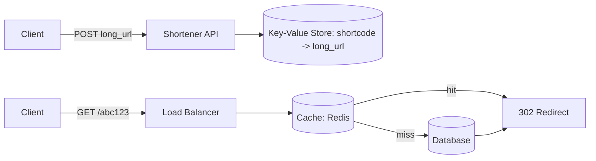

মূল component: **Write path** (short code generate করা এবং mapping store করা) এবং **Read path** (short code দিয়ে redirect করা, যেটা অনেক বেশি frequent)।

### How do you generate a unique short code?

সাধারণত দুইটা approach ব্যবহার করা হয়:

1. **Base62 encoding of an auto-incrementing ID** — একটা centralized/distributed counter (যেমন database sequence, বা Zookeeper/Redis `INCR`) থেকে একটা unique numeric ID নেওয়া হয়, তারপর সেটাকে Base62 (`a-z, A-Z, 0-9`) এ encode করা হয় যাতে code ছোট হয়।

```javascript
const ALPHABET = 'abcdefghijklmnopqrstuvwxyzABCDEFGHIJKLMNOPQRSTUVWXYZ0123456789';

function encodeBase62(num) {
  if (num === 0) return ALPHABET[0];
  let result = '';
  while (num > 0) {
    result = ALPHABET[num % 62] + result;
    num = Math.floor(num / 62);
  }
  return result;
}

// counter থেকে পাওয়া unique ID (যেমন Redis INCR থেকে) ব্যবহার করে code বানানো
const shortCode = encodeBase62(await redisClient.incr('url_id_counter')); // e.g. "b7F3k"
```

2. **Hash-based approach** — long URL-এর উপর MD5/SHA256 hash করে প্রথম ৬-৭ character নেওয়া। সমস্যা হলো এতে **collision** হতে পারে, তাই collision handling দরকার হয়।

Distributed system-এ counter নিয়ে **contention** এড়াতে **range-based ID allocation** ব্যবহার করা হয় — প্রতিটা server-কে একটা নির্দিষ্ট range (যেমন 1-1000, 1001-2000) আগে থেকে বরাদ্দ করে দেওয়া হয়, ফলে প্রতিটা request-এ central counter-এ যেতে হয় না।

### How do you handle collisions in short code generation?

- **Counter-based approach** ব্যবহার করলে collision তাত্ত্বিকভাবে হয় না, কারণ প্রতিটা ID unique।
- **Hash-based approach** ব্যবহার করলে: hash generate করার পর database-এ check করা হয় সেই code আগে থেকে আছে কিনা। থাকলে, একটা **salt/suffix** যোগ করে আবার hash করা হয় (retry loop), অথবা hash-এর length বাড়ানো হয়।

```javascript
async function generateUniqueCode(longUrl, db) {
  let attempt = 0;
  while (attempt < 5) {
    const hash = md5(longUrl + attempt).substring(0, 7);
    const exists = await db.exists(hash);
    if (!exists) return hash;
    attempt++;
  }
  throw new Error('Could not generate unique code after retries');
}
```

- আরেকটা কৌশল হলো **Bloom filter** ব্যবহার করে দ্রুত (probabilistically) check করা কোনো code আগে ব্যবহার হয়েছে কিনা, যাতে প্রতিটা check-এ database hit করতে না হয়।

### How do you scale reads since redirects are very frequent?

URL shortener-এ **read-to-write ratio** সাধারণত অনেক বেশি (১০০:১ বা তার বেশি) — কারণ একটা link একবার তৈরি হয়ে বহুবার click হয়। তাই read path optimize করাটাই মূল চ্যালেঞ্জ:

- **Caching (Redis/Memcached)** — জনপ্রিয় short code গুলোর mapping cache-এ রাখা, যাতে বেশিরভাগ redirect request database পর্যন্ত না গিয়েই serve হয়ে যায়।
- **CDN/Edge caching** — geographically distributed edge location-এ redirect mapping cache করা, যাতে user-এর কাছাকাছি থেকে দ্রুত response দেওয়া যায়।
- **Read replicas** — database-এর একাধিক read replica রেখে read load distribute করা (write শুধু primary-তে যায়)।
- **Database sharding** — short code-এর hash অনুযায়ী data বিভিন্ন shard-এ ভাগ করে দেওয়া, যাতে single database bottleneck না হয়।
- **HTTP 301 vs 302** — 301 (permanent redirect) browser cache করে ফেলে, ফলে পরবর্তীতে server-এ request-ই আসে না; কিন্তু এতে click analytics/tracking নষ্ট হয়ে যেতে পারে, তাই বেশিরভাগ shortener **302** ব্যবহার করে analytics ধরে রাখতে।

### How do you handle custom aliases?

User যদি নিজের পছন্দমতো alias (যেমন `bit.ly/my-brand`) দিতে চায়:

- Auto-generated code-এর বদলে, user-প্রদত্ত string-টাকেই key হিসেবে ব্যবহার করা হয়।
- Database-এ (unique constraint সহ) সেই key already exists কিনা check করা হয় — থাকলে user-কে error দেখানো হয় (409 Conflict) এবং বিকল্প suggest করা হয়।
- **Reserved word/profanity filtering** এবং length limit (যেমন সর্বোচ্চ ২০ character) validate করা হয়।
- যেহেতু custom alias গুলো auto-generated code-এর মতো uniformly distributed নয় (মানুষ common word ব্যবহার করে), তাই এগুলোর জন্য আলাদা namespace/collision handling logic রাখা ভালো।

---

## 62. How would you design a rate limiter?

**Rate limiter** একটা component যেটা নির্দিষ্ট সময়ের মধ্যে একজন client/user কতগুলো request পাঠাতে পারবে তা সীমাবদ্ধ করে, যাতে abuse, DDoS, বা resource overload প্রতিরোধ করা যায়।

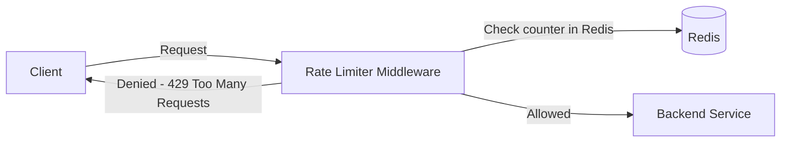

### Which algorithm would you use?

কয়েকটা জনপ্রিয় algorithm:

1. **Fixed Window Counter** — একটা fixed time window (যেমন প্রতি মিনিট)-এর মধ্যে request count রাখা হয়, limit পার হলে block করা হয়। সহজ কিন্তু window-এর সীমানায় (boundary) burst traffic এর সমস্যা হয় (যেমন window শেষের ১ সেকেন্ড এবং পরের window-এর শুরুর ১ সেকেন্ড মিলিয়ে দ্বিগুণ traffic যেতে পারে)।

2. **Sliding Window Log** — প্রতিটা request-এর timestamp log রাখা হয়, এবং একটা rolling window-এর মধ্যে কতগুলো request আছে সেটা count করা হয়। Accurate, কিন্তু memory খরচ বেশি (প্রতিটা request store করতে হয়)।

3. **Sliding Window Counter** — Fixed window এর সরলতা এবং sliding window-এর accuracy-এর মধ্যে একটা balance — আগের এবং বর্তমান window-এর counter দিয়ে weighted average হিসাব করা হয়।

4. **Token Bucket** — একটা bucket-এ নির্দিষ্ট হারে token যোগ হতে থাকে (যেমন প্রতি সেকেন্ডে ১০টা), প্রতিটা request একটা token খরচ করে। Bucket খালি হলে request reject হয়। এটা **burst traffic** কিছুটা allow করে (bucket ভর্তি থাকলে)।

5. **Leaky Bucket** — request গুলো একটা queue-তে জমা হয় এবং fixed constant rate-এ process হয়, queue ভর্তি হলে নতুন request drop হয়। এটা output rate কে perfectly smooth রাখে।

```javascript
// Token Bucket algorithm - সাধারণত সবচেয়ে জনপ্রিয় কারণ burst handle করে এবং implement করা সহজ
class TokenBucket {
  constructor(capacity, refillRatePerSec) {
    this.capacity = capacity;
    this.tokens = capacity;
    this.refillRate = refillRatePerSec;
    this.lastRefill = Date.now();
  }

  allowRequest() {
    this.refill();
    if (this.tokens >= 1) {
      this.tokens -= 1;
      return true;
    }
    return false;
  }

  refill() {
    const now = Date.now();
    const elapsedSec = (now - this.lastRefill) / 1000;
    this.tokens = Math.min(this.capacity, this.tokens + elapsedSec * this.refillRate);
    this.lastRefill = now;
  }
}
```

সাধারণত production system-এ **Token Bucket** বা **Sliding Window Counter** সবচেয়ে বেশি ব্যবহার হয় — কারণ এগুলো accuracy এবং performance-এর মধ্যে ভালো balance দেয়।

### How do you make the rate limiter work across multiple servers?

একাধিক server (horizontally scaled) এ rate limiting করতে গেলে প্রতিটা server-এ আলাদা আলাদা in-memory counter রাখলে ভুল হবে (প্রতিটা server নিজের হিসেবে limit ধরবে, ফলে actual global limit N × server_count হয়ে যাবে)। সমাধান:

- **Centralized shared store (Redis)** — সব server একটা common Redis instance/cluster-এ counter রাখে, ফলে global consistent limit বজায় থাকে।
- **Atomic operations** — Redis-এর `INCR` + `EXPIRE` অথবা Lua script দিয়ে atomic ভাবে check-and-increment করা হয়, যাতে race condition না হয়।
- **Sticky sessions** ব্যবহার করে একই client-কে সবসময় একই server-এ route করা যায় (তখন local counter কাজ করবে), কিন্তু এটা load balancing flexibility কমিয়ে দেয়, তাই সাধারণত centralized store-ই বেশি reliable।

```javascript
// Redis Lua script দিয়ে atomic fixed-window rate limiting
const rateLimitScript = `
  local current = redis.call("INCR", KEYS[1])
  if current == 1 then
    redis.call("EXPIRE", KEYS[1], ARGV[1])
  end
  return current
`;

async function isAllowed(redisClient, userId, limit = 100, windowSec = 60) {
  const key = `rate_limit:${userId}`;
  const count = await redisClient.eval(rateLimitScript, 1, key, windowSec);
  return count <= limit;
}
```

### How do you store rate limit state (Redis, in-memory)?

| Storage | সুবিধা | অসুবিধা | কখন ব্যবহার |
|---|---|---|---|
| **In-memory (local)** | খুবই দ্রুত, network call লাগে না | Multi-server setup-এ consistent না, restart হলে state হারায় | Single instance, বা approximate limiting যথেষ্ট হলে |
| **Redis (centralized)** | সব server জুড়ে consistent, `TTL`/atomic op built-in, খুবই দ্রুত (in-memory DB) | একটা extra network hop, Redis নিজেই bottleneck/SPOF হতে পারে (তাই Redis Cluster/replica দরকার) | বেশিরভাগ production distributed rate limiter |
| **Database (SQL/NoSQL)** | Durable, persistent history রাখা যায় | Latency বেশি, high-throughput rate limiting-এর জন্য উপযুক্ত না | Audit/billing-related long-term tracking |

Best practice হলো **Redis-কে primary store** হিসেবে ব্যবহার করা (in-memory speed + centralized consistency উভয়ই দেয়), সাথে key-তে **TTL** সেট করে পুরনো window data automatically expire করানো, যাতে storage বাড়তে না থাকে।

---

## 63. How would you design a notification system?

Notification system একাধিক channel (push, email, SMS, in-app) দিয়ে user-কে message পাঠায়। এটা সাধারণত **event-driven, asynchronous, এবং queue-based** architecture দিয়ে তৈরি হয়।

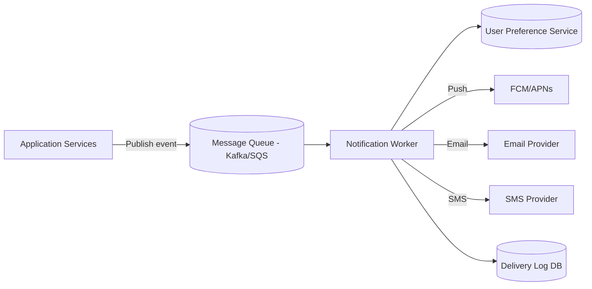

### How do you handle push notifications to millions of users?

- **Message Queue দিয়ে decouple করা** — notification generate করা service সরাসরি push না পাঠিয়ে একটা queue (Kafka, SQS, RabbitMQ)-তে event publish করে, এবং আলাদা **worker/consumer** pool সেগুলো process করে। এতে traffic spike হলেও producer block হয় না।
- **Horizontal scaling of workers** — worker সংখ্যা বাড়িয়ে parallel-ভাবে millions of notification process করা যায়।
- **Batching** — FCM/APNs-এর মতো push provider-এ একসাথে batch করে (যেমন ৫০০টা device token একসাথে) পাঠিয়ে API call কমানো।
- **Topic/Fan-out based broadcasting** — যদি একই notification অনেক user-কে যায় (যেমন "breaking news"), তাহলে FCM-এর **topic subscription** ব্যবহার করে single publish দিয়ে সব subscriber-কে পাঠানো যায়, প্রতি user-এর জন্য আলাদা call না করে।
- **Priority queue** — critical notification (OTP) কে non-critical (marketing) থেকে আলাদা queue-তে রেখে priority দেওয়া।

### How do you ensure notifications are delivered exactly once?

সত্যিকারের **exactly-once delivery** distributed system-এ কার্যত অসম্ভব (Q48-এর two generals problem-এর কারণে), তাই বাস্তবে **at-least-once delivery + idempotency** দিয়ে effective exactly-once behavior তৈরি করা হয়:

- প্রতিটা notification-এর জন্য একটা **unique idempotency key/notification ID** তৈরি করা হয়।
- Worker কোনো notification পাঠানোর আগে একটা **deduplication store** (Redis সেট, TTL সহ) চেক করে দেখে সেই ID আগে process হয়েছে কিনা।
- Message queue-তে consumer-এর **at-least-once processing** হতে পারে (retry এর কারণে), কিন্তু deduplication check করলে user দুইবার একই push পাবে না।

```javascript
async function processNotification(notification, redisClient) {
  const dedupeKey = `notif_sent:${notification.id}`;
  const alreadySent = await redisClient.set(dedupeKey, '1', 'NX', 'EX', 86400);
  if (!alreadySent) {
    return; // ইতিমধ্যে পাঠানো হয়েছে, skip করা হচ্ছে
  }
  await sendPush(notification);
}
```

- **Delivery log/status tracking** — প্রতিটা notification-এর status (`QUEUED`, `SENT`, `FAILED`, `DELIVERED`) database-এ track করা হয়, যাতে retry logic জানে কোনটা আবার পাঠাতে হবে।

### How do you handle user preference settings (opt-out, channels)?

- একটা **User Preference Service/table** রাখা হয় যেখানে প্রতিটা user-এর জন্য প্রতিটা notification type (marketing, transactional, security alert) এবং channel (push/email/SMS)-এর জন্য opt-in/opt-out status store থাকে।
- Notification পাঠানোর আগে worker সবসময় এই preference check করে — যদি user সেই category/channel থেকে opt-out করে থাকে, তাহলে সেই notification skip করা হয় (transactional/security notification সাধারণত mandatory থাকে, opt-out করা যায় না)।
- **Do Not Disturb (DND) সময়** এবং **timezone-aware scheduling** মাথায় রাখা হয় — যেমন রাত ১০টা থেকে সকাল ৮টা পর্যন্ত non-urgent notification না পাঠানো।
- Preference change গুলো **cache** (Redis) করে রাখা হয় যাতে প্রতিটা notification-এর জন্য বারবার database hit করতে না হয়, কিন্তু update হলে cache invalidate করার mechanism থাকতে হয়।

---

## 64. How would you design a social media news feed (like Twitter or Facebook)?

News feed system-এর মূল কাজ হলো একজন user যাদের follow করে তাদের post গুলো collect করে, rank করে, এবং দ্রুত দেখানো। মূল challenge হলো **write (post করা)** এবং **read (feed দেখা)**-এর মধ্যে trade-off ঠিক করা।

### What is the fan-out on write vs fan-out on read approach?

**Fan-out on Write (Push model):** কেউ post করলে সাথে সাথে তার সব follower-এর feed (precomputed list, সাধারণত Redis-এ) এ সেই post push করে দেওয়া হয়।

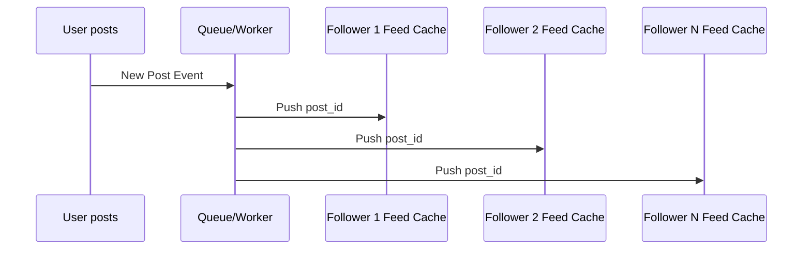

- **সুবিধা:** Feed পড়ার সময় খুবই দ্রুত — শুধু precomputed feed cache থেকে read করলেই হয়।
- **অসুবিধা:** যাদের কোটি কোটি follower আছে (celebrity), তাদের একটা post করলেই কোটি কোটি write operation trigger হয় (**hot key/celebrity problem**)।

**Fan-out on Read (Pull model):** Feed request এলে তখনই সেই user যাদের follow করে তাদের সাম্প্রতিক posts গুলো query করে merge করে দেখানো হয়।

- **সুবিধা:** Post করার সময় কোনো heavy fan-out লাগে না, celebrity-দের জন্য ভালো।
- **অসুবিধা:** Feed পড়ার সময় অনেক follow-করা user-এর data merge করতে হয় বলে read latency বেশি হয়, বিশেষ করে যারা অনেক মানুষকে follow করে।

### How do you handle celebrity users with millions of followers in fan-out?

বাস্তব system (Twitter) সাধারণত **hybrid approach** ব্যবহার করে:

- **সাধারণ user-দের জন্য fan-out on write** — তাদের follower সংখ্যা কম, তাই push করা সস্তা এবং feed read দ্রুত হয়।
- **Celebrity/high-follower user-দের জন্য fan-out on read** — post করার সময় write skip করা হয়; পরিবর্তে, যখন কোনো follower feed load করে, সেই সময় celebrity-দের recent post গুলো আলাদাভাবে fetch করে normal feed-এর সাথে **merge** করা হয়।

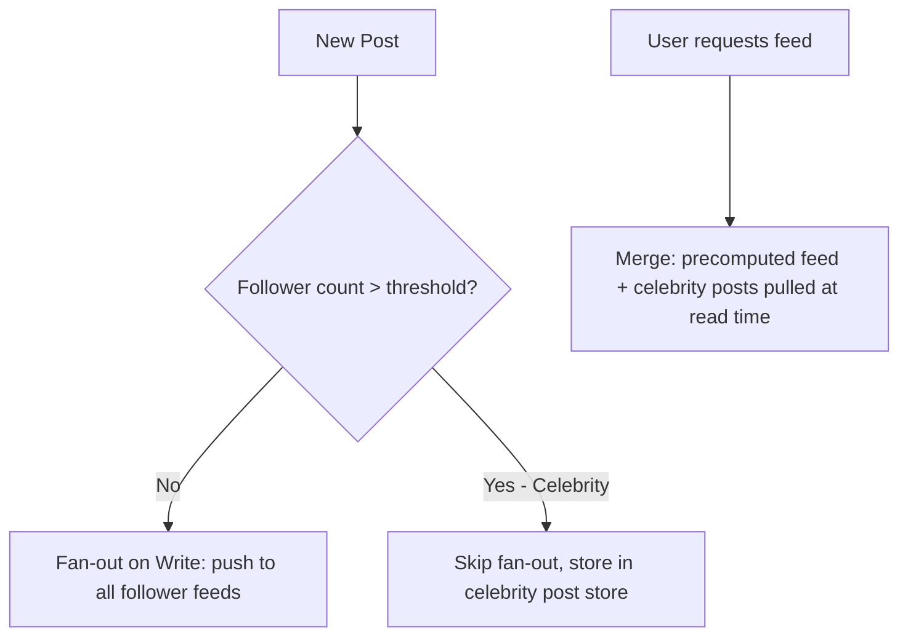

এই hybrid approach দিয়ে দুইদিকের সুবিধাই পাওয়া যায় — সাধারণ ব্যবহারকারীদের জন্য দ্রুত read, আর celebrity-দের জন্য write cost এড়ানো।

### How do you rank and filter a user's feed?

শুধু chronological order-এ দেখানোর বদলে modern feed-গুলো **ML-based ranking algorithm** ব্যবহার করে, যেখানে factor গুলো হলো:

- **Engagement prediction** — এই user এই post-এ like/comment/share করার সম্ভাবনা কতটুকু (machine learning model দিয়ে score করা)।
- **Recency** — নতুন post-কে বেশি priority।
- **Relationship strength** — যাদের সাথে user বেশি interact করে (close friend, family), তাদের post উপরে রাখা।
- **Content type diversity** — শুধু এক ধরনের content (সব video বা সব text) না দেখিয়ে diversify করা।
- **Negative signal filtering** — spam, already-seen, hidden/muted content বাদ দেওয়া।

Pipeline সাধারণত এরকম হয়: **Candidate generation** (recent posts থেকে কয়েকশ candidate বাছাই) → **Feature extraction** (user-post pair-এর জন্য feature বানানো) → **ML Ranking model** (score assign করা) → **Re-ranking/business rules** (diversity, ads insertion) → final feed।

---

## 65. How would you design a ride-sharing system (like Uber)?

মূল component গুলো: Rider app, Driver app, **Matching Service**, **Location Service**, **Pricing Service**, **Trip Service**।

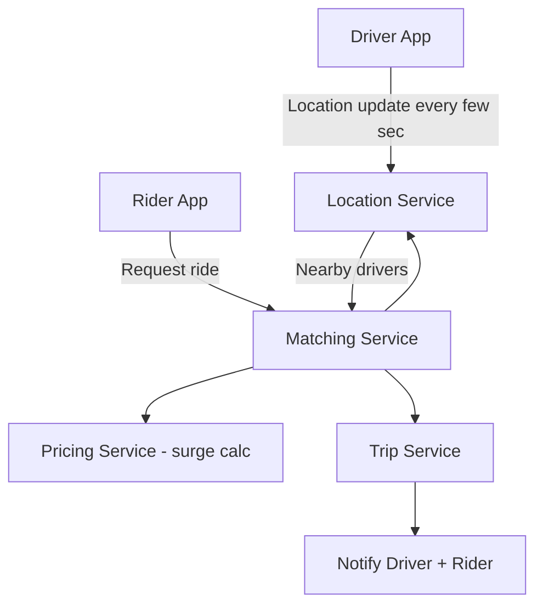

### How do you match drivers with riders efficiently?

- Rider request করলে system তার location-এর কাছাকাছি available driver-দের একটা candidate list বের করে (Geolocation query, নিচে বিস্তারিত)।
- **Matching algorithm** — সাধারণত এটা একটা optimization problem — শুধু nearest driver বেছে নেওয়া নয়, বরং overall system efficiency (যেমন ETA, driver utilization) বিবেচনা করে matching করা হয়। ছোট scale এ **greedy nearest-match** যথেষ্ট, কিন্তু বড় scale এ **batch matching** (একটা ছোট সময় window-এ সব pending request এবং available driver একসাথে নিয়ে optimal assignment করা, অনেকটা bipartite matching-এর মতো) বেশি efficient।
- Match হয়ে গেলে সেটা driver-কে push notification দিয়ে পাঠানো হয়, driver accept/reject করে। Reject/timeout হলে পরবর্তী nearest driver-কে try করা হয়।

### How do you handle geolocation and proximity queries at scale?

- **Geohashing** — latitude/longitude-কে একটা string code-এ (geohash) রূপান্তর করা হয়, যেখানে কাছাকাছি অবস্থানের geohash-এর prefix একইরকম হয়। এতে "কাছাকাছি ড্রাইভার খোঁজা" একটা string prefix-matching এ পরিণত হয়, যা database index দিয়ে দ্রুত করা যায়।
- **Quadtree** — এলাকাকে recursively চারটা ভাগে ভাগ করা হয়, ঘন এলাকায় (শহরের কেন্দ্র) ছোট cell, কম ঘন এলাকায় বড় cell — এতে density অনুযায়ী balanced query performance পাওয়া যায়।
- **Redis Geospatial index (GEOADD/GEORADIUS)** — driver location সরাসরি Redis-এ রাখা হয়, এবং `GEORADIUS`/`GEOSEARCH` command দিয়ে সরাসরি "এই point থেকে X কিমি-এর মধ্যে কারা আছে" query করা যায় — এটা খুবই দ্রুত, কারণ পুরোটাই in-memory।
- Driver-দের location প্রতি ২-৪ সেকেন্ডে update হয় বলে, এই write load handle করতে হয় হাই-থ্রুপুট, low-latency store (Redis/in-memory geo index) দরকার হয়, প্রথাগত SQL geo-query যথেষ্ট দ্রুত হয় না এই scale-এ।

### How do you handle surge pricing?

- City-কে geographic zone/grid-এ ভাগ করা হয় (যেমন geohash grid cell)।
- প্রতিটা zone-এ **real-time demand (ride request সংখ্যা)** এবং **supply (available driver সংখ্যা)** track করা হয়।
- Demand/supply ratio একটা threshold পার হলে, সেই zone-এর জন্য একটা **surge multiplier** (যেমন 1.5x, 2x) apply করা হয় — এটা price বাড়িয়ে চাহিদা কিছুটা কমায় এবং একইসাথে বেশি driver-কে সেই এলাকায় আসতে উৎসাহিত করে।
- Surge calculation সাধারণত একটা **streaming pipeline** (Kafka + real-time aggregation, যেমন Flink/Spark Streaming) দিয়ে প্রতি কয়েক সেকেন্ডে recompute করা হয়, যাতে দ্রুত পরিবর্তনশীল চাহিদার সাথে price adapt করতে পারে।
- Ride request করার মুহূর্তে যে price দেখানো হয়, সেটা **lock** করে রাখা হয় (কিছু সময়ের জন্য), যাতে matching সম্পন্ন হওয়ার আগে price আবার না বদলায়।

---

## 66. How would you design a distributed key-value store?

একটা distributed key-value store (DynamoDB, Cassandra-এর মতো) একটা simple `get(key)`/`put(key, value)` interface দেয়, কিন্তু ভেতরে data multiple node জুড়ে partition এবং replicate হয়ে থাকে, যাতে horizontal scalability এবং fault tolerance পাওয়া যায়।

### How does consistent hashing distribute keys across nodes?

সাধারণ hashing (`hash(key) % N`) ব্যবহার করলে node সংখ্যা (N) বদলালে (add/remove) প্রায় সব key নতুন node-এ পুনরায় বিন্যাস (re-distribute) করতে হয় — এটা খুবই ব্যয়বহুল। **Consistent Hashing** এই সমস্যা সমাধান করে:

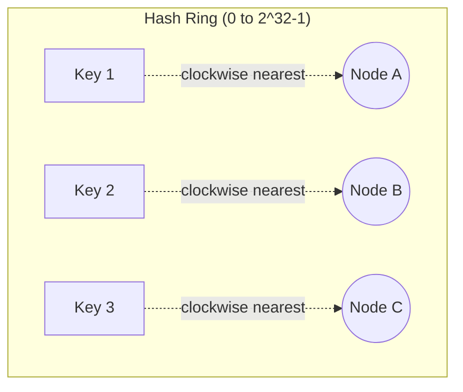

- সব node এবং সব key-কে একটা **hash ring** (0 থেকে 2³²-1 পর্যন্ত একটা circular space)-এ map করা হয়।
- প্রতিটা key তার position থেকে **clockwise দিকে সবচেয়ে কাছের node**-এ assign হয়।
- নতুন node যোগ হলে, শুধু তার **immediate neighbor-এর কিছু key** পুনরায় বিন্যাস হয় — বাকি সব key অপরিবর্তিত থাকে। এতে rebalancing খরচ অনেক কমে যায় (গড়ে K/N key move হয়, K = মোট key, N = node সংখ্যা)।
- **Virtual nodes (vnodes)** — প্রতিটা physical node-কে ring-এ একাধিকবার (যেমন ১৫০টা virtual position) রাখা হয়, যাতে data uniformly distribute হয় এবং কোনো একটা node অতিরিক্ত load না পায় (load imbalance এড়ানো)।

### How do you handle node failures and data recovery?

- **Replication** — প্রতিটা key তার responsible node ছাড়াও পরবর্তী **N-1 টা node**-এ (ring-এ clockwise) replicate করে রাখা হয় (যেমন replication factor 3)।
- **Quorum-based read/write (Q = quorum)** — Dynamo-style system-এ `W` (write quorum) এবং `R` (read quorum) সেট করা যায়, যেখানে `W + R > N` হলে **strong consistency** নিশ্চিত হয়, নাহলে **eventual consistency** পাওয়া যায় (কম latency-এর বিনিময়ে)।
- **Failure detection** — **Gossip protocol** দিয়ে node-রা একে অপরের health সম্পর্কে জানতে পারে; কোনো node অনুপস্থিত মনে হলে অন্য node তার দায়িত্ব সাময়িকভাবে নেয় (**hinted handoff**) — যখন failed node ফিরে আসে তখন hint data তাকে ফেরত দেওয়া হয়।
- **Anti-entropy / Read repair** — replica-দের মধ্যে data ভিন্ন (diverged) হয়ে গেলে **Merkle tree** ব্যবহার করে দ্রুত পার্থক্য খুঁজে বের করে sync করা হয়, অথবা read করার সময় stale replica update করে দেওয়া হয় (read repair)।
- **Conflict resolution** — একই key-তে concurrent write হলে conflict হতে পারে; এটা resolve করতে **vector clocks** বা **last-write-wins (LWW)** কৌশল ব্যবহার করা হয়।

### How does Amazon DynamoDB or Apache Cassandra implement a key-value store?

উভয়ই মূলত Amazon-এর মূল **Dynamo paper (2007)** থেকে অনুপ্রাণিত এবং একই core principle ব্যবহার করে — Consistent hashing, replication, quorum-based consistency, gossip protocol, hinted handoff।

- **Apache Cassandra** — ওপেন সোর্স, **peer-to-peer masterless architecture** (কোনো single leader নেই, সব node সমান), CQL (SQL-এর মতো query language) support করে, wide-column data model, tunable consistency (`ONE`, `QUORUM`, `ALL`) দেয়।
- **Amazon DynamoDB** — fully managed AWS service, প্রথাগতভাবে Dynamo paper থেকে এসেছিল কিন্তু বর্তমান DynamoDB-তে **partition + sort key** model, automatic scaling, এবং internally একটা **log-structured storage** (multi-Paxos ভিত্তিক replication, নতুন সংস্করণে) ব্যবহার করে যা strong consistency-ও offer করতে পারে।
- উভয় system-ই **write-heavy workload**, **horizontal scalability**, এবং **no single point of failure** — এই লক্ষ্য নিয়েই design করা, যেখানে trade-off হিসেবে জটিল multi-row transaction বা join সীমিত রাখা হয়েছে।

---

## 67. How would you design a video streaming platform (like YouTube or Netflix)?

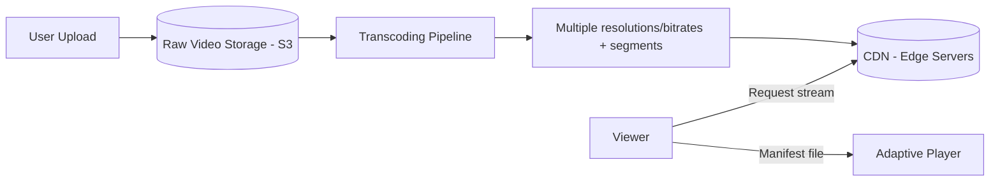

### How do you handle video upload, transcoding, and storage?

- Upload হওয়া raw video প্রথমে একটা **object storage** (S3-এর মতো) এ রাখা হয়, এবং একটা event trigger করে transcoding pipeline শুরু হয় (async processing, যাতে uploader দীর্ঘ সময় অপেক্ষা না করে)।
- **Transcoding** — মূল video থেকে একাধিক resolution (240p, 480p, 720p, 1080p, 4K) এবং bitrate-এ convert করা হয়, এবং সেগুলোকে ছোট ছোট **chunk/segment** (২-১০ সেকেন্ড করে) এ ভাগ করা হয় — এই কাজ CPU-intensive বলে সাধারণত একটা distributed worker pool (parallel processing) দিয়ে করা হয়।
- Transcode হওয়া output গুলো আবার object storage-এ রাখা হয়, এবং সেখান থেকে **CDN**-এ push/pull করা হয়।
- **Metadata (title, description, thumbnail, video ID, encoding status)** আলাদা database-এ রাখা হয়, এবং video-র transcoding status track করা হয় (`UPLOADED`, `PROCESSING`, `READY`, `FAILED`)।

### How does adaptive bitrate streaming work?

**Adaptive Bitrate Streaming (ABR)** — যেমন HLS (HTTP Live Streaming) বা DASH (Dynamic Adaptive Streaming over HTTP) — user-এর network condition অনুযায়ী automatically video quality পরিবর্তন করে, buffering কমিয়ে smooth playback দেয়।

- Video-কে একাধিক bitrate/resolution-এ encode করে ছোট segment (chunk) এ ভাগ করা হয়।
- একটা **manifest file** (HLS-এ `.m3u8`, DASH-এ `.mpd`) তৈরি করা হয় যেটাতে প্রতিটা quality level-এর segment গুলোর URL list থাকে।
- Player প্রতিটা segment download করার সময় বর্তমান network bandwidth measure করে, এবং পরবর্তী segment কোন quality থেকে নেওয়া হবে সেটা dynamically সিদ্ধান্ত নেয়।

```
manifest.m3u8
├── 240p/segment_001.ts, segment_002.ts, ...
├── 480p/segment_001.ts, segment_002.ts, ...
├── 720p/segment_001.ts, segment_002.ts, ...
└── 1080p/segment_001.ts, segment_002.ts, ...
```

এভাবে internet slow হলে player স্বয়ংক্রিয়ভাবে নিচের quality-তে নেমে আসে, buffering না দেখিয়ে playback চালিয়ে যায়, এবং network ভালো হলে আবার উপরের quality-তে উঠে যায়।

### How do you use a CDN to serve video content globally?

- Video content (transcoded segment + manifest) একটা **origin server/storage**-এ থাকে, এবং **CDN (CloudFront, Akamai, Cloudflare)**-এর edge server গুলোতে **cache/replicate** করে রাখা হয়, যেগুলো বিশ্বের বিভিন্ন geographic location-এ ছড়ানো থাকে।
- User যখন video request করে, তার কাছাকাছি edge server থেকে content serve হয় — এতে **latency কমে** এবং **origin server-এর উপর load কমে**।
- জনপ্রিয় (viral) video গুলো বেশি edge location-এ cache থাকে (popularity-based caching), কম জনপ্রিয় video প্রথমবার request এলে origin থেকে fetch করে cache-এ রাখে (**cache miss → pull**)।
- **Pre-warming** — বড় release (নতুন movie/episode) এর আগে থেকে জনপ্রিয় হওয়ার সম্ভাবনা থাকা content edge server-এ push করে রাখা হয়।
- CDN token-based **signed URL/DRM** দিয়ে content-এর unauthorized access প্রতিরোধ করা হয়।

---

## 68. How would you design a chat application (like WhatsApp)?

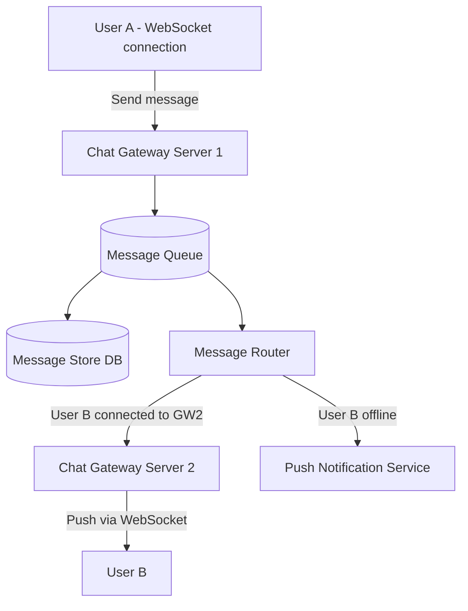

### How do you implement real-time message delivery using WebSocket?

- প্রতিটা client একটা **persistent WebSocket connection** রাখে একটা **Chat Gateway/Connection Server**-এর সাথে, যেটা bidirectional, low-latency real-time communication দেয় (HTTP polling-এর তুলনায় অনেক efficient)।
- একজন user অন্য একজনকে message পাঠালে, sender-এর gateway server সেই message নেয়, এবং একটা **connection registry** (Redis-এ maintained: "কোন user কোন gateway server-এ connected") চেক করে দেখে receiver বর্তমানে কোন server-এ আছে।
- যদি receiver একই server-এ থাকে, সরাসরি push করা হয়; ভিন্ন server হলে, একটা internal **message broker (Kafka/Redis Pub-Sub)** দিয়ে সেই server-এ route করা হয়, যেখান থেকে সে WebSocket দিয়ে receiver-কে push করে।
- Receiver অফলাইন থাকলে message queue-তে/database-এ pending রাখা হয় এবং **push notification** পাঠানো হয়; user online হলে undelivered message গুলো sync করা হয়।

```javascript
// Simplified WebSocket message handling (server side, Node.js + ws)
wss.on('connection', (socket, req) => {
  const userId = authenticate(req);
  connectionRegistry.set(userId, socket); // in-memory local map
  redisClient.set(`presence:${userId}`, SERVER_ID); // global registry

  socket.on('message', async (raw) => {
    const msg = JSON.parse(raw);
    await messageQueue.publish('chat.messages', msg); // persist + route
  });

  socket.on('close', () => {
    connectionRegistry.delete(userId);
    redisClient.del(`presence:${userId}`);
  });
});
```

### How do you store and retrieve chat history efficiently?

- Message গুলো একটা **wide-column store (Cassandra/HBase)** বা sharded SQL database-এ রাখা হয়, যেখানে **partition key** সাধারণত `conversation_id` এবং **sort key** `timestamp/message_id` (time-ordered) — এতে "একটা conversation-এর সাম্প্রতিক N টা message" query করা খুব দ্রুত হয় (sequential range scan)।
- **Pagination** — chat history load করার সময় pagination (cursor-based, message_id/timestamp দিয়ে) ব্যবহার করা হয়, পুরো history একসাথে না এনে।
- **Sharding by conversation_id** — একটা নির্দিষ্ট chat-এর সব message একই shard-এ রাখা হয়, যাতে সেই conversation-এর history পড়তে multiple shard জুড়ে query করতে না হয়।
- **Media (image/video)** আলাদা object storage-এ রাখা হয়, database-এ শুধু তার URL/reference রাখা হয়।

### How do you handle group chats and delivery receipts?

- **Group chat** — একটা `group_id`-এর সাথে member list attach থাকে; message পাঠানো হলে সেটা group-এর প্রতিটা active member-এর কাছে fan-out করা হয় (Q64-এর fan-out on write-এর মতো, তবে scope ছোট)।
- **Delivery receipt (sent → delivered → read)** — প্রতিটা status transition এর জন্য একটা ছোট event message পাঠানো হয় sender-কে (`delivered` — receiver-এর device message পেয়েছে, `read` — receiver open করেছে)। এই status গুলো per-recipient track করতে হয় group chat-এ (কে কে দেখেছে), তাই একটা `message_status` table/structure রাখা হয় `(message_id, user_id, status)` আকারে।
- এই receipt event গুলো নিজেরাই আরেকটা lightweight real-time message, তাই একই WebSocket infrastructure দিয়েই পাঠানো হয়, তবে persist করার প্রয়োজন কম (short TTL/write-optimized store যথেষ্ট)।

---

## 69. How would you design a search autocomplete system?

Autocomplete system একজন user টাইপ করার সাথে সাথে (প্রতি keystroke-এ) সম্ভাব্য query suggestion দেখায়। মূল requirement: **অত্যন্ত কম latency (< 100ms)** এবং জনপ্রিয়তা অনুযায়ী ranking।

### What data structure is used for prefix search (trie)?

**Trie (Prefix Tree)** হলো এই কাজের জন্য classic data structure — প্রতিটা node একটা character represent করে, এবং root থেকে একটা path একটা prefix তৈরি করে। এতে একটা prefix দিয়ে সব সম্ভাব্য completion বের করা যায় `O(prefix length)` সময়ে (trie traverse করে)।

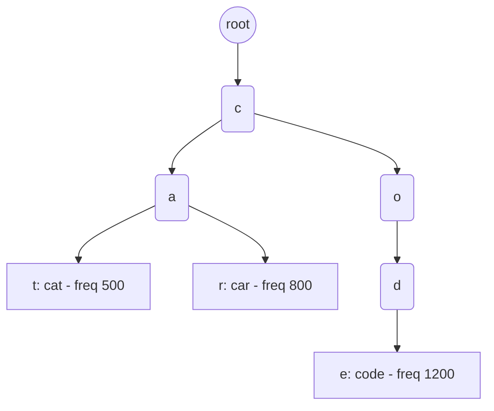

```javascript
class TrieNode {
  constructor() {
    this.children = new Map();
    this.isEndOfWord = false;
    this.frequency = 0;
    this.topSuggestions = []; // optimization: প্রতিটা node-এ top-K suggestion cache করে রাখা
  }
}

class Trie {
  constructor() {
    this.root = new TrieNode();
  }

  insert(word, frequency) {
    let node = this.root;
    for (const ch of word) {
      if (!node.children.has(ch)) node.children.set(ch, new TrieNode());
      node = node.children.get(ch);
      // top-K suggestion list eagerly update করা হয়, query time-এ fast lookup-এর জন্য
      node.topSuggestions.push({ word, frequency });
      node.topSuggestions.sort((a, b) => b.frequency - a.frequency);
      node.topSuggestions = node.topSuggestions.slice(0, 5);
    }
    node.isEndOfWord = true;
  }

  getSuggestions(prefix) {
    let node = this.root;
    for (const ch of prefix) {
      if (!node.children.has(ch)) return [];
      node = node.children.get(ch);
    }
    return node.topSuggestions;
  }
}
```

বড় scale-এ পুরো trie সাধারণত **in-memory** রাখা হয় (কারণ এটা মূলত read-heavy, low-latency দরকার), এবং প্রতিটা node-এ আগে থেকেই top-K frequent suggestion **precompute/cache** করে রাখা হয় (উপরের কোডে দেখানো হয়েছে), যাতে query time-এ পুরো subtree traverse করে sort করতে না হয়।

### How do you rank autocomplete suggestions by popularity?

- প্রতিটা query/phrase-এর জন্য একটা **frequency/popularity score** track করা হয় — কতবার সেই query search হয়েছে, বা কতবার সেই suggestion click হয়ে conversion হয়েছে।
- Trie-এর প্রতিটা terminal node-এ (বা প্রতিটা prefix node-এ, উপরে দেখানো মতো) সেই score অনুযায়ী **top-K precomputed suggestions** রাখা হয়, যাতে query time-এ real-time sorting এড়ানো যায়।
- Ranking-এ শুধু raw frequency না নিয়ে অন্যান্য signal ও যোগ করা হয়: **personalization** (user-এর নিজস্ব search history), **recency** (সাম্প্রতিক trending query-কে বেশি weight), **geo-relevance** (location-based popularity)।

### How do you update suggestions in real time as trends change?

- Search query log গুলো একটা **stream processing pipeline** (Kafka + Spark/Flink Streaming) এ যায়, যেখানে প্রতি কয়েক মিনিটে query frequency aggregate/recompute করা হয়।
- Trie সরাসরি প্রতিটা search-এ update না করে, একটা **offline/batch job** (যেমন প্রতি ৫-১০ মিনিটে) নতুন frequency data দিয়ে trie পুনর্নির্মাণ (rebuild) করে, এবং নতুন trie **atomically swap** করে পুরোনোটার জায়গায় বসায় (blue-green style update, যাতে read কখনো interrupted না হয়)।
- **Trending/breaking topic** এর ক্ষেত্রে একটা আলাদা fast-path pipeline রাখা হয় যেটা কয়েক সেকেন্ডের মধ্যেই hot query detect করে সাময়িকভাবে boost দেয় (যেমন একটা separate "trending override" layer, পুরো trie rebuild-এর অপেক্ষা না করে)।

---

## 70. How would you design a distributed job scheduler?

একটা distributed job scheduler নির্দিষ্ট সময়ে (cron-like) বা নির্দিষ্ট event-এ job trigger করে, এবং সেটা একাধিক worker node জুড়ে reliably execute নিশ্চিত করে।

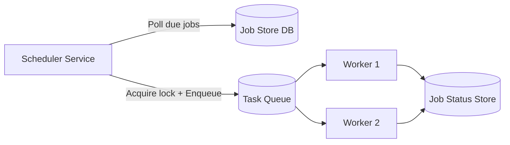

### How do you ensure a job runs exactly once?

- **Distributed lock** (Q46 দেখুন) ব্যবহার করে নিশ্চিত করা হয় একই সময়ে দুইটা scheduler instance একই job একসাথে trigger না করে — job execute করার আগে সেই job-এর জন্য একটা lock নেওয়া হয়।
- প্রতিটা scheduled execution-এর জন্য একটা **unique execution ID** (job_id + scheduled_time) তৈরি করা হয়, এবং worker execute করার আগে সেই ID একটা "already executed" store-এ (idempotency check) দেখে নেয়।
- Job status একটা database-এ `PENDING → RUNNING → COMPLETED/FAILED` state machine হিসেবে track করা হয়, এবং state transition গুলো **atomic (compare-and-swap)** করা হয় — যেমন `UPDATE jobs SET status='RUNNING' WHERE id=? AND status='PENDING'`, যাতে দুইটা worker একসাথে একই job না ধরে ফেলে।

```sql
-- Atomic claim: শুধু একজন worker-ই সফলভাবে এই row claim করতে পারবে
UPDATE jobs
SET status = 'RUNNING', worker_id = 'worker-7', locked_at = NOW()
WHERE id = 42 AND status = 'PENDING';
-- affected rows = 1 হলেই worker কাজটা শুরু করবে, 0 হলে অন্য worker আগেই নিয়েছে
```

### How do you handle job failures and retries?

- Worker job execute করার সময় fail করলে, status `FAILED` মার্ক করে **retry policy** (max retry count, exponential backoff) অনুযায়ী পরবর্তী attempt schedule করা হয়।
- **Dead Letter Queue (DLQ)** — যদি একটা job নির্দিষ্ট সংখ্যক বার (যেমন ৫ বার) retry করার পরেও fail করে, সেটা একটা DLQ-তে সরিয়ে রাখা হয়, যাতে সেটা পুরো pipeline block না করে এবং পরে manual investigation/alert করা যায়।
- **Heartbeat/lease mechanism** — worker running অবস্থায় periodically একটা heartbeat পাঠায়; worker crash করলে (heartbeat বন্ধ হয়ে গেলে), lock/lease automatically expire হয়ে job আবার `PENDING`-এ ফিরে যায়, অন্য worker সেটা তুলে নিতে পারে।

### How do you schedule jobs with dependencies?

- Job গুলোকে একটা **Directed Acyclic Graph (DAG)** হিসেবে model করা হয়, যেখানে প্রতিটা node একটা job এবং edge বোঝায় dependency (B, A-এর পরেই চলবে)। এই approach Airflow/Temporal-এর মতো workflow orchestration tool ব্যবহার করে।

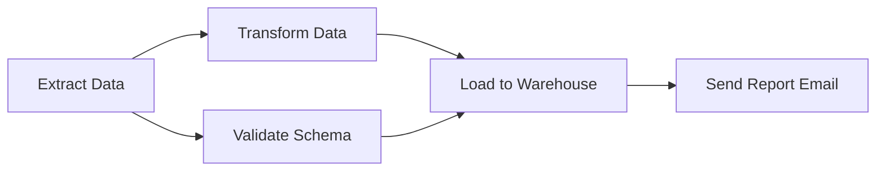

- Scheduler প্রতিটা job-এর dependency track করে — একটা job তখনই "runnable" state-এ যায় যখন তার সব **upstream dependency সফলভাবে সম্পন্ন** হয়েছে।
- **Topological sort** ব্যবহার করে execution order নির্ধারণ করা হয়, এবং independent (parallel) branch-গুলো (উপরের ডায়াগ্রামে B এবং C) একসাথে/parallel-এ execute করা হয় সময় বাঁচাতে।
- কোনো upstream job fail করলে, downstream job গুলো (যেগুলো তার উপর নির্ভরশীল) automatically **skip বা block** করা হয় এবং alert পাঠানো হয়, যাতে ভুল/অসম্পূর্ণ data দিয়ে পরবর্তী ধাপ না চলে।

---

## 71. How would you design a payment processing system?

Payment system-এর সবচেয়ে গুরুত্বপূর্ণ বিষয় হলো **correctness, consistency, এবং security** — performance এখানে secondary priority, কারণ ভুল হলে সরাসরি আর্থিক ক্ষতি হয়।

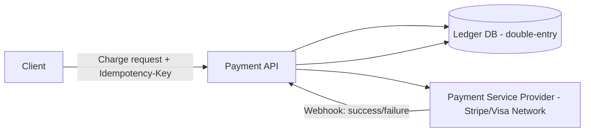

### How do you ensure idempotency in payment APIs?

- Client প্রতিটা payment request-এর সাথে একটা **client-generated unique Idempotency-Key** পাঠায় (যেমন একটা UUID)।
- Server প্রথমে সেই key দিয়ে একটা lookup table চেক করে — key আগে থেকে থাকলে, নতুন charge না করে **আগের সংরক্ষিত response** ফেরত দেওয়া হয়।
- এটা critical কারণ network timeout হলে client হয়তো retry করবে, কিন্তু আসলে প্রথম request successfully process হয়ে গিয়েছিল — idempotency key ছাড়া এতে **duplicate charge** হয়ে যাবে।

```javascript
async function chargePayment(req, db) {
  const { idempotencyKey, amount, customerId } = req;

  const existing = await db.findByIdempotencyKey(idempotencyKey);
  if (existing) {
    return existing.response; // আগের result-ই ফেরত দেওয়া হচ্ছে, নতুন charge হচ্ছে না
  }

  // atomic insert - unique constraint থাকলে race condition-ও প্রতিরোধ হয়
  const record = await db.insertIdempotencyRecord(idempotencyKey, 'PROCESSING');
  const result = await paymentGateway.charge(amount, customerId);
  await db.updateIdempotencyRecord(idempotencyKey, 'COMPLETED', result);
  return result;
}
```

### How do you handle double charges and refunds?

- **Double-entry ledger system** ব্যবহার করা হয় (accounting principle থেকে অনুপ্রাণিত) — প্রতিটা transaction-এ একটা debit এবং একটা credit entry থাকে, যেটা পরে reconciliation/audit-এ সহজ করে ভুল ধরতে।
- **Unique constraint on transaction reference** — database level-এ (যেমন `order_id` বা `idempotency_key`-এর উপর unique index) হার্ড গ্যারান্টি রাখা হয় যাতে race condition এ কখনো duplicate row insert না হয়।
- **Refund-কে নতুন, আলাদা transaction হিসেবে treat করা হয়** (মূল charge-কে সরাসরি edit/delete না করে) — এভাবে সম্পূর্ণ audit trail বজায় থাকে (মূল charge + refund দুটোই ইতিহাসে থেকে যায়)।
- **Reconciliation job** — নিয়মিত (দৈনিক) internal ledger আর payment provider-এর (Visa/Stripe) statement মিলিয়ে দেখা হয় কোনো mismatch আছে কিনা, mismatch পেলে alert তৈরি হয়।

### What compliance considerations (PCI-DSS) affect payment system design?

**PCI-DSS (Payment Card Industry Data Security Standard)** হলো card payment handle করা সব system-এর জন্য বাধ্যতামূলক security standard। এর কিছু গুরুত্বপূর্ণ প্রভাব:

- **Never store raw card data** — CVV কখনো store করা যায় না, এবং full card number store করতে হলে কঠোর encryption/tokenization প্রয়োজন। বেশিরভাগ কোম্পানি এড়াতে **tokenization** ব্যবহার করে — actual card data একটা certified payment processor (Stripe, Braintree)-এর কাছে রেখে, নিজেদের system-এ শুধু একটা token রাখা হয়।
- **Network segmentation** — card data handle করা environment (Cardholder Data Environment/CDE) কে বাকি infrastructure থেকে আলাদা network zone-এ রাখা হয়।
- **Encryption in transit and at rest** — সব sensitive data TLS দিয়ে transmit এবং encrypted storage-এ রাখতে হয়।
- **Access control এবং logging** — কে কখন payment data access করেছে তার বিস্তারিত audit log রাখতে হয়, এবং role-based access control (least privilege) মেনে চলতে হয়।
- **Regular security audit/penetration testing** — PCI compliance বজায় রাখতে নিয়মিত third-party security assessment বাধ্যতামূলক।

এই কারণেই বেশিরভাগ কোম্পানি নিজেরা পুরো payment infrastructure না বানিয়ে একটা **PCI-DSS compliant Payment Service Provider (PSP)** ব্যবহার করে, এবং নিজেদের system শুধু orchestration/business logic layer হিসেবে কাজ করে।

---

## 72. How would you design a web crawler?

একটা web crawler internet-এর পাতা গুলো visit করে, তাদের content download করে, এবং নতুন link খুঁজে বের করে আরও crawl চালিয়ে যায় — সাধারণত search engine index তৈরির জন্য ব্যবহৃত হয়।

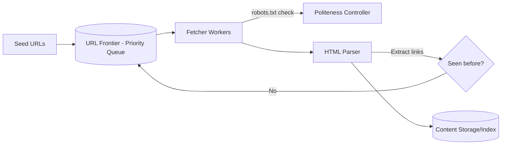

### How do you avoid crawling the same page twice?

- প্রতিটা visited URL-কে normalize করা হয় (trailing slash, query parameter order, uppercase/lowercase ঠিক করা) যাতে একই page-এর ভিন্ন-দেখতে URL-কে একই হিসেবে চেনা যায়।
- একটা **URL Seen Set** রাখা হয়, যেখানে visited/queued URL চেক করা হয়। বিলিয়ন-স্কেল URL-এর জন্য raw hash set memory-তে রাখা সম্ভব না, তাই **Bloom Filter** ব্যবহার করা হয় — এটা memory-efficient (probabilistic) ভাবে বলে দিতে পারে "এই URL সম্ভবত আগে দেখা হয়েছে" (সামান্য false-positive rate সহ, কিন্তু কখনো false-negative না)।
- Content-level duplicate detect করতে (ভিন্ন URL, কিন্তু একই content) **content hash (checksum/simhash)** ব্যবহার করা হয়।

```javascript
// Simplified Bloom filter based URL deduplication concept
class BloomFilter {
  constructor(size, numHashes) {
    this.bitArray = new Uint8Array(size);
    this.size = size;
    this.numHashes = numHashes;
  }
  add(url) {
    for (let i = 0; i < this.numHashes; i++) this.bitArray[this.hash(url, i)] = 1;
  }
  mightContain(url) {
    for (let i = 0; i < this.numHashes; i++) {
      if (!this.bitArray[this.hash(url, i)]) return false; // নিশ্চিতভাবে দেখা হয়নি
    }
    return true; // সম্ভবত আগে দেখা হয়েছে (false positive সম্ভব)
  }
  hash(url, seed) {
    let h = seed;
    for (const ch of url) h = (h * 31 + ch.charCodeAt(0)) % this.size;
    return h;
  }
}
```

### How do you handle crawl politeness (robots.txt, rate limiting)?

- Crawler প্রথমে প্রতিটা domain-এর **`robots.txt`** file fetch করে চেক করে কোন কোন path crawl করা অনুমোদিত (`Disallow` rule মেনে চলা), এবং সেটা cache করে রাখা হয় (বারবার fetch না করতে)।
- **Per-domain rate limiting** — একই server-কে অতিরিক্ত request পাঠিয়ে overload না করার জন্য প্রতিটা domain-এর জন্য আলাদা request queue এবং delay maintain করা হয় (যেমন একই domain-এ প্রতি ১-২ সেকেন্ডে একটার বেশি request না)।
- **Crawl-delay directive** (robots.txt-এ উল্লেখ থাকলে) মেনে চলা হয়।
- **User-Agent identification** — crawler নিজের পরিচয় সঠিকভাবে জানায় (যাতে site owner তাকে চিনতে ও প্রয়োজনে block করতে পারে)।

### How do you scale a crawler to billions of pages?

- **Distributed architecture** — crawling কাজ multiple worker node জুড়ে distribute করা হয়, প্রতিটা worker নির্দিষ্ট কিছু domain/URL range-এর জন্য দায়ী থাকে (consistent hashing দিয়ে domain assign করা যায়, Q66 দেখুন), যাতে politeness rule maintain সহজ হয়।
- **URL Frontier as a distributed priority queue** — কোন URL আগে crawl হবে তার priority (page rank, freshness, importance) অনুযায়ী নির্ধারণ করা হয়, এবং এই frontier একটা distributed queue (Kafka-এর মতো) দিয়ে বিভিন্ন worker-এর মধ্যে ভাগ করা হয়।
- **Asynchronous, non-blocking I/O** — একই সময়ে হাজার হাজার HTTP request pending রাখতে (network-bound কাজ) event-driven/async architecture ব্যবহার করা হয়, thread-per-request না করে।
- **Storage scaling** — crawled content বিশাল পরিমাণে (petabyte-scale) হয় বলে distributed file system (HDFS/S3-এর মতো) এবং distributed index (Elasticsearch-এর মতো) ব্যবহার করা হয়।
- **Incremental/refresh crawling** — সব page বারবার re-crawl না করে, page-এর পরিবর্তনের frequency অনুমান করে (কিছু page দ্রুত বদলায়, কিছু স্থির থাকে) priority-ভিত্তিক re-crawl schedule করা হয়, যাতে resource সবচেয়ে গুরুত্বপূর্ণ/পরিবর্তনশীল page-এ ব্যয় হয়।
