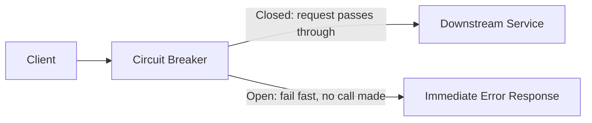
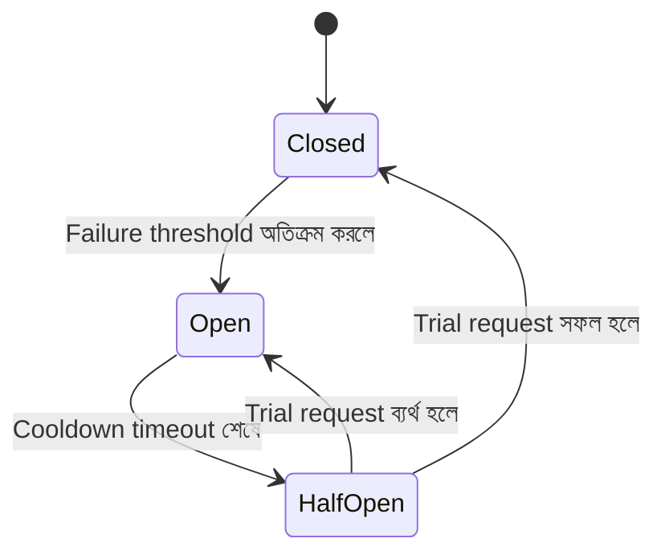
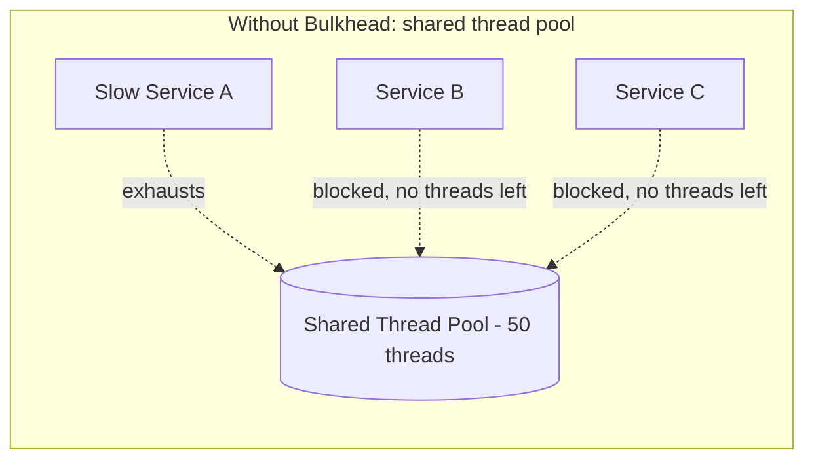
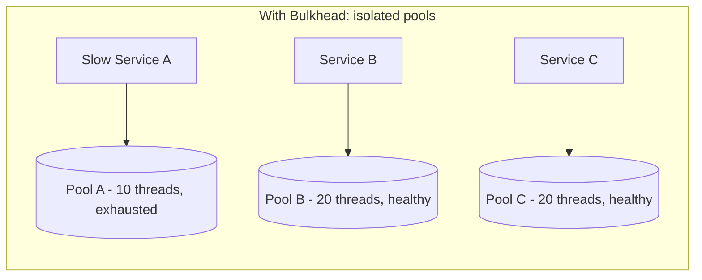
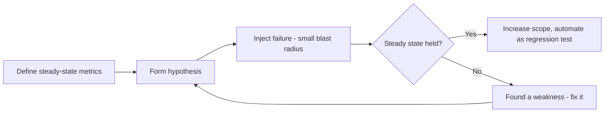
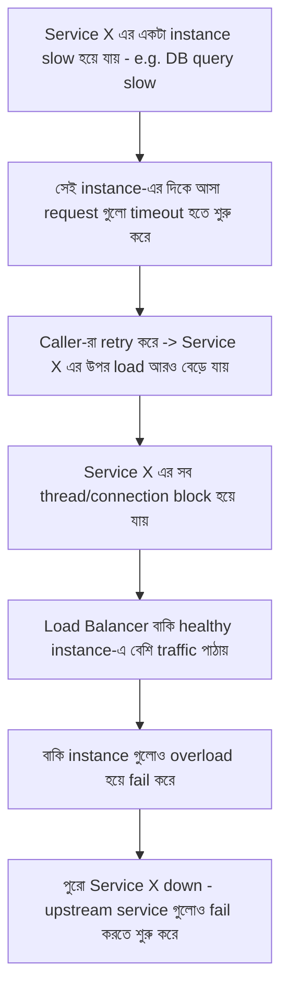

## 73. What is the circuit breaker pattern and how does it work?

**Circuit breaker pattern** হলো একটা design pattern যেটা downstream service (যেমন একটা database বা external API) বারবার fail হতে থাকলে, caller-কে সেই service-এ নতুন request পাঠানো থেকে সাময়িকভাবে বিরত রাখে। এটা electrical circuit breaker-এর concept থেকে অনুপ্রাণিত — কারেন্ট বেশি হয়ে গেলে যেমন সার্কিট breaker নিজে থেকে trip করে বিদ্যুৎ সংযোগ কেটে দেয় (যাতে বড় ক্ষতি না হয়), তেমনি software circuit breaker fail হতে থাকা service-এর সাথে সংযোগ সাময়িকভাবে বন্ধ করে দেয়।

মূল উদ্দেশ্য: **fail fast** — একটা failing service-এ বারবার request পাঠিয়ে সময়/resource নষ্ট না করে, সাথে সাথে error ফেরত দেওয়া, এবং failing service-কে recover হওয়ার সময় দেওয়া।



### What are the three states of a circuit breaker (closed, open, half-open)?



- **Closed** — স্বাভাবিক অবস্থা। সব request downstream service-এ পাঠানো হয়। প্রতিটা request-এর success/failure track করা হয়।
- **Open** — Failure count বা failure rate একটা নির্দিষ্ট threshold পার হয়ে গেলে circuit "open" হয়ে যায়। এই অবস্থায় কোনো request-ই downstream-এ যায় না — সাথে সাথে error/exception ফেরত দেওয়া হয় (fail fast)। একটা নির্দিষ্ট **cooldown/timeout period** পর্যন্ত এই state বজায় থাকে।
- **Half-Open** — Cooldown শেষ হওয়ার পরে, circuit breaker সীমিত সংখ্যক (সাধারণত ১টা) **trial/probe request** downstream-এ পাঠায় দেখার জন্য service recover করেছে কিনা। সেই trial সফল হলে circuit আবার **Closed**-এ ফিরে যায়; ব্যর্থ হলে আবার **Open**-এ ফিরে যায় এবং cooldown timer রিসেট হয়।

```javascript
class CircuitBreaker {
  constructor(fn, { failureThreshold = 5, cooldownMs = 10000, halfOpenTrials = 1 } = {}) {
    this.fn = fn;
    this.failureThreshold = failureThreshold;
    this.cooldownMs = cooldownMs;
    this.state = 'CLOSED';
    this.failureCount = 0;
    this.nextAttemptTime = 0;
  }

  async call(...args) {
    if (this.state === 'OPEN') {
      if (Date.now() < this.nextAttemptTime) {
        throw new Error('Circuit OPEN: failing fast without calling downstream');
      }
      this.state = 'HALF_OPEN'; // probe করার সময় হয়ে গেছে
    }

    try {
      const result = await this.fn(...args);
      this.onSuccess();
      return result;
    } catch (err) {
      this.onFailure();
      throw err;
    }
  }

  onSuccess() {
    this.failureCount = 0;
    this.state = 'CLOSED'; // half-open থেকে সফল হলে closed-এ ফেরত যায়
  }

  onFailure() {
    this.failureCount++;
    if (this.state === 'HALF_OPEN' || this.failureCount >= this.failureThreshold) {
      this.state = 'OPEN';
      this.nextAttemptTime = Date.now() + this.cooldownMs;
    }
  }
}
```

### What metrics trigger a circuit breaker to open?

- **Consecutive failure count** — সরাসরি একটার পর একটা N সংখ্যক request fail হলে (সবচেয়ে সহজ approach, কিন্তু intermittent failure-এ বেশি sensitive)।
- **Failure rate (percentage)** — একটা rolling window (যেমন শেষ ১০০ request বা শেষ ১০ সেকেন্ড)-এর মধ্যে failure rate একটা threshold (যেমন ৫০%) পার হলে — এটা বেশি stable, কারণ কম traffic-এ একটা-দুইটা random failure দিয়ে circuit trip হয়ে যাবে না।
- **Slow call rate/latency threshold** — request timeout না হয়ে ধীরে সফল হলেও (যেমন 5xx না দিয়ে কিন্তু ১০ সেকেন্ড লাগলে) সেটাও একটা "failure" হিসেবে গণনা করা যায়, কারণ ধীর response caller-এর জন্যও সমস্যাজনক।
- **Minimum call volume threshold** — খুব কম sample size-এ (যেমন মাত্র ২টা request-এর মধ্যে ২টাই fail) circuit trip হওয়া থেকে বিরত রাখতে একটা minimum number of call (যেমন কমপক্ষে ২০টা request) দরকার হওয়ার শর্ত রাখা হয়, যাতে statistically meaningful decision নেওয়া যায়।

### How does the circuit breaker pattern relate to the bulkhead pattern?

Circuit breaker এবং bulkhead (Q75 দেখুন) দুইটাই fault isolation-এর জন্য ব্যবহৃত হয়, কিন্তু ভিন্ন দিক থেকে সমস্যা সমাধান করে এবং সাধারণত **একসাথে ব্যবহার করা হয়**:

- **Bulkhead** resource-কে (thread pool, connection pool) আলাদা আলাদা compartment-এ ভাগ করে রাখে, যাতে একটা service slow হলে সব resource সেটা খেয়ে না ফেলে — এটা "কতটা resource একটা failing dependency নিতে পারবে" সেটা সীমিত করে।
- **Circuit breaker** সময়ের সাথে failure pattern পর্যবেক্ষণ করে, threshold পার হলে সম্পূর্ণভাবে সেই dependency-তে call বন্ধ করে দেয় — এটা "কতক্ষণ ধরে চেষ্টা করা হবে" সেটা নিয়ন্ত্রণ করে।

একসাথে ব্যবহার করলে: bulkhead নিশ্চিত করে একটা failing service অন্য service-এর resource শেষ করে দিতে না পারে, আর circuit breaker নিশ্চিত করে সেই bulkhead-এর ভেতরের resource গুলোও অকারণে failing call-এ ব্যস্ত না থেকে দ্রুত fail করে মুক্ত হয়ে যায়। ফলে পুরো system আরও resilient হয়।

---

## 74. What is a retry pattern and what are its risks?

**Retry pattern** হলো — কোনো operation transient (সাময়িক) কারণে fail করলে, সেটা আবার চেষ্টা করা, স্থায়ী failure ধরে নিয়ে সাথে সাথে হাল ছেড়ে না দিয়ে। এটা network glitch, temporary service unavailability, বা momentary resource contention-এর মতো ক্ষণস্থায়ী সমস্যা handle করার জন্য কার্যকর।

**ঝুঁকিসমূহ:**
- **Retry storm/Thundering herd** — একাধিক client একসাথে fail হলে সবাই একই মুহূর্তে retry করলে already-struggling service-এর উপর load আরও বেড়ে গিয়ে পরিস্থিতি আরও খারাপ করে দেয়, কখনো কখনো পুরো system-কে ধসিয়ে দেয় (**retry amplification**)।
- **Non-idempotent operation-এ duplicate side-effect** — যদি operation বারবার চালালে ফলাফল ভিন্ন হয় (যেমন payment charge), retry করলে ভুলবশত দুইবার কাজ সম্পন্ন হয়ে যেতে পারে।
- **Latency বৃদ্ধি** — বারবার retry করলে end-user-এর কাছে response আসতে অনেক বেশি সময় লাগে, খারাপ user experience তৈরি করে।
- **Cascading failure-এ অবদান** — circuit breaker ছাড়া শুধু retry ব্যবহার করলে, একটা downstream failure upstream-এ আরও বেশি load তৈরি করে পুরো chain-কে ব্যর্থ করে দিতে পারে।

তাই retry কে সবসময় **exponential backoff, jitter, max-retry limit, এবং circuit breaker**-এর সাথে মিলিয়ে ব্যবহার করা উচিত।

### What is exponential backoff with jitter?

**Exponential backoff** মানে হলো প্রতিটা retry attempt-এর মধ্যে wait time exponentially (দ্বিগুণ হারে) বাড়ানো — যেমন 1s, 2s, 4s, 8s — যাতে failing service-এর উপর চাপ ধীরে ধীরে কমে, সাথে সাথে বারবার না বেড়ে।

সমস্যা হলো, যদি একই সময়ে অনেক client fail করে এবং সবাই একই backoff schedule অনুসরণ করে, তাহলে সবাই ঠিক একই মুহূর্তে (1s পরে, তারপর 2s পরে...) আবার একসাথে retry করবে — এটা এখনো **synchronized retry storm** তৈরি করে। এই সমস্যা সমাধানে backoff time-এর সাথে একটা **random jitter (এলোমেলো বিলম্ব)** যোগ করা হয়, যাতে client-দের retry সময় ছড়িয়ে যায়।

```javascript
// Exponential backoff with "full jitter" strategy
function getBackoffDelay(attempt, baseDelayMs = 200, maxDelayMs = 10000) {
  const exponentialDelay = Math.min(maxDelayMs, baseDelayMs * 2 ** attempt);
  // Full jitter: 0 থেকে exponentialDelay-এর মধ্যে randomly একটা মান বেছে নেওয়া হয়
  return Math.random() * exponentialDelay;
}

async function fetchWithRetry(fn, maxRetries = 5) {
  for (let attempt = 0; attempt < maxRetries; attempt++) {
    try {
      return await fn();
    } catch (err) {
      if (attempt === maxRetries - 1) throw err;
      const delay = getBackoffDelay(attempt);
      await new Promise((r) => setTimeout(r, delay));
    }
  }
}
```

এভাবে জিটার থাকলে প্রতিটা client ভিন্ন ভিন্ন সময়ে retry করে, ফলে downstream service-এ traffic ছড়িয়ে যায়, একসাথে spike তৈরি হয় না।

### What is the difference between retry at the client vs retry at the proxy layer?

| বিষয় | Client-side retry | Proxy/infrastructure-layer retry (e.g. service mesh, API gateway) |
|---|---|---|
| Implementation | প্রতিটা client application-এর কোডে retry logic লিখতে হয় | একটা central layer (Envoy, Istio, Nginx, API gateway) এ configure করা হয়, application code পরিবর্তন লাগে না |
| Consistency | প্রতিটা service/team ভিন্নভাবে implement করতে পারে, inconsistent হতে পারে | সব service-এর জন্য uniform policy প্রয়োগ করা যায় |
| Context awareness | Application জানে কোন operation idempotent, তাই smarter decision নিতে পারে | Proxy সাধারণত HTTP method (GET সবসময় idempotent ধরা হয়) বা headers দেখে সিদ্ধান্ত নেয়, business logic জানে না |
| Visibility/observability | প্রতিটা service আলাদাভাবে log/metric রাখতে হয় | Central জায়গা থেকে সব retry metric monitor করা সহজ |
| উদাহরণ | একটা backend service নিজে Redis call retry করছে exponential backoff দিয়ে | Service mesh (Istio) সব service-to-service call-এর জন্য centrally retry policy সেট করছে |

বাস্তবে বেশিরভাগ organization **উভয়ই ব্যবহার করে** — infrastructure layer-এ একটা baseline/default retry policy রাখা হয় (network-level transient error handle করতে), আর business-critical, non-idempotent operation-এর জন্য application-level এ custom, context-aware retry logic লেখা হয়।

### When should you not retry (non-idempotent operations)?

Retry করা **উচিত না** যখন operation **non-idempotent** — অর্থাৎ একই operation একাধিকবার চালালে ফলাফল ভিন্ন/ক্ষতিকর হয়:

- **Payment charge/deduct money** — একই charge request দুইবার গেলে customer-এর কাছ থেকে দুইবার টাকা কেটে নেওয়া হতে পারে।
- **Send email/SMS/notification** — retry করলে user একই notification দুইবার পেতে পারে।
- **Create resource without idempotency key** — যেমন `POST /orders` যদি প্রতিবার নতুন order তৈরি করে, retry করলে duplicate order তৈরি হয়ে যাবে।
- **Increment/decrement counter** (যেমন inventory stock কমানো) — retry করলে ভুলভাবে দুইবার কমে যেতে পারে।

**সমাধান:** এই ধরনের operation-কে **idempotent বানিয়ে** তারপর নিরাপদে retry করা — যেমন একটা client-generated **idempotency key** ব্যবহার করে সার্ভার নিশ্চিত করে একই key দিয়ে একাধিকবার request এলেও শুধু প্রথমবারই actual কাজ হবে (Q71-এর payment idempotency উদাহরণ দেখুন)। যদি idempotency নিশ্চিত করা সম্ভব না হয়, তাহলে সেই operation-এর জন্য automatic retry সম্পূর্ণভাবে এড়িয়ে চলা উচিত, এবং ব্যর্থ হলে caller/user-কে explicitly জানানো উচিত।

---

## 75. What is a bulkhead pattern in system design?

**Bulkhead pattern** জাহাজের নির্মাণ কৌশল থেকে অনুপ্রাণিত — একটা জাহাজকে একাধিক জলরোধী (water-tight) compartment এ ভাগ করা হয়, যাতে একটা অংশে ছিদ্র/পানি ঢুকলেও পুরো জাহাজ না ডুবে যায়, শুধু সেই একটা compartment প্রভাবিত হয়। Software system-এ এর মানে হলো — resource (thread pool, connection pool, memory, CPU quota)-কে বিভিন্ন service/feature-এর জন্য **আলাদা আলাদা, isolated অংশে ভাগ করে দেওয়া**, যাতে একটা অংশ overload/fail হলে সেটা বাকি system-কে টেনে নিচে না নামায়।





### How does bulkhead isolation prevent cascading failures?

Bulkhead ছাড়া, যদি একটা downstream dependency (যেমন একটা slow third-party API) ধীর হয়ে যায়, তাহলে সেই dependency-কে call করা প্রতিটা request একটা thread ধরে রাখবে অপেক্ষায় (blocking)। যদি সব service একই **shared thread pool** ব্যবহার করে, তাহলে ধীরে ধীরে সব thread সেই slow dependency-এর জন্য অপেক্ষায় আটকে যাবে — এমনকি সম্পূর্ণ unrelated, স্বাস্থ্যবান service-এর request-ও কোনো thread না পেয়ে ব্যর্থ হবে। এভাবে একটা ছোট, নির্দিষ্ট সমস্যা পুরো system-কে down করে দেয় — একে বলে **cascading failure**।

Bulkhead pattern প্রতিটা dependency/service-এর জন্য **আলাদা resource pool (thread pool, connection pool, semaphore)** বরাদ্দ করে সমস্যাটা সমাধান করে। ফলে "Slow Service A"-এর pool শেষ হয়ে গেলেও, "Service B" এবং "Service C"-এর নিজস্ব আলাদা pool থাকায় তারা স্বাভাবিকভাবে চলতে থাকে — failure সীমাবদ্ধ (contained) থাকে একটা নির্দিষ্ট compartment-এ, পুরো system জুড়ে ছড়িয়ে পড়ে না।

### What is thread pool isolation vs semaphore isolation?

দুটোই bulkhead implement করার কৌশল, কিন্তু ভিন্ন resource cost এবং behavior দেয় (Netflix Hystrix লাইব্রেরি এই দুটো concept জনপ্রিয় করেছিল):

**Thread Pool Isolation:**
- প্রতিটা dependency/command-এর জন্য একটা আলাদা, dedicated thread pool তৈরি করা হয় (যেমন Service A-এর জন্য ১০টা thread, Service B-এর জন্য ২০টা)। Call গুলো এই আলাদা thread-এ execute হয়, caller-এর মূল (calling) thread ব্লক হয় না।
- **সুবিধা:** সম্পূর্ণ isolation — একটা pool-এর thread শেষ হয়ে গেলেও caller thread free থাকে, timeout ঠিকভাবে enforce করা যায় (যেহেতু আলাদা thread-এ চলছে, caller সহজে সেটা abandon করতে পারে)।
- **অসুবিধা:** প্রতিটা thread pool maintain করতে extra CPU/memory overhead (thread creation, context switching) লাগে, high-throughput, high-volume call-এর জন্য এটা costly হতে পারে।

**Semaphore Isolation:**
- আলাদা thread pool তৈরি না করে, একটা **counter (semaphore)** ব্যবহার করা হয় যেটা একই সময়ে কতগুলো concurrent call একটা নির্দিষ্ট dependency-তে যেতে পারবে সেটা সীমিত করে। Call caller-এর নিজের thread-এই execute হয়, শুধু concurrency limit enforce হয়।
- **সুবিধা:** অনেক হালকা (lightweight) — কোনো extra thread তৈরির খরচ নেই, তাই খুব বেশি সংখ্যক, low-latency call-এর জন্য (যেমন in-memory cache access) উপযুক্ত।
- **অসুবিধা:** যদি call blocking হয়ে যায় (যেমন একটা slow network call), caller-এর নিজের thread-ই আটকে থাকে — তাই timeout properly enforce করা কঠিন, এবং caller thread pool নিজেই exhausted হতে পারে যদি অনেক call block হয়ে যায়।

**কখন কোনটা:** Network call/external dependency-র জন্য (যেখানে latency/timeout গুরুত্বপূর্ণ) **thread pool isolation** ভালো; আর in-process, দ্রুত, low-latency call-এর জন্য (যেখানে thread overhead বাঁচাতে চাই) **semaphore isolation** ভালো।

---

## 76. How do you design for graceful degradation?

**Graceful degradation** মানে হলো — যখন একটা system-এর কোনো অংশ (dependency) fail করে বা overload হয়ে যায়, তখন পুরো system সম্পূর্ণভাবে down না হয়ে, **কমিয়ে দেওয়া (reduced) functionality** নিয়ে চালু থাকে। যেমন — একটা e-commerce site-এর "Recommended Products" service down থাকলে, পুরো checkout flow বন্ধ না করে শুধু recommendation section না দেখিয়ে বাকি সব normally কাজ করতে থাকা।

Design করার মূল কৌশল:
- **Critical vs non-critical path আলাদা করা** — কোন feature মূল business flow (checkout, login)-এর জন্য অপরিহার্য, আর কোনটা "nice to have" (recommendation, review count) তা আগে থেকেই চিহ্নিত করা।
- **Timeout সহ dependency call** — non-critical dependency-তে একটা কম timeout সেট করে, দেরি হলে তাড়াতাড়ি হাল ছেড়ে fallback-এ যাওয়া।
- **Fallback/default value** প্রস্তুত রাখা (নিচে বিস্তারিত)।
- **Circuit breaker** ব্যবহার করে বারবার fail হতে থাকা non-critical dependency-কে সাময়িকভাবে skip করে দেওয়া।

### What is the difference between graceful degradation and failover?

| বিষয় | Graceful Degradation | Failover |
|---|---|---|
| কী ঘটে | System **কমিয়ে দেওয়া কার্যকারিতা নিয়ে চলতে থাকে**, feature বাদ পড়ে কিন্তু system সচল থাকে | একটা component fail করলে **সম্পূর্ণ কাজ একটা backup/replica**-তে স্থানান্তরিত হয়, functionality অক্ষুণ্ণ থাকে |
| Functionality | আংশিক (reduced) — কিছু feature সাময়িকভাবে অনুপস্থিত/সরলীকৃত | সম্পূর্ণ (full) — backup সব কাজ চালিয়ে নেয়, user টের পায় না |
| উদাহরণ | Recommendation service down থাকলে সেই section না দেখিয়ে বাকি সাইট চলতে থাকা | Primary database down হলে replica database-কে automatically নতুন primary বানানো |
| Requirement | কোন feature গুরুত্বপূর্ণ না তা আগে থেকে define করা এবং fallback প্রস্তুত রাখা | Redundant infrastructure (replica, standby instance) এবং automatic detection/switching mechanism |

সংক্ষেপে: failover-এ system পুরোপুরি সমানভাবে কাজ করতে থাকে (backup ব্যবহার করে), আর graceful degradation-এ system **ইচ্ছাকৃতভাবে কম কার্যকারিতা** দিয়ে চালু থাকার সিদ্ধান্ত নেয় যখন পুরোপুরি স্বাভাবিক থাকা সম্ভব না।

### How do you implement a fallback response when a dependency fails?

- **Static/cached default value** — dependency fail করলে সাম্প্রতিক cached data অথবা একটা reasonable default/empty state দেখানো (যেমন recommendation না পেলে "Popular Products" এর একটা static/cached list দেখানো)।
- **Fallback method definition** — প্রতিটা external call-এর জন্য একটা explicit fallback function লিখে রাখা, যেটা main call fail করলে execute হয়।

```javascript
async function getRecommendations(userId) {
  try {
    return await circuitBreaker.call(() => recommendationService.fetch(userId));
  } catch (err) {
    // Dependency fail করলে fallback হিসেবে cache থেকে বা একটা generic list ফেরত দেওয়া হচ্ছে
    console.warn('Recommendation service unavailable, using fallback', err.message);
    return await cache.get('popular_products_fallback') || [];
  }
}
```

- **Read-through cache as fallback** — dependency live না থাকলে, শেষবার সফলভাবে পাওয়া data (stale but available) ব্যবহার করা, নতুন data না দেখিয়ে পুরনো data দেখানো ভালো, কিছুই না দেখানোর চেয়ে।
- **Degraded UI/UX** — frontend-এ conditionally UI element hide/simplify করা, যাতে missing data-এর কারণে পুরো page ভেঙে না পড়ে (error state gracefully handle করা)।

### What is feature flagging and how does it support graceful degradation?

**Feature flag (feature toggle)** হলো একটা mechanism যা দিয়ে একটা feature কোড deploy না করেই runtime-এ **on/off** করা যায়, সাধারণত একটা configuration service/dashboard দিয়ে নিয়ন্ত্রিত হয়।

Graceful degradation-এ এটার ভূমিকা:
- **Instant kill switch** — যদি কোনো non-critical feature (যেমন live chat widget) সমস্যা তৈরি করছে বলে সন্দেহ হয়, engineer কোড পরিবর্তন/redeploy না করেই সাথে সাথে সেই feature বন্ধ করে দিতে পারে একটা flag toggle করে।
- **Load-based auto-disable** — traffic spike/high load-এর সময় স্বয়ংক্রিয়ভাবে কম গুরুত্বপূর্ণ feature (যেমন detailed analytics, non-essential widget) বন্ধ করে দেওয়া, core resource (checkout, login) এর জন্য বাঁচিয়ে রাখা।
- **Gradual rollback** — একটা নতুন feature সমস্যা তৈরি করলে, পুরো deployment rollback না করে শুধু সেই feature-এর flag বন্ধ করে আগের behavior-এ ফিরে যাওয়া — অনেক দ্রুত এবং কম ঝুঁকিপূর্ণ একটা পুরো deployment rollback করার চেয়ে।

```javascript
async function renderProductPage(userId) {
  const recommendations = featureFlags.isEnabled('product_recommendations')
    ? await getRecommendations(userId)
    : []; // flag বন্ধ থাকলে সরাসরি recommendation ছাড়াই page render হবে
  return buildPage({ recommendations });
}
```

এভাবে feature flag graceful degradation-কে **প্রোঅ্যাক্টিভ (নিজে থেকে সিদ্ধান্ত নিয়ে বন্ধ করা)** এবং **রিঅ্যাক্টিভ (সমস্যা দেখা দিলে দ্রুত বন্ধ করা)** — উভয় ক্ষেত্রেই একটা fast, low-risk নিয়ন্ত্রণ প্রদান করে।

---

## 77. What is chaos engineering and why do companies practice it?

**Chaos Engineering** হলো একটা discipline/practice যেখানে ইচ্ছাকৃতভাবে একটা production (বা production-like) system-এ **নিয়ন্ত্রিত ব্যর্থতা (controlled failure)** ইনজেক্ট করা হয় — যেমন একটা server বন্ধ করে দেওয়া, network latency বাড়িয়ে দেওয়া, বা একটা dependency অনুপলব্ধ করে দেওয়া — যাতে system সত্যিকারের ব্যর্থতার সময় কীভাবে আচরণ করবে সেটা **আগে থেকেই, নিয়ন্ত্রিত পরিবেশে যাচাই করা যায়**, একটা প্রকৃত outage-এর মাধ্যমে শেখার পরিবর্তে।

কোম্পানিগুলো এটা practice করে কারণ:
- **অনুমান যাচাই করা** — একটা system সত্যিকারের resilient কিনা, নাকি শুধু কাগজে-কলমে (theoretically) resilient মনে হচ্ছে তার প্রকৃত প্রমাণ পাওয়া।
- **Weakness আগেভাগে খুঁজে বের করা** — production-এ বড় incident হওয়ার আগেই hidden dependency, single point of failure, বা ভুল timeout/retry configuration খুঁজে বের করা।
- **Confidence তৈরি করা** — team-কে জানার সুযোগ দেওয়া যে failure হলে system (এবং তারা নিজেরা, on-call হিসেবে) কীভাবে প্রতিক্রিয়া দেখাবে, real incident-এর সময় প্যানিক কমানো।
- **Continuous verification** — system পরিবর্তনশীল (নতুন feature, নতুন dependency যোগ হওয়া), তাই একবার resilient প্রমাণিত হলেই সবসময়ের জন্য নিশ্চিত নয় — নিয়মিত chaos experiment চালিয়ে সেটা বজায় আছে কিনা যাচাই করা প্রয়োজন।

### What is Netflix's Chaos Monkey?

**Chaos Monkey** হলো Netflix-এর তৈরি একটা open-source tool (তাদের বৃহত্তর "Simian Army" toolset-এর একটা অংশ) যেটা production environment-এ **এলোমেলোভাবে (randomly) running instance/virtual machine বন্ধ করে দেয়**, business hours-এ, স্বয়ংক্রিয়ভাবে।

এর পেছনের দর্শন হলো — instance failure একটা অনিবার্য, নিয়মিত ঘটনা (hardware fail করে, cloud provider issue হয়), তাই engineer-দের প্রথম থেকেই এমন সিস্টেম বানাতে বাধ্য করা উচিত যা যেকোনো একক instance হারালেও স্বাভাবিকভাবে চলতে পারে — Chaos Monkey নিয়মিতভাবে সেটা "force" করে test করে, যাতে দুর্বলতা লুকিয়ে না থেকে দ্রুত ধরা পড়ে এবং ঠিক করা হয়।

Netflix-এর broader "Simian Army"-এর অন্যান্য টুলগুলোর মধ্যে ছিল **Latency Monkey** (কৃত্রিম delay ইনজেক্ট করা), **Chaos Gorilla** (পুরো একটা availability zone বন্ধ করে দেওয়া), এবং **Chaos Kong** (পুরো region বন্ধ করে দেওয়া) — যাতে বিভিন্ন স্কেলে resilience যাচাই করা যায়।

### How do you design a chaos experiment?

একটা ভালো chaos experiment ডিজাইন করার ধাপগুলো (Netflix-এর প্রস্তাবিত পদ্ধতি অনুসরণ করে):

1. **Steady state define করা** — system স্বাভাবিক অবস্থায় কেমন আচরণ করে তার একটা measurable baseline নির্ধারণ করা (যেমন "৯৯% request ২০০ms-এর মধ্যে response পায়", "error rate < ০.১%")।
2. **Hypothesis তৈরি করা** — একটা নির্দিষ্ট failure ইনজেক্ট করলে steady state বজায় থাকবে বলে অনুমান করা (যেমন "একটা AZ বন্ধ হয়ে গেলেও error rate একই থাকবে")।
3. **Variable ইনজেক্ট করা** — বাস্তব-জগতের ঘটনা simulate করা: server crash, network latency/packet loss, dependency unavailable, disk full, clock skew ইত্যাদি।
4. **Blast radius সীমিত করা** — শুরুতে ছোট scope-এ (কম traffic percentage, নন-পিক সময়, staging বা একটা ছোট production subset) experiment চালানো, যাতে কিছু ভুল হলেও প্রভাব সীমিত থাকে।
5. **ফলাফল বিশ্লেষণ করা** — hypothesis সঠিক প্রমাণিত হলো কিনা যাচাই করা; না হলে (steady state ভেঙে গেলে) সেটাই একটা আবিষ্কৃত দুর্বলতা — সেটা ঠিক করা।
6. **Automate এবং repeat করা** — একবার experiment সফল হলে সেটা নিয়মিত (continuous) automated pipeline-এ যোগ করা, যাতে ভবিষ্যতে কোনো regression হলে দ্রুত ধরা পড়ে।



### What is the difference between chaos engineering and load testing?

| বিষয় | Chaos Engineering | Load Testing |
|---|---|---|
| উদ্দেশ্য | System **failure/unexpected condition**-এর সামনে কীভাবে আচরণ করে তা যাচাই করা | System একটা নির্দিষ্ট **traffic/load**-এর পরিমাণ handle করতে পারে কিনা তা যাচাই করা |
| কী পরিবর্তন করা হয় | Infrastructure/dependency-এর অবস্থা (server down, latency injection, network partition) | শুধু request-এর পরিমাণ/হার (concurrent users, requests per second) |
| পরিবেশ | প্রায়ই সরাসরি **production** এ (নিয়ন্ত্রিতভাবে) চালানো হয়, বাস্তব traffic/dependency-এর সাথে | সাধারণত **staging/pre-production** এ চালানো হয়, যাতে actual user affected না হয় |
| প্রশ্নের ধরন | "একটা dependency fail করলে system কী করবে?" | "১০ গুণ বেশি user একসাথে এলে system টিকবে কিনা?" |
| ফলাফল | Resilience/fault-tolerance সংক্রান্ত দুর্বলতা খুঁজে বের করা | Capacity, bottleneck, এবং scaling limit খুঁজে বের করা |

দুইটা practice **complementary** — অনেক সময় একসাথে ব্যবহার করা হয়, যেমন একটা high-load অবস্থায় (load testing-এর scenario) একইসাথে একটা dependency fail করানো (chaos engineering-এর technique) — এতে দেখা যায় system চাপের মধ্যে failure কীভাবে handle করে, যেটা বাস্তব incident-এর সাথে বেশি মিলে যায়।

---

## 78. What are the different types of system failures (hardware, software, network)?

Distributed system-এ ব্যর্থতা মূলত তিনটা বড় category-তে ভাগ করা যায়:

- **Hardware failure** — physical component ব্যর্থ হওয়া: disk crash, memory corruption, CPU overheating, power supply failure, entire server/rack down হয়ে যাওয়া। এগুলো সাধারণত সরাসরি, স্পষ্ট (detectable) হয় — server একেবারেই সাড়া দেয় না।
- **Software failure** — বাগ, memory leak, deadlock, unhandled exception, infinite loop, resource exhaustion (out of memory/file descriptor), অথবা bad deployment/configuration change। এগুলো hardware ঠিক থাকলেও application-কে অস্থিতিশীল বা ভুল আচরণ করাতে পারে।
- **Network failure** — packet loss, high latency, DNS resolution failure, network partition (দুই অংশ একে অপরের সাথে communicate করতে না পারা), bandwidth সীমাবদ্ধতা, load balancer misconfiguration। Q42-এর "network is reliable" fallacy সরাসরি এই category-র সাথে সম্পর্কিত।

এই তিন ধরনের failure-ই আলাদা আলাদাভাবে handle করতে হয় — hardware failure-এর জন্য redundancy/replication, software failure-এর জন্য testing/canary deployment/rollback, এবং network failure-এর জন্য timeout/retry/circuit breaker।

### What is a cascading failure and how does it start?

**Cascading failure** ঘটে যখন একটা ছোট, স্থানীয় (localized) failure ধীরে ধীরে ছড়িয়ে পড়ে পুরো system-কে প্রভাবিত করে, প্রতিটা component একে অপরকে টেনে নিচে নামায়।

**একটা সাধারণ শুরু:**



সাধারণ কারণ: **retry storm** (Q74), **bulkhead-এর অভাব** (একটা slow dependency সব resource শেষ করে ফেলা), **timeout খুব বেশি/অনুপস্থিত** (slow request thread ধরে রাখা), এবং **circuit breaker না থাকা** (failing dependency-তে বারবার call করতে থাকা)। প্রতিরোধের মূল কৌশল হলো এই প্রবন্ধেই আলোচিত pattern গুলো — circuit breaker, bulkhead, timeout, exponential backoff with jitter, এবং graceful degradation — একসাথে ব্যবহার করা।

### What is a gray failure and why is it harder to detect than a hard failure?

**Hard failure** হলো স্পষ্ট, স্পষ্টভাবে detectable ব্যর্থতা — server সম্পূর্ণ down, process crash, connection refused। এগুলো standard health check/monitoring দিয়ে সহজে ধরা পড়ে (binary: up অথবা down)।

**Gray failure** হলো একটা subtle, আংশিক ব্যর্থতা যেখানে component সম্পূর্ণভাবে down হয় না, বরং **আংশিকভাবে/অস্বাভাবিকভাবে কাজ করতে থাকে** — যেমন একটা server health check-এ "healthy" reply দিচ্ছে, কিন্তু আসল request গুলো handle করার সময় অস্বাভাবিকভাবে ধীর অথবা মাঝেমধ্যে ভুল response দিচ্ছে। উদাহরণ: একটা disk যেটা মাঝেমধ্যে read error দেয় কিন্তু পুরোপুরি fail করে না, একটা network link যেটা মাঝেমধ্যে ৫% packet drop করে, বা একটা server যার একটা নির্দিষ্ট CPU core নষ্ট কিন্তু বাকিগুলো ঠিকঠাক।

**কেন detect করা কঠিন:**
- **Monitoring system-এর সাধারণ health check (ping/simple heartbeat) gray failure ধরতে পারে না** — কারণ component technically "respond" করছে, শুধু সঠিকভাবে বা সম্পূর্ণভাবে কাজ করছে না।
- **"Differential observability"** — সমস্যাটা component নিজে থেকে (self-observation) সহজে বুঝতে পারে না, কিন্তু client/caller-এর দৃষ্টিকোণ থেকে স্পষ্ট বোঝা যায় — কারণ observer এবং observed component-এর মধ্যে দেখার দৃষ্টিভঙ্গি ভিন্ন (উদাহরণ: server নিজেকে healthy মনে করে কারণ তার internal metric ঠিক আছে, কিন্তু কিছু client-এর কাছে তার response আসছেই না নির্দিষ্ট network path-এর কারণে)।
- **Intermittent/inconsistent behavior** — সমস্যাটা সবসময় ঘটে না, মাঝেমধ্যে ঘটে, তাই একটা নির্দিষ্ট মুহূর্তের snapshot/log দেখে সহজে পুনরুৎপাদন (reproduce) বা নিশ্চিত করা কঠিন।

এই কারণে gray failure detect করতে **percentile-based latency monitoring (p99, p999)**, **client-side/end-to-end health check** (শুধু server নিজে থেকে না বলে, প্রকৃত dependent client-দের experience থেকে metric নেওয়া), এবং **cross-validation (একাধিক independent observer-এর তথ্য মিলিয়ে দেখা)**-এর মতো advanced observability কৌশল দরকার হয় — শুধু সাধারণ up/down health check যথেষ্ট নয়।