## 79. How do you design a secure authentication system?

একটা secure authentication system design করার সময় মূল বিষয়গুলো হলো:

- **Credential verification নিরাপদভাবে করা**: Password/credential কখনো plaintext-এ store বা compare করা যাবে না।
- **Session/token management**: Login-এর পর user-কে কীভাবে identify করা হবে তার জন্য নিরাপদ mechanism ব্যবহার করা।
- **Transport security**: সব communication TLS/HTTPS দিয়ে encrypt করা, যাতে credential network-এ intercept না হয়।
- **Brute-force protection**: Rate limiting, account lockout, CAPTCHA দিয়ে repeated login attempt আটকানো।
- **Defense in depth**: একটা layer fail করলেও (যেমন password leak) যাতে পুরো account compromise না হয় — এজন্য MFA-এর মতো অতিরিক্ত layer রাখা।

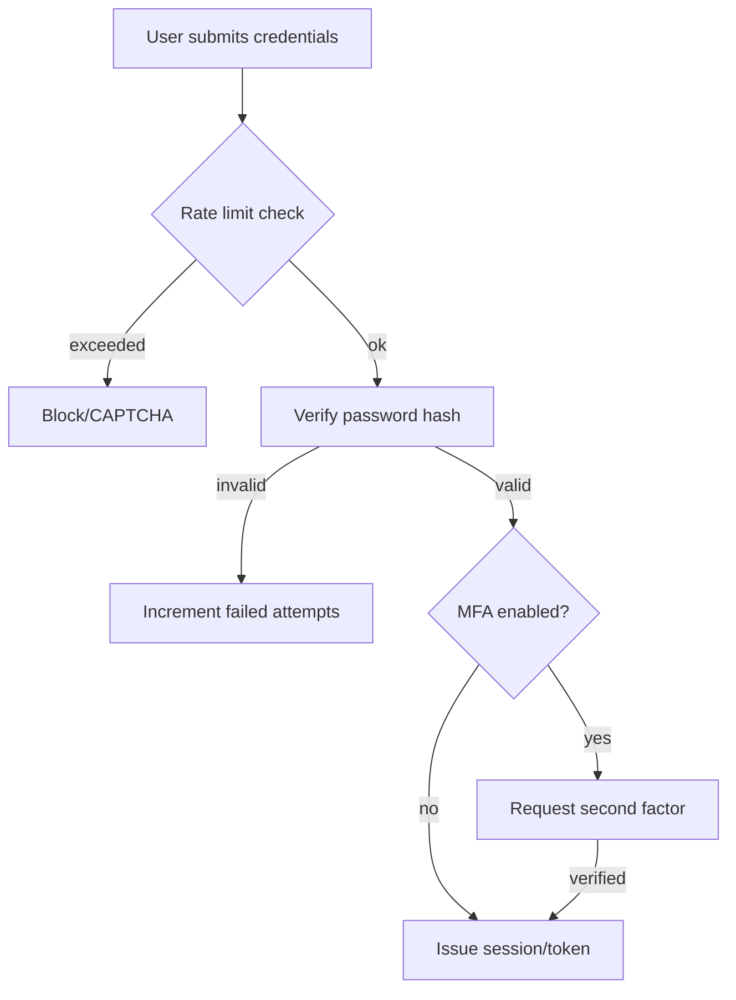

### What is the difference between session-based and token-based authentication?

| দিক | Session-based | Token-based (JWT) |
|---|---|---|
| State storage | Server-side state রাখতে হয় (session store, যেমন Redis) | Server stateless থাকতে পারে — token নিজেই সব প্রয়োজনীয় তথ্য বহন করে |
| Scalability | একাধিক server-এর মধ্যে session sync করতে হয় (sticky session বা shared session store দরকার) | সহজে scale হয় — যেকোনো server token verify করতে পারে (shared secret/public key থাকলেই যথেষ্ট) |
| Revocation | সহজ — server থেকে session delete করলেই সাথে সাথে invalid হয়ে যায় | কঠিন — token নিজে থেকে valid থাকে যতক্ষণ না expire করে, revoke করতে হলে blacklist রাখতে হয় |
| Storage (client side) | সাধারণত cookie (HttpOnly) | সাধারণত `Authorization` header, বা cookie |
| উপযুক্ত ক্ষেত্র | Traditional web application, single backend | Microservices, mobile app, cross-domain API |

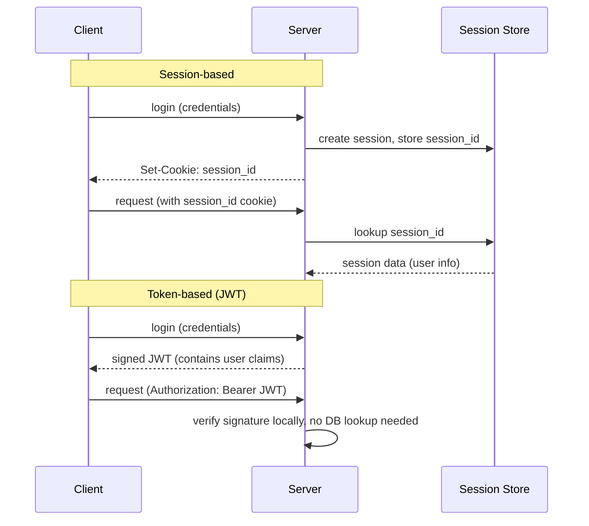

### How do you store passwords securely (bcrypt, Argon2)?

Password কখনো plaintext বা সাধারণ hash (যেমন MD5, SHA-256 সরাসরি) দিয়ে store করা উচিত না — এগুলো দ্রুত brute-force করা যায় (বিশেষ করে GPU দিয়ে)। এর বদলে ব্যবহার করা হয় **slow, memory-hard hashing algorithm**, যেগুলো ইচ্ছাকৃতভাবে ধীর, যাতে attacker-এর brute-force করা ব্যয়বহুল হয়ে যায়।

- **bcrypt**: একটা adaptive hashing algorithm, যেখানে একটা "cost factor/work factor" নির্ধারণ করা যায় (যত বেশি cost factor, তত বেশি সময় লাগে hash করতে) — সময়ের সাথে সাথে hardware দ্রুত হলে cost factor বাড়িয়ে নিরাপত্তা বজায় রাখা যায়। এটা automatically একটা **salt** generate করে প্রতিটা password-এর জন্য, যাতে একই password ভিন্ন hash produce করে (rainbow table attack প্রতিরোধ)।
- **Argon2**: bcrypt-এর চেয়ে নতুন, এবং Password Hashing Competition-এর বিজয়ী algorithm। এটা **memory-hard** — শুধু CPU time না, বরং একটা নির্দিষ্ট পরিমাণ memory ব্যবহার করতে বাধ্য করে, যা GPU/ASIC-based parallel brute-force attack আরও কঠিন করে তোলে। Argon2 এর তিনটা variant আছে — Argon2d (GPU attack resistance বেশি), Argon2i (side-channel attack resistance বেশি), Argon2id (দুটোর মিশ্রণ, সাধারণত সুপারিশকৃত)।

```javascript
// Example: password hashing with bcrypt (Node.js)
const bcrypt = require('bcrypt');

async function hashPassword(plainPassword) {
  const saltRounds = 12; // cost factor
  return bcrypt.hash(plainPassword, saltRounds);
}

async function verifyPassword(plainPassword, storedHash) {
  return bcrypt.compare(plainPassword, storedHash);
}
```

```javascript
// Example: password hashing with Argon2id (Node.js)
const argon2 = require('argon2');

async function hashPassword(plainPassword) {
  return argon2.hash(plainPassword, {
    type: argon2.argon2id,
    memoryCost: 19456, // ~19 MB
    timeCost: 2,
    parallelism: 1,
  });
}
```

এছাড়াও: password policy enforce করা (minimum length, complexity), known-breached password list-এর সাথে check করা (যেমন HaveIBeenPwned API), আর কখনোই নিজের custom hashing algorithm design না করা — সবসময় well-vetted, industry-standard library ব্যবহার করা।

### How do you implement multi-factor authentication (MFA)?

**MFA (Multi-Factor Authentication)** এ password (something you know) ছাড়াও অতিরিক্ত একটা factor যাচাই করা হয় — সাধারণত:

- **Something you have**: একটা device/token — যেমন TOTP app (Google Authenticator), hardware security key (YubiKey), বা SMS code।
- **Something you are**: Biometric — fingerprint, face recognition।

সবচেয়ে common approach হলো **TOTP (Time-based One-Time Password)**:

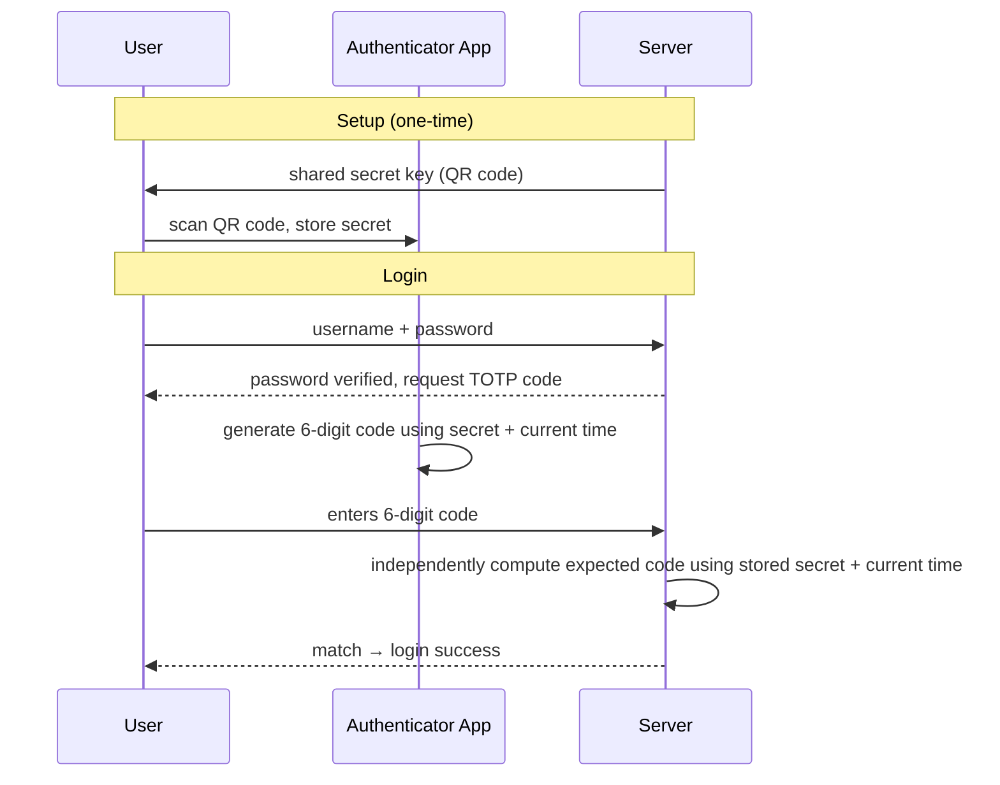

- Setup-এর সময় server ও user-এর app উভয়ই একটা shared secret জানে (QR code scan করার মাধ্যমে)।
- Login-এর সময় app সেই secret আর current timestamp দিয়ে একটা ৬-সংখ্যার code generate করে (সাধারণত ৩০ সেকেন্ডে একবার পরিবর্তন হয়)।
- Server independently একই calculation করে, code মিলে গেলে verify হয় — কোনো network communication লাগে না code generate করতে, তাই offline-ও কাজ করে।

```javascript
// Example: TOTP verification (Node.js, using 'otplib')
const { authenticator } = require('otplib');

// during setup
const secret = authenticator.generateSecret();

// during login
function verifyTOTP(userSecret, userProvidedCode) {
  return authenticator.check(userProvidedCode, userSecret);
}
```

Best practice হিসেবে: MFA-কে optional না করে sensitive action-এ (login, payment, password change) বাধ্যতামূলক করা, backup code দেওয়া (device হারিয়ে গেলে recovery-এর জন্য), এবং SMS-based MFA-কে সবচেয়ে কম নিরাপদ বিবেচনা করা (SIM swapping attack-এর ঝুঁকি থাকে) — TOTP app বা hardware key বেশি নিরাপদ।

---

## 80. What is OAuth 2.0 and how does it work in system design?

**OAuth 2.0** একটা **authorization framework** (authentication framework না) — এটা একটা third-party application-কে user-এর পক্ষ থেকে, user-এর password না জেনেই, নির্দিষ্ট resource access করার অনুমতি দেয়। উদাহরণ: একটা website "Login with Google" button দিয়ে user-এর Google account-এর profile info access করতে চায়, কিন্তু user-এর Google password জানার দরকার নেই।

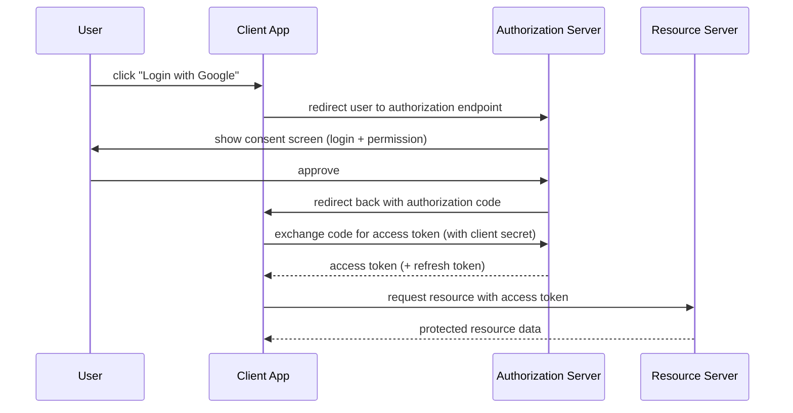

মূল component গুলো:
- **Resource Owner**: User, যার data access করা হচ্ছে।
- **Client**: Application, যেটা resource access করতে চায়।
- **Authorization Server**: যেটা user-কে authenticate করে ও access token issue করে (যেমন Google-এর OAuth server)।
- **Resource Server**: যেখানে actual protected data থাকে (যেমন Google-এর API server)।

### What are the OAuth 2.0 grant types?

- **Authorization Code Grant**: সবচেয়ে common ও secure flow, উপরের diagram-এ যা দেখানো হলো। Web application-এর জন্য উপযুক্ত, যেখানে একটা backend server client secret নিরাপদে রাখতে পারে। PKCE (Proof Key for Code Exchange) যোগ করে mobile/SPA app-এও নিরাপদে ব্যবহার করা যায়।
- **Client Credentials Grant**: Machine-to-machine communication-এর জন্য — কোনো user involve নেই, একটা service নিজের identity দিয়ে সরাসরি token নেয় (যেমন backend service একে অপরকে call করার সময়)।
- **Refresh Token Grant**: Access token expire হয়ে গেলে, নতুন login না করেই refresh token দিয়ে নতুন access token নেওয়া।
- **Implicit Grant** (deprecated): আগে SPA (Single Page Application)-এর জন্য ব্যবহার হতো, সরাসরি URL fragment-এ access token রিটার্ন করত — কিন্তু security ঝুঁকির কারণে এখন এটা deprecated, বদলে Authorization Code + PKCE সুপারিশ করা হয়।
- **Resource Owner Password Credentials Grant** (deprecated/discouraged): User সরাসরি client app-কে username/password দেয়, client সেটা দিয়ে token নেয় — এটা OAuth-এর মূল উদ্দেশ্য (password share না করা)-এর বিপরীত, তাই আধুনিক system-এ এড়িয়ে চলা হয়।

### What is the difference between OAuth 2.0 and OpenID Connect?

| দিক | OAuth 2.0 | OpenID Connect (OIDC) |
|---|---|---|
| মূল উদ্দেশ্য | **Authorization** — resource access করার অনুমতি দেওয়া | **Authentication** — user কে identify/verify করা |
| Output | Access token (যেটা দিয়ে API call করা যায়) | ID Token (JWT, যেটাতে user-এর identity claim থাকে) + access token |
| জানায় কী | "এই client-কে এই resource access করার permission দেওয়া হয়েছে" | "এই user-ই প্রকৃতপক্ষে সেই person, যে সে দাবি করছে" |
| ব্যবহারের উদাহরণ | Third-party app-কে Google Drive file access দেওয়া | "Sign in with Google" — user-কে login করানো |

সহজভাবে: **OpenID Connect (OIDC) হলো OAuth 2.0-এর উপর তৈরি একটা identity layer**। OAuth 2.0 নিজে থেকে বলে না "কে login করেছে" — এটা শুধু বলে "এই token দিয়ে এই resource access করা যাবে"। OIDC এর সাথে একটা standardized **ID Token** যোগ করে, যেটাতে user-এর identity সম্পর্কে verified তথ্য (name, email, sub/user ID) থাকে। এই কারণেই "Login with Google/Facebook" এর মতো authentication feature বাস্তবে OIDC ব্যবহার করে, শুধু plain OAuth 2.0 না।

### How do you implement token refresh and revocation?

**Token refresh:**
- Access token সাধারণত short-lived রাখা হয় (যেমন ১৫ মিনিট - ১ ঘণ্টা), যাতে leak হলেও ক্ষতি সীমিত থাকে।
- একটা longer-lived **refresh token** আলাদাভাবে দেওয়া হয় (যেমন কয়েক সপ্তাহ/মাস), যেটা শুধুমাত্র নতুন access token নেওয়ার জন্য ব্যবহার হয়, সরাসরি resource access-এর জন্য না।
- Access token expire হলে, client refresh token দিয়ে authorization server-কে call করে নতুন access token নেয় — user-কে আবার login করতে হয় না।

```javascript
// Example: refreshing an access token
async function refreshAccessToken(refreshToken) {
  const response = await fetch('https://auth.example.com/oauth/token', {
    method: 'POST',
    headers: { 'Content-Type': 'application/x-www-form-urlencoded' },
    body: new URLSearchParams({
      grant_type: 'refresh_token',
      refresh_token: refreshToken,
      client_id: CLIENT_ID,
      client_secret: CLIENT_SECRET,
    }),
  });
  return response.json(); // { access_token, refresh_token (rotated), expires_in }
}
```

**Token revocation:**
- একটা **revocation endpoint** রাখা হয়, যেখানে client/user explicitly একটা token invalidate করার request পাঠাতে পারে (যেমন logout করলে, বা device চুরি হলে)।
- Server-side একটা **revoked token list/blacklist** (সাধারণত Redis-এ, দ্রুত lookup-এর জন্য) রাখা হয়, revoke করা token সেখানে যোগ করা হয়, token verify করার সময় এই list check করা হয়।
- **Refresh token rotation**: প্রতিবার refresh token ব্যবহার হলে একটা নতুন refresh token issue করা হয়, পুরনোটা invalidate করে দেওয়া হয় — যদি কোনো পুরনো (আগে ব্যবহৃত) refresh token আবার ব্যবহারের চেষ্টা হয়, সেটা token theft-এর সংকেত হিসেবে ধরে নিয়ে পুরো token family revoke করে দেওয়া হয়।

---

## 81. How do you secure inter-service communication in microservices?

Microservices-এ service গুলো একে অপরের সাথে network-এর মধ্য দিয়ে communicate করে, তাই secure করার জন্য মূলত দরকার:

- **Encryption in transit**: সব service-to-service call TLS দিয়ে encrypt করা, যাতে network-এ কেউ traffic intercept করলেও data পড়তে না পারে।
- **Mutual authentication**: শুধু client server-কে verify করবে না, server-ও client-কে verify করবে (mTLS) — যাতে শুধু legitimate, trusted service-ই একে অপরের সাথে communicate করতে পারে।
- **Authorization**: শুধু authenticated হলেই যথেষ্ট না, প্রতিটা service-কে নির্দিষ্ট action করার জন্য নির্দিষ্ট permission থাকতে হবে (least privilege principle)।
- **Network segmentation**: Service গুলো একটা private network/VPC-তে রাখা, শুধু প্রয়োজনীয় port/service publicly exposed রাখা।

### What is mutual TLS (mTLS) and how does it work?

সাধারণ TLS-এ শুধু client, server-এর certificate verify করে (নিশ্চিত করে সে legitimate server-এর সাথে কথা বলছে)। **mTLS (Mutual TLS)** এ দুইপক্ষই একে অপরের certificate verify করে — server-ও client-এর identity নিশ্চিত করে।

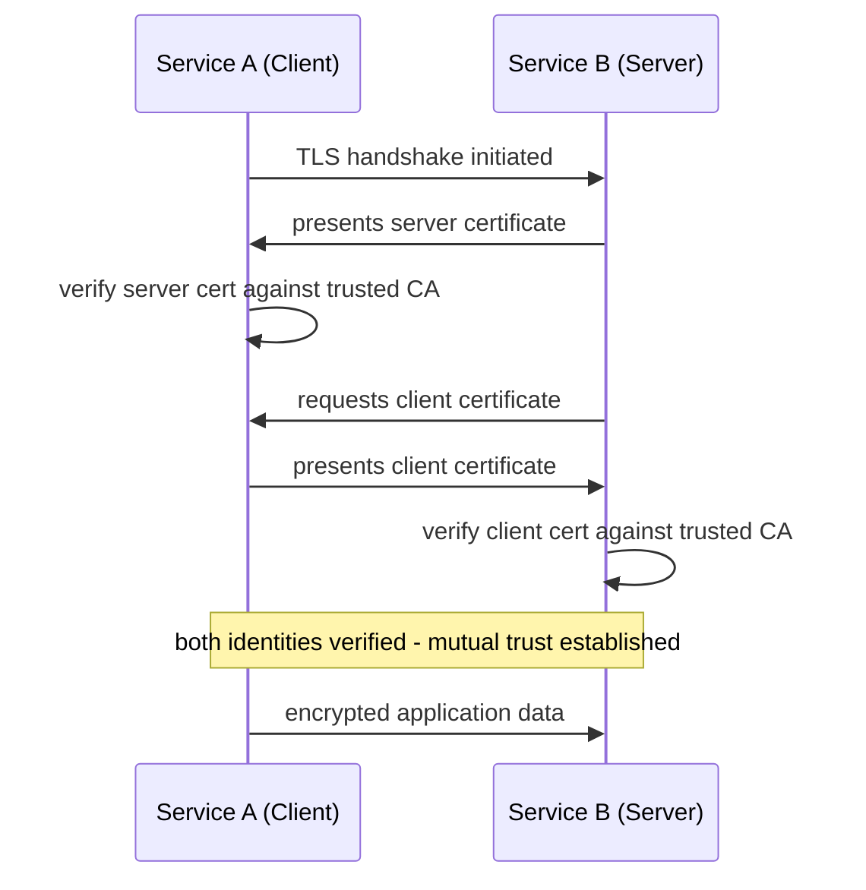

- প্রতিটা service-এর একটা নিজস্ব certificate থাকে, যেটা একটা internal/trusted Certificate Authority (CA) দ্বারা issue করা।
- Connection establish করার সময়, উভয় পক্ষ একে অপরের certificate exchange করে, এবং trusted CA-এর against verify করে।
- Verification সফল হলেই encrypted connection তৈরি হয় — একটা malicious/unauthorized service (যার valid certificate নেই) কোনোভাবেই connect করতে পারবে না, এমনকি network-এর ভিতরেই থাকলেও (zero-trust model)।

### How does a service mesh like Istio enforce mTLS?

Istio-এর মতো service mesh, mTLS-কে **transparent ও automatic** করে দেয়, application code-এ কোনো পরিবর্তন ছাড়াই:

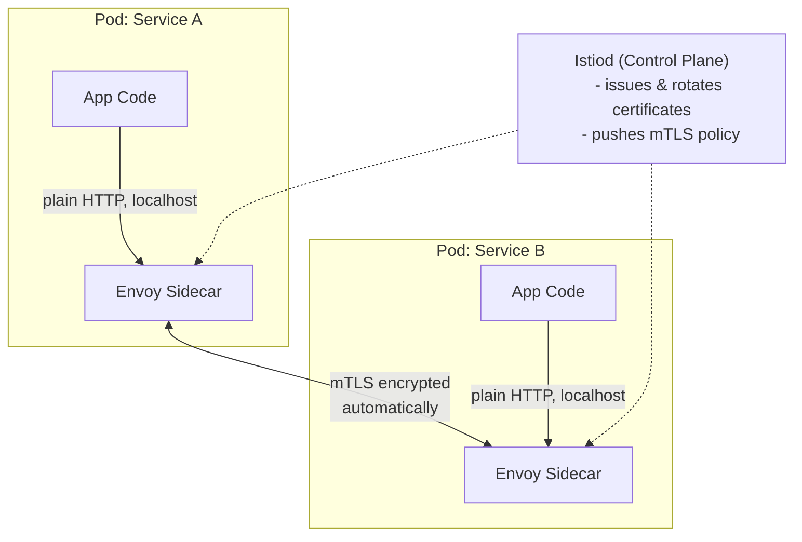

- Istio-এর control plane (`istiod`) স্বয়ংক্রিয়ভাবে প্রতিটা service-এর জন্য একটা short-lived certificate তৈরি করে ও নিয়মিত rotate করে — developer-কে manually certificate manage করতে হয় না।
- Application code সরাসরি plain HTTP-তেই কথা বলে (localhost-এ তার নিজস্ব sidecar proxy-র সাথে) — actual encrypted mTLS connection sidecar proxy গুলোর মধ্যেই ঘটে, transparently।
- একটা **PeerAuthentication policy** দিয়ে mTLS mode নির্ধারণ করা যায়:
  - `STRICT`: শুধু mTLS traffic accept করবে, plain text traffic reject করবে।
  - `PERMISSIVE`: mTLS ও plain text দুটোই accept করবে (migration period-এ ব্যবহার হয়, যখন সব service এখনো mesh-এ যোগ হয়নি)।

```yaml
# Example: Istio PeerAuthentication enforcing strict mTLS
apiVersion: security.istio.io/v1beta1
kind: PeerAuthentication
metadata:
  name: default
  namespace: production
spec:
  mtls:
    mode: STRICT
```

### What is a service account and how is it used for authorization?

**Service account** হলো একটা non-human identity, যেটা একটা service/application-কে assign করা হয় (একটা human user account-এর মতোই, কিন্তু machine-এর জন্য)। এটা service-কে অন্যান্য service/resource-এর সাথে authenticate ও authorize হতে সাহায্য করে।

- প্রতিটা microservice-কে একটা নির্দিষ্ট service account দেওয়া হয় (যেমন Kubernetes-এ `ServiceAccount` object)।
- Service account-এর সাথে RBAC (Role-Based Access Control) policy attach করা হয় — নির্দিষ্ট করে দেওয়া হয় সেই service কোন resource-এ কী action করতে পারবে।
- mTLS-এর সাথে combine করে, একটা service-এর certificate-এ তার service account identity embed করা থাকে (যেমন Istio SPIFFE identity format: `spiffe://cluster.local/ns/production/sa/order-service`), যেটা দিয়ে authorization decision নেওয়া যায় — "শুধু `order-service`-কেই `payment-service` call করতে দাও, অন্য কোনো service-কে না"।

```yaml
# Example: Kubernetes ServiceAccount with RBAC
apiVersion: v1
kind: ServiceAccount
metadata:
  name: order-service-sa
  namespace: production
---
apiVersion: rbac.authorization.k8s.io/v1
kind: RoleBinding
metadata:
  name: order-service-binding
subjects:
  - kind: ServiceAccount
    name: order-service-sa
roleRef:
  kind: Role
  name: order-service-role # e.g. read access to inventory config
  apiGroup: rbac.authorization.k8s.io
```

এভাবে least-privilege principle মেনে প্রতিটা service শুধু তার প্রয়োজনীয় resource-ই access করতে পারে, বাকি সবকিছু default-এ deny থাকে।

---

## 82. How do you design a system to protect against DDoS attacks?

**DDoS (Distributed Denial of Service)** attack-এ বহু সংখ্যক compromised machine (botnet) থেকে একসাথে বিশাল পরিমাণ traffic পাঠিয়ে একটা system-কে overwhelm করে দেওয়া হয়, যাতে legitimate user-রা service ব্যবহার করতে না পারে। Protection design করার সময় সাধারণত multiple layer ব্যবহার করা হয়:

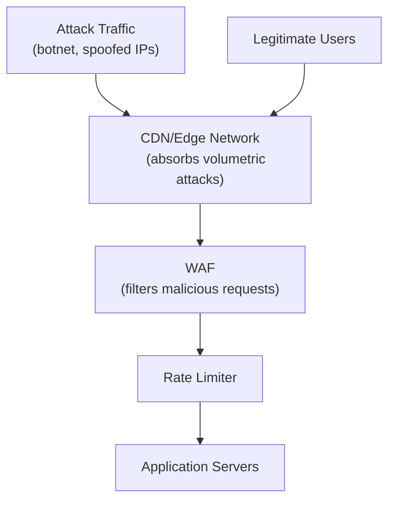

- **Traffic filtering at the edge**: CDN/edge network-এ যতটা সম্ভব malicious traffic origin server-এ পৌঁছানোর আগেই filter করা।
- **Rate limiting**: প্রতিটা client/IP-এর request rate সীমিত করা।
- **Auto-scaling**: হঠাৎ legitimate traffic spike হলে system যাতে scale করে সামলাতে পারে, তার জন্য elastic infrastructure রাখা।
- **Anomaly detection**: Normal traffic pattern-এর সাথে তুলনা করে abnormal spike/pattern automatically detect করা ও mitigate করা।

### What is rate limiting and how does it mitigate DDoS?

Rate limiting হলো একটা নির্দিষ্ট সময়ের মধ্যে একজন client কতগুলো request পাঠাতে পারবে তার সীমা নির্ধারণ করা (বিস্তারিত Messaging/API chapter-এ আলোচিত হয়েছে)। DDoS mitigation-এ এটা যেভাবে সাহায্য করে:

- **Application-layer (L7) DDoS** — যেমন একই endpoint-এ অসংখ্য HTTP request পাঠানো — rate limiting দিয়ে সরাসরি প্রতিহত করা যায়, একটা নির্দিষ্ট IP/API key threshold পার হলেই block/throttle করে দেওয়া হয়।
- **Layered rate limiting**: শুধু single IP-ভিত্তিক না, বরং user account, API key, geographic region — বিভিন্ন dimension-এ rate limit বসানো, কারণ attacker অনেক IP (botnet) ব্যবহার করতে পারে।
- তবে rate limiting একা volumetric (network layer, L3/L4) DDoS আটকাতে পারে না — এত বিশাল পরিমাণ raw traffic আসতে পারে যে origin server-এ পৌঁছানোর আগেই bandwidth/network capacity শেষ হয়ে যায় — এজন্য দরকার CDN-এর মতো edge-level protection।

### How do CDNs absorb volumetric DDoS attacks?

**CDN (Content Delivery Network)** ও **edge network** (যেমন Cloudflare, AWS Shield, Akamai) বিশাল, globally distributed infrastructure নিয়ে volumetric attack absorb করে:

- **Massive distributed capacity**: CDN-এর নিজস্ব network capacity origin server-এর তুলনায় বহুগুণ বেশি (terabit-scale), তাই বড় বড় volumetric attack (traffic flood) সহজেই absorb করতে পারে, origin server পর্যন্ত পৌঁছাতেই দেয় না।
- **Anycast routing**: একই IP address multiple geographic location থেকে announce করা হয়, ফলে attack traffic automatically সবচেয়ে কাছের/available data center-এ ছড়িয়ে যায় (naturally load distributed হয়), একটা single point-এ concentrate হয় না।
- **Traffic scrubbing**: CDN edge-এ ট্রাফিক analyze করে malicious pattern (যেমন SYN flood, known botnet signature) automatically drop করে দেয়, শুধু legitimate-looking traffic origin-এ forward করে।
- **Origin cloaking**: Origin server-এর প্রকৃত IP address hide রাখা হয় (শুধু CDN-এর IP publicly known থাকে), যাতে attacker সরাসরি origin-কে target করতে না পারে।

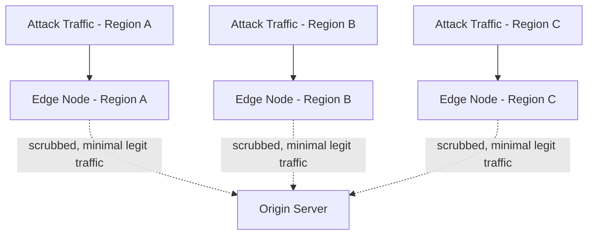

### What is a WAF (Web Application Firewall) and how does it help?

**WAF (Web Application Firewall)** একটা security layer, যেটা HTTP traffic inspect করে চেনা attack pattern এর ভিত্তিতে malicious request block করে — এটা network firewall-এর মতো IP/port ভিত্তিতে না, বরং application-layer content (URL, header, body) দেখে decision নেয়।

WAF যেভাবে সাহায্য করে:

- **Common web attack প্রতিরোধ**: SQL injection, cross-site scripting (XSS), command injection-এর মতো known attack pattern signature-based detection দিয়ে ব্লক করে।
- **Custom rule/policy**: নির্দিষ্ট application-এর জন্য custom rule বসানো যায় (যেমন "এই endpoint-এ শুধু নির্দিষ্ট country থেকে request allow করো")।
- **Bot detection**: Legitimate browser-এর মতো আচরণ না করা (headless browser, script-based) traffic চিহ্নিত করে block/challenge (CAPTCHA) দেওয়া, যা DDoS ও credential stuffing attack এর ক্ষেত্রেও গুরুত্বপূর্ণ।
- **Rate-based rule**: WAF-এর মধ্যেই rate limiting rule embed করা যায় (যেমন AWS WAF-এ rate-based rule), যাতে নির্দিষ্ট threshold পার হলে automatically সেই IP/client block হয়ে যায়।

```
Example WAF rule (conceptual):
IF request.body CONTAINS "' OR '1'='1"  → BLOCK (SQL injection pattern)
IF request.header["User-Agent"] IS empty AND request.rate > 100/min → CHALLENGE (bot suspicion)
```

WAF সাধারণত CDN/edge layer-এর সাথে integrate করা থাকে (Cloudflare WAF, AWS WAF + CloudFront), যাতে malicious request origin server-এ পৌঁছানোর আগেই filter হয়ে যায়।

---

## 83. What is encryption at rest vs encryption in transit?

| দিক | Encryption at Rest | Encryption in Transit |
|---|---|---|
| কী protect করে | Storage-এ থাকা data (disk, database, backup) | Network-এর মধ্য দিয়ে চলাচলরত data |
| Technology | AES-256, disk/database-level encryption | TLS/SSL |
| Threat model | কেউ physical disk/backup চুরি করলে, বা unauthorized database access পেলে | কেউ network traffic intercept/eavesdrop করলে (man-in-the-middle) |
| উদাহরণ | Encrypted database volume, encrypted S3 bucket | HTTPS, mTLS between services |

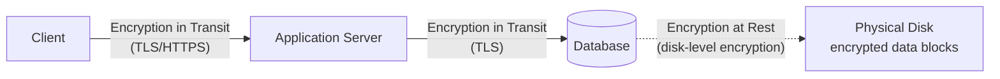

দুটোই প্রয়োজনীয়, কারণ এরা আলাদা আলাদা threat address করে — শুধু encryption in transit থাকলে, কেউ physical server/disk access পেলে data সরাসরি পড়ে ফেলতে পারবে; শুধু encryption at rest থাকলে, network eavesdropping-এর মাধ্যমে data leak হতে পারে।

### How do you implement encryption at rest in a cloud database?

- **Transparent Data Encryption (TDE)**: বেশিরভাগ cloud database (AWS RDS, Azure SQL) built-in TDE option দেয়, যেটা enable করলে database automatically সব data disk-এ লেখার আগে encrypt করে, এবং পড়ার সময় transparently decrypt করে — application code-এ কোনো পরিবর্তন লাগে না।
- **Storage-level encryption**: Cloud provider-এর underlying storage service (যেমন EBS volume) নিজেই encrypted থাকে, একটা KMS key ব্যবহার করে।
- **Column-level/field-level encryption**: বিশেষভাবে sensitive field (যেমন SSN, credit card number) এর জন্য application-level এ আলাদাভাবে encrypt করা, যাতে database admin-ও raw value দেখতে না পারে।
- **Backup encryption**: শুধু live database না, backup/snapshot-ও encrypt রাখা নিশ্চিত করা।

```javascript
// Example: enabling encryption when creating an AWS RDS instance (AWS CDK)
const dbInstance = new rds.DatabaseInstance(this, 'MyDatabase', {
  engine: rds.DatabaseInstanceEngine.postgres({ version: rds.PostgresEngineVersion.VER_15 }),
  storageEncrypted: true,
  storageEncryptionKey: kmsKey, // custom KMS key, or default AWS managed key
});
```

### What is envelope encryption?

**Envelope encryption** একটা technique, যেখানে actual data একটা **data encryption key (DEK)** দিয়ে encrypt করা হয়, আর সেই DEK-টাকে আবার একটা **key encryption key (KEK)** (যেটা সাধারণত একটা KMS-এ securely রাখা থাকে) দিয়ে encrypt করা হয়। এই encrypted DEK-টাকেই actual encrypted data-এর সাথে store করা হয়।

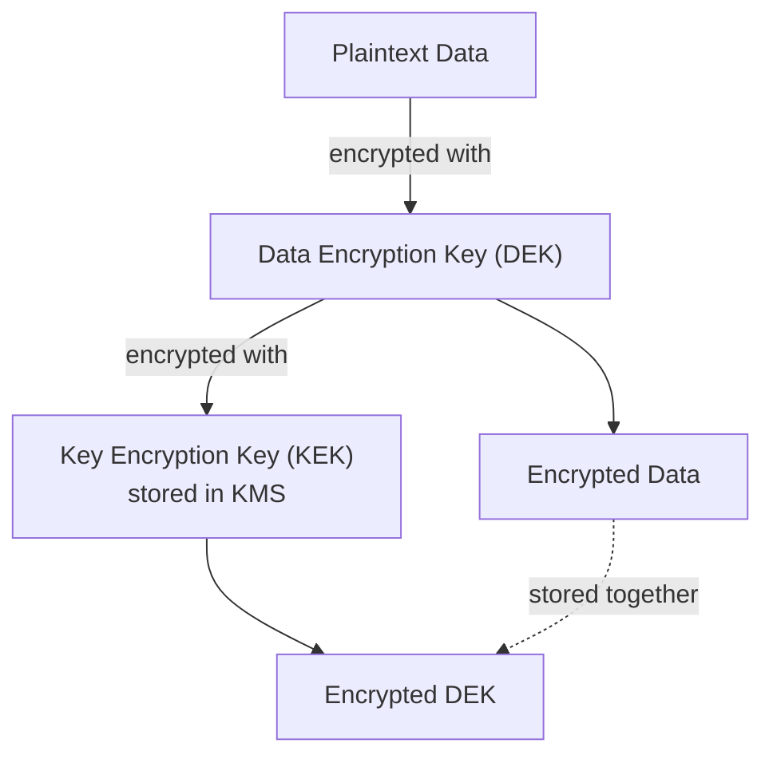

কেন এভাবে করা হয়:
- **Performance**: বড় data সরাসরি KMS দিয়ে encrypt/decrypt করা ধীর ও ব্যয়বহুল (network call লাগে প্রতিবার) — DEK দিয়ে local-এ দ্রুত data encrypt করা যায়, শুধু ছোট DEK-টাই KMS-এর মাধ্যমে protect করা হয়।
- **Key rotation সহজ**: KEK rotate করলে শুধু encrypted DEK আবার re-encrypt করলেই চলে, পুরো dataset আবার re-encrypt করার দরকার হয় না।
- **Centralized key control**: KEK কখনো KMS-এর বাইরে plaintext আকারে exposed হয় না, সব key management centrally, audit-able ভাবে হয়।

```javascript
// Simplified envelope encryption flow using AWS KMS
async function encryptData(plaintext) {
  // 1. Ask KMS to generate a new data key
  const { Plaintext: dek, CiphertextBlob: encryptedDek } = await kms.generateDataKey({
    KeyId: 'alias/my-kek',
    KeySpec: 'AES_256',
  }).promise();

  // 2. Use the plaintext DEK to encrypt the actual data locally (fast)
  const encryptedData = localAesEncrypt(plaintext, dek);

  // 3. Store the encrypted data along with the encrypted DEK (not the plaintext DEK)
  return { encryptedData, encryptedDek };
}
```

### What key management strategies exist (KMS, HSM)?

- **KMS (Key Management Service)**: একটা cloud-managed service (AWS KMS, Google Cloud KMS, Azure Key Vault), যেটা encryption key তৈরি, store, rotate, ও access control করার সুবিধা দেয়। সব key-related operation-এর audit log রাখা হয়, IAM policy দিয়ে কে কোন key ব্যবহার করতে পারবে তা নিয়ন্ত্রণ করা যায়।
- **HSM (Hardware Security Module)**: একটা dedicated, tamper-resistant hardware device, যেখানে encryption key generate ও store করা হয় — key কখনো HSM-এর বাইরে plaintext আকারে বের হয় না, সব cryptographic operation HSM-এর ভিতরেই ঘটে। এটা সবচেয়ে উচ্চ-নিরাপত্তার প্রয়োজনে ব্যবহার হয় (যেমন payment processing, banking-এর regulatory compliance)।
- **Automatic key rotation**: KMS/HSM উভয়ই periodically automatically key rotate করার সুবিধা দেয় (যেমন প্রতি বছর), পুরনো key দিয়ে encrypt করা data এখনো decrypt করা যায় (versioned key), কিন্তু নতুন data নতুন key দিয়ে encrypt হয়।
- **Multi-region key replication**: Disaster recovery-এর জন্য key একাধিক region-এ replicate রাখা, কিন্তু access control ও audit consistency বজায় রেখে।

সাধারণ guideline: বেশিরভাগ application-এর জন্য cloud KMS যথেষ্ট (cost-effective, managed) — HSM সাধারণত regulatory requirement (PCI-DSS, FIPS 140-2 Level 3) থাকলেই বিবেচনা করা হয়, কারণ এটা তুলনামূলক ব্যয়বহুল ও operationally জটিল।

---

## 84. How do you handle secrets management in a distributed system?

**Secrets** বলতে বোঝায় sensitive credential — database password, API key, encryption key, certificate — যেগুলো code বা config-এ hardcode করা উচিত না। Distributed system-এ secrets management-এর মূল challenge হলো: অনেকগুলো service, অনেকগুলো environment (dev/staging/prod) জুড়ে নিরাপদে, centrally, ও access-controlled ভাবে secret distribute ও manage করা।

মূল principle:
- **Centralized storage**: সব secret একটা dedicated, secure vault-এ রাখা, code repository/config file-এ না।
- **Access control**: প্রতিটা service শুধু তার প্রয়োজনীয় secret-ই access করতে পারবে (least privilege)।
- **Audit logging**: কে, কখন, কোন secret access করেছে তার সম্পূর্ণ log রাখা।
- **Rotation**: Secret নিয়মিত পরিবর্তন করা, যাতে leak হলেও ক্ষতির সময়সীমা সীমিত থাকে।

### What is HashiCorp Vault and how does it manage secrets?

**HashiCorp Vault** একটা widely-used open-source secrets management tool, যেটা secret-কে centrally, encrypted অবস্থায় store করে এবং fine-grained access control সহ distribute করে।

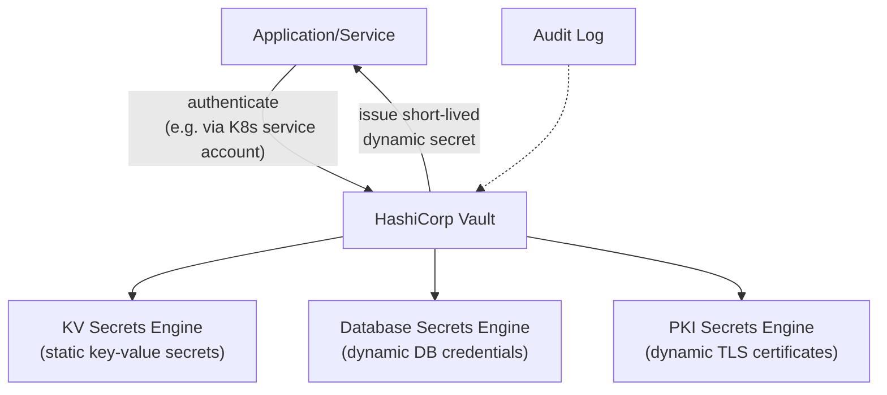

মূল feature:
- **Static secrets**: সাধারণ key-value secret store করা (যেমন একটা third-party API key), যেটা encrypted থাকে ও access policy দিয়ে protected।
- **Dynamic secrets**: এটা Vault-এর একটা powerful feature — Vault নিজে থেকে, on-demand, short-lived credential তৈরি করে দেয় (যেমন একটা database-এর জন্য একটা temporary username/password, যেটা কয়েক ঘণ্টা পর automatically expire হয়ে যায়)। এতে permanent, long-lived credential leak হওয়ার ঝুঁকি অনেক কমে যায়।
- **Authentication methods**: বিভিন্ন উপায়ে Vault-এ authenticate করা যায় — Kubernetes service account, AWS IAM role, LDAP, ইত্যাদি — যাতে service নিজের existing identity দিয়েই Vault access করতে পারে, আলাদা credential manage করতে না হয়।
- **Encryption as a service**: Vault-কে শুধু secret store হিসেবে না, encryption/decryption operation করার জন্যও ব্যবহার করা যায় (application কে নিজে key manage করতে হয় না — "Transit secrets engine")।
- **Audit logging**: প্রতিটা secret access request detail-সহ log হয় — compliance ও incident investigation-এর জন্য গুরুত্বপূর্ণ।

```javascript
// Example: fetching a dynamic database credential from Vault
const vault = require('node-vault')({ endpoint: 'https://vault.internal:8200' });

async function getDbCredentials() {
  const result = await vault.read('database/creds/order-service-role');
  return {
    username: result.data.username,
    password: result.data.password,
    leaseDuration: result.lease_duration, // credential auto-expires after this
  };
}
```

### What are the risks of storing secrets in environment variables?

Environment variable-এ secret রাখা common practice হলেও এর বেশ কিছু ঝুঁকি আছে:

- **Process introspection**: একই machine-এ (বিশেষ করে shared host/container) অন্য process বা admin তুলনামূলক সহজে চলমান process-এর environment variable দেখে ফেলতে পারে (যেমন `/proc/<pid>/environ` Linux-এ)।
- **Accidental logging**: Application crash হলে, error tracking tool (Sentry ইত্যাদি) অনেক সময় পুরো environment dump করে ফেলে, ফলে secret log/monitoring system-এ leak হয়ে যেতে পারে।
- **Child process inheritance**: একটা process spawn করা child process automatically parent-এর সব environment variable inherit করে, যা অনিচ্ছাকৃতভাবে third-party library/tool-এর কাছে secret expose করে দিতে পারে।
- **CI/CD pipeline exposure**: Build log-এ environment variable ভুলবশত print হয়ে গেলে, সেটা CI/CD dashboard-এ স্থায়ীভাবে visible থেকে যেতে পারে।
- **No built-in rotation/audit**: Environment variable নিজে থেকে rotation বা access audit trail সাপোর্ট করে না — secret কে manually redeploy করে পরিবর্তন করতে হয়, আর কে কখন access করেছে তার কোনো log থাকে না।
- **Version control accident**: `.env` file ভুলবশত git repository-তে commit হয়ে গেলে, secret permanently version history-তে থেকে যায় (যদিও পরে delete করা হয়)।

এই কারণে production system-এ dedicated secrets manager (Vault, AWS Secrets Manager) ব্যবহার করা বেশি নিরাপদ — environment variable ব্যবহার করলেও, সেটা vault থেকে runtime-এ inject করা উচিত (একটা init container বা sidecar দিয়ে), directly config file/CI pipeline-এ hardcode না করে।

### How do you rotate secrets without downtime?

Secret rotate করার সময় মূল challenge হলো: rotation-এর মুহূর্তে যদি old secret সাথে সাথে invalid হয়ে যায়, কিন্তু কিছু service instance এখনো পুরনো secret ব্যবহার করছে, তাহলে সেগুলো fail করবে। এটা এড়াতে সাধারণত ব্যবহার করা হয় **dual-secret/grace-period** approach:

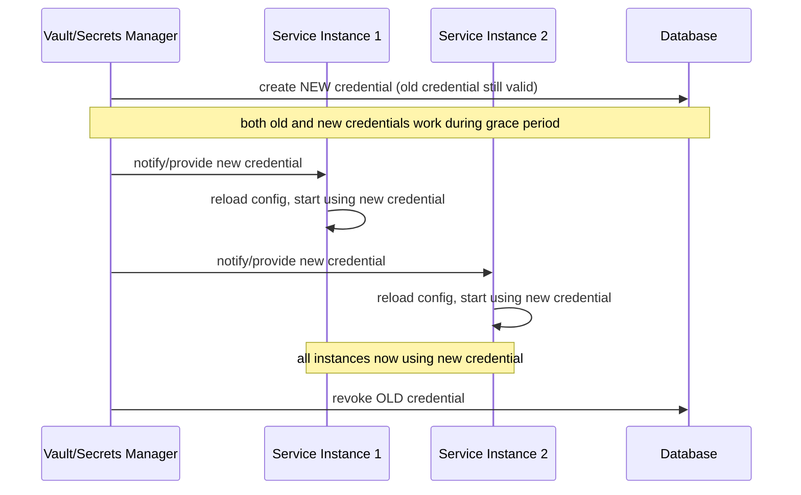

- **Overlap period রাখা**: নতুন secret তৈরি করার সময় পুরনো secret সাথে সাথে invalid না করে কিছু সময়ের জন্য (grace period) দুটোই active রাখা, যাতে সব service instance ধীরে ধীরে নতুন secret-এ migrate করার সময় পায়।
- **Rolling restart/reload**: সব service instance-কে একসাথে restart না করে, একে একে (rolling fashion) restart/config-reload করা, যাতে সবসময় কিছু instance available থাকে (zero-downtime deployment-এর মতোই)।
- **Dynamic secrets ব্যবহার করা**: Vault-এর dynamic secrets feature ব্যবহার করলে, প্রতিটা service instance আলাদা, independent credential পায় (shared secret না), তাই একটা credential rotate/revoke করলে অন্য instance প্রভাবিত হয় না — এটা zero-downtime rotation অনেক সহজ করে দেয়।
- **Application-level graceful reload**: Application এমনভাবে design করা, যাতে config/secret change হলে পুরো process restart না করেই (SIGHUP handler বা polling mechanism দিয়ে) নতুন secret pick up করতে পারে।
- **Automated rotation pipeline**: Manual rotation না করে, একটা automated scheduled job/pipeline রাখা যেটা নিয়মিত secret rotate করে, নতুন secret সব প্রয়োজনীয় জায়গায় propagate করে, এবং পুরনোটা নির্দিষ্ট সময় পর revoke করে — human error ও downtime দুটোই কমায়।
