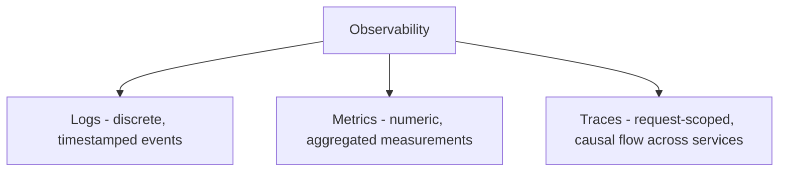
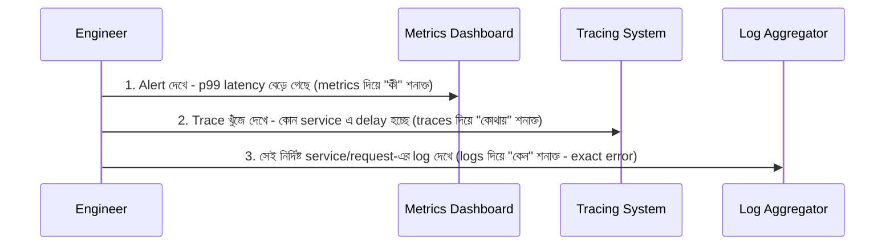
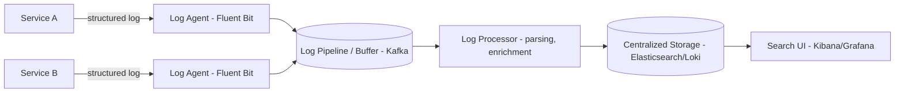
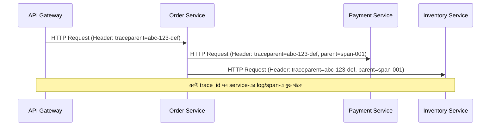
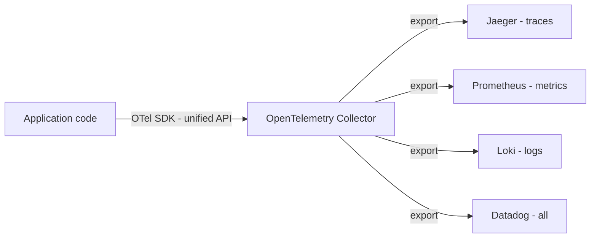
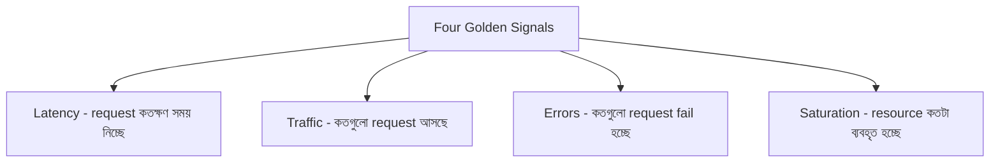
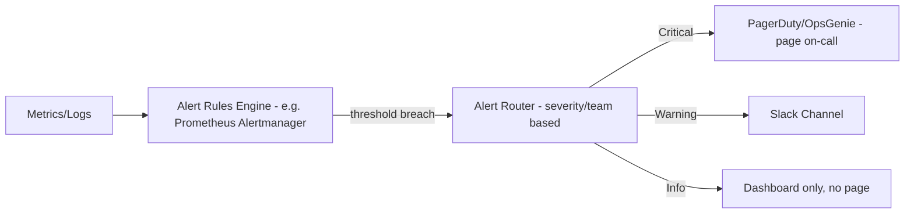
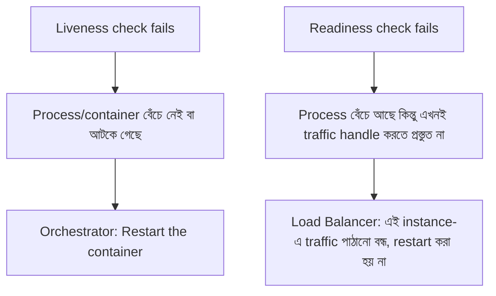

## 85. What are the three pillars of observability?

**Observability** মানে হলো একটা system-এর বাইরে থেকে (external output দেখে) তার internal অবস্থা কতটুকু বোঝা যায়, বিশেষ করে যখন কোনো unexpected/নতুন সমস্যা হয় যেটার জন্য আগে থেকে কোনো dashboard/alert তৈরি করা ছিল না। এর মূল তিনটা "pillar" (স্তম্ভ) হলো — **Logs, Metrics, এবং Traces**।



এই তিনটাই একসাথে মিলে একটা distributed system-এর সম্পূর্ণ চিত্র তৈরি করে — metrics দিয়ে বোঝা যায় **কী** হচ্ছে (aggregate level), logs দিয়ে বোঝা যায় **কেন** হচ্ছে (detail), আর traces দিয়ে বোঝা যায় **কোথায়** (কোন service-এ) সমস্যা হচ্ছে।

### What is the difference between logs, metrics, and traces?

| বিষয় | Logs | Metrics | Traces |
|---|---|---|---|
| সংজ্ঞা | একটা নির্দিষ্ট সময়ে ঘটা event-এর timestamped, text/structured record | সময়ের সাথে aggregate করা numeric measurement | একটা single request-এর পুরো life-cycle, একাধিক service জুড়ে causally সংযুক্ত events (spans) |
| Granularity | সবচেয়ে detailed — প্রতিটা individual event | সবচেয়ে সংক্ষিপ্ত — aggregate সংখ্যা (count, average, percentile) | মাঝামাঝি — একটা নির্দিষ্ট request-এর প্রতিটা ধাপের timing এবং metadata |
| Storage cost | সবচেয়ে বেশি (raw text, high volume) | সবচেয়ে কম (numeric time-series, compact) | মাঝামাঝি (sampling প্রয়োজন হয় বড় স্কেলে) |
| ব্যবহার | "ঠিক কী ঘটেছিল" জানতে, debugging-এ deep dive করতে | Dashboard, trend দেখতে, alert trigger করতে | একটা request কোথায় সময় নিচ্ছে/fail করছে তা bottleneck ধরতে |
| উদাহরণ | `"2026-08-28T10:00:00Z ERROR OrderService: payment failed for order_id=123, reason=timeout"` | `http_request_duration_seconds{service="order"} = 0.45` | Order Service (50ms) → Payment Service (300ms) → Inventory Service (20ms) |

### How do logs, metrics, and traces complement each other?

বাস্তব incident troubleshooting-এ সাধারণত এই তিনটা একসাথে ব্যবহার করে একটা সমস্যা খুঁজে বের করা হয় — একটা typical workflow:



- **Metrics প্রথমে alert দেয়** — "কিছু একটা সমস্যা হয়েছে" (যেমন error rate বেড়ে যাওয়া, latency spike)।
- **Traces দেখায় সমস্যাটা কোথায়** — কোন নির্দিষ্ট service/component request-এর সময় নষ্ট করছে বা fail করছে।
- **Logs দেয় সবচেয়ে বিস্তারিত প্রসঙ্গ (context)** — সেই নির্দিষ্ট service-এর সেই মুহূর্তের exact error message, stack trace, input parameter ইত্যাদি, যা root cause খুঁজে বের করতে সাহায্য করে।

একা একটা pillar দিয়ে পুরো ছবি পাওয়া যায় না — শুধু metrics দিয়ে জানা যায় সমস্যা আছে কিন্তু কেন তা জানা যায় না, শুধু logs দিয়ে অনুসন্ধান শুরু করলে (কোনো নির্দেশনা ছাড়াই) কোটি কোটি log entry-র মধ্যে খুঁজে বের করা কঠিন। তিনটা একসাথে ব্যবহার করলেই দ্রুত, নির্ভুলভাবে root cause পাওয়া যায়।

### What tools are used for each pillar?

| Pillar | জনপ্রিয় Tools |
|---|---|
| **Logs** | ELK Stack (Elasticsearch, Logstash, Kibana), Grafana Loki, Splunk, AWS CloudWatch Logs, Fluentd/Fluent Bit (collection) |
| **Metrics** | Prometheus, Grafana (visualization), Datadog, InfluxDB, AWS CloudWatch Metrics, StatsD |
| **Traces** | Jaeger, Zipkin, AWS X-Ray, Grafana Tempo, Honeycomb |
| **সব-in-one/unified** | Datadog, New Relic, Honeycomb, Grafana Stack (Loki + Prometheus + Tempo একসাথে) — এগুলো তিনটা pillar-কেই একটা platform-এ integrate করে |

আজকাল **OpenTelemetry (OTel)** একটা vendor-neutral standard হয়ে উঠেছে যেটা দিয়ে logs, metrics, এবং traces — তিনটাই একটা common instrumentation library দিয়ে collect করে যেকোনো backend (Prometheus, Jaeger, Datadog ইত্যাদি) এ পাঠানো যায় (Q87-তে বিস্তারিত)।

---

## 86. How do you design a logging system for a distributed application?

একটা distributed application-এ শতশত/হাজার হাজার service instance থেকে log আসে, তাই একটা centralized logging system design করার সময় মূল বিবেচ্য বিষয়গুলো হলো:



- প্রতিটা service log **local disk/stdout**-এ লেখে, একটা লোকাল **log agent/shipper** (Fluent Bit, Filebeat) সেটা tail করে একটা centralized pipeline-এ পাঠায়।
- একটা **buffer/queue (Kafka)** ব্যবহার করা হয় যাতে log storage সাময়িকভাবে unavailable/slow হলেও log হারিয়ে না যায়, এবং spike traffic absorb করা যায়।
- Centralized storage (Elasticsearch, Loki) এ index করা হয়, যাতে দ্রুত search/filter করা যায়, এবং একটা UI (Kibana, Grafana) দিয়ে query করা যায়।

### What is structured logging and why is it preferred?

**Structured logging** মানে হলো log entry কে একটা free-text sentence হিসেবে না লিখে, একটা **নির্দিষ্ট, machine-parseable format** (সাধারণত JSON) এ লেখা, যেখানে প্রতিটা field আলাদাভাবে চিহ্নিত।

**Unstructured log (এড়ানো উচিত):**
```
2026-08-28 10:00:00 Payment failed for order 123, user john_doe, amount $45.99, reason: timeout
```

**Structured log (recommended):**
```json
{
  "timestamp": "2026-08-28T10:00:00Z",
  "level": "ERROR",
  "service": "payment-service",
  "trace_id": "abc-123-def",
  "event": "payment_failed",
  "order_id": 123,
  "user_id": "john_doe",
  "amount_usd": 45.99,
  "reason": "timeout"
}
```

**কেন structured logging preferred:**
- **সহজে search/filter করা যায়** — `order_id=123 AND level=ERROR` এর মতো query দ্রুত এবং নির্ভুলভাবে চালানো যায়, regex দিয়ে text parse করার দরকার হয় না।
- **Aggregation সহজ** — "কতগুলো `payment_failed` event ঘটেছে গত ১ ঘণ্টায়" এর মতো numeric aggregation সহজে করা যায়, যা dashboard/alert-এর ভিত্তি হতে পারে।
- **Correlation সহজ** — `trace_id` field দিয়ে একই request-এর সব service-এর log একসাথে খুঁজে পাওয়া যায় (Q87 দেখুন)।
- **Consistency** — সব service/developer একই schema মেনে চললে, একটা service-এর log অন্য service-এর সাথে সহজে তুলনা/join করা যায়।

### How do you aggregate logs from hundreds of services (ELK stack, Loki)?

**ELK Stack (Elasticsearch, Logstash, Kibana):**
- **Filebeat/Fluentd** প্রতিটা host-এ log file tail করে সংগ্রহ করে।
- **Logstash** (বা Fluentd নিজেই) log parse, filter, এবং enrich করে (যেমন IP থেকে geo-location যোগ করা)।
- **Elasticsearch**-এ index করা হয় — এটা full-text search-এর জন্য অপ্টিমাইজড একটা distributed search engine, প্রতিটা log field-এর উপর দ্রুত query চালানো যায়।
- **Kibana** দিয়ে visualize এবং search UI প্রদান করা হয়।
- **সীমাবদ্ধতা:** Elasticsearch পুরো log content **index** করে (প্রতিটা field/word searchable বানায়), যা বিশাল storage এবং compute cost তৈরি করে বড় স্কেলে।

**Grafana Loki:**
- Loki-এর দর্শন ভিন্ন — এটা log-এর পুরো content index না করে, শুধু **label (metadata)** — যেমন `service`, `pod`, `level` — index করে, এবং raw log content compress করে সস্তা object storage (S3)-এ রাখে।
- এতে Elasticsearch-এর তুলনায় **ইনডেক্সিং cost অনেক কম**, তবে full-text search কিছুটা ধীর (কারণ প্রথমে label দিয়ে filter করে, তারপর সেই ছোট subset-এ text scan করে)।
- Loki, Prometheus-এর সাথে ভালোভাবে integrate হয় (একই query language style — LogQL, Prometheus-এর PromQL-এর অনুরূপ), তাই একই ecosystem (Grafana) এ metrics এবং logs একসাথে দেখা যায়।

**সংক্ষেপে পার্থক্য:** ELK শক্তিশালী full-text search দেয় কিন্তু costly; Loki সস্তা এবং হালকা কিন্তু search করতে হলে label দিয়ে প্রথমে narrow down করা লাগে। বড় স্কেলে cost-sensitive হলে অনেক কোম্পানি Loki বেছে নেয়, complex/deep search প্রয়োজন হলে ELK।

### How do you handle log sampling to reduce cost?

বড় স্কেলে প্রতিটা log line store করা অত্যন্ত ব্যয়বহুল (storage, network, processing cost), তাই **sampling** কৌশল ব্যবহার করা হয়:

- **Level-based filtering** — production-এ সাধারণত `DEBUG` লেভেলের log সম্পূর্ণভাবে বাদ দেওয়া হয় (বা খুব কম sample রাখা হয়), শুধু `INFO`, `WARN`, `ERROR` রাখা হয়।
- **Head-based sampling** — প্রতিটা request-এর শুরুতেই একটা random সিদ্ধান্ত নেওয়া হয় (যেমন ১% request) সেটার detailed log রাখা হবে কিনা — implement করা সহজ, কিন্তু গুরুত্বপূর্ণ কিন্তু rare event (error) miss হয়ে যেতে পারে।
- **Tail-based/error-biased sampling** — সব successful, normal request-এর log কম rate এ sample করা হয় (যেমন ১%), কিন্তু **error/exception ঘটা প্রতিটা request-এর log ১০০% রাখা হয়**। এটা বেশি smart, কারণ যেসব log সবচেয়ে বেশি কাজে লাগে (error) সেগুলো হারায় না, অথচ overall volume অনেক কমে যায়।
- **Rate limiting per log type** — একই ধরনের log message বারবার (loop-এ) হতে থাকলে, একটা নির্দিষ্ট সংখ্যার পরে সেটাকে suppress/aggregate করে ফেলা ("এই error গত ১ মিনিটে ৫০০ বার ঘটেছে" — একটা summary log)।
- **Log retention policy** — পুরনো log (যেমন ৩০ দিনের বেশি) automatically delete/archive (cheaper cold storage-এ move) করে দেওয়া, যাতে storage indefinitely না বাড়ে।

---

## 87. What is distributed tracing and how does it work?

**Distributed tracing** হলো একটা technique যেটা দিয়ে একটা single user request-এর **সম্পূর্ণ যাত্রা** track করা যায়, যখন সেই request একাধিক microservice জুড়ে ভ্রমণ করে। এটা দেখায় request কোন কোন service দিয়ে গেছে, প্রতিটা service-এ কতটুকু সময় লেগেছে, এবং কোথায় (কোন service-এ) সমস্যা/দেরি হয়েছে।

### What is a trace, span, and trace ID?

```mermaid
gantt
    dateFormat X
    axisFormat %L ms
    title একটা Trace-এর ভেতরে থাকা Spans (timeline view)
    section API Gateway
    Total request (span) :0, 450
    section Order Service
    Order lookup (span)  :50, 150
    section Payment Service
    Charge payment (span):150, 400
    section Inventory Service
    Reserve stock (span) :150, 220
```



- **Trace** — একটা সম্পূর্ণ request-এর end-to-end journey representation, যেটা একাধিক **span**-এর সমন্বয়ে তৈরি। একটা trace বোঝায় "user-এর একটা request কী কী কাজ করালো, শুরু থেকে শেষ পর্যন্ত"।
- **Span** — trace-এর একটা একক unit — একটা নির্দিষ্ট operation (যেমন একটা function call, একটা HTTP request, একটা database query), যার একটা start time, end time (duration), নাম, এবং metadata/tags থাকে। একটা span-এর "parent span" থাকতে পারে (যেমন উপরের ডায়াগ্রামে "Charge payment" span-টা "Total request" span-এর child), যা দিয়ে একটা **parent-child hierarchy/tree** তৈরি হয়।
- **Trace ID** — একটা unique identifier যেটা পুরো trace-এর সব span জুড়ে একই থাকে। এই একই trace ID প্রতিটা service-এর log-এ যোগ করা হলে, সেই একটা ID দিয়ে সব service-এর সব log/span একসাথে খুঁজে পাওয়া যায় (correlation)।

```json
{
  "trace_id": "abc-123-def",
  "span_id": "span-002",
  "parent_span_id": "span-001",
  "service": "payment-service",
  "operation": "charge_payment",
  "start_time": "2026-08-28T10:00:00.150Z",
  "duration_ms": 250,
  "tags": { "order_id": 123, "status": "success" }
}
```

### How does a correlation ID propagate through a distributed system?

একটা request যখন প্রথম system-এ ঢোকে (সাধারণত API Gateway/edge server-এ), তখন একটা **trace ID/correlation ID** তৈরি করা হয় (যদি client নিজে থেকে না পাঠিয়ে থাকে)। এরপর প্রতিটা downstream call-এ এই ID-টা **HTTP header**-এর মাধ্যমে propagate (পাঠানো) করা হয়, যাতে প্রতিটা service জানে এটা কোন trace-এর অংশ।



প্রতিটা service তার নিজের কাজের জন্য একটা নতুন **span** তৈরি করে, কিন্তু সেই span-এর সাথে একই **trace_id** এবং তার **parent span_id** (যেই span থেকে এই call এসেছে) সংযুক্ত রাখে। HTTP-তে এটা সাধারণত `traceparent` header (W3C Trace Context standard) দিয়ে করা হয়, অথবা পুরনো systems-এ custom header (যেমন `X-Correlation-ID`, `X-B3-TraceId` - Zipkin-এর B3 propagation format) দিয়ে করা হয়। Asynchronous message queue (Kafka)-এর ক্ষেত্রে এই ID message-এর metadata/header-এ যুক্ত করে পাঠানো হয়, যাতে consumer সেটা পড়ে trace চালিয়ে যেতে পারে।

```javascript
// Express middleware - incoming request থেকে trace context নেওয়া, না থাকলে নতুন তৈরি করা
function tracingMiddleware(req, res, next) {
  req.traceId = req.headers['traceparent'] || generateTraceId();
  req.parentSpanId = req.headers['parent-span-id'] || null;
  next();
}

// Downstream call করার সময় trace context propagate করা
async function callPaymentService(order, req) {
  return fetch('https://payment-service/charge', {
    headers: {
      'traceparent': req.traceId,
      'parent-span-id': req.currentSpanId,
    },
    body: JSON.stringify(order),
  });
}
```

### What is OpenTelemetry and why is it important?

**OpenTelemetry (OTel)** হলো একটা **vendor-neutral, open-source observability framework** (CNCF-এর অধীনে) যেটা logs, metrics, এবং traces — তিনটার জন্যই একটা **standard API, SDK, এবং data format** প্রদান করে।

**কেন গুরুত্বপূর্ণ:**
- **Vendor lock-in এড়ানো** — এর আগে প্রতিটা observability vendor (Datadog, New Relic, Jaeger) এর নিজস্ব proprietary instrumentation library ছিল, যার মানে vendor পরিবর্তন করতে চাইলে পুরো codebase-এর instrumentation code আবার লিখতে হতো। OpenTelemetry দিয়ে একবার instrument করলে, শুধু **exporter** পরিবর্তন করে ভিন্ন backend (Jaeger, Prometheus, Datadog, যেকোনো OTel-compatible tool)-এ data পাঠানো যায়।
- **একটা unified standard** — trace propagation format (W3C Trace Context), API, এবং SDK সব ভাষার জন্য (Java, Python, Node.js, Go ইত্যাদি) একইরকম, ফলে polyglot microservices architecture-এ consistency বজায় থাকে।
- **Auto-instrumentation** — অনেক জনপ্রিয় framework/library (Express, Spring, Django) এর জন্য OTel automatic instrumentation দেয়, যার মানে developer-কে manually প্রতিটা function-এ span বসাতে হয় না — অনেক কমন কাজ (HTTP call, DB query) স্বয়ংক্রিয়ভাবেই trace হয়।
- **Community ও industry standard হয়ে ওঠা** — প্রায় সব বড় observability vendor (Datadog, Honeycomb, New Relic, Grafana) এখন OpenTelemetry data ingest করতে পারে, ফলে এটা কার্যত industry-এর common language হয়ে উঠেছে।



---

## 88. What metrics should you monitor for a backend system?

একটা backend system-এর স্বাস্থ্য বোঝার জন্য সবচেয়ে গুরুত্বপূর্ণ এবং broadly-applicable framework হলো Google SRE বই-এ বর্ণিত **Four Golden Signals**। এছাড়াও system resource সম্পর্কিত metric (CPU, memory, disk I/O), business metric (orders per minute, signup rate), এবং dependency-specific metric (queue depth, cache hit rate, connection pool utilization) মনিটর করা উচিত।

### What are the four golden signals (latency, traffic, errors, saturation)?



- **Latency** — একটা request সম্পন্ন হতে কতটুকু সময় লাগছে। সফল এবং ব্যর্থ request-এর latency আলাদাভাবে track করা গুরুত্বপূর্ণ, কারণ ব্যর্থ request প্রায়ই খুব দ্রুত fail করে (যেমন validation error), যা মিশিয়ে ফেললে overall latency ভুলভাবে ভালো দেখাতে পারে।
- **Traffic** — system-এ কী পরিমাণ চাহিদা আসছে (যেমন requests per second, concurrent connections, বা business-specific unit যেমন transactions per second)।
- **Errors** — কতগুলো request ব্যর্থ হচ্ছে (explicit error, যেমন HTTP 5xx) অথবা implicit ব্যর্থতা (যেমন HTTP 200 কিন্তু ভুল/incomplete content)।
- **Saturation** — system তার resource limit-এর কতটা কাছাকাছি চলে গেছে (CPU utilization, memory usage, disk I/O, thread pool/connection pool ব্যবহার) — এটা future problem-এর একটা leading indicator, কারণ resource সীমার কাছাকাছি চলে গেলে performance দ্রুত খারাপ হতে থাকে।

এই চারটা signal একসাথে একটা system-এর health সম্পর্কে একটা সম্পূর্ণ, সংক্ষিপ্ত (concise) চিত্র দেয় — যেকোনো ব্যাকএন্ড সার্ভিসের জন্য যদি শুধু কয়েকটা metric রাখার সুযোগ থাকে, তাহলে এই চারটা-ই সবচেয়ে বেশি priority পাওয়া উচিত।

### How do you set meaningful alert thresholds?

- **Baseline/historical data থেকে শুরু করা** — কমপক্ষে কয়েক সপ্তাহের normal traffic pattern দেখে "স্বাভাবিক" পরিসীমা কী তা বোঝা (দিনে/সপ্তাহে traffic ওঠানামা করে — সোমবার সকাল আর রবিবার রাতের traffic ভিন্ন হতে পারে)।
- **SLO (Service Level Objective) থেকে শুরু করা, সেন্সর data থেকে নয়** — আগে ঠিক করা উচিত ব্যবসার জন্য কী গ্রহণযোগ্য (যেমন "৯৯.৯% request ৩০০ms এর মধ্যে হতে হবে"), তারপর সেই লক্ষ্যের ভিত্তিতে threshold বসানো — শুধু "এখন যা আছে সেটাই normal" ধরে নিয়ে threshold বসালে প্রকৃত সমস্যা মিস হয়ে যেতে পারে।
- **Static threshold vs dynamic/anomaly-based threshold** — traffic pattern predictable হলে static threshold (যেমন "error rate > ১%") যথেষ্ট; কিন্তু highly variable traffic-এর ক্ষেত্রে **anomaly detection** (statistical/ML-based, historical pattern-এর তুলনায় অস্বাভাবিক বিচ্যুতি খুঁজে বের করা) বেশি কার্যকর।
- **Multi-window, multi-burn-rate alerting** — শুধু একটা মুহূর্তের spike দেখে alert না করে, একাধিক সময়-জানালা (যেমন ৫ মিনিট এবং ১ ঘণ্টা উভয়ই) একসাথে দেখে সিদ্ধান্ত নেওয়া, যাতে সাময়িক blip-এর জন্য false alert না আসে, কিন্তু প্রকৃত ক্রমবর্ধমান সমস্যা দ্রুত ধরা পড়ে।
- **Threshold-কে periodically পুনর্মূল্যায়ন করা** — system evolve করার সাথে সাথে (নতুন feature, বেশি traffic) threshold-ও পর্যায়ক্রমে update করতে হয়, নাহলে সেগুলো stale/irrelevant হয়ে যায় (হয় খুব বেশি false alert দেয়, নাহলে প্রকৃত সমস্যা miss করে)।

### What is a p99 latency and why is it more meaningful than average latency?

**p99 (99th percentile) latency** মানে হলো — ১০০টা request নিলে, তার মধ্যে ৯৯টা request এর চেয়ে দ্রুত (বা সমান) সম্পন্ন হয়েছে, আর সবচেয়ে ধীরতম ১টা (১%) request এর চেয়ে বেশি সময় নিয়েছে। অর্থাৎ p99 latency হলো সেই মান যার নিচে ৯৯% request পড়ে।

**কেন average (mean) থেকে বেশি meaningful:**

- **Average outlier দিয়ে সহজে বিভ্রান্ত হয় না দেখেই সঠিক নয়** — বাস্তবে ঠিক উল্টো: average outlier-কে "গড়ে মিশিয়ে" আড়াল করে দেয়। যেমন, ৯৯টা request ১০ms-এ শেষ হয় আর ১টা request ৫০০০ms নেয়, তাহলে average হবে প্রায় ৬০ms — যেটা দেখে মনে হবে সবকিছু ভালো চলছে, কিন্তু বাস্তবে একটা user ৫ সেকেন্ড অপেক্ষা করেছে।
- **User experience বাস্তবে percentile-driven** — একজন নির্দিষ্ট user শুধু নিজের request-এর latency অনুভব করে, "average" নয়। যদি p99 latency খারাপ হয়, তার মানে প্রতি ১০০ জনের মধ্যে ১ জন user একটা খুবই খারাপ experience পাচ্ছে — এবং high-traffic system-এ (যেমন প্রতিদিন ১০ লাখ request), এই "১%" আসলে হাজার হাজার প্রকৃত মানুষ।
- **p99/p999 leading indicator হিসেবে কাজ করে** — system কোনো bottleneck-এর দিকে এগোচ্ছে কিনা তার প্রথম signal প্রায়ই tail latency (p99, p999) তে দেখা যায়, average latency তখনও স্বাভাবিক দেখাতে পারে।

এই কারণে backend monitoring-এ শুধু average না দেখে **p50 (median), p95, p99, এবং p999** — এই percentile গুলো একসাথে দেখা হয়, যাতে "typical" experience (p50) এবং "worst-case tail" experience (p99/p999) উভয়ই বোঝা যায়।

---

## 89. How do you design an alerting system?

একটা ভালো alerting system শুধু সমস্যা detect করে না, এটা **সঠিক ব্যক্তিকে, সঠিক সময়ে, সঠিক পরিমাণ তথ্য সহ** notify করে, যাতে দ্রুত এবং কার্যকরভাবে সমস্যা সমাধান করা যায় — অতিরিক্ত noise ছাড়া।



### What is the difference between symptom-based and cause-based alerting?

- **Symptom-based alerting** — user/business-এর উপর প্রকৃত প্রভাব ফেলছে এমন জিনিসের উপর alert করা, যেমন "error rate ৫% এর বেশি" বা "p99 latency ২ সেকেন্ড অতিক্রম করেছে"। এটা directly user-এর অভিজ্ঞতার সাথে সম্পর্কিত।
- **Cause-based alerting** — একটা নির্দিষ্ট internal component/resource-এর অবস্থার উপর alert করা, যেমন "CPU usage ৯০% এর বেশি" বা "disk space ৯৫% ভর্তি"।

**পার্থক্য এবং best practice:** SRE (Site Reliability Engineering) practice-এ সাধারণত **symptom-based alerting-কে primary/paging alert** হিসেবে ব্যবহার করার পরামর্শ দেওয়া হয় — কারণ একটা high CPU usage সবসময় user-কে প্রভাবিত করে না (হয়তো system এখনো ঠিকভাবে সব request handle করছে), তাই শুধু CPU high হওয়ার কারণে মধ্যরাতে কাউকে জাগানো (page করা) অপ্রয়োজনীয় হতে পারে। Cause-based metric (CPU, memory, disk) গুলো **dashboard/diagnostic তথ্য হিসেবে রাখা ভালো** — যখন একটা symptom-based alert trigger হয়, তখন engineer এই cause-based metric গুলো দেখে root cause বের করতে পারে, কিন্তু cause-based metric একা paging alert তৈরি করা উচিত না, নাহলে অনেক false/unnecessary alert তৈরি হয়।

### How do you reduce alert fatigue?

**Alert fatigue** ঘটে যখন engineer/on-call ব্যক্তি এত বেশি (বেশিরভাগ অপ্রয়োজনীয়/low-value) alert পায় যে ধীরে ধীরে তারা alert গুলো গুরুত্ব সহকারে নেওয়া বন্ধ করে দেয় — এটা বিপজ্জনক কারণ প্রকৃত critical alert-ও উপেক্ষিত হয়ে যেতে পারে।

কমানোর কৌশল:
- **শুধু actionable alert রাখা** — যদি একটা alert-এর জন্য কোনো নির্দিষ্ট কাজ করার প্রয়োজন না থাকে (মানুষ শুধু দেখে "ওকে" বলে বন্ধ করে দেয়), সেটা alert না হয়ে dashboard-এ থাকা উচিত।
- **Deduplication এবং grouping** — একই মূল সমস্যার কারণে একাধিক আলাদা alert (যেমন ১০টা server একসাথে down) একসাথে group করে একটাই notification পাঠানো, ১০টা আলাদা page না পাঠিয়ে।
- **Severity-ভিত্তিক routing** — সব alert-কে সমান গুরুত্ব না দিয়ে severity অনুযায়ী ভাগ করা (Critical → immediate page, Warning → Slack notification, Info → শুধু dashboard/log)।
- **Threshold টিউনিং** — false positive তৈরি করা alert-এর threshold নিয়মিত review করে ঠিক করা (Q88 দেখুন — multi-window burn rate ইত্যাদি কৌশল)।
- **Auto-remediation** — কিছু সাধারণ, পরিচিত সমস্যার জন্য (যেমন disk space কম, একটা service restart করলেই ঠিক হয়ে যায়) automated script দিয়ে সমাধান করে ফেলা, যাতে মানুষকে ঘুম থেকে জাগাতে না হয়।
- **Alert review/retrospective** — নিয়মিতভাবে (যেমন সাপ্তাহিক) পর্যালোচনা করা কোন alert গুলো সবচেয়ে বেশি fire হয়েছে এবং সেগুলো আসলেই actionable ছিল কিনা, তার ভিত্তিতে tune/remove করা।

### What is a runbook and how does it relate to alerts?

**Runbook** হলো একটা document যেটা একটা নির্দিষ্ট alert/incident-এর জন্য **ধাপে ধাপে সমাধান করার নির্দেশনা** দেয় — কী কী চেক করতে হবে, কোন dashboard দেখতে হবে, কীভাবে সমস্যা diagnose করতে হবে, এবং সাধারণ সমাধান (mitigation) কী।

প্রতিটা alert-এর সাথে (যতটা সম্ভব) একটা corresponding runbook link যুক্ত থাকা উচিত, যাতে:
- **নতুন/কম অভিজ্ঞ on-call engineer** কে দ্রুত এবং সঠিকভাবে সমস্যা handle করতে সাহায্য করে, তাদের প্রতিটা সমস্যার গভীর জ্ঞান আগে থেকে থাকার উপর নির্ভর করতে হয় না।
- **Consistency নিশ্চিত করে** — একই সমস্যা বারবার ঘটলে, প্রতিবার একই সঠিক পদ্ধতিতে সমাধান করা হয়, ব্যক্তির উপর নির্ভর করে ভিন্ন ভিন্ন পদ্ধতি ব্যবহার না হয়।
- **Response time কমায়** — মধ্যরাতে অর্ধ-ঘুমন্ত অবস্থায় একটা alert পেয়ে scratch থেকে চিন্তা করার বদলে, runbook অনুসরণ করে দ্রুত কাজ শুরু করা যায়।

একটা ভাল runbook-এ সাধারণত থাকে: alert-এর অর্থ কী, সম্ভাব্য কারণ, diagnostic ধাপ (কোন dashboard/log/command চেক করতে হবে), immediate mitigation step (যেমন rollback, scale up, feature flag বন্ধ করা), এবং escalation path (কখন/কাকে জানাতে হবে যদি নিজে সমাধান করতে না পারে)।

---

## 90. What is a health check endpoint and how is it used?

**Health check endpoint** হলো একটা service-এর একটা বিশেষ API endpoint (সাধারণত `/health` বা `/healthz`) যেটা call করলে সেই service নিজের বর্তমান অবস্থা (সুস্থ/অসুস্থ) সম্পর্কে জানায়। এটা load balancer, orchestrator (Kubernetes), এবং monitoring system ব্যবহার করে সিদ্ধান্ত নেয় একটা instance-এ traffic পাঠানো উচিত কিনা, অথবা সেটা restart করা প্রয়োজন কিনা।

### What is the difference between a liveness check and a readiness check?

- **Liveness check** — জিজ্ঞেস করে "এই process/instance-টা কি এখনো বেঁচে আছে, নাকি deadlock/crash হয়ে গেছে?" এটা fail হলে সাধারণত orchestrator সিদ্ধান্ত নেয় সেই container/instance-কে **restart** করতে হবে, কারণ এটা ধরে নেওয়া হয় স্বাভাবিক উপায়ে এটা আর নিজে থেকে ঠিক হবে না।
- **Readiness check** — জিজ্ঞেস করে "এই instance-টা কি এখনই নতুন traffic গ্রহণ করার জন্য প্রস্তুত?" এটা fail হলে instance-কে restart করা হয় না, শুধু সাময়িকভাবে **load balancer/traffic routing থেকে সরিয়ে রাখা হয়**, যতক্ষণ না এটা আবার "ready" state-এ ফিরে আসে (যেমন startup-এর সময় dependency initialize হচ্ছে, বা database connection সাময়িকভাবে বিচ্ছিন্ন হয়েছে)।



সহজ কথায় — liveness "এটা কি মৃত?" জিজ্ঞেস করে (restart trigger করে), আর readiness "এটা কি এখন কাজ করার উপযুক্ত?" জিজ্ঞেস করে (traffic routing নিয়ন্ত্রণ করে)। দুটো check না থাকলে সমস্যা হতে পারে — শুধু liveness থাকলে, একটা instance যেটা startup-এ dependency wait করছে (কিন্তু process নিজে বেঁচে আছে) সেটাও premature traffic পেয়ে fail করবে।

### How does Kubernetes use health checks?

Kubernetes-এ প্রতিটা **pod**-এর জন্য তিন ধরনের **probe** configure করা যায়:

- **Liveness Probe** — নিয়মিত interval-এ check করে; বারবার fail হলে Kubernetes সেই container-কে **kill করে নতুন করে restart** করে (deadlock/hung process থেকে মুক্তি দিতে)।
- **Readiness Probe** — নিয়মিত interval-এ check করে; fail হলে Kubernetes সেই pod-কে service-এর **endpoint list থেকে সাময়িকভাবে সরিয়ে দেয়** (কোনো নতুন request সেই pod-এ পাঠানো হয় না), কিন্তু pod restart করে না — pass করা শুরু করলে আবার endpoint list-এ যুক্ত হয়।
- **Startup Probe** — যেসব application-এর startup time দীর্ঘ (যেমন বড় cache warm-up করতে হয়), সেক্ষেত্রে liveness probe শুরু হওয়ার আগে একটা আলাদা longer-timeout probe দেওয়া হয়, যাতে ধীরগতির startup-কে ভুলভাবে "hung/dead" মনে করে premature restart না করা হয়।

```yaml
# Kubernetes pod spec-এ health check উদাহরণ
livenessProbe:
  httpGet:
    path: /healthz/live
    port: 8080
  initialDelaySeconds: 10
  periodSeconds: 15
readinessProbe:
  httpGet:
    path: /healthz/ready
    port: 8080
  initialDelaySeconds: 5
  periodSeconds: 5
```

Rolling deployment/scaling-এর সময়ও readiness probe গুরুত্বপূর্ণ ভূমিকা রাখে — একটা নতুন pod তখনই traffic পাওয়া শুরু করে যখন তার readiness probe pass করে, ফলে deployment-এর সময় অপ্রস্তুত pod-এ traffic গিয়ে error হওয়া এড়ানো যায়।

### What should a health check endpoint actually verify?

- **Basic liveness endpoint (`/healthz/live`)** — খুবই lightweight হওয়া উচিত, শুধু নিশ্চিত করে process/web server চলছে এবং response দিতে পারছে। এখানে কোনো heavy dependency check (database, external API) করা উচিত না — কারণ liveness fail মানেই restart, আর একটা সাময়িক database slowness-এর কারণে পুরো healthy application-কে restart করা ভুল সিদ্ধান্ত হবে।
- **Readiness endpoint (`/healthz/ready`)** — এখানে critical dependency গুলো (database connection, cache connection, message queue connectivity, প্রয়োজনীয় downstream service) চেক করা উচিত — কারণ যদি database এখনো connect না হয়ে থাকে, তাহলে এই instance সত্যিই traffic handle করার জন্য প্রস্তুত না, তাই তাকে traffic routing থেকে সরিয়ে রাখাই সঠিক।
- **যা এড়ানো উচিত:**
  - Non-critical dependency-কে readiness check-এ ব্যর্থতার কারণ বানানো (যেমন একটা optional analytics service down থাকলেও instance-কে "not ready" মার্ক করা উচিত না)।
  - খুব heavy/expensive check করা (যেমন প্রতিটা health check-এ পুরো একটা complex query চালানো) — এটা নিজেই resource খরচ করে এবং high-frequency polling-এ overhead তৈরি করতে পারে।
  - Cascading dependency check — A service-এর health check যদি B-এর health check কল করে, আর B আবার C-এর — তাহলে C একটু ধীর হলে পুরো chain "unhealthy" দেখাবে, যেটা misleading এবং cascading failure তৈরি করতে পারে (Q78 দেখুন)। প্রতিটা service-এর নিজের সরাসরি dependency (direct connection) চেক করা উচিত, পুরো transitive chain না।

সংক্ষেপে — health check endpoint-কে যথেষ্ট গভীর হতে হবে যাতে প্রকৃত সমস্যা ধরতে পারে, কিন্তু যথেষ্ট হালকা এবং নির্দিষ্ট (scoped) হতে হবে যাতে false positive/cascading effect তৈরি না করে।