## 91. What is the difference between IaaS, PaaS, and SaaS?

Cloud computing-এর service model গুলো মূলত বোঝায় — provider কতটুকু infrastructure/management দায়িত্ব নিচ্ছে, আর user কতটুকু নিজে control/manage করছে।

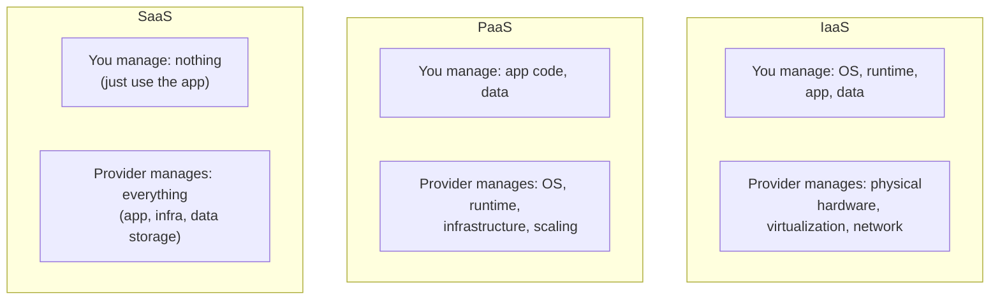

- **IaaS (Infrastructure as a Service)**: Provider শুধু raw computing resource (virtual machine, storage, network) দেয়, বাকি সব (OS, runtime, application) user নিজে setup ও manage করে।
- **PaaS (Platform as a Service)**: Provider OS, runtime, ও deployment infrastructure manage করে দেয়, user শুধু নিজের application code দিলেই চলে — scaling, patching, server management provider-এর দায়িত্ব।
- **SaaS (Software as a Service)**: সম্পূর্ণ ready-made application, user শুধু ব্যবহার করে, কোনো infrastructure বা code-এর দায়িত্ব নেই।

| দিক | IaaS | PaaS | SaaS |
|---|---|---|---|
| Control level | সবচেয়ে বেশি (full control over OS/runtime) | মাঝামাঝি (শুধু app code control) | সবচেয়ে কম (শুধু usage) |
| Management overhead | সবচেয়ে বেশি (patching, scaling, security সব নিজে) | কম (infrastructure provider manage করে) | নেই |
| Flexibility | সবচেয়ে বেশি | মাঝামাঝি | সবচেয়ে কম |

### What are examples of each?

- **IaaS**: AWS EC2, Google Compute Engine, Azure Virtual Machines, DigitalOcean Droplets।
- **PaaS**: Heroku, AWS Elastic Beanstalk, Google App Engine, Render, Vercel (frontend/serverless deployment)।
- **SaaS**: Google Workspace (Gmail, Docs), Salesforce, Slack, Dropbox, Notion।

### When would you choose PaaS over IaaS?

- **দ্রুত deployment/development speed গুরুত্বপূর্ণ হলে**: PaaS-এ শুধু code push করলেই deploy হয়ে যায়, server provisioning/configuration নিয়ে ভাবতে হয় না।
- **Small team, limited DevOps expertise**: যদি team-এর কাছে dedicated infrastructure/SRE engineer না থাকে, PaaS operational burden অনেক কমিয়ে দেয়।
- **Standard web application/API deployment**: যদি application-এর কোনো খুব custom OS-level requirement না থাকে (custom kernel module, বিশেষ networking setup), PaaS-এর abstraction যথেষ্ট।
- **Auto-scaling built-in চাইলে**: বেশিরভাগ PaaS platform automatic scaling দেয়, নিজে load balancer/auto-scaling group configure করতে হয় না।

IaaS বেছে নেওয়া উচিত যখন: fine-grained control দরকার (custom OS configuration, নির্দিষ্ট networking setup, legacy application যেটা নির্দিষ্ট environment-এ চলে), অথবা cost optimization-এর জন্য infrastructure নিজে খুব নির্দিষ্টভাবে tune করতে হবে।

### What is FaaS (Function as a Service) and how does serverless fit in?

**FaaS (Function as a Service)** হলো cloud computing-এর আরও এক ধাপ উপরের abstraction, যেখানে user শুধু individual function/code snippet লিখে দেয়, আর provider সেটা event-driven ভাবে run করে — server, container, এমনকি runtime scaling নিয়েও user কে ভাবতে হয় না। উদাহরণ: AWS Lambda, Google Cloud Functions, Azure Functions।

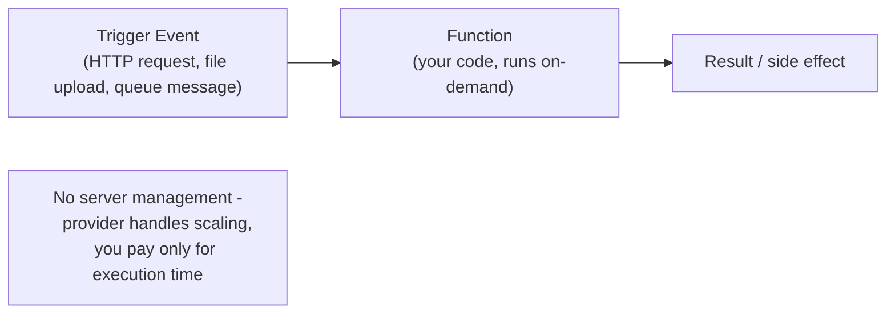

**Serverless computing** একটা broader term, যার মধ্যে FaaS একটা প্রধান অংশ, কিন্তু serverless-এ managed database (DynamoDB), managed storage (S3), managed API gateway — এসবও অন্তর্ভুক্ত থাকে, যেখানে server management সম্পূর্ণভাবে provider-এর দায়িত্ব, আর user শুধু usage অনুযায়ী pay করে।

---

## 92. What is serverless computing and when is it appropriate?

**Serverless computing** এ developer কে কোনো server provision, patch, বা scale করতে হয় না — code deploy করলেই cloud provider automatically সেটা প্রয়োজন অনুযায়ী চালায়, scale করে, এবং শুধু actual usage (execution time, request count) অনুযায়ী charge করে। "Serverless" নামের মানে এই না যে server নেই — বরং server-এর ব্যবস্থাপনা সম্পূর্ণভাবে developer-এর দৃষ্টির আড়ালে (abstracted away) থাকে।

Appropriate ব্যবহার:
- **Event-driven, sporadic workload**: যেমন file upload হলে thumbnail generate করা, বা periodic scheduled job।
- **Unpredictable/spiky traffic**: Serverless automatically scale up/down হয়, তাই traffic spike-এ manual intervention লাগে না।
- **Rapid prototyping/MVP**: Infrastructure setup-এর সময় বাঁচিয়ে দ্রুত feature ship করা যায়।
- **Microservices/API backend যেখানে granular scaling দরকার**: প্রতিটা function independently scale হয়, প্রয়োজন অনুযায়ী।

### What is the cold start problem and how do you mitigate it?

**Cold start** তখন হয়, যখন একটা serverless function অনেকক্ষণ ব্যবহার না হওয়ার পর (idle থাকার পর) নতুন request আসে — provider-কে তখন নতুন করে একটা execution environment/container তৈরি করতে হয়, runtime initialize করতে হয়, dependency load করতে হয় — এই পুরো process-এ কিছু extra latency (কয়েকশ ms থেকে কয়েক সেকেন্ড পর্যন্ত) যোগ হয়ে যায়, যেটা normal ("warm") request-এর তুলনায় অনেক বেশি ধীর।

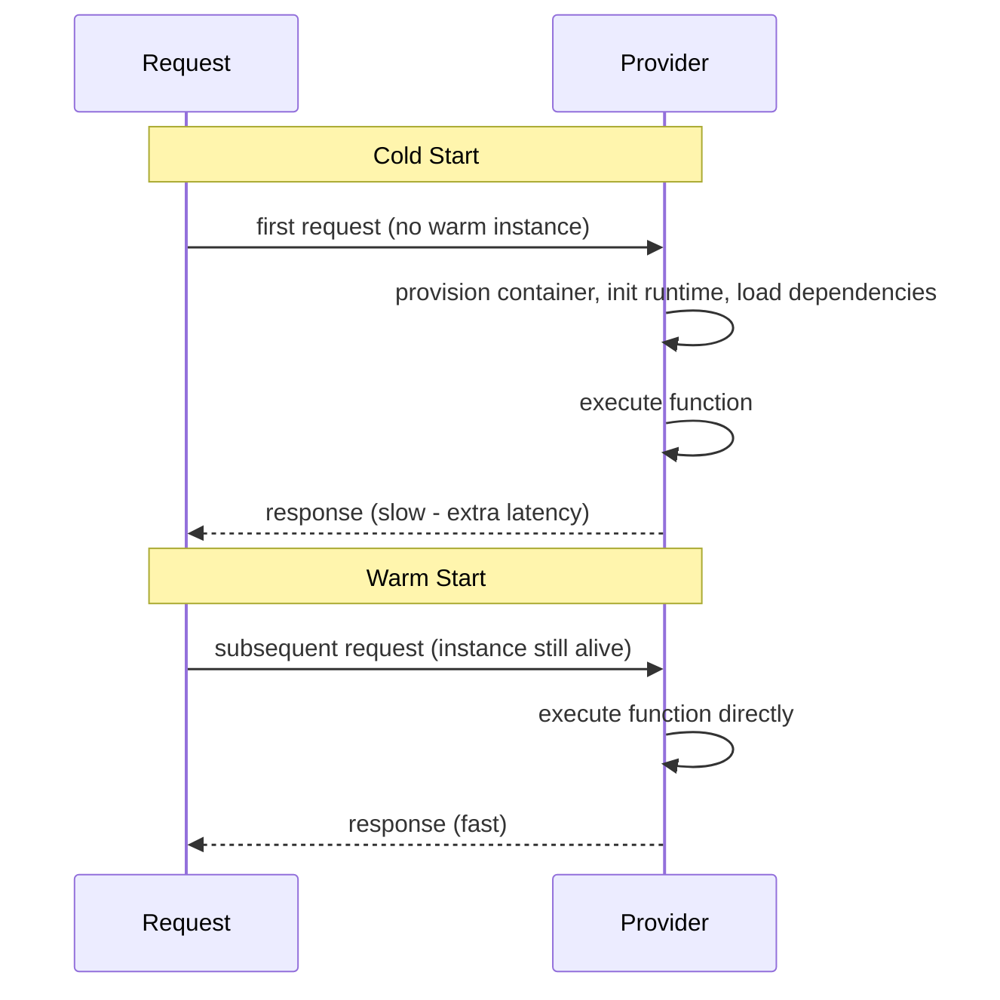

Mitigation strategy:

- **Provisioned concurrency (AWS Lambda)**: একটা নির্দিষ্ট সংখ্যক execution environment সবসময় "warm" রাখা (pre-initialized), যাতে সেই instance-গুলোতে cold start হয় না — কিন্তু এর জন্য extra cost দিতে হয় (idle সময়েও charge হয়)।
- **Function size ছোট রাখা**: কম dependency, ছোট deployment package ব্যবহার করলে initialization দ্রুত হয়।
- **Runtime নির্বাচন**: কিছু runtime (যেমন Go, Rust, Node.js) তুলনামূলক দ্রুত start হয়, আবার কিছু (যেমন JVM-based Java) তুলনামূলক ধীর — cold-start-sensitive workload-এ দ্রুত-startup runtime বেছে নেওয়া।
- **Periodic warming/ping**: একটা scheduled job দিয়ে নিয়মিত function-কে ping করা, যাতে instance idle হয়ে বন্ধ না হয়ে যায় (যদিও এটা একটা workaround, provisioned concurrency-এর মতো guarantee দেয় না)।
- **Connection reuse**: Database connection বা অন্য expensive resource function handler-এর বাইরে (global scope-এ) initialize করা, যাতে warm invocation-এ পুনরায় reconnect করতে না হয়।

```javascript
// Example: reusing DB connection across warm invocations (AWS Lambda, Node.js)
let dbConnection; // declared outside handler - persists across warm invocations

exports.handler = async (event) => {
  if (!dbConnection) {
    dbConnection = await createDbConnection(); // only runs on cold start
  }
  return dbConnection.query('SELECT * FROM orders WHERE id = $1', [event.orderId]);
};
```

### What are the cost implications of serverless vs always-on servers?

| দিক | Serverless | Always-on servers |
|---|---|---|
| Billing model | Pay-per-execution (request count + execution duration) | Pay for provisioned capacity, ব্যবহার হোক বা না হোক |
| Low/sporadic traffic | খুবই cost-effective — idle সময়ে কিছুই charge হয় না | অদক্ষ — server চালু থাকলেই cost লাগে, ব্যবহার না হলেও |
| High, consistent traffic | ব্যয়বহুল হতে পারে — per-invocation cost যোগ হতে হতে reserved instance-এর চেয়ে বেশি হয়ে যেতে পারে | বেশি cost-effective — একটা flat rate-এ predictable বেশি traffic handle করা যায় |
| Scaling cost | Automatic, granular — শুধু প্রয়োজন অনুযায়ী charge | Manual/auto-scaling group নিজে configure করতে হয়, over-provisioning-এর ঝুঁকি থাকে |

সাধারণ rule of thumb: **কম, unpredictable traffic-এ serverless সস্তা**, কিন্তু **উচ্চ, consistent/predictable traffic-এ traditional server (reserved instance) সস্তা**। এই কারণে অনেক system hybrid approach নেয় — core, high-traffic service always-on server-এ, আর sporadic/event-driven task serverless-এ রাখে।

### What types of workloads are a poor fit for serverless?

- **Long-running process**: বেশিরভাগ serverless platform-এ একটা execution time limit থাকে (যেমন AWS Lambda-তে ১৫ মিনিট) — video encoding, বড় batch processing-এর মতো দীর্ঘ কাজের জন্য উপযুক্ত না।
- **Consistently high, predictable traffic**: এখানে always-on server/reserved capacity তুলনামূলক সস্তা পড়ে (উপরে আলোচিত)।
- **Low-latency-critical application**: Cold start latency এমন application-এ সমস্যা তৈরি করে যেখানে প্রতিটা millisecond গুরুত্বপূর্ণ (যেমন high-frequency trading)।
- **Stateful application/WebSocket-heavy workload**: Serverless function সাধারণত stateless ও short-lived — persistent connection (WebSocket) বজায় রাখা বা in-memory state maintain করা কঠিন।
- **Complex, resource-intensive computation (GPU-heavy ML training)**: Specialized hardware/দীর্ঘ execution প্রয়োজন এমন workload serverless-এর constraint-এর সাথে মানানসই না।
- **Vendor lock-in নিয়ে উদ্বেগ থাকলে**: Serverless platform-গুলো প্রায়ই provider-specific (AWS Lambda-এর syntax GCP Functions-এ সরাসরি চলে না), migration কঠিন হতে পারে।

---

## 93. What is a VPC and how do you design network security with it?

**VPC (Virtual Private Cloud)** হলো cloud provider-এর মধ্যে একটা logically isolated, private network space, যেখানে user নিজের resource (VM, database, load balancer) deploy করে এবং নিজের মতো করে network topology (subnet, routing, firewall rule) design করতে পারে — অন্য customer-দের resource থেকে সম্পূর্ণভাবে আলাদা।

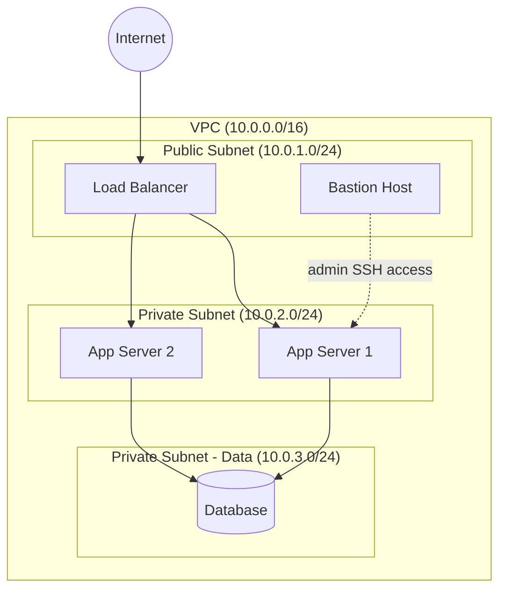

Network security design করার মূল principle:
- **Segmentation**: Public-facing component (load balancer) আর internal component (application server, database) কে আলাদা subnet-এ রাখা।
- **Security groups/NACLs**: প্রতিটা resource-এ firewall rule বসানো, শুধু প্রয়োজনীয় port/source থেকে traffic allow করা (least privilege)।
- **Least exposure**: যতটা সম্ভব কম resource-কে সরাসরি internet-facing রাখা।

### What is the difference between a public subnet and a private subnet?

| দিক | Public Subnet | Private Subnet |
|---|---|---|
| Internet access | সরাসরি Internet Gateway এর মাধ্যমে inbound/outbound access আছে | সরাসরি inbound internet access নেই, outbound-এর জন্য NAT gateway লাগে |
| উপযুক্ত resource | Load balancer, bastion host, public-facing web server | Application server, database, internal service — যেগুলো সরাসরি internet থেকে reachable হওয়া উচিত না |
| Routing table | Internet Gateway-এর দিকে route থাকে (`0.0.0.0/0 → IGW`) | NAT Gateway-এর দিকে route থাকে outbound-এর জন্য, কোনো direct IGW route নেই |
| Security posture | বেশি exposed, তাই strict security group প্রয়োজন | কম exposed, attack surface কম |

সাধারণ best practice: শুধু যেসব resource-এর সত্যিই সরাসরি internet access দরকার (load balancer, bastion host, NAT gateway নিজে) সেগুলোই public subnet-এ রাখা, বাকি সব (application server, database) private subnet-এ রাখা — এতে attack surface অনেক কমে যায়।

### What is a NAT gateway and when is it needed?

**NAT Gateway (Network Address Translation Gateway)** private subnet-এর resource-কে outbound internet access দেয় (যেমন software update download করা, external API call করা), কিন্তু সেই সাথে internet থেকে সেই resource-এ সরাসরি inbound connection block করে রাখে — মানে "one-way door"।

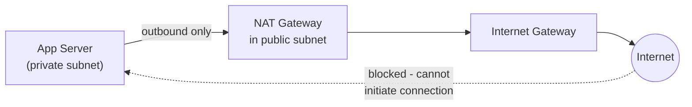

কখন দরকার:
- Private subnet-এর application server-এর যখন external service call করতে হয় (যেমন third-party payment API, npm/pip package download, OS update) — কিন্তু সেই server-কে সরাসরি internet থেকে accessible রাখতে চাই না।
- Database migration/patch-এর জন্য bastion বা background job-কে external resource access দিতে হলে।

NAT gateway সাধারণত public subnet-এ বসানো হয় (কারণ নিজে internet gateway-এর সাথে সরাসরি connect থাকতে হয়), আর private subnet-এর route table-এ সেই NAT gateway-এর দিকে default route (`0.0.0.0/0`) দেওয়া হয়।

### What is VPC peering and what are its limitations?

**VPC Peering** দুইটা আলাদা VPC-এর মধ্যে একটা direct network connection তৈরি করে, যাতে তারা একে অপরের সাথে private IP address দিয়ে communicate করতে পারে, যেন তারা একই network-এ আছে — traffic public internet দিয়ে না গিয়ে cloud provider-এর internal network দিয়ে যায়।

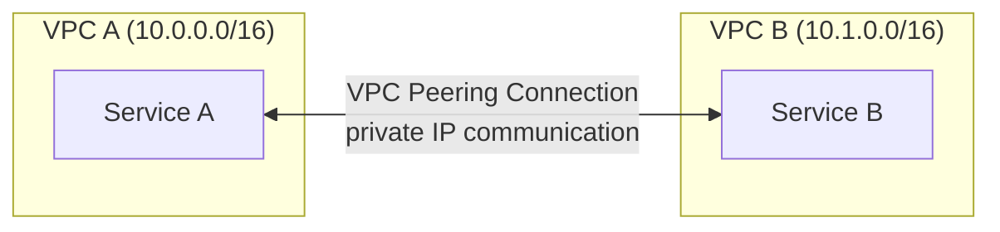

Limitations:
- **Non-transitive**: যদি VPC A, VPC B-এর সাথে peer করা থাকে, আর VPC B, VPC C-এর সাথে peer করা থাকে, তাহলে VPC A সরাসরি VPC C-এর সাথে communicate করতে পারবে না (transitively কাজ করে না) — প্রতিটা pair-এর জন্য আলাদা peering connection দরকার, যা বড় সংখ্যক VPC থাকলে জটিল হয়ে যায় (N VPC-এর জন্য N(N-1)/2 connection লাগতে পারে)।
- **CIDR overlap সমস্যা**: যদি দুইটা VPC-এর IP range (CIDR block) overlap করে, তাহলে peering সম্ভব না — এজন্য শুরু থেকেই VPC design করার সময় unique, non-overlapping CIDR range পরিকল্পনা করা জরুরি।
- **Region-specific complexity**: Cross-region peering সম্ভব হলেও, latency ও data transfer cost বেড়ে যায়।
- **Scale সমস্যা**: অনেকগুলো VPC-এর মধ্যে full-mesh connectivity দরকার হলে (microservices architecture-এ common), peering ব্যবস্থাপনা জটিল হয়ে যায় — এক্ষেত্রে **Transit Gateway** (AWS) বা similar hub-and-spoke solution বেশি উপযুক্ত, যেটা centrally সব VPC connect করে, transitive routing সাপোর্ট করে।

---

## 94. What is Infrastructure as Code (IaC) and why is it important?

**Infrastructure as Code (IaC)** হলো infrastructure (server, network, database, ইত্যাদি) কে manual click-through (cloud console UI) দিয়ে setup না করে, একটা code/configuration file হিসেবে define করা, যেটা version control-এ রাখা যায় ও automatically apply করা যায়।

গুরুত্বপূর্ণ কারণ:

- **Reproducibility**: একই configuration file দিয়ে বারবার identical environment তৈরি করা যায় (dev, staging, prod সব consistent থাকে)।
- **Version control**: Infrastructure change git history-তে track হয় — কে, কখন, কী পরিবর্তন করেছে সব দেখা যায়, প্রয়োজনে rollback করা যায়।
- **Collaboration ও review**: Infrastructure change একটা pull request-এর মাধ্যমে review করা যায়, ঠিক application code-এর মতোই।
- **Disaster recovery**: পুরো infrastructure হারিয়ে গেলেও (যেমন একটা region outage), code থেকে দ্রুত পুনর্গঠন করা সম্ভব।
- **Documentation হিসেবেও কাজ করে**: Code-ই বলে দেয় actual infrastructure কী অবস্থায় আছে (manual UI change-এর সাথে documentation-এর mismatch হয় না)।

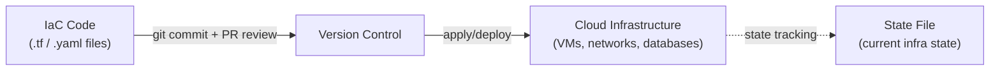

### What is the difference between Terraform and CloudFormation?

| দিক | Terraform | AWS CloudFormation |
|---|---|---|
| Cloud provider support | Multi-cloud (AWS, GCP, Azure, ও শত শত provider) | শুধুমাত্র AWS-specific |
| Language | HCL (HashiCorp Configuration Language), declarative | JSON/YAML, declarative |
| State management | নিজস্ব state file (local বা remote backend, যেমন S3) maintain করতে হয় | AWS নিজে state manage করে (user-কে আলাদা state file নিয়ে ভাবতে হয় না) |
| Ecosystem/community | বিশাল community, প্রচুর third-party provider/module | AWS-এর মধ্যেই সীমাবদ্ধ, তবে AWS-এর সাথে গভীরভাবে integrated |
| Vendor lock-in | কম — same tool দিয়ে multi-cloud manage করা যায় | বেশি — শুধু AWS-এর মধ্যে সীমাবদ্ধ |

```hcl
# Example: Terraform configuration for an S3 bucket
resource "aws_s3_bucket" "app_data" {
  bucket = "my-app-data-bucket"

  tags = {
    Environment = "production"
  }
}

resource "aws_s3_bucket_versioning" "app_data_versioning" {
  bucket = aws_s3_bucket.app_data.id
  versioning_configuration {
    status = "Enabled"
  }
}
```

সাধারণভাবে, **multi-cloud strategy বা vendor-neutral tool চাইলে Terraform**, আর **সম্পূর্ণভাবে AWS-এর মধ্যে থাকলে ও AWS-এর native tooling/support প্রাধান্য দিলে CloudFormation** (বা তার উপরে তৈরি AWS CDK, যেটা familiar programming language দিয়ে IaC লেখার সুবিধা দেয়) বেছে নেওয়া হয়।

### What is idempotency in the context of IaC?

IaC-এর প্রেক্ষাপটে **idempotency** মানে হলো — একই configuration file বারবার apply করলেও ফলাফল একই থাকবে, duplicate resource তৈরি হবে না বা unintended change হবে না। IaC tool (Terraform, CloudFormation) বর্তমান actual infrastructure state-এর সাথে desired configuration-এর তুলনা করে, শুধু **difference (diff)** টুকুই apply করে।

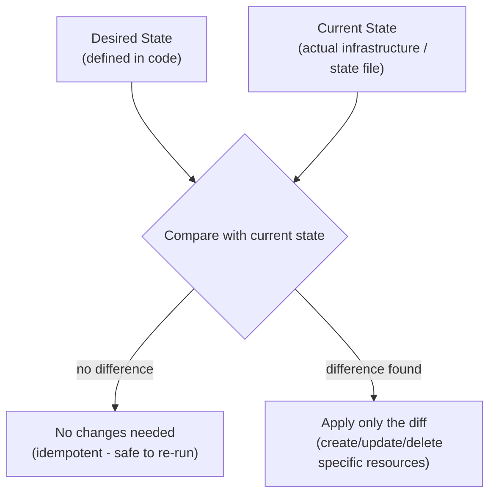

উদাহরণ: যদি একটা `aws_instance` resource ইতিমধ্যে desired configuration অনুযায়ী চলমান থাকে, তাহলে `terraform apply` আবার চালালে Terraform বুঝতে পারে কোনো change দরকার নেই, এবং কিছুই পরিবর্তন করে না — এটাই idempotency, যা IaC কে নিরাপদে বারবার run করার (যেমন CI/CD pipeline-এ প্রতিটা deploy-এ) সুযোগ দেয়, প্রতিবার নতুন resource তৈরি হয়ে যাওয়ার ভয় ছাড়াই।

### How do you manage secrets in IaC configurations?

Secret (database password, API key) কখনো সরাসরি IaC code-এ hardcode করে version control-এ commit করা উচিত না, কারণ সেটা permanent ভাবে git history-তে থেকে যায়। সাধারণ approach:

- **Secrets manager reference ব্যবহার করা**: IaC code-এ সরাসরি secret value না লিখে, একটা secrets manager (AWS Secrets Manager, HashiCorp Vault) থেকে reference/pull করা।

```hcl
# Example: Terraform referencing a secret from AWS Secrets Manager, not hardcoding it
data "aws_secretsmanager_secret_version" "db_password" {
  secret_id = "prod/db/password"
}

resource "aws_db_instance" "main" {
  # ... other config ...
  password = data.aws_secretsmanager_secret_version.db_password.secret_string
}
```

- **Environment variable/CI secrets দিয়ে injection**: CI/CD pipeline-এ secret কে environment variable হিসেবে রাখা (GitHub Actions Secrets, GitLab CI Variables), যেটা apply করার সময় IaC tool-এ inject করা হয়, code-এ কখনো plaintext আকারে থাকে না।
- **`.gitignore`/state file encryption**: State file-এ (Terraform state) অনেক সময় sensitive value plaintext-এ থেকে যেতে পারে — তাই state file remote backend-এ (যেমন S3 + encryption) রাখা, এবং কখনো local state file version control-এ commit না করা।
- **Separate secrets-only module/workflow**: কিছু team secret-related resource (যেমন initial admin password) কে সাধারণ IaC apply flow থেকে আলাদা করে রাখে, যাতে secret rotation সাধারণ infrastructure change-এর সাথে mix না হয়ে যায়।

---

## 95. How do you design a multi-region architecture?

**Multi-region architecture** এ একটা application একাধিক geographic region জুড়ে deploy করা হয়, মূলত দুইটা কারণে — **latency কমানো** (user-এর কাছাকাছি region থেকে সার্ভ করা) ও **disaster recovery/high availability** (একটা পুরো region down হলেও অন্য region থেকে সার্ভিস চালু থাকা)।

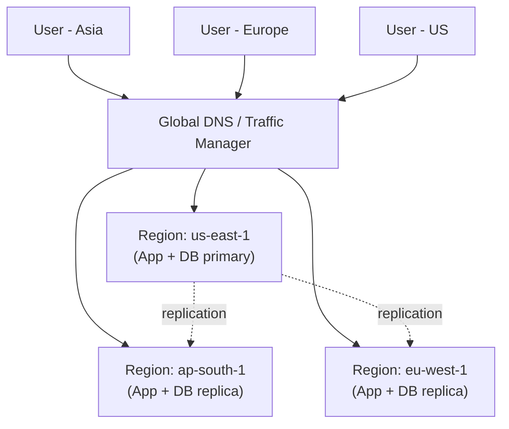

### What is active-active vs active-passive multi-region deployment?

| দিক | Active-Active | Active-Passive |
|---|---|---|
| Traffic serving | সব region একসাথে live traffic serve করে | শুধু primary/active region traffic serve করে, secondary region idle বা standby থাকে |
| Resource utilization | ভালো — সব region-এর capacity ব্যবহার হয় | কম — standby region-এর resource বেশিরভাগ সময় idle থাকে |
| Failover complexity | কম downtime — অন্য region এমনিতেই traffic handle করতে সক্ষম | বেশি downtime — failover trigger হওয়ার পর standby region-কে active করতে সময় লাগে |
| Data consistency জটিলতা | বেশি জটিল — একাধিক region একসাথে write করলে conflict resolution দরকার হতে পারে | তুলনামূলক সহজ — শুধু primary region write করে, secondary শুধু replicate করে |
| Cost | বেশি (সব region-এ full capacity রাখতে হয়) | তুলনামূলক কম (standby region-এ কম capacity রাখা যায়) |

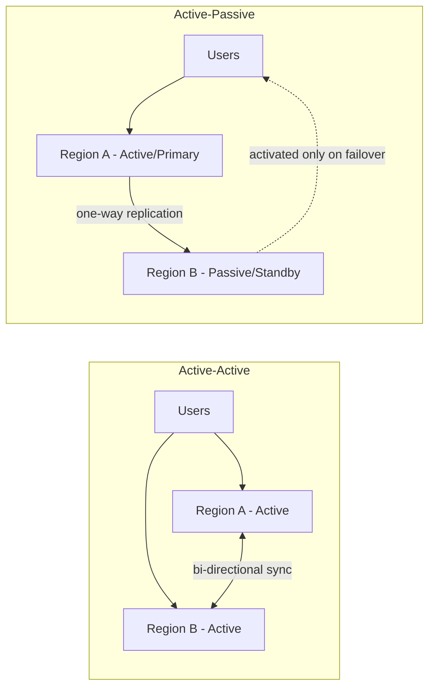

**Active-active** উপযুক্ত যখন strong consistency-এর প্রয়োজন কম, আর সর্বোচ্চ availability ও lowest latency প্রধান লক্ষ্য (যেমন global content platform)। **Active-passive** উপযুক্ত যখন data consistency (single source of truth) সহজভাবে বজায় রাখা গুরুত্বপূর্ণ, disaster recovery-ই মূল উদ্দেশ্য, active-active-এর জটিলতা (conflict resolution) এড়াতে চাইলে।

### How do you handle data replication across regions?

- **Asynchronous replication**: Primary region-এ write হওয়ার পর, সেই change অন্য region-এ asynchronously (কিছুটা delay সহ) propagate করা হয় — cross-region network latency বেশি বলে synchronous replication করলে write latency অনেক বেড়ে যায়, তাই বেশিরভাগ multi-region system eventual consistency মেনে নেয়।
- **Conflict resolution strategy (active-active-এর ক্ষেত্রে)**: যদি দুইটা region একই data একই সময়ে ভিন্নভাবে update করে, conflict resolve করার জন্য strategy দরকার — যেমন **last-write-wins** (timestamp দেখে সাম্প্রতিকটা রাখা), **vector clocks**, বা application-specific merge logic (যেমন CRDT — Conflict-free Replicated Data Type)।
- **Database-native multi-region feature ব্যবহার করা**: অনেক modern database built-in multi-region replication দেয় — যেমন DynamoDB Global Tables, Cosmos DB, CockroachDB, Spanner — এগুলো replication ও conflict resolution অনেকাংশে নিজে থেকেই handle করে।
- **Read replica নিকটতম region থেকে সার্ভ করা**: সব write একটা primary region-এ পাঠিয়ে, read-heavy traffic-কে user-এর কাছের region-এর read replica থেকে সার্ভ করা — এতে write consistency সহজ থাকে, অথচ read latency কমে।

### How do you handle DNS failover for multi-region deployments?

**DNS-based failover** এ একটা DNS service (যেমন AWS Route 53, Cloudflare) ব্যবহার করে, user request-কে automatically একটা healthy region-এ route করা হয়, আর কোনো region down হয়ে গেলে সেটা detect করে অন্য region-এ traffic সরিয়ে নেওয়া হয়।

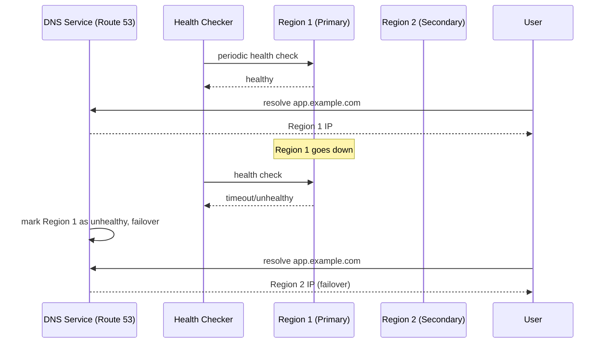

- **Health checks**: DNS service নিয়মিত প্রতিটা region-এর একটা health check endpoint ping করে, যদি কয়েকবার consecutive fail হয় তাহলে সেই region-কে "unhealthy" mark করা হয়।
- **Routing policy**:
  - **Failover routing**: Primary region healthy থাকলে সব traffic সেখানে যায়, unhealthy হলে automatically secondary region-এ route হয়ে যায়।
  - **Latency-based routing**: User-এর geographic location অনুযায়ী সবচেয়ে কম latency দেয় এমন healthy region-এ route করা।
  - **Weighted routing**: Traffic-কে নির্দিষ্ট অনুপাতে একাধিক region-এ ভাগ করা (gradual rollout/canary testing-এর জন্যও ব্যবহৃত)।
- **TTL (Time To Live) কম রাখা**: DNS record-এর TTL কম রাখলে (যেমন ৬০ সেকেন্ড), failover হলে client দ্রুত নতুন IP resolve করবে — তবে খুব কম TTL DNS server-এ query load বাড়িয়ে দিতে পারে, তাই একটা balance রাখা দরকার।
- **DNS caching limitation বোঝা**: কিছু client/ISP DNS TTL respect না করে বেশি সময় cache রাখতে পারে, তাই DNS failover-এর সাথে সাথে client-side retry logic বা connection-level health check ও রাখা ভালো, শুধু DNS-এর উপর সম্পূর্ণ নির্ভর না করে।

---

## 96. What is a content delivery network (CDN) and how do you integrate it into a system design?

**CDN (Content Delivery Network)** হলো globally distributed server-এর একটা network (edge location/PoP — Point of Presence), যেগুলো origin server-এর content cache করে user-এর ভৌগোলিকভাবে কাছের location থেকে serve করে — এতে latency কমে, আর origin server-এর উপর load ও কমে যায়।

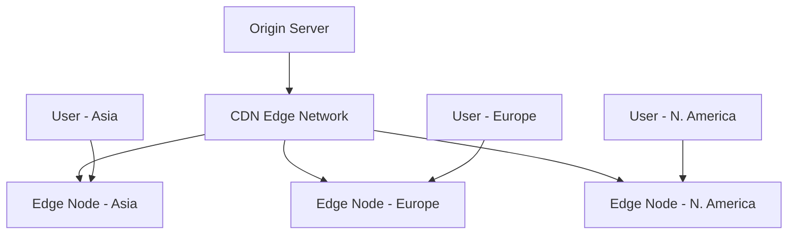

Integration সাধারণত এভাবে করা হয়:
- Static asset (CSS, JS, image, video) CDN domain থেকে সার্ভ করা, DNS record CDN-এর দিকে point করা।
- Origin server-কে "origin" হিসেবে configure করা, CDN সেখান থেকে content fetch করে cache করে রাখে (miss হলেই origin-এ যায়)।
- Cache-Control header দিয়ে content কতক্ষণ cache থাকবে তা নির্দিষ্ট করা।

### What types of content should be served from a CDN?

- **Static assets**: CSS, JavaScript bundle, image, font, video — এগুলো সহজে cache করা যায় কারণ প্রায়ই পাল্টায় না, আর content সবার জন্য একই থাকে।
- **Large media files**: Video streaming, downloadable file — CDN বড় file-এর জন্য efficient delivery (chunked, resumable) সাপোর্ট করে।
- **API response (কিছু ক্ষেত্রে)**: যদি একটা API response সব user-এর জন্য একই থাকে (public, non-personalized data — যেমন public product catalog), সেটাও শর্ট TTL দিয়ে CDN-এ cache করা যায়, origin-এর load কমাতে।
- **Entire static websites**: JAMstack/static site generator দিয়ে তৈরি website পুরোটাই CDN থেকে সার্ভ করা যায় (কোনো origin server দরকার না হতে পারে, বা শুধু build-time-এ ব্যবহার হয়)।

CDN-এ cache করা উচিত না: highly personalized data (user-specific dashboard), sensitive data যেটা user-ভিত্তিক access control দরকার, বা frequently-changing real-time data (যদি না খুব ছোট TTL দিয়ে সাবধানে করা হয়)।

### How does a CDN reduce latency for a globally distributed user base?

- **Geographic proximity**: User-এর সবচেয়ে কাছের edge node থেকে content সার্ভ করা হয়, ফলে physical distance কম থাকায় network round-trip time (RTT) কমে যায় — একটা user যদি origin server থেকে ১০,০০০ কিমি দূরে থাকে, কিন্তু CDN edge node মাত্র ৫০ কিমি দূরে, তাহলে latency drastically কমে যায়।
- **Anycast routing**: একই CDN IP address multiple location থেকে announce করা হয়, user automatically network-level এ সবচেয়ে কাছের/দ্রুততম edge node-এ route হয়ে যায়, কোনো manual configuration ছাড়াই।
- **Connection reuse ও TLS termination at edge**: CDN edge node-এ TLS handshake সম্পন্ন হয় (user-এর কাছাকাছি হওয়ায় দ্রুত), এবং edge-থেকে-origin connection persistent/reused রাখা হয়, ফলে প্রতিটা user request-এ পুরো handshake origin পর্যন্ত করতে হয় না।
- **Caching reduces origin round-trip**: যদি content ইতিমধ্যে edge-এ cache করা থাকে (cache hit), তাহলে origin server পর্যন্ত request যাওয়ারই দরকার হয় না — পুরো response সরাসরি edge থেকে আসে, যা সবচেয়ে বড় latency reduction দেয়।

### How do you handle CDN cache invalidation?

Cache invalidation দরকার হয় যখন origin-এর content পরিবর্তন হয়, কিন্তু CDN-এ পুরনো (stale) version এখনো cache করা আছে। সাধারণ approach:

- **TTL-based expiration**: প্রতিটা cached content-এর একটা expiration time (TTL) নির্ধারণ করা (`Cache-Control: max-age=3600`), TTL শেষ হলে CDN automatically origin থেকে fresh content পুনরায় fetch করে। এটা সবচেয়ে simple approach, কিন্তু TTL শেষ না হওয়া পর্যন্ত stale content সার্ভ হতে থাকে।
- **Explicit purge/invalidation API**: Content পরিবর্তন হলে সাথে সাথে একটা explicit "purge" request পাঠানো, যেটা CDN-কে বলে দেয় নির্দিষ্ট URL/path-এর cache সাথে সাথে বাতিল করে দিতে (যেমন AWS CloudFront-এর Invalidation API, বা Cloudflare-এর Purge Cache)।

```javascript
// Example: invalidating a CloudFront cache path after content update
const { CloudFrontClient, CreateInvalidationCommand } = require('@aws-sdk/client-cloudfront');

async function invalidateCache(distributionId, paths) {
  const client = new CloudFrontClient({});
  await client.send(new CreateInvalidationCommand({
    DistributionId: distributionId,
    InvalidationBatch: {
      Paths: { Quantity: paths.length, Items: paths },
      CallerReference: Date.now().toString(),
    },
  }));
}

invalidateCache('E1234ABCD', ['/images/banner.jpg', '/api/products']);
```

- **Cache-busting via versioned URLs**: Content-এর URL-এ একটা version/hash যোগ করা (যেমন `app.a1b2c3.js` — content পরিবর্তন হলে hash-ও পরিবর্তন হয়ে যায়), এতে explicit invalidation-এর দরকারই হয় না — নতুন content নতুন URL-এ থাকে, পুরনো URL-এর cache automatically অপ্রাসঙ্গিক হয়ে যায় (এটা static asset-এর জন্য সবচেয়ে common ও reliable approach, বিশেষ করে build tool যেমন Webpack/Vite এই hashing automatically করে)।
- **Stale-while-revalidate strategy**: CDN কে বলে দেওয়া যায় TTL শেষ হয়ে গেলেও সাথে সাথে stale content না ফেলে দিয়ে, background-এ fresh content fetch করার সময় সাময়িকভাবে stale content সার্ভ করতে থাকুক (`Cache-Control: stale-while-revalidate=60`) — এতে user সবসময় দ্রুত response পায়, freshness সামান্য delay হলেও।
