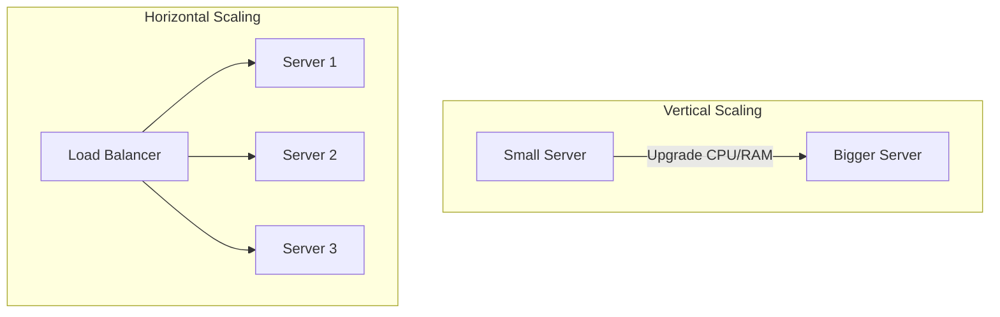
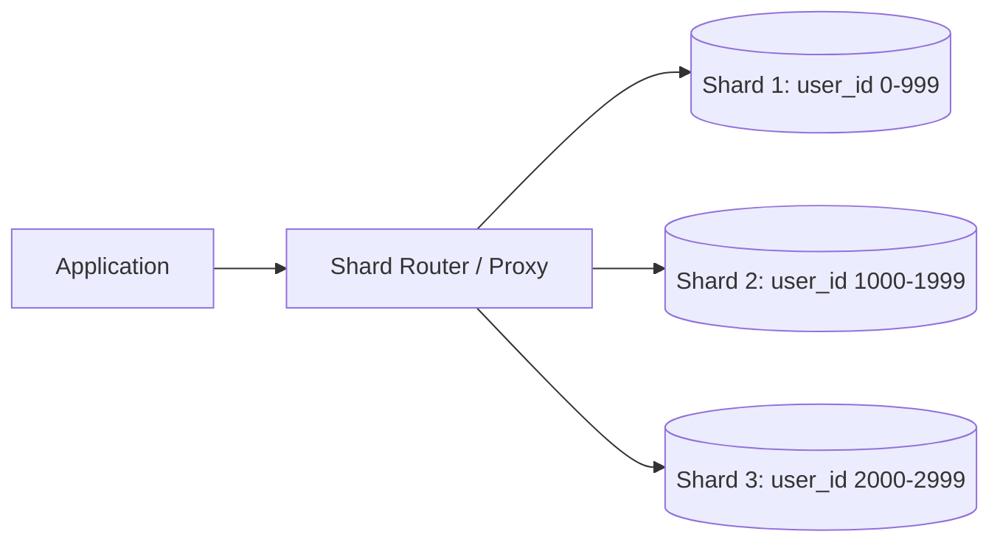
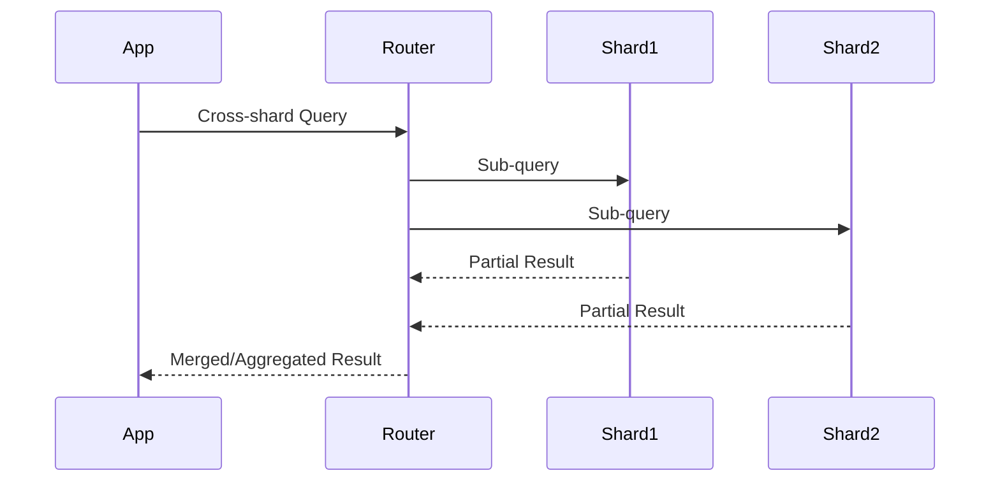
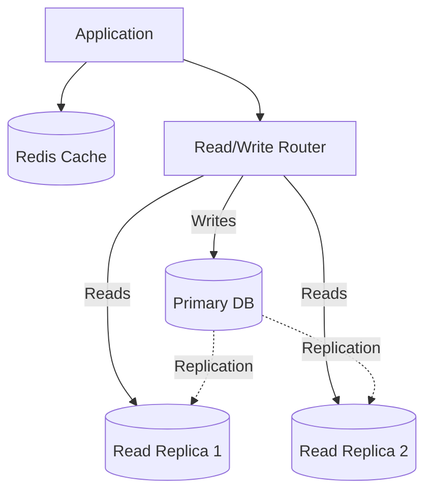
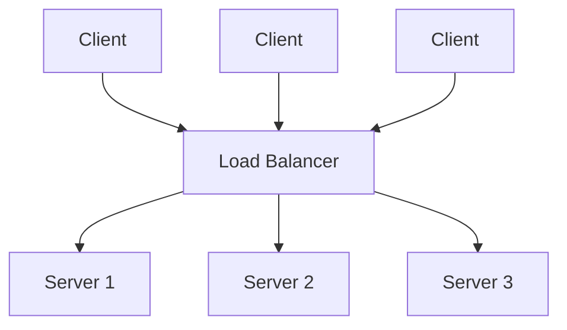
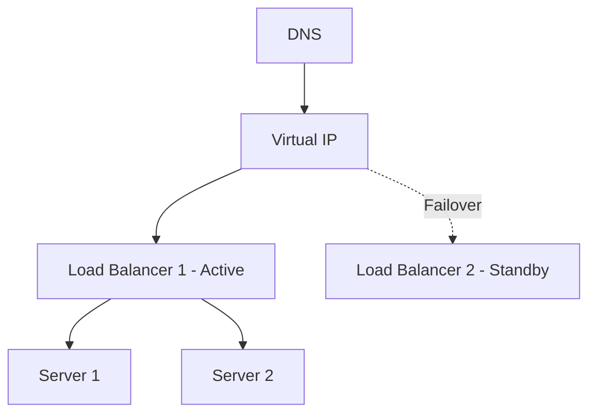
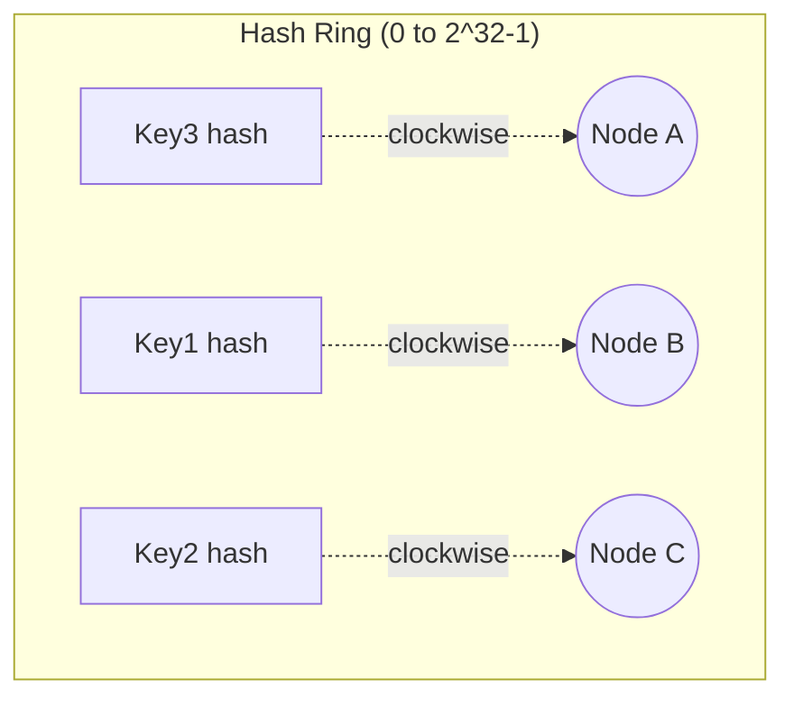
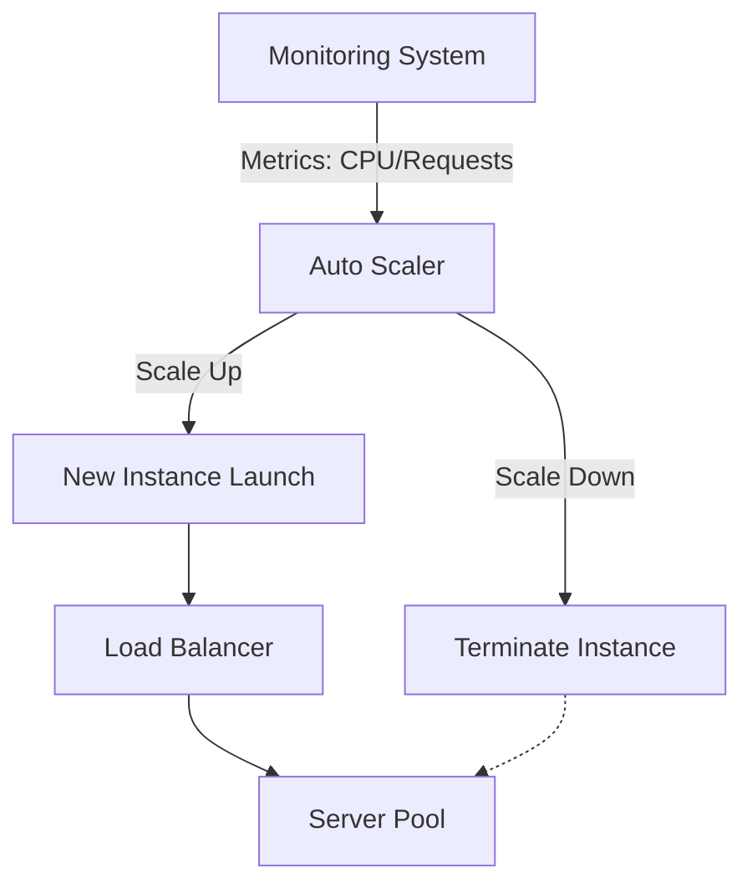

## 6. What is scalability and why does it matter in system design?

**Scalability** বলতে বোঝায় একটি সিস্টেমের সেই ক্ষমতা, যার মাধ্যমে load বৃদ্ধি পেলে (বেশি user, বেশি request, বেশি data) সিস্টেম performance ঠিক রেখে সেই load handle করতে পারে। System design-এ এটা গুরুত্বপূর্ণ কারণ:

- একটি startup যখন হাজার হাজার থেকে কোটি user-এ scale করে, তখন যদি architecture scalable না হয়, তাহলে সিস্টেম crash করবে বা response time বেড়ে যাবে।
- Scalability না থাকলে business growth-এর সাথে সাথে infrastructure cost অস্বাভাবিকভাবে বেড়ে যায় (inefficient scaling)।
- Scalable design future-এ নতুন feature যোগ করা এবং maintain করা সহজ করে তোলে।

সাধারণত scalability measure করা হয় **throughput** (per second কত request handle করা যায়), **latency** (response time), এবং **resource utilization** দিয়ে।

### What is the difference between horizontal scaling and vertical scaling?

দুইটাই scaling-এর approach, কিন্তু পদ্ধতি ভিন্ন:

- **Vertical Scaling (Scale Up)**: একটি single machine/server-এর resource (CPU, RAM, Disk) বাড়ানো। যেমন একটা server-এ 8 GB RAM ছিল, সেটাকে 64 GB করে দেওয়া।
- **Horizontal Scaling (Scale Out)**: single powerful machine-এর বদলে একাধিক machine/server যোগ করে load distribute করা।



| বিষয় | Vertical Scaling | Horizontal Scaling |
|---|---|---|
| পদ্ধতি | একটা server-এর power বাড়ানো | নতুন server যোগ করা |
| Complexity | কম (single machine manage করা সহজ) | বেশি (distributed system-এর জটিলতা আসে) |
| Downtime | Upgrade করার সময় সাধারণত downtime লাগে | সাধারণত zero-downtime সম্ভব |
| Cost | শুরুতে সস্তা, পরে exponentially বাড়ে | linear-এর কাছাকাছি cost growth |
| Fault Tolerance | Single point of failure | Redundancy থাকায় fault tolerant |

### What is the ceiling of vertical scaling?

Vertical scaling-এর একটা **hardware limit বা ceiling** আছে। একটা single machine-এ CPU core, RAM, বা disk I/O-এর একটা সর্বোচ্চ সীমা থাকে যা বর্তমান hardware technology দিয়ে সম্ভব। উদাহরণস্বরূপ:

- একটা cloud provider হয়তো সর্বোচ্চ 128 বা 256 vCPU এবং কয়েক TB RAM-এর instance দিতে পারে, কিন্তু তার বাইরে যাওয়া সম্ভব না।
- Motherboard, memory bus bandwidth, এবং physical hardware constraint-এর কারণে একটা সীমার পর আর upgrade করা যায় না।
- এমনকি সেই সীমা পর্যন্ত পৌঁছানোর আগেই cost exponentially বেড়ে যায় — যেমন 2x performance পেতে হয়তো 4x টাকা খরচ করতে হয় (diminishing returns)।
- এছাড়া vertical scaling-এ **single point of failure** থাকে — সেই একটা machine down হলে পুরো সিস্টেম down হয়ে যায়।

এই কারণেই বড় scale-এ পৌঁছানো systems সাধারণত horizontal scaling-এর দিকে যায়।

### What does it mean for a system to scale linearly?

একটি সিস্টেম **linearly scale** করে যখন resource (server/node) বাড়ালে throughput বা capacity সেই একই অনুপাতে (proportionally) বাড়ে। যেমন:

- যদি 1টা server 1000 requests/sec handle করতে পারে, আর 10টা server ঠিক 10,000 requests/sec handle করতে পারে — তাহলে এটা perfect linear scaling।

বাস্তবে perfect linear scaling পাওয়া কঠিন, কারণ node বাড়ালে সাধারণত কিছু **coordination overhead** (network communication, data synchronization, locking ইত্যাদি) তৈরি হয়। এটাকে বলা হয় **Amdahl's Law** বা **sub-linear scaling** — অর্থাৎ node সংখ্যা বাড়ালে improvement rate ধীরে ধীরে কমতে থাকে।

```
Ideal (Linear):     Nodes: 1 -> 2 -> 4 -> 8
                     Throughput: 1x -> 2x -> 4x -> 8x

Real World (Sub-linear): Nodes: 1 -> 2 -> 4 -> 8
                     Throughput: 1x -> 1.8x -> 3.2x -> 5.5x
```

ভালো distributed system design-এর লক্ষ্য থাকে যতটা সম্ভব linear scaling-এর কাছাকাছি পৌঁছানো (shared state এবং coordination কমিয়ে)।

---

## 7. What is horizontal vs vertical scaling and when do you use each?

এই প্রশ্নটা মূলত উপরের ৬ নম্বর প্রশ্নের ধারাবাহিকতা, কিন্তু এখানে ফোকাস হলো **কখন কোনটা ব্যবহার করব**।

**Vertical scaling ব্যবহার করব যখন:**
- Application টা monolithic এবং distributed করা কঠিন (যেমন একটা legacy application যেটা multiple machine-এ চালানোর জন্য ডিজাইন করা হয়নি)।
- Team ছোট এবং distributed system-এর operational complexity handle করার মতো resource নেই।
- Traffic এখনো সীমিত এবং near-future-এও অনেক বেশি বাড়ার সম্ভাবনা নেই।
- Quick, simple solution দরকার (যেমন MVP বা early-stage product)।

**Horizontal scaling ব্যবহার করব যখন:**
- High availability দরকার — single point of failure এড়াতে চাই।
- Traffic unpredictable এবং অনেক বেশি বাড়তে পারে (millions of users)।
- Application stateless বা distributed-friendly architecture-এ তৈরি (যেমন microservices)।
- Long-term এ cost-effective scaling দরকার।

### What are the cost implications of horizontal vs vertical scaling?

- **Vertical Scaling**: শুরুতে সস্তা মনে হয় কারণ একটা মাত্র machine manage করতে হয় (কম licensing, কম operational overhead)। কিন্তু high-end hardware-এর দাম **exponentially** বাড়ে — একটা 128-core machine, দুইটা 64-core machine-এর চেয়ে অনেক বেশি দামি হতে পারে। এছাড়া, commodity hardware ব্যবহার করা যায় না, বরং premium/enterprise-grade hardware লাগে।

- **Horizontal Scaling**: commodity (সাধারণ, সস্তা) hardware/instance ব্যবহার করা যায়, যা cost-efficient। তবে operational cost বাড়ে — বেশি server manage করা, networking, load balancer, monitoring, orchestration (যেমন Kubernetes) ইত্যাদির জন্য অতিরিক্ত খরচ এবং engineering effort লাগে। কিন্তু বড় scale-এ এটাই বেশি cost-effective, কারণ **auto-scaling** দিয়ে শুধু প্রয়োজন অনুযায়ী resource ব্যবহার করা যায় (pay-as-you-go)।

### Which cloud services support automatic horizontal scaling?

প্রায় সব major cloud provider-এ auto-scaling সাপোর্ট আছে:

- **AWS**: Auto Scaling Groups (ASG) EC2-এর জন্য, ECS/EKS Service Auto Scaling, Lambda (built-in automatic scaling), Application Load Balancer-এর সাথে integration।
- **Google Cloud (GCP)**: Managed Instance Groups (MIG) with autoscaler, Google Kubernetes Engine (GKE) Horizontal Pod Autoscaler (HPA) ও Cluster Autoscaler, Cloud Run (fully managed, automatic scaling)।
- **Azure**: Virtual Machine Scale Sets (VMSS), Azure Kubernetes Service (AKS) autoscaler, Azure App Service auto-scale rules।
- **Kubernetes** (cloud-agnostic): Horizontal Pod Autoscaler (HPA) — CPU/memory বা custom metric-এর উপর ভিত্তি করে pod সংখ্যা বাড়ায়/কমায়। Cluster Autoscaler node সংখ্যাও adjust করে।

### When does horizontal scaling introduce complexity that vertical scaling avoids?

Horizontal scaling অনেক সুবিধা দিলেও এটা বেশ কিছু জটিলতা নিয়ে আসে যা vertical scaling-এ থাকে না:

- **Data consistency**: একাধিক server-এ data থাকলে সব server-এ same, up-to-date data রাখা কঠিন হয়ে যায় (CAP theorem-এর trade-off চলে আসে)।
- **Network latency**: server-গুলোর মধ্যে communication দরকার হয়, যা network overhead ও latency যোগ করে।
- **Distributed transactions**: multiple node-এ একসাথে একটা transaction করা (যেমন two-phase commit) জটিল এবং ধীর।
- **Session management**: user session কোন server-এ আছে তা track করতে হয় (sticky session বা centralized session store দরকার)।
- **Load balancing দরকার**: traffic ঠিকমতো distribute করার জন্য অতিরিক্ত layer লাগে।
- **Debugging কঠিন**: distributed logging ও tracing (যেমন distributed tracing tools) ছাড়া bug খুঁজে পাওয়া কষ্টকর।

Vertical scaling-এ এসব সমস্যা থাকে না কারণ সবকিছু একই machine-এর মধ্যেই থাকে — একটাই memory space, একটাই disk।

---

## 8. What is database sharding and how does it help with scalability?

**Sharding** হলো একটা technique যেখানে একটা বড় database-কে ছোট ছোট অংশে (shard) ভাগ করা হয়, এবং প্রতিটা shard আলাদা আলাদা database server-এ রাখা হয়। প্রতিটা shard পুরো data-র একটা subset ধারণ করে।

এটা scalability-তে সাহায্য করে কারণ:
- একটা single database server-এর উপর load কমে যায় — প্রতিটা shard শুধু তার অংশের data ও query handle করে।
- Read/write উভয় ধরনের operation একাধিক server-এ parallel-ভাবে চলতে পারে, ফলে throughput বাড়ে।
- Storage limit-ও distribute হয়, তাই একটা single disk-এর সীমাবদ্ধতায় আটকে থাকতে হয় না।



### What are the different sharding strategies?

মূলত কয়েকটা common strategy আছে:

1. **Range-based Sharding**: একটা key-এর value range অনুযায়ী ভাগ করা হয়। যেমন `user_id 1-1000` → Shard 1, `user_id 1001-2000` → Shard 2। সহজ, কিন্তু **hot shard** সমস্যা হতে পারে যদি নির্দিষ্ট range-এ বেশি traffic আসে।

2. **Hash-based Sharding**: একটা key-কে hash function দিয়ে hash করে, সেই hash value অনুযায়ী shard নির্ধারণ করা হয়। যেমন `hash(user_id) % num_shards`। এটা data uniformly distribute করে, কিন্তু re-sharding করা কঠিন হয়ে যায়।

3. **Directory-based Sharding**: একটা lookup table (mapping service) রাখা হয় যেটা বলে দেয় কোন key কোন shard-এ আছে। Flexible, কিন্তু এই lookup table নিজেই একটা bottleneck বা single point of failure হতে পারে।

4. **Geographic/Entity-based Sharding**: user-এর location বা business entity অনুযায়ী shard করা হয় (যেমন US user-দের data US region-এর shard-এ, EU user-দের data EU region-এর shard-এ)। এটা compliance (যেমন GDPR) এবং latency-এর জন্যও উপকারী।

### What is a hot shard problem and how do you solve it?

**Hot Shard Problem** হয় যখন একটা particular shard-এ অন্যান্য shard-এর তুলনায় অনেক বেশি traffic বা data চলে যায়, ফলে সেই shard overloaded হয়ে যায় এবং bottleneck তৈরি করে — যেখানে বাকি shard-গুলো underutilized থাকে।

**কারণ:**
- Range-based sharding-এ যদি কোনো নির্দিষ্ট range-এ (যেমন সাম্প্রতিক তারিখের data বা একটা celebrity user) হঠাৎ বেশি access হয়।
- Uneven key distribution (যেমন কিছু user অনেক বেশি active)।

**সমাধান:**
- **Hash-based sharding** ব্যবহার করা, যাতে data uniformly distribute হয়।
- **Composite/Salted key** ব্যবহার করা — key-এর সাথে একটা random বা secondary component যোগ করে distribution আরও ছড়িয়ে দেওয়া।
- **Caching layer** (যেমন Redis) যোগ করা যাতে hot data-এর জন্য বারবার shard-এ query না যেতে হয়।
- **Dynamic re-sharding / splitting**: hot shard-কে আরও ছোট ছোট shard-এ ভাগ করে দেওয়া।
- **Consistent hashing** ব্যবহার করা যাতে load আরও evenly ভাগ হয় এবং node পরিবর্তনের সময় কম data move করতে হয়।

### How do you handle cross-shard queries?

Sharding-এর সবচেয়ে বড় challenge হলো এমন query, যেখানে একাধিক shard থেকে data লাগবে — যেমন aggregation (SUM, COUNT), join, বা global search। এগুলো handle করার কিছু approach:

1. **Scatter-Gather Pattern**: query-টা সব shard-এ পাঠানো হয়, প্রতিটা shard তার নিজের অংশের result রিটার্ন করে, তারপর application/router layer সেই সব result merge/aggregate করে। সহজ, কিন্তু slow (সবচেয়ে ধীর shard-এর উপর নির্ভরশীল)।

2. **Denormalization**: প্রায়ই যেসব field একসাথে query করা হয়, সেগুলো একই shard-এ রাখার জন্য data model-কে আগে থেকেই design করা, যাতে cross-shard query কমে যায়।

3. **Secondary Index Service / Search Engine**: Elasticsearch-এর মতো একটা আলাদা search/index layer রাখা, যেখানে সব shard-এর data-র একটা searchable copy থাকে, cross-shard query সেখানে চালানো হয়।

4. **Application-level Join**: প্রতিটা shard থেকে আলাদা করে data নিয়ে এসে application code-এ join করা।



### What happens when you need to re-shard a database?

**Re-sharding** দরকার হয় যখন data বা traffic বেড়ে যায় এবং current shard configuration আর যথেষ্ট থাকে না (যেমন shard সংখ্যা বাড়ানো লাগবে বা কোনো hot shard split করা লাগবে)।

Re-sharding একটা কঠিন এবং risky operation, কারণ:

- **Massive data movement**: যদি simple `hash(key) % N` strategy ব্যবহার করা হয়, তাহলে `N` (shard সংখ্যা) পরিবর্তন করলে প্রায় **সব key**-এর mapping বদলে যায় — ফলে প্রায় সব data নতুন করে move করতে হয়। এটা extremely expensive এবং downtime-এর ঝুঁকি তৈরি করে।

- **সমাধান — Consistent Hashing**: consistent hashing ব্যবহার করলে node যোগ/বাদ দিলে শুধুমাত্র **একটা ছোট অংশের** key-ই নতুন shard-এ move করতে হয়, বাকি সব key তাদের আগের shard-এই থাকে (এটা নিয়ে বিস্তারিত ১১ নম্বর প্রশ্নে আছে)।

- **Dual-write / Online migration strategy**: re-sharding-এর সময় সাধারণত একটা migration process চালানো হয় — পুরনো shard এবং নতুন shard উভয় জায়গায় write করা হয় (dual write), background-এ পুরনো data নতুন shard-এ copy করা হয়, তারপর read traffic ধীরে ধীরে নতুন shard-এ shift করা হয়, এবং সবশেষে পুরনো shard থেকে data delete করা হয়।

- **Downtime minimize করার জন্য** সাধারণত phased/rolling migration করা হয়, পুরো সিস্টেম একসাথে বন্ধ না করে।

---

## 9. How do you scale a relational database?

একটা relational database (যেমন MySQL, PostgreSQL) scale করার জন্য সাধারণত নিচের ধাপগুলো অনুসরণ করা হয় (সহজ থেকে জটিল):

1. **Vertical Scaling**: প্রথমে server-এর CPU/RAM/SSD বাড়ানো — সহজ সমাধান কিন্তু সীমিত।
2. **Indexing & Query Optimization**: প্রয়োজনীয় column-এ index তৈরি করা, slow query optimize করা।
3. **Caching**: Redis/Memcached ব্যবহার করে frequently accessed data cache করা, যাতে database-এর উপর load কমে।
4. **Read Replicas**: read-heavy traffic distribute করার জন্য replica যোগ করা।
5. **Connection Pooling**: connection overhead কমানো।
6. **Partitioning / Sharding**: data-কে multiple database instance-এ ভাগ করা।
7. **Denormalization**: কিছু ক্ষেত্রে join কমানোর জন্য data duplicate করে রাখা।



### What is a read replica and how does it offload read traffic?

**Read Replica** হলো primary (master) database-এর একটা copy, যেখানে primary database-এর সব change asynchronously বা synchronously replicate হয়।

কীভাবে কাজ করে:
- সব **write** (INSERT, UPDATE, DELETE) operation শুধু **primary** database-এ যায়।
- Primary database তার changes (সাধারণত write-ahead log বা binlog-এর মাধ্যমে) replica-গুলোতে পাঠায়।
- সব **read** (SELECT) query একটা load balancer/router-এর মাধ্যমে **replica**-গুলোতে distribute করা হয়।

এভাবে read traffic (যেটা সাধারণত write-এর চেয়ে অনেক বেশি হয়, অনেক application-এ 80-90% traffic read-ই থাকে) একাধিক replica-এর মধ্যে ভাগ হয়ে যায়, ফলে primary database-এর উপর load অনেক কমে যায়।

**একটা সমস্যা**: replication সাধারণত asynchronous হয়, তাই replica-এর data primary-এর তুলনায় সামান্য পুরনো (stale) হতে পারে — একে বলে **replication lag**। এজন্য যেসব query-তে সবসময় সর্বশেষ (latest/consistent) data লাগবে, সেগুলো primary থেকেই read করতে হয়।

### What is connection pooling and why is it important at scale?

প্রতিবার database-এ নতুন connection তৈরি করা একটা **expensive operation** — এতে TCP handshake, authentication, memory allocation ইত্যাদি লাগে, যা কয়েক millisecond সময় নিতে পারে।

**Connection Pooling** হলো এমন একটা technique, যেখানে আগে থেকেই কিছু database connection তৈরি করে একটা "pool"-এ রাখা হয়। Application যখন database-এ query করতে চায়, তখন নতুন connection তৈরি না করে pool থেকে একটা existing (idle) connection ধার নেয়, ব্যবহার শেষে সেটা আবার pool-এ ফেরত দেয় (close না করে)।

**Scale-এ কেন গুরুত্বপূর্ণ:**
- প্রতিটা connection তৈরি ও বন্ধ করার overhead দূর হয়, ফলে latency কমে।
- Database server-এর একটা **maximum connection limit** থাকে (যেমন PostgreSQL default 100)। অনেক application instance যদি প্রতিটা নিজে নিজে অনেক connection তৈরি করে, তাহলে সহজেই এই limit ছাড়িয়ে যায় এবং database "too many connections" error দেয়।
- Pooling connection সংখ্যা নিয়ন্ত্রণে রাখে (limit করে) এবং resource ব্যবহার efficient করে।

সাধারণত ব্যবহৃত tool: **PgBouncer** (PostgreSQL), **ProxySQL** (MySQL), অথবা application-level pooling library (যেমন HikariCP for Java)।

### When should you move from a relational database to a NoSQL database for scale?

সাধারণত নিচের পরিস্থিতিতে relational database (RDBMS) থেকে NoSQL-এ move করার কথা ভাবা হয়:

- **Massive horizontal scale দরকার**: যখন data এত বেশি বেড়ে যায় (billions of rows) যে traditional sharding/partitioning জটিল হয়ে যাচ্ছে, কিন্তু NoSQL database (যেমন Cassandra, DynamoDB) built-in ভাবেই horizontal scaling-এর জন্য ডিজাইন করা।

- **Flexible/Unstructured schema**: যদি data-এর structure ঘন ঘন পরিবর্তন হয় বা schema-less document (JSON-এর মতো) দরকার হয়, তাহলে MongoDB-এর মতো document database উপযুক্ত।

- **High write throughput দরকার**: যেমন IoT sensor data, log data, বা time-series data — যেখানে প্রচুর write হয় কিন্তু strict relational consistency দরকার নেই।

- **Complex joins দরকার নেই**: যদি data access pattern simple key-value lookup বা document retrieval-ভিত্তিক হয় (join খুব কম লাগে)।

- **Eventual consistency গ্রহণযোগ্য**: NoSQL database প্রায়ই **CAP theorem** অনুযায়ী strong consistency-এর বদলে availability ও partition tolerance-কে অগ্রাধিকার দেয় (eventual consistency)। যদি application-এর জন্য এটা acceptable হয় (যেমন social media feed, product catalog), তাহলে NoSQL ভালো fit।

তবে যদি **strong consistency, ACID transaction, এবং complex relational query** (multi-table join, foreign key constraint) দরকার হয় — যেমন banking বা financial system — তাহলে RDBMS-ই রাখা উচিত, এবং scale করার জন্য sharding/read replica ব্যবহার করা উচিত।

---

## 10. What is the role of a load balancer in a scalable system?

**Load Balancer (LB)** হলো এমন একটা component, যেটা incoming network traffic-কে একাধিক backend server-এর মধ্যে distribute করে। এটা horizontal scaling-এর একটা core building block।

Load balancer-এর মূল ভূমিকা:
- **Traffic Distribution**: incoming request একাধিক server-এর মধ্যে ভাগ করে দেয়, যাতে কোনো একটা server overloaded না হয়।
- **High Availability**: কোনো একটা server down হয়ে গেলে, load balancer সেটা detect করে (health check-এর মাধ্যমে) এবং সেই server-এ আর traffic না পাঠিয়ে বাকি healthy server-এ পাঠায়।
- **Scalability**: নতুন server যোগ করলে load balancer automatically সেই server-কেও traffic দেওয়া শুরু করতে পারে।
- **SSL Termination**: অনেক সময় LB-তে SSL/TLS handshake handle করা হয়, ফলে backend server-গুলোর কাজ কমে যায়।



### What load balancing algorithms exist?

কিছু common load balancing algorithm:

1. **Round Robin**: প্রতিটা request পালাক্রমে (sequentially) প্রতিটা server-এ পাঠানো হয় (Server1 → Server2 → Server3 → Server1...)। Simple, কিন্তু সব server-এর capacity সমান ধরে নেয়।

2. **Weighted Round Robin**: প্রতিটা server-এর একটা "weight" থাকে (capacity অনুযায়ী), শক্তিশালী server বেশি request পায়।

3. **Least Connections**: যে server-এর active connection সংখ্যা সবচেয়ে কম, সেখানে নতুন request পাঠানো হয়। Long-lived connection-এর ক্ষেত্রে ভালো কাজ করে।

4. **Least Response Time**: যে server সবচেয়ে দ্রুত response দেয় এবং যার active connection সবচেয়ে কম, সেখানে request পাঠানো হয়।

5. **IP Hash**: client-এর IP address hash করে নির্দিষ্ট একটা server-এ পাঠানো হয়, যাতে একই client সবসময় একই server-এ যায় (session persistence/sticky session-এর জন্য useful)।

6. **Random**: randomly একটা server বেছে নেওয়া হয় (সাধারণত weight-এর সাথে combine করে ব্যবহার হয়)।

### What is the difference between a hardware load balancer and a software load balancer?

| বিষয় | Hardware Load Balancer | Software Load Balancer |
|---|---|---|
| উদাহরণ | F5 BIG-IP, Citrix ADC | Nginx, HAProxy, Envoy, AWS ELB |
| Cost | অনেক দামি (dedicated physical device) | তুলনামূলক সস্তা বা open-source |
| Flexibility | কম flexible, hardware-নির্ভর, upgrade করা কঠিন | খুব flexible, code/config দিয়ে সহজে পরিবর্তন করা যায় |
| Scalability | নিজেই vertically scale করতে হয় | Cloud-এ সহজে horizontally scale করা যায় |
| Deployment | Physical datacenter-এ install করতে হয় | যেকোনো server/VM/container-এ deploy করা যায়, cloud-native |
| Performance | খুব উচ্চ throughput-এ optimized (dedicated hardware) | সাধারণত ভালো, কিন্তু hardware LB-এর মতো extreme throughput নাও পেতে পারে |

আধুনিক cloud-native architecture-এ সাধারণত **software বা managed load balancer** (যেমন AWS ALB/NLB, GCP Load Balancer) বেশি ব্যবহৃত হয়, কারণ এগুলো cost-effective, flexible, এবং cloud-এর সাথে ভালোভাবে integrate হয়।

### How do you ensure the load balancer itself doesn't become a single point of failure?

যেহেতু সব traffic load balancer দিয়ে যায়, তাই load balancer নিজেই যদি down হয়ে যায়, তাহলে পুরো সিস্টেম অকেজো হয়ে যাবে। এটা এড়ানোর জন্য কিছু strategy:

1. **Multiple Load Balancer Instance**: একটার বদলে একাধিক load balancer instance active রাখা (Active-Active বা Active-Passive configuration-এ)।

2. **DNS-based Failover / Round Robin DNS**: একাধিক load balancer-এর IP address DNS-এ রাখা, যাতে একটা fail করলে traffic অন্যটায় route হয়।

3. **Floating IP / Virtual IP (VIP)**: একটা virtual IP ব্যবহার করা হয় যেটা primary load balancer-এর সাথে associated থাকে; primary fail করলে সেই VIP automatically secondary load balancer-এ shift হয়ে যায় (যেমন keepalived দিয়ে VRRP ব্যবহার করা)।

4. **Managed/Cloud Load Balancer ব্যবহার করা**: AWS ELB, GCP Load Balancer-এর মতো managed service ব্যবহার করলে cloud provider নিজেই redundancy ও high availability নিশ্চিত করে (multiple availability zone-এ distributed থাকে)।

5. **Health Checks**: load balancer নিজেদের এবং backend server-এর health নিয়মিত check করে, যাতে দ্রুত failure detect হয় এবং traffic reroute করা যায়।



---

## 11. What is consistent hashing and where is it used?

**Consistent Hashing** হলো একটা distributed hashing technique, যা key-গুলোকে node-এর (server/shard) মধ্যে এমনভাবে map করে, যাতে node সংখ্যা পরিবর্তন হলে (যোগ/বাদ দিলে) খুব **কম সংখ্যক key** নতুন node-এ move করতে হয় — traditional `hash(key) % N` পদ্ধতির মতো প্রায় সব key remap হয়ে যায় না।

এটা ব্যবহৃত হয়:
- Distributed caching system-এ (Memcached, Redis Cluster)
- Distributed database-এ (Amazon DynamoDB, Apache Cassandra, Riak)
- CDN-এ (content routing)
- Load balancer-এ (server selection)
- Distributed hash table (DHT) system-এ (যেমন Chord protocol)

### Consistent Hashing কীভাবে কাজ করে?

Consistent hashing-এর মূল ধারণা হলো একটা **hash ring (0 থেকে 2^32-1 পর্যন্ত একটা circular space)** কল্পনা করা:

1. প্রতিটা **node**-কে (server) একটা hash function দিয়ে hash করে সেই ring-এর উপর একটা position-এ বসানো হয়।
2. প্রতিটা **key**-কেও একই hash function দিয়ে hash করে ring-এর উপর একটা position পাওয়া যায়।
3. কোনো key কোন node-এ যাবে তা নির্ধারণ করার নিয়ম: key-এর position থেকে ring-এ **clockwise দিকে হাঁটা শুরু করে যে node-টা প্রথমে পাওয়া যায়**, সেই node-ই সেই key-এর দায়িত্বে থাকে।



```python
# Simplified consistent hashing example (Python)
import hashlib
import bisect

class ConsistentHash:
    def __init__(self, nodes=None, replicas=3):
        self.replicas = replicas   # virtual nodes per physical node
        self.ring = {}
        self.sorted_keys = []
        if nodes:
            for node in nodes:
                self.add_node(node)

    def _hash(self, key):
        return int(hashlib.md5(key.encode()).hexdigest(), 16)

    def add_node(self, node):
        for i in range(self.replicas):
            vnode_key = self._hash(f"{node}-{i}")
            self.ring[vnode_key] = node
            bisect.insort(self.sorted_keys, vnode_key)

    def remove_node(self, node):
        for i in range(self.replicas):
            vnode_key = self._hash(f"{node}-{i}")
            del self.ring[vnode_key]
            self.sorted_keys.remove(vnode_key)

    def get_node(self, key):
        if not self.ring:
            return None
        h = self._hash(key)
        idx = bisect.bisect(self.sorted_keys, h) % len(self.sorted_keys)
        return self.ring[self.sorted_keys[idx]]

# Usage
ch = ConsistentHash(nodes=["ServerA", "ServerB", "ServerC"])
print(ch.get_node("user_123"))   # -> "ServerB" (example output)
```

### How does consistent hashing minimize data redistribution when nodes are added or removed?

Traditional `hash(key) % N` পদ্ধতিতে, যদি `N` (node সংখ্যা) পরিবর্তন হয়, তাহলে প্রায় **সব key**-এর mapping বদলে যায়, কারণ modulo operation-এর result সম্পূর্ণ পরিবর্তিত হয়ে যায়।

কিন্তু consistent hashing-এ:
- যখন একটা **নতুন node যোগ** করা হয়, সেটা ring-এর একটা নির্দিষ্ট position-এ বসে। শুধুমাত্র সেই node-এর ঠিক আগের (counter-clockwise) node থেকে যতটুকু range আসে, ততটুকু key-ই নতুন node-এ move হয় — বাকি সব key তাদের আগের node-এই থেকে যায়।
- যখন একটা **node সরিয়ে ফেলা হয়** (fail/remove), শুধু সেই node-এর দায়িত্বে থাকা key-গুলো তার পরবর্তী (clockwise) node-এ চলে যায় — অন্য কোনো key affected হয় না।

গাণিতিকভাবে, `N` node থাকলে একটা node যোগ/বাদ দিলে গড়ে মাত্র **`K/N`** পরিমাণ key move করতে হয় (যেখানে `K` = মোট key সংখ্যা), যা traditional modulo hashing-এর তুলনায় (যেখানে প্রায় সব key move হয়) অনেক কম।

### What is a virtual node (vnode) in consistent hashing?

শুধুমাত্র physical node-গুলোকে সরাসরি ring-এ placement করলে একটা সমস্যা হয় — **uneven distribution**। যেমন যদি মাত্র ৩টা node থাকে এবং তাদের hash position ring-এ কাছাকাছি পড়ে যায়, তাহলে কোনো একটা node অনেক বেশি key পেতে পারে (hot node problem), আর অন্যগুলো কম।

এই সমস্যা সমাধানের জন্য **Virtual Node (vnode)** ব্যবহার করা হয়:

- প্রতিটা physical node-কে ring-এ একবার না বসিয়ে, **একাধিক বার** (যেমন 100-200 বার) বিভিন্ন hash position-এ বসানো হয়। প্রতিটা position-কে বলা হয় একটা virtual node।
- ফলে প্রতিটা physical node ring-এর অনেকগুলো ছোট ছোট অংশের দায়িত্ব পায়, যা সামগ্রিকভাবে load-কে অনেক বেশি evenly (uniformly) distribute করে।
- এছাড়া, যখন কোনো node যোগ/বাদ দেওয়া হয়, তখন load redistribution-ও অনেক বেশি নতুন এবং পুরনো node-গুলোর মধ্যে সমানভাবে ভাগ হয় (শুধু একটা neighbor node-এর উপর বোঝা না পড়ে)।

উদাহরণ: Amazon DynamoDB এবং Apache Cassandra উভয়ই virtual node concept ব্যবহার করে।

### Which real-world systems use consistent hashing?

- **Amazon DynamoDB**: partition-এর মধ্যে data distribute করতে consistent hashing (with virtual nodes) ব্যবহার করে।
- **Apache Cassandra**: node-এর মধ্যে data partition করতে consistent hashing ব্যবহার করে (partitioner হিসেবে)।
- **Memcached (with client-side consistent hashing, যেমন `ketama` algorithm)**: distributed caching-এ কোন key কোন cache server-এ যাবে তা নির্ধারণ করতে।
- **Riak**: distributed key-value store, consistent hashing ring-ভিত্তিক।
- **Content Delivery Networks (CDN)**: কোন content কোন edge server-এ cache হবে তা নির্ধারণ করতে।
- **Chord Protocol**: peer-to-peer distributed hash table (DHT)-এর একটা classic academic/real-world implementation।

---

## 12. How do you design a system that can auto-scale?

**Auto-scaling** system design করার জন্য মূলত এই component/step-গুলো দরকার:

1. **Monitoring System**: real-time metric collect করা (CPU, memory, request rate, queue length ইত্যাদি) — যেমন Prometheus, CloudWatch, Datadog।
2. **Scaling Policy/Rules**: কোন metric কোন threshold পার হলে scale up/down হবে, তা নির্ধারণ করা।
3. **Auto-scaler Component**: যেটা metric monitor করে এবং rule অনুযায়ী নতুন instance/pod launch বা terminate করে (যেমন Kubernetes HPA, AWS Auto Scaling Group)।
4. **Stateless Application Design**: application-কে stateless রাখতে হবে, যাতে যেকোনো সময় নতুন instance যোগ/বাদ দেওয়া যায় কোনো data loss ছাড়াই। Session/state আলাদা external store-এ (যেমন Redis) রাখতে হবে।
5. **Load Balancer Integration**: নতুন instance তৈরি হলে automatically load balancer-এর সাথে register হতে হবে, এবং instance terminate হওয়ার আগে gracefully deregister হতে হবে।
6. **Health Checks**: নতুন instance ready হওয়ার আগে traffic না পাঠানো নিশ্চিত করতে হবে।



```yaml
# Example: Kubernetes Horizontal Pod Autoscaler (HPA)
apiVersion: autoscaling/v2
kind: HorizontalPodAutoscaler
metadata:
  name: my-app-hpa
spec:
  scaleTargetRef:
    apiVersion: apps/v1
    kind: Deployment
    name: my-app
  minReplicas: 3
  maxReplicas: 20
  metrics:
    - type: Resource
      resource:
        name: cpu
        target:
          type: Utilization
          averageUtilization: 70
    - type: Resource
      resource:
        name: memory
        target:
          type: Utilization
          averageUtilization: 80
```

### What metrics trigger auto-scaling?

কিছু common metric যা auto-scaling trigger করার জন্য ব্যবহার করা হয়:

- **CPU Utilization**: সবচেয়ে common metric — যেমন average CPU usage 70%-এর বেশি হলে scale up।
- **Memory Utilization**: memory-heavy application-এর জন্য গুরুত্বপূর্ণ।
- **Request Rate / Requests Per Second (RPS)**: incoming traffic-এর পরিমাণ।
- **Queue Length**: যদি একটা message queue (SQS, Kafka, RabbitMQ) ব্যবহার হয়, তাহলে queue-তে pending message সংখ্যা বাড়লে worker instance scale up করা হয়।
- **Response Time / Latency**: যদি average response time একটা threshold ছাড়িয়ে যায়।
- **Custom Application Metrics**: যেমন active user সংখ্যা, database connection pool usage, বা business-specific metric।
- **Network I/O**: network bandwidth usage বেশি হলে।

### What is the difference between proactive scaling and reactive scaling?

- **Reactive Scaling**: current metric-এর উপর ভিত্তি করে scale করা — যেমন CPU usage এখন 80% আছে, তাই এখনই নতুন instance যোগ করা। এটা সহজ, কিন্তু একটা delay থাকে — নতুন instance ready হতে কিছুটা সময় লাগে (boot time + application startup time), ততক্ষণে existing instance-গুলো overloaded থাকতে পারে।

- **Proactive (Predictive) Scaling**: historical data, pattern, বা machine learning model ব্যবহার করে **আগে থেকেই** traffic বৃদ্ধি অনুমান করে scale করা। যেমন প্রতিদিন সকাল ৯টায় traffic বাড়ে জানা থাকলে, ৮:৪৫-এই instance বাড়িয়ে রাখা, যাতে actual traffic আসার আগেই সিস্টেম প্রস্তুত থাকে। AWS-এর **Predictive Scaling** feature এই ধরনের কাজ করে।

| বিষয় | Reactive Scaling | Proactive Scaling |
|---|---|---|
| ভিত্তি | Real-time current metric | Historical pattern/prediction |
| Response Time | delay থাকে (instance provision-এর সময়) | আগে থেকেই ready থাকে |
| জটিলতা | সহজ | জটিল (forecasting model দরকার) |
| উপযুক্ত | Unpredictable/spiky traffic | Predictable/periodic traffic pattern (যেমন e-commerce sale event) |

বেশিরভাগ production system-এ **উভয়ের সংমিশ্রণ** ব্যবহার করা হয় — predictable pattern-এর জন্য proactive scaling, আর unexpected spike-এর জন্য reactive scaling একটা safety net হিসেবে কাজ করে।

### What are the risks of auto-scaling too aggressively or too slowly?

**খুব দ্রুত/Aggressively scale করলে ঝুঁকি:**
- **Cost বেড়ে যায়**: সামান্য traffic spike-এই অনেক বেশি instance launch হয়ে যেতে পারে, যা অপ্রয়োজনীয় খরচ তৈরি করে।
- **Flapping/Thrashing**: বারবার scale up ও scale down হতে থাকা (যেমন metric একটু ওঠানামা করলেই instance যোগ/বাদ হতে থাকে), যা সিস্টেমকে unstable করে তোলে। এটা এড়াতে **cooldown period** বা **stabilization window** ব্যবহার করা হয়।
- **Downstream system overload**: হঠাৎ অনেক নতুন instance database-এ connection করতে চাইলে, database নিজেই overloaded হয়ে যেতে পারে (connection limit ছাড়িয়ে যাওয়া)।

**খুব ধীরে scale করলে ঝুঁকি:**
- **Service degradation বা downtime**: traffic বেড়ে গেলেও পর্যাপ্ত instance না থাকায় existing server-গুলো overloaded হয়ে যায়, response time বেড়ে যায়, এমনকি request drop/timeout হতে পারে।
- **Poor user experience**: ধীর response বা error-এর কারণে user experience খারাপ হয়, যা business-এর জন্য ক্ষতিকর (বিশেষত e-commerce বা high-traffic event-এর সময়)।
- **Cascading failure**: একটা component overload হলে সেটা তার উপর নির্ভরশীল অন্য component-কেও প্রভাবিত করতে পারে, ফলে পুরো সিস্টেমে failure ছড়িয়ে যেতে পারে।

**Balance বজায় রাখার উপায়:**
- সঠিক **threshold ও cooldown period** নির্ধারণ করা।
- **Predictive scaling** ব্যবহার করে আগে থেকেই প্রস্তুত থাকা।
- **Gradual scaling** (step-wise scaling) ব্যবহার করা, একসাথে অনেক বেশি instance না বাড়িয়ে ধাপে ধাপে বাড়ানো।
- Load testing করে সঠিক threshold ও metric নির্ধারণ করা।
