## 13. How do you choose between SQL and NoSQL databases?

SQL এবং NoSQL এর মধ্যে বেছে নেওয়াটা system design এর অন্যতম গুরুত্বপূর্ণ প্রাথমিক সিদ্ধান্ত, কারণ এটা পরবর্তীতে বদলানো অনেক costly এবং risky হয়ে যায়। এই সিদ্ধান্ত মূলত নির্ভর করে আপনার **data structure**, **consistency requirement**, **scale**, এবং **query pattern** এর উপর — কোনোটাই "universally better" না, প্রতিটার নিজস্ব sweet spot আছে।

মূল পার্থক্য গুলো নিচের table এ দেখানো হলো:

| Aspect | SQL (Relational) | NoSQL (Non-relational) |
|---|---|---|
| Schema | Fixed/rigid schema, আগে থেকে define করতে হয় | Flexible/dynamic schema |
| Data model | Table, row, column, foreign key relationship | Document, key-value, wide-column, graph |
| Scaling | সাধারণত **vertical scaling** (বড় server) | সাধারণত **horizontal scaling** (বেশি server) সহজ |
| Consistency | Strong consistency, ACID guarantee | সাধারণত eventual consistency (BASE model) |
| Query language | SQL (standardized) | প্রতিটা database এর নিজস্ব API/query language |
| Best for | Complex relationship, transaction-heavy | High scale, flexible/unstructured data |
| Example | PostgreSQL, MySQL, Oracle | MongoDB, Cassandra, DynamoDB, Redis |

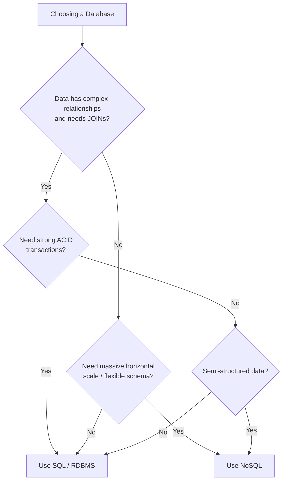

Decision নেওয়ার সময় সাধারণত এই প্রশ্নগুলো জিজ্ঞেস করা হয়:
- Data এর মধ্যে কি অনেক **relationship** আছে যেগুলো বারবার **JOIN** করে query করতে হবে? — হলে SQL এর দিকে ঝুঁকুন।
- Transaction এ কি **strong consistency/ACID** দরকার (যেমন banking)? — হলে SQL।
- Scale কি massive (millions/billions of records, huge write throughput) এবং schema flexible রাখা দরকার? — হলে NoSQL।
- Team এর existing expertise এবং tooling কী নিয়ে বেশি comfortable?

বাস্তবে অনেক বড় system **polyglot persistence** ব্যবহার করে — অর্থাৎ একই system এ একাধিক ধরনের database ব্যবহার করা, যেমন user account এর জন্য PostgreSQL (relational), session cache এর জন্য Redis (key-value), এবং product search এর জন্য Elasticsearch।

### What workloads favor a relational database?

Relational database (SQL) সেই workload গুলোর জন্য সবচেয়ে ভালো, যেখানে **data integrity**, **complex relationship**, এবং **transactional guarantee** সবচেয়ে গুরুত্বপূর্ণ। যেমন:

- **Financial/banking system** — যেখানে টাকা transfer এর মতো operation এ কোনো partial failure মানা যাবে না; পুরো transaction হয় সম্পূর্ণ হবে, নয়তো একদমই হবে না (atomicity)।
- **E-commerce order management** — Order, inventory, payment, shipping — এই সবগুলো entity এর মধ্যে জটিল relationship থাকে এবং তাদের মধ্যে consistency বজায় রাখা critical (যেমন একই product দুইজন কে বিক্রি হয়ে গেলে inventory ভুল হয়ে যাবে)।
- **ERP/HR system** — Employee, department, payroll, leave management — এসবের মধ্যে অনেক structured relationship থাকে যা relational model এ সহজে express করা যায়।
- **Reporting/analytics যেখানে complex JOIN দরকার** — যেমন "গত মাসে কোন region এ কোন product category সবচেয়ে বেশি বিক্রি হয়েছে" — এই ধরনের multi-table JOIN SQL এ খুব efficient।

সংক্ষেপে বললে — যদি আপনার application এ **"data সঠিক থাকাটাই সবচেয়ে গুরুত্বপূর্ণ"** এবং data এর মধ্যে অনেক structured relationship থাকে, তাহলে relational database উপযুক্ত পছন্দ।

### When is a document store (MongoDB) better than a key-value store (Redis)?

Document store এবং key-value store — দুটোই NoSQL এর আন্ডারে পড়ে, কিন্তু তাদের use case ভিন্ন।

**Key-value store (Redis)** best fit যখন:
- আপনার শুধু **simple lookup by key** দরকার — value এর ভেতরের structure নিয়ে query করার দরকার নেই।
- **Extremely low latency** দরকার (Redis in-memory, তাই সাব-মিলিসেকেন্ড latency দেয়)।
- Use case গুলো হলো — **session storage**, **caching layer**, **rate limiting counter**, **leaderboard (sorted sets)**, **pub/sub messaging**।

```javascript
// Redis: শুধু key দিয়ে value get/set করা — value এর ভেতরে query করা যায় না
await redis.set(`session:${userId}`, JSON.stringify(sessionData), 'EX', 3600);
const session = JSON.parse(await redis.get(`session:${userId}`));
```

**Document store (MongoDB)** best fit যখন:
- Data টা **semi-structured**, এবং আপনার document এর ভেতরের নির্দিষ্ট field দিয়ে **query, filter, sort, aggregate** করার দরকার আছে।
- Schema টা **evolve** করতে পারে সময়ের সাথে সাথে (flexible schema)।
- Use case গুলো হলো — **product catalog** (যেখানে প্রতিটা product এর ভিন্ন ভিন্ন attribute থাকতে পারে), **content management system**, **user profile with nested data**।

```javascript
// MongoDB: document এর ভেতরের field দিয়ে query করা যায়
db.products.find({
  category: "electronics",
  price: { $lt: 50000 },
  "specs.ram": { $gte: 8 }
}).sort({ price: 1 });
```

সংক্ষেপে: **Redis = দ্রুত, simple key→value access; MongoDB = richer query capability সহ structured/semi-structured document storage।** অনেক সময় দুটোই একসাথে ব্যবহার হয় — MongoDB কে source of truth হিসেবে, আর Redis কে তার উপর caching layer হিসেবে।

### What does ACID compliance mean and why does it matter?

**ACID** হলো চারটা property যা নিশ্চিত করে যে database transaction গুলো reliable ভাবে process হচ্ছে:

- **Atomicity (A)** — একটা transaction এর সব operation হয় সম্পূর্ণভাবে সফল হবে, নয়তো একটাও হবে না ("all or nothing")। যেমন ব্যাংক transfer এ, টাকা এক account থেকে কাটা এবং অন্য account এ যোগ হওয়া — দুটোই হবে, অথবা কোনোটাই হবে না।
- **Consistency (C)** — Transaction এর আগে এবং পরে database সবসময় একটা valid state এ থাকবে, কোনো constraint (যেমন foreign key, unique constraint) ভঙ্গ হবে না।
- **Isolation (I)** — একই সাথে চলা multiple transaction একে অপরকে প্রভাবিত করবে না, যেন তারা sequentially চলছে (যদিও বাস্তবে parallel চলে)।
- **Durability (D)** — একবার transaction commit হয়ে গেলে, সেই data permanently save থাকবে, এমনকি সাথে সাথে power failure বা crash হলেও।

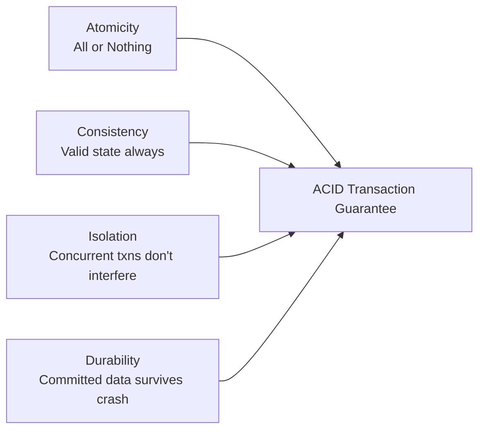

এটা গুরুত্বপূর্ণ কারণ, ACID compliance ছাড়া, distributed বা concurrent environment এ data corruption, lost update, বা inconsistent state হওয়ার ঝুঁকি থাকে। যেমন ACID ছাড়া, দুইজন একসাথে একই bank account থেকে টাকা তুললে দুইবারই সফল হয়ে যেতে পারে (race condition), যা বাস্তবে বিপর্যয়কর। তাই যেকোনো financial বা critical transaction এ ACID compliant database (যেমন PostgreSQL, MySQL with InnoDB) ব্যবহার করা হয়।

---

## 14. What are the different types of NoSQL databases and their use cases?

NoSQL মূলত একটা umbrella term, যার আন্ডারে কয়েক ধরনের ভিন্ন data model আছে — প্রতিটার নিজস্ব strength এবং use case। প্রধান চারটা category হলো:

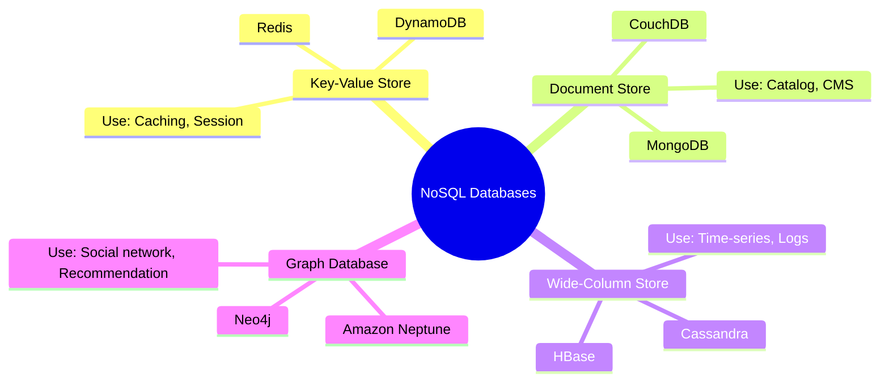

| Type | Example | Data Model | Best Use Case |
|---|---|---|---|
| Key-Value | Redis, DynamoDB | Simple key → value | Caching, session, rate limiting |
| Document | MongoDB, CouchDB | JSON-like nested document | Catalog, CMS, user profile |
| Wide-Column | Cassandra, HBase | Column families, rows with dynamic columns | Time-series, write-heavy logs |
| Graph | Neo4j, Neptune | Nodes and edges/relationships | Social network, fraud detection, recommendation |

### When do you use a wide-column store like Cassandra vs a document store like MongoDB?

**Cassandra (wide-column store)** সেরা যখন:
- আপনার **massive write throughput** দরকার এবং data **write-heavy** (যেমন IoT sensor data, log/event ingestion, time-series metrics)।
- Multi-datacenter/multi-region এ **linear horizontal scalability** দরকার, এবং **no single point of failure** (Cassandra এর masterless architecture এ প্রতিটা node সমান)।
- Query pattern predictable এবং আগে থেকে জানা (Cassandra তে query design করেই table তৈরি করতে হয়, ad-hoc query কম efficient)।
- Availability সবচেয়ে বেশি গুরুত্বপূর্ণ (AP system, CAP theorem অনুযায়ী), এবং eventual consistency acceptable।

**MongoDB (document store)** সেরা যখন:
- আপনার data এর structure **flexible/nested** এবং query pattern কম predictable, **ad-hoc query** বেশি প্রয়োজন (rich querying, aggregation pipeline, secondary index)।
- Application development এ দ্রুত iterate করতে হয় এবং schema প্রায়ই বদলাতে পারে।
- Data relationship মাঝারি পর্যায়ের (কিছুটা nested/embedded document দিয়ে handle করা যায়, কিন্তু খুব বেশি জটিল relational query দরকার নেই)।

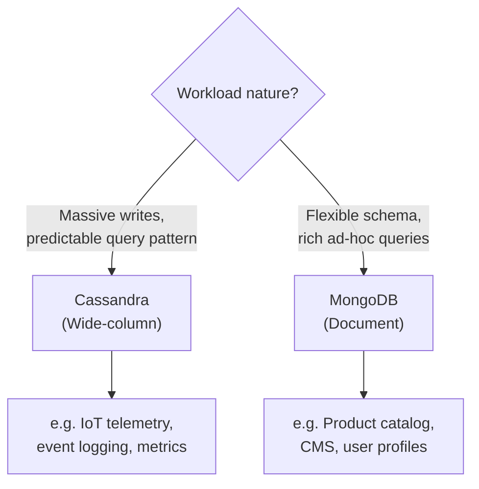

সংক্ষেপে: **write-heavy + predictable query + massive scale → Cassandra; flexible schema + rich querying + moderate scale → MongoDB।**

### What is a time-series database and when is it appropriate?

**Time-series database (TSDB)** হলো এমন একটা database যা বিশেষভাবে optimize করা হয়েছে **timestamp-indexed data** store এবং query করার জন্য — যেখানে data পয়েন্ট গুলো ধারাবাহিকভাবে সময়ের সাথে আসতে থাকে। উদাহরণ: **InfluxDB, TimescaleDB, Prometheus**।

এগুলো appropriate যখন:
- Data মূলত **append-only** এবং সময়ের সাথে ordered (যেমন server CPU usage প্রতি সেকেন্ডে, IoT sensor reading প্রতি মিনিটে, stock price প্রতি মুহূর্তে)।
- Query pattern গুলো মূলত time-range based aggregation — যেমন "গত ১ ঘণ্টার average CPU usage", "গত ৭ দিনের daily active user count"।
- **Data retention/downsampling** দরকার — পুরনো data automatically কম granularity তে convert করে বা delete করে দেওয়া (যেমন ১ দিনের পুরনো data সেকেন্ড-লেভেল রাখা, কিন্তু ১ বছরের পুরনো data শুধু daily average রাখা)।

```sql
-- TimescaleDB (PostgreSQL extension) example: hourly average CPU usage
SELECT time_bucket('1 hour', timestamp) AS hour,
       AVG(cpu_usage) AS avg_cpu
FROM server_metrics
WHERE timestamp > NOW() - INTERVAL '24 hours'
GROUP BY hour
ORDER BY hour;
```

Time-series database সাধারণ relational database এর তুলনায় অনেক বেশি efficient এই ধরনের workload এ, কারণ এদের internal storage engine specifically optimize করা হয়েছে sequential time-based write এবং range-query এর জন্য (যেমন column-oriented compression, automatic partitioning by time)।

### What is a graph database and what problems does it solve?

**Graph database** এমনভাবে data store করে যেখানে **nodes (entities)** এবং তাদের মধ্যে **edges (relationships)** কে first-class citizen হিসেবে treat করা হয় — relational database এর মতো JOIN দিয়ে relationship বের করতে হয় না, বরং relationship টাই সরাসরি traverse করা যায়। উদাহরণ: **Neo4j, Amazon Neptune, ArangoDB**।

এটা যেসব সমস্যা সমাধান করে:

- **Social network** — "আমার friend-of-friend কারা?" বা "দুইজন user এর মধ্যে সবচেয়ে ছোট connection path কী?" — এই ধরনের multi-hop relationship query relational database এ অনেক জটিল এবং slow (multiple JOIN দরকার হয়), কিন্তু graph database এ এটা native এবং দ্রুত।
- **Recommendation engine** — "যারা এই product কিনেছে, তারা আর কী কিনেছে?" — graph traversal দিয়ে সহজে বের করা যায়।
- **Fraud detection** — Transaction network এ suspicious pattern (যেমন একই device/card দিয়ে অনেক account এর মধ্যে টাকা ঘোরাফেরা) detect করা, যেখানে relationship এর pattern টাই মূল signal।
- **Knowledge graph** — Entity গুলোর মধ্যে জটিল semantic relationship represent করা (যেমন Google এর knowledge graph)।

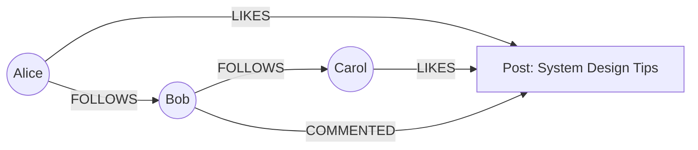

উদাহরণ Cypher query (Neo4j):

```cypher
// Alice এর friend-of-friend খুঁজে বের করা, যারা এখনো Alice এর friend না
MATCH (alice:User {name: "Alice"})-[:FOLLOWS]->(friend)-[:FOLLOWS]->(fof)
WHERE NOT (alice)-[:FOLLOWS]->(fof) AND fof <> alice
RETURN DISTINCT fof.name
```

সংক্ষেপে: যখনই আপনার core problem হলো **"entity গুলোর মধ্যে relationship/connection বিশ্লেষণ করা"**, তখন graph database সবচেয়ে natural এবং performant পছন্দ।

---

## 15. What is database replication and what are the different replication strategies?

**Database replication** হলো একই data কে একাধিক server/node এ copy রাখার প্রক্রিয়া। এর মূল উদ্দেশ্য হলো — **high availability** (একটা server down হলে অন্যটা কাজ চালাবে), **fault tolerance** (data loss এড়ানো), এবং **read scalability** (read traffic multiple replica তে ভাগ করে দেওয়া)।

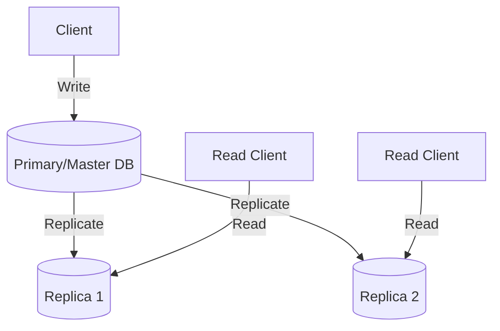

### What is the difference between synchronous and asynchronous replication?

**Synchronous replication**: Primary node তখনই write কে "successful" বলে confirm করে যখন কমপক্ষে একটা (বা সব) replica সেই data receive করে নিশ্চিত করে। এতে **data loss এর ঝুঁকি একদম কম** (strong consistency), কিন্তু **write latency বেড়ে যায়** কারণ replica এর response এর জন্য অপেক্ষা করতে হয়। Network partition বা replica slow হলে পুরো write operation ধীর বা block হয়ে যেতে পারে।

**Asynchronous replication**: Primary node write কে সাথে সাথেই "successful" বলে confirm করে দেয়, replica তে data পরে (কিছু delay এর সাথে) পাঠানো হয়। এতে **write latency কম** থাকে, কিন্তু primary crash হলে যে data এখনো replica তে পৌঁছায়নি সেটা **হারিয়ে যেতে পারে** (data loss ঝুঁকি)।

| Aspect | Synchronous | Asynchronous |
|---|---|---|
| Write latency | বেশি (replica wait করতে হয়) | কম (immediate confirm) |
| Data loss risk | কম/নেই | সামান্য ঝুঁকি আছে |
| Availability | Replica slow হলে impact পড়ে | Primary independent ভাবে কাজ করে |
| Use case | Financial system, critical data | High-throughput system, social media |

### What is master-slave vs master-master replication?

**Master-slave (Primary-replica) replication**: একটা মাত্র **master/primary node** সব **write** handle করে, এবং এক বা একাধিক **slave/replica node** শুধু master থেকে data replicate করে এবং **read** request serve করে। এটা simple, conflict-free (কারণ শুধু একটা জায়গায় write হয়), কিন্তু master একটা bottleneck এবং single point of failure হতে পারে যদি failover automated না থাকে।

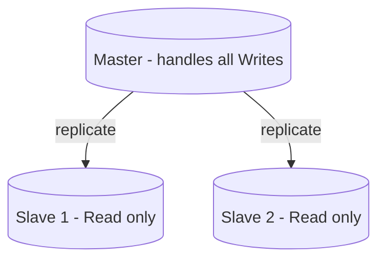

**Master-master (Multi-master) replication**: একাধিক node **write** handle করতে পারে, এবং তারা একে অপরের সাথে sync হয়। এটা write scalability এবং availability বাড়ায় (কোনো একটা master down হলেও অন্যটা write নিতে পারে), কিন্তু **write conflict** এর সমস্যা তৈরি করে — যদি দুইটা master একই record একই সময়ে ভিন্নভাবে update করে, তাহলে conflict resolution strategy (যেমন last-write-wins, vector clocks, বা application-level merge logic) দরকার হয়।

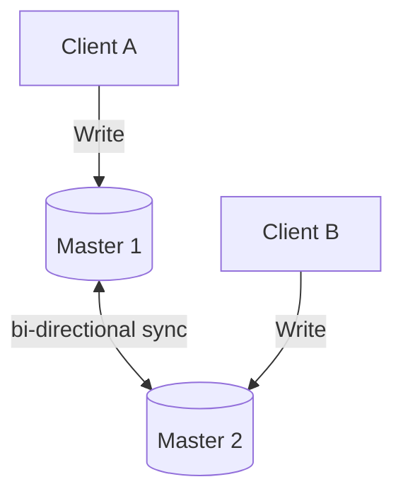

| Aspect | Master-Slave | Master-Master |
|---|---|---|
| Write scalability | সীমিত (একটাই master) | ভালো (একাধিক master) |
| Complexity | কম | বেশি (conflict resolution লাগে) |
| Conflict risk | নেই | আছে |
| Failover | Manual/automated promotion লাগে | Built-in redundancy |

### How does replication lag affect system behavior?

**Replication lag** হলো primary তে একটা write হওয়ার পর সেটা replica তে পৌঁছাতে যে সময় লাগে (asynchronous replication এ এটা সাধারণ)। এই lag এর কারণে কিছু practical সমস্যা হতে পারে:

- **Read-after-write inconsistency** — একজন user কিছু update করার সাথে সাথে (যেমন profile picture change) যদি সাথে সাথেই সেটা replica থেকে read করে, তাহলে সে পুরনো data দেখতে পারে, কারণ update এখনো replica তে পৌঁছায়নি। এটা user experience এ confusing মনে হতে পারে ("আমি তো change করলাম, কিন্তু এখনো পুরনো data দেখাচ্ছে কেন?")।
- **Stale reads** — Analytics বা reporting যদি replica থেকে পড়া হয়, তাহলে সেটা কয়েক সেকেন্ড/মিনিট পুরনো data দেখাতে পারে।

এই সমস্যা handle করার কিছু strategy:

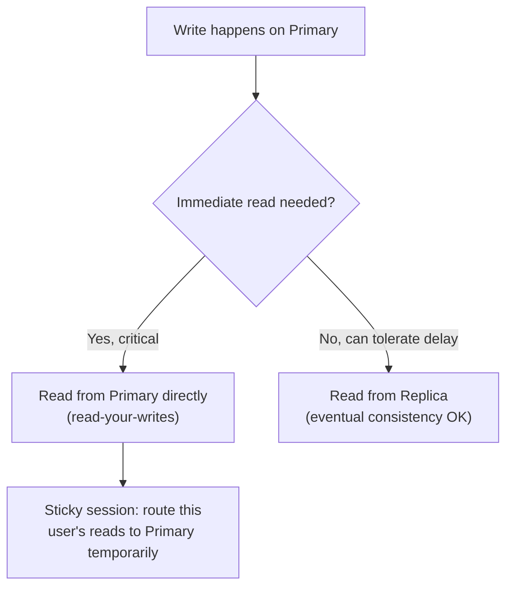

- **Read-your-writes consistency**: গুরুত্বপূর্ণ operation এর পরে, ওই নির্দিষ্ট user এর জন্য কিছুক্ষণের জন্য primary থেকে read করা (routing override), যাতে সে নিজের update সাথে সাথেই দেখতে পায়।
- **Monitoring replication lag**: Lag কে metric হিসেবে track করা, এবং একটা threshold এর বেশি lag হলে alert করা বা সেই replica কে load balancer থেকে সাময়িকভাবে বাদ দেওয়া।
- **Application-level tolerance**: যেসব জায়গায় সামান্য delay acceptable (যেমন "likes count", "view count"), সেখানে replica read ব্যবহার করা নিশ্চিন্তে।

---

## 16. What is database indexing and how does it improve query performance?

**Database index** হলো একটা আলাদা data structure (সাধারণত **B-tree** বা **hash table**) যা একটা বা একাধিক column এর উপর তৈরি করা হয়, যাতে সেই column দিয়ে query করলে পুরো table না ঘেঁটেই (full table scan এড়িয়ে) দ্রুত সঠিক row খুঁজে বের করা যায়।

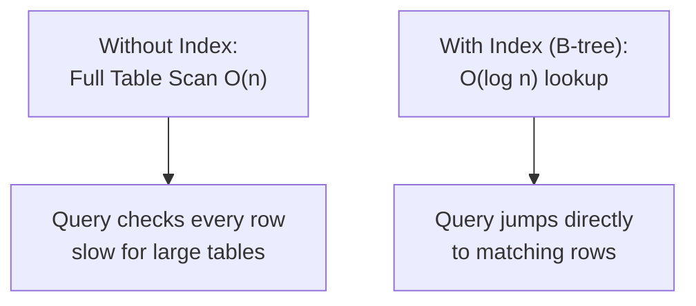

উদাহরণ:

```sql
-- Index ছাড়া: email দিয়ে user খুঁজতে পুরো table scan হবে (O(n))
SELECT * FROM users WHERE email = 'alice@example.com';

-- Index তৈরি করলে দ্রুত lookup হবে (O(log n))
CREATE INDEX idx_users_email ON users(email);
```

Index এর সুবিধা হলো read/query performance অনেক দ্রুত হয়, কিন্তু এর একটা trade-off আছে — প্রতিটা **write (INSERT/UPDATE/DELETE)** operation এ index টাও আপডেট করতে হয়, তাই write সামান্য ধীর হয়ে যায় এবং extra storage লাগে।

### What is the difference between a clustered and non-clustered index?

**Clustered index**: এটা নির্ধারণ করে দেয় table এর actual data **physically কীভাবে disk এ sorted/stored থাকবে** — অর্থাৎ index এবং data একই জায়গায় একসাথে থাকে। একটা table এ **শুধু একটাই clustered index** থাকতে পারে (কারণ data physically একভাবেই sort করা যায়)। সাধারণত **primary key** এর উপর automatically clustered index তৈরি হয়।

**Non-clustered index**: এটা data থেকে আলাদা একটা structure, যেখানে index entry গুলোতে actual row এর একটা **pointer/reference** থাকে (clustered index হলে সেই pointer, নাহলে row এর physical location)। একটা table এ **একাধিক non-clustered index** থাকতে পারে।

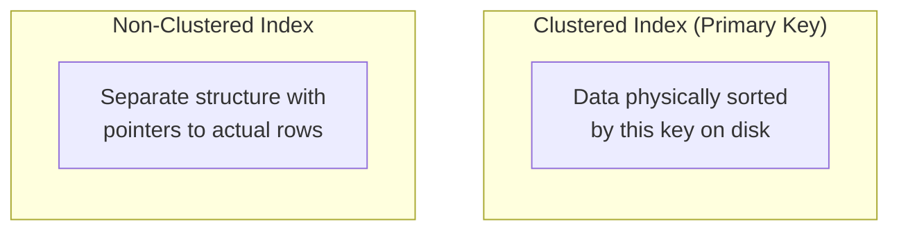

| Aspect | Clustered Index | Non-Clustered Index |
|---|---|---|
| Count per table | সর্বোচ্চ ১টা | একাধিক থাকতে পারে |
| Data storage | Index অনুযায়ী data physically sorted | Data আলাদা, index এ শুধু pointer |
| Lookup speed | দ্রুততর (data ও index একসাথে) | সামান্য ধীর (extra pointer lookup লাগে) |
| Typical use | Primary key | Frequently searched non-primary columns |

### What are the downsides of over-indexing a database?

অনেকগুলো index তৈরি করলে read performance বাড়লেও, কিছু গুরুত্বপূর্ণ downside আছে:

- **Write performance কমে যায়** — প্রতিটা INSERT/UPDATE/DELETE এ সব index update করতে হয়, তাই যত বেশি index, তত বেশি write overhead। Write-heavy system এ এটা বড় সমস্যা তৈরি করতে পারে।
- **Storage cost বাড়ে** — প্রতিটা index এর জন্য আলাদা storage লাগে, যা কখনো কখনো original table data এর সমান বা তার চেয়েও বেশি জায়গা নিতে পারে।
- **Query planner confusion** — অনেক বেশি index থাকলে database এর query optimizer সবসময় সবচেয়ে ভালো index বেছে নাও নিতে পারে, যা suboptimal execution plan তৈরি করতে পারে।
- **Maintenance overhead** — Index গুলো periodically rebuild/reorganize করতে হতে পারে (fragmentation এড়াতে), যা extra operational কাজ।

সাধারণ guideline: শুধু সেই column গুলোতে index তৈরি করুন যেগুলো **frequently WHERE, JOIN, ORDER BY, GROUP BY** তে ব্যবহার হয়, এবং high **cardinality** আছে (অর্থাৎ column এ অনেক unique value আছে, যেমন email — কিন্তু "gender" এর মতো low-cardinality column এ index তেমন কার্যকরী না)।

### What is a composite index and when should you use one?

**Composite index (multi-column index)** হলো একাধিক column মিলিয়ে তৈরি করা একটা single index। যেমন:

```sql
CREATE INDEX idx_orders_user_status ON orders(user_id, status);
```

এটা তখন ব্যবহার করা উচিত যখন আপনার query গুলো **একাধিক column একসাথে filter/sort** করে থাকে। যেমন:

```sql
-- এই query composite index (user_id, status) কে পুরোপুরি ব্যবহার করতে পারবে
SELECT * FROM orders WHERE user_id = 123 AND status = 'pending';
```

একটা গুরুত্বপূর্ণ নিয়ম হলো — **column order matter করে** composite index এ। Index এ যে column আগে আছে, সেটা দিয়ে filter করলেই শুধু index কার্যকরভাবে ব্যবহার হবে (এটাকে **leftmost prefix rule** বলা হয়)।

```sql
-- এই index দিয়ে কাজ করবে (leftmost column user_id দিয়ে filter)
SELECT * FROM orders WHERE user_id = 123;

-- কিন্তু এটা কার্যকরভাবে index ব্যবহার করবে না (leftmost column skip করা হয়েছে)
SELECT * FROM orders WHERE status = 'pending';
```

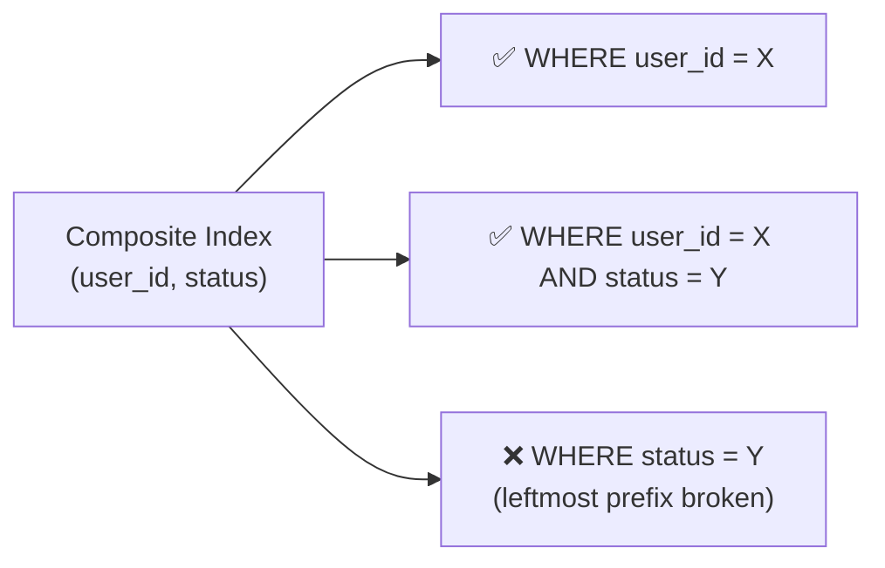

তাই composite index design করার সময়, আপনার সবচেয়ে common query pattern গুলো বিশ্লেষণ করে সেই অনুযায়ী column এর order ঠিক করা উচিত — সাধারণত **equality filter এর column আগে, range filter এর column পরে** রাখা হয়।

---

## 17. What is the CAP theorem?

**CAP theorem** (Eric Brewer প্রস্তাবিত) বলে যে, একটা distributed system একসাথে নিচের তিনটা property **সম্পূর্ণভাবে** guarantee করতে পারে না — সর্বোচ্চ যেকোনো দুইটা:

- **Consistency (C)** — প্রতিটা read সবসময় সর্বশেষ (most recent) write এর data রিটার্ন করবে, অথবা error দেবে।
- **Availability (A)** — প্রতিটা request একটা (non-error) response পাবে, যদিও সেটা সর্বশেষ data নাও হতে পারে।
- **Partition Tolerance (P)** — Network এর কোনো অংশে communication বিচ্ছিন্ন (partition) হয়ে গেলেও system কাজ চালিয়ে যেতে পারবে।

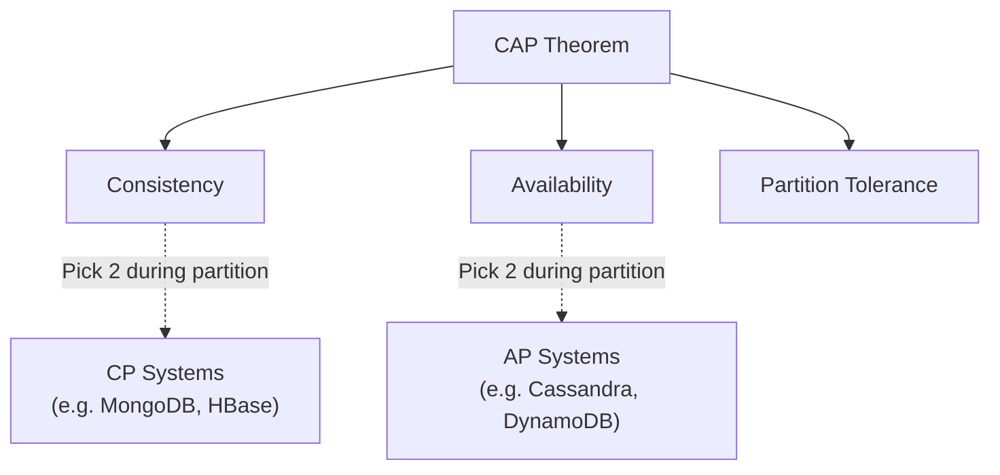

### Can a distributed system be both consistent and available at the same time?

হ্যাঁ, **normal operation এর সময়** (যখন কোনো network partition নেই), একটা distributed system একই সাথে consistent এবং available থাকতে পারে — এটাই স্বাভাবিক অবস্থা। CAP theorem এর trade-off টা আসলে শুধুমাত্র **network partition ঘটলেই** প্রযোজ্য হয়। অর্থাৎ, বাস্তবে প্রশ্নটা হলো — "যখন network partition ঘটবে (এবং distributed system এ এটা কখনো না কখনো ঘটবেই), তখন আপনি C নাকি A বেছে নেবেন?" — এটাই আসল decision point, প্রতিদিনকার normal operation এ না।

### What does partition tolerance mean in practice?

**Partition tolerance** মানে হলো, network এর কোনো অংশ যদি বিচ্ছিন্ন হয়ে যায় (যেমন দুইটা datacenter এর মধ্যে network link কেটে যাওয়া, অথবা কিছু node এর মধ্যে communication fail করা), তাহলেও system সম্পূর্ণভাবে বন্ধ হয়ে না গিয়ে **কোনো না কোনোভাবে কাজ চালিয়ে যাবে**।

বাস্তবে, distributed system এ network failure/partition **অবশ্যম্ভাবী** (inevitable) — network cable কাটতে পারে, switch fail করতে পারে, datacenter এর মধ্যে latency spike হতে পারে। তাই **P (Partition tolerance)** কে বাস্তবে "optional" ভাবা যায় না, এটা distributed system এর জন্য প্রায় সবসময়ই **must-have**। এই কারণে CAP theorem এর practical আলোচনা মূলত **C vs A** কেন্দ্রিক হয়, কারণ P সবসময় present থাকবে ধরে নেওয়া হয়।

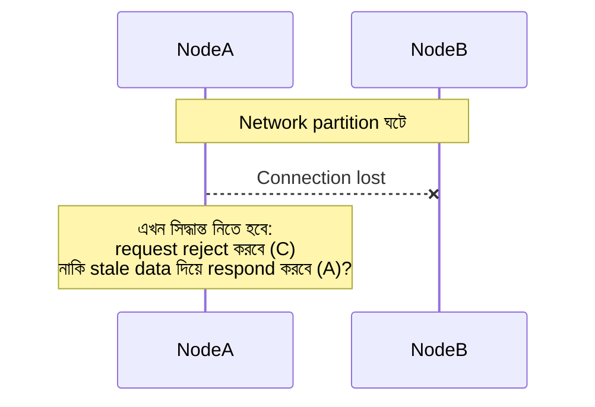

### Which databases choose CP and which choose AP?

| Category | Databases | Behavior during Partition |
|---|---|---|
| **CP (Consistency + Partition Tolerance)** | MongoDB (default config), HBase, Zookeeper, Redis (with sentinel/cluster in strict mode), etcd | Partition হলে minority side এর node গুলো request reject করে বা unavailable হয়ে যায়, যাতে stale/wrong data না দেখায় |
| **AP (Availability + Partition Tolerance)** | Cassandra, DynamoDB, CouchDB, Riak | Partition হলেও সব node request accept করতে থাকে, পরে data eventually sync/reconcile হয় |

উল্লেখ্য, অনেক আধুনিক database (যেমন MongoDB, Cassandra) actually **tunable consistency** দেয় — অর্থাৎ per-query ভিত্তিতে আপনি বেছে নিতে পারেন কতটা consistency বনাম availability চান (যেমন Cassandra তে **quorum-based read/write** কনফিগার করা যায়)। তাই বাস্তবে এটা একদম black-and-white না, বরং একটা spectrum।

---

## 18. What is eventual consistency and when is it acceptable?

**Eventual consistency** হলো একটা consistency model যেখানে, কোনো write operation এর পর, system এর সব replica **সাথে সাথে** sync না হয়ে, বরং **কিছু সময় পরে (eventually)** সব replica একই data তে converge/একমত হয় — যদি নতুন কোনো write না আসে। এই মডেলে সাময়িকভাবে কিছু replica থেকে **stale/পুরনো data** পাওয়া সম্ভব।

### What is the difference between strong consistency, eventual consistency, and causal consistency?

- **Strong consistency**: একটা write সম্পন্ন হওয়ার সাথে সাথেই, **সব পরবর্তী read** (যেকোনো node থেকে) অবশ্যই সেই সর্বশেষ write এর data দেখাবে। এটা নিশ্চিত করার জন্য synchronous coordination দরকার, যা latency বাড়ায় এবং availability কমাতে পারে (partition এর সময়)।
- **Eventual consistency**: Write এর পর replica গুলো immediately sync না হলেও, সময়ের সাথে সাথে (নতুন write না এলে) সব replica একই final state এ পৌঁছাবে। এতে latency কম কিন্তু temporarily inconsistent read সম্ভব।
- **Causal consistency**: এটা এই দুইয়ের মাঝামাঝি একটা মডেল — যেসব operation একটা অপরটার সাথে **causally related** (যেমন প্রথমে একটা comment post হলো, তারপর তার reply এলো), সেগুলো সবার কাছে একই order এ দেখাবে। কিন্তু যেসব operation একে অপরের সাথে সম্পর্কহীন (concurrent, unrelated), সেগুলো ভিন্ন order এ দেখালেও সমস্যা নেই।

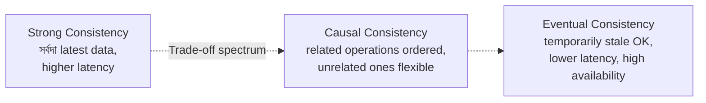

### How does Amazon DynamoDB implement eventual consistency?

DynamoDB ডিফল্টভাবে **eventually consistent reads** প্রদান করে, তবে প্রয়োজনে **strongly consistent reads** ও option হিসেবে দেয় (per-request ভিত্তিতে choose করা যায়, তবে strongly consistent read এ latency বেশি এবং cost বেশি)।

DynamoDB এর ভেতরে data একাধিক **replica (সাধারণত ৩টা)** তে store হয়, বিভিন্ন Availability Zone এ:

- **Eventually consistent read**: যেকোনো একটা replica থেকে read করা হয় — এটা দ্রুততর এবং সস্তা, কিন্তু সাম্প্রতিকতম write এখনো reflect নাও হতে পারে (সাধারণত ১ সেকেন্ডের কম delay এ sync হয়ে যায়)।
- **Strongly consistent read**: এটা নিশ্চিত করে যে সব successful write এর পরের read সবসময় latest data দেখাবে — এর জন্য majority replica এর সাথে coordinate করতে হয়, তাই latency ও cost বেশি।

```javascript
// DynamoDB: strongly consistent read explicitly request করা
const params = {
  TableName: "Orders",
  Key: { orderId: "12345" },
  ConsistentRead: true // default false (eventually consistent)
};
const result = await dynamoDb.get(params).promise();
```

### What real-world scenarios can tolerate eventual consistency?

Eventual consistency অনেক real-world scenario তে সম্পূর্ণভাবে acceptable, বিশেষ করে যেখানে সামান্য delay এ ব্যবসায়িক ক্ষতি হয় না:

- **Social media like/view count** — কারো post এ "like" count কয়েক সেকেন্ড দেরিতে update হলে user সেটা খেয়ালও করবে না।
- **Product review/rating** — একটা নতুন review সাথে সাথে সব user এর কাছে দেখানো না গেলেও কোনো সমস্যা নেই।
- **Shopping cart** — Amazon এর মতো বড় e-commerce এ shopping cart eventual consistency তে চলে, কারণ availability (সবসময় cart এ item add করা যাবে) বেশি গুরুত্বপূর্ণ পুরোপুরি real-time sync এর চেয়ে।
- **DNS (Domain Name System)** — DNS পরিবর্তন সারা বিশ্বে propagate হতে কিছু সময় (TTL অনুযায়ী মিনিট থেকে ঘণ্টা) লাগে, এটা eventual consistency এর একটা classic উদাহরণ।
- **Search index update** — কোনো নতুন product/document add করার পর সেটা search result এ কয়েক সেকেন্ড/মিনিট দেরিতে দেখা গেলেও সাধারণত acceptable।

তবে **inventory count** (যেখানে overselling সমস্যা হতে পারে) বা **financial balance** এর মতো জায়গায় eventual consistency ব্যবহার করলে বাস্তব ব্যবসায়িক ক্ষতি হতে পারে, তাই সেখানে strong consistency দরকার।

---

## 19. What is ACID vs BASE and how do they apply to system design?

**ACID** এবং **BASE** হলো database consistency model এর দুইটা বিপরীতমুখী দর্শন (philosophy) — ACID মূলত traditional relational database এর সাথে যুক্ত (strong guarantee), আর BASE মূলত distributed NoSQL system এর সাথে যুক্ত (availability-focused)।

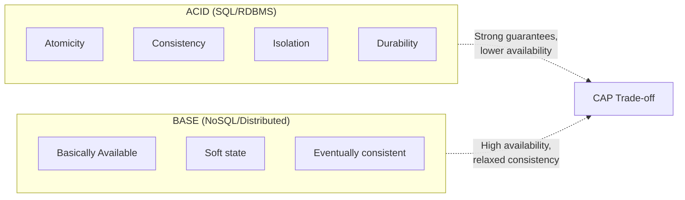

### What does BASE stand for?

**BASE** হলো তিনটা শব্দের সংক্ষিপ্ত রূপ:

- **Basically Available (BA)** — System সবসময় response দেওয়ার চেষ্টা করবে (যদিও সেটা সবসময় সবচেয়ে latest/সঠিক data নাও হতে পারে), পুরোপুরি unavailable হয়ে যাওয়ার বদলে।
- **Soft state (S)** — System এর state সময়ের সাথে সাথে বদলাতে পারে, এমনকি নতুন কোনো input ছাড়াই (কারণ eventual consistency এর কারণে replica গুলো background এ sync হতে থাকে)।
- **Eventually consistent (E)** — যথেষ্ট সময় পার হলে (এবং নতুন write না এলে), সব replica একই data তে converge করবে।

BASE model মূলত trade করে **strong consistency কে availability এবং partition tolerance এর জন্য** — এটাই CAP theorem এর AP দিকের practical বাস্তবায়ন।

### How do you achieve ACID guarantees in a distributed system?

Single-node database এ ACID achieve করা তুলনামূলক সহজ (একটাই database engine সব manage করে), কিন্তু **distributed system এ ACID achieve করা অনেক challenging**, কারণ multiple node এর মধ্যে coordination দরকার হয়। কিছু common approach:

- **Two-Phase Commit (2PC)** — একটা coordinator node সব participant node কে জিজ্ঞেস করে তারা transaction commit করতে প্রস্তুত কিনা (**prepare phase**), সবাই "yes" বললেই তাদের সবাইকে commit করতে বলা হয় (**commit phase**)। যদি কেউ "no" বলে বা fail করে, সবাইকে rollback করতে বলা হয়। এটা strong consistency দেয়, কিন্তু coordinator fail করলে system block হয়ে যেতে পারে (blocking protocol), এবং latency বেশি।

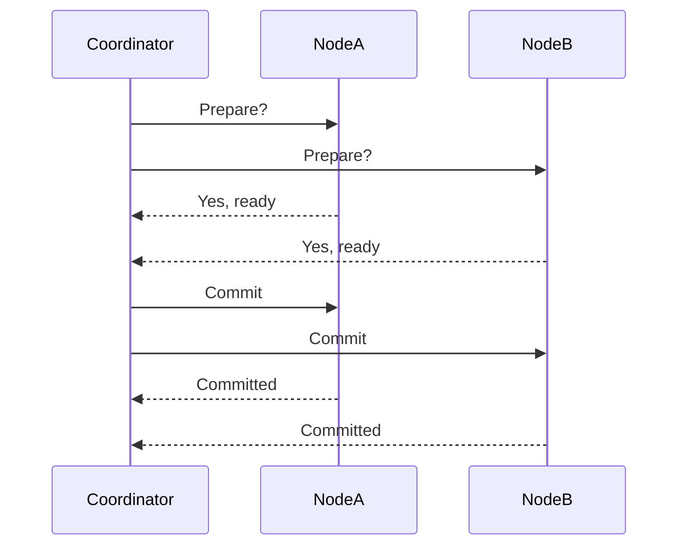

- **Distributed consensus algorithm (Raft, Paxos)** — এই algorithm গুলো ব্যবহার করে multiple node এর মধ্যে একটা agreement/consensus তৈরি করা হয়, যা leader election এবং log replication এর মাধ্যমে consistency নিশ্চিত করে (যেমন etcd, Zookeeper এই ধরনের algorithm ব্যবহার করে)।
- **Saga pattern** — Distributed transaction কে ছোট ছোট local transaction এ ভেঙে ফেলা হয়, প্রতিটা local transaction এর জন্য একটা **compensating transaction** (যা rollback এর কাজ করে) define করা হয়। যদি কোনো ধাপ fail করে, আগের সফল ধাপ গুলোকে compensating transaction দিয়ে undo করা হয়। এটা 2PC এর চেয়ে বেশি scalable কিন্তু implementation জটিলতা বেশি (eventual consistency মেনে নিতে হয়)।

### What is a distributed transaction and what are its challenges?

**Distributed transaction** হলো এমন একটা transaction যা একাধিক database/service/node এর উপর বিস্তৃত, কিন্তু তাদের সবাইকে একসাথে (atomically) commit বা rollback করতে হয় — যেন এটা একটাই transaction।

উদাহরণ: একটা e-commerce order placement এ — **Order Service** এ order তৈরি হবে, **Inventory Service** এ stock কমবে, এবং **Payment Service** এ টাকা কাটা হবে। এই তিনটা service ভিন্ন ভিন্ন database ব্যবহার করলে, তাদের মধ্যে একটা distributed transaction দরকার হয়।

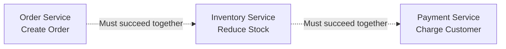

Distributed transaction এর মূল challenge গুলো:

- **Network failure এর ঝুঁকি** — যেকোনো node এর সাথে communication fail হতে পারে মাঝপথে, যার ফলে অনিশ্চিত অবস্থা তৈরি হয় (এই transaction টা কি সফল হয়েছে, নাকি ব্যর্থ?)।
- **Performance overhead** — Multiple node এর মধ্যে coordination করতে extra network round-trip লাগে, যা latency বাড়ায়।
- **Blocking behavior (2PC এর ক্ষেত্রে)** — Coordinator fail করলে participant node গুলো "prepared" অবস্থায় আটকে থাকতে পারে, resource lock করে রেখে, যতক্ষণ না coordinator recover করে।
- **Partial failure handling** — যদি কিছু node সফল হয় আর কিছু ব্যর্থ হয়, তাহলে সফল হওয়া অংশগুলোকে undo/compensate করার জটিল logic দরকার হয় (Saga pattern এর মতো)।

এই কারণেই আধুনিক microservices architecture এ প্রায়ই traditional distributed transaction (2PC) এড়িয়ে **Saga pattern** এর মতো eventual-consistency-based approach ব্যবহার করা হয়, যা বেশি scalable এবং resilient, যদিও এটা strong consistency এর গ্যারান্টি দেয় না।

---

## 20. How do you handle database migrations in a production system?

Production database এ migration (যেমন নতুন column যোগ করা, table structure বদলানো, data type পরিবর্তন) করা একটা ঝুঁকিপূর্ণ কাজ, কারণ ভুল হলে **data loss** বা **downtime** হতে পারে। তাই একটা systematic, careful approach দরকার।

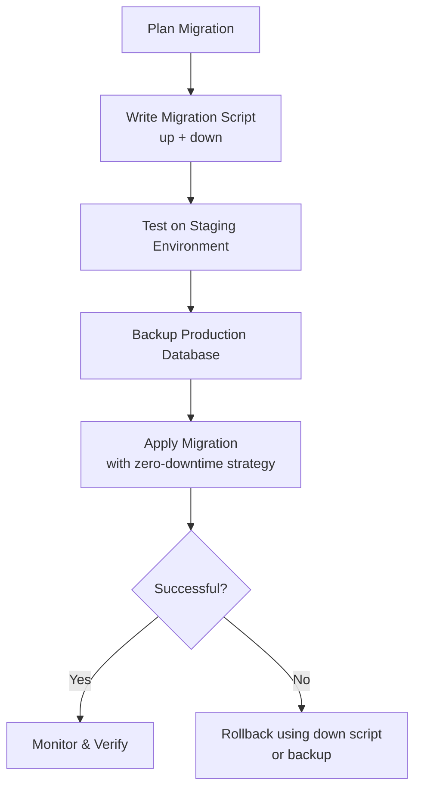

সাধারণ best practices:
- **Backward-compatible migration করা** — যাতে old code এবং new code একই সময়ে (deployment এর সময়) কাজ করতে পারে।
- **Migration কে version control এ রাখা** — Tool যেমন Flyway, Liquibase, বা framework-specific migration tool (Django migrations, Rails migrations) ব্যবহার করা।
- **Staging environment এ প্রথমে test করা**, production এর মতো data volume দিয়ে (যাতে বড় table এ migration কত সময় নেয় সেটা বোঝা যায়)।
- **Backup নেওয়া** migration চালানোর আগে, যাতে দরকার হলে দ্রুত restore করা যায়।

### What is a zero-downtime migration strategy?

Zero-downtime migration মানে হলো, migration চলাকালীন সময়েও application সম্পূর্ণভাবে available এবং functional থাকবে — কোনো user কে service interruption অনুভব করতে হবে না। এর কিছু core principle:

- **Backward compatibility বজায় রাখা** — নতুন schema পুরনো application code এর সাথেও কাজ করবে, এবং নতুন code পুরনো schema এর সাথেও (deployment এর transition period এ)।
- **Additive changes আগে করা** — নতুন column/table যোগ করা (যা কোনো existing functionality ভাঙে না), তারপর ধীরে ধীরে পুরনো অংশ সরানো।
- **Long-running/heavy operation background এ করা** — বড় table এ ALTER TABLE বা index তৈরি করা online/non-blocking mode এ করা (যেমন PostgreSQL এর `CREATE INDEX CONCURRENTLY`, MySQL এর `pt-online-schema-change` tool)।

```sql
-- PostgreSQL: non-blocking index creation, table lock করে না
CREATE INDEX CONCURRENTLY idx_users_email ON users(email);
```

### What is the expand-contract pattern for schema changes?

**Expand-contract pattern** (এটাকে **parallel change** ও বলা হয়) হলো zero-downtime schema migration করার একটা জনপ্রিয় কৌশল, যেখানে migration কে তিনটা পর্যায়ে ভাগ করা হয়:

1. **Expand phase** — নতুন schema element যোগ করা (নতুন column/table), কিন্তু পুরনোটা এখনো রেখে দেওয়া। এই সময় application উভয় (old + new) schema তে read/write করতে সক্ষম থাকে (dual-write)।
2. **Migrate phase** — Existing data কে পুরনো format থেকে নতুন format এ migrate করা (background script দিয়ে), এবং application code কে ধীরে ধীরে নতুন schema ব্যবহার করার জন্য deploy করা।
3. **Contract phase** — একবার নিশ্চিত হওয়ার পর যে সব traffic/code নতুন schema ব্যবহার করছে, পুরনো column/table **remove** করে দেওয়া।

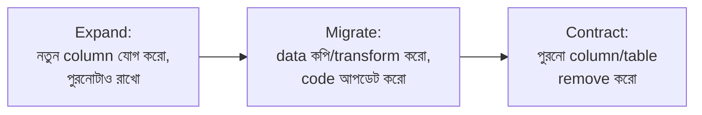

উদাহরণ: `full_name` column কে `first_name` এবং `last_name` এ ভাগ করতে চাইলে:

```sql
-- Phase 1: Expand - নতুন column যোগ করা
ALTER TABLE users ADD COLUMN first_name VARCHAR(100);
ALTER TABLE users ADD COLUMN last_name VARCHAR(100);

-- Phase 2: Migrate - existing data populate করা (background job)
UPDATE users SET
  first_name = split_part(full_name, ' ', 1),
  last_name = split_part(full_name, ' ', 2);
-- এই সময়ে application code deploy হয় যা নতুন column ব্যবহার করে

-- Phase 3: Contract - পুরনো column সরিয়ে ফেলা (সব verify হওয়ার পর)
ALTER TABLE users DROP COLUMN full_name;
```

এই পদ্ধতির সুবিধা হলো, প্রতিটা ধাপ **reversible এবং low-risk**, এবং কোনো একটা সময়ে পুরো system down রাখতে হয় না।

### How do you roll back a failed database migration?

Migration fail করলে দ্রুত এবং নিরাপদে rollback করার জন্য কয়েকটা approach:

- **Down migration script ব্যবহার করা** — প্রতিটা migration এর সাথে একটা corresponding "down" script রাখা উচিত যা exact reverse operation করে (যেমন column add করলে, down script এ সেই column drop করা)।

```javascript
// Example migration file (Node.js, Knex.js style)
exports.up = function(knex) {
  return knex.schema.table('users', (table) => {
    table.string('phone_number');
  });
};

exports.down = function(knex) {
  return knex.schema.table('users', (table) => {
    table.dropColumn('phone_number');
  });
};
```

- **Point-in-time backup থেকে restore করা** — যদি down migration সম্ভব না হয় (যেমন data loss হওয়া কোনো migration এর ক্ষেত্রে), তাহলে migration চালানোর আগে নেওয়া backup থেকে restore করা।
- **Feature flag দিয়ে নতুন code path বন্ধ করা** — যদি migration নিজে সফল হয়েছে কিন্তু নতুন feature এ বাগ থাকে, তাহলে code rollback না করে শুধু feature flag বন্ধ করে দেওয়া, migration undo না করেই।
- **Expand-contract pattern এর সুবিধা নেওয়া** — যদি আপনি expand-contract pattern follow করে থাকেন, rollback অনেক সহজ হয় কারণ পুরনো schema তখনো উপস্থিত থাকে (contract phase এ যাওয়ার আগ পর্যন্ত), তাই শুধু application code কে পুরনো schema তে ফিরিয়ে নিলেই হয়।

গুরুত্বপূর্ণ নীতি: migration কে সবসময় **ছোট ছোট, incremental, এবং reversible ধাপে** ভাগ করে করা উচিত, যাতে কোনো একটা ধাপে সমস্যা হলে পুরো migration rollback করার বদলে শুধু সেই নির্দিষ্ট ধাপটা handle করা যায়।

---

## 21. What is a data warehouse and how does it differ from a transactional database?

**Data warehouse** হলো একটা বিশেষায়িত database system, যা মূলত **বড় পরিমাণ historical data বিশ্লেষণ, রিপোর্টিং, এবং business intelligence** এর জন্য optimize করা হয়েছে — এটা day-to-day transactional operation এর জন্য না, বরং decision-making সাপোর্ট করার জন্য ডিজাইন করা।

Transactional database (OLTP) সাধারণত একটা single application এর real-time operation handle করে, কিন্তু data warehouse বিভিন্ন source (multiple application, external data) থেকে data একত্র করে (**ETL/ELT process** এর মাধ্যমে) একটা centralized জায়গায় রাখে যাতে complex analytical query চালানো যায়।

```mermaid
flowchart LR
    A[(OLTP DB - App 1)] -->|ETL| DW[(Data Warehouse)]
    B[(OLTP DB - App 2)] -->|ETL| DW
    C[External Data Sources] -->|ETL| DW
    DW --> R[Reports & Dashboards]
    DW --> ML[Machine Learning Pipelines]
```

### What is OLTP vs OLAP?

**OLTP (Online Transaction Processing)**: এটা day-to-day operational transaction handle করার জন্য optimize করা — যেমন order placement, user registration, inventory update। এগুলো সাধারণত **ছোট, দ্রুত** transaction, যেখানে অল্প সংখ্যক row read/write হয়, কিন্তু transaction এর সংখ্যা অনেক বেশি (high throughput of small operations)।

**OLAP (Online Analytical Processing)**: এটা complex analytical query চালানোর জন্য optimize করা — যেমন "গত ৩ বছরে region অনুযায়ী মাসিক sales trend কী ছিল?" এই ধরনের query সাধারণত **বিশাল পরিমাণ data scan করে (millions/billions of rows)**, কিন্তু query এর সংখ্যা তুলনামূলক কম (low frequency but heavy computation)।

| Aspect | OLTP | OLAP |
|---|---|---|
| Purpose | Day-to-day operations | Analysis, reporting, decision-making |
| Query type | Simple, short (CRUD) | Complex, aggregation-heavy |
| Data volume per query | Small (few rows) | Large (millions of rows) |
| Schema design | Normalized (avoid redundancy) | Denormalized (star/snowflake schema) |
| Example | PostgreSQL, MySQL | Snowflake, BigQuery, Redshift |
| Update frequency | Real-time, continuous | Batch (periodic ETL loads) |

### When would you use Snowflake, BigQuery, or Redshift?

এই তিনটাই cloud-based **data warehouse** সেবা, এবং সাধারণত ব্যবহার করা হয় যখন:
- আপনার organization এ multiple source থেকে data একত্র করে **cross-functional analytics/reporting** দরকার (যেমন marketing, sales, product data একসাথে বিশ্লেষণ করা)।
- **Business Intelligence (BI) tool** (Tableau, Looker, Power BI) এর সাথে integrate করে dashboard তৈরি করা দরকার।
- Data scientist/analyst দের **ad-hoc, heavy analytical query** চালানোর দরকার যা production OLTP database এ চালালে সেটা slow করে দিতে পারে।

তিনটার মধ্যে পার্থক্য মূলত architecture এবং pricing model এ:

- **Snowflake** — Storage এবং compute সম্পূর্ণভাবে আলাদা (decoupled), যার ফলে flexible scaling সম্ভব; multi-cloud (AWS, Azure, GCP) সাপোর্ট করে; ব্যবহার সহজ এবং maintenance কম।
- **Google BigQuery** — সম্পূর্ণ **serverless**, pay-per-query pricing model (আপনি কত data scan করলেন তার উপর ভিত্তি করে বিল আসে); Google Cloud ecosystem এর সাথে ভালোভাবে integrated (যেমন Google Analytics data সরাসরি export করা যায়)।
- **Amazon Redshift** — AWS ecosystem এর সাথে গভীরভাবে integrated, cluster-based architecture (যদিও Redshift Serverless option ও এখন আছে), যারা ইতিমধ্যে AWS heavy user তাদের জন্য natural choice।

সাধারণ guideline: যদি আপনি ইতিমধ্যে একটা নির্দিষ্ট cloud provider এর ecosystem এ থাকেন (AWS/GCP), তাহলে সেই provider এর native solution (Redshift/BigQuery) বেছে নেওয়া সুবিধাজনক হতে পারে integration এর কারণে। Multi-cloud flexibility বা simpler management চাইলে Snowflake একটা জনপ্রিয় পছন্দ।

### What is the star schema vs snowflake schema?

Data warehouse এ data সাধারণত **dimensional modeling** ব্যবহার করে design করা হয়, যেখানে দুইটা জনপ্রিয় pattern হলো star schema এবং snowflake schema।

**Star schema**: এখানে একটা কেন্দ্রীয় **fact table** (যেটাতে measurable data থাকে, যেমন sales amount, quantity) থাকে, এবং এর চারপাশে সরাসরি সংযুক্ত থাকে কয়েকটা **denormalized dimension table** (যেমন Product, Customer, Time, Store)। Dimension table গুলো নিজেরা আর কোনো sub-dimension এ ভাগ হয় না (flat/denormalized), যার ফলে query simpler এবং দ্রুততর হয় (কম JOIN লাগে)।

```mermaid
erDiagram
    FACT_SALES ||--o{ DIM_PRODUCT : has
    FACT_SALES ||--o{ DIM_CUSTOMER : has
    FACT_SALES ||--o{ DIM_TIME : has
    FACT_SALES ||--o{ DIM_STORE : has
```

**Snowflake schema**: এটা star schema এর একটা extension, যেখানে dimension table গুলো আরও **normalized** করা হয় — অর্থাৎ dimension table নিজেই আরও sub-dimension table এ ভাগ হয়ে যায় (যেমন Product dimension আরও ভাগ হয় Category এবং Sub-category table এ)। এটা storage redundancy কমায় কিন্তু query তে বেশি JOIN দরকার হয়, তাই query performance তুলনামূলক ধীর হতে পারে।

```mermaid
erDiagram
    FACT_SALES ||--o{ DIM_PRODUCT : has
    DIM_PRODUCT ||--o{ DIM_CATEGORY : belongs_to
    DIM_CATEGORY ||--o{ DIM_SUBCATEGORY : belongs_to
    FACT_SALES ||--o{ DIM_CUSTOMER : has
```

| Aspect | Star Schema | Snowflake Schema |
|---|---|---|
| Dimension table | Denormalized (flat) | Normalized (further split) |
| JOIN complexity | কম (simpler queries) | বেশি (more JOINs needed) |
| Storage redundancy | বেশি | কম |
| Query performance | সাধারণত দ্রুততর | তুলনামূলক ধীর |
| Best for | দ্রুত reporting/BI dashboard | Storage efficiency গুরুত্বপূর্ণ হলে |

Practical guideline: বেশিরভাগ modern data warehouse (BigQuery, Redshift, Snowflake) এ storage তুলনামূলক সস্তা এবং query speed বেশি গুরুত্বপূর্ণ, তাই **star schema** বেশি জনপ্রিয় এবং recommended, বিশেষ করে BI/reporting workload এর জন্য।
