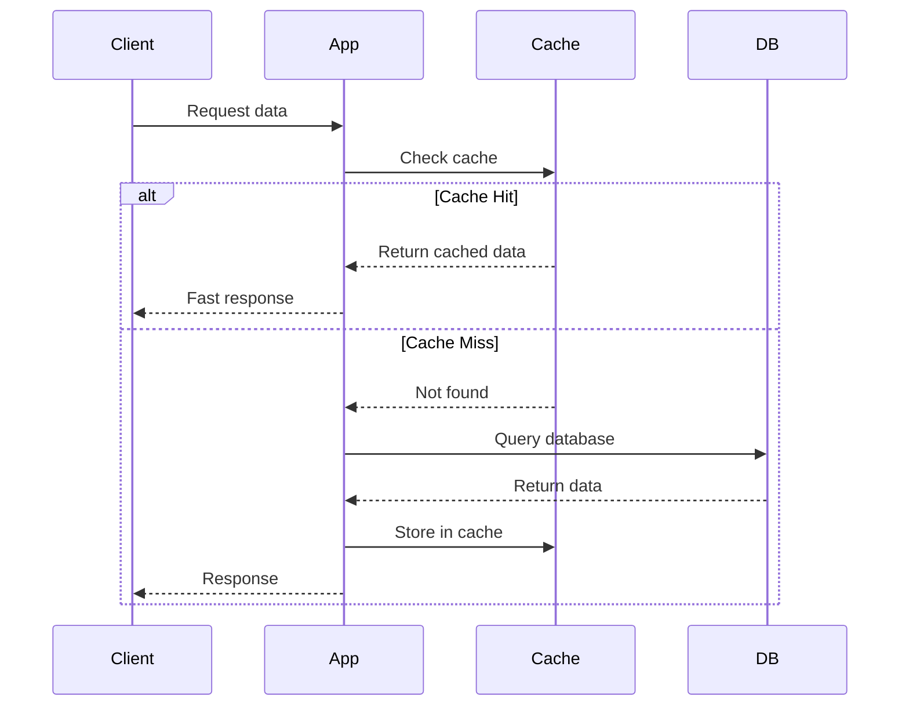
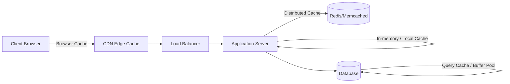
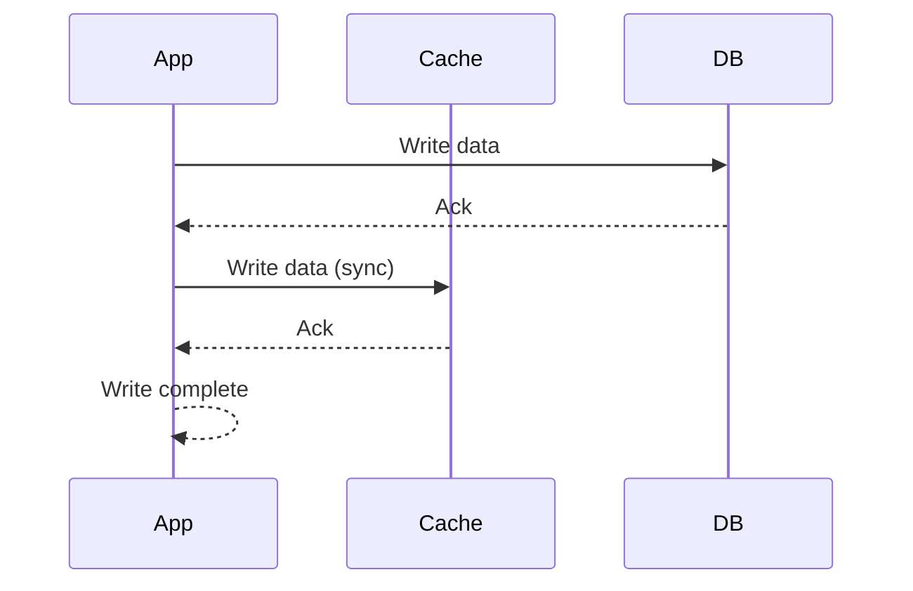
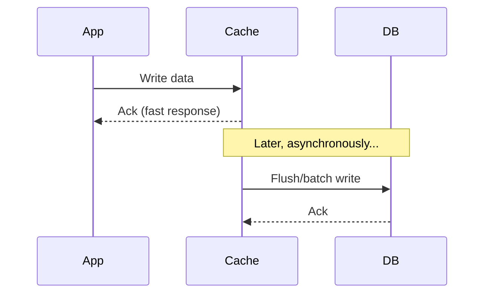
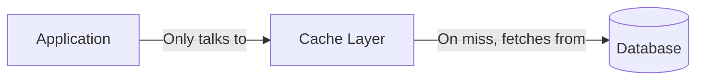
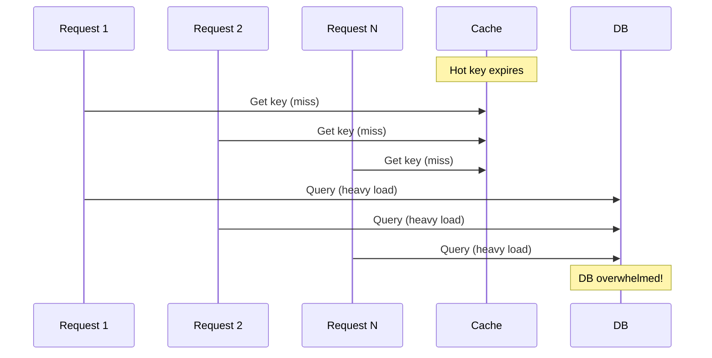
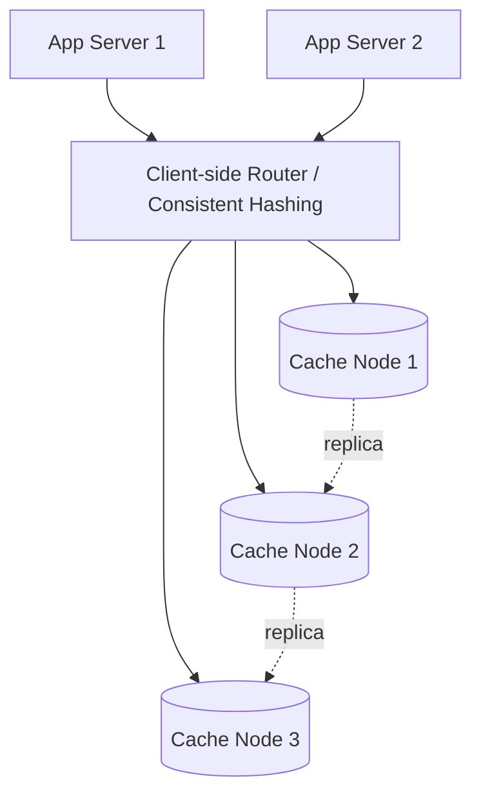
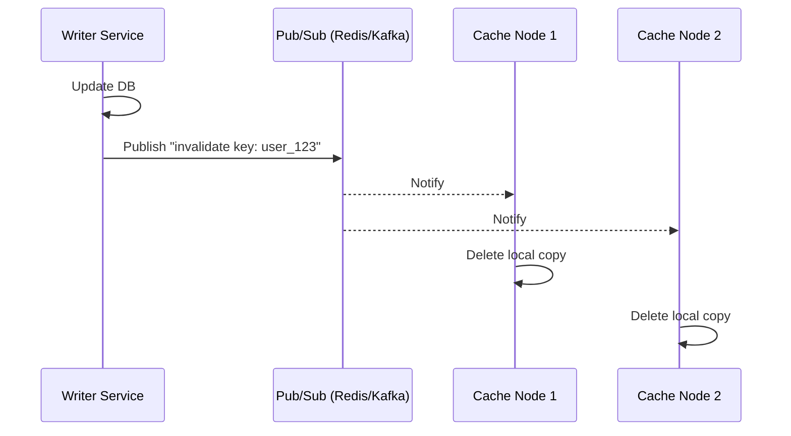
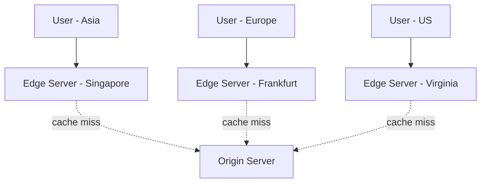

## 22. What is caching and why is it important in system design?

**Caching** হলো এমন একটা technique, যেখানে ঘন ঘন ব্যবহৃত (frequently accessed) data-র একটা copy একটা দ্রুত-access যোগ্য storage layer-এ (সাধারণত memory/RAM-এ) রাখা হয়, যাতে বারবার সেই data আনার জন্য ধীরগতির original source (যেমন disk-based database, বা external API) পর্যন্ত যেতে না হয়।

System design-এ caching গুরুত্বপূর্ণ কারণ:

- **Latency কমায়**: RAM থেকে data পড়া disk বা network call-এর চেয়ে অনেক গুণ (প্রায় 100-1000x) দ্রুত। ফলে response time উল্লেখযোগ্যভাবে কমে যায়।
- **Backend load কমায়**: একই data বারবার database থেকে না এনে cache থেকে দিলে database-এর উপর চাপ (query load) অনেক কমে যায়।
- **Scalability বাড়ায়**: backend resource-এর উপর চাপ কম থাকায় একই infrastructure দিয়ে অনেক বেশি traffic handle করা যায়।
- **Cost কমায়**: expensive computation বা external API call বারবার না করে cache থেকে result দিলে খরচ কমে (যেমন paid third-party API-এর ক্ষেত্রে)।



### What types of data are good candidates for caching?

সব data caching-এর জন্য উপযুক্ত না। ভালো candidate হলো সেসব data যেগুলো:

- **ঘন ঘন read হয় কিন্তু কম পরিবর্তিত হয় (read-heavy, low write frequency)** — যেমন product catalog, user profile, configuration data।
- **Computation-এর দিক দিয়ে expensive** — যেমন complex aggregation query-র result, machine learning model-এর prediction, রিপোর্ট generate করার ফলাফল।
- **Static বা Semi-static content** — যেমন blog post, image metadata, CSS/JS file (CDN-এ), homepage content।
- **External API response** — যেমন weather data, currency exchange rate, যা ঘন ঘন পরিবর্তন হয় না কিন্তু আনতে সময়/খরচ লাগে।
- **Session data** — user login session, authentication token।
- **Popular/trending data (hot data)** — যেমন কোনো viral post, trending product — যা অনেক user একসাথে access করছে।

যেসব data caching-এর জন্য ভালো না:
- খুব দ্রুত পরিবর্তনশীল (highly volatile) data — যেমন real-time stock price (যদি strict accuracy দরকার হয়)।
- Highly sensitive/unique per-request data যেখানে caching থেকে কোনো benefit পাওয়া যায় না।

### What are the trade-offs of caching (staleness, memory cost, complexity)?

Caching অনেক সুবিধা দিলেও এর সাথে কিছু trade-off আসে:

1. **Staleness (Data পুরোনো হয়ে যাওয়া)**: cache-এ থাকা data এবং original source (database)-এর data সবসময় synchronized নাও থাকতে পারে। যদি underlying data পরিবর্তন হয় কিন্তু cache update না হয়, তাহলে user পুরোনো (stale) data দেখতে পারে। এটাকে বলে **consistency vs performance trade-off**।

2. **Memory Cost**: cache সাধারণত RAM-এ রাখা হয়, যা disk storage-এর তুলনায় অনেক বেশি ব্যয়বহুল। তাই সব data cache করা সম্ভব বা economical না — শুধু গুরুত্বপূর্ণ/frequently-accessed data cache করতে হয়, নাহলে infrastructure cost অনেক বেড়ে যায়।

3. **Complexity**: caching layer যোগ করলে সিস্টেমে নতুন জটিলতা তৈরি হয়:
   - **Cache invalidation** কখন এবং কীভাবে করবেন তা ঠিক করা কঠিন (বিখ্যাত উক্তি: *"There are only two hard things in Computer Science: cache invalidation and naming things"*)।
   - **Additional failure point**: cache server নিজেই down হতে পারে, তখন সেটা handle করার জন্য fallback logic দরকার।
   - **Debugging কঠিন হয়ে যায়**: যদি bug হয়, বোঝা কঠিন হতে পারে যে সমস্যাটা actual data-তে নাকি stale cache-এ।

সংক্ষেপে: caching হলো **performance এবং consistency-এর মধ্যে একটা trade-off** — যতটা সম্ভব fresh data দেখানো বনাম যতটা সম্ভব দ্রুত response দেওয়া, এই দুটোর মধ্যে ভারসাম্য রাখতে হয়।

### Where can you apply caching in a system?

Caching সিস্টেমের বিভিন্ন layer-এ প্রয়োগ করা যায়:



- **Client-side (Browser Cache)**: browser নিজে static resource (image, CSS, JS) cache করে রাখে HTTP cache headers অনুযায়ী।
- **CDN (Content Delivery Network)**: geographically distributed edge server-এ static/dynamic content cache করা হয়, user-এর কাছাকাছি server থেকে দ্রুত content পাওয়া যায়।
- **Application-level (In-memory/Local Cache)**: application process-এর মধ্যেই একটা local cache (যেমন in-process hashmap, Guava Cache, Caffeine) রাখা যায় — দ্রুততম কিন্তু server-নির্দিষ্ট (server restart হলে হারিয়ে যায়)।
- **Distributed Cache (Redis/Memcached)**: একটা centralized, shared cache layer, যা একাধিক application server ব্যবহার করতে পারে।
- **Database-level Cache**: database নিজেই query result বা frequently-accessed page cache করে রাখে (buffer pool, query cache)।
- **API Gateway/Reverse Proxy Cache**: Nginx বা Varnish-এর মতো reverse proxy-তে response cache করা যায়।

---

## 23. What are the different caching strategies?

Caching strategy বলতে বোঝায় — cache কীভাবে data-র সাথে sync থাকবে, কখন data লেখা হবে/পড়া হবে সেই pattern। প্রধান কয়েকটা strategy: **Cache-Aside, Write-Through, Write-Back, Read-Through**।

### What is cache-aside (lazy loading) and when do you use it?

**Cache-Aside (Lazy Loading)** হলো সবচেয়ে জনপ্রিয় caching pattern, যেখানে application নিজেই cache manage করে (cache আর database কখনো সরাসরি একে অপরের সাথে communicate করে না)।

**কীভাবে কাজ করে:**
1. Application প্রথমে **cache**-এ data আছে কিনা check করে।
2. **Cache Hit**: data থাকলে সরাসরি cache থেকে রিটার্ন করে দেওয়া হয়।
3. **Cache Miss**: data না থাকলে, application **database** থেকে data fetch করে, cache-এ store করে, তারপর client-কে রিটার্ন করে।

```python
def get_user(user_id):
    # Step 1: Try cache first
    user = cache.get(f"user:{user_id}")
    if user is not None:
        return user  # Cache Hit

    # Step 2: Cache Miss -> fetch from DB
    user = db.query(f"SELECT * FROM users WHERE id = {user_id}")

    # Step 3: Populate cache for next time
    cache.set(f"user:{user_id}", user, ttl=300)  # 5 minutes TTL
    return user
```

**কখন ব্যবহার করবেন:**
- Read-heavy workload-এ, যেখানে একই data বারবার read হয়।
- যখন সব data cache করার দরকার নেই, শুধু যেটা actually query করা হচ্ছে সেটাই cache হবে (lazy — চাহিদা অনুযায়ী load হয়)।
- এটা সবচেয়ে resilient pattern — cache down হয়ে গেলেও application database থেকে সরাসরি data আনতে পারে (performance কমবে কিন্তু system কাজ করবে)।

**সমস্যা**: প্রথমবার (cache miss-এর সময়) latency একটু বেশি হয়, এবং write operation-এর পর cache stale থেকে যেতে পারে (যদি আলাদাভাবে invalidate না করা হয়)।

### What is write-through caching and what are its trade-offs?

**Write-Through Caching**-এ, যখনই কোনো data write/update করা হয়, সেটা **একসাথে cache এবং database উভয় জায়গাতেই** লেখা হয় (synchronously) — write operation তখনই সম্পূর্ণ ধরা হয় যখন দুই জায়গাতেই সফলভাবে লেখা শেষ হয়।

```python
def update_user(user_id, data):
    # Write to database first
    db.update(f"UPDATE users SET ... WHERE id = {user_id}", data)
    # Then write to cache (synchronously)
    cache.set(f"user:{user_id}", data, ttl=300)
```



**সুবিধা:**
- Cache সবসময় database-এর সাথে **consistent/fresh** থাকে — stale data-র সমস্যা কম হয়।
- Read operation সবসময় দ্রুত হয়, কারণ cache-এ সবসময় up-to-date data থাকে।

**Trade-off:**
- **Write latency বেড়ে যায়**, কারণ প্রতিটা write-এ দুই জায়গায় (DB + cache) লেখার জন্য অপেক্ষা করতে হয়।
- যেসব data কখনো read হবে না, সেগুলোও cache-এ লেখা হয়ে যায় — অপ্রয়োজনীয় memory ব্যবহার (wasted cache space)।

### What is write-back (write-behind) caching and when is it risky?

**Write-Back (Write-Behind) Caching**-এ, data প্রথমে শুধু **cache**-এ লেখা হয় এবং সাথে সাথেই write সফল ধরে নিয়ে client-কে response দেওয়া হয়। এরপর, **asynchronously**, একটা ব্যাচ বা নির্দিষ্ট সময় পরপর সেই data প্রকৃত database-এ লেখা হয় (flush করা হয়)।



**সুবিধা:**
- Write latency খুব কম, কারণ database-এ লেখার জন্য অপেক্ষা করতে হয় না।
- Batch করে অনেকগুলো write একসাথে database-এ পাঠানো যায়, যা database-এর load কমায় এবং write throughput বাড়ায়।

**ঝুঁকি (Risk):**
- **Data Loss**: যদি cache/data flush হওয়ার আগেই cache server crash করে বা power failure হয়, তাহলে সেই data একেবারে হারিয়ে যেতে পারে — কারণ database-এ তখনো সেই data লেখা হয়নি।
- **Consistency সমস্যা**: cache এবং database-এর মধ্যে সাময়িক (temporary) mismatch থাকে, যা অন্য কোনো service সরাসরি database read করলে ভুল/পুরনো data পেতে পারে।
- এই কারণে write-back সাধারণত এমন ক্ষেত্রে ব্যবহার হয় যেখানে সামান্য data loss-এর ঝুঁকি গ্রহণযোগ্য (যেমন analytics/log data, view count), কিন্তু financial transaction-এর মতো critical data-তে এটা এড়ানো উচিত।

### What is read-through caching?

**Read-Through Caching**-এ, application সরাসরি cache-এর সাথে interact করে — database-এর সাথে সরাসরি কথা বলে না। Cache layer নিজেই দায়িত্ব নেয়: যদি cache-এ data না থাকে (cache miss), তাহলে cache নিজেই database থেকে data fetch করে, নিজের ভেতরে store করে, তারপর application-কে রিটার্ন করে।

Cache-aside-এর সাথে পার্থক্য হলো — cache-aside-এ **application** cache miss হলে database query করার logic লেখে, কিন্তু read-through-এ এই logic **cache layer/library-এর** ভেতরেই built-in থাকে (cache একটা abstraction হিসেবে কাজ করে, application শুধু cache-কে call করে)।



**সুবিধা**: application code সহজ থাকে, caching logic centralized হয়ে যায়। অনেক caching library/framework (যেমন Ehcache, Spring Cache abstraction) এই pattern support করে।

---

## 24. What are cache eviction policies (LRU, LFU, TTL)?

যেহেতু cache memory (RAM) সীমিত, তাই সব data একসাথে cache-এ রাখা সম্ভব না। যখন cache পূর্ণ হয়ে যায় এবং নতুন data ঢোকাতে হয়, তখন কোন পুরনো data সরিয়ে ফেলা হবে তা নির্ধারণ করার নিয়মকে বলে **eviction policy**।

- **TTL (Time To Live)**: প্রতিটা cache entry-র সাথে একটা expiration time যুক্ত থাকে। নির্দিষ্ট সময় পার হয়ে গেলে সেই entry স্বয়ংক্রিয়ভাবে expire/invalid হয়ে যায় — data-র "staleness" নিয়ন্ত্রণ করার সবচেয়ে সহজ উপায়।
- **LRU (Least Recently Used)**: যে data সবচেয়ে বেশি সময় ধরে ব্যবহার হয়নি (access হয়নি), সেটাই সবার আগে সরিয়ে ফেলা হয়।
- **LFU (Least Frequently Used)**: যে data সবচেয়ে কম সংখ্যকবার access হয়েছে, সেটা সরিয়ে ফেলা হয়।
- **FIFO (First In First Out)**: যে data সবার আগে cache-এ ঢুকেছে, সেটাই সবার আগে সরানো হয় (access pattern বিবেচনা করা হয় না)।

### How does LRU (Least Recently Used) eviction work?

LRU-এর ধারণা হলো: **যে data সাম্প্রতিক সময়ে সবচেয়ে কম ব্যবহৃত হয়েছে (longest time since last access), সেটাই ভবিষ্যতেও সম্ভবত কম ব্যবহৃত হবে** — তাই সেটাকেই আগে বাদ দেওয়া উচিত।

**Implementation** সাধারণত করা হয় একটা **Doubly Linked List + Hash Map** দিয়ে:
- Hash Map key থেকে সরাসরি node-এ O(1) সময়ে access দেয়।
- Doubly Linked List data-র access order track করে — সবচেয়ে সম্প্রতি ব্যবহৃত item list-এর **head**-এ থাকে, সবচেয়ে পুরনো (least recently used) item **tail**-এ থাকে।
- কোনো item access হলে, সেটাকে list থেকে সরিয়ে head-এ নিয়ে যাওয়া হয়।
- Cache পূর্ণ হয়ে গেলে, tail থেকে item সরিয়ে ফেলা হয় (evict করা হয়)।

```python
from collections import OrderedDict

class LRUCache:
    def __init__(self, capacity: int):
        self.cache = OrderedDict()
        self.capacity = capacity

    def get(self, key):
        if key not in self.cache:
            return -1
        self.cache.move_to_end(key)  # mark as recently used
        return self.cache[key]

    def put(self, key, value):
        if key in self.cache:
            self.cache.move_to_end(key)
        self.cache[key] = value
        if len(self.cache) > self.capacity:
            self.cache.popitem(last=False)  # evict least recently used
```

এই approach-এ `get` এবং `put` উভয় operation-ই **O(1) time complexity**-তে সম্পন্ন হয়। Redis-এর `maxmemory-policy allkeys-lru` setting এই policy ব্যবহার করে।

### When would you prefer LFU (Least Frequently Used) over LRU?

**LFU** প্রতিটা item কতবার access হয়েছে তার একটা counter রাখে, এবং সবচেয়ে কম count-এর item-কে evict করে।

**LFU কখন LRU-এর চেয়ে ভালো:**
- যখন কিছু data দীর্ঘমেয়াদে **consistently এবং বারবার** ব্যবহার হয় (যেমন একটা খুব জনপ্রিয় product-এর তথ্য), কিন্তু মাঝে মাঝে অন্য কিছু data হঠাৎ একবার/দুইবার access হয়ে যায়। এমন ক্ষেত্রে LRU ভুলবশত সেই জনপ্রিয় (কিন্তু সাময়িকভাবে access না হওয়া) data-কে evict করে ফেলতে পারে, কারণ LRU শুধু "সর্বশেষ কবে ব্যবহার হয়েছে" সেটা দেখে, "কতবার" ব্যবহার হয়েছে তা দেখে না।
- **উদাহরণ**: একটা e-commerce site-এ একটা বেস্টসেলার প্রোডাক্ট প্রতিদিন হাজারবার view হয়, কিন্তু গত ৫ মিনিটে হয়তো access হয়নি। LRU হয়তো সেটাকে evict করে ফেলতে পারে, কিন্তু LFU সেটা রেখে দেবে কারণ overall access frequency অনেক বেশি।

**LFU-এর সীমাবদ্ধতা**:
- নতুন যোগ হওয়া data, যদিও ভবিষ্যতে জনপ্রিয় হতে পারে, শুরুতে কম count থাকায় দ্রুত evict হয়ে যেতে পারে (এটাকে বলে "cache pollution" বা "new item problem")।
- এই সমস্যা সমাধানে **Window-LFU** বা **LFU with aging** (পুরনো count ধীরে ধীরে কমিয়ে দেওয়া) ব্যবহার করা হয়।

সাধারণভাবে, বাস্তব-জগতের access pattern-এ **LRU বেশি ব্যবহৃত হয়** কারণ এটা simpler এবং বেশিরভাগ workload-এ ভালো কাজ করে (temporal locality থাকে), কিন্তু যেসব ক্ষেত্রে "popularity" pattern স্থিতিশীল, সেখানে LFU ভালো ফলাফল দেয়।

---

## 25. What is a cache stampede (thundering herd) and how do you prevent it?

**Cache Stampede** (একে **Thundering Herd Problem**-ও বলা হয়) তখন ঘটে, যখন কোনো একটা **জনপ্রিয় (hot) cache key expire বা invalidate** হয়ে যায়, এবং সেই মুহূর্তে **একসাথে অনেক request** সেই একই key-এর জন্য cache miss পায়। ফলে সব request একসাথে database-এ গিয়ে **একই query একইসাথে বহুবার** চালাতে চেষ্টা করে — এতে database হঠাৎ overwhelmed/overloaded হয়ে যায়, এমনকি crash-ও করতে পারে।



### How does mutex locking prevent cache stampede?

**Mutex/Lock-based approach**-এ, যখন কোনো key-তে cache miss হয়, তখন শুধুমাত্র **প্রথম request**-কে database query করার permission দেওয়া হয় (একটা lock acquire করে)। বাকি সব request সেই সময় **wait** করে অথবা সাময়িকভাবে **stale/পুরনো data** দেখে, যতক্ষণ না প্রথম request database থেকে fresh data এনে cache আপডেট করে।

```python
import threading

lock = threading.Lock()

def get_data(key):
    data = cache.get(key)
    if data is not None:
        return data

    # Cache miss - try to acquire lock
    if lock.acquire(blocking=False):
        try:
            # Double-check: maybe another thread already refreshed it
            data = cache.get(key)
            if data is not None:
                return data
            data = db.query(key)  # only ONE request hits the DB
            cache.set(key, data, ttl=300)
            return data
        finally:
            lock.release()
    else:
        # Someone else is already refreshing; wait briefly and retry,
        # or return slightly stale data if available
        time.sleep(0.05)
        return cache.get(key) or db.query(key)
```

এভাবে একই সময়ে একাধিক request database-এ একই query একসাথে না পাঠিয়ে, শুধু একটা request-ই database-এ যায় — বাকিরা সেই ফলাফলের জন্য অপেক্ষা করে বা পুরনো data ব্যবহার করে।

### What is probabilistic early recomputation for cache stampede prevention?

**Probabilistic Early Recomputation (XFetch/Early Expiration)** পদ্ধতিতে, cache key পুরোপুরি expire হওয়ার **আগেই**, একটা নির্দিষ্ট probability অনুযায়ী কিছু request-কে "ধরে নিতে" দেওয়া হয় যে key-টা expire হয়ে গেছে, এবং সেই request early background-এ data recompute/refresh করে। এতে সব request একসাথে "cliff edge"-এ গিয়ে expire হয় না, বরং refresh টা কিছুটা randomly, expire time-এর কাছাকাছি সময়ে ছড়িয়ে যায়।

**মূল ধারণা**: expiry time যত কাছে আসে, key refresh করার probability তত বাড়তে থাকে (একটা formula ব্যবহার করে, যেমন Facebook-এর ব্যবহৃত **XFetch algorithm**)।

```python
import math, random, time

def should_recompute_early(delta, expiry, beta=1.0):
    # delta = time it took to compute the value last time
    # expiry = time remaining until actual expiration
    return (delta * beta * math.log(random.random())) >= -expiry

def get_data(key):
    entry = cache.get_with_metadata(key)  # value, delta, expiry_time
    if entry is None:
        return recompute_and_cache(key)

    remaining = entry.expiry_time - time.time()
    if should_recompute_early(entry.delta, remaining):
        # proactively refresh in background before actual expiry
        refresh_in_background(key)

    return entry.value
```

এর সুবিধা হলো — actual expiration moment-এ বেশিরভাগ key আগে থেকেই refresh হয়ে থাকে, ফলে হঠাৎ অনেক request একসাথে cache miss পায় না, thundering herd হওয়ার সম্ভাবনা অনেক কমে যায়।

### What is request coalescing?

**Request Coalescing** (একে **Request Collapsing**-ও বলা হয়) হলো এমন একটা technique, যেখানে একই key-এর জন্য একই সময়ে আসা একাধিক request-কে **একত্রিত (merge/collapse)** করে ফেলা হয় একটামাত্র backend/database call-এ। ফলাফল আসার পর, সেই একটাই result সব অপেক্ষমাণ request-কে একসাথে পাঠিয়ে দেওয়া হয়।

এটা mutex locking-এর সাথে conceptually কাছাকাছি, কিন্তু implementation-এ পার্থক্য হলো — request coalescing-এ সাধারণত একটা **in-flight request tracker** (map) রাখা হয়, যেখানে বলা থাকে কোন key-এর জন্য এখন কোনো request চলমান আছে কিনা।

```python
in_flight = {}  # key -> Future/Promise
in_flight_lock = threading.Lock()

def get_data(key):
    data = cache.get(key)
    if data is not None:
        return data

    with in_flight_lock:
        if key in in_flight:
            future = in_flight[key]
        else:
            future = Future()
            in_flight[key] = future
            threading.Thread(target=fetch_and_resolve, args=(key, future)).start()

    result = future.result()  # all callers wait on the SAME future
    return result

def fetch_and_resolve(key, future):
    data = db.query(key)
    cache.set(key, data, ttl=300)
    future.set_result(data)
    with in_flight_lock:
        del in_flight[key]
```

এভাবে একই key-এর জন্য ১০০টা simultaneous request এলেও, database-এ মাত্র **১টা** query যায় — বাকি ৯৯টা request সেই একই in-flight call-এর ফলাফলের জন্য অপেক্ষা করে। GraphQL-এর **DataLoader**-ও এই ধরনের batching/coalescing ব্যবহার করে।

---

## 26. What is the difference between Redis and Memcached?

Redis এবং Memcached দুটোই জনপ্রিয় **in-memory key-value store**, যা caching-এর জন্য ব্যবহৃত হয়। তবে এদের মধ্যে বেশ কিছু গুরুত্বপূর্ণ পার্থক্য আছে:

| বিষয় | Redis | Memcached |
|---|---|---|
| Data Structure | String, List, Set, Sorted Set, Hash, Bitmap, HyperLogLog, Stream ইত্যাদি সমর্থন করে | শুধু simple key-value (string) |
| Persistence | RDB/AOF দিয়ে disk-এ data persist করা যায় | সম্পূর্ণ in-memory, persistence নেই — restart হলে সব data হারিয়ে যায় |
| Replication | Master-Replica replication built-in সমর্থন করে | Built-in replication নেই |
| Clustering | Redis Cluster দিয়ে built-in sharding/high-availability সমর্থন করে | Client-side sharding করতে হয় (built-in নেই) |
| Multi-threading | মূলত single-threaded (data operations), যদিও নতুন version-এ কিছু I/O multi-threaded | Multi-threaded architecture, যা multi-core CPU ভালোভাবে ব্যবহার করতে পারে সাধারণ key-value operation-এর জন্য |
| Pub/Sub | Built-in Pub/Sub messaging সমর্থন করে | সমর্থন করে না |
| Transactions | MULTI/EXEC দিয়ে transaction সমর্থন করে | সমর্থন করে না |
| Use Case | Complex caching, session store, leaderboard, real-time analytics, message broker | Simple, pure caching, যেখানে শুধু raw speed এবং simplicity দরকার |

### What data structures does Redis support that Memcached does not?

Memcached শুধুমাত্র simple **string key-value** pair সমর্থন করে। কিন্তু Redis অনেক rich data structure সমর্থন করে:

- **String**: simple key-value (Memcached-এর মতোই, তবে counter increment/decrement-এর মতো অতিরিক্ত operation সহ)।
- **List**: ordered list of string — queue/stack বানানোর জন্য ব্যবহার করা যায় (`LPUSH`, `RPOP`)।
- **Set**: unique elements-এর unordered collection — যেমন unique tag/follower list রাখতে (`SADD`, `SISMEMBER`)।
- **Sorted Set (ZSet)**: score-সহ set, যা automatically sorted থাকে — **leaderboard, ranking system** বানানোর জন্য খুব উপযোগী (`ZADD`, `ZRANGE`)।
- **Hash**: field-value pair-এর একটা map — একটা object-এর মতো data রাখতে (যেমন user profile: `name`, `age`, `email` একসাথে একটা key-এর ভেতরে)।
- **Bitmap**: bit-level operation, যেমন daily active user track করা।
- **HyperLogLog**: approximate unique count (cardinality estimation) — যেমন কোনো page-এ কতজন unique visitor এসেছে তার আনুমানিক হিসাব, খুব কম memory ব্যবহার করে।
- **Stream**: log-like data structure, event streaming/message queue-এর মতো ব্যবহারের জন্য (Kafka-এর মতো, ছোট স্কেলে)।
- **Geospatial index**: latitude/longitude-ভিত্তিক data রাখা এবং query করা (`GEOADD`, `GEODIST`)।

```bash
# Redis example: Sorted Set for a leaderboard
ZADD leaderboard 1500 "player1"
ZADD leaderboard 2300 "player2"
ZREVRANGE leaderboard 0 2 WITHSCORES   # Top 3 players
```

এই rich data structure-গুলোর কারণে Redis শুধু caching-এর জন্যই নয়, বরং **session store, message broker, rate limiter, leaderboard**-এর মতো বিভিন্ন use case-এও ব্যবহৃত হয়।

### How does Redis persistence (RDB vs AOF) work?

যদিও Redis মূলত in-memory database, এটা optionally data **disk-এ persist** করার সুবিধাও দেয়, যাতে restart/crash-এর পরও data হারিয়ে না যায়। এর জন্য দুটো mechanism আছে:

**1. RDB (Redis Database / Snapshotting):**
- নির্দিষ্ট সময় পরপর (বা নির্দিষ্ট সংখ্যক write operation হওয়ার পর) পুরো dataset-এর একটা **point-in-time snapshot** নিয়ে disk-এ একটা binary file (`.rdb`) হিসেবে save করে।
- **সুবিধা**: file আকারে ছোট (compact), restore করা দ্রুত, backup নেওয়া সহজ।
- **সমস্যা**: শেষ snapshot নেওয়ার পর থেকে crash পর্যন্ত সময়ের মধ্যে হওয়া সব write **হারিয়ে যেতে পারে** (data loss window থাকে)।

```
save 900 1      # 900 সেকেন্ডে অন্তত ১টা key change হলে snapshot নাও
save 300 10     # 300 সেকেন্ডে অন্তত ১০টা key change হলে snapshot নাও
```

**2. AOF (Append Only File):**
- প্রতিটা **write operation**-কে একটা log file-এ ধারাবাহিকভাবে (sequentially) append করা হয় — অনেকটা database-এর write-ahead log-এর মতো।
- **সুবিধা**: RDB-এর তুলনায় অনেক বেশি **durable** — `fsync` policy অনুযায়ী (`always`, `everysec`, `no`) data loss window অনেক কম (সাধারণত সর্বোচ্চ ১ সেকেন্ড) হতে পারে।
- **সমস্যা**: file size RDB-এর তুলনায় বড় হয়, এবং restore/replay করতে বেশি সময় লাগে। এই সমস্যা কমাতে Redis periodically AOF file **rewrite/compact** করে (`BGREWRITEAOF`)।

**ব্যবহারিকভাবে**, Redis-এ RDB এবং AOF **একসাথে** ব্যবহার করা যায় — RDB দ্রুত backup/restore-এর জন্য, আর AOF বেশি durability-এর জন্য। কিছু ক্ষেত্রে persistence সম্পূর্ণ বন্ধও রাখা যায়, যদি Redis শুধুমাত্র pure caching layer হিসেবে ব্যবহৃত হয় এবং data loss গ্রহণযোগ্য হয় (কারণ original source of truth database-এই আছে)।

---

## 27. How do you design a distributed cache?

একটা **distributed cache** ডিজাইন করার সময় মূলত নিচের বিষয়গুলো বিবেচনা করতে হয়:

1. **Data Partitioning**: cache data একাধিক node-এ কীভাবে ভাগ হবে (সাধারণত **consistent hashing** ব্যবহার করা হয়)।
2. **Replication**: fault tolerance এবং availability-এর জন্য প্রতিটা data-র একাধিক copy বিভিন্ন node-এ রাখা।
3. **Cache Invalidation Strategy**: একটা node-এ data পরিবর্তন হলে, সেই তথ্য কীভাবে অন্য node/client-এ propagate হবে।
4. **Client Routing**: client কীভাবে জানবে কোন key কোন node-এ আছে (client-side hashing, বা একটা proxy/coordinator layer)।
5. **Fault Tolerance**: কোনো node down হয়ে গেলে সিস্টেম কীভাবে কাজ চালিয়ে যাবে।



### How do you handle cache invalidation in a distributed system?

Distributed cache-এ invalidation করা কঠিন কারণ data একাধিক node/server-এ duplicate হয়ে থাকতে পারে। কিছু common approach:

1. **TTL-based Expiration**: সবচেয়ে সহজ পদ্ধতি — প্রতিটা entry-তে একটা expiration time সেট করে দেওয়া, যাতে নির্দিষ্ট সময় পর নিজে থেকেই invalid হয়ে যায়। এটা eventual consistency দেয়, কিন্তু strict correctness guarantee করে না (TTL শেষ না হওয়া পর্যন্ত stale data থাকতে পারে)।

2. **Explicit Invalidation (Write-through/Delete-on-write)**: যখন underlying data পরিবর্তন হয়, তখন application সরাসরি cache থেকে সেই key **delete বা update** করে দেয়। Distributed environment-এ এটা করার জন্য একটা **Pub/Sub mechanism** (যেমন Redis Pub/Sub, Kafka) ব্যবহার করা যায় — একটা node data পরিবর্তন করলে, একটা "invalidate key X" message broadcast করে, বাকি সব node/cache instance সেই message পেয়ে নিজেদের local copy invalidate করে।



3. **Versioning**: প্রতিটা cache entry-র সাথে একটা version number/timestamp রাখা, এবং client fetch করার সময় সেই version যাচাই করে দেখে data current কিনা।

### What is cache coherence and why is it hard in distributed systems?

**Cache Coherence** বলতে বোঝায় — একাধিক cache (বা cache node)-এ থাকা একই data-র **সব copy সবসময় consistent (একই মান রাখা)** নিশ্চিত করা। যখন একটা node-এ data পরিবর্তন হয়, তখন অন্য সব node-এ থাকা সেই একই data-র copy-ও সেই পরিবর্তন অনুযায়ী update বা invalidate হওয়া উচিত।

**কেন এটা distributed system-এ কঠিন:**

- **Network Latency এবং Partition**: node-গুলোর মধ্যে instant communication সম্ভব না — একটা invalidation message পাঠাতে সময় লাগে, এবং network delay/failure-এর কারণে সেই message হারিয়েও যেতে পারে।
- **CAP Theorem-এর trade-off**: strong consistency (সব cache সবসময় একই data দেখাবে) নিশ্চিত করতে গেলে availability বা latency-তে compromise করতে হয় — কারণ প্রতিটা read/write-এর জন্য সব node-এর সাথে coordinate/synchronize করতে হবে, যা ধীর।
- **Concurrent Updates**: যদি একই সময়ে দুইটা ভিন্ন client দুইটা ভিন্ন node-এ একই key আপডেট করার চেষ্টা করে, তাহলে **conflict resolution** দরকার হয় (যেমন Last-Write-Wins, vector clocks)।
- **Partial Failure**: যদি invalidation message কিছু node-এ পৌঁছায় কিন্তু কিছু node-এ না পৌঁছায় (network issue-এর কারণে), তাহলে সিস্টেমে **inconsistent state** তৈরি হয় — কিছু node পুরনো data দেখাবে, কিছু node নতুন।

এই কারণেই বেশিরভাগ distributed caching system **strong consistency**-এর বদলে **eventual consistency** গ্রহণ করে (TTL + best-effort invalidation ব্যবহার করে) — perfect coherence অর্জন করা practically খুব ব্যয়বহুল এবং performance-এর জন্য ক্ষতিকর।

### How does consistent hashing apply to distributing cache keys across nodes?

Distributed cache-এ multiple cache node থাকলে, কোন key কোন node-এ store হবে তা নির্ধারণ করার জন্য **consistent hashing** ব্যবহার করা হয় (যা ১১ নম্বর প্রশ্নে বিস্তারিত আলোচনা করা হয়েছে)।

- প্রতিটা cache node-কে একটা hash ring-এ position করা হয় (সাধারণত multiple virtual node সহ, uniform distribution-এর জন্য)।
- প্রতিটা cache key hash করে ring-এ position পাওয়া যায়, এবং clockwise দিকে প্রথম যে node পাওয়া যায়, সেই node-ই সেই key store/retrieve করার দায়িত্ব পায়।
- যখন নতুন cache node যোগ করা হয় (scale up) বা কোনো node বাদ যায় (crash/scale down), তখন **শুধুমাত্র সংশ্লিষ্ট ছোট অংশের key** নতুন node-এ move করতে হয় — বাকি সব key তাদের আগের node-এই থাকে। এটা distributed cache-এর জন্য extremely গুরুত্বপূর্ণ, কারণ traditional `hash % N` ব্যবহার করলে node সংখ্যা পরিবর্তনের সাথে সাথে প্রায় **সব cache key** invalid হয়ে যেত (massive cache miss storm তৈরি হতো, যা database-এর উপর হঠাৎ বিশাল চাপ ফেলত)।

এই কারণেই Memcached client library (যেমন `ketama`) এবং Redis Cluster উভয়ই তাদের key distribution-এর জন্য consistent hashing (বা hash slot-ভিত্তিক অনুরূপ কৌশল) ব্যবহার করে।

---

## 28. What is CDN caching and how does it differ from server-side caching?

**CDN (Content Delivery Network) Caching** হলো এমন একটা system, যেখানে content (static file যেমন image, video, CSS, JS, এবং কখনো কখনো dynamic content-ও) বিশ্বের বিভিন্ন জায়গায় ছড়িয়ে থাকা **edge server**-এ cache করে রাখা হয়। User যখন কোনো content request করে, তখন সেটা origin server (যেখানে actual application/database আছে) পর্যন্ত না গিয়ে, user-এর **ভৌগোলিকভাবে সবচেয়ে কাছের edge server** থেকে serve করা হয়।



**CDN caching বনাম server-side (Redis/Memcached) caching-এর পার্থক্য:**

| বিষয় | CDN Caching | Server-side Caching |
|---|---|---|
| অবস্থান | User-এর কাছাকাছি, geographically distributed edge location | Application-এর কাছে (একই datacenter/region) |
| প্রধান লক্ষ্য | **Network latency কমানো** (geographic distance কমানো) | **Backend/database load কমানো** এবং computation দ্রুত করা |
| Content Type | মূলত static content (image, video, JS, CSS), তবে dynamic content-ও (Edge computing দিয়ে) সম্ভব | যেকোনো ধরনের data — database query result, session, computed value |
| নিয়ন্ত্রণ | HTTP Cache-Control headers দিয়ে নিয়ন্ত্রিত হয় | Application code দিয়ে সরাসরি নিয়ন্ত্রিত হয় (explicit set/get) |
| উদাহরণ | Cloudflare, Akamai, AWS CloudFront, Fastly | Redis, Memcached |

মূলত এই দুই ধরনের caching **একে অপরের পরিপূরক** — বড় সিস্টেমে সাধারণত উভয়ই ব্যবহার করা হয়: CDN static asset/page-এর জন্য, আর Redis/Memcached-এর মতো server-side cache dynamic data/query result-এর জন্য।

### How do cache-control headers control CDN behavior?

**`Cache-Control`** HTTP header সার্ভার থেকে client/CDN-কে বলে দেয় সেই response কীভাবে cache করা উচিত। কিছু গুরুত্বপূর্ণ directive:

```http
Cache-Control: public, max-age=3600, s-maxage=86400
```

- **`public`**: response যেকোনো cache (browser, CDN, proxy) দ্বারা cache করা যাবে।
- **`private`**: শুধুমাত্র end-user-এর browser cache করতে পারবে, কিন্তু shared cache (CDN)-এ cache করা যাবে না — সাধারণত user-specific data-র জন্য ব্যবহৃত হয়।
- **`no-cache`**: response cache করা যাবে, কিন্তু প্রতিবার ব্যবহার করার আগে origin server-এর সাথে validate (revalidation) করতে হবে (`If-None-Match`/ETag ব্যবহার করে) — নাম বিভ্রান্তিকর, আসলে cache "না-হয়" এমন না, বরং "validate না করে ব্যবহার না করা"।
- **`no-store`**: response একেবারেই cache করা যাবে না, কোথাও না — sensitive data (যেমন banking info)-র জন্য।
- **`max-age=<seconds>`**: browser cache-এর জন্য কতক্ষণ response fresh (valid) থাকবে তা নির্দেশ করে।
- **`s-maxage=<seconds>`**: শুধুমাত্র shared cache (CDN/proxy)-এর জন্য freshness duration নির্দিষ্ট করে — এটা `max-age`-কে override করে shared cache-এর ক্ষেত্রে, ফলে CDN এবং browser-এর জন্য আলাদা caching duration সেট করা যায়।
- **`immutable`**: বলে দেয় যে এই resource কখনো পরিবর্তন হবে না (যেমন versioned static file, `app.a1b2c3.js`), তাই revalidation-এর দরকার নেই।

```http
# Example: versioned static asset - cache forever
Cache-Control: public, max-age=31536000, immutable

# Example: API response - cache at CDN for 1 day, browser doesn't cache
Cache-Control: private, s-maxage=86400, max-age=0
```

### How do you invalidate a CDN cache for a specific resource?

যখন কোনো content update হয় কিন্তু CDN-এ পুরনো version এখনো cache হয়ে আছে (TTL শেষ হয়নি), তখন সেটা manually invalidate/purge করার প্রয়োজন হতে পারে। কয়েকটা common approach:

1. **Cache Purge/Invalidation API**: বেশিরভাগ CDN provider (Cloudflare, AWS CloudFront, Fastly) একটা API/dashboard দেয়, যেখানে নির্দিষ্ট URL বা path pattern দিয়ে cache purge request পাঠানো যায়।

```bash
# Example: AWS CloudFront invalidation via CLI
aws cloudfront create-invalidation \
  --distribution-id EXAMPLE123 \
  --paths "/images/logo.png" "/css/style.css"
```

2. **Cache Busting (Versioned URL/Filename)**: এটা সবচেয়ে বেশি ব্যবহৃত এবং সবচেয়ে নির্ভরযোগ্য কৌশল — file-এর নামে একটা version/hash যোগ করে দেওয়া হয় (যেমন `style.css?v=2` বা `style.a1b2c3.css`)। যখন content পরিবর্তন হয়, তখন নতুন version/hash-সহ একটা **সম্পূর্ণ নতুন URL** তৈরি হয়, ফলে CDN সেটাকে "নতুন resource" হিসেবে treat করে এবং পুরনো cache-এর সাথে কোনো conflict হয় না (পুরনো cache নিজে থেকেই TTL শেষ হলে expire হয়ে যায়, কিন্তু নতুন request নতুন URL-এই যায়)।

3. **Short TTL + Background Revalidation**: gুরুত্বপূর্ণ/ঘন ঘন পরিবর্তনশীল content-এর জন্য ইচ্ছাকৃতভাবে ছোট TTL সেট করা, যাতে বেশি সময় stale data serve না হয়।

4. **Tag-based/Surrogate Key Invalidation**: কিছু আধুনিক CDN (Fastly-এর Surrogate Keys, Cloudflare Cache Tags) একাধিক resource-কে একটা "tag" দিয়ে group করার সুবিধা দেয়, যাতে একবারে সেই tag-যুক্ত সব resource invalidate করা যায় (যেমন একটা product আপডেট হলে, সেই product-সম্পর্কিত সব cached page/API response একসাথে purge করা)।

সাধারণত production system-এ **cache busting (versioned filename)** static asset-এর জন্য সবচেয়ে বেশি recommend করা হয়, কারণ এতে race condition বা delayed-purge-এর সমস্যা থাকে না — content পরিবর্তন মানেই নতুন URL, তাই কখনো ভুল/পুরনো version serve হওয়ার সুযোগ নেই।
