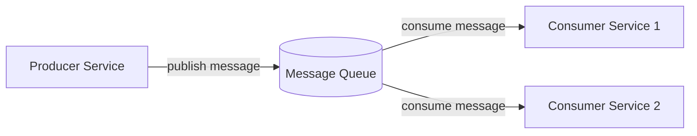
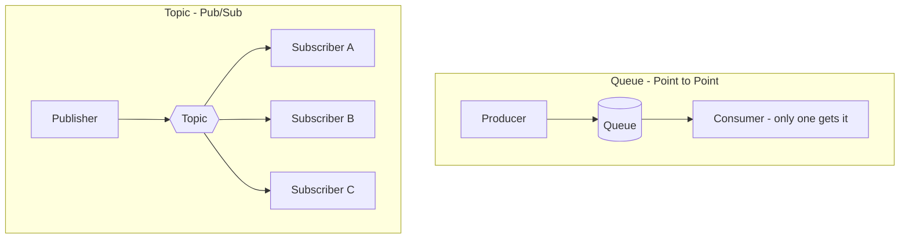
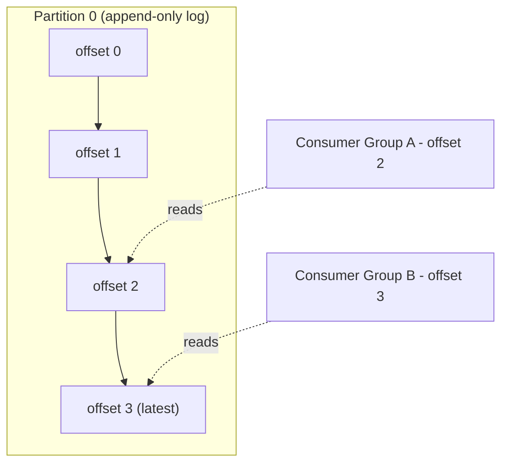
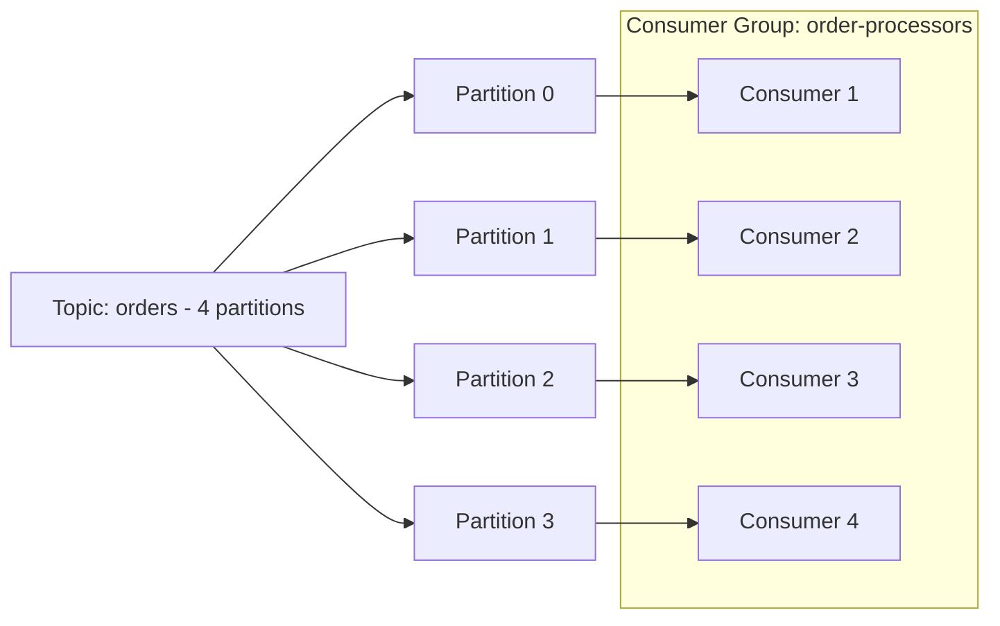
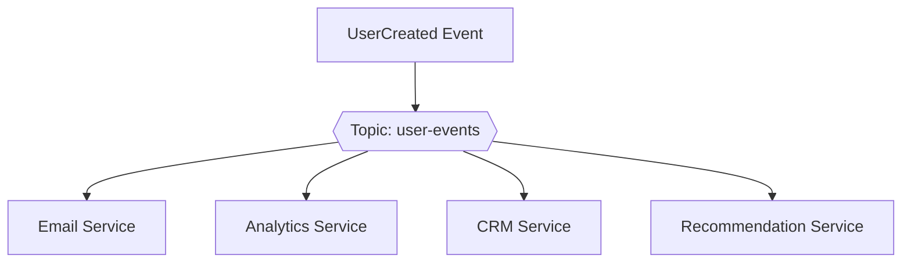
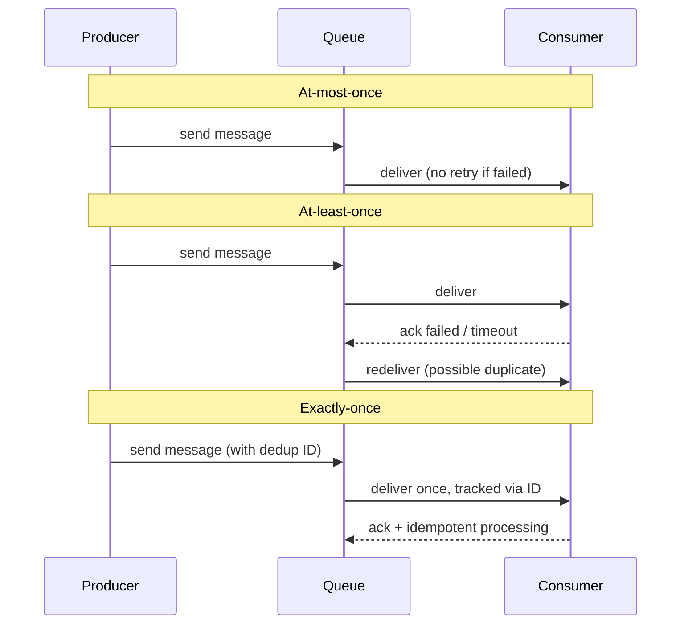
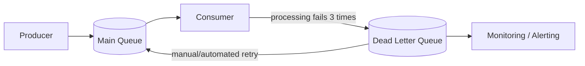
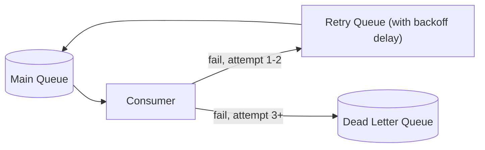
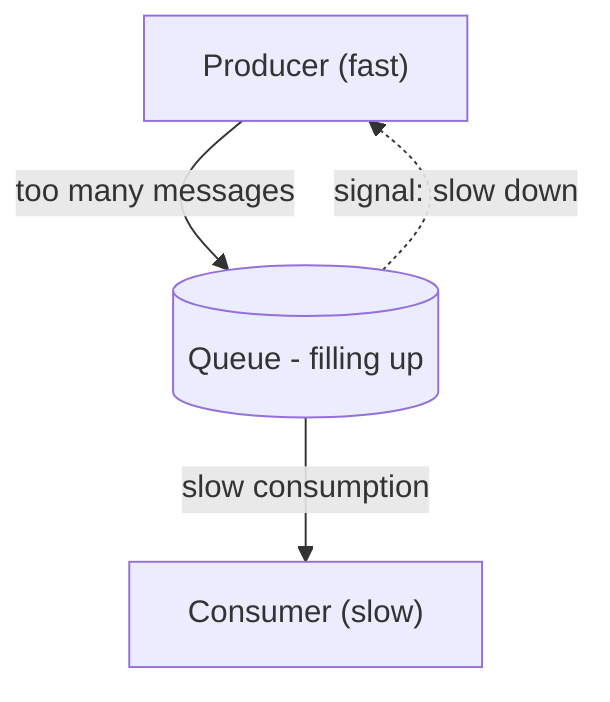
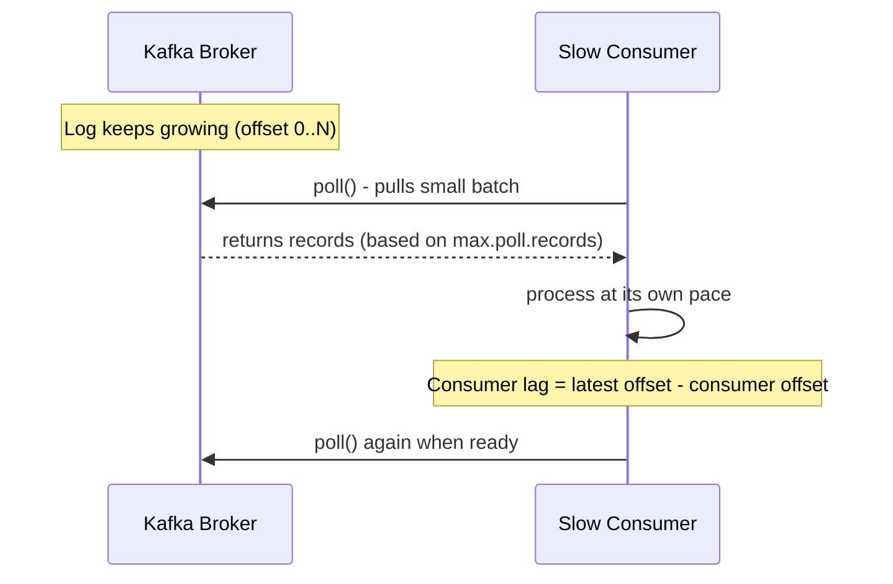

## 29. What is a message queue and why is it used in distributed systems?

একটি **message queue** হলো একটা middleware component, যেটা দুইটা service বা component-এর মধ্যে data (message) পাঠানোর কাজ করে, কিন্তু সেই দুই component-কে সরাসরি একসাথে (synchronously) যোগাযোগ করতে হয় না। **Producer** message পাঠিয়ে queue-তে রেখে দেয়, আর **consumer** নিজের সময়মতো সেটা pick up করে process করে।

Distributed system-এ message queue ব্যবহার করার কারণ হলো:

- **Decoupling**: Producer আর consumer একে অপরের সম্পর্কে কিছু জানার দরকার নেই — শুধু queue-এর সাথে interact করে।
- **Scalability**: একাধিক consumer একসাথে কাজ করে message process করতে পারে, তাই load বাড়লে horizontal scaling সহজ হয়।
- **Reliability**: Consumer down থাকলেও message queue-তে safely জমা থাকে, পরে process হয়।
- **Load leveling**: Traffic spike হলে queue একটা buffer হিসেবে কাজ করে, downstream system-কে overwhelmed হতে দেয় না।



### What problems does asynchronous messaging solve?

**Synchronous communication** (যেমন সরাসরি REST API call) এ কিছু সমস্যা থাকে, যেগুলো **asynchronous messaging** solve করে:

- **Tight coupling problem**: Synchronous call-এ caller-কে জানতে হয় callee কোথায় আছে, কীভাবে reach করতে হবে। Async messaging এ শুধু queue/topic জানলেই হয়।
- **Availability dependency**: যদি downstream service down থাকে, synchronous call fail করে। কিন্তু async messaging এ message queue-তে জমা থাকে, service up হলে process হয়।
- **Latency spike propagation**: একটা slow service পুরো chain-কে block করে দিতে পারে synchronous flow এ। Async এ producer সাথে সাথে response পেয়ে যায় (fire-and-forget বা acknowledgment)।
- **Traffic burst handling**: হঠাৎ অনেক request আসলে downstream system crash করতে পারে। Queue সেই burst absorb করে, consumer নিজের গতিতে process করে।
- **Cross-team/cross-language integration**: বিভিন্ন team ভিন্ন ভিন্ন language/stack ব্যবহার করলেও একটা common message format (JSON, Avro, Protobuf) দিয়ে integrate করা যায়।

উদাহরণ: একটা e-commerce order placement flow-তে, order service order নিয়ে সরাসরি inventory, payment, notification service-কে synchronously call না করে একটা `OrderPlaced` event queue-তে publish করে দেয়। প্রতিটা downstream service নিজের সময়মতো সেটা consume করে।

### What is the difference between a queue and a topic (pub/sub)?

| দিক | Queue (Point-to-Point) | Topic (Pub/Sub) |
|---|---|---|
| Message consumption | একটা message শুধু **একজন** consumer process করে | একটা message **সব subscriber** পায় (fan-out) |
| Model | One-to-one delivery | One-to-many delivery |
| Use case | Task distribution, load balancing (worker pool) | Event broadcasting, notification |
| উদাহরণ | Order processing task queue | `UserRegistered` event → email service, analytics service, CRM service সবাই পায় |



---

## 30. What is the difference between RabbitMQ and Kafka?

| দিক | RabbitMQ | Kafka |
|---|---|---|
| Architecture | Traditional message **broker** (smart broker, dumb consumer) | Distributed **commit log** (dumb broker, smart consumer) |
| Message retention | Message consume হলে সাধারণত delete হয়ে যায় | Message একটা configurable time (retention period) ধরে log-এ থাকে, consume হলেও delete হয় না |
| Throughput | Moderate — complex routing (exchanges, bindings)-এর জন্য optimized | খুবই high throughput, millions of messages/sec handle করতে পারে |
| Ordering | Queue-level ordering guarantee | Partition-level ordering guarantee |
| Replay capability | সহজে সম্ভব না, message consume হলে চলে যায় | Consumer offset reset করে পুরনো message আবার পড়া যায় (replayability) |
| Protocol | AMQP (এছাড়া MQTT, STOMP support) | নিজস্ব binary protocol over TCP |
| Use case | Complex routing logic, task queue, RPC-style messaging | Event streaming, log aggregation, high-throughput data pipeline |

### When would you choose Kafka over RabbitMQ?

Kafka বেছে নেওয়া উচিত যখন:

- **High throughput** দরকার — যেমন লক্ষ লক্ষ event per second (clickstream, IoT sensor data, log aggregation)।
- **Event replay** দরকার — নতুন consumer যোগ হলে পুরনো data থেকে আবার process করতে হবে (যেমন নতুন analytics pipeline যোগ করা)।
- **Event sourcing / CQRS** pattern implement করতে হবে, যেখানে event history গুরুত্বপূর্ণ।
- **Multiple independent consumer groups** একই data একাধিকবার আলাদাভাবে process করবে (যেমন real-time analytics + data warehouse loading + fraud detection, সবাই একই stream থেকে পড়ছে)।
- **Long-term storage/durability** দরকার, message log হিসেবে অনেকদিন রাখতে হবে।

RabbitMQ ভালো যখন:
- Complex routing logic দরকার (priority queue, delayed message, topic-based routing with wildcards)।
- Task queue pattern — যেমন background job processing, যেখানে প্রতিটা job শুধু একবার process হবে।
- Lower latency, simpler use case, smaller scale।

### What is Kafka's log-based storage model?

Kafka একটা topic-কে ভাগ করে একাধিক **partition**-এ। প্রতিটা partition আসলে একটা **append-only log** — নতুন message সবসময় শেষে যোগ হয়, আর প্রতিটা message-এর একটা sequential ID থাকে যাকে বলে **offset**।

মূল বৈশিষ্ট্য:

- Message consume করলে delete হয় না — শুধু consumer-এর offset pointer এগিয়ে যায়।
- Configurable **retention policy** (সময়ভিত্তিক, যেমন 7 দিন, বা size-ভিত্তিক) অনুযায়ী পুরনো data একসময় delete হয়।
- একই data একাধিক consumer group independently, নিজস্ব offset বজায় রেখে পড়তে পারে।
- Partition disk-এ sequential write হয়, তাই খুব fast (random I/O না, sequential I/O)।



### What is a consumer group in Kafka and how does it enable parallel processing?

**Consumer group** হলো একগুচ্ছ consumer instance, যারা একটা common `group.id` শেয়ার করে একটা topic থেকে data পড়ে। Kafka guarantee করে যে একটা topic-এর একটা partition, একটা consumer group-এর মধ্যে **শুধু একটা** consumer instance-ই পড়বে।

Parallel processing কীভাবে হয়:

- একটা topic-এ যদি ৪টা partition থাকে, আর consumer group-এ ৪টা consumer instance থাকে, তাহলে প্রতিটা consumer একটা করে partition independently process করবে — সমান্তরালভাবে (parallel)।
- Consumer instance বাড়ালে (partition সংখ্যার মধ্যে) throughput বাড়ে।
- Consumer instance যদি partition সংখ্যার চেয়ে বেশি হয়, বাড়তি consumer idle থাকবে (কারণ একটা partition একজনই পড়তে পারে)।
- একটা consumer crash করলে, Kafka-এর **rebalancing** mechanism স্বয়ংক্রিয়ভাবে সেই partition অন্য একটা active consumer-কে assign করে দেয়।



সাধারণ Kafka consumer code example (Node.js, `kafkajs` লাইব্রেরি দিয়ে):

```javascript
const { Kafka } = require('kafkajs');

const kafka = new Kafka({ clientId: 'order-service', brokers: ['localhost:9092'] });
const consumer = kafka.consumer({ groupId: 'order-processors' });

async function run() {
  await consumer.connect();
  await consumer.subscribe({ topic: 'orders', fromBeginning: false });

  await consumer.run({
    eachMessage: async ({ partition, message }) => {
      console.log(`Partition ${partition} | Offset ${message.offset} | Value: ${message.value.toString()}`);
      // process the order here
    },
  });
}

run().catch(console.error);
```

---

## 31. What is pub/sub messaging and when do you use it?

**Pub/Sub (Publish-Subscribe)** একটা messaging pattern, যেখানে **publisher** message পাঠায় একটা **topic/channel**-এ, আর একাধিক **subscriber** সেই topic-এ subscribe করে থাকলে সবাই সেই message পায়। Publisher জানে না কারা subscriber, আর subscriber জানে না কে publisher — দুইপক্ষই সম্পূর্ণভাবে decoupled।

ব্যবহার করা হয় যখন:

- একটা event-এর জন্য **একাধিক system**-কে notify করতে হবে (broadcast)।
- Real-time notification system (chat app, live dashboard update)।
- Microservices architecture-এ event-driven communication, যেখানে একটা event একাধিক downstream service কে trigger করবে।
- Cache invalidation broadcast করা multiple server instance-এ।

### What are fan-out patterns in pub/sub systems?

**Fan-out** মানে হলো একটা single event/message কে একাধিক destination-এ ছড়িয়ে দেওয়া, যাতে প্রতিটা destination independently সেই event process করতে পারে।

উদাহরণ: একজন user account create করলে একটা `UserCreated` event publish হয়, আর সেই একই event একসাথে যায়:
- Email service (welcome email পাঠানোর জন্য)
- Analytics service (metrics track করার জন্য)
- CRM service (নতুন contact যোগ করার জন্য)
- Recommendation service (initial preference setup করার জন্য)



Fan-out implement করার সাধারণ উপায় হলো একটা topic-এর নিচে প্রতিটা subscriber-এর জন্য আলাদা queue তৈরি করা (যেমন AWS SNS → multiple SQS queues), যাতে প্রতিটা subscriber নিজের গতিতে, নিজের retry logic নিয়ে process করতে পারে, একে অপরকে block না করে।

### What is the difference between push and pull delivery in pub/sub?

| দিক | Push delivery | Pull delivery |
|---|---|---|
| যেভাবে কাজ করে | Broker নিজে থেকে subscriber-এর endpoint-এ (HTTP webhook ইত্যাদি) message পাঠায় | Subscriber নিজে periodically broker-কে জিজ্ঞেস করে "নতুন message আছে কি?" |
| Consumer control | কম — broker যখন পাঠাবে তখনই process করতে হবে | বেশি — consumer নিজের গতিতে, নিজের capacity অনুযায়ী pull করে |
| Backpressure handling | কঠিন — consumer slow হলে broker-কে অতিরিক্ত complexity handle করতে হয় | সহজ — consumer নিজে না চাইলে pull করবে না |
| Latency | কম (real-time delivery) | সামান্য বেশি (polling interval-এর উপর নির্ভর করে) |
| উদাহরণ | Webhook-based system, AWS SNS push subscription | Kafka consumer, AWS SQS long polling |

সাধারণভাবে, **push** ভালো real-time, low-latency scenario-তে, আর **pull** ভালো যখন consumer-এর নিজের load control করার দরকার হয় (backpressure-friendly)।

---

## 32. How do you ensure exactly-once delivery in a message queue?

**Exactly-once delivery** পুরোপুরি guarantee করা কার্যত খুব কঠিন (distributed system-এর two generals problem এর সাথে সম্পর্কিত), তাই বাস্তবে সাধারণত **"exactly-once processing"** achieve করা হয় নিচের কৌশলগুলো দিয়ে:

1. **Idempotent consumer**: Message দুইবার এলেও effect একবারই হবে এমনভাবে design করা (নিচে বিস্তারিত)।
2. **Transactional outbox pattern**: Database write আর message publish একই transaction-এ atomic ভাবে করা, যাতে দুটোর মধ্যে inconsistency না হয়।
3. **Deduplication**: Message-এর সাথে একটা unique ID পাঠানো, consumer সেই ID track করে duplicate skip করে।
4. **Kafka-এর exactly-once semantics (EOS)**: `transactional.id` আর `enable.idempotence=true` কনফিগার করে producer-consumer transaction ব্যবহার করা।

```javascript
// Kafka producer with idempotence enabled
const producer = kafka.producer({
  idempotent: true,          // prevents duplicate writes from retries
  transactionalId: 'order-producer-1',
  maxInFlightRequests: 1,
});
```

### What is at-least-once vs at-most-once vs exactly-once delivery semantics?

| Semantics | ব্যাখ্যা | Trade-off |
|---|---|---|
| **At-most-once** | Message একবার পাঠানো হয়, acknowledgment না পেলেও retry করা হয় না | Message loss হতে পারে, কিন্তু duplicate কখনো হবে না |
| **At-least-once** | Acknowledgment না পাওয়া পর্যন্ত retry করা হয়, ফলে duplicate delivery হতে পারে | Message loss হবে না, কিন্তু duplicate handle করার দায়িত্ব consumer-এর |
| **Exactly-once** | Message ঠিক একবারই deliver ও process হয় — না loss, না duplicate | Implement করা সবচেয়ে জটিল, performance overhead বেশি |



বাস্তব জীবনে বেশিরভাগ system **at-least-once delivery + idempotent consumer** combination ব্যবহার করে, কারণ এটা practically exactly-once processing-এর মতো ফলাফল দেয়, কিন্তু implement করা তুলনামূলক সহজ।

### How do idempotency keys help ensure exactly-once processing?

**Idempotency key** হলো প্রতিটা message বা request-এর সাথে জুড়ে দেওয়া একটা unique identifier। Consumer এই key ব্যবহার করে একটা storage (database, Redis) এ track রাখে কোন কোন message ইতিমধ্যে process হয়ে গেছে। যদি একই key নিয়ে message আবার আসে (duplicate delivery-এর কারণে), consumer সেটা চিনে ফেলে এবং আবার process না করে skip করে দেয়।

```javascript
// Example: idempotent consumer using a processed-messages table
async function processMessage(message) {
  const idempotencyKey = message.headers['message-id'];

  const alreadyProcessed = await db.query(
    'SELECT 1 FROM processed_messages WHERE message_id = $1',
    [idempotencyKey]
  );

  if (alreadyProcessed.rowCount > 0) {
    console.log(`Skipping duplicate message: ${idempotencyKey}`);
    return; // already processed, safe to ignore
  }

  await db.transaction(async (tx) => {
    await tx.query('INSERT INTO orders (...) VALUES (...)', [/* order data */]);
    await tx.query('INSERT INTO processed_messages (message_id) VALUES ($1)', [idempotencyKey]);
  });
}
```

এখানে গুরুত্বপূর্ণ বিষয় হলো, actual business logic (order insert) আর idempotency key record করা — দুটোই **একই database transaction**-এর মধ্যে atomic ভাবে হচ্ছে, যাতে race condition বা partial failure এ inconsistency না হয়।

---

## 33. What is a dead letter queue (DLQ) and why is it important?

**Dead Letter Queue (DLQ)** হলো একটা আলাদা queue, যেখানে সেই message-গুলো পাঠানো হয় যেগুলো normal processing-এ বারবার fail করেছে (বা কোনো কারণে process করা যাচ্ছে না)। মূল queue-কে block না করে সমস্যাযুক্ত message-গুলোকে আলাদা করে রাখাই এর উদ্দেশ্য।

গুরুত্বপূর্ণ কারণ:

- **Main queue block হওয়া থেকে বাঁচায়**: একটা "poison message" (যেটা কখনোই process হবে না) বারবার retry হলে পুরো queue processing আটকে যেতে পারে। DLQ সেটা সরিয়ে নেয়।
- **Debugging ও visibility**: DLQ তে জমে থাকা message দেখে বোঝা যায় কোথায় bug আছে বা কোন data malformed।
- **Data loss প্রতিরোধ**: Message সম্পূর্ণ delete না করে DLQ-তে সংরক্ষণ করা হয়, পরে manual বা automated ভাবে reprocess করা যায়।



### When does a message end up in a dead letter queue?

সাধারণত নিচের পরিস্থিতিতে message DLQ-তে যায়:

- **Max retry limit exceed**: Consumer message process করার চেষ্টা করে বারবার fail হয়, একটা নির্দিষ্ট retry count (যেমন ৫ বার) পার হয়ে গেলে DLQ-তে পাঠানো হয়।
- **Message format/schema invalid**: Message deserialize করা যাচ্ছে না, বা expected schema মিলছে না।
- **TTL (Time-To-Live) expire**: Message একটা নির্দিষ্ট সময়ের মধ্যে process না হলে expire হয়ে DLQ তে যায়।
- **Explicit rejection**: Consumer নিজে থেকে বুঝতে পারে যে এই message process করার মতো না (business logic অনুযায়ী), তাই reject করে DLQ-তে পাঠায়।

### How do you monitor and process messages in a DLQ?

Monitoring ও processing এর জন্য common practice:

- **Alerting**: DLQ-তে message জমা হলে সাথে সাথে alert (Slack, PagerDuty, email) পাঠানো, যাতে team দ্রুত react করতে পারে।
- **Dashboard/metrics**: DLQ-এর message count track করা (CloudWatch, Prometheus/Grafana), threshold পার হলে alarm বাজানো।
- **Structured logging**: প্রতিটা DLQ message-এর সাথে failure reason, timestamp, original queue, retry count log করা।
- **Periodic review/replay tool**: একটা admin tool বা script দিয়ে DLQ message inspect করা, প্রয়োজনে fix করে আবার main queue-তে পাঠানো (reprocess/replay)।

```javascript
// Example: AWS SQS DLQ consumer for inspection/reprocessing
const messages = await sqs.receiveMessage({
  QueueUrl: DLQ_URL,
  MaxNumberOfMessages: 10,
}).promise();

for (const msg of messages.Messages ?? []) {
  console.log('Failed message:', msg.Body);
  console.log('Failure reason:', msg.MessageAttributes?.FailureReason?.StringValue);

  // after fixing the root cause, optionally re-queue to main queue
  await sqs.sendMessage({ QueueUrl: MAIN_QUEUE_URL, MessageBody: msg.Body }).promise();
  await sqs.deleteMessage({ QueueUrl: DLQ_URL, ReceiptHandle: msg.ReceiptHandle }).promise();
}
```

### What retry strategies work well with a DLQ?

- **Exponential backoff**: প্রতিবার retry এর মধ্যে interval বাড়ানো (যেমন 1s, 2s, 4s, 8s...), যাতে temporary failure (network glitch, downstream service overload) নিজে থেকে recover করার সময় পায়।
- **Jitter**: Exponential backoff-এর সাথে randomness যোগ করা, যাতে একসাথে অনেক consumer retry করলে "thundering herd" সমস্যা না হয়।
- **Retry limit with DLQ fallback**: একটা fixed maximum retry count (যেমন ৩-৫ বার) সেট করা, তারপর DLQ-তে পাঠিয়ে দেওয়া — infinite retry loop এড়ানোর জন্য।
- **Separate retry queue (staged retry)**: Main queue আর DLQ-এর মাঝে একটা intermediate "retry queue" রাখা, যেখানে delay দিয়ে retry হয়, তারপরও fail হলে DLQ-তে যায়।



---

## 34. How do you handle backpressure in a messaging system?

**Backpressure** হলো এমন একটা পরিস্থিতি, যেখানে producer message পাঠানোর গতি consumer-এর process করার গতির চেয়ে বেশি হয়ে যায়, ফলে queue জমতে থাকে (buildup)। Handle না করলে memory overflow, latency spike, বা পুরো system crash হতে পারে।

সাধারণ handling strategy:

- **Rate limiting**: Producer-এর message পাঠানোর গতি সীমিত রাখা।
- **Bounded queue**: Queue-এর একটা maximum size রাখা, পূর্ণ হলে producer-কে block করা বা reject করা।
- **Consumer scaling**: Load বাড়লে consumer instance সংখ্যা বাড়ানো (auto-scaling)।
- **Load shedding**: কম গুরুত্বপূর্ণ message drop করে system-কে সচল রাখা।
- **Buffering with flow control**: Producer আর consumer-এর মধ্যে একটা signal-based mechanism রাখা, যাতে consumer capacity অনুযায়ী producer গতি কমায়/বাড়ায়।



### What strategies can a consumer use to signal backpressure to a producer?

- **Pull-based model ব্যবহার করা**: Consumer নিজে থেকে data request করে (push না), ফলে consumer যতটুকু handle করতে পারবে ততটুকুই নেয় — এটাই সবচেয়ে natural backpressure mechanism (যেমন Kafka pull model)।
- **Credit-based flow control**: Consumer producer-কে একটা "credit" (কতগুলো message নিতে পারবে) জানায়; producer ততটুকুই পাঠায় (AMQP/RabbitMQ-তে `prefetch count` এভাবেই কাজ করে)।
- **Explicit ACK/NACK with prefetch limit**: Consumer একসাথে সীমিত সংখ্যক unacknowledged message নিতে পারে; সব ack না হওয়া পর্যন্ত broker নতুন message পাঠায় না।
- **HTTP 429 / TCP-level flow control**: যদি push-based (webhook) হয়, consumer response-এ "busy" সংকেত দিতে পারে (HTTP 429 Too Many Requests), producer সেটা দেখে retry/backoff করে।

```javascript
// RabbitMQ example: limiting prefetch to control backpressure
await channel.prefetch(10); // consumer will only get 10 unacknowledged messages at a time

channel.consume(queue, async (msg) => {
  await processMessage(msg);
  channel.ack(msg); // only after ack, broker sends the next message
});
```

### How does Kafka handle slow consumers?

Kafka-এর architecture নিজে থেকেই backpressure-friendly, কারণ এটা **pull-based**:

- Consumer নিজের গতিতে broker থেকে data **poll** করে (`consumer.poll()`), broker কখনো জোর করে data push করে না। তাই slow consumer নিজের capacity অনুযায়ী কম poll করলেই হয়।
- যেহেতু Kafka-তে message consume হলেও delete হয় না (log-based storage), slow consumer পিছিয়ে থাকলেও data হারায় না — শুধু তার **consumer lag** (latest offset আর consumer-এর current offset-এর পার্থক্য) বেড়ে যায়।
- **Consumer lag monitoring**: Kafka-তে lag একটা গুরুত্বপূর্ণ metric, যেটা মনিটর করে বোঝা যায় consumer পিছিয়ে পড়ছে কিনা, আর প্রয়োজনে consumer instance বাড়ানো (scale out, partition সংখ্যার মধ্যে) যায়।
- **`max.poll.records`** ও **`fetch.max.bytes`** কনফিগার করে consumer নিজেই ঠিক করতে পারে একবারে কতটুকু data নেবে, যাতে নিজের processing capacity অনুযায়ী load নিতে পারে।
- Retention period-এর মধ্যে consumer catch up করতে পারলে কোনো data loss হয় না, তবে retention পার হয়ে গেলে সেই data হারিয়ে যায় — তাই lag বেশি হলে alert করা জরুরি।

