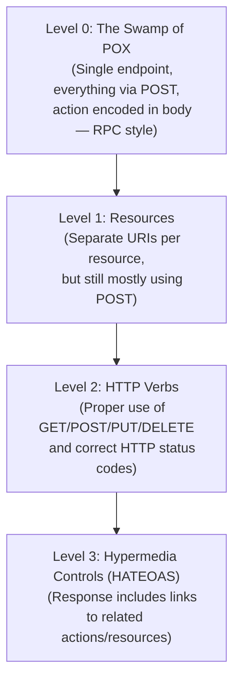
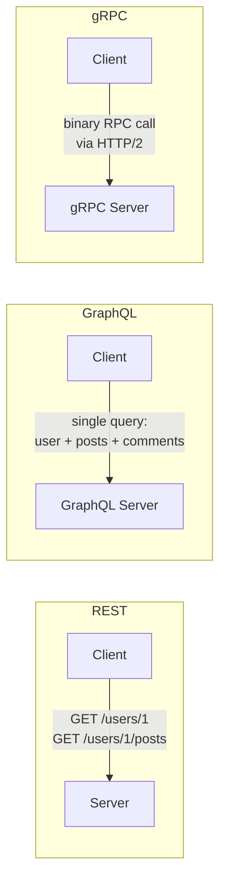
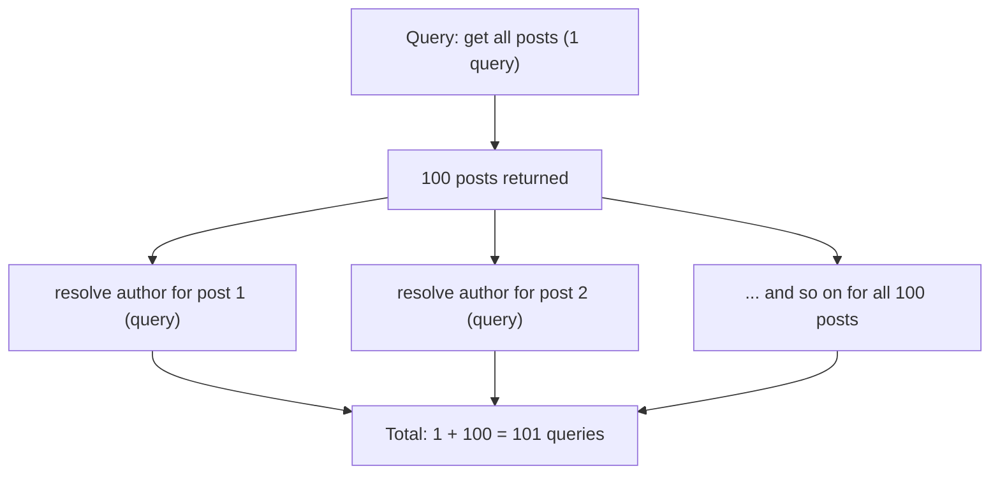
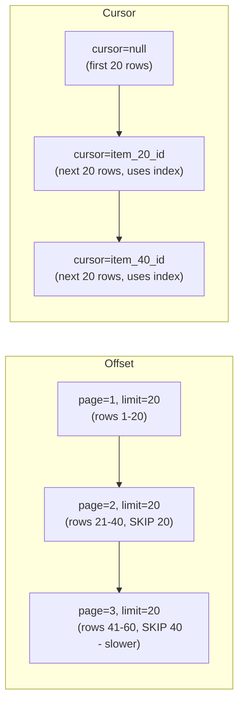
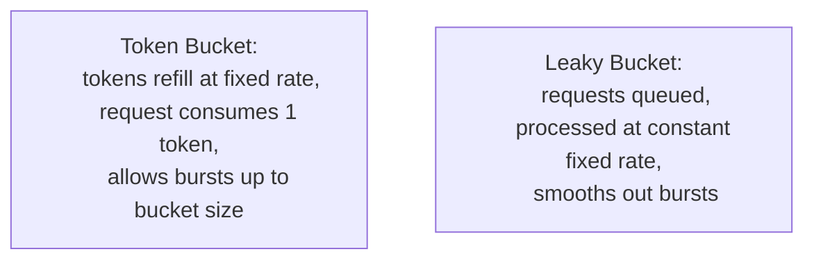
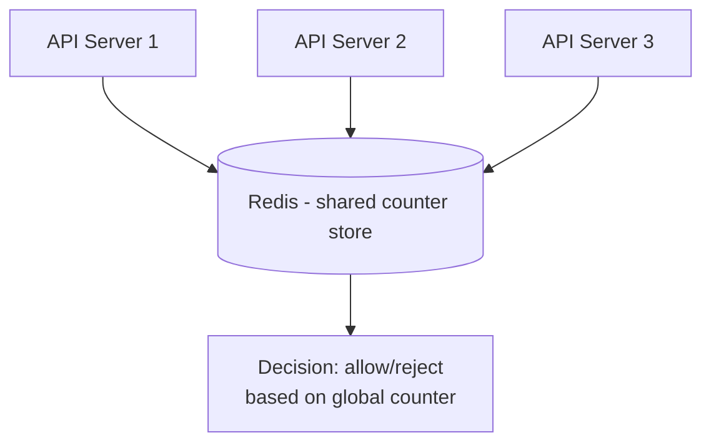
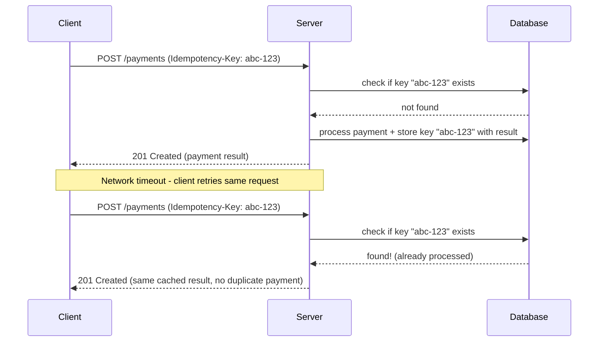
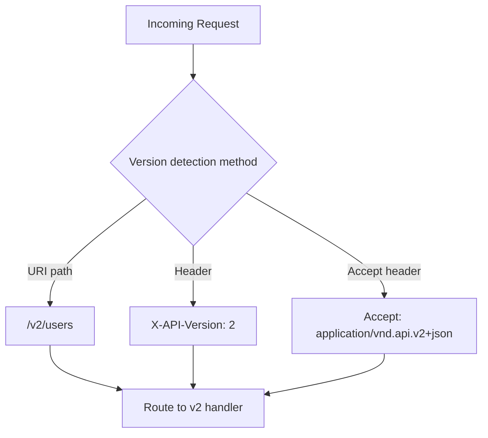
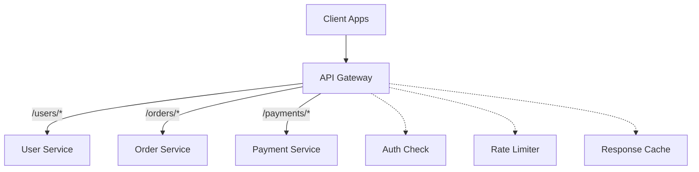
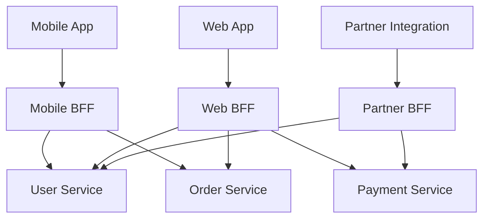

## 35. What are the principles of good API design?

একটা ভালো API design করার সময় নিচের principle গুলো মেনে চলা হয়:

- **Consistency**: Naming convention, response format, error format সবকিছু predictable আর uniform হওয়া উচিত।
- **Simplicity (ease of use)**: API যতটা সম্ভব intuitive হওয়া উচিত, যাতে developer documentation ছাড়াই অনুমান করতে পারে কীভাবে ব্যবহার করবে।
- **Resource-oriented thinking**: API-কে "action" না ভেবে "resource" হিসেবে ভাবা (যেমন `/createUser` না করে `POST /users`)।
- **Statelessness**: প্রতিটা request independently সব প্রয়োজনীয় তথ্য বহন করবে, server কোনো client-side session state রাখবে না — এতে horizontal scaling সহজ হয়।
- **Proper use of HTTP semantics**: সঠিক HTTP method, status code, header ব্যবহার করা।
- **Backward compatibility**: পুরনো client ভেঙে না ফেলে নতুন feature যোগ করা।
- **Good error handling**: Meaningful error message, consistent error structure, সঠিক status code দেওয়া।
- **Documentation-first**: OpenAPI/Swagger spec দিয়ে আগে থেকেই contract define করা।
- **Security by design**: Authentication, authorization, input validation, rate limiting — শুরু থেকেই বিবেচনা করা।

### What makes an API RESTful?

**REST (Representational State Transfer)** একটা architectural style, যেটা মেনে চললে একটা API-কে "RESTful" বলা হয়। মূল constraint গুলো হলো:

- **Client-server separation**: Client আর server independently develop/scale করা যায়।
- **Statelessness**: প্রতিটা request self-contained, server কোনো client context save রাখে না।
- **Cacheability**: Response গুলো explicitly cacheable বা non-cacheable হিসেবে mark করা থাকবে (`Cache-Control` header)।
- **Uniform interface**: Resource identify করা হয় URI দিয়ে (যেমন `/users/123`), আর manipulation হয় standard HTTP method দিয়ে (GET, POST, PUT, DELETE)।
- **Layered system**: Client জানবে না সে সরাসরি server-এর সাথে কথা বলছে নাকি মাঝখানে proxy/gateway আছে।
- **HATEOAS (Hypermedia as the Engine of Application State)**: Response-এ related resource এর link দেওয়া থাকবে, যাতে client navigate করতে পারে (বাস্তবে অনেক API এটা পুরোপুরি মানে না)।

```javascript
// RESTful example
GET    /users/123          // fetch a specific user
POST   /users               // create a new user
PUT    /users/123           // replace a user's data
PATCH  /users/123           // partially update a user
DELETE /users/123           // delete a user
```

### What is the Richardson Maturity Model?

**Richardson Maturity Model** একটা মডেল, যেটা দিয়ে মাপা হয় একটা API কতটা "RESTful" — এটা ৪টা level-এ ভাগ করা:



- **Level 0**: সব request একটাই endpoint-এ যায় (যেমন `/api`), method বলে দেয় body-তে কী action করতে হবে — এটা আসলে RPC style, REST না।
- **Level 1**: প্রতিটা resource-এর জন্য আলাদা URI আছে (`/users`, `/orders`), কিন্তু HTTP method সঠিকভাবে ব্যবহার হয় না (সবকিছুতে POST)।
- **Level 2**: HTTP verb (GET, POST, PUT, DELETE) সঠিকভাবে ব্যবহার করা হয়, সঠিক status code (200, 201, 404, ইত্যাদি) return করা হয় — বেশিরভাগ "modern REST API" এই level-এ থাকে।
- **Level 3**: HATEOAS মেনে চলে — response-এর মধ্যেই related action-এর link থাকে, client hardcode না করেও navigate করতে পারে। এই level বাস্তবে খুব কম API implement করে।

### How do you version a public API?

Public API version করার সময় লক্ষ্য থাকে existing client-দের break না করে নতুন feature/change আনা। সাধারণ approach:

- **URI versioning**: `https://api.example.com/v1/users` — সবচেয়ে common ও সহজে বোঝা যায়।
- **Header versioning**: `Accept: application/vnd.example.v2+json` — URI clean থাকে, কিন্তু client-দের header বুঝতে হয়।
- **Query parameter versioning**: `https://api.example.com/users?version=2` — implement করা সহজ, কিন্তু কম standard।

সাথে সাথে প্রয়োজন:
- Deprecation policy স্পষ্ট করে জানানো (কবে পুরনো version বন্ধ হবে)।
- Deprecated endpoint-এ warning header পাঠানো (`Deprecation`, `Sunset` header)।
- Migration guide/documentation দেওয়া।

---

## 36. What is the difference between REST, GraphQL, and gRPC?

| দিক | REST | GraphQL | gRPC |
|---|---|---|---|
| Data fetching | Fixed structure, প্রতিটা endpoint নির্দিষ্ট response দেয় | Client নিজেই বলে দেয় কোন field দরকার (flexible query) | Strongly-typed RPC call, `.proto` file দিয়ে define করা |
| Protocol | সাধারণত HTTP/1.1 + JSON | সাধারণত HTTP + JSON (single endpoint) | HTTP/2 + Protocol Buffers (binary) |
| Over/under-fetching | সমস্যা হতে পারে (extra বা কম data আসতে পারে) | Solve করে — client exact field চাইতে পারে | N/A (RPC-style, নির্দিষ্ট method call) |
| Performance | Moderate (text-based JSON) | Moderate, কিন্তু query complexity বেশি হলে ধীর হতে পারে | সবচেয়ে দ্রুত (binary serialization, HTTP/2 multiplexing) |
| Browser support | সরাসরি support | সরাসরি support | সরাসরি browser support সীমিত (gRPC-Web দরকার) |
| Best fit | Public API, CRUD-heavy application | Complex/nested data চাহিদার application (mobile app, dashboard) | Internal microservice-to-microservice communication |



### When would you choose GraphQL over REST?

- যখন client-side data চাহিদা খুব **varied ও complex** — যেমন একটা mobile app আর একটা web dashboard একই backend থেকে ভিন্ন ভিন্ন field চায়।
- **Over-fetching/under-fetching** সমস্যা এড়াতে চাইলে — REST-এ প্রায়ই দরকারের চেয়ে বেশি বা কম data আসে, GraphQL-এ client ঠিক যা দরকার তা-ই চায়।
- **Nested/relational data** একসাথে একটা single request-এ আনতে চাইলে (যেমন user + তার posts + প্রতিটা post-এর comments), REST-এ এর জন্য multiple round-trip লাগত।
- Rapidly evolving frontend চাহিদার সাথে backend schema change না করেই মানিয়ে নিতে চাইলে (frontend যা দরকার সেটাই query করে নেয়)।

তবে GraphQL এর trade-off আছে: caching REST-এর মতো সহজ না (সব request POST দিয়ে single endpoint-এ যায়), আর query complexity বেশি হলে backend-এ N+1 বা performance সমস্যা হতে পারে (নিচে আলোচনা করা হয়েছে)।

### What are the performance benefits of gRPC over REST?

- **Binary serialization (Protocol Buffers)**: JSON-এর তুলনায় অনেক ছোট payload size, faster serialize/deserialize।
- **HTTP/2 multiplexing**: একটা single TCP connection-এ একাধিক request/response parallel-ভাবে চালানো যায়, connection overhead কমে।
- **Streaming support**: gRPC-তে client streaming, server streaming, এবং bidirectional streaming built-in support আছে — REST-এ এটা manually (WebSocket/SSE) করতে হয়।
- **Strongly-typed contract**: `.proto` file দিয়ে schema আগে থেকেই define থাকে, code generation হয়, তাই runtime error কম হয়।
- **Connection reuse ও lower latency**: Header compression (HPACK) আর persistent connection এর কারণে repeated call-এ latency কম হয়।

```protobuf
// Example: gRPC service definition (.proto file)
service OrderService {
  rpc GetOrder (OrderRequest) returns (OrderResponse);
  rpc StreamOrderUpdates (OrderRequest) returns (stream OrderStatus);
}

message OrderRequest {
  string order_id = 1;
}

message OrderResponse {
  string order_id = 1;
  string status = 2;
  double total_amount = 3;
}
```

এই কারণে gRPC সাধারণত internal microservice communication-এ বেশি ব্যবহার হয়, যেখানে performance ও type-safety গুরুত্বপূর্ণ, আর REST public-facing API-তে বেশি জনপ্রিয় (browser-friendly, human-readable, সহজে debug করা যায়)।

### What is the n+1 query problem in GraphQL and how is it solved?

**N+1 query problem** তখন হয়, যখন একটা GraphQL query-তে একটা list এর প্রতিটা item এর জন্য আলাদা আলাদা database query চালানো হয়। উদাহরণ: ১টা query দিয়ে সব `posts` আনার পর, প্রতিটা post-এর `author` field resolve করতে যদি আলাদা আলাদা query চলে, তাহলে ১০০টা post-এর জন্য ১০০টা extra query চলবে (মোট ১০১টা query — তাই নাম "N+1")।



সমাধান:

- **DataLoader pattern**: একই request-এর মধ্যে সব `author` resolve করার call গুলো batch করে একটা single query দিয়ে সব author fetch করা (`WHERE id IN (...)`), সাথে caching যোগ করা যাতে একই ID বারবার fetch না হয়।

```javascript
// Example: DataLoader batching in a GraphQL resolver (Node.js)
const DataLoader = require('dataloader');

const authorLoader = new DataLoader(async (authorIds) => {
  const authors = await db.query(
    'SELECT * FROM authors WHERE id = ANY($1)',
    [authorIds]
  );
  // must return results in the same order as authorIds
  return authorIds.map((id) => authors.find((a) => a.id === id));
});

const resolvers = {
  Post: {
    author: (post) => authorLoader.load(post.authorId), // batched automatically
  },
};
```

- **Join-based resolution**: Resolver-এ smart করে upfront SQL `JOIN` ব্যবহার করে সব data একসাথে আনা, যদি query structure predictable হয়।
- **Query complexity analysis**: খুব deep/nested query আটকানোর জন্য query depth/complexity limit বসানো।

---

## 37. How do you design a pagination API for large datasets?

Large dataset এ pagination design করার সময় বিবেচনা করতে হয়:

- Response payload যাতে ছোট ও manageable থাকে (client memory/network overhead কম হয়)।
- Consistent ordering (একটা sort field, যেমন `created_at` বা `id`, নিশ্চিত করা)।
- Total count প্রয়োজন হলে efficiently দেওয়া (বড় dataset-এ `COUNT(*)` expensive হতে পারে)।
- Concurrent write হলেও pagination consistent থাকা (data duplicate বা skip না হওয়া)।

```javascript
// Example response structure for cursor-based pagination
{
  "data": [ /* array of items */ ],
  "pagination": {
    "next_cursor": "eyJpZCI6MTIzfQ==",
    "has_more": true
  }
}
```

### What is the difference between offset pagination and cursor-based pagination?

| দিক | Offset pagination | Cursor-based pagination |
|---|---|---|
| কীভাবে কাজ করে | `LIMIT`/`OFFSET` দিয়ে page number আর size বলা হয় | শেষ item-এর একটা unique pointer (cursor) দিয়ে "এর পরের item" চাওয়া হয় |
| উদাহরণ | `GET /items?page=3&limit=20` | `GET /items?after=eyJpZCI6MTIzfQ==&limit=20` |
| Performance বড় dataset-এ | খারাপ — বড় offset হলে database কে সব আগের row skip করতে হয় (স্লো হয়ে যায়) | ভালো — index ব্যবহার করে সরাসরি cursor position থেকে শুরু করা যায় |
| নতুন data insert হলে consistency | সমস্যা — নতুন item insert হলে page shift হয়ে যায়, item duplicate/skip হতে পারে | Consistent — cursor একটা fixed point ধরে রাখে |
| Random page access (যেমন "page 5-এ যাও") | সহজ | কঠিন — শুধু sequential navigation স্বাভাবিক |



### Why is cursor-based pagination preferred for real-time feeds?

Real-time feed-এ (যেমন social media timeline, notification feed) ক্রমাগত নতুন data insert হতে থাকে। Offset pagination ব্যবহার করলে:

- User page 2-তে যাওয়ার সময় যদি নতুন item top-এ insert হয়ে যায়, তাহলে পুরনো offset ভিত্তিক calculation ভুল item দেখাতে পারে — কিছু item দুইবার দেখানো (duplicate) বা কিছু item একেবারে skip হয়ে যাওয়ার (missed) সমস্যা হয়।
- Cursor-based pagination-এ যেহেতু cursor একটা নির্দিষ্ট item-কে reference করে (যেমন `created_at` + `id`), নতুন item insert হলেও existing cursor-এর position স্থির থাকে — তাই feed scroll করার সময় consistent experience পাওয়া যায়।
- এছাড়া performance দিক থেকেও cursor-based approach ভালো, কারণ deep pagination-এ (feed অনেক নিচে scroll করলে) offset-based query ক্রমশ ধীর হয়ে যায়, cursor-based query index ব্যবহার করে সবসময় দ্রুত থাকে।

### How do you handle page size limits in a public API?

- **Default page size** নির্ধারণ করা (যেমন client `limit` না দিলে default ২০টা item দেওয়া)।
- **Maximum page size cap** বসানো (যেমন client `limit=10000` চাইলেও server সর্বোচ্চ ১০০টা দেবে) — এটা abuse বা accidental overload প্রতিরোধ করে।
- Invalid বা out-of-range limit দিলে proper error response দেওয়া (400 Bad Request) অথবা silently clamp করে max limit-এ নিয়ে আসা (যেটা বেশি user-friendly)।
- Documentation-এ স্পষ্ট করে limit বলে দেওয়া, যাতে client প্রত্যাশিতভাবে integrate করতে পারে।

```javascript
// Example: enforcing page size limits
function getPageSize(requestedLimit) {
  const DEFAULT_LIMIT = 20;
  const MAX_LIMIT = 100;

  if (!requestedLimit) return DEFAULT_LIMIT;
  return Math.min(parseInt(requestedLimit, 10), MAX_LIMIT);
}
```

---

## 38. What is rate limiting in APIs and how do you implement it?

**Rate limiting** হলো একটা নির্দিষ্ট সময়ের মধ্যে একজন client কতগুলো request পাঠাতে পারবে, তা সীমিত করে দেওয়া। এটা করা হয়:

- **Abuse/DoS প্রতিরোধ** করতে — কোনো client (ইচ্ছাকৃত বা bug-এর কারণে) অতিরিক্ত request পাঠিয়ে server overload করতে না পারে।
- **Fair usage** নিশ্চিত করতে — একজন client-এর ভারী ব্যবহারের কারণে অন্য client-রা যেন সমস্যায় না পড়ে।
- **Cost control** — বিশেষ করে যেসব API downstream paid service (SMS, email, third-party API) call করে।
- **SLA/tiered plan enforce করতে** — যেমন free tier ১০০ request/hour, paid tier ১০,০০০ request/hour।

### What algorithms are used for rate limiting?

- **Fixed Window Counter**: একটা নির্দিষ্ট সময়ের window (যেমন প্রতি মিনিট) এ একটা counter রাখা হয়, limit পার হলে reject। সহজ কিন্তু window boundary-তে burst সমস্যা হতে পারে (যেমন window শেষের দিকে আর নতুন window শুরুতে পরপর অনেক request গেলে দ্বিগুণ traffic যেতে পারে)।
- **Sliding Window Log**: প্রতিটা request-এর timestamp রাখা হয়, প্রতিবার নতুন request এলে গত window-এর মধ্যে কতগুলো request হয়েছে গণনা করা হয়। খুব accurate কিন্তু memory-heavy (প্রতিটা request store করতে হয়)।
- **Sliding Window Counter**: Fixed window আর sliding log-এর মাঝামাঝি — আগের ও বর্তমান window-এর counter দিয়ে weighted average calculate করা হয়, accuracy আর efficiency-এর মধ্যে ভালো balance দেয়।
- **Token Bucket**: একটা "bucket"-এ নির্দিষ্ট হারে token যোগ হতে থাকে (যেমন প্রতি সেকেন্ডে ১টা), প্রতিটা request একটা token consume করে। Bucket খালি হলে request reject হয়। এটা burst traffic কিছুটা allow করে (bucket ভর্তি থাকলে), কিন্তু sustained rate নিয়ন্ত্রণে রাখে।
- **Leaky Bucket**: Request একটা queue-তে জমা হয়, আর একটা fixed rate-এ process হয় (leak করে) — এটা output rate কে সবসময় smooth/constant রাখে, burst allow করে না।



```javascript
// Simple token bucket implementation
class TokenBucket {
  constructor(capacity, refillRatePerSecond) {
    this.capacity = capacity;
    this.tokens = capacity;
    this.refillRate = refillRatePerSecond;
    this.lastRefill = Date.now();
  }

  tryConsume() {
    this._refill();
    if (this.tokens >= 1) {
      this.tokens -= 1;
      return true; // request allowed
    }
    return false; // rate limited
  }

  _refill() {
    const now = Date.now();
    const elapsedSeconds = (now - this.lastRefill) / 1000;
    this.tokens = Math.min(this.capacity, this.tokens + elapsedSeconds * this.refillRate);
    this.lastRefill = now;
  }
}
```

### How do you implement distributed rate limiting?

Single server হলে in-memory counter দিয়েই rate limiting করা যায়, কিন্তু distributed system-এ (একাধিক API server instance) সব instance-কে একই limit মেনে চলতে হয়, তাই:

- **Centralized store (Redis)** ব্যবহার করা — সব server instance একই Redis instance-এ counter/token রাখে ও update করে, তাই client-এর প্রকৃত global rate track হয়।
- **Atomic operations**: Race condition এড়াতে Redis-এর `INCR`, বা Lua script দিয়ে atomic increment+check করা।
- **Sliding window with Redis sorted sets**: প্রতিটা request timestamp Redis sorted set-এ রাখা, পুরনো entry বাদ দেওয়া, বর্তমান count check করা।

```javascript
// Example: distributed rate limiting using Redis
async function isAllowed(userId, limit = 100, windowSeconds = 60) {
  const key = `rate_limit:${userId}`;
  const current = await redis.incr(key);

  if (current === 1) {
    await redis.expire(key, windowSeconds); // set TTL only on first request in window
  }

  return current <= limit;
}
```



- **Local + global hybrid approach**: প্রতিটা server নিজের কাছে একটা approximate local limit রাখে (কম Redis call করতে), আর periodically Redis-এর সাথে sync করে — এতে latency কম হয় কিন্তু কিছুটা accuracy trade-off হয়।

### How do you communicate rate limit status to clients (HTTP headers)?

Standard practice হলো response-এ নির্দিষ্ট HTTP header দিয়ে rate limit status জানানো:

```
X-RateLimit-Limit: 100
X-RateLimit-Remaining: 42
X-RateLimit-Reset: 1735300000
```

- `X-RateLimit-Limit`: এই window-এ সর্বোচ্চ কতগুলো request allowed।
- `X-RateLimit-Remaining`: বর্তমান window-এ আর কতগুলো request বাকি আছে।
- `X-RateLimit-Reset`: কখন window reset হবে (Unix timestamp বা seconds)।

Limit exceed হলে সঠিক status code আর header পাঠানো:

```
HTTP/1.1 429 Too Many Requests
Retry-After: 30
```

`429 Too Many Requests` status code ব্যবহার করা হয়, আর `Retry-After` header দিয়ে client-কে বলে দেওয়া হয় কত সেকেন্ড পর আবার চেষ্টা করা উচিত।

---

## 39. How do you design an idempotent API?

**Idempotent API** ডিজাইন করার মূল লক্ষ্য হলো — একই request একাধিকবার পাঠালেও (যেমন network timeout-এর কারণে client retry করলে) ফলাফল একবার পাঠানোর মতোই থাকবে, কোনো unintended side effect (যেমন duplicate order তৈরি) হবে না।

Design করার সাধারণ approach:

- সম্ভব হলে idempotent HTTP method ব্যবহার করা (GET, PUT, DELETE)।
- Non-idempotent operation (POST) এর জন্য **idempotency key** ব্যবহার করা।
- Database-এ unique constraint রাখা, যাতে duplicate insert আটকানো যায় (defense-in-depth হিসেবে)।

### Which HTTP methods are idempotent by definition?

| Method | Idempotent? | ব্যাখ্যা |
|---|---|---|
| `GET` | হ্যাঁ | শুধু data fetch করে, কোনো state change করে না |
| `PUT` | হ্যাঁ | Resource-কে একটা নির্দিষ্ট state-এ "replace" করে — একাধিকবার একই request পাঠালেও ফলাফল একই থাকে |
| `DELETE` | হ্যাঁ | একবার delete করলে resource চলে যায়; আবার delete request পাঠালেও ফলাফল same (resource নেই) |
| `POST` | না | সাধারণত নতুন resource তৈরি করে — একই request দুইবার পাঠালে দুইটা resource তৈরি হয়ে যেতে পারে |
| `PATCH` | নির্ভর করে | যদি absolute value set করে (যেমন `{"status": "active"}`) তাহলে idempotent, কিন্তু যদি relative operation হয় (যেমন `{"increment_balance": 10}`) তাহলে idempotent না |

### How do you make a POST endpoint idempotent using idempotency keys?

Client প্রতিটা POST request-এর সাথে একটা unique **idempotency key** পাঠায় (সাধারণত একটা UUID, client generate করে)। Server সেই key ব্যবহার করে track রাখে কোন key দিয়ে ইতিমধ্যে request process হয়েছে।



```javascript
// Example: idempotency key handling in an Express.js endpoint
app.post('/payments', async (req, res) => {
  const idempotencyKey = req.headers['idempotency-key'];

  if (!idempotencyKey) {
    return res.status(400).json({ error: 'Idempotency-Key header is required' });
  }

  const existing = await db.query(
    'SELECT response_body, status_code FROM idempotency_keys WHERE key = $1',
    [idempotencyKey]
  );

  if (existing.rowCount > 0) {
    // return the same response as before, without re-processing the payment
    const cached = existing.rows[0];
    return res.status(cached.status_code).json(JSON.parse(cached.response_body));
  }

  const payment = await processPayment(req.body);

  await db.query(
    'INSERT INTO idempotency_keys (key, response_body, status_code) VALUES ($1, $2, $3)',
    [idempotencyKey, JSON.stringify(payment), 201]
  );

  res.status(201).json(payment);
});
```

গুরুত্বপূর্ণ বিষয়: idempotency key-কে একটা reasonable time (যেমন ২৪ ঘণ্টা) পর্যন্ত store রাখা হয়, তারপর expire করে দেওয়া হয় (storage বাঁচানোর জন্য), আর payment processing + key storage একই database transaction-এ atomic ভাবে করা হয় যাতে race condition এ duplicate না হয়।

---

## 40. How do you handle API versioning?

API versioning এর মূল উদ্দেশ্য হলো, breaking change আনার সময় existing client-দের কাজ বন্ধ না করে নতুন version চালু করা, আর ধীরে ধীরে পুরনো version deprecate করা।

### What are the different API versioning strategies?

| Strategy | উদাহরণ | সুবিধা | অসুবিধা |
|---|---|---|---|
| **URI path versioning** | `/v1/users`, `/v2/users` | সহজ, স্পষ্ট, cache-friendly | URL "clean" থাকে না, resource identity version-এর সাথে মিশে যায় |
| **Query parameter versioning** | `/users?version=2` | Implement করা সহজ | কম standard, caching-এ জটিলতা হতে পারে |
| **Header versioning (custom header)** | `X-API-Version: 2` | URL clean থাকে | কম discoverable, client-দের header মনে রাখতে হয় |
| **Content negotiation (Accept header)** | `Accept: application/vnd.example.v2+json` | HTTP standard মেনে চলে, RESTful | Implement করা তুলনামূলক জটিল, কম intuitive |



বাস্তবে বেশিরভাগ public API (Stripe, GitHub, Twitter) **URI path versioning** বা **date-based versioning** (যেমন Stripe এর `Stripe-Version: 2023-10-16` header) ব্যবহার করে, কারণ এটা সহজে বোঝা যায় ও debug করা যায়।

### How long should you maintain backward compatibility in a versioned API?

এটা নির্ভর করে API-এর user base ও business context-এর উপর, তবে সাধারণ best practice:

- **Deprecation notice আগে থেকে দেওয়া**: নতুন version release করার সাথে সাথেই পুরনো version-এর জন্য একটা নির্দিষ্ট **sunset date** ঘোষণা করা (সাধারণত ৬ মাস থেকে ২ বছর, business-এর গুরুত্ব অনুযায়ী)।
- **Deprecation header পাঠানো**: Response-এ `Deprecation` আর `Sunset` header যোগ করা, যাতে client automated ভাবে বুঝতে পারে।

```
Deprecation: true
Sunset: Sat, 31 Dec 2026 23:59:59 GMT
Link: <https://api.example.com/docs/migration-v2>; rel="deprecation"
```

- **Usage monitoring**: পুরনো version এখনো কতজন client ব্যবহার করছে তা track করা, high-usage client-দের সাথে সরাসরি communicate করা।
- **Gradual rollout**: হঠাৎ বন্ধ না করে ধাপে ধাপে (grace period, warning email, দরকার হলে extension) বন্ধ করা।
- **Non-breaking change-এর জন্য নতুন version না বানানো**: নতুন optional field যোগ করা, নতুন endpoint যোগ করা — এগুলো backward-compatible, তাই এর জন্য version বাড়ানোর দরকার নেই। শুধু breaking change (field remove/rename, response structure বদল, required field যোগ) এর জন্যই নতুন version দরকার।

---

## 41. What is an API gateway and what does it provide?

**API Gateway** হলো একটা single entry point, যেটা client আর backend microservice-গুলোর মাঝখানে বসে থাকে। Client সরাসরি প্রতিটা microservice-এর সাথে যোগাযোগ না করে, একটা centralized gateway-এর মাধ্যমে request পাঠায়, আর gateway সেটা সঠিক backend service-এ route করে দেয়।

API Gateway সাধারণত যা provide করে:

- **Request routing**: কোন path/method কোন backend service-এ যাবে তা ঠিক করা।
- **Authentication/authorization**: সব service-এ আলাদা করে auth logic না লিখে, একটা central জায়গায় handle করা।
- **Rate limiting ও throttling**: Client-ভিত্তিক request limit centrally enforce করা।
- **Load balancing**: একাধিক backend instance-এর মধ্যে traffic distribute করা।
- **Request/response transformation**: Protocol translation (যেমন REST client থেকে internal gRPC service-এ call), header manipulation।
- **Caching**: Common response cache করে backend load কমানো।
- **Logging ও monitoring**: Centralized জায়গা থেকে সব traffic-এর visibility পাওয়া।
- **SSL termination**: HTTPS handling centrally করা, backend service-গুলোকে plain HTTP-তে রাখা।



### What is the difference between an API gateway and a reverse proxy?

| দিক | Reverse Proxy | API Gateway |
|---|---|---|
| মূল কাজ | Traffic forward করা, load balancing, SSL termination | Reverse proxy-এর সব কাজ + API-specific logic (auth, rate limiting, transformation, aggregation) |
| Business logic awareness | সাধারণত কম, generic traffic handling | API contract, versioning, request/response structure সম্পর্কে aware |
| Protocol translation | সাধারণত করে না | প্রায়ই করে (REST ↔ gRPC, GraphQL aggregation) |
| উদাহরণ | Nginx, HAProxy (raw reverse proxy mode) | Kong, AWS API Gateway, Apigee, Zuul |

সহজ কথায়, **API Gateway একটা specialized reverse proxy**, যেটা শুধু traffic forward করে না, বরং API-centric অতিরিক্ত feature (auth, rate limiting, aggregation) ও যোগ করে।

### How does an API gateway handle authentication and authorization?

- **Centralized authentication**: Client প্রতিটা request-এ token (JWT, OAuth2 access token) পাঠায়, gateway সেটা validate করে — backend service-গুলোকে আলাদা করে auth logic implement করতে হয় না।
- **Token validation**: JWT হলে signature verify করা (public key দিয়ে), অথবা opaque token হলে auth server-কে call করে validate করা (introspection endpoint)।
- **Authorization enforcement**: Token থেকে extract করা role/scope অনুযায়ী gateway ঠিক করে client নির্দিষ্ট endpoint access করতে পারবে কিনা, প্রয়োজনে backend-এ request forward করার আগেই reject করে দেয় (403 Forbidden)।
- **Context propagation**: Validate করা user identity/claims backend service-এ header হিসেবে forward করা (যেমন `X-User-Id`, `X-User-Roles`), যাতে backend আলাদা করে token আবার validate না করেই trust করে ব্যবহার করতে পারে।

```javascript
// Example: API Gateway middleware for JWT authentication
async function authenticate(req, res, next) {
  const token = req.headers.authorization?.replace('Bearer ', '');

  if (!token) {
    return res.status(401).json({ error: 'Missing authentication token' });
  }

  try {
    const decoded = jwt.verify(token, PUBLIC_KEY, { algorithms: ['RS256'] });
    req.headers['x-user-id'] = decoded.sub;
    req.headers['x-user-roles'] = decoded.roles.join(',');
    next(); // forward to backend service
  } catch (err) {
    return res.status(401).json({ error: 'Invalid or expired token' });
  }
}
```

### What is a BFF (Backend for Frontend) pattern?

**BFF (Backend for Frontend)** একটা pattern, যেখানে প্রতিটা client type (web, mobile, third-party partner) এর জন্য একটা আলাদা, নিজস্ব gateway/backend layer রাখা হয় — একটা single generic API gateway সবার জন্য ব্যবহার না করে।

কারণ: বিভিন্ন client-এর data চাহিদা ও UX pattern ভিন্ন হতে পারে — mobile app কম data চায় (bandwidth-conscious), web dashboard বেশি detailed data চায়। একটা single shared API সবার জন্য optimize করা কঠিন হয়ে যায়।



সুবিধা:
- প্রতিটা client team independently নিজেদের BFF develop ও deploy করতে পারে, নিজেদের চাহিদা অনুযায়ী data aggregate/shape করতে পারে।
- Frontend-specific logic (data transformation, aggregation, caching) backend microservice থেকে আলাদা থাকে, microservice গুলো generic থাকে।

Trade-off:
- একাধিক BFF maintain করা মানে বাড়তি operational overhead, আর কিছু code duplication হতে পারে বিভিন্ন BFF-এর মধ্যে।