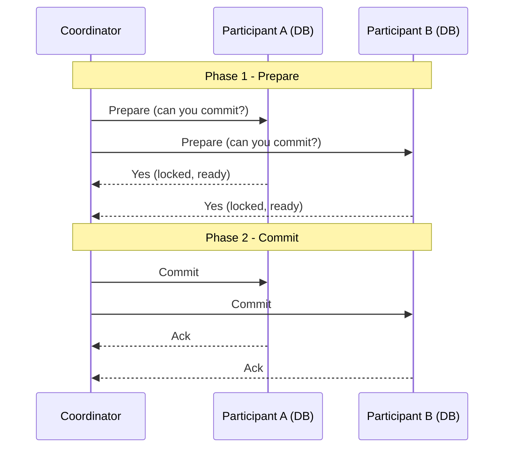
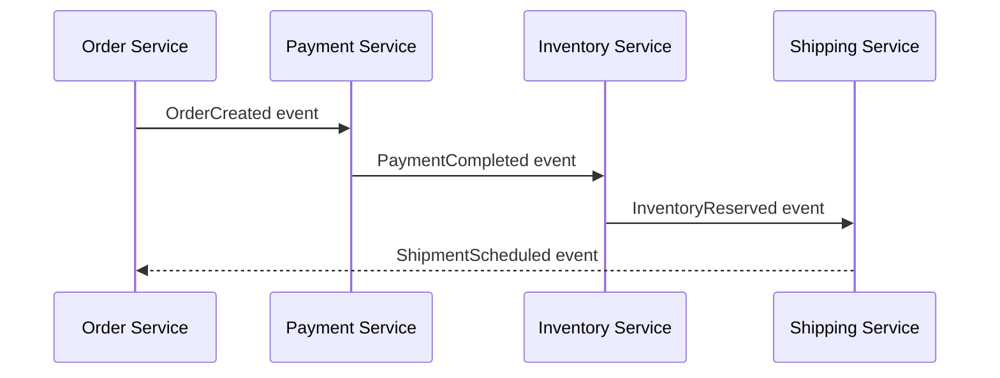
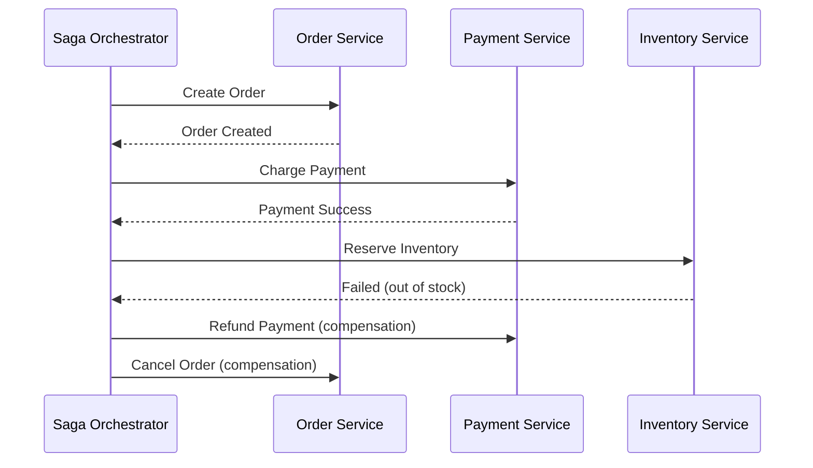
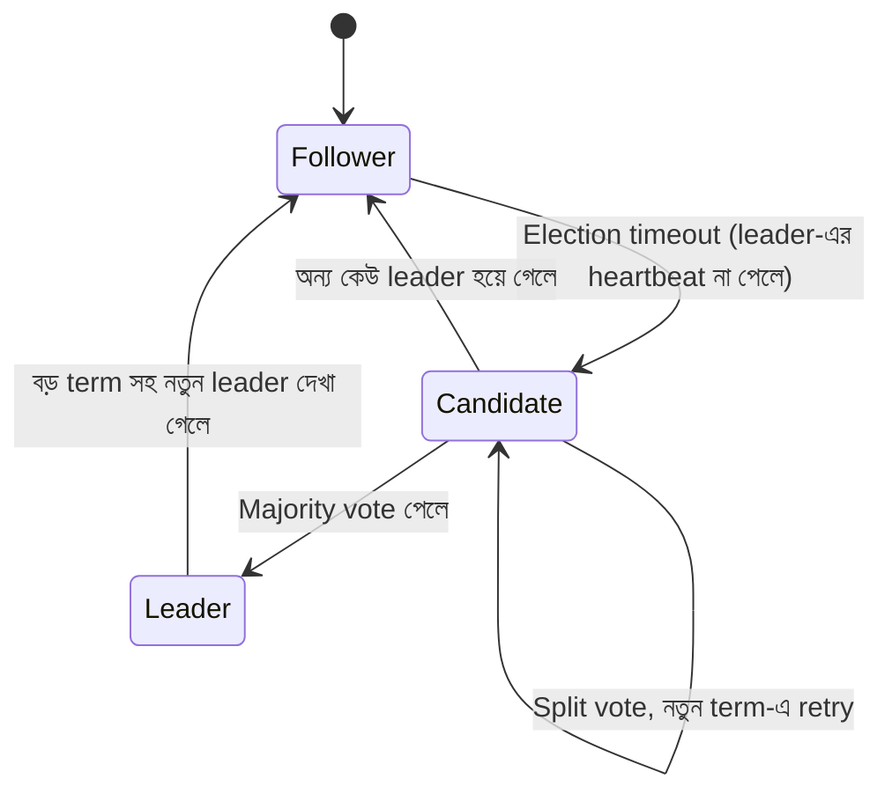
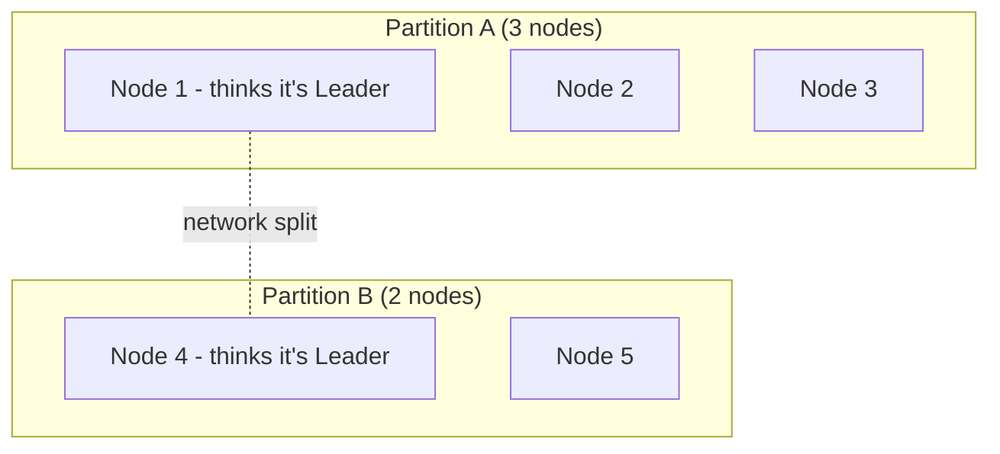
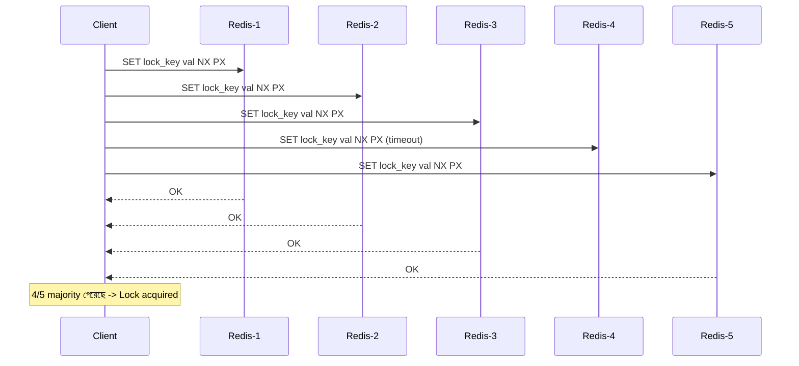
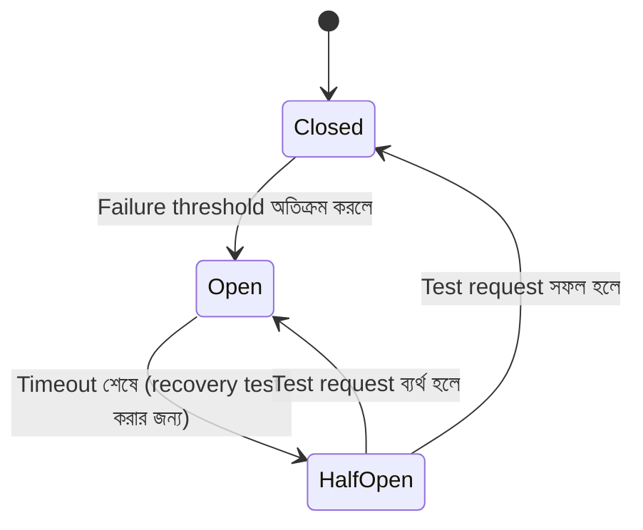
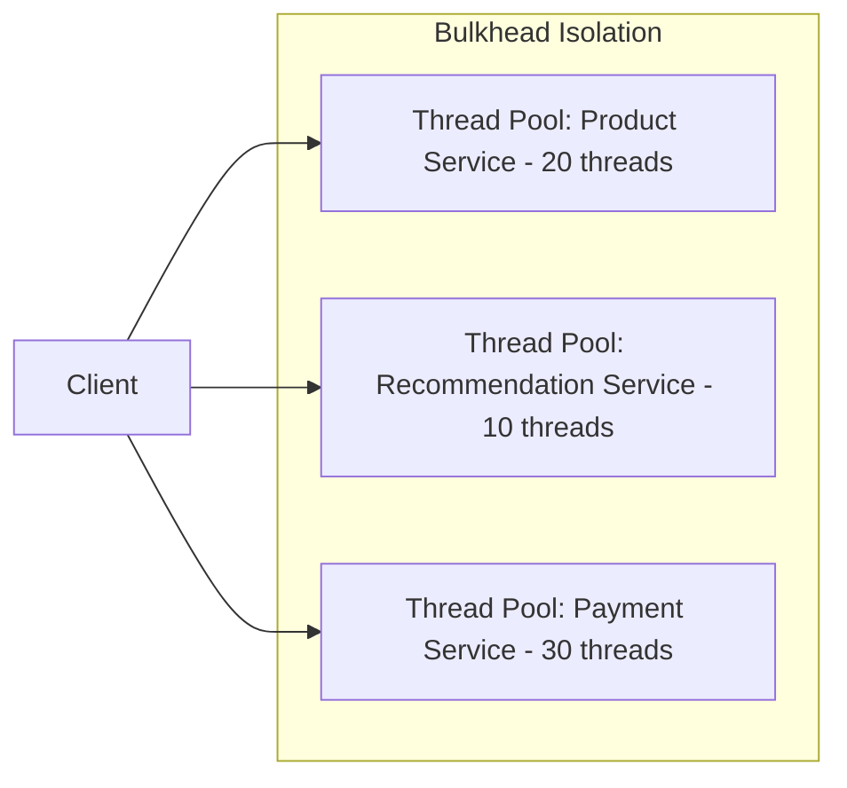
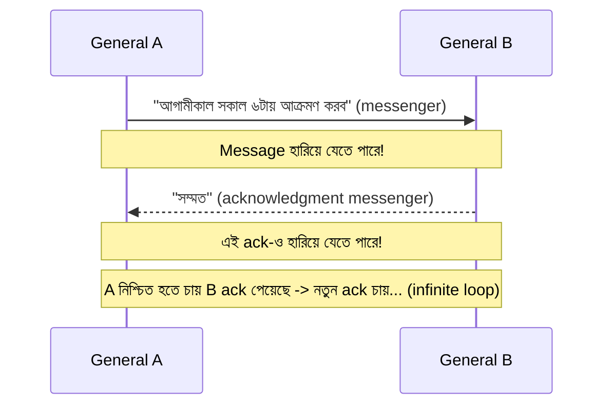
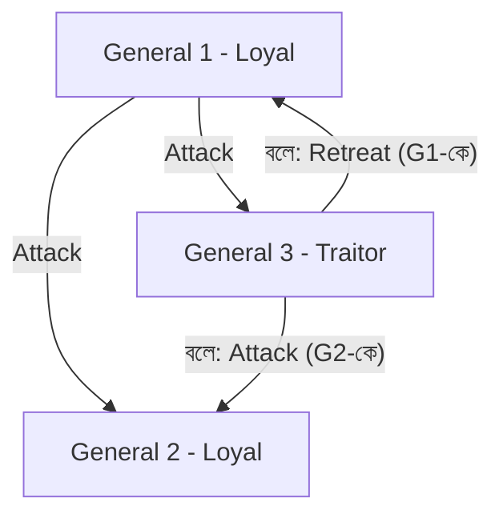

## 42. What are the fallacies of distributed computing?

**Fallacies of Distributed Computing** হলো ৮টি ভুল ধারণা (assumption) যেগুলো নতুন distributed system builders প্রায়ই বিশ্বাস করে ফেলেন, কিন্তু বাস্তবে এগুলো সত্যি নয়। L. Peter Deutsch এবং তার Sun Microsystems-এর সহকর্মীরা এই তালিকাটা তৈরি করেছিলেন। ধারণাগুলো হলো:

1. **The network is reliable** — নেটওয়ার্ক সবসময় কাজ করবে, packet loss হবে না।
2. **Latency is zero** — একটা request পাঠানো এবং response পাওয়ার মধ্যে কোনো delay নেই।
3. **Bandwidth is infinite** — যত ইচ্ছা data পাঠানো যাবে, কোনো limit নেই।
4. **The network is secure** — network এ কোনো malicious actor নেই।
5. **Topology doesn't change** — server, router, connection সবসময় একই থাকবে।
6. **There is one administrator** — পুরো system একজনই manage করে।
7. **Transport cost is zero** — data পাঠাতে কোনো resource/cost লাগে না।
8. **The network is homogeneous** — সব node একই protocol/hardware ব্যবহার করে।

বাস্তবে এই আটটা assumption-ই ভুল, এবং প্রতিটা distributed system design করার সময় এগুলো মাথায় রাখতে হয়।

### How does each fallacy affect system design decisions?

| Fallacy | Design Impact |
|---|---|
| Network is reliable | **Retry logic**, **timeout**, এবং **idempotent operation** design করতে হয়, কারণ request যেকোনো সময় fail করতে পারে। |
| Latency is zero | Synchronous call কমিয়ে **asynchronous messaging** বা **caching** ব্যবহার করতে হয় যাতে user experience খারাপ না হয়। |
| Bandwidth is infinite | Payload size ছোট রাখা, **compression**, **pagination**, এবং data serialization format (protobuf, avro) optimize করা দরকার। |
| Network is secure | **mTLS**, **authentication/authorization**, এবং encryption in-transit বাধ্যতামূলক করতে হয়। |
| Topology doesn't change | **Service discovery** (Consul, Eureka) এবং **DNS-based routing** ব্যবহার করতে হয়, hard-coded IP address এড়িয়ে চলতে হয়। |
| One administrator | **Distributed configuration management**, **RBAC**, এবং multi-team coordination process দরকার হয়। |
| Transport cost is zero | Network call এর সংখ্যা কমানো (batching), এবং cost-aware architecture design করা। |
| Network is homogeneous | **API versioning**, standard protocol (HTTP, gRPC) এবং backward compatibility নিশ্চিত করা। |

সারমর্ম হলো — প্রতিটা fallacy সরাসরি নির্দেশ করে যে distributed system-এ **failure একটা normal ঘটনা**, exception নয়। তাই design-এর সময় "network call fail হতে পারে" এই assumption নিয়েই কোড লিখতে হয়।

### What is "the network is reliable" fallacy and how do you design around it?

এই fallacy বলে যে developer-রা ধরে নেন network call সবসময় সফল হবে — কিন্তু বাস্তবে packet loss, connection drop, DNS failure, hardware failure ইত্যাদি প্রতিনিয়ত ঘটে। এটাকে design এ handle করার প্রধান কৌশলগুলো হলো:

- **Timeouts** — অনির্দিষ্টকাল অপেক্ষা না করে একটা নির্দিষ্ট সময় পরে fail করা।
- **Retries with exponential backoff** — বারবার সাথে সাথে retry না করে ধীরে ধীরে wait time বাড়ানো।
- **Circuit breaker** — বারবার fail হতে থাকলে downstream call বন্ধ রাখা (Q47 দেখুন)।
- **Idempotency** — একই request একাধিকবার গেলেও যেন side effect একবারই হয়।

```javascript
// Retry with exponential backoff এবং timeout ব্যবহার করে network call
async function callServiceWithRetry(fn, maxRetries = 3, baseDelayMs = 200) {
  for (let attempt = 0; attempt < maxRetries; attempt++) {
    const controller = new AbortController();
    const timeout = setTimeout(() => controller.abort(), 2000); // 2s timeout

    try {
      const response = await fetch('https://payment-service/api/charge', {
        signal: controller.signal,
        method: 'POST',
        headers: { 'Idempotency-Key': 'order-12345' }, // idempotent request
      });
      clearTimeout(timeout);
      if (!response.ok) throw new Error(`HTTP ${response.status}`);
      return await response.json();
    } catch (err) {
      clearTimeout(timeout);
      if (attempt === maxRetries - 1) throw err;
      const delay = baseDelayMs * 2 ** attempt; // exponential backoff
      await new Promise((r) => setTimeout(r, delay));
    }
  }
}
```

এখানে `Idempotency-Key` ব্যবহার করা হয়েছে যাতে retry হলেও একই charge দুইবার না হয় — এটা "network is reliable" fallacy handle করার একটা core practice।

---

## 43. What is a distributed transaction and how do you handle it?

**Distributed transaction** হলো এমন একটা transaction যেটা একাধিক আলাদা database, service, বা node জুড়ে চলে, কিন্তু তাদের সবাইকে একসাথে **ACID** (Atomicity, Consistency, Isolation, Durability) guarantee মেনে সম্পন্ন হতে হয়। উদাহরণ হিসেবে বলা যায় — একটা e-commerce order place করার সময় একইসাথে "Order Service"-এ order তৈরি হচ্ছে, "Inventory Service"-এ stock কমছে, এবং "Payment Service"-এ টাকা কাটা হচ্ছে। এই তিনটা কাজ যদি আলাদা database-এ থাকে, তাহলে সবগুলো একসাথে succeed অথবা একসাথে fail করতে হবে — নইলে data inconsistent হয়ে যাবে।

Distributed transaction handle করার প্রধান দুইটা পদ্ধতি হলো:
1. **Two-Phase Commit (2PC)** — strong consistency, কিন্তু blocking এবং কম scalable।
2. **SAGA pattern** — eventual consistency, কিন্তু highly scalable এবং microservices-friendly।

### What is the two-phase commit (2PC) protocol?

2PC একটা distributed algorithm যেখানে একটা **Coordinator (Transaction Manager)** সব **Participant**-দের (individual database/service) সাথে দুই ধাপে কাজ করে, যাতে সবাই একসাথে commit বা একসাথে rollback করে।

**Phase 1 — Prepare (Voting Phase):**
Coordinator প্রতিটা participant-কে জিজ্ঞেস করে, "তুমি কি commit করতে প্রস্তুত?" প্রতিটা participant তার কাজ করে (কিন্তু commit করে না), resource lock করে রাখে, এবং "Yes" বা "No" vote পাঠায়।

**Phase 2 — Commit/Abort:**
যদি সবাই "Yes" বলে, coordinator সবাইকে "Commit" নির্দেশ পাঠায়। কোনো একজনও "No" বললে, সবাইকে "Rollback" নির্দেশ পাঠানো হয়।



**সমস্যা:** 2PC-তে coordinator যদি Phase 2-তে crash করে, participant-রা lock ধরে রেখে অনির্দিষ্টকাল অপেক্ষা করে (**blocking protocol**)। এটা throughput কমিয়ে দেয় এবং microservices architecture-এ বহুল ব্যবহৃত নয়।

### What is the SAGA pattern and how does it compare to 2PC?

SAGA হলো একটা sequence of **local transaction**, যেখানে প্রতিটা step নিজের database-এ commit করে ফেলে এবং পরের step-কে event/message পাঠায়। যদি মাঝপথে কোনো step fail করে, তাহলে আগের সম্পন্ন হওয়া step গুলোকে undo করার জন্য **compensating transaction** চালানো হয়।

| বিষয় | 2PC | SAGA |
|---|---|---|
| Consistency | Strong (ACID) | Eventual consistency |
| Locking | সব resource lock হয়ে থাকে | কোনো long-held lock নেই |
| Failure handling | Rollback (আসল transaction বাতিল) | Compensating transaction (উল্টো কাজ চালানো) |
| Scalability | কম, blocking নেচার | বেশি, microservices-friendly |
| Complexity | Coordinator লজিক জটিল | Compensation logic design করা জটিল |
| ব্যবহার | Monolith/single DB, banking core system | Microservices, e-commerce order flow |

সহজভাবে — 2PC নিরাপদ কিন্তু ধীর ও fragile, আর SAGA দ্রুত ও scalable কিন্তু সাময়িক inconsistency মেনে নিতে হয়।

---

## 44. What is the SAGA pattern in microservices?

Microservices architecture-এ যেহেতু প্রতিটা service-এর নিজস্ব database থাকে (**Database per Service** pattern), তাই traditional ACID transaction ব্যবহার করা সম্ভব হয় না। SAGA pattern এই সমস্যার সমাধান দেয় — একটা বড় business transaction-কে ছোট ছোট local transaction-এ ভাগ করে, প্রতিটা local transaction একটা service-এর মধ্যেই commit হয়, এবং প্রতিটা transaction-এর জন্য একটা **compensating transaction** define করা থাকে যেটা ব্যর্থ হলে আগের কাজ undo করে।

উদাহরণ — Order placement SAGA:
1. Order Service: Order তৈরি করে (status: PENDING)
2. Payment Service: টাকা কাটে
3. Inventory Service: Stock কমায়
4. Shipping Service: Shipment schedule করে

যদি step 3-এ stock না থাকে, তাহলে step 2-এর টাকা **refund** (compensation) করতে হবে এবং step 1-এর order **cancel** করতে হবে।

### What is the difference between choreography and orchestration in SAGA?

**Choreography** — কোনো central controller নেই। প্রতিটা service একটা event publish করে, আর অন্য service সেই event শুনে নিজের কাজ করে এবং নতুন event publish করে। এটা **decentralized**।



**Orchestration** — একটা central **Orchestrator** (SAGA Execution Coordinator) থাকে যে প্রতিটা service-কে সরাসরি command পাঠায় এবং পুরো flow control করে। এটা **centralized**।



| বিষয় | Choreography | Orchestration |
|---|---|---|
| Control | Decentralized (event-driven) | Centralized (orchestrator) |
| Coupling | Loose, কিন্তু flow বোঝা কঠিন | Orchestrator জানে পুরো flow |
| Complexity বাড়লে | Service সংখ্যা বাড়লে debug করা কঠিন হয়ে যায় | Orchestrator-এ complexity concentrate হয়, কিন্তু manageable |
| Best fit | ছোট, কম number of steps-এর saga | বড়, জটিল multi-step business process |

### How do you handle partial failures in a SAGA?

Partial failure মানে হলো saga-এর মাঝপথে কোনো step fail করেছে, কিন্তু আগের কিছু step ইতিমধ্যে commit হয়ে গেছে। এটা handle করার কৌশলগুলো:

- **Compensating transactions** — প্রতিটা forward step-এর জন্য একটা semantically opposite step define করা (যেমন `ChargePayment` এর compensation হলো `RefundPayment`)।
- **Idempotent operations** — compensation বা retry একাধিকবার চললেও যেন একই ফলাফল আসে।
- **Saga log/state persistence** — orchestrator crash করলে যেন সে কোথায় ছিল সেটা পুনরুদ্ধার (recover) করতে পারে।
- **Semantic lock/pending state** — যেমন order-কে সাথে সাথে "CONFIRMED" না করে "PENDING" রাখা, যাতে অন্য process জানে এটা এখনো finalize হয়নি।

```javascript
// একটা simplified saga step যার নিজস্ব compensation logic আছে
const sagaSteps = [
  {
    action: () => paymentService.charge(orderId),
    compensate: () => paymentService.refund(orderId),
  },
  {
    action: () => inventoryService.reserve(orderId),
    compensate: () => inventoryService.release(orderId),
  },
];

async function runSaga(steps) {
  const completed = [];
  try {
    for (const step of steps) {
      await step.action();
      completed.push(step);
    }
  } catch (err) {
    // ব্যর্থ হলে, ইতিমধ্যে সম্পন্ন হওয়া step গুলো উল্টো ক্রমে compensate করা হয়
    for (const step of completed.reverse()) {
      await step.compensate();
    }
    throw err;
  }
}
```

---

## 45. What is leader election and why is it needed in distributed systems?

**Leader election** হলো একটা প্রক্রিয়া যার মাধ্যমে distributed system-এর একাধিক node-এর মধ্য থেকে একজনকে **leader (বা primary/master)** হিসেবে বেছে নেওয়া হয়, বাকিরা **follower** হিসেবে থাকে। এটা দরকার কারণ:

- **Coordination সহজ হয়** — সিদ্ধান্ত নেওয়ার জন্য একজন single point of authority থাকলে conflict কমে যায়।
- **Write consistency নিশ্চিত হয়** — শুধু leader-ই write গ্রহণ করে, তাই একাধিক node একসাথে conflicting write করার সম্ভাবনা থাকে না।
- **High availability** — leader down হয়ে গেলে নতুন leader নির্বাচিত হয়, ফলে system চলতেই থাকে (যেমন Kafka partition leader, database replication master, Kubernetes control plane)।

### How does the Raft consensus algorithm work?

Raft একটা **consensus algorithm** যেটা বোঝা সহজ (Paxos-এর তুলনায়) এবং leader election + log replication দুটোই handle করে। Raft-এ প্রতিটা node তিনটা state-এর যেকোনো একটায় থাকতে পারে:

- **Follower** — passive, শুধু leader-এর নির্দেশ শোনে।
- **Candidate** — leader না থাকলে নিজেকে leader বানানোর জন্য vote চায়।
- **Leader** — সব client request এবং log replication handle করে।



Raft-এ সময়কে **term**-এ ভাগ করা হয় (একটা counter)। প্রতিটা term-এ সর্বোচ্চ একজন leader থাকতে পারে। প্রক্রিয়াটা:

1. প্রতিটা follower একটা randomized **election timeout** নিয়ে অপেক্ষা করে। কোনো leader-এর heartbeat না পেলে সে নিজেকে **candidate** বানিয়ে নতুন term শুরু করে এবং সবার কাছে **RequestVote** পাঠায়।
2. যদি candidate **majority (quorum)** vote পায়, সে leader হয়ে যায় এবং সবাইকে heartbeat (`AppendEntries`) পাঠাতে থাকে।
3. Leader client-এর write request গ্রহণ করে, log entry বানায়, majority follower-কে replicate করায়, এবং majority acknowledge করলে সেটা **committed** হয়।

Majority-based ভোটিং এর কারণে Raft **network partition**-এও নিরাপদভাবে কাজ করে — যেই দিকে majority থাকে, শুধু সেদিকেই একজন valid leader থাকতে পারে।

### What happens during a split-brain scenario?

**Split-brain** ঘটে যখন network partition-এর কারণে একাধিক node নিজেকে leader মনে করে এবং একইসাথে write গ্রহণ করতে থাকে — ফলে data diverge/conflict হয়ে যায়।



Raft-এর মতো **quorum-based (majority-vote)** algorithm এই সমস্যা প্রতিরোধ করে — কারণ minority partition (যেমন উপরে Partition B, 2/5 node) কখনো majority vote পাবে না, তাই সেখানে কোনো নতুন leader নির্বাচিত হতে পারবে না, এবং সেই partition শুধু read-only বা unavailable হয়ে থাকবে। এভাবে **CAP theorem** অনুযায়ী availability-এর কিছুটা ছাড় দিয়ে **consistency** নিশ্চিত করা হয়।

যেসব system-এ majority-based consensus নেই (যেমন misconfigured master-master replication), সেখানে সত্যিকারের split-brain হতে পারে, এবং সমাধান করতে **fencing** (পুরনো leader-কে জোর করে বন্ধ করা) বা manual conflict resolution লাগে।

---

## 46. What is a distributed lock and how do you implement one?

**Distributed lock** হলো এমন একটা mechanism যা একাধিক process/node/server জুড়ে থাকা একটা shared resource-এ একসাথে শুধু একটা process-কেই access করতে দেয় — অনেকটা multi-threaded programming-এর mutex-এর মতো, কিন্তু network জুড়ে। উদাহরণ: দুইটা server instance যেন একই cron job একসাথে না চালায়, বা দুইজন user যেন একই seat একসাথে book করতে না পারে।

সাধারণত এটা implement করা হয় একটা shared coordination store দিয়ে — যেমন **Redis**, **ZooKeeper**, বা **etcd**।

```javascript
// Redis SET NX EX ব্যবহার করে সহজ distributed lock
async function acquireLock(redisClient, lockKey, lockValue, ttlMs = 5000) {
  // NX: key না থাকলেই set হবে, PX: TTL সেট করা হচ্ছে
  const result = await redisClient.set(lockKey, lockValue, 'NX', 'PX', ttlMs);
  return result === 'OK';
}

async function releaseLock(redisClient, lockKey, lockValue) {
  // শুধু নিজের value হলেই delete করা হবে (Lua script দিয়ে atomic ভাবে)
  const script = `
    if redis.call("GET", KEYS[1]) == ARGV[1] then
      return redis.call("DEL", KEYS[1])
    else
      return 0
    end
  `;
  return redisClient.eval(script, 1, lockKey, lockValue);
}
```

### What is the Redlock algorithm for distributed locking with Redis?

Single Redis instance-এ lock রাখলে সেই instance down হলে lock তথ্য হারিয়ে যেতে পারে। এই সমস্যা সমাধানের জন্য Redis-এর creator **Redlock algorithm** প্রস্তাব করেছেন, যেখানে **N (সাধারণত ৫টা)** independent Redis instance ব্যবহার করা হয়:

1. Client একটা unique random value নিয়ে সবগুলো (৫টা) Redis instance-এ একই key set করার চেষ্টা করে, প্রতিটাতে একটা short timeout সহ।
2. যদি client **majority (কমপক্ষে N/2 + 1, অর্থাৎ ৩টা)** instance-এ lock পেতে সক্ষম হয়, এবং মোট সময় lock-এর validity time-এর চেয়ে কম লাগে, তাহলে lock **অর্জিত (acquired)** ধরা হয়।
3. Lock release করার সময় সবগুলো instance-এ delete পাঠানো হয়।



### What are the risks of distributed locks?

- **Clock drift / GC pause** — যদি client একটা lock ধরে রাখা অবস্থায় **long GC pause** বা process freeze-এ পড়ে, lock-এর TTL শেষ হয়ে অন্য client লক পেয়ে যেতে পারে, কিন্তু প্রথম client পরে জেগে উঠে ধরে নেয় সে এখনো owner — এতে **দুইজনই একসাথে critical section-এ ঢুকে যায়**।
- **Network partition** — Redlock-এ কিছু instance-এর সাথে যোগাযোগ বিচ্ছিন্ন হলে majority হিসাব ভুল হতে পারে; Martin Kleppmann এই কারণেই Redlock-এর নিরাপত্তা নিয়ে প্রশ্ন তুলেছিলেন।
- **Lock এর TTL ভুল সেট করা** — খুব কম হলে কাজ শেষ হওয়ার আগেই lock expire হয়ে যেতে পারে; খুব বেশি হলে failure-এর পরে অনেকক্ষণ resource block থাকে।
- **Single point of failure** — যদি coordination store (Redis/ZooKeeper) নিজেই down হয়ে যায়, পুরো system lock নিতে পারবে না।
- **Fencing token ছাড়া ব্যবহার করলে** — lock expire হয়ে যাওয়ার পরেও পুরনো client resource-এ write চালিয়ে যেতে পারে, তাই resource-এর সাথে **fencing token** (monotonically increasing number) যুক্ত করা নিরাপদ practice।

### When should you use optimistic locking instead of a distributed lock?

**Optimistic locking** ব্যবহার করা উচিত যখন conflict খুবই কম ঘটে (rare) এবং lock ধরে রাখার cost বেশি। এখানে lock না নিয়ে, প্রতিটা record-এ একটা **version number** বা **timestamp** রাখা হয়, এবং update করার সময় check করা হয় version এখনো একই আছে কিনা।

```sql
-- Optimistic locking উদাহরণ: version check সহ UPDATE
UPDATE accounts
SET balance = balance - 100, version = version + 1
WHERE id = 42 AND version = 7;
-- যদি row affected = 0 হয়, বুঝতে হবে অন্য কেউ ইতিমধ্যে update করেছে -> retry করতে হবে
```

**কখন optimistic locking:** High-read, low-write scenario; conflict rare; latency-sensitive path (lock নেওয়ার overhead এড়াতে চাইলে)।
**কখন distributed lock:** Conflict frequent; একসাথে দুইজন কাজ করলে গুরুতর ক্ষতি (যেমন duplicate payment, seat double-booking); critical section-এর সময়কাল ছোট এবং predictable।

---

## 47. How do you design a system for fault tolerance and high availability?

Fault tolerant এবং highly available system design করতে যেসব principle মেনে চলতে হয়:

- **Redundancy** — প্রতিটা critical component-এর একাধিক copy (replica) রাখা, যাতে একটা fail করলেও অন্যটা কাজ চালিয়ে যায়।
- **Failure detection** — health check, heartbeat দিয়ে দ্রুত failure শনাক্ত করা।
- **Graceful degradation** — পুরো system down না করে, কিছু non-critical feature বন্ধ রেখে core function চালু রাখা।
- **Automated failover** — leader/primary down হলে automatically replica-কে promote করা।
- **Geographic distribution** — একাধিক data center/availability zone-এ deploy করা।
- **Patterns ব্যবহার** — Circuit breaker, retry, bulkhead, timeout (নিচে বিস্তারিত)।

### What is the difference between fault tolerance and high availability?

| বিষয় | Fault Tolerance | High Availability (HA) |
|---|---|---|
| সংজ্ঞা | Component fail করলেও system **কোনো interruption ছাড়াই** সঠিকভাবে কাজ চালিয়ে যায় | System বেশিরভাগ সময় **available/uptime** থাকে, downtime খুব কম হয় (measured by "nines", যেমন 99.99%) |
| Downtime | সাধারণত **zero downtime** লক্ষ্য | সামান্য downtime (failover-এর সময়) acceptable |
| Cost | অনেক বেশি ব্যয়বহুল (real-time replication, redundant hardware) | তুলনামূলক কম ব্যয়বহুল |
| উদাহরণ | Aircraft control system, payment processing core | সাধারণ web application, SaaS product |

সহজ কথায়, fault tolerance হলো HA-এর একটা কঠোরতর (stricter) রূপ — সব fault-tolerant system HA, কিন্তু সব HA system fault-tolerant নয়।

### What is a circuit breaker pattern?

Circuit breaker pattern একটা downstream service বারবার fail হতে থাকলে সেটাতে আর নতুন request না পাঠিয়ে সাথে সাথে fail করে দেয় (fail fast), যাতে caller resource নষ্ট না করে এবং failing service-কে recover করার সময় দেওয়া যায়। এটা তিনটা state-এ কাজ করে:



- **Closed** — স্বাভাবিক অবস্থা, সব request downstream-এ যায়।
- **Open** — failure threshold পার হয়ে গেলে, সব request সাথে সাথে reject হয় (downstream-এ পাঠানো হয় না)।
- **Half-Open** — একটা নির্দিষ্ট সময় পরে, একটা বা কয়েকটা trial request পাঠিয়ে দেখা হয় service recover করেছে কিনা।

```javascript
class CircuitBreaker {
  constructor(fn, { failureThreshold = 5, cooldownMs = 10000 } = {}) {
    this.fn = fn;
    this.failureThreshold = failureThreshold;
    this.cooldownMs = cooldownMs;
    this.state = 'CLOSED';
    this.failureCount = 0;
    this.nextAttempt = Date.now();
  }

  async call(...args) {
    if (this.state === 'OPEN') {
      if (Date.now() < this.nextAttempt) {
        throw new Error('Circuit is OPEN - failing fast');
      }
      this.state = 'HALF_OPEN';
    }
    try {
      const result = await this.fn(...args);
      this.onSuccess();
      return result;
    } catch (err) {
      this.onFailure();
      throw err;
    }
  }

  onSuccess() {
    this.failureCount = 0;
    this.state = 'CLOSED';
  }

  onFailure() {
    this.failureCount++;
    if (this.failureCount >= this.failureThreshold) {
      this.state = 'OPEN';
      this.nextAttempt = Date.now() + this.cooldownMs;
    }
  }
}
```

### What is the retry pattern and what are its risks?

Retry pattern হলো — কোনো call transient failure (temporary error, যেমন network glitch)-এর কারণে fail করলে, একটা নির্দিষ্ট strategy অনুযায়ী আবার চেষ্টা করা।

**সাধারণ strategy:** Fixed delay, Exponential backoff, Exponential backoff + jitter (randomness যোগ করা যাতে সব client একসাথে retry না করে)।

**ঝুঁকিসমূহ:**
- **Retry storm / Thundering herd** — অনেক client একসাথে retry করলে already-struggling service-এর উপর load আরও বেড়ে যায়, situation আরও খারাপ হয়।
- **Non-idempotent operation-এ ক্ষতি** — যদি operation idempotent না হয় (যেমন payment charge), retry করলে duplicate side-effect ঘটতে পারে।
- **Latency বেড়ে যাওয়া** — বারবার retry করলে end-user response time অনেক বেড়ে যায়।
- **Cascading failure** — retry, circuit breaker ছাড়া ব্যবহার করলে failing service-কে আরও চাপে ফেলে পুরো system-কে ধসিয়ে দিতে পারে।

তাই retry সবসময় **exponential backoff + jitter + max retry limit + circuit breaker**-এর সাথে combine করে ব্যবহার করা উচিত।

### What is bulkhead isolation?

**Bulkhead pattern** জাহাজের bulkhead (আলাদা আলাদা water-tight compartment) থেকে অনুপ্রাণিত — জাহাজের একটা অংশে ছিদ্র হলেও পুরো জাহাজ ডুবে যায় না, কারণ প্রতিটা compartment আলাদা। একইভাবে, software system-এ **resource (thread pool, connection pool, CPU/memory quota) আলাদা আলাদা service বা feature-এর জন্য ভাগ করে দেওয়া হয়**, যাতে একটা service overload/slow হয়ে গেলে সেটা অন্য service-এর resource খেয়ে ফেলে পুরো system-কে down করে না দেয়।



উদাহরণ — যদি "Recommendation Service" slow হয়ে যায় এবং তার সবগুলো thread block হয়ে যায়, সেটা শুধু নিজের 10-thread pool-ই শেষ করে, "Payment Service"-এর 30-thread pool অক্ষত থাকে, ফলে checkout flow চলতেই থাকে।

---

## 48. What is the two generals problem and what does it illustrate?

**Two Generals Problem** একটা classic thought experiment যা দেখায় যে একটা **অবিশ্বস্ত (unreliable) communication channel**-এর মাধ্যমে দুই পক্ষের মধ্যে **perfect agreement (consensus)** অর্জন করা তাত্ত্বিকভাবে অসম্ভব।

**সমস্যাটা:** দুইজন জেনারেল (General A এবং General B) একটা শহরকে দুই দিক থেকে ঘিরে রেখেছে। তাদের জিততে হলে **একই সময়ে একসাথে আক্রমণ** করতে হবে — একজন একা আক্রমণ করলে সে হেরে যাবে। তারা শুধুমাত্র messenger পাঠিয়ে যোগাযোগ করতে পারে, কিন্তু messenger শত্রুর হাতে ধরা পড়ে messenger হারিয়ে যেতে পারে (message loss)।



সমস্যা হলো — General A একটা message পাঠায়, কিন্তু সে নিশ্চিত হতে পারে না B সেটা পেয়েছে কিনা, যতক্ষণ না B একটা acknowledgment পাঠায়। কিন্তু সেই acknowledgment-ও হারিয়ে যেতে পারে, তাই B-ও নিশ্চিত হতে পারে না A তার ack পেয়েছে কিনা। এভাবে **কোনো finite সংখ্যক message exchange দিয়েই ১০০% নিশ্চয়তা পাওয়া সম্ভব নয়** — এটা mathematically প্রমাণিত।

### Why can you not guarantee consensus in an unreliable network?

কারণ প্রতিটা confirmation message নিজেও একটা নতুন confirmation দাবি করে — এটা একটা **infinite regress**। যদি n-তম message-এর acknowledgment না পাওয়া যায়, sender জানে না সেই message পৌঁছেছে কিনা নাকি ack-টা হারিয়ে গেছে। তাই finite protocol দিয়ে **absolute certainty**-সহ consensus পাওয়া অসম্ভব — যেকোনো unreliable (asynchronous, message-loss-prone) network-এ এটা একটা fundamental **impossibility result**, অনেকটা FLP impossibility result-এর মতোই।

### How does this relate to real-world distributed systems?

বাস্তব distributed system-গুলো এই impossibility-কে সম্পূর্ণভাবে "সমাধান" করে না, বরং **probability এবং timeout-ভিত্তিক practical compromise** ব্যবহার করে:

- **TCP** নিজেই একটা practical সমাধান — packet loss হলে retransmit করে, এবং যথেষ্ট retry-এর পরে যথেষ্ট উচ্চ নিশ্চয়তা (কিন্তু ১০০% না) অর্জন করে।
- **Consensus algorithm (Raft, Paxos)** absolute guarantee না দিয়ে **majority quorum + timeout** ব্যবহার করে "practically reliable" সিদ্ধান্ত নেয়।
- **Two-Phase Commit / SAGA (Q43)** — distributed transaction-এও একই মূল সমস্যা প্রযোজ্য, তাই timeout, retry, এবং compensating transaction দিয়ে সেটা handle করা হয়।
- **At-least-once / at-most-once delivery** — message queue (Kafka, RabbitMQ) সিস্টেমগুলো absolute guarantee-এর বদলে delivery semantics বেছে নিতে দেয়, এবং idempotency দিয়ে duplicate handle করা হয়।

মূল শিক্ষা: distributed system design করার সময় **"perfect certainty" আশা করা যাবে না** — বরং timeout, retry, quorum, এবং idempotency দিয়ে "acceptable/practical reliability" তৈরি করতে হয়।

### What is the Byzantine Generals Problem?

Two Generals Problem-এ ধরে নেওয়া হয় messenger শুধু হারিয়ে যেতে পারে (**fail-stop failure**), কিন্তু সবাই honest। **Byzantine Generals Problem** এটাকে আরও কঠিন করে তোলে — এখানে একাধিক (n-জন) জেনারেল থাকে, এবং তাদের মধ্যে কিছু জেনারেল **malicious/traitor** হতে পারে, যারা ইচ্ছাকৃতভাবে ভুল বা contradictory তথ্য পাঠাতে পারে বিভ্রান্তি তৈরি করার জন্য।



এখানে challenge হলো — loyal জেনারেলরা কীভাবে একে অপরের সাথে সমন্বয় করে একই সিদ্ধান্তে (attack বা retreat) পৌঁছাবে, যখন কিছু participant ইচ্ছাকৃতভাবে মিথ্যা বলছে? প্রমাণিত হয়েছে যে এটা সমাধানযোগ্য **যদি loyal জেনারেলের সংখ্যা মোট জেনারেলের ২/৩ এর বেশি হয়** (n ≥ 3f + 1, যেখানে f হলো traitor-এর সংখ্যা)।

**বাস্তব প্রয়োগ:**
- **Blockchain / Cryptocurrency** — Bitcoin-এর **Proof of Work** এবং অন্যান্য blockchain-এর **BFT (Byzantine Fault Tolerant)** consensus algorithm (যেমন PBFT, Tendermint) সরাসরি এই সমস্যার সমাধান, যেখানে network-এর malicious node থাকা সত্ত্বেও পুরো network একটা valid ledger-এ সম্মত হতে পারে।
- **Distributed system-এর সাধারণ consensus (Raft, Paxos)** সাধারণত **crash-fault tolerant (CFT)** ধরে নেয়, malicious node ধরে নেয় না — তাই সেগুলো Byzantine fault handle করে না। Byzantine fault tolerance দরকার হয় যেখানে node-গুলো compromised/malicious হওয়ার সম্ভাবনা থাকে (যেমন public blockchain, multi-organization consortium system)।