## 49. What are microservices and how do they differ from monoliths?

**Microservices** হলো একটা architectural style, যেখানে একটা application-কে ছোট ছোট, independently deployable service-এ ভাগ করা হয়, প্রতিটা service একটা নির্দিষ্ট business capability নিয়ে কাজ করে (যেমন `User Service`, `Order Service`, `Payment Service`)। প্রতিটা service নিজস্ব codebase, নিজস্ব database, এবং নিজস্ব deployment lifecycle থাকে।

**Monolith** হলো একটা single, unified application, যেখানে সব feature/module একই codebase-এ থাকে, একসাথে build হয়, একসাথে deploy হয়, এবং সাধারণত একটাই shared database ব্যবহার করে।

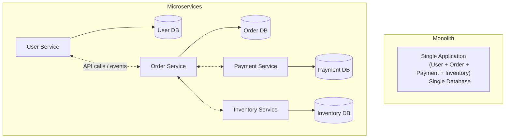

| দিক | Monolith | Microservices |
|---|---|---|
| Codebase | একটাই single codebase | প্রতিটা service-এর আলাদা codebase |
| Deployment | পুরো application একসাথে deploy হয় | প্রতিটা service independently deploy হয় |
| Database | সাধারণত shared/single database | প্রতিটা service নিজস্ব database ব্যবহার করে |
| Scaling | পুরো application scale করতে হয় | শুধু bottleneck service আলাদাভাবে scale করা যায় |
| Technology stack | সাধারণত একটাই stack | প্রতিটা service ভিন্ন language/tech ব্যবহার করতে পারে (polyglot) |
| Team structure | সাধারণত একটা বড় team | ছোট ছোট independent team, প্রতিটা এক বা একাধিক service owner |

### What are the benefits and drawbacks of microservices?

**Benefits:**

- **Independent deployability**: একটা service update করলে পুরো application redeploy করতে হয় না, ফলে release cycle দ্রুত হয়।
- **Independent scalability**: শুধু যে service-এ load বেশি (যেমন `Order Service`), শুধু সেটাই scale করা যায়, বাকি service গুলো একই থাকে।
- **Technology flexibility**: প্রতিটা team নিজেদের service-এর জন্য উপযুক্ত language/framework/database বেছে নিতে পারে।
- **Fault isolation**: একটা service crash করলে (সঠিকভাবে design করা থাকলে) পুরো system down হয় না, শুধু ওই feature-টুকু প্রভাবিত হয়।
- **Team autonomy**: ছোট ছোট team independently কাজ করতে পারে, একে অপরের উপর নির্ভরশীলতা কম থাকে (parallel development)।

**Drawbacks:**

- **Distributed system complexity**: Network call, latency, partial failure — এসব নতুন সমস্যা যোগ হয়, যা monolith-এ ছিল না।
- **Data consistency চ্যালেঞ্জ**: Shared database না থাকায় cross-service transaction করা কঠিন (নিচে আলোচনা করা হয়েছে)।
- **Operational overhead**: অনেকগুলো service deploy, monitor, log, debug করা — infrastructure complexity বেড়ে যায় (CI/CD, monitoring, service discovery সব দরকার হয়)।
- **Testing জটিলতা**: End-to-end testing করার জন্য একাধিক service একসাথে চালাতে হয়, integration testing কঠিন হয়ে যায়।
- **Network overhead ও latency**: In-process function call এর বদলে network call হওয়ায় performance-এ প্রভাব পড়ে।

### When should you choose a monolith over microservices?

- **Startup বা early-stage product**: যখন business domain এখনো স্পষ্ট না, দ্রুত iterate করতে হয় — monolith-এ change করা ও deploy করা সহজ ও দ্রুত।
- **ছোট team**: Microservices maintain করতে dedicated DevOps/infrastructure expertise দরকার হয়, ছোট team-এর জন্য এই overhead অপ্রয়োজনীয়।
- **Simple/well-understood domain**: যদি application-এর scope সীমিত ও stable হয়, microservices-এর জটিলতা যোগ করার justification থাকে না।
- **Low traffic/scale প্রয়োজন**: যদি independent scaling-এর দরকার না পড়ে, monolith সহজেই handle করতে পারে।

সাধারণ ভালো practice হলো: **"monolith first"** approach — শুরুতে একটা well-structured monolith বানিয়ে (modular monolith, clear internal boundary সহ), business domain বোঝার পর প্রয়োজন অনুযায়ী ধীরে ধীরে microservices-এ migrate করা (strangler fig pattern দিয়ে, যা পরে আলোচনা করা হয়েছে)।

---

## 50. How do microservices communicate with each other?

Microservices একে অপরের সাথে communicate করে মূলত দুইভাবে:

- **Synchronous communication**: একটা service সরাসরি অন্য service-কে call করে, response-এর জন্য অপেক্ষা করে (যেমন REST API call, gRPC call)।
- **Asynchronous communication**: একটা service message/event পাঠিয়ে দেয় (message queue বা event bus এর মাধ্যমে), response-এর জন্য block করে না, receiving service নিজের সময়মতো process করে।

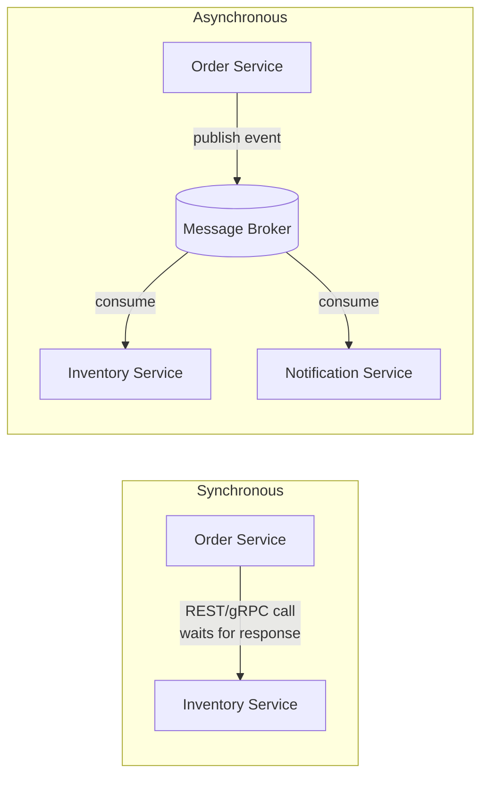

### What is the difference between synchronous and asynchronous communication?

| দিক | Synchronous | Asynchronous |
|---|---|---|
| Response wait | Caller response আসা পর্যন্ত block/wait করে | Caller message পাঠিয়েই এগিয়ে যায়, block করে না |
| Coupling | Tight — callee available না থাকলে call fail করে | Loose — receiving service down থাকলেও message queue-তে জমা থাকে |
| Latency propagation | Chain-এর একটা slow service পুরো request-কে ধীর করে দেয় | একটা service slow হলেও অন্যদের প্রভাবিত করে না |
| ব্যবহারের উদাহরণ | User request-এর সাথে সাথে response দরকার (যেমন "check inventory before confirming order") | Event notify করা, যেখানে সাথে সাথে response দরকার নেই (যেমন "send confirmation email") |
| Failure handling | Caller-কেই সরাসরি failure handle করতে হয় (retry, circuit breaker) | Message broker retry/DLQ handle করে, caller decouple থাকে |

### When should microservices communicate synchronously vs asynchronously?

**Synchronous ব্যবহার করা উচিত যখন:**
- Caller-এর সাথে সাথে একটা result দরকার, user সেই response এর অপেক্ষায় আছে (যেমন "user login authentication check")।
- Real-time query-response দরকার (যেমন "get current stock level")।
- Strong consistency দরকার — caller-কে জানতেই হবে operation সফল হয়েছে কিনা এগোনোর আগে।

**Asynchronous ব্যবহার করা উচিত যখন:**
- Operation দীর্ঘ সময় নিতে পারে, caller-কে block রাখার দরকার নেই (যেমন "generate report", "send email")।
- একাধিক service-কে একই event সম্পর্কে জানাতে হবে (fan-out, event broadcasting)।
- Loose coupling ও resilience গুরুত্বপূর্ণ — একটা downstream service down থাকলেও caller প্রভাবিত হবে না।
- Eventual consistency acceptable (যেমন "update analytics dashboard" সাথে সাথে না হলেও চলবে)।

বাস্তবে বেশিরভাগ microservices architecture দুটোরই মিশ্রণ ব্যবহার করে — critical path-এ (যেমন payment authorization) synchronous, আর side-effect/notification-এর জন্য (যেমন email, analytics) asynchronous।

### What is a service mesh and what problem does it solve?

সংক্ষেপে ভূমিকা এখানে দিচ্ছি (বিস্তারিত প্রশ্ন ৫৫-এ আছে): **Service mesh** হলো একটা dedicated infrastructure layer, যেটা service-to-service communication handle করে — routing, load balancing, retry, timeout, encryption (mTLS), observability — এসব সরাসরি application code-এ না লিখে infrastructure level-এ handle করে দেয়।

এটা যে সমস্যা solve করে: প্রতিটা service-এ আলাদা করে retry logic, circuit breaker, TLS handling, ইত্যাদি বারবার লেখার (code duplication) দরকার হয় না — একটা **sidecar proxy** (যেমন Envoy) প্রতিটা service-এর পাশে বসে এই কাজগুলো handle করে, application code শুধু business logic নিয়ে ব্যস্ত থাকে।

---

## 51. What is service discovery and how does it work in microservices?

Microservices architecture-এ service instance-গুলো dynamically তৈরি হয়, scale হয়, বা fail হয় (বিশেষ করে container/Kubernetes environment-এ), ফলে তাদের IP address ক্রমাগত বদলাতে থাকে। **Service discovery** হলো একটা mechanism, যেটা দিয়ে একটা service অন্য service-এর বর্তমান, up-to-date location (IP:port) খুঁজে বের করতে পারে — hardcoded address ব্যবহার না করে।

মূলত দুইটা অংশ থাকে:
- **Service registry**: একটা central database, যেখানে সব active service instance-এর location register করা থাকে।
- **Registration mechanism**: প্রতিটা service instance চালু হলে নিজেকে registry-তে register করে, আর periodically **health check/heartbeat** পাঠায় — instance down হয়ে গেলে registry থেকে সরিয়ে দেওয়া হয়।

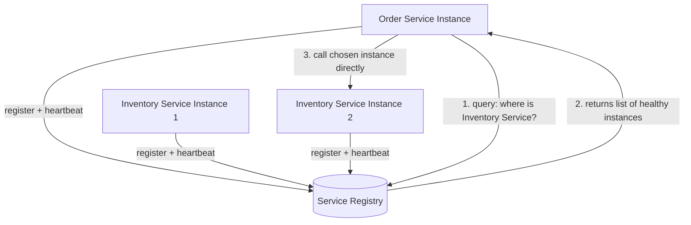

### What is the difference between client-side and server-side service discovery?

| দিক | Client-side discovery | Server-side discovery |
|---|---|---|
| Load balancing responsibility | Client নিজে registry query করে, নিজে load balancing decision নেয় | একটা intermediary (load balancer/router) client-এর হয়ে registry query করে ও route করে |
| Client complexity | বেশি — client-কে discovery logic ও load balancing logic জানতে হয় | কম — client শুধু একটা fixed endpoint call করে |
| উদাহরণ | Netflix Eureka + Ribbon (client-side load balancer) | AWS ELB + ECS, Kubernetes Service (kube-proxy) |
| Flexibility | Client-ভিত্তিক custom load balancing strategy সম্ভব | Centralized control, কিন্তু client-এর নিজস্ব customization কম |

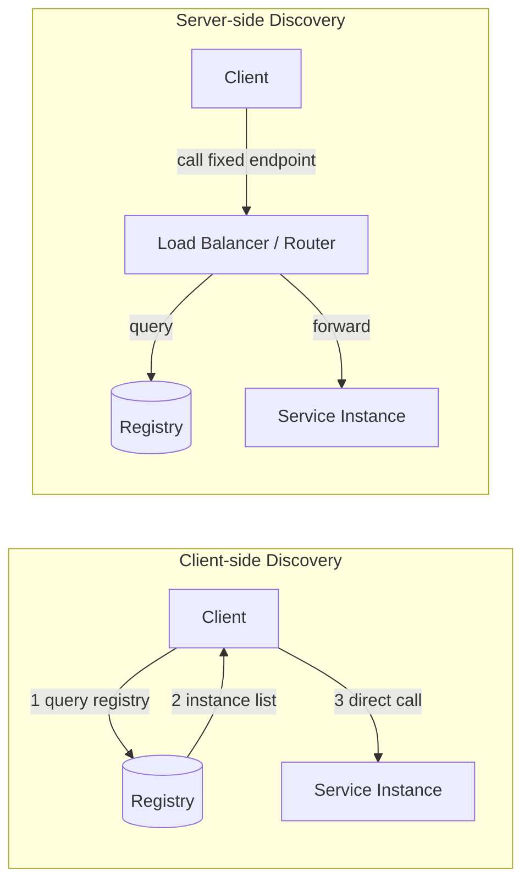

### How do Consul, Eureka, and Kubernetes DNS handle service discovery?

- **Consul (HashiCorp)**: একটা general-purpose service mesh/discovery tool, যেটা health checking, key-value store, এবং DNS বা HTTP API দিয়ে service discovery প্রদান করে। Service-গুলো Consul agent-এর মাধ্যমে register হয়, Consul periodically health check চালায়, unhealthy instance automatically registry থেকে সরিয়ে দেয়।

- **Netflix Eureka**: একটা client-side discovery pattern-ভিত্তিক tool (মূলত Spring Cloud ecosystem-এ জনপ্রিয়)। Service instance startup-এ নিজেকে Eureka server-এ register করে, periodically heartbeat পাঠায়। Client (সাধারণত Ribbon বা Spring Cloud LoadBalancer সহ) Eureka থেকে instance list নিয়ে client-side load balancing করে।

- **Kubernetes DNS**: Kubernetes-এ প্রতিটা `Service` object automatically একটা internal DNS name পায় (যেমন `order-service.default.svc.cluster.local`)। Kubernetes-এর internal DNS (CoreDNS) সেই নাম resolve করে service-এর ClusterIP-তে পাঠায়, আর `kube-proxy` সেই traffic কে actual healthy pod-এ load balance করে দেয়। এখানে developer-কে আলাদা করে কোনো registry client লিখতে হয় না — এটা server-side discovery-এর মতো কাজ করে, transparent ভাবে।

```yaml
# Example: Kubernetes Service enabling DNS-based discovery
apiVersion: v1
kind: Service
metadata:
  name: order-service
spec:
  selector:
    app: order-service
  ports:
    - port: 80
      targetPort: 8080
```

```javascript
// Other services can simply call it by DNS name, no manual discovery logic needed
const response = await fetch('http://order-service/orders/123');
```

---

## 52. How do you handle data management in a microservices architecture?

Microservices-এ data management-এর মূল challenge হলো: monolith-এর মতো একটা single shared database ব্যবহার করা যায় না (কারণ এতে service-গুলো tightly coupled হয়ে যায়), তাই প্রতিটা service নিজস্ব data নিজেই owner হিসেবে manage করে। এর ফলে cross-service data consistency, querying, এবং transaction handling নতুনভাবে design করতে হয়।

### What is the database-per-service pattern?

**Database-per-service pattern** এ প্রতিটা microservice-এর নিজস্ব, private database থাকে, যেটা শুধু সেই service-ই সরাসরি access করতে পারে। অন্য কোনো service সরাসরি সেই database-এ query করতে পারবে না — শুধু সেই owning service-এর API/event এর মাধ্যমেই data access করতে হবে।

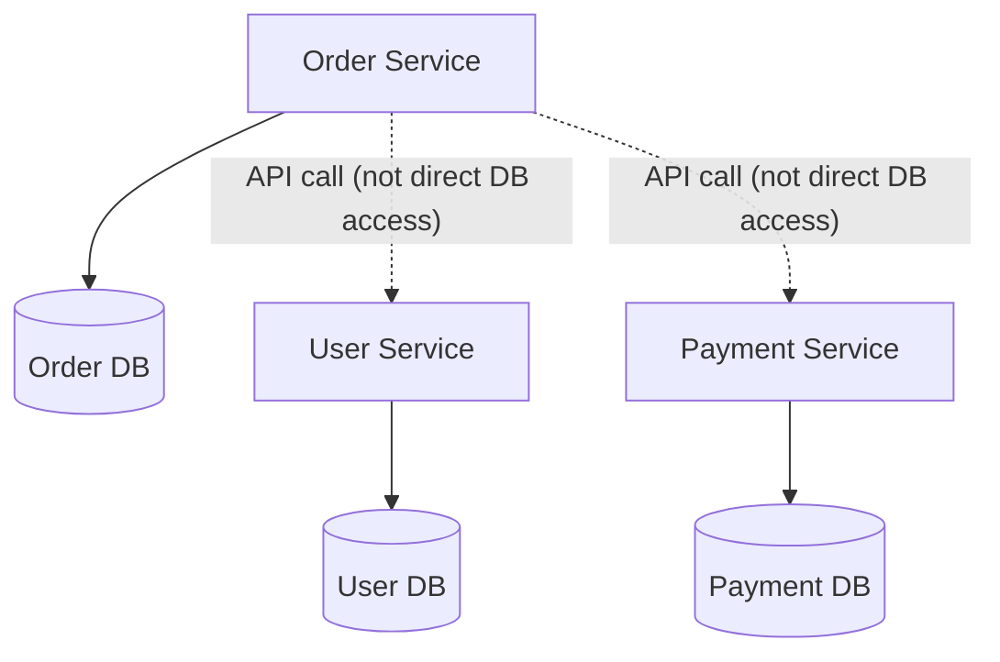

সুবিধা:
- প্রতিটা service স্বাধীনভাবে নিজের database schema evolve করতে পারে, অন্য service-কে ভাঙার ভয় ছাড়াই।
- প্রতিটা service নিজের প্রয়োজন অনুযায়ী database type বেছে নিতে পারে (polyglot persistence) — যেমন `Order Service` PostgreSQL, `Search Service` Elasticsearch, `Session Service` Redis।
- Service-গুলোর মধ্যে loose coupling বজায় থাকে।

চ্যালেঞ্জ:
- Cross-service join করা যায় না সরাসরি SQL দিয়ে — application-level এ data combine করতে হয়।
- Distributed transaction/consistency handle করা কঠিন (নিচে আলোচনা করা হয়েছে)।
- Data duplication হতে পারে (প্রয়োজনে একটা service অন্য service-এর কিছু data নিজের কাছে cache/replicate করে রাখে)।

### How do you handle data consistency across services without a shared database?

যেহেতু traditional ACID transaction (single database-এর মধ্যে) একাধিক service জুড়ে সম্ভব না, তাই সাধারণত ব্যবহার করা হয়:

- **Saga pattern**: একটা business transaction-কে ছোট ছোট local transaction-এর series হিসেবে ভাগ করা হয়, প্রতিটা service নিজের local transaction করে ও একটা event/message পাঠায় যা পরবর্তী step trigger করে। কোনো step fail করলে, আগের step গুলোকে **compensating transaction** দিয়ে undo করা হয়।

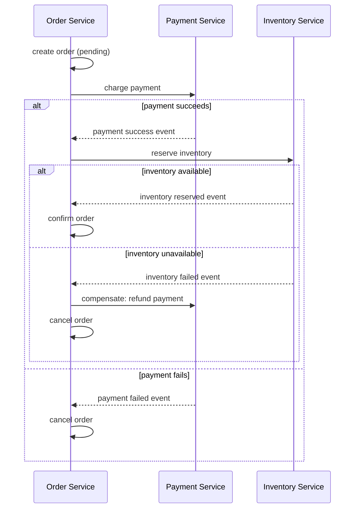

- **Choreography-based saga**: প্রতিটা service নিজস্ব event listen করে ও নিজের কাজ করে পরবর্তী event publish করে (কোনো central coordinator নেই) — simpler কিন্তু flow track করা কঠিন হয়ে যেতে পারে জটিল workflow-তে।
- **Orchestration-based saga**: একটা central "orchestrator" service প্রতিটা step explicitly call করে ও পুরো flow-এর দায়িত্ব নেয় — flow বোঝা সহজ, কিন্তু orchestrator একটা single point of coordination হয়ে যায়।
- **Eventual consistency মেনে নেওয়া**: সব service সাথে সাথে synchronize না হয়ে, কিছুটা delay-এর পর সব জায়গায় data consistent হবে — এটা মেনে নিয়ে design করা (strong consistency-এর বদলে)।

### What is event sourcing and how does it help with microservices data?

**Event sourcing** একটা data storage pattern, যেখানে একটা entity-এর **current state** সরাসরি store না করে, তার বদলে সেই entity-তে ঘটে যাওয়া সব **event-এর একটা sequence (log)** store করা হয়। Current state সবসময় সেই event log replay করে derive করা হয়।

উদাহরণ: একটা bank account-এর balance সরাসরি একটা column হিসেবে store না করে, `AccountOpened`, `MoneyDeposited(100)`, `MoneyWithdrawn(30)` — এভাবে ঘটনাগুলো store করা হয়, আর balance দরকার হলে সব event যোগ-বিয়োগ করে বের করা হয়।

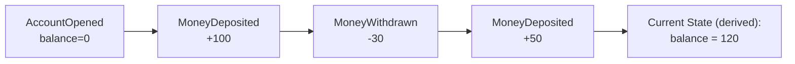

Microservices data-এ এটা যেভাবে সাহায্য করে:

- **Audit trail সহজেই পাওয়া যায়**: প্রতিটা change-এর সম্পূর্ণ history built-in ভাবে থাকে, আলাদা করে audit log রাখার দরকার নেই।
- **Event streaming-এর সাথে natural fit**: এই event গুলো সরাসরি Kafka-এর মতো event streaming platform-এ publish করা যায়, ফলে অন্য service সেই event consume করে নিজেদের local view (read model) তৈরি করতে পারে — এভাবে data replicate/sync হয়ে যায়, service-গুলো loosely coupled থাকে।
- **Temporal query সম্ভব**: "গত মাসের কোনো নির্দিষ্ট সময়ে state কী ছিল" — এটা event replay করে বের করা সম্ভব, যা traditional state-based storage-এ কঠিন।
- **CQRS (Command Query Responsibility Segregation)-এর সাথে ভালো কাজ করে**: Write model (event log) ও read model (optimized query view) আলাদা রাখা যায়, প্রতিটা service নিজের প্রয়োজন অনুযায়ী read model বানিয়ে নিতে পারে একই event stream থেকে।

Trade-off: Event sourcing implement করা জটিল, event schema evolution সামলানো কঠিন, আর query করার জন্য প্রায়ই আলাদা read model (projection) maintain করতে হয় — তাই সব ক্ষেত্রে এটা প্রয়োজনীয় না, শুধু যেখানে audit trail/history গুরুত্বপূর্ণ সেখানে বিবেচনা করা উচিত।

---

## 53. What is the strangler fig pattern?

**Strangler Fig Pattern** একটা migration strategy, যার নাম এসেছে strangler fig গাছ থেকে — এই গাছ একটা পুরনো গাছকে ঘিরে বেড়ে ওঠে, ধীরে ধীরে সেটাকে replace করে দেয়, একদম একবারে কেটে না ফেলে। Software-এ এর মানে হলো: একটা legacy monolith-কে একবারে rewrite না করে, ধীরে ধীরে, feature-by-feature নতুন microservices দিয়ে replace করা।

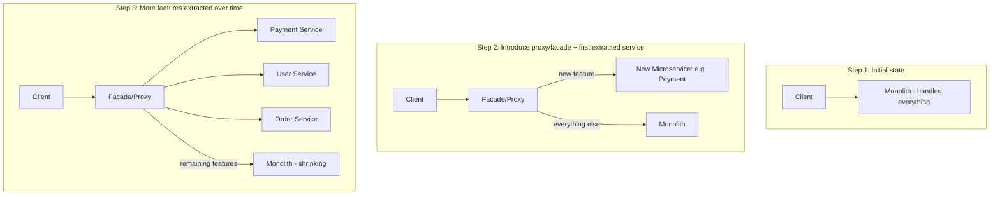

### How do you migrate a monolith to microservices using the strangler fig pattern?

সাধারণ পদক্ষেপ:

1. **একটা facade/proxy layer বসানো**: Client-এর সব request প্রথমে একটা routing layer (যেমন API Gateway বা reverse proxy) দিয়ে যাবে, যেটা ঠিক করে দেবে কোন request কোথায় যাবে।
2. **একটা নির্দিষ্ট feature/module identify করা**: এমন একটা bounded, well-understood feature বেছে নেওয়া যেটা relatively independent (যেমন "notification sending" বা "user authentication")।
3. **সেই feature-এর জন্য একটা নতুন microservice বানানো**: নতুন service-এ সেই feature আলাদাভাবে implement করা, নিজস্ব database সহ।
4. **Proxy-তে routing rule আপডেট করা**: সেই feature-এর সংশ্লিষ্ট request গুলো এখন monolith-এর বদলে নতুন microservice-এ route করা।
5. **Data migration**: প্রয়োজনে পুরনো monolith database থেকে নতুন service-এর database-এ data migrate করা (dual-write বা event-based sync দিয়ে ধীরে ধীরে)।
6. **পুরনো code সরিয়ে ফেলা**: নতুন service স্থিতিশীল হলে monolith থেকে সেই পুরনো feature code remove করে দেওয়া।
7. **পুনরাবৃত্তি করা**: পরবর্তী feature-এর জন্য একই প্রক্রিয়া repeat করা, যতক্ষণ না monolith সম্পূর্ণভাবে "strangled" (replaced) হয়ে যায়।

এই approach-এর সুবিধা হলো — পুরো system একসাথে বন্ধ করে rewrite করার (big bang rewrite) ঝুঁকি নিতে হয় না, ধাপে ধাপে migrate করা যায়, প্রতিটা ধাপে system কাজ করতে থাকে, আর সমস্যা হলে দ্রুত rollback করা সহজ।

### What is an anti-corruption layer?

**Anti-Corruption Layer (ACL)** একটা design pattern (Domain-Driven Design থেকে আসা), যেটা দুইটা different system/domain model-এর মাঝে একটা translation layer হিসেবে কাজ করে — যাতে একটা system-এর internal model/design অন্য system-এর মধ্যে "leak" করে না গিয়ে নষ্ট (corrupt) করে না ফেলে।

Strangler fig migration-এর প্রেক্ষাপটে, ACL সাধারণত নতুন microservice আর পুরনো legacy monolith-এর মাঝখানে বসে:

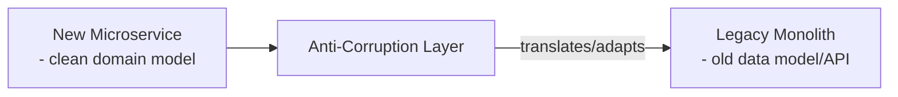

- নতুন microservice নিজস্ব clean, well-designed domain model অনুযায়ী কাজ করে।
- Legacy monolith-এর পুরনো, হয়তো messy বা inconsistent data format/API-কে ACL translate/adapt করে দেয়, যাতে নতুন service-কে সেই পুরনো জটিলতা সরাসরি handle করতে না হয়।
- এটা নতুন service-কে legacy system-এর "corruption" (bad design decision, technical debt) থেকে রক্ষা করে, এবং migration সম্পূর্ণ হয়ে গেলে ACL সহজেই সরিয়ে ফেলা যায়, নতুন service-এর core logic-এ কোনো প্রভাব না ফেলে।

```javascript
// Example: Anti-corruption layer adapting legacy API response to a clean domain model
async function getUserFromLegacySystem(userId) {
  const legacyResponse = await legacyMonolithClient.get(`/getUserData?uid=${userId}`);

  // legacy system returns messy, inconsistent field names
  // ACL translates it into the new service's clean domain model
  return {
    id: legacyResponse.user_id,
    fullName: `${legacyResponse.fname} ${legacyResponse.lname}`,
    email: legacyResponse.email_addr,
    createdAt: new Date(legacyResponse.created_ts * 1000),
  };
}
```

---

## 54. How do you monitor and debug a microservices system?

Microservices system monitor করা monolith-এর চেয়ে জটিল, কারণ একটা single user request অনেকগুলো service জুড়ে ঘুরে বেড়াতে পারে। এর জন্য সাধারণত ব্যবহার করা হয় **three pillars of observability**:

- **Logs**: প্রতিটা service-এর structured, centralized log (যেমন ELK stack/Loki তে aggregate করা)।
- **Metrics**: প্রতিটা service-এর quantitative data (request rate, error rate, latency) — Prometheus + Grafana দিয়ে track করা।
- **Traces**: একটা request পুরো system-এ কীভাবে travel করলো, তার end-to-end visibility — distributed tracing দিয়ে।

### What is distributed tracing and how does Jaeger or Zipkin work?

**Distributed tracing** একটা technique, যেটা দিয়ে একটা single request-এর পুরো journey track করা যায়, সে যতগুলো service-ই touch করুক না কেন। প্রতিটা request-এর জন্য একটা **trace** তৈরি হয়, যেটা একাধিক **span** নিয়ে গঠিত — প্রতিটা span একটা নির্দিষ্ট operation (যেমন একটা service call, একটা database query) represent করে।

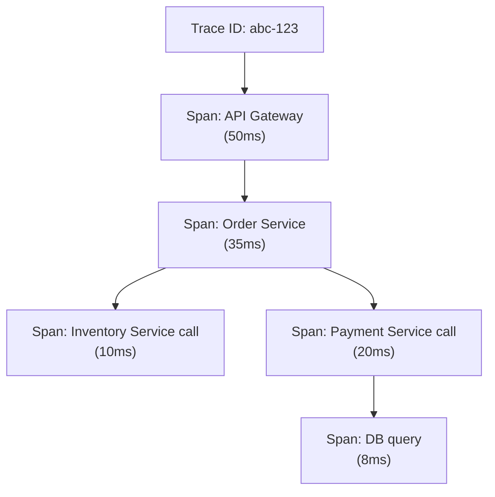

**Jaeger** ও **Zipkin** দুটোই open-source distributed tracing system, যেগুলো এভাবে কাজ করে:

1. প্রতিটা service একটা **tracing library/SDK** (যেমন OpenTelemetry) instrument করে থাকে।
2. একটা request আসলে, প্রথম service একটা **trace ID** তৈরি করে, প্রতিটা পরবর্তী service call-এ সেই trace ID propagate করা হয় (সাধারণত HTTP header দিয়ে)।
3. প্রতিটা service নিজের কাজের জন্য একটা **span** তৈরি করে (start time, end time, tags সহ), এবং সেটা asynchronously একটা central collector-এ পাঠায়।
4. Jaeger/Zipkin UI-তে পুরো trace visualize করা যায় — কোন service কতক্ষণ সময় নিলো, কোথায় bottleneck আছে, কোথায় error হলো — সব একসাথে একটা timeline view-এ দেখা যায়।

```javascript
// Example: propagating trace context using OpenTelemetry (Node.js)
const { trace, context, propagation } = require('@opentelemetry/api');

app.use((req, res, next) => {
  const extractedContext = propagation.extract(context.active(), req.headers);
  context.with(extractedContext, () => {
    const span = trace.getTracer('order-service').startSpan('handle-order-request');
    // ... process request ...
    span.end();
    next();
  });
});
```

### What is a correlation ID and how is it used?

**Correlation ID** হলো একটা unique identifier, যেটা একটা request-এর জন্য প্রথম entry point-এ (যেমন API Gateway) তৈরি করা হয়, আর পরবর্তী সব downstream service call-এ সেই একই ID header হিসেবে (যেমন `X-Correlation-ID`) propagate করা হয়।

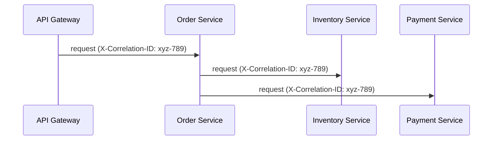

এটা ব্যবহার করা হয়:
- **Log correlation**: সব service-এর log-এ একই correlation ID include করা হয়, ফলে centralized logging system-এ (যেমন ELK) সেই ID দিয়ে search করলে একটা নির্দিষ্ট request-এর সাথে সম্পর্কিত সব log একসাথে খুঁজে পাওয়া যায় — debug করা অনেক সহজ হয়ে যায়।
- **Distributed tracing-এর সাথে সম্পর্ক**: Correlation ID অনেকটা trace ID-এর মতোই কাজ করে (কখনো কখনো একই জিনিস), যদিও tracing system-এ span-level detail (timing, hierarchy) থাকে যা শুধু correlation ID-তে থাকে না।
- **Customer support/debugging**: একজন user সমস্যার report করলে, তাদের request-এর correlation ID দিয়ে exact log/trace খুঁজে বের করা যায়।

### What are the key metrics to monitor for each microservice?

সাধারণত **RED method** বা **USE method** অনুসরণ করা হয়। RED method অনুযায়ী প্রতিটা service-এর জন্য মূল metric:

- **Rate**: প্রতি সেকেন্ডে কতগুলো request আসছে (throughput/traffic)।
- **Errors**: কতগুলো request fail হচ্ছে (error rate, সাধারণত percentage হিসেবে)।
- **Duration**: প্রতিটা request কতক্ষণ সময় নিচ্ছে (latency — p50, p95, p99 percentile সহ, শুধু average না)।

এছাড়াও গুরুত্বপূর্ণ:
- **Saturation**: CPU, memory, disk, connection pool কতটা ব্যবহার হচ্ছে (resource utilization) — কখন scale up দরকার তা বোঝায়।
- **Dependency health**: Downstream service/database call-এর success rate ও latency।
- **Queue depth/consumer lag**: যদি message queue ব্যবহার হয়, backlog কতটা জমেছে।
- **Business metrics**: শুধু technical metric না, business-relevant metric (যেমন `Order Service`-এ "orders per minute", "checkout failure rate")।

```javascript
// Example: exposing Prometheus metrics in a Node.js service
const promClient = require('prom-client');

const httpRequestDuration = new promClient.Histogram({
  name: 'http_request_duration_seconds',
  help: 'Duration of HTTP requests in seconds',
  labelNames: ['method', 'route', 'status_code'],
});

app.use((req, res, next) => {
  const end = httpRequestDuration.startTimer();
  res.on('finish', () => {
    end({ method: req.method, route: req.route?.path, status_code: res.statusCode });
  });
  next();
});
```

---

## 55. What is a service mesh and what does it provide?

**Service mesh** একটা dedicated infrastructure layer, যেটা microservices-এর মধ্যে সব network communication handle করে — সরাসরি application code-এর মধ্যে না লিখে, একটা transparent, infrastructure-level layer হিসেবে। এটা প্রতিটা service-এর পাশে একটা ছোট proxy (**sidecar**) বসিয়ে কাজ করে।

Service mesh যা provide করে:

- **Traffic management**: Load balancing, retry, timeout, circuit breaking, canary/blue-green deployment-এর জন্য traffic splitting।
- **Security**: Service-to-service mTLS encryption, authentication/authorization policy centrally enforce করা।
- **Observability**: প্রতিটা service call-এর automatic metrics, logs, ও trace তৈরি হয়, application code-এ manual instrumentation ছাড়াই।
- **Resilience**: Automatic retry, circuit breaker, fault injection (testing-এর জন্য) — সব centrally configure করা যায়।

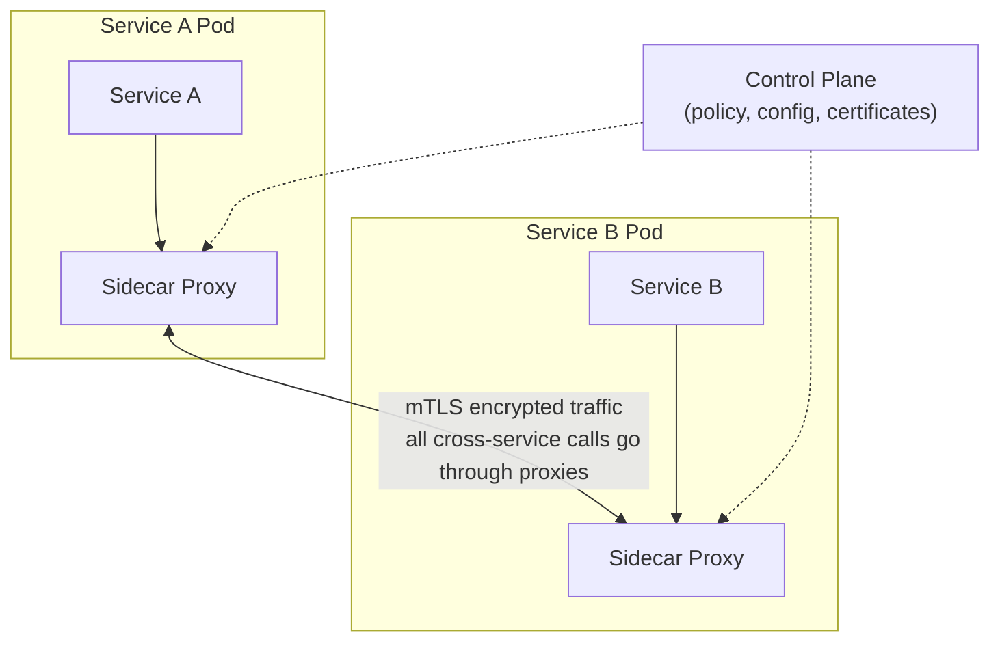

### What is the difference between Istio and Linkerd?

| দিক | Istio | Linkerd |
|---|---|---|
| Complexity | বেশি feature-rich, কিন্তু setup/operate করা তুলনামূলক জটিল | সহজ, lightweight, minimal configuration নিয়ে শুরু করা যায় |
| Proxy | Envoy (C++ ভিত্তিক, feature-rich) | নিজস্ব lightweight Rust-based micro-proxy |
| Performance overhead | তুলনামূলক বেশি resource ব্যবহার করে | কম resource overhead, দ্রুত |
| Feature set | Traffic management, advanced routing, security, observability — সবচেয়ে ব্যাপক feature set | মূল feature (mTLS, basic traffic management, observability) নিয়ে focused, simplicity-কে প্রাধান্য দেয় |
| ব্যবহারের উপযুক্ত ক্ষেত্র | বড় enterprise-scale system, যেখানে advanced routing/policy দরকার | ছোট থেকে মাঝারি scale team, যারা সহজে service mesh শুরু করতে চায় |

সংক্ষেপে: **Istio** বেশি powerful ও flexible কিন্তু operational complexity বেশি; **Linkerd** simplicity ও performance-কে প্রাধান্য দেয়, দ্রুত adopt করা যায়।

### What is a sidecar proxy pattern?

**Sidecar proxy pattern** এ প্রতিটা service instance-এর সাথে (একই pod/host-এ) একটা আলাদা proxy process attach করা হয়, যেটা সেই service-এর সব incoming/outgoing network traffic intercept করে। Application-এর কোড এই proxy সম্পর্কে জানেও না — সব traffic transparently proxy-এর মধ্য দিয়ে যায়।

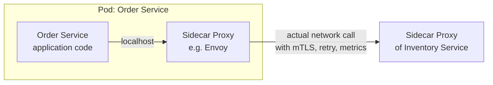

এই pattern-এর সুবিধা:
- Application code-কে networking concern (retry, TLS, load balancing) নিয়ে ভাবতে হয় না — এটা সম্পূর্ণভাবে infrastructure layer-এ আলাদা হয়ে যায় (**separation of concerns**)।
- যেকোনো language/framework-এ লেখা service-এর জন্য একই ভাবে কাজ করে (language-agnostic), কারণ proxy application code-এর বাইরে বসে।
- Centralized policy update করলে (যেমন নতুন retry policy) প্রতিটা service redeploy করার দরকার হয় না — শুধু sidecar configuration update হলেই চলে।

### How does a service mesh handle mTLS between services?

**mTLS (Mutual TLS)** মানে হলো শুধু client server-কে verify করে না (normal TLS-এর মতো), বরং server-ও client-কে verify করে — দুইপক্ষই একে অপরের identity নিশ্চিত করে।

Service mesh-এ এটা সাধারণত এভাবে কাজ করে:

1. **Control plane** (Istio-তে `istiod`) প্রতিটা service-এর জন্য একটা unique **certificate** ইস্যু করে (একটা internal Certificate Authority ব্যবহার করে), আর এই certificate নিয়মিত automatically rotate হয়।
2. প্রতিটা service-এর sidecar proxy এই certificate নিয়ে রাখে।
3. যখন Service A, Service B-কে call করে, actual traffic সরাসরি Service A থেকে Service B-তে না গিয়ে, প্রথমে Service A-এর sidecar proxy-তে যায়, সেখান থেকে encrypted, mutually-authenticated connection-এর মাধ্যমে Service B-এর sidecar proxy-তে পৌঁছায়, তারপর সেটা Service B-তে forward হয়।
4. দুইপক্ষের proxy-ই একে অপরের certificate verify করে নিশ্চিত হয় যে তারা প্রকৃতপক্ষে যাদের সাথে কথা বলার কথা তাদের সাথেই কথা বলছে (identity spoofing/man-in-the-middle attack প্রতিরোধ)।

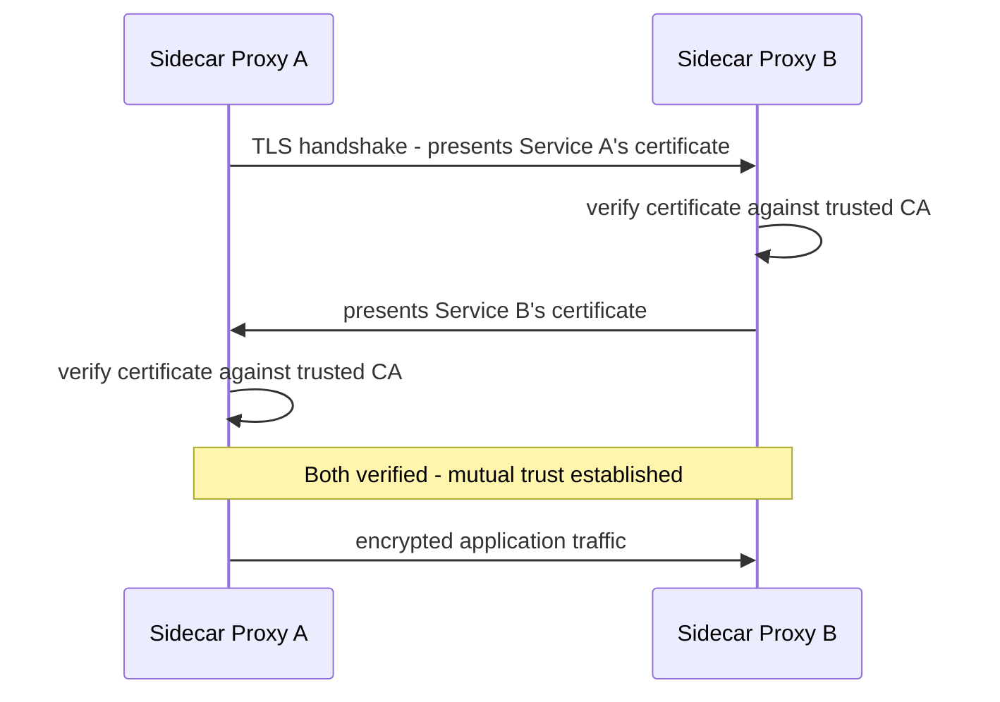

এর ফলে সুবিধা হলো — application code-কে নিজে থেকে কোনো TLS/certificate handling logic লিখতে হয় না, পুরো mTLS layer transparently infrastructure দ্বারা handle হয়, আর network-এর মধ্যে (এমনকি একই cluster-এর ভিতরেও) সব traffic encrypted ও authenticated থাকে — যেটা **zero-trust security model**-এর একটা গুরুত্বপূর্ণ ভিত্তি।