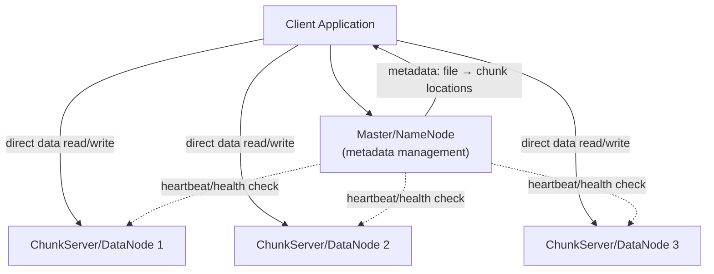
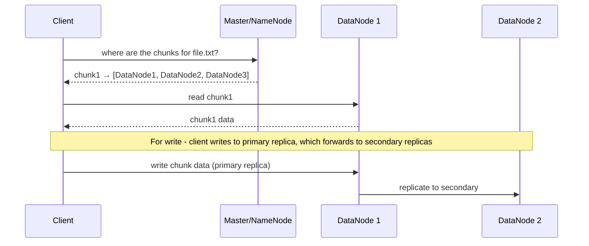
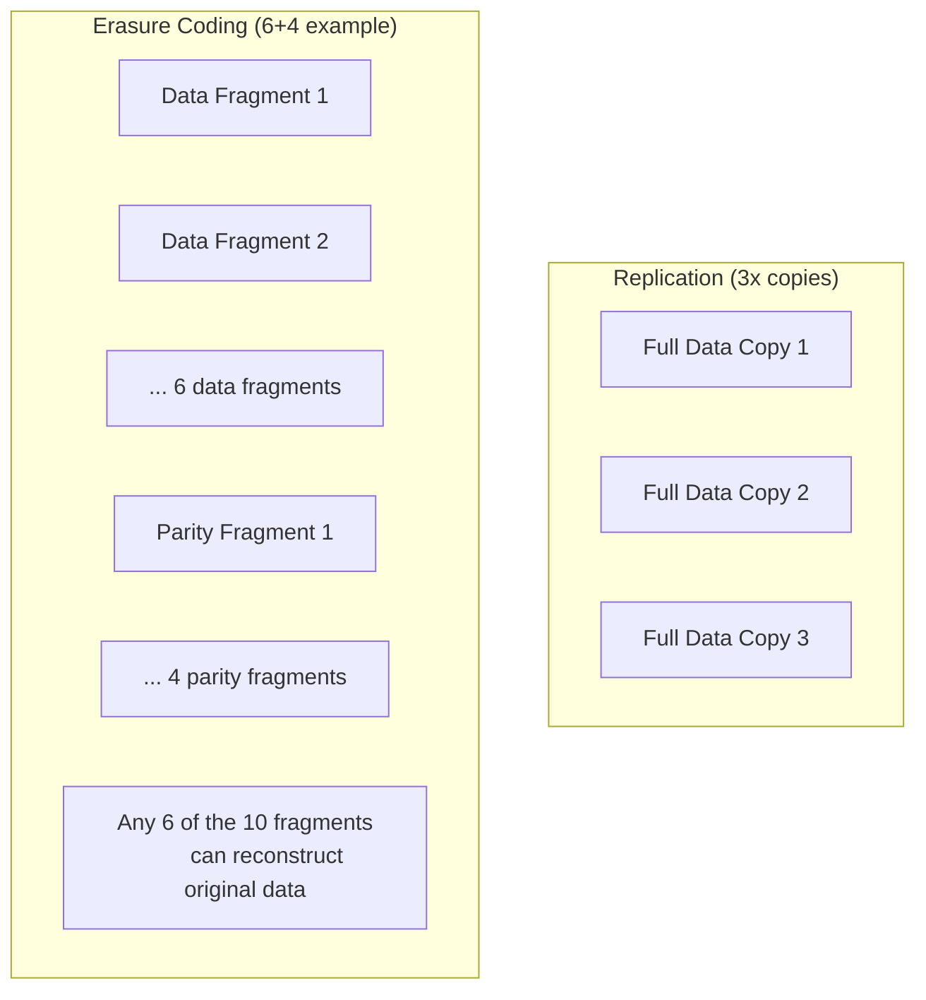
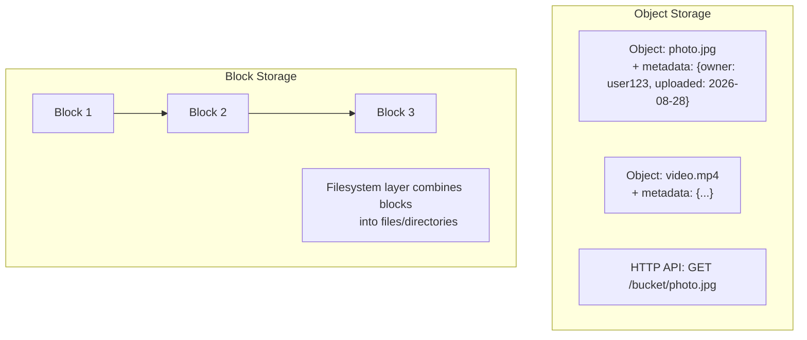
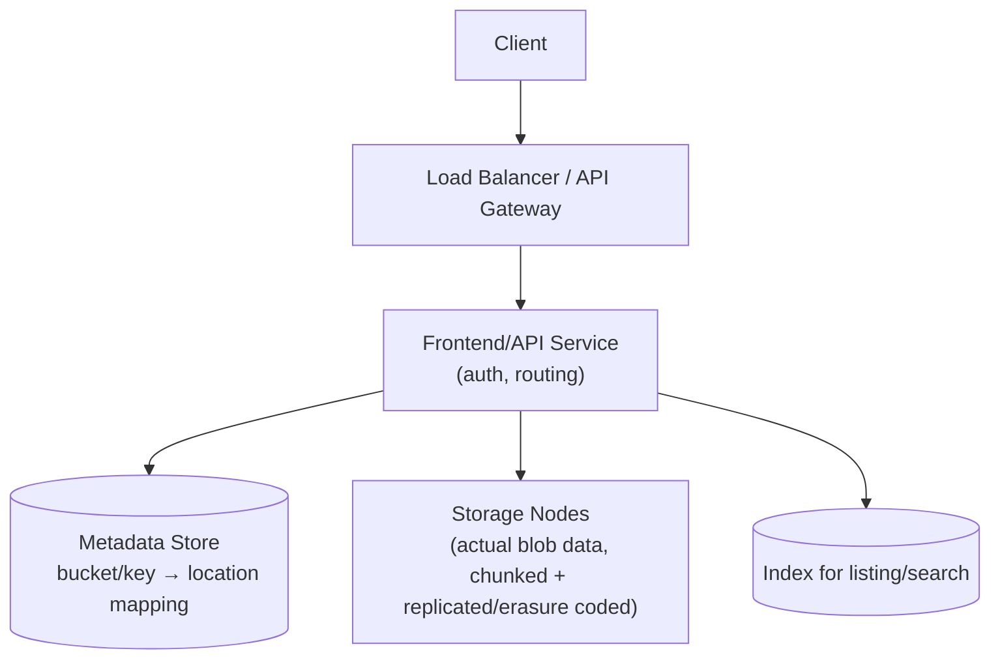
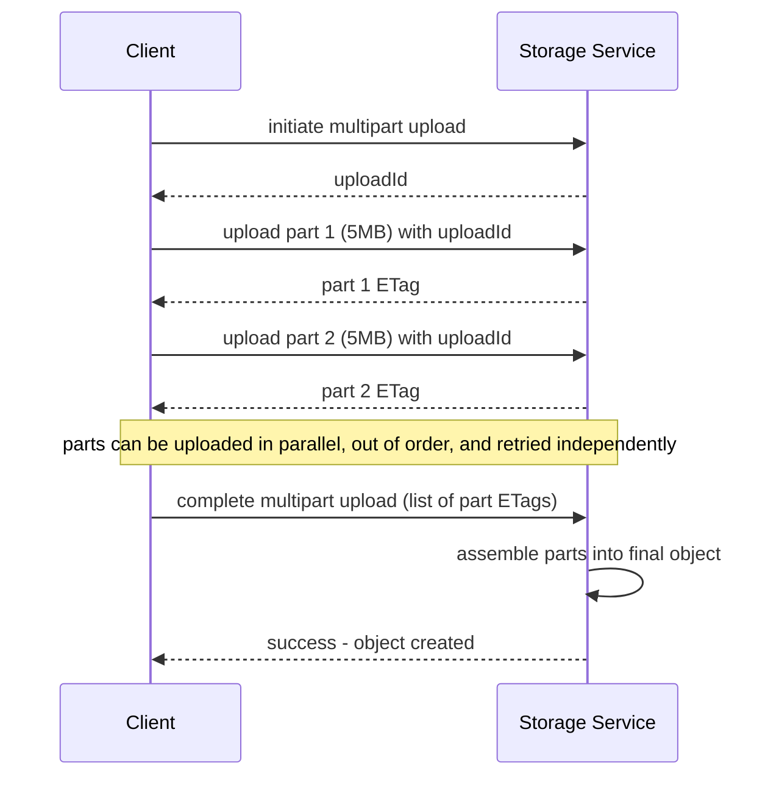
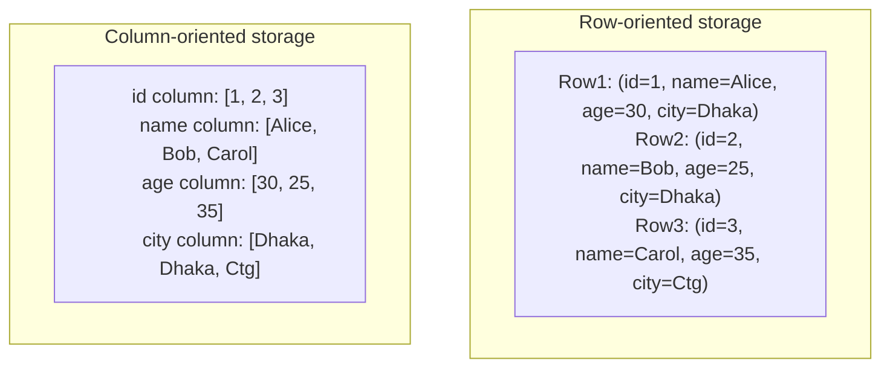
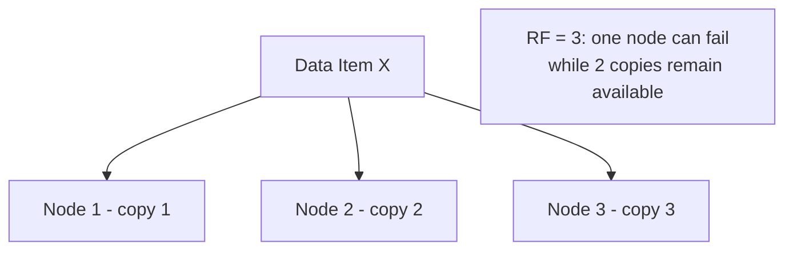
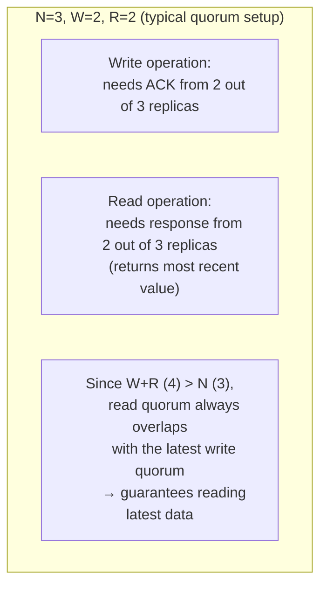
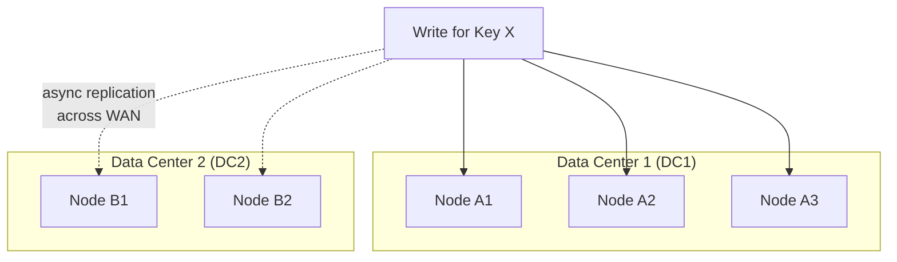

## 56. How do you design a distributed file storage system?

একটা **distributed file storage system** design করার সময় মূল লক্ষ্য থাকে বিশাল পরিমাণ data একাধিক machine জুড়ে reliably store করা, যেখানে single machine-এর storage/processing capacity যথেষ্ট না। মূল design consideration গুলো হলো:

- **Scalability**: হাজার হাজার machine জুড়ে horizontally scale করতে পারা।
- **Fault tolerance**: কোনো একটা machine/disk fail করলেও data হারাবে না।
- **High throughput**: বিশাল পরিমাণ data সমান্তরালভাবে read/write করতে পারা (বিশেষ করে batch processing workload-এর জন্য)।
- **Metadata management**: কোন file কোথায়, কোন chunk-এ, কোন machine-এ আছে — তা track রাখা।

সাধারণ architecture-এ দুইটা প্রধান component থাকে:



- **Master/NameNode**: File-কে chunk-এ ভাগ করার metadata (কোন file কতগুলো chunk, প্রতিটা chunk কোন machine-এ replicate করা আছে) রাখে। এটা সাধারণত data path-এ থাকে না (শুধু metadata সার্ভ করে), তাই bottleneck কম হয়।
- **ChunkServer/DataNode**: প্রকৃত file data (chunk আকারে) store করে, client-দের সরাসরি data read/write সার্ভ করে।

### How does Google File System (GFS) or HDFS work?

**GFS (Google File System)** ও তার open-source counterpart **HDFS (Hadoop Distributed File System)** প্রায় একই design principle অনুসরণ করে:

- একটা বড় file-কে fixed-size **chunk/block**-এ ভাগ করা হয় (GFS-এ 64MB, HDFS-এ ডিফল্ট 128MB) — এই size ইচ্ছাকৃতভাবে বড় রাখা হয়, যাতে metadata overhead কম থাকে ও sequential read/write efficient হয়।
- একটা **single master (NameNode)** সব file-এর namespace ও chunk-to-location mapping metadata রাখে (in-memory, দ্রুত access-এর জন্য)।
- প্রতিটা chunk একাধিক **chunk server (DataNode)**-এ replicate করা হয় (সাধারণত ৩টা copy — replication factor 3), যাতে কোনো একটা machine fail করলেও data হারিয়ে না যায়।
- Client প্রথমে master-কে জিজ্ঞেস করে কোন chunk কোথায় আছে, তারপর সরাসরি সেই chunk server-এর সাথে data transfer করে (master data path-এ থাকে না, ফলে বাধা কম হয়)।
- Master periodically DataNode থেকে **heartbeat** পায়; কোনো DataNode অনেকক্ষণ heartbeat না পাঠালে, master ধরে নেয় সেটা down, এবং সেই DataNode-এ থাকা chunk গুলো অন্য healthy DataNode-এ re-replicate করে (ensure করে replication factor বজায় থাকে)।
- এই সিস্টেমগুলো মূলত **write-once, read-many** workload-এর জন্য optimize করা (যেমন log processing, batch analytics), frequent random-write-এর জন্য না।



### What is erasure coding vs replication for data durability?

| দিক | Replication | Erasure Coding |
|---|---|---|
| কীভাবে কাজ করে | Data-এর সম্পূর্ণ copy একাধিক জায়গায় রাখা (যেমন ৩টা identical copy) | Data-কে mathematically encode করে অতিরিক্ত parity data সহ ছোট ছোট fragment-এ ভাগ করা, যেকোনো কয়েকটা fragment হারিয়ে গেলেও বাকিগুলো দিয়ে পুনর্গঠন করা যায় |
| Storage overhead | বেশি (3x replication মানে 200% extra storage) | কম (যেমন একটা 6-data-4-parity scheme মাত্র ~67% extra storage দিয়ে একই durability দেয়) |
| CPU overhead | কম (শুধু copy করা) | বেশি (encode/decode করতে computation লাগে) |
| Read performance | দ্রুত — যেকোনো একটা replica থেকে সরাসরি পড়া যায় | কিছুটা ধীর — প্রয়োজনে একাধিক fragment থেকে reconstruct করতে হতে পারে |
| উপযুক্ত ক্ষেত্র | Hot data, frequently accessed data (দ্রুত access দরকার) | Cold/archival data, যেখানে storage cost কমানো priority (access frequency কম) |



বাস্তবে অনেক system (যেমন HDFS 3.x, Google Colossus) দুটোরই মিশ্রণ ব্যবহার করে — recently written/hot data-এর জন্য replication (দ্রুত access), আর older/cold data automatically erasure coding-এ convert করে (storage cost কমানোর জন্য)।

### How do you handle file chunking and metadata management?

**File chunking:**
- একটা large file-কে fixed-size chunk/block-এ ভাগ করা হয় (যেমন 128MB)।
- প্রতিটা chunk-কে একটা globally unique ID (chunk handle) দেওয়া হয়, যেটা দিয়ে master সেই chunk-কে track করে।
- ছোট file-এর ক্ষেত্রে অনেক small chunk তৈরি হলে metadata overhead বেড়ে যায়, তাই কিছু system (যেমন HDFS) ছোট file-এর জন্য আলাদা optimization রাখে (যেমন HAR archive বা SequenceFile দিয়ে ছোট file গুলো combine করা)।

**Metadata management:**
- Master node metadata সাধারণত **in-memory** রাখে দ্রুত access-এর জন্য, কারণ প্রতিটা client request-এ metadata lookup লাগে।
- Durability-এর জন্য metadata change একটা **operation log (edit log)** এ persist করা হয়, আর periodically একটা **checkpoint/snapshot (fsimage)** নেওয়া হয় — crash হলে checkpoint + edit log replay করে state পুনর্গঠন করা যায়।
- Master যদি single point of failure হয়, সেটা address করার জন্য **standby master/NameNode** রাখা হয় (High Availability setup), যেটা primary fail করলে দ্রুত takeover করতে পারে।
- বড় scale-এ single master bottleneck হতে পারে, তাই কিছু নতুন system (যেমন HDFS Federation, বা GFS-এর successor Colossus) metadata কেও একাধিক server জুড়ে shard/distribute করে।

```javascript
// Simplified example of metadata structure kept by the master
const fileMetadata = {
  "/data/logs/2026-08-28.log": {
    chunks: [
      { chunkId: "chunk-001", size: 134217728, locations: ["node1", "node2", "node3"] },
      { chunkId: "chunk-002", size: 98234112,  locations: ["node2", "node4", "node5"] },
    ],
    totalSize: 232451840,
    replicationFactor: 3,
  },
};
```

---

## 57. What is object storage and how does it differ from block storage?

**Object storage** এ data-কে discrete unit হিসেবে রাখা হয়, যেটাকে বলে **object** — প্রতিটা object-এর একটা unique ID (key), actual data, আর কিছু metadata থাকে। এটা flat namespace-এ organize হয় (traditional folder hierarchy না), আর সাধারণত একটা simple HTTP-based API (GET/PUT/DELETE) দিয়ে access করা হয় — যেমন Amazon S3।

**Block storage** এ data-কে fixed-size **block**-এ ভাগ করে রাখা হয়, প্রতিটা block-এর একটা address থাকে। Operating system এই block গুলোকে একসাথে জুড়ে একটা filesystem তৈরি করে — অনেকটা virtual hard drive-এর মতো (যেমন AWS EBS)।

| দিক | Object Storage | Block Storage |
|---|---|---|
| Data unit | Object (whole file + metadata) | Fixed-size block |
| Access pattern | সম্পূর্ণ object read/write (partial update কঠিন) | Individual block-এর random read/write সহজ |
| API | HTTP-based REST API (GET/PUT/DELETE) | OS-level filesystem interface (POSIX) |
| Metadata | Rich, custom metadata object-এর সাথে attach করা যায় | সীমিত, filesystem-level metadata |
| Scalability | Massively scalable (petabyte-exabyte scale) | তুলনামূলক সীমিত, single volume-এর একটা size limit থাকে |
| উদাহরণ | Amazon S3, Google Cloud Storage | AWS EBS, disk partitions, SAN |
| উপযুক্ত ব্যবহার | Static files, backups, media, logs, data lake | Database storage, boot volumes, low-latency transactional workload |



### When would you use object storage over a relational database?

- **Large binary/unstructured data**: Image, video, document, log file — এসব যেগুলোর জন্য relational schema/query দরকার নেই, শুধু store ও retrieve করলেই চলে।
- **Massive scale প্রয়োজন**: Petabyte-scale data রাখতে হলে, relational database এত বড় scale-এ efficient না (query performance/index maintenance overhead বেড়ে যায়)।
- **Infrequent update, mostly write-once-read-many pattern**: যেমন backup file, archived log, media asset — এগুলো একবার লেখার পর সাধারণত পাল্টায় না।
- **Cost-effective long-term storage**: Object storage সাধারণত database storage-এর চেয়ে অনেক সস্তা (per GB), বিশেষ করে cold/infrequent access tier ব্যবহার করলে।
- **CDN/direct client access দরকার হলে**: Object storage থেকে সরাসরি HTTP দিয়ে file সার্ভ করা যায় (browser/mobile app সরাসরি S3 URL access করতে পারে), database দিয়ে এটা natural না।

Relational database ব্যবহার করা উচিত যখন structured data, complex query/join, transaction guarantee (ACID), বা frequent update দরকার — object storage এসবের জন্য উপযুক্ত না।

### How does Amazon S3 achieve durability?

Amazon S3 তার বিখ্যাত **"11 nines" (99.999999999%) durability** guarantee অর্জন করে মূলত নিচের কৌশলে:

- **Automatic multi-AZ replication**: প্রতিটা object upload হওয়ার সাথে সাথে একাধিক **Availability Zone (AZ)** জুড়ে (physically আলাদা data center) replicate/erasure-code করা হয়, যাতে একটা পুরো data center fail করলেও data সুরক্ষিত থাকে।
- **Erasure coding**: আধুনিক S3 implementation অনেকাংশে erasure coding ব্যবহার করে, যেটা replication-এর মতো একই durability দেয় কিন্তু কম storage overhead দিয়ে।
- **Checksums ও data integrity check**: Object store করার সময় ও periodically background-এ checksum verify করা হয়, silent data corruption (bit rot) detect ও repair করার জন্য।
- **Versioning**: Object versioning enable করলে, accidental delete/overwrite হলেও পুরনো version রিকভার করা যায়।
- **Continuous monitoring ও automatic repair**: কোনো disk/node fail করলে, system automatically সেই lost data-র redundant copy থেকে নতুন copy তৈরি করে replication/erasure coding level বজায় রাখে — মানুষের manual intervention ছাড়াই।

এখানে গুরুত্বপূর্ণ পার্থক্য বোঝা জরুরি: **durability** (data হারাবে না) আর **availability** (data এই মুহূর্তে access করা যাবে) দুটো ভিন্ন জিনিস — S3 এর durability guarantee খুব উচ্চ হলেও availability guarantee (যেমন 99.99%) তুলনামূলক কম, কারণ সাময়িক outage-এর সময়ও data নিরাপদ থাকতে পারে যদিও তা সাময়িকভাবে access করা না যায়।

---

## 58. How do you design a blob storage system like S3?

Amazon S3-এর মতো একটা blob storage system design করতে গেলে মূল component গুলো হলো:



- **API layer**: S3-compatible REST API (PUT/GET/DELETE object) সার্ভ করে, authentication/authorization enforce করে।
- **Metadata service**: প্রতিটা object key কোন storage node-এ, কোন chunk হিসেবে আছে তার mapping রাখে (সাধারণত একটা distributed key-value store, যেমন DynamoDB বা custom sharded database ব্যবহার করা হয়)।
- **Storage layer**: প্রকৃত blob data store করে, বড় object internally chunk করে রাখা হয়, replication/erasure coding দিয়ে durability নিশ্চিত করা হয়।

### What data structures are used to store and retrieve blobs efficiently?

- **Consistent hashing**: Object key থেকে কোন storage node-এ সেই object যাবে তা ঠিক করতে ব্যবহার করা হয় — node যোগ/বাদ হলে minimal data reshuffling লাগে।
- **B-tree/LSM-tree ভিত্তিক metadata index**: Object key থেকে physical location lookup দ্রুত করার জন্য (bucket + key → chunk locations), সাধারণত একটা sorted structure ব্যবহার করা হয়, যাতে prefix-based listing (যেমন `GET /bucket?prefix=photos/`) efficient হয়।
- **Chunking with content-addressable storage**: বড় blob-কে ছোট ছোট chunk-এ ভাগ করা হয়, প্রতিটা chunk-এর একটা hash (যেমন SHA-256) দিয়ে identify করা হয় — একই content দুইবার আপলোড হলে deduplication সম্ভব হয় (content-addressable storage)।
- **Bloom filter**: Object exists কিনা তা দ্রুত (এবং memory-efficient ভাবে) check করার জন্য ব্যবহার করা হয়, actual disk lookup করার আগে।

```javascript
// Simplified metadata record for a blob
const objectMetadata = {
  bucket: "user-uploads",
  key: "images/profile-photo.jpg",
  size: 2457600,
  contentHash: "sha256:a3f5...",
  chunks: [
    { chunkHash: "sha256:aa11...", nodes: ["storage-node-7", "storage-node-12"] },
    { chunkHash: "sha256:bb22...", nodes: ["storage-node-3", "storage-node-9"] },
  ],
  createdAt: "2026-08-28T10:00:00Z",
  contentType: "image/jpeg",
};
```

### How do you handle large file uploads (multipart upload)?

বড় file (যেমন কয়েক GB video) একবারে single HTTP request-এ আপলোড করা risky — network interruption হলে পুরো আপলোড আবার শুরু করতে হয়, আর memory-তে পুরো file buffer রাখাও অদক্ষ। এই সমস্যা সমাধান করে **multipart upload**:



- File-কে ছোট ছোট **part** এ ভাগ করা হয় (S3-তে সাধারণত 5MB থেকে 5GB per part)।
- প্রতিটা part **independently, এবং parallel-ভাবে** আপলোড করা যায় — throughput বাড়ে।
- কোনো একটা part আপলোড fail করলে, শুধু সেই part-টুকু retry করলেই চলে, পুরো file আবার আপলোড করতে হয় না।
- সব part আপলোড শেষ হলে client একটা "complete" request পাঠায় (সব part-এর ID/ETag সহ), server তখন সব part একসাথে জুড়ে final object তৈরি করে।
- Incomplete multipart upload (যেগুলো কখনো complete হয়নি) periodically cleanup করা হয় (lifecycle policy দিয়ে), storage space নষ্ট না হওয়ার জন্য।

```javascript
// Example: multipart upload with AWS SDK (Node.js)
const { S3Client, CreateMultipartUploadCommand, UploadPartCommand, CompleteMultipartUploadCommand } = require('@aws-sdk/client-s3');

const s3 = new S3Client({ region: 'us-east-1' });

async function multipartUpload(bucket, key, fileBuffer) {
  const { UploadId } = await s3.send(new CreateMultipartUploadCommand({ Bucket: bucket, Key: key }));

  const partSize = 5 * 1024 * 1024; // 5MB per part
  const parts = [];

  for (let i = 0, partNumber = 1; i < fileBuffer.length; i += partSize, partNumber++) {
    const partBuffer = fileBuffer.slice(i, i + partSize);
    const { ETag } = await s3.send(new UploadPartCommand({
      Bucket: bucket, Key: key, UploadId, PartNumber: partNumber, Body: partBuffer,
    }));
    parts.push({ ETag, PartNumber: partNumber });
  }

  await s3.send(new CompleteMultipartUploadCommand({
    Bucket: bucket, Key: key, UploadId, MultipartUpload: { Parts: parts },
  }));
}
```

### How do you implement access control for stored objects?

- **Bucket/object level policies (ACL)**: প্রতিটা bucket বা object-এর সাথে একটা access policy attach করা যায়, যেখানে কোন user/role read/write/delete করতে পারবে তা নির্দিষ্ট করা থাকে (JSON-based policy document, যেমন S3 Bucket Policy)।
- **IAM (Identity and Access Management) integration**: User/role-ভিত্তিক permission define করা, যেটা centrally manage করা হয় — কোন IAM role কোন bucket/prefix access করতে পারবে।
- **Pre-signed URLs**: একটা সাময়িক, time-limited URL generate করা হয় যেটা দিয়ে কেউ authentication ছাড়াই নির্দিষ্ট সময়ের জন্য একটা object access (upload/download) করতে পারে — client-side upload (browser থেকে সরাসরি S3-তে) করার জন্য খুব common pattern।
- **Encryption**: Object at-rest এ encrypt করে রাখা (server-side encryption, KMS key দিয়ে), আর transit-এ TLS ব্যবহার করা।
- **Bucket-level default privacy**: Default হিসেবে bucket private রাখা (public access block করা), explicit permission ছাড়া কেউ access করতে না পারার নীতি (secure by default)।

```javascript
// Example: generating a pre-signed URL for temporary access
const { S3Client, GetObjectCommand } = require('@aws-sdk/client-s3');
const { getSignedUrl } = require('@aws-sdk/s3-request-presigner');

async function generateDownloadLink(bucket, key) {
  const command = new GetObjectCommand({ Bucket: bucket, Key: key });
  const url = await getSignedUrl(s3, command, { expiresIn: 3600 }); // valid for 1 hour
  return url;
}
```

---

## 59. What is a columnar storage format and when is it used?

**Columnar storage format** এ data disk-এ **column-wise** (প্রতিটা column-এর সব value একসাথে) store করা হয়, row-wise না। এটা মূলত analytical query (OLAP) workload-এর জন্য optimize করা, যেখানে সাধারণত সব column না, শুধু কয়েকটা নির্দিষ্ট column নিয়ে aggregation/filtering করা হয় বিশাল সংখ্যক row জুড়ে।

### What is the difference between row-oriented and column-oriented storage?



| দিক | Row-oriented | Column-oriented |
|---|---|---|
| Data layout | প্রতিটা row-এর সব field একসাথে contiguous ভাবে store করা | প্রতিটা column-এর সব value একসাথে contiguous ভাবে store করা |
| Best for | OLTP (Online Transaction Processing) — একটা সম্পূর্ণ record read/write করা | OLAP (Online Analytical Processing) — নির্দিষ্ট কয়েকটা column-এ aggregation/filter |
| Read pattern | সম্পূর্ণ row পড়া efficient (যেমন "get user with id=5") | নির্দিষ্ট column পড়া efficient, পুরো row পড়ার দরকার নেই |
| Compression | তুলনামূলক কম effective (mixed data type একসাথে) | খুব effective (একই column-এ একই ধরনের data, repetitive value বেশি) |
| উদাহরণ | PostgreSQL, MySQL (row store) | Parquet, ORC, Apache Cassandra (column family), ClickHouse |

### When does columnar storage (Parquet, ORC) outperform row storage?

- **Analytical aggregation query**: যেমন "গত ১ বছরে মোট revenue কত" — এই ধরনের query শুধু `revenue` আর `date` column দরকার, বাকি ১৫-২০টা column touch করার দরকার নেই। Row storage-এ পুরো row read করতে হতো, column storage-এ শুধু দরকারি column-ই পড়া হয় — I/O অনেক কমে যায়।
- **Wide table, sparse column access**: টেবিলে অনেক column থাকলেও (যেমন ১০০টা column), একটা query সাধারণত মাত্র ৫-১০টা column ব্যবহার করে — column storage এখানে বিশাল সুবিধা দেয়।
- **Big data analytics/data warehouse workload**: Spark, Presto/Trino, Hive-এর মতো tool দিয়ে বিশাল dataset-এর উপর analytical query চালানোর সময় Parquet/ORC ব্যাপকভাবে ব্যবহার হয়, কারণ এতে scan করা data-এর পরিমাণ অনেক কমে যায় (column pruning)।
- **Predicate pushdown**: Columnar format-এ প্রতিটা column chunk-এর min/max statistics রাখা থাকে, তাই filter (`WHERE date > '2026-01-01'`) থাকলে পুরো chunk skip করে দেওয়া যায়, disk থেকে না পড়েই।

Row storage ভালো থাকে যখন: একটা সম্পূর্ণ record বারবার read/write করতে হয় (যেমন "user login" এ পুরো user record লাগে), অথবা frequent single-row insert/update/delete দরকার (OLTP) — columnar format এসবের জন্য অদক্ষ (একটা single row update করতে সব column file touch করতে হতে পারে)।

### How does columnar storage improve compression?

- **Data homogeneity**: একটা column-এর সব value একই data type ও প্রায়ই একই ধরনের value (যেমন `city` column-এ বারবার "Dhaka", "Dhaka", "Chittagong")। এরকম repetitive, homogeneous data compression algorithm-এর জন্য আদর্শ — row storage-এ ভিন্ন ভিন্ন data type (string, int, date) mix হয়ে থাকায় compression কম effective হয়।
- **Run-Length Encoding (RLE)**: যদি একটা column-এ একই value বারবার consecutive ভাবে থাকে (sorted/grouped data-তে সাধারণ), সেটা "value + repeat count" আকারে store করা যায় (যেমন "Dhaka" x 10,000 কে একবার লিখে count রাখা)।
- **Dictionary encoding**: Low-cardinality column-এ (যেমন `status: active/inactive/pending`) প্রতিটা unique value-কে একটা ছোট integer code দিয়ে replace করা হয়, আর একটা dictionary আলাদাভাবে রাখা হয় — storage অনেক কমে যায়।
- **Column-specific encoding নির্বাচন**: প্রতিটা column-এর data type/pattern অনুযায়ী আলাদা encoding বেছে নেওয়া যায় (যেমন numeric column-এ delta encoding, string column-এ dictionary encoding) — যেটা row-based format-এ practical না, কারণ একটা row-এ ভিন্ন ভিন্ন type mixed থাকে।

এই সব মিলিয়ে columnar format (Parquet, ORC) সাধারণত row format-এর তুলনায় ৫-১০x বা তার বেশি compression ratio অর্জন করতে পারে, যেটা storage cost ও I/O সময় দুটোই উল্লেখযোগ্যভাবে কমায়।

---

## 60. How do you handle data replication for durability?

**Data replication** মানে হলো একই data-র একাধিক copy বিভিন্ন node/machine/data center-এ রাখা, যাতে কোনো একটা node fail করলেও data হারিয়ে না যায় ও availability বজায় থাকে।

### What is the replication factor and how do you choose it?

**Replication factor (RF)** হলো একটা data-র কতগুলো copy সিস্টেমে রাখা হবে তার সংখ্যা। যেমন RF=3 মানে প্রতিটা data-র ৩টা copy বিভিন্ন node-এ রাখা হয়।

Replication factor নির্বাচন করার সময় বিবেচনা করতে হয়:

- **Durability requirement**: RF যত বেশি, একসাথে একাধিক node fail হলেও data survive করার সম্ভাবনা তত বেশি। RF=1 মানে কোনো redundancy নেই (একটা node fail হলেই data loss)।
- **Storage cost**: RF=3 মানে 3x storage cost — RF বাড়ালে infrastructure cost সরাসরি বেড়ে যায়।
- **Write latency/throughput**: বেশি replica মানে প্রতিটা write-কে বেশি node-এ propagate করতে হয়, যা write latency বাড়াতে পারে (বিশেষ করে strong consistency চাইলে)।
- **Fault tolerance level**: সাধারণ rule of thumb — RF=3 হলে ১টা node down থাকলেও system পুরোপুরি কাজ করতে পারে এবং এখনো ২টা copy বেঁচে থাকে (majority quorum পাওয়া সম্ভব)। বেশিরভাগ production distributed database (Cassandra, MongoDB, HDFS) ডিফল্ট হিসেবে RF=3 ব্যবহার করে, কারণ এটা durability, cost, ও performance-এর মধ্যে একটা ভালো balance।



### What is quorum-based replication?

**Quorum-based replication** এ একটা read বা write operation সফল বলে গণ্য হওয়ার জন্য, replica-দের একটা নির্দিষ্ট সংখ্যক (majority বা তার বেশি) node-এর সাড়া/acknowledgment পেতে হয় — সব replica-র response-এর অপেক্ষা করতে হয় না।

সাধারণ formula: **N = total replicas, W = write quorum, R = read quorum**। Strong consistency নিশ্চিত করতে হলে: **W + R > N**।



উদাহরণ: N=3 (৩টা replica), যদি W=2 হয়, তাহলে একটা write সফল হতে অন্তত ২টা replica-কে confirm করতে হবে (৩টার সব লাগবে না — একটা slow/down replica থাকলেও write আটকাবে না)। R=2 হলে একটা read করতে অন্তত ২টা replica থেকে response নিয়ে সবচেয়ে সাম্প্রতিক (latest timestamp/version) value return করা হয়। যেহেতু W+R (2+2=4) > N (3), তাই read আর write quorum-এর মধ্যে অন্তত একটা common replica থাকবেই — এই overlap-ই নিশ্চিত করে read সবসময় সর্বশেষ write দেখতে পাবে (strong consistency)।

এই মডেল দিয়ে trade-off tune করা যায়:
- W কম, R বেশি রাখলে → write দ্রুত (fewer nodes দরকার), read একটু ধীর।
- W বেশি, R কম রাখলে → write ধীর কিন্তু read দ্রুত।
- W+R ≤ N রাখলে → eventual consistency (দ্রুত কিন্তু stale read হতে পারে)।

### How does Cassandra handle replication across data centers?

Cassandra একটা **multi-datacenter, ring-based** architecture ব্যবহার করে, যেখানে প্রতিটা node একটা logical ring-এর অংশ, আর replication strategy configure করা যায় প্রতিটা data center-এর জন্য আলাদাভাবে:

- **NetworkTopologyStrategy**: এই replication strategy দিয়ে প্রতিটা data center-এ কতগুলো replica রাখতে হবে তা আলাদাভাবে নির্দিষ্ট করা যায় — যেমন `{'DC1': 3, 'DC2': 2}` মানে DC1-এ ৩টা copy, DC2-এ ২টা copy।
- **Consistent hashing দিয়ে data distribution**: প্রতিটা data item-এর একটা hash বের করা হয় (partition key দিয়ে), সেই hash অনুযায়ী ring-এর উপর কোন node-এ data যাবে তা ঠিক হয় — নতুন node যোগ/বাদ হলে minimal data movement লাগে।



- **Cross-DC replication asynchronously হ্যান্ডেল করা**: Local data center-এর মধ্যে replication দ্রুত হয় (low latency), কিন্তু cross-datacenter replication সাধারণত asynchronously হয় (WAN latency বেশি বলে), যাতে local write-এর জন্য cross-continent network round-trip-এর অপেক্ষা করতে না হয়।
- **Tunable consistency level per query**: Cassandra-তে প্রতিটা query-তে consistency level ঠিক করা যায় — যেমন `LOCAL_QUORUM` (শুধু local DC-এর majority node থেকে ack নেওয়া, দ্রুত), বা `EACH_QUORUM` (প্রতিটা DC-তেই majority quorum পেতে হবে, ধীর কিন্তু বেশি consistent), বা `ALL` (সব replica থেকে confirm লাগবে)।
- **Snitch mechanism**: Cassandra একটা "snitch" ব্যবহার করে বুঝতে পারে কোন node কোন rack/datacenter-এ আছে (network topology awareness), যাতে replica placement smart ভাবে করা যায় (একই rack-এ সব replica না রেখে, যাতে rack-level failure-এও data সুরক্ষিত থাকে)।

এই design-এর ফলে Cassandra একটা geo-distributed application-কে local-এর মতো দ্রুত read/write দিতে পারে (LOCAL_QUORUM ব্যবহার করলে), অথচ একটা পুরো data center down হয়ে গেলেও অন্য data center থেকে data সার্ভ করা সম্ভব হয় (disaster recovery)।
