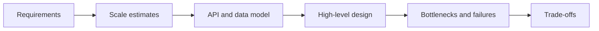

# System Design Interview Guide

System design interview-এর লক্ষ্য কোনো “perfect architecture” বলা নয়। লক্ষ্য হলো ambiguous problem পরিষ্কার করা, scale estimate করা, একটি coherent design তৈরি করা এবং constraints অনুযায়ী trade-off defend করা। এই section component list-এর বদলে সেই decision-making process শেখায়।

## Core learning path

1. [Fundamentals and Interview Approach](./fundamentals-and-approach/)
2. [Scalability](./scalability/)
3. [Databases](./databases/)
4. [Caching](./caching/)
5. [Messaging and Queues](./messaging-queues/)
6. [API Design](./api-design/)

এখানে requirements, capacity estimation, stateless scaling, data model, cache strategy, asynchronous processing এবং external contract-এর ভিত্তি তৈরি হবে।

## Distributed architecture

1. [Distributed Systems](./distributed-systems/)
2. [Microservices](./microservices/)
3. [Storage Systems](./storage-systems/)
4. [Real-World System Designs](./real-world-systems/)

এই অংশে consistency, partitioning, replication, coordination, service boundary এবং workload-specific architecture নিয়ে practice করুন।

## Production readiness

1. [Reliability and Fault Tolerance](./reliability-fault-tolerance/)
2. [Security](./security/)
3. [Observability and Monitoring](./observability/)
4. [Cloud Infrastructure](./cloud-infrastructure/)

একটি design production-ready তখনই, যখন dependency failure, overload, data loss, unauthorized access এবং incident diagnosis-এর পরিকল্পনা থাকে।

## A repeatable interview framework

1. **Clarify:** users, use cases, scope এবং success criteria নির্ধারণ করুন।
2. **Quantify:** traffic, storage, bandwidth ও growth estimate করুন।
3. **Define contracts:** API এবং core data model লিখুন।
4. **Draw the flow:** client থেকে storage পর্যন্ত critical request path দেখান।
5. **Find pressure points:** hot key, large fan-out, slow dependency, queue backlog ও regional failure বিবেচনা করুন।
6. **Choose deliberately:** consistency, latency, availability, cost ও complexity-এর trade-off বলুন।
7. **Operate:** metrics, logs, traces, alerts, deployment ও recovery plan যোগ করুন।

## How to practice

প্রথম pass-এ 35–45 মিনিটের মধ্যে end-to-end design শেষ করুন। দ্বিতীয় pass-এ একটি subsystem—যেমন feed generation, rate limiter বা distributed cache—deep dive করুন। Answer review করার সময় assumptions স্পষ্ট ছিল কি না, numbers design-কে influence করেছে কি না এবং প্রতিটি major choice-এর alternative বলা হয়েছে কি না যাচাই করুন।
